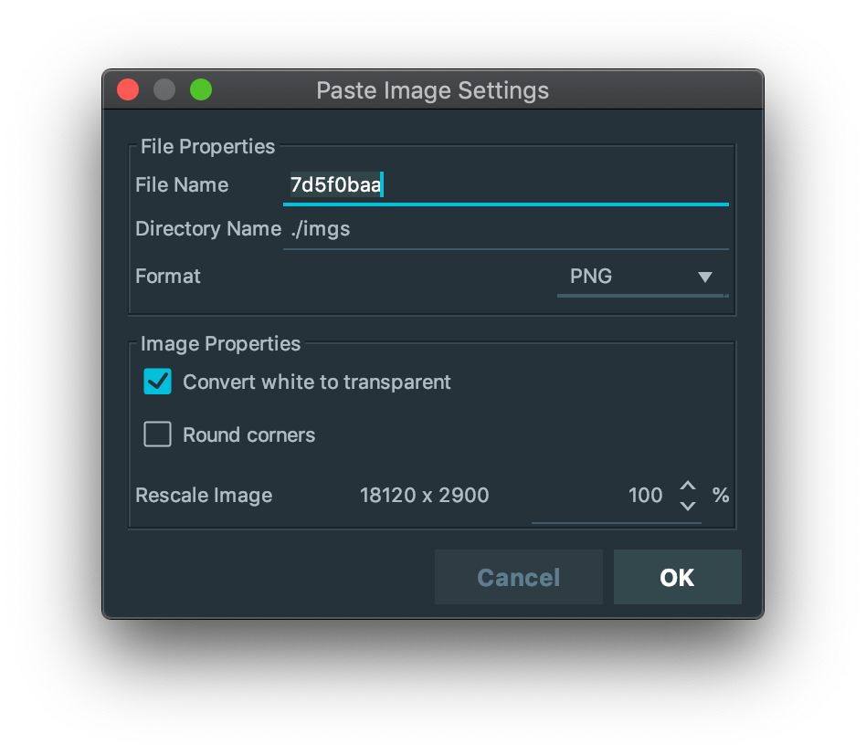
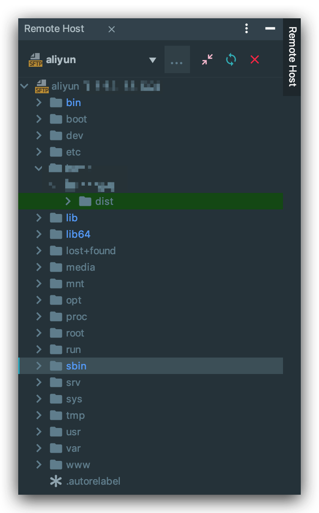
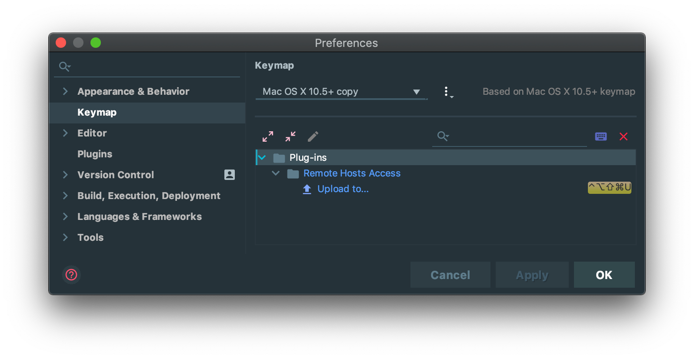

# How can I contribute

由于项目由 [Vuepress](https://vuepress.vuejs.org/zh/) 为模板编写, 因此需要按照一定的规则来组织文档结构.

为了方便文档的编写与修改, 使用了多个 APP 来协同工作, 如果你有更好的编写流程, 可以联系我.

## 目录层次结构

```
├── .vuepress                       # vuepress 配置目录
│   ├── config.js                   # 配置
│   ├── dist                        # build 目录
│   ├── override.styl               # 覆盖样式
│   ├── public                      # 公共文件
│   └── style.styl                  # 自定义样式
├── start                           # 点击 'Fuck it' 之后跳转的目录
│   ├── imgs                        # 当前目录文档需要的图片
│   ├── README.md                   # 当前目录首页
│   ├── introduction.md             # 子文档
├── java                            # 一级分类目录
│   ├── collection                  # 二级分类目录
│   ├── concurrent
│   ├── ee
│   ├── io
│   ├── jvm
│   └── se
│       └── imgs                    # 当前目录文档需要的图片
│       └── README.md               # 当前目录首页
│       └── access_modifier.md      # 子文档
│       └── ...
├── tags                            # vuepress-theme-reco 主题标签目录
│   └── README.md                   # 不需要修改
├── README.md                       # 项目首页
├── about.md                        
├── all.md
├── contact.md
├── contribute.md
...
```

:::warning 注意
1. 每个文档目录下面都必须有一个 `imgs` 目录, 用于保存当前目录文档需要的图片,这样方便随时修改.

2. 文档或图片引用地址设置时, 如果是在当前目录下, 必须添加 `./`, 不然会引用失败.

3. 所有 `<xxx>` 标签必须使用代码行或代码块语法包裹起来, 不然 vuepress 会解析报错.
:::

## 规则说明

- 文档目录下必须有 imgs 目录用于保存图片
- 文件夹使用 `-` 风格命名, 且全部小写
- 文档使用 `_` 风格命名, 且全部小写 (README.md 除外)
- 文档目录下首页必须使用 `README.md` 命名
- 文档名不能以中文命名
- `README.md` 为当前分类的面试题
- 文档目录下的其他文档是对当前分类面试题的解析或者相关知识点的, 被 `README.md` 引用
- 文档中必须使用英文标点, 中英文之间要有空格
- 代码块必须增加对应的 `language`

对于第 7 点, 是个人习惯问题, 也是问了文档看起来更加清晰.

如果使用搜狗输入法, 可以按如下设置:


## APP

为了方便写作业与插入图片, 这里主要使用 Intellij IDEA, 因为当我需要移动文件或者图片时, IDEA 会自动修改引用的地址.

IDEA 自带 Markdown 插件, 但是定制化太少, 而且当插入代码块时, 会提示错误信息, 因此使用 Markdown Navigator 替换.

### Markdown Navigator

需要设置不检查语言, 不然会高亮显示错误的代码块, 看着不舒服


### Paste images into MarkDown

此插件可以将 clipboard 中的图片自动复制到对应的文件夹, 大大提高复制图片的效率



## Typora

Markdown Navigator 的预览功能已经很强大了, 但是有一些标签还是不能很好的解析, 因此会使用 Typora 来快速预览以调整文档.

为了使用 Typora 快速打开当前编辑的文档, 需要对 IDEA 进行设置.

### 添加 External Tools


### 设置快捷键


快捷键设置怎么方便怎么来, 我是使用了 [Karabiner-Elements](https://pqrs.org/osx/karabiner/) 将 `command+control+option+shift` 修改为 `caps_lock`


vuepress 使用 Node.js, 可以热更新, 因此你也可以不使用我这种方式, 直接在浏览器中看效果.

但是在文件解析出错或者文档引用不正确的时候, 热更新会失效, 还得重新执行 `yanr docs:dev` 来启动.

可以结合这 2 种方式一起使用.

### 部署

此文档部署到阿里云服务器, 搞活动打折买的, 拿来做一个静态服务器够用了.

为了方便部署, 这里使用 IDEA 上传编译后的文件到服务器.  (All in IDEA 😎)

**设置方式**:

`Tools --> Deployment --> Configuration`

1. 配置服务器


2. 配置本地目录与服务器目录映射关系


配置好后可以使用 `Remote Host` 视图查看服务器目录



3. 上传


你也可以设置快捷键



光标选中 dist 目录或者某个编译好的文件, 使用快捷键直接上传


