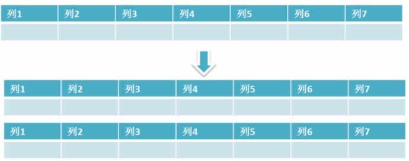
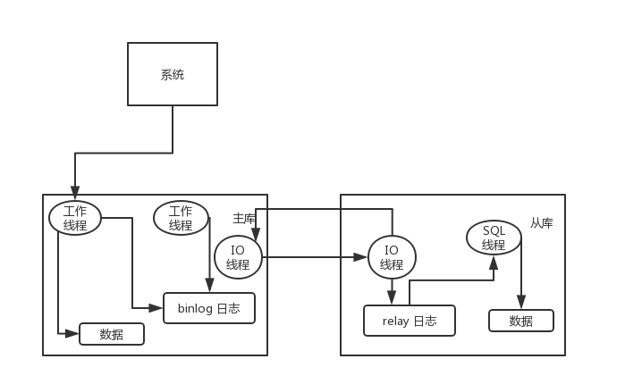

# 数据库

## 什么是事务

**事务是逻辑上的一组操作，要么都执行，要么都不执行。**

事务最经典也经常被拿出来说例子就是转账了。假如小明要给小红转账1000元，这个转账会涉及到两个关键操作就是：将小明的余额减少1000元，将小红的余额增加1000元。万一在这两个操作之间突然出现错误比如银行系统崩溃，导致小明余额减少而小红的余额没有增加，这样就不对了。事务就是保证这两个关键操作要么都成功，要么都要失败。

## 事物的四大特性(ACID)


1. **原子性：** 事务是最小的执行单位，不允许分割。事务的原子性确保动作要么全部完成，要么完全不起作用；
2. **一致性：** 执行事务前后，数据保持一致，多个事务对同一个数据读取的结果是相同的；
3. **隔离性：** 并发访问数据库时，一个用户的事务不被其他事务所干扰，各并发事务之间数据库是独立的；
4. **持久性：** 一个事务被提交之后。它对数据库中数据的改变是持久的，即使数据库发生故障也不应该对其有任何影响。

## 并发事务带来哪些问题

在典型的应用程序中，多个事务并发运行，经常会操作相同的数据来完成各自的任务（多个用户对统一数据进行操作）。并发虽然是必须的，但可能会导致以下的问题。

- **脏读（Dirty read）:** 当一个事务正在访问数据并且对数据进行了修改，而这种修改还没有提交到数据库中，这时另外一个事务也访问了这个数据，然后使用了这个数据。因为这个数据是还没有提交的数据，那么另外一个事务读到的这个数据是“脏数据”，依据“脏数据”所做的操作可能是不正确的。
- **丢失修改（Lost to modify）:** 指在一个事务读取一个数据时，另外一个事务也访问了该数据，那么在第一个事务中修改了这个数据后，第二个事务也修改了这个数据。这样第一个事务内的修改结果就被丢失，因此称为丢失修改。	例如：事务1读取某表中的数据A=20，事务2也读取A=20，事务1修改A=A-1，事务2也修改A=A-1，最终结果A=19，事务1的修改被丢失。
- **不可重复读（Unrepeatableread）:** 指在一个事务内多次读同一数据。在这个事务还没有结束时，另一个事务也访问该数据。那么，在第一个事务中的两次读数据之间，由于第二个事务的修改导致第一个事务两次读取的数据可能不太一样。这就发生了在一个事务内两次读到的数据是不一样的情况，因此称为不可重复读。
- **幻读（Phantom read）:** 幻读与不可重复读类似。它发生在一个事务（T1）读取了几行数据，接着另一个并发事务（T2）插入了一些数据时。在随后的查询中，第一个事务（T1）就会发现多了一些原本不存在的记录，就好像发生了幻觉一样，所以称为幻读。

**不可重复度和幻读区别：**

不可重复读的重点是修改比如多次读取一条记录发现其中某些列的值被修改，幻读的重点在于新增或者删除比如多次读取一条记录发现记录增多或减少了。

## 事务隔离级别有哪些

**SQL 标准定义了四个隔离级别：**

- **READ-UNCOMMITTED(读取未提交)：** 最低的隔离级别，允许读取尚未提交的数据变更，**可能会导致脏读、幻读或不可重复读**。
- **READ-COMMITTED(读取已提交)：** 允许读取并发事务已经提交的数据，**可以阻止脏读，但是幻读或不可重复读仍有可能发生**。
- **REPEATABLE-READ(可重复读)：** 对同一字段的多次读取结果都是一致的，除非数据是被本身事务自己所修改，**可以阻止脏读和不可重复读，但幻读仍有可能发生**。
- **SERIALIZABLE(可串行化)：** 最高的隔离级别，完全服从ACID的隔离级别。所有的事务依次逐个执行，这样事务之间就完全不可能产生干扰，也就是说，**该级别可以防止脏读、不可重复读以及幻读**。

------

| 隔离级别         | 脏读 | 不可重复读 | 幻影读 |
| ---------------- | ---- | ---------- | ------ |
| READ-UNCOMMITTED | √    | √          | √      |
| READ-COMMITTED   | ×    | √          | √      |
| REPEATABLE-READ  | ×    | ×          | √      |
| SERIALIZABLE     | ×    | ×          | ×      |

## MySQL 的默认隔离级别是

MySQL InnoDB 存储引擎的默认支持的隔离级别是 **REPEATABLE-READ（可重读）**。我们可以通过`SELECT @@tx_isolation;`命令来查看

```
mysql> SELECT @@tx_isolation;
+-----------------+
| @@tx_isolation  |
+-----------------+
| REPEATABLE-READ |
+-----------------+
```

这里需要注意的是：与 SQL 标准不同的地方在于 InnoDB 存储引擎在 **REPEATABLE-READ（可重读）**事务隔离级别下使用的是 **Next-Key Lock** 锁算法，因此可以避免幻读的产生，这与其他数据库系统(如 SQL Server)是不同的。所以说 InnoDB 存储引擎的默认支持的隔离级别是 REPEATABLE-READ（可重读） 已经可以完全保证事务的隔离性要求，即达到了 SQL标准的**SERIALIZABLE(可串行化)**隔离级别。

因为隔离级别越低，事务请求的锁越少，所以大部分数据库系统的隔离级别都是**READ-COMMITTED(读取提交内容):**，但是你要知道的是InnoDB 存储引擎默认使用 **REPEATABLE-READ（可重读）**并不会有任何性能损失。

InnoDB 存储引擎在 **分布式事务** 的情况下一般会用到**SERIALIZABLE(可串行化)**隔离级别。

## 锁机制与 InnoDB 锁算法

**MyISAM 和 InnoDB 存储引擎使用的锁：**

- MyISAM 采用表级锁(table-level locking)。
- InnoDB 支持行级锁(row-level locking)和表级锁, 默认为行级锁

**表级锁和行级锁对比：**

- **表级锁：** MySQL中锁定 **粒度最大** 的一种锁，对当前操作的整张表加锁，实现简单，资源消耗也比较少，加锁快，不会出现死锁。其锁定粒度最大，触发锁冲突的概率最高，并发度最低，MyISAM 和 InnoDB 引擎都支持表级锁。
- **行级锁：** MySQL中锁定 **粒度最小** 的一种锁，只针对当前操作的行进行加锁。 行级锁能大大减少数据库操作的冲突。其加锁粒度最小，并发度高，但加锁的开销也最大，加锁慢，会出现死锁。

详细内容可以参考： MySQL锁机制简单了解一下：https://blog.csdn.net/qq_34337272/article/details/80611486

**InnoDB 存储引擎的锁的算法有三种：**

- Record lock：单个行记录上的锁
- Gap lock：间隙锁，锁定一个范围，不包括记录本身
- Next-key lock：record+gap 锁定一个范围，包含记录本身

**相关知识点：**

1. innodb 对于行的查询使用 next-key lock
2. Next-locking keying 为了解决 Phantom Problem 幻读问题
3. 当查询的索引含有唯一属性时，将 next-key lock 降级为 record key
4. Gap 锁设计的目的是为了阻止多个事务将记录插入到同一范围内，而这会导致幻读问题的产生
5. 有两种方式显式关闭 gap锁：（除了外键约束和唯一性检查外，其余情况仅使用record lock） A. 将事务隔离级别设置为 RC B. 将参数 innodb_locks_unsafe_for_binlog 设置为1

## 锁分类（按照是否可写分类）
表级锁和行级锁可以进一步划分为共享锁（s）和排他锁（X）。

### 共享锁（s）

共享锁（Share Locks，简记为 S）又被称为读锁，其他用户可以并发读取数据，但任何事务都不能获取数据上的排他锁，直到已释放所有共享锁。

共享锁 (S 锁) 又称为读锁，若事务 T 对数据对象 A 加上 S 锁，则事务 T 只能读 A；其他事务只能再对 A 加 S 锁，而不能加 X 锁，直到 T 释放 A 上的 S 锁。这就保证了其他事务可以读 A，但在 T 释放 A 上的 S 锁之前不能对 A 做任何修改。

### 排他锁（X）：

排它锁（(Exclusive lock, 简记为 X 锁)）又称为写锁，若事务 T 对数据对象 A 加上 X 锁，则只允许 T 读取和修改 A，其它任何事务都不能再对 A 加任何类型的锁，直到 T 释放 A 上的锁。它防止任何其它事务获取资源上的锁，直到在事务的末尾将资源上的原始锁释放为止。在更新操作 (INSERT、UPDATE 或 DELETE) 过程中始终应用排它锁。

两者之间的区别：

1. 共享锁（S 锁）：如果事务 T 对数据 A 加上共享锁后，则其他事务只能对 A 再加共享锁，不 能加排他锁。获取共享锁的事务只能读数据，不能修改数据。
2. 排他锁（X 锁）：如果事务 T 对数据 A 加上排他锁后，则其他事务不能再对 A 加任任何类型的封锁。获取排他锁的事务既能读数据，又能修改数据。

###  IS 和 IX
当一个事务需要给自己需要的某个资源加锁的时候，如果遇到一个共享锁正锁定着自己需要的资源的时候，自己可以再加一个共享锁，不过不能加排他锁。但是，如果遇到自己需要锁定的资源已经被一个排他锁占有之后，则只能等待该锁定释放资源之后自己才能获取锁定资源并添加自己的锁定。而意向锁的作用就是当一个事务在需要获取资源锁定的时候，如果遇到自己需要的资源已经被排他锁占用的时候，该事务可以需要锁定行的表上面添加一个合适的意向锁。如果自己需要一个共享锁，那么就在表上面添加一个意向共享锁。而如果自己需要的是某行（或者某些行）上面添加一个排他锁的话，则先在表上面添加一个意向排他锁。意向共享锁可以同时并存多个，但是意向排他锁同时只能有一个存在。

InnoDB 另外的两个表级锁：

意向共享锁（IS）： 表示事务准备给数据行记入共享锁，事务在一个数据行加共享锁前必须先取得该表的 IS 锁。

意向排他锁（IX）： 表示事务准备给数据行加入排他锁，事务在一个数据行加排他锁前必须先取得该表的 IX 锁。

注意：

这里的意向锁是表级锁，表示的是一种意向，仅仅表示事务正在读或写某一行记录，在真正加行锁时才会判断是否冲突。意向锁是 InnoDB 自动加的，不需要用户干预。

IX，IS 是表级锁，不会和行级的 X，S 锁发生冲突，只会和表级的 X，S 发生冲突。


## 大表优化

当MySQL单表记录数过大时，数据库的CRUD性能会明显下降，一些常见的优化措施如下：

### 1. 限定数据的范围

务必禁止不带任何限制数据范围条件的查询语句。比如：我们当用户在查询订单历史的时候，我们可以控制在一个月的范围内；

### 2. 读/写分离

经典的数据库拆分方案，主库负责写，从库负责读；

### 3. 垂直分区

**根据数据库里面数据表的相关性进行拆分。** 例如，用户表中既有用户的登录信息又有用户的基本信息，可以将用户表拆分成两个单独的表，甚至放到单独的库做分库。

**简单来说垂直拆分是指数据表列的拆分，把一张列比较多的表拆分为多张表。** 如下图所示，这样来说大家应该就更容易理解了。 


- **垂直拆分的优点：** 可以使得列数据变小，在查询时减少读取的Block数，减少I/O次数。此外，垂直分区可以简化表的结构，易于维护。
- **垂直拆分的缺点：** 主键会出现冗余，需要管理冗余列，并会引起Join操作，可以通过在应用层进行Join来解决。此外，垂直分区会让事务变得更加复杂；

### 4. 水平分区

**保持数据表结构不变，通过某种策略存储数据分片。这样每一片数据分散到不同的表或者库中，达到了分布式的目的。 水平拆分可以支撑非常大的数据量。**

水平拆分是指数据表行的拆分，表的行数超过200万行时，就会变慢，这时可以把一张的表的数据拆成多张表来存放。举个例子：我们可以将用户信息表拆分成多个用户信息表，这样就可以避免单一表数据量过大对性能造成影响。



水平拆分可以支持非常大的数据量。需要注意的一点是：分表仅仅是解决了单一表数据过大的问题，但由于表的数据还是在同一台机器上，其实对于提升MySQL并发能力没有什么意义，所以 **水平拆分最好分库** 。

水平拆分能够 **支持非常大的数据量存储，应用端改造也少**，但 **分片事务难以解决** ，跨节点Join性能较差，逻辑复杂。《Java工程师修炼之道》的作者推荐 **尽量不要对数据进行分片，因为拆分会带来逻辑、部署、运维的各种复杂度** ，一般的数据表在优化得当的情况下支撑千万以下的数据量是没有太大问题的。如果实在要分片，尽量选择客户端分片架构，这样可以减少一次和中间件的网络I/O。

**下面补充一下数据库分片的两种常见方案：**

- **客户端代理：** **分片逻辑在应用端，封装在jar包中，通过修改或者封装JDBC层来实现。** 当当网的 **Sharding-JDBC** 、阿里的TDDL是两种比较常用的实现。
- **中间件代理：** **在应用和数据中间加了一个代理层。分片逻辑统一维护在中间件服务中。** 我们现在谈的 **Mycat** 、360的Atlas、网易的DDB等等都是这种架构的实现。

详细内容可以参考： MySQL大表优化方案: https://segmentfault.com/a/1190000006158186

## MySQL

### MyISAM 和 InnoDB 区别

MyISAM是MySQL的默认数据库引擎（5.5版之前）。虽然性能极佳，而且提供了大量的特性，包括全文索引、压缩、空间函数等，但MyISAM不支持事务和行级锁，而且最大的缺陷就是崩溃后无法安全恢复。不过，5.5版本之后，MySQL引入了InnoDB（事务性数据库引擎），MySQL 5.5版本后默认的存储引擎为InnoDB。

大多数时候我们使用的都是 InnoDB 存储引擎，但是在某些情况下使用 MyISAM 也是合适的比如读密集的情况下。（如果你不介意 MyISAM 崩溃回复问题的话）。

**两者的对比：**

1. **是否支持行级锁** : MyISAM 只有表级锁(table-level locking)，而InnoDB 支持行级锁(row-level locking)和表级锁,默认为行级锁。
2. **是否支持事务和崩溃后的安全恢复： MyISAM** 强调的是性能，每次查询具有原子性,其执行数度比InnoDB类型更快，但是不提供事务支持。但是**InnoDB** 提供事务支持事务，外部键等高级数据库功能。 具有事务(commit)、回滚(rollback)和崩溃修复能力(crash recovery capabilities)的事务安全(transaction-safe (ACID compliant))型表。
3. **是否支持外键：** MyISAM不支持，而InnoDB支持。
4. **是否支持MVCC** ：仅 InnoDB 支持。应对高并发事务, MVCC比单纯的加锁更高效;MVCC只在 `READ COMMITTED` 和 `REPEATABLE READ` 两个隔离级别下工作;MVCC可以使用 乐观(optimistic)锁 和 悲观(pessimistic)锁来实现;各数据库中MVCC实现并不统一。推荐阅读：[MySQL-InnoDB-MVCC多版本并发控制](https://segmentfault.com/a/1190000012650596)

### 索引

MySQL索引使用的数据结构主要有**BTree索引** 和 **哈希索引** 。对于哈希索引来说，底层的数据结构就是哈希表，因此在绝大多数需求为单条记录查询的时候，可以选择哈希索引，查询性能最快；其余大部分场景，建议选择BTree索引。

MySQL的BTree索引使用的是B数中的B+Tree，但对于主要的两种存储引擎的实现方式是不同的。

- **MyISAM:** B+Tree叶节点的data域存放的是数据记录的地址。在索引检索的时候，首先按照B+Tree搜索算法搜索索引，如果指定的Key存在，则取出其 data 域的值，然后以 data 域的值为地址读取相应的数据记录。这被称为“非聚簇索引”。
- **InnoDB:** 其数据文件本身就是索引文件。相比MyISAM，索引文件和数据文件是分离的，其表数据文件本身就是按B+Tree组织的一个索引结构，树的叶节点data域保存了完整的数据记录。这个索引的key是数据表的主键，因此InnoDB表数据文件本身就是主索引。这被称为“聚簇索引（或聚集索引）”。而其余的索引都作为辅助索引，辅助索引的data域存储相应记录主键的值而不是地址，这也是和MyISAM不同的地方。**在根据主索引搜索时，直接找到key所在的节点即可取出数据；在根据辅助索引查找时，则需要先取出主键的值，再走一遍主索引。** **因此，在设计表的时候，不建议使用过长的字段作为主键，也不建议使用非单调的字段作为主键，这样会造成主索引频繁分裂。** PS：整理自《Java工程师修炼之道》

### 查询缓存的使用

::: tip

执行查询语句的时候，会先查询缓存。不过，MySQL 8.0 版本后移除，因为这个功能不太实用

:::

my.cnf加入以下配置，重启MySQL开启查询缓存

```sql
query_cache_type=1
query_cache_size=600000
```

MySQL执行以下命令也可以开启查询缓存

```sql
set global  query_cache_type=1;
set global  query_cache_size=600000;
```

如上，**开启查询缓存后在同样的查询条件以及数据情况下，会直接在缓存中返回结果**。这里的查询条件包括查询本身、当前要查询的数据库、客户端协议版本号等一些可能影响结果的信息。因此任何两个查询在任何字符上的不同都会导致缓存不命中。此外，如果查询中包含任何用户自定义函数、存储函数、用户变量、临时表、MySQL库中的系统表，其查询结果也不会被缓存。

缓存建立之后，MySQL的查询缓存系统会跟踪查询中涉及的每张表，如果这些表（数据或结构）发生变化，那么和这张表相关的所有缓存数据都将失效。

**缓存虽然能够提升数据库的查询性能，但是缓存同时也带来了额外的开销，每次查询后都要做一次缓存操作，失效后还要销毁。** 因此，开启缓存查询要谨慎，尤其对于写密集的应用来说更是如此。如果开启，要注意合理控制缓存空间大小，一般来说其大小设置为几十MB比较合适。此外，**还可以通过sql_cache和sql_no_cache来控制某个查询语句是否需要缓存：**

```sql
select sql_no_cache count(*) from usr;
```

### 主从复制

主库将变更写入 binlog 日志，然后从库连接到主库之后，从库有一个 IO 线程，将主库的 binlog 日志拷贝到自己本地，写入一个 relay 中继日志中。接着从库中有一个 SQL 线程会从中继日志读取 binlog，然后执行 binlog 日志中的内容，也就是在自己本地再次执行一遍 SQL，这样就可以保证自己跟主库的数据是一样的。



这里有一个非常重要的一点，就是从库同步主库数据的过程是串行化的，也就是说主库上并行的操作，在从库上会串行执行。所以这就是一个非常重要的点了，由于从库从主库拷贝日志以及串行执行 SQL 的特点，在高并发场景下，从库的数据一定会比主库慢一些，是**有延时**的。所以经常出现，刚写入主库的数据可能是读不到的，要过几十毫秒，甚至几百毫秒才能读取到。

而且这里还有另外一个问题，就是如果主库突然宕机，然后恰好数据还没同步到从库，那么有些数据可能在从库上是没有的，有些数据可能就丢失了。

所以 MySQL 实际上在这一块有两个机制，一个是**半同步复制**，用来解决主库数据丢失问题；一个是**并行复制**，用来解决主从同步延时问题。

这个所谓**半同步复制**，也叫 `semi-sync` 复制，指的就是主库写入 binlog 日志之后，就会将**强制**此时立即将数据同步到从库，从库将日志写入自己本地的 relay log 之后，接着会返回一个 ack 给主库，主库接收到**至少一个从库**的 ack 之后才会认为写操作完成了。

所谓**并行复制**，指的是从库开启多个线程，并行读取 relay log 中不同库的日志，然后**并行重放不同库的日志**，这是库级别的并行。

#### 


## 数据库的三范式是什么

## 分布式事务

## MySQL 的内连接, 左连接, 右连接有什么区别 

## MySQL 索引是怎么实现的 

## 怎么验证 MySQL 的索引是否满足需求 

## 说一下数据库的事务隔离 

## 说一下 MySQL 常用的引擎 

## 说一下 MySQL 的行锁和表锁 

## 说一下乐观锁和悲观锁 

## MySQL 问题排查都有哪些手段 

## 如何做 MySQL 的性能优化  

## 说下 MySQL 建表的注意事项

## MySQL 的索引实现, B 树和 B+ 树的区别

## 什么是聚簇索引, 为什么 InnoDB 使用聚簇索引

## 什么是覆盖索引, 在什么情况下使用覆盖索引

## 分库分表的设计怎么做, 有什么问题

## 慢查询怎么分析, SQL 查询分析器用过吗, 查看 MySQL 正在执行哪些查询用什么命令

## 千万级数据表如何优化带过滤条件的分页查询

## MySQL 索引, 联合索引(A B) A and B, A or B 会怎么使用索引

## 一张表, 里面有 ID 自增主键, 当 insert 了 17 条记录之后, 删除了第 15,16,17 条记录, 再把 MySQL 重启, 再insert一条记录, 这条记录的 ID 是 18 还是 15

1. 如果表的类型是 MyISAM, 那么是 18. 因为 MyISAM 表会把自增主键的最大 ID 记录到数据文件中, 重启 MySQL 自增主键的最大 ID 也不会丢失.
2. 如果表的类型是 InnoDB, 那么是 15. InnoDB 表只是把自增主键的最大 ID 记录到内存中, 所以重启数据库或者对表进行 OPTIMIZE 操作, 都将导致最大 ID 丢失.

## MySQL 的技术特点是什么

MySQL 数据库软件是一个客户端或服务器系统, 其中包括: 支持各种客户端程序和库的多线程SQL服务器, 不同的后端, 广泛的应用程序编程接口和管理工具. 

## Heap 表是什么

HEAP表存在于内存中, 用于临时高速存储. 

* BLOB 或 TEXT 字段是不允许的
* 只能使用比较运算符=, , =>, = 
* HEAP表不支持AUTO_INCREMENT
* 索引不可为NULL

## MySQL 服务器默认端口是什么

MySQL 服务器的默认端口是 3306

## 与 Oracle 相比, MySQL 有什么优势

* MySQL 是开源软件, 随时可用, 无需付费. 
* MySQL 是便携式的
* 带有命令提示符的GUI. 
* 使用MySQL 查询浏览器支持管理

## 如何区分 FLOAT 和 DOUBLE

以下是 FLOAT 和 DOUBLE 的区别: 

* 浮点数以8位精度存储在FLOAT中, 并且有四个字节. 
* 浮点数存储在DOUBLE中, 精度为18位, 有八个字节. 

## 区分 CHAR_LENGTH 和 LENGTH

CHAR_LENGTH 是字符数, 而 LENGTH 是字节数. Latin 字符的这两个数据是相同的, 但是对于 Unicode 和其他编码, 它们是不同的. 

## 请简洁描述 MySQL 中 InnoDB 支持的四种事务隔离级别名称, 以及逐级之间的区别

SQL 标准定义的四个隔离级别为: 

* read uncommited: 读到未提交数据
* read committed: 脏读, 不可重复读
* repeatable read: 可重读
* serializable: 串行事物


## 在 MySQ 中 ENUM 的用法是什么 

ENUM 是一个字符串对象, 用于指定一组预定义的值, 并可在创建表时使用. 

Create table size(name ENUM('Smail,'Medium','Large');

## 如何定义 REGEXP  

REGEXP是模式匹配, 其中匹配模式在搜索值的任何位置. 

## CHAR 和 VARCHAR 的区别  

以下是CHAR和VARCHAR的区别: 

* CHAR和VARCHAR类型在存储和检索方面有所不同
* CHAR列长度固定为创建表时声明的长度, 长度值范围是1到255

当CHAR值被存储时, 它们被用空格填充到特定长度, 检索CHAR值时需删除尾随空格. 

## 列的字符串类型可以是什么 

字符串类型是: 

* SET
* BLOB
* ENUM
* CHAR
* TEXT
* VARCHAR

## 如何获取当前的 MySQL 版本  

SELECT VERSION();用于获取当前MySQL 的版本. 

## MySQL 中使用什么存储引擎

存储引擎称为表类型, 数据使用各种技术存储在文件中. 

技术涉及: 

* Storage mechanism
* Locking levels
* Indexing
* Capabilities and functions.

## MySQL 驱动程序是什么 

以下是MySQL 中可用的驱动程序: 

* PHP驱动程序
* JDBC驱动程序
* ODBC驱动程序
* CWRAPPER
* PYTHON驱动程序
* PERL驱动程序
* RUBY驱动程序
* CAP11PHP驱动程序
* Ado.net5.mxj

## TIMESTAMP 在 UPDATE CURRENT_TIMESTAMP 数据类型上做什么

创建表时 TIMESTAMP 列用 Zero 更新. 
只要表中的其他字段发生更改, UPDATE CURRENT_TIMESTAMP 修饰符就将时间戳字段更新为当前时间. 

## 主键和候选键有什么区别 **

表格的每一行都由主键唯一标识,一个表只有一个主键. 

主键也是候选键. 按照惯例, 候选键可以被指定为主键, 并且可以用于任何外键引用. 

## 如何使用 Unix shell 登录 MySQL

我们可以通过以下命令登录: 

```shell
# [MySQL dir]/bin/mysql -h hostname -u  -p 
```

## myisamchk 是用来做什么的 

它用来压缩MyISAM表, 这减少了磁盘或内存使用. 

## MYSQL 数据库服务器性能分析的方法命令有哪些


## 如何控制 HEAP 表的最大尺寸 

Heal 表的大小可通过称为 max_heap_table_size 的 MySQL  配置变量来控制. 

## MyISAM Static 和 MyISAM Dynamic 有什么区别 

在MyISAM Static上的所有字段有固定宽度. 动态MyISAM表将具有像TEXT, BLOB等字段, 以适应不同长度的数据类型. 
点击[这里](http://mp.weixin.qq.com/s?__biz=MzI3ODcxMzQzMw==&mid=2247486906&idx=2&sn=9394dec358ec9130a4bbc9ac2b50c6e5&chksm=eb53888cdc24019a7e5a69086b5aff46973865681dd9dcf29a4b03d29036753150c86d16288f&scene=21#wechat_redirect)有一套最全阿里面试题总结. 

MyISAM Static在受损情况下更容易恢复. 

## federated 表是什么

federated表, 允许访问位于其他服务器数据库上的表. 

## 如果一个表有一列定义为TIMESTAMP, 将发生什么

每当行被更改时, 时间戳字段将获取当前时间戳. 

## 列设置为 AUTO INCREMENT 时, 如果在表中达到最大值, 会发生什么情况

它会停止递增, 任何进一步的插入都将产生错误, 因为密钥已被使用. 

## 怎样才能找出最后一次插入时分配了哪个自动增量

LAST_INSERT_ID将返回由Auto_increment分配的最后一个值, 并且不需要指定表名称. 

## 你怎么看到为表格定义的所有索引

索引是通过以下方式为表格定义的: 

SHOW INDEX FROM ;

## LIKE 声明中的 ％ 和 _ 是什么意思

％对应于0个或更多字符, _ 只是 LIKE 语句中的一个字符. 

## 如何在 Unix和 MySQL 时间戳之间进行转换

* UNIX_TIMESTAMP是从MySQL 时间戳转换为Unix时间戳的命令
* FROM_UNIXTIME是从Unix时间戳转换为MySQL 时间戳的命令

## 列对比运算符是什么

在SELECT语句的列比较中使用=, <>,  =, >, >, , AND, OR或LIKE运算符. 

## 我们如何得到受查询影响的行数

行数可以通过以下代码获得: 

SELECT COUNT(user_id)FROM users;

## MySQL 查询是否区分大小写

不区分

SELECT VERSION(), CURRENT_DATE;

SeLect version(), current_date;

seleCt vErSiOn(), current_DATE;

所有这些例子都是一样的, MySQL 不区分大小写. 

## LIKE 和 REGEXP 操作有什么区别

LIKE和REGEXP运算符用于表示^和％. 

| 1 | SELECT * FROM employee WHERE emp_name REGEXP "^b"; |
| 2 | SELECT * FROM employee WHERE emp_name LIKE "%b"; |

## BLOB 和 TEXT 有什么区别

BLOB是一个二进制对象, 可以容纳可变数量的数据. 有四种类型的BLOB -

* TINYBLOB
* BLOB
* MEDIUMBLOB和
* LONGBLOB

它们只能在所能容纳价值的最大长度上有所不同. 

TEXT是一个不区分大小写的BLOB. 四种TEXT类型

* TINYTEXT
* TEXT
* MEDIUMTEXT和
* LONGTEXT

它们对应于四种BLOB类型, 并具有相同的最大长度和存储要求. 

BLOB和TEXT类型之间的唯一区别在于对BLOB值进行排序和比较时区分大小写, 对TEXT值不区分大小写. 

## MySQL _fetch_array 和 MySQL_fetch_object 的区别是什么

以下是mysql_fetch_array和mysql_fetch_object的区别: 

mysql_fetch_array（） - 将结果行作为关联数组或来自数据库的常规数组返回. 

mysql_fetch_object - 从数据库返回结果行作为对象. 

## 我们如何在 MySQL 中运行批处理模式

以下命令用于在批处理模式下运行: 

mysql;

mysql mysql.out

## MyISAM 表格将在哪里存储, 并且还提供其存储格式

每个 MyISAM 表格以三种格式存储在磁盘上: 

·“.frm”文件存储表定义

·数据文件具有“.MYD”（MYData）扩展名

索引文件具有“.MYI”（MYIndex）扩展名

## MySQL 中有哪些不同的表格

共有5种类型的表格: 

* MyISAM
* Heap
* Merge
* INNODB
* ISAM

MyISAM是MySQL 的默认存储引擎. 

## ISAM 是什么

ISAM简称为索引顺序访问方法. 它是由IBM开发的, 用于在磁带等辅助存储系统上存储和检索数据. 

## InnoDB 是什么

lnnoDB 是一个由 Oracle 公司开发的 Innobase Oy 事务安全存储引擎. 

## MySQL****如何优化DISTINCT

DISTINCT在所有列上转换为GROUP BY, 并与ORDER BY子句结合使用. 

| 1 | SELECT DISTINCT t1.a FROM t1,t2 where t1.a=t2.a; |

## 如何输入字符为十六进制数字

如果想输入字符为十六进制数字, 可以输入带有单引号的十六进制数字和前缀（X）, 或者只用（Ox）前缀输入十六进制数字. 

如果表达式上下文是字符串, 则十六进制数字串将自动转换为字符串. 

## 如何显示前 50 行

在MySQL 中, 使用以下代码查询显示前50行: 

```sql
SELECT * FROM LIMIT 0,50;
```

## 可以使用多少列创建索引

任何标准表最多可以创建16个索引列. 

## NOW（）和 CURRENT_DATE（）有什么区别

NOW（）命令用于显示当前年份, 月份, 日期, 小时, 分钟和秒. 

CURRENT_DATE（）仅显示当前年份, 月份和日期. 

## 什么样的对象可以使用 CREATE 语句创建

以下对象是使用CREATE语句创建的: 

* DATABASE
* EVENT
* FUNCTION
* INDEX
* PROCEDURE
* TABLE
* TRIGGER
* USER
* VIEW

## MySQL 表中允许有多少个 TRIGGERS

在MySQL 表中允许有六个触发器, 如下: 

* BEFORE INSERT
* AFTER INSERT
* BEFORE UPDATE
* AFTER UPDATE
* BEFORE DELETE
* AFTER DELETE

## 什么是非标准字符串类型

以下是非标准字符串类型: 

* TINYTEXT
* TEXT
* MEDIUMTEXT
* LONGTEXT

## 什么是通用SQL函数

* CONCAT(A, B) - 连接两个字符串值以创建单个字符串输出. 通常用于将两个或多个字段合并为一个字段. 
* FORMAT(X, D)- 格式化数字X到D有效数字. 
* CURRDATE(), CURRTIME()- 返回当前日期或时间. 
* NOW（） - 将当前日期和时间作为一个值返回. 
* MONTH（）, DAY（）, YEAR（）, WEEK（）, WEEKDAY（） - 从日期值中提取给定数据. 
* HOUR（）, MINUTE（）, SECOND（） - 从时间值中提取给定数据. 
* DATEDIFF（A, B） - 确定两个日期之间的差异, 通常用于计算年龄
* SUBTIMES（A, B） - 确定两次之间的差异. 
* FROMDAYS（INT） - 将整数天数转换为日期值. 

## 解释访问控制列表

ACL（访问控制列表）是与对象关联的权限列表. 这个列表是MySQL 服务器安全模型的基础, 它有助于排除用户无法连接的问题. 

MySQL 将ACL（也称为授权表）缓存在内存中. 当用户尝试认证或运行命令时, MySQL 会按照预定的顺序检查ACL的认证信息和权限. 

## MYSQL 支持事务吗

在缺省模式下, MYSQL是autocommit模式的, 所有的数据库更新操作都会即时提交, 所以在缺省情况下, mysql是不支持事务的. 

但是如果你的MYSQL表类型是使用InnoDB Tables 或 BDB tables的话, 你的MYSQL就可以使用事务处理,使用SET AUTOCOMMIT=0就可以使MYSQL允许在非autocommit模式, 在非autocommit模式下, 你必须使用COMMIT来提交你的更改, 或者用ROLLBACK来回滚你的更改. 

**示例如下: **

```sql
START TRANSACTION;

SELECT @A:=SUM(salary) FROM table1 WHERE type=1;

UPDATE table2 SET summmary=@A WHERE type=1;

COMMIT;
```

## MySQL 里记录货币用什么字段类型好

NUMERIC和DECIMAL类型被MySQL 实现为同样的类型, 这在SQL92标准允许. 他们被用于保存值, 该值的准确精度是极其重要的值, 例如与金钱有关的数据. 当声明一个类是这些类型之一时, 精度和规模的能被(并且通常是)指定；点击[这里](http://mp.weixin.qq.com/s?__biz=MzI3ODcxMzQzMw==&mid=2247486906&idx=2&sn=9394dec358ec9130a4bbc9ac2b50c6e5&chksm=eb53888cdc24019a7e5a69086b5aff46973865681dd9dcf29a4b03d29036753150c86d16288f&scene=21#wechat_redirect)有一套最全阿里面试题总结. 

例如: 

salary DECIMAL(9,2)

在这个例子中, 9(precision)代表将被用于存储值的总的小数位数, 而2(scale)代表将被用于存储小数点后的位数. 

因此, 在这种情况下, 能被存储在salary列中的值的范围是从-9999999.99到9999999.99. 在ANSI/ISO SQL92中, 句法DECIMAL(p)等价于DECIMAL(p,0). 

同样, 句法DECIMAL等价于DECIMAL(p,0), 这里实现被允许决定值p. MySQL 当前不支持DECIMAL/NUMERIC数据类型的这些变种形式的任一种. 

这一般说来不是一个严重的问题, 因为这些类型的主要益处得自于明显地控制精度和规模的能力. 

DECIMAL和NUMERIC值作为字符串存储, 而不是作为二进制浮点数, 以便保存那些值的小数精度. 

一个字符用于值的每一位, 小数点(如果scale>0)和“-”符号(对于负值). 如果scale是0, DECIMAL和NUMERIC值不包含小数点或小数部分. 

DECIMAL和NUMERIC值得最大的范围与DOUBLE一样, 但是对于一个给定的DECIMAL或NUMERIC列, 实际的范围可由制由给定列的precision或scale限制. 

当这样的列赋给了小数点后面的位超过指定scale所允许的位的值, 该值根据scale四舍五入. 

当一个DECIMAL或NUMERIC列被赋给了其大小超过指定(或缺省的）precision和scale隐含的范围的值, MySQL 存储表示那个范围的相应的端点值. 

我希望本文可以帮助你提升技术水平. 那些, 感觉学的好难, 甚至会令你沮丧的人, 别担心, 我认为, 如果你愿意试一试本文介绍的几点, 会向前迈进, 克服这种感觉. 这些要点也许对你不适用, 但你会明确一个重要的道理: 接受自己觉得受困这个事实是摆脱这个困境的第一步. 

## MYSQL 数据表在什么情况下容易损坏

服务器突然断电导致数据文件损坏. 

强制关机, 没有先关闭mysql 服务等. 

## MySQL 有关权限的表都有哪几个

MySQL 服务器通过权限表来控制用户对数据库的访问, 权限表存放在mysql数据库里, 由mysql_install_db脚本初始化. 这些权限表分别user, db, table_priv, columns_priv和host. 

## MySQL 有哪几种锁

* MyISAM支持表锁, InnoDB支持表锁和行锁, 默认为行锁
* 表级锁: 开销小, 加锁快, 不会出现死锁. 锁定粒度大, 发生锁冲突的概率最高, 并发量最低
* 行级锁: 开销大, 加锁慢, 会出现死锁. 锁力度小, 发生锁冲突的概率小, 并发度最高


→ MySQL 执行引擎

→ MySQL 执行计划
如何查看执行计划, 如何根据执行计划进行 SQL 优化

→ 索引
Hash 索引, B 树索引（B+树, 和B树, R树）

普通索引, 唯一索引

覆盖索引, 最左前缀原则, 索引下推

→ SQL 优化
→ 数据库事务和隔离级别
事务的隔离级别, 事务能不能实现锁的功能

→ 数据库锁
行锁, 表锁, 使用数据库锁实现乐观锁, 

→ 连接
内连接, 左连接, 右连接

→ 数据库主备搭建
→ binlog
→ redolog
→ 内存数据库
h2

→ 分库分表
→ 读写分离
→ 常用的 NoSql 数据库
redis, memcached

→ 分别使用数据库锁, NoSql 实现分布式锁
→ 性能调优
→ 数据库连接池