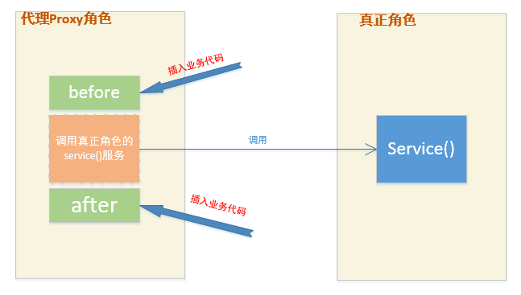

# 代理模式

代理，就是代替原来的角色去做事，下面这张图对代理的解释很生动形象：

## 代码织入

### AspectJ 织入器weaver

#### 编译期织入

compile-time weaving 使用 aspectj 编译器进行编译源码

#### 编译后织入

post-compile weaving 对 class 文件进行织入

#### 类加载期织入

load-time weaving(LTW) 当 class loader 加载类的时候进行织入 

## 静态代理

## 动态代理

### JDK proxy

### [CGLIB](./cglib.md)

### javasist

### JDK 动态代理和 CGLIB 动态代理的区别

1. JDK实现动态代理的代理对象和目标对象必须实现相同的接口; Cglib实现动态代理的原理则是为目标对象创建一个子类座位代理对象。如果目标类实现了接口，则必须用JDK动态代理，否则，两个都可以用。
2. JDK在运算量小的时候性能优于Cglib，运算量大的时候Cglib性能较优
