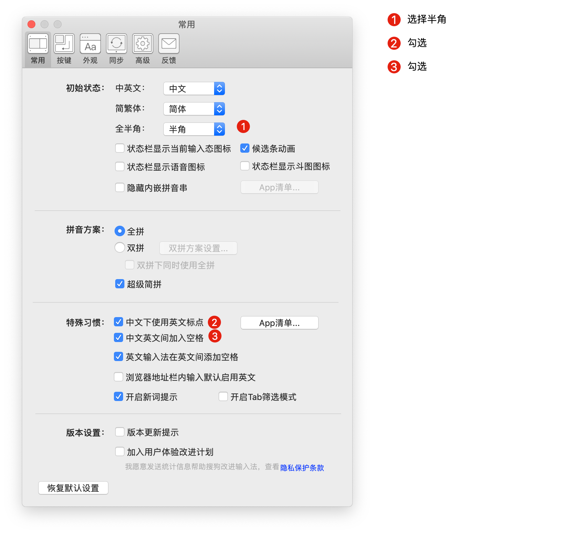
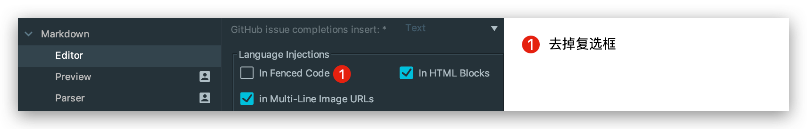
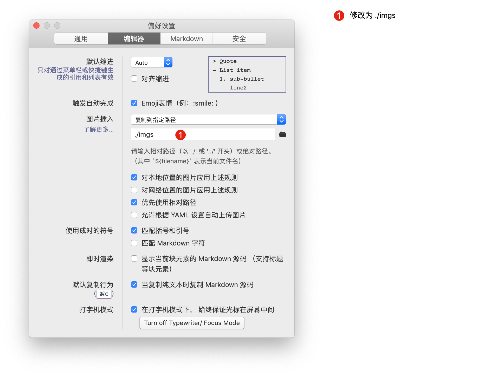
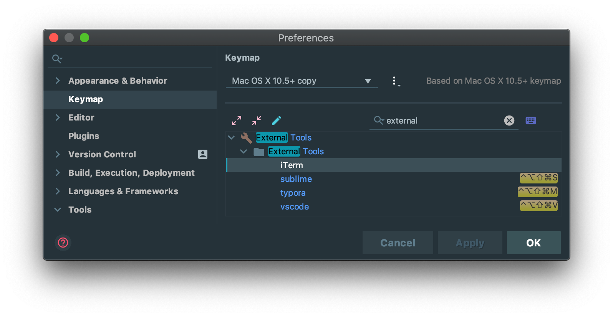
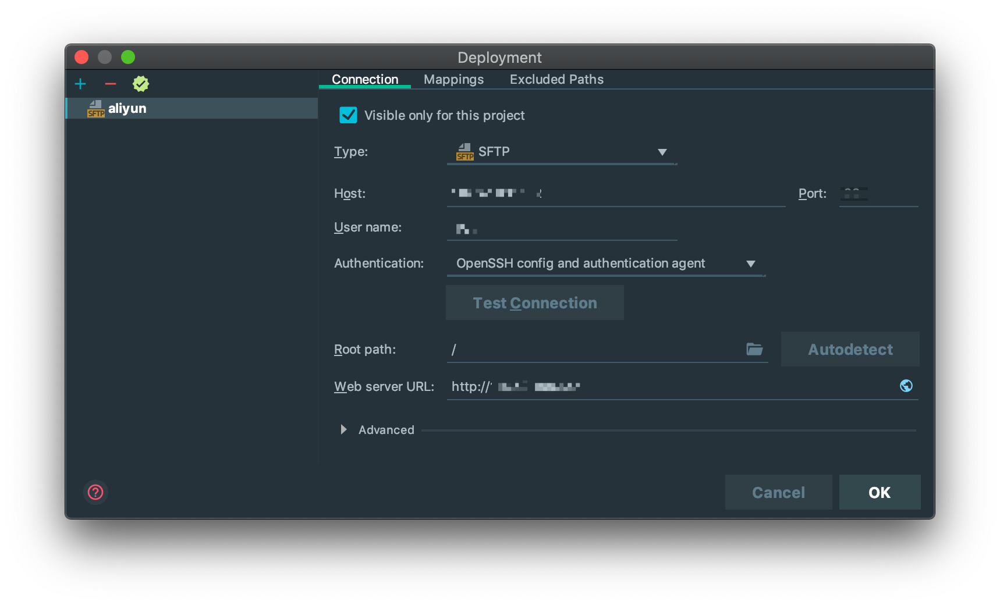
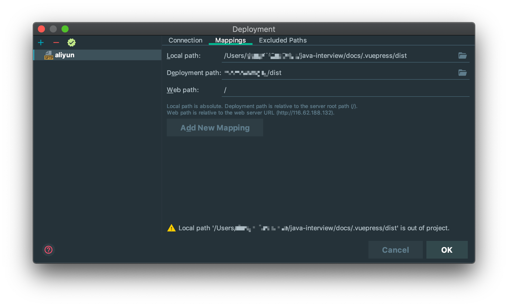
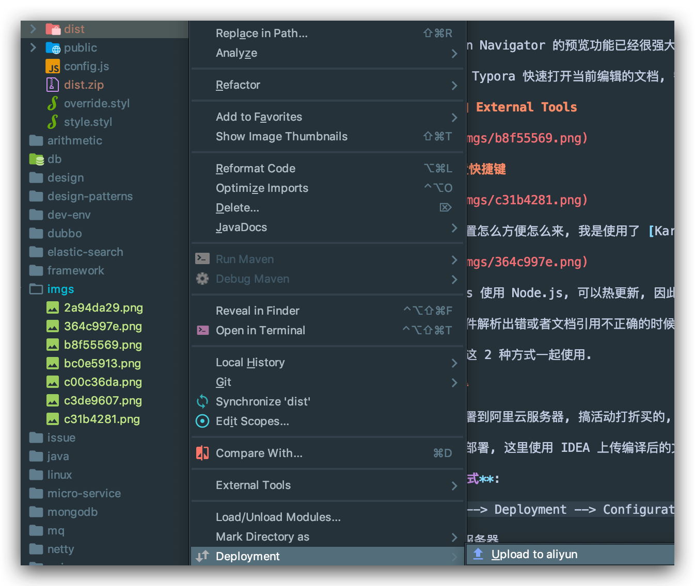

# 贡献

👍 🎉 💖 Hi，感谢你对这个项目感兴趣。💖 🎉 👍

下面是一些内容、规范等等，来帮助你更好的对这个项目进行贡献。包括但不限于：如何增加一篇新文章、如何对文章内容进行更新更正、文章的行文规范等等。

当然，值得注意的是：下面这些内容仅仅是规范而非规则。欢迎来一起完善这个项目！

## 在贡献之前，我应该了解些什么

### Code of Conduct

请先看看我们的行为准则 - [Code of Conduct](./code_of_conduct.md)，并保证贡献内容符合这些规范。如果发现项目中出现了不符合这些规则的内容，欢迎反馈内容。

### 开发路线

目前本项目还在不断更新迭代，会尽量花业余时间持续更新。
包括但不限于: 

1. 持续整理面试题, 更新答案
2. 添加知识点的深入理解
3. 添加个人经验总结
4. 添加工具类使用方法, 提高开发效率快等

希望有一天，能帮助更多的同学入门或者找到合适的工作.

## 我应该从哪里下手

### 反馈问题

当你发现文档中的知识点与你理解的不一样或者确定有错误时, 请一定要 [联系我 (dong4j@gmail.com)](mailto:dong4j@gmail.com)! 

**以纠正我错误的知识点**

或者可以直接到 [Issue 区](https://github.com/dong4j/java-interview/issues/new/choose) 进行反馈, 我会第一时间验证并给予反馈.

### 新增内容

目前最大的问题是面试题太多, 不能全部整理出来, 而且也没有必要, 本项目最大的宗旨是通过面试题检验是否掌握的某个知识点, 而不是**去死记硬背**面试题.

另外，由于个人能力有限，很多知识点我可能没有涉及到，所以你可以对其他知识点进行补充。

如果你确定希望对本项目增加文档, 那么请按照下面的步骤进行贡献:

#### 熟悉项目

由于项目是由 [Vuepress](https://vuepress.vuejs.org/zh/) 构建, 部署并托管在阿里云上的静态网页, 因此希望你在对项目做任何改变前, 先熟悉项目的结构和构建方式:

##### 构建方式

1. 在 [GitHub](https://github.com/dong4j/java-interview) 上 fork 一份本项目到你自己的 GitHub 账号下
2. 将项目 `clone` 到你的本机:

```bash
$ git clone https://github.com/$Your_GitHub_UserName/java-interview.git
```

3. 安装 `Node.js` 和其包管理 `yarn`:

- 如果你依旧在使用 Windows 侧的开发环境，推荐使用 Windows 的「包管理」工具 - [`scoop`](https://github.com/lukesampson/scoop):
  - 安装 `scoop`，PowerShell 中运行：`iex (new-object net.webclient).downloadstring('https://get.scoop.sh')`
  - 安装 `nvm`：`scoop install nvm`
  - 安装最新稳定版本的 `Node.js`：`nvm install latest`
  - 安装 `yarn`：`scoop install yarn`
- 如果使用 macOS, 推荐使用 [brew](https://brew.sh/) 包管理工具:
    - 安装 `brew`, [iterm](https://www.iterm2.com/) 中运行: `/usr/bin/ruby -e "$(curl -fsSL https://raw.githubusercontent.com/Homebrew/install/master/install)"`
    - 安装最新稳定版本的 `Node.js`: `brew install node`
    - 安装 `yarn`: `brew install yarn`

4. 安装相关依赖:

```bash
$ yarn install
```

5. 本地预览:

```bash
$ yarn docs:dev
```
6. 打包

```bash
$ yarn docs:build
```

##### 结构

- `/docs` 文件夹下存放文档 Markdown 文档, 文件夹名, 文件名等即表示相应的文档内容
- `/docs/.vuepress` 文件夹下为 VuePress 的配置文件，添加文档或文件夹时请按原有规则修改, **其他配置请不要随意修改**

```
├── .vuepress                       # vuepress 配置目录
│   ├── config.js                   # 配置
│   ├── dist                        # build 目录
│   ├── override.styl               # 覆盖样式
│   ├── public                      # 公共文件
│   └── style.styl                  # 自定义样式
├── start                           # 点击 'Fuck it' 之后跳转的目录
│   ├── imgs                        # 当前目录文档需要的图片
│   ├── README.md                   # 当前目录首页
│   ├── introduction.md             # 子文档
├── java                            # 一级分类目录
│   ├── collection                  # 二级分类目录
│   ├── concurrent
│   ├── ee
│   ├── io
│   ├── jvm
│   └── se
│       └── imgs                    # 当前目录文档需要的图片
│       └── README.md               # 当前目录首页
│       └── access_modifier.md      # 子文档
│       └── ...
├── tags                            # vuepress-theme-reco 主题标签目录
│   └── README.md                   # 不需要修改
├── README.md                       # 项目首页
├── about.md                        
├── all.md
├── contact.md
├── contribute.md
...
```

:::warning 注意
1. 每个文档目录下面都必须有一个 `imgs` 目录, 用于保存当前目录文档需要的图片,这样方便随时修改.

2. 文档或图片引用地址设置时, 如果是在当前目录下, 必须添加 `./`, 不然会引用失败.

3. 所有 `<xxx>` 标签必须使用代码行或代码块语法包裹起来, 不然 vuepress 会解析报错.
:::

**目录规则以及部分文档说明**

- 文档目录下必须有 imgs 目录用于保存图片
- 文件夹使用 `-` 风格命名, 且全部小写
- 文档使用 `_` 风格命名, 且全部小写 (README.md 除外)
- 文档目录下首页必须使用 `README.md` 命名
- 文档名不能以中文命名
- `README.md` 为当前分类的面试题
- 文档目录下的其他文档是对当前分类面试题的解析或者相关知识点的, 被 `README.md` 引用
- 文档中必须使用英文标点, 中英文之间要有空格
- 代码块必须增加对应的 `language`

对于第 7 点, 是个人习惯问题, 也是问了文档看起来更加清晰.

如果使用搜狗输入法, 可以按如下设置:



#### 明确行文准则

::: warning ❗ 请先明确
为了整个文档统一的格式, 新增内容必须严格符合下文的行文规范.

不符合的内容将会被要求修改. 请谅解.
:::

文章行文规范严格遵守 [中文文案排版指北](https://github.com/sparanoid/chinese-copywriting-guidelines) 中的规范准则。

详细地:

- 空格
  - 行文时, 请在中文与英文, 中文与数字, 英文与数字之间增加空格
  - 一段文字中有超链接的部分, 在超链接的前后使用空格
  - 英文前后接全角标点符号或者表示单位的角标符号时, 不需要加空格
  - 对于有特殊用法的专有名词, 如 macOS, Windows 10, Ubuntu 18.04 等, 英文和数字之间是否空格以官方标准为准
  - 每段文字的开头不需要空两格
- 标点符号
  - **不要重复使用标点符号，尤其是在表达强烈情感的时候**
  - 引号请使用直角引号「」，而不是弯引号 “”
  - ~~一般情况下，一个中文句子中出现了英文部分，仍然使用中文标点，即全角符号~~ (全部使用英文标点)
  - 如果引用一段完整的英文句子, 或是出现在专有名词中的标点, 则不需要更改标点符号

除了 CI 上面的 Markdown Linter, 我本人也会对新增内容进行审核, 请务必遵守上面的行文准则, 当然也要保证文章内容清晰规范.

#### 增加一个知识点

##### 1. 已有目录的情况下

可以查看当前项目下已存在的目录结构, 会划分多级目录, 用于区分不同的知识块.

以 Java 知识点为例子:

| 目录                  | 作用                    |
|:--------------------|:----------------------|
| `/doc/java`         | Java 知识体系主目录          |
| `/doc/java/se`      | Java SE 知识点目录         |
| `/doc/java/se/imgs` | Java SE 知识点文档需要使用到的图片 |

比如需要添加集合相关的知识点:

1. 在 `/doc/java/collection` 目录下添加文档, 图片资源一并添加到当前目录下的 `imgs` 目录下;
2. 在 `/doc/java/collection/README.md` 中添加对应的面试题, 然后引用对应的知识点文档 (当前目录下必须使用 `./` 开头);
3. 修改 `/docs/.vuepress/config.js` 的 `sidebar` 配置项, 在 `collection()` 方法中添加新增文档名;
4. 本地构建 `yarn docs:dev`, 当点击 侧边栏中的 `集合` 后是否跳转到 `Think Deeply - 集合` 页面, 并且侧边栏中是否显示新增的文档;
5. 点击新增的文档引用, 看是否成功且正确跳转;

##### 2. 新建知识点系统目录

比如需要新增 `docker` 相关知识点:

1. 在 `/doc` 目录下新增目录 `docker`;
2. 在 `docker` 目录下新增 `imgs` 目录, 新增 `README.md` 文档并添加相关面试题;
3. 新增相关知识点的文档, 比如 `docker_centos7.md`;
4. 修改 `/docs/.vuepress/config.js` 的 `sidebar` 配置项, 在 `'/start/'` 最后一个节点添加如下

```javascript
{
  title: '✨ Others',
  collapsable: false,
  children: [
    '/docker/'
  ]
}
```

5. 在 `sidebar` 最后面添加如下

```javascript
sidebar: {
  // 配置 /start/ 页的侧边栏显示
  '/start/': [
    {
      ...
    },
    ...
    {
      title: '✨ Others',
      collapsable: false,
      children: [
        '/docker/'
      ]
    }
  ],
    
  ...
  '/tools/': tools("Fuck yourself - 常用工具"),
  '/docker': docker("Docker")
}
```

6. 新增 `docker()` 方法, 将新增的 `docker_centos7.md` 通过此方法显示出来

```javascript
function docker(title) {
  return [
    {
      title,
      collapsable: false,
      children: [
        'docker_centos7',
      ]
    }
  ]
}
```

## 写作流程推荐

为了方便写作业与插入图片, 这里主要使用 Intellij IDEA, 因为当我需要移动文件或者图片时, IDEA 会自动修改引用的地址.

IDEA 自带 Markdown 插件, 但是定制化太少, 而且当插入代码块时, 会提示错误信息, 因此使用 Markdown Navigator 替换.

### Markdown Navigator

需要设置不检查语言, 不然会高亮显示错误的代码块, 看着不舒服



### Paste images into MarkDown

此插件可以将 clipboard 中的图片自动复制到对应的文件夹, 大大提高复制图片的效率


### Typora

Markdown Navigator 的预览功能已经很强大了, 但是有一些标签还是不能很好的解析, 因此会使用 Typora 来快速预览以调整文档.

如果直接使用 `Typora` 编写文档, 需要做以下设置



这样设置后, 可以直接将图片复制到当前目录下的 `imgs` 目录中.

如果是结合 IDEA 使用 `Typora`, 为了能在 IDEA 中快速的使用 `Typora` 打开当前文档, 需要对 IDEA 进行设置如下:

#### 添加 External Tools


#### 设置快捷键



快捷键设置怎么方便怎么来, 我是使用了 [Karabiner-Elements](https://pqrs.org/osx/karabiner/) 将 `command+control+option+shift` 修改为 `caps_lock`


vuepress 使用 Node.js, 可以热更新, 因此你也可以不使用我这种方式, 直接在浏览器中看效果.

但是在文件解析出错或者文档引用不正确的时候, 热更新会失效, 还得重新执行 `yanr docs:dev` 来启动.

可以结合这 2 种方式一起使用.

### 部署

此文档部署到阿里云服务器, 搞活动打折买的, 拿来做一个静态服务器够用了.

为了方便部署, 这里使用 IDEA 上传编译后的文件到服务器.  (All in IDEA 😎)

**设置方式**:

`Tools --> Deployment --> Configuration`

1. 配置服务器



2. 配置本地目录与服务器目录映射关系



配置好后可以使用 `Remote Host` 视图查看服务器目录


3. 上传



你也可以设置快捷键


光标选中 dist 目录或者某个编译好的文件, 使用快捷键直接上传


