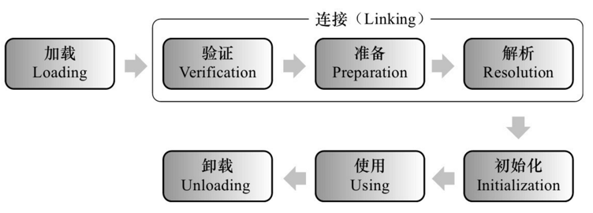
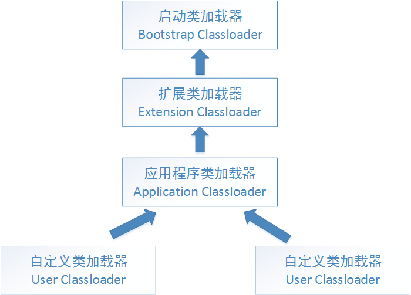

# Java SE 基础 (二)

## 1. equals 的写法

```java
public boolean equals(Object o){
    if(this == o) return true;
    if(o == null) return false;
    if(!o instanceof strudent) return false;
    student s = (student)o;
    if(s.name.equals(this.name) && s.age == this.age) return true;
    else return false;
}
```

## 2. 说说 & 和 && 的区别。 
&和&&都可以用作逻辑与的运算符，表示逻辑与（and），当运算符两边的表达式的结果都为true时，整个运算结果才为true，否则，只要有一方为false，则结果为false。
&&还具有短路的功能，即如果第一个表达式为false，则不再计算第二个表达式，例如，对于if(str != null && !str.equals(“”))表达式，当str为null时，后面的表达式不会执行，所以不会出现NullPointerException如果将&&改为&，则会抛出NullPointerException异常。If(x==33 & ++y>0) y会增长，If(x==33 && ++y>0)不会增长
&还可以用作位运算符，当&操作符两边的表达式不是boolean类型时，&表示按位与操作，我们通常使用0x0f来与一个整数进行&运算，来获取该整数的最低4个bit位，例如，0x31 & 0x0f的结果为0x01。 

备注：这道题先说两者的共同点，再说出&&和&的特殊之处，并列举一些经典的例子来表明自己理解透彻深入、实际经验丰富。

## 3. short s1 = 1; s1 = s1 + 1;有什么错? short s1 = 1; s1 += 1;有什么错? 
对于short s1 = 1; s1 = s1 + 1; 由于s1+1运算时会自动提升表达式的类型，所以结果是int型，再赋值给short类型s1时，编译器将报告需要强制转换类型的错误。
对于short s1 = 1; s1 += 1;由于 += 是java语言规定的运算符，java编译器会对它进行特殊处理，因此可以正确编译。

## 4. char型变量中能不能存贮一个中文汉字?为什么? 
char型变量是用来存储Unicode编码的字符的，unicode编码字符集中包含了汉字，所以，char型变量中当然可以存储汉字啦。不过，如果某个特殊的汉字没有被包含在unicode编码字符集中，那么，这个char型变量中就不能存储这个特殊汉字。补充说明：unicode编码占用两个字节，所以，char类型的变量也是占用两个字节。

## 5. 使用final关键字修饰一个变量时，是引用不能变，还是引用的对象不能变？ 
使用final关键字修饰一个变量时，是指引用变量不能变，引用变量所指向的对象中的内容还是可以改变的。例如，对于如下语句：
 final StringBuffer a=new StringBuffer("immutable");
执行如下语句将报告编译期错误：
a=new StringBuffer("");
但是，执行如下语句则可以通过编译：
a.append(" broken!"); 

有人在定义方法的参数时，可能想采用如下形式来阻止方法内部修改传进来的参数对象：
	public void method(final  StringBuffer  param)
	{
	} 
实际上，这是办不到的，在该方法内部仍然可以增加如下代码来修改参数对象：
		param.append("a");
		
## 6. "==" 和 equals 方法究竟有什么区别？
==操作符专门用来比较两个变量的值是否相等，也就是用于比较变量所对应的内存中所存储的数值是否相同，要比较两个基本类型的数据或两个引用变量是否相等，只能用==操作符。
如果一个变量指向的数据是对象类型的，那么，这时候涉及了两块内存，对象本身占用一块内存（堆内存），变量也占用一块内存，例如Objet obj = new Object();变量obj是一个内存，new Object()是另一个内存，此时，变量obj所对应的内存中存储的数值就是对象占用的那块内存的首地址。对于指向对象类型的变量，如果要比较两个变量是否指向同一个对象，即要看这两个变量所对应的内存中的数值是否相等，这时候就需要用==操作符进行比较。
equals方法是用于比较两个独立对象的内容是否相同，就好比去比较两个人的长相是否相同，它比较的两个对象是独立的。例如，对于下面的代码：
String a=new String("foo");
String b=new String("foo");
两条new语句创建了两个对象，然后用a,b这两个变量分别指向了其中一个对象，这是两个不同的对象，它们的首地址是不同的，即a和b中存储的数值是不相同的，所以，表达式a==b将返回false，而这两个对象中的内容是相同的，所以，表达式a.equals(b)将返回true。
在实际开发中，我们经常要比较传递进行来的字符串内容是否等，例如，String input = …;input.equals(“quit”)，许多人稍不注意就使用==进行比较了，这是错误的，随便从网上找几个项目实战的教学视频看看，里面就有大量这样的错误。记住，字符串的比较基本上都是使用equals方法。
如果一个类没有自己定义equals方法，那么它将继承Object类的equals方法，Object类的equals方法的实现代码如下：
boolean equals(Object o){
return this==o;
}
这说明，如果一个类没有自己定义equals方法，它默认的equals方法（从Object 类继承的）就是使用==操作符，也是在比较两个变量指向的对象是否是同一对象，这时候使用equals和使用==会得到同样的结果，如果比较的是两个独立的对象则总返回false。如果你编写的类希望能够比较该类创建的两个实例对象的内容是否相同，那么你必须覆盖equals方法，由你自己写代码来决定在什么情况即可认为两个对象的内容是相同的。

## 7. 静态变量和实例变量的区别？ 
在语法定义上的区别：静态变量前要加static关键字，而实例变量前则不加。
在程序运行时的区别：实例变量属于某个对象的属性，必须创建了实例对象，其中的实例变量才会被分配空间，才能使用这个实例变量。静态变量不属于某个实例对象，而是属于类，所以也称为类变量，只要程序加载了类的字节码，不用创建任何实例对象，静态变量就会被分配空间，静态变量就可以被使用了。总之，实例变量必须创建对象后才可以通过这个对象来使用，静态变量则可以直接使用类名来引用。
例如，对于下面的程序，无论创建多少个实例对象，永远都只分配了一个staticVar变量，并且每创建一个实例对象，这个staticVar就会加1；但是，每创建一个实例对象，就会分配一个instanceVar，即可能分配多个instanceVar，并且每个instanceVar的值都只自加了1次。

```java
public class VariantTest{
		public static int staticVar = 0; 
		public int instanceVar = 0; 
		public VariantTest(){
			staticVar++;
			instanceVar++;
			System.out.println("staticVar=" + staticVar + ",instanceVar=" + instanceVar);
		}
}
```

## 8. 是否可以从一个static方法内部发出对非static方法的调用？ 
不可以。因为非static方法是要与对象关联在一起的，必须创建一个对象后，才可以在该对象上进行方法调用，而static方法调用时不需要创建对象，可以直接调用。也就是说，当一个static方法被调用时，可能还没有创建任何实例对象，如果从一个static方法中发出对非static方法的调用，那个非static方法是关联到哪个对象上的呢？这个逻辑无法成立，所以，一个static方法内部发出对非static方法的调用。

## 9. Math.round(11.5)等於多少? Math.round(-11.5)等於多少?
Math类中提供了三个与取整有关的方法：ceil、floor、round，这些方法的作用与它们的英文名称的含义相对应，例如，ceil的英文意义是天花板，该方法就表示向上取整，所以，Math.ceil(11.3)的结果为12,Math.ceil(-11.3)的结果是-11；floor的英文意义是地板，该方法就表示向下取整，所以，Math.floor(11.6)的结果为11,Math.floor(-11.6)的结果是-12；最难掌握的是round方法，它表示“四舍五入”，算法为Math.floor(x+0.5)，即将原来的数字加上0.5后再向下取整，所以，Math.round(11.5)的结果为12，Math.round(-11.5)的结果为-11。

## 10. 类的加载机制



类初始化时机：只有当对类的主动使用的时候才会导致类的初始化，类的主动使用包括以下六种：

- 创建类的实例，也就是new的方式
- 访问某个类或接口的静态变量，或者对该静态变量赋值
- 调用类的静态方法
- 反射（如Class.forName(“com.shengsiyuan.Test”)）
- 初始化某个类的子类，则其父类也会被初始化
- Java虚拟机启动时被标明为启动类的类（Java Test），直接使用java.exe命令来运行某个主类

在如下几种情况下，Java虚拟机将结束生命周期

- 执行了System.exit()方法
- 程序正常执行结束
- 程序在执行过程中遇到了异常或错误而异常终止
- 由于操作系统出现错误而导致Java虚拟机进程终止



**启动类加载器：**
Bootstrap ClassLoader，负责加载存放在JDK\jre\lib(JDK代表JDK的安装目录，下同)下，或被-Xbootclasspath参数指定的路径中的，并且能被虚拟机识别的类库（如rt.jar，所有的java.*开头的类均被Bootstrap ClassLoader加载）。启动类加载器是无法被Java程序直接引用的。

**扩展类加载器：**
Extension ClassLoader，该加载器由sun.misc.Launcher$ExtClassLoader实现，它负责加载JDK\jre\lib\ext目录中，或者由java.ext.dirs系统变量指定的路径中的所有类库（如javax.*开头的类），开发者可以直接使用扩展类加载器。

**应用程序类加载器：**
Application ClassLoader，该类加载器由sun.misc.Launcher$AppClassLoader来实现，它负责加载用户类路径（ClassPath）所指定的类，开发者可以直接使用该类加载器，如果应用程序中没有自定义过自己的类加载器，一般情况下这个就是程序中默认的类加载器。

### [双亲委派模型](./jvm/parents_dlegation_mode.md)

::: tip 双亲委派模型的工作流程
如果一个类加载器收到了类加载的请求，它首先不会自己去尝试加载这个类，而是把请求委托给父加载器去完成，依次向上，因此，所有的类加载请求最终都应该被传递到顶层的启动类加载器中，只有当父加载器在它的搜索范围中没有找到所需的类时，即无法完成该加载，子加载器才会尝试自己去加载该类。
:::

**双亲委派机制:**

1. 当AppClassLoader加载一个class时，它首先不会自己去尝试加载这个类，而是把类加载请求委派给父类加载器ExtClassLoader去完成。
2. 当ExtClassLoader加载一个class时，它首先也不会自己去尝试加载这个类，而是把类加载请求委派给BootStrapClassLoader去完成。
3. 如果BootStrapClassLoader加载失败（例如在$JAVA_HOME/jre/lib里未查找到该class），会使用ExtClassLoader来尝试加载；
4. 若ExtClassLoader也加载失败，则会使用AppClassLoader来加载，如果AppClassLoader也加载失败，则会报出异常ClassNotFoundException。

```java
public Class<?> loadClass(String name)throws ClassNotFoundException {
            return loadClass(name, false);
}

protected synchronized Class<?> loadClass(String name, boolean resolve)throws ClassNotFoundException {
	// 首先判断该类型是否已经被加载
	Class c = findLoadedClass(name);
	if (c == null) {
		//如果没有被加载，就委托给父类加载或者委派给启动类加载器加载
		try {
			if (parent != null) {
				 //如果存在父类加载器，就委派给父类加载器加载
				c = parent.loadClass(name, false);
			} else {
			//如果不存在父类加载器，就检查是否是由启动类加载器加载的类，通过调用本地方法native Class findBootstrapClass(String name)
				c = findBootstrapClass0(name);
			}
		} catch (ClassNotFoundException e) {
		 // 如果父类加载器和启动类加载器都不能完成加载任务，才调用自身的加载功能
			c = findClass(name);
		}
	}
	if (resolve) {
		resolveClass(c);
	}
	return c;
}
```

**双亲委派模型意义：**

- 系统类防止内存中出现多份同样的字节码
- 保证Java程序安全稳定运行

**自定义加载器**

```java
package com.neo.classloader;
import java.io.*;

public class MyClassLoader extends ClassLoader {
    private String root;
    protected Class<?> findClass(String name) throws ClassNotFoundException {
        byte[] classData = loadClassData(name);
        if (classData == null) {
            throw new ClassNotFoundException();
        } else {
            return defineClass(name, classData, 0, classData.length);
        }
    }

    private byte[] loadClassData(String className) {
        String fileName = root + File.separatorChar
                + className.replace('.', File.separatorChar) + ".class";
        try {
            InputStream ins = new FileInputStream(fileName);
            ByteArrayOutputStream baos = new ByteArrayOutputStream();
            int bufferSize = 1024;
            byte[] buffer = new byte[bufferSize];
            int length = 0;
            while ((length = ins.read(buffer)) != -1) {
                baos.write(buffer, 0, length);
            }
            return baos.toByteArray();
        } catch (IOException e) {
            e.printStackTrace();
        }
        return null;
    }
    public String getRoot() {
        return root;
    }
    public void setRoot(String root) {
        this.root = root;
    }
    public static void main(String[] args)  {
        MyClassLoader classLoader = new MyClassLoader();
        classLoader.setRoot("E:\\temp");
        Class<?> testClass = null;
        try {
            testClass = classLoader.loadClass("com.neo.classloader.Test2");
            Object object = testClass.newInstance();
            System.out.println(object.getClass().getClassLoader());
        } catch (ClassNotFoundException e) {
            e.printStackTrace();
        } catch (InstantiationException e) {
            e.printStackTrace();
        } catch (IllegalAccessException e) {
            e.printStackTrace();
        }
    }
}
```

## 11. 进程间的通信
1. 管道( pipe)
2. 有名管道 (namedpipe)
3. 信号量(semophore ) 
4. 消息队列( messagequeue ) 
5. 信号 (sinal ) 
6. 共享内存(shared memory ) 
7. 套接字(socket ) 

## 12. 线程间的通信
1. 锁机制：包括互斥锁、条件变量、读写锁
    - 互斥锁提供了以排他方式防止数据结构被并发修改的方法。
    - 读写锁允许多个线程同时读共享数据，而对写操作是互斥的。
    - 条件变量可以以原子的方式阻塞进程，直到某个特定条件为真为止。对条件的测试是在互斥锁的保护下进行的。条件变量始终与互斥锁一起使用。
2. 信号量机制(Semaphore)：包括无名线程信号量和命名线程信号量
3. 信号机制(Signal)：类似进程间的信号处理
    线程间的通信目的主要是用于线程同步，所以线程没有像进程通信中的用于数据交换的通信机制。
    
## 13. 写clone()方法时，通常都有一行代码，是什么？ 
clone 有缺省行为，`super.clone();` 因为首先要把父类中的成员复制到位，然后才是复制自己的成员

## 14. 非静态内部类初始化方式

```java
Outer outer = new Outer();
outer.inner inner = outer.new Inner();
```

## 15. 静态内部类初始化方式

```java
Outer.Inner inner = new Outer.Inner();
```

## 16. String、StringBuffer与StringBuilder之间区别

- StringBuilder >  StringBuffer  >  String
- StringBuilder：线程非安全的
- StringBuffer：线程安全的
- String覆盖了equals方法和hashCode方法，而StringBuffer,StringBuilder没有覆盖equals方法和hashCode方法，所以，将StringBuffer,StringBuilder对象存储进Java集合类中时会出现问题。

## 17. length 和 length() 和 size()

数组是 length 属性
字符串是 length() 方法
集合是 size() 方法

## 18. String s="a"+"b"+"c"+"d";

```java
String s1 = "a";
String s2 = s1 + "b";
String s3 = "a" + "b";
System.out.println(s2 == "ab"); // false
System.out.println(s3 == "ab"); // true
String s = "a" + "b" + "c" + "d";
// javac编译可以对字符串常量直接相加的表达式进行优化，不必要等到运行期去进行加法运算处理，
// 而是在编译时去掉其中的加号，直接将其编译成一个这些常量相连的结果。
System.out.println(s == "abcd"); // true 
```

## 19. final, finally, finalize 的区别。

[final、finally 和 finalize 的区别是什么？](./final_finally_finalize.md)

### final

- final关键字可以用于成员变量、本地变量、方法以及类。
- final成员变量必须在声明的时候初始化或者在构造器中初始化，否则就会报编译错误。
- 你不能够对final变量再次赋值。
- 本地变量必须在声明时赋值。
- 在匿名类中所有变量都必须是final变量。
- final方法不能被重写。
- final类不能被继承。
- final关键字不同于finally关键字，后者用于异常处理。
- final关键字容易与finalize()方法搞混，后者是在Object类中定义的方法，是在垃圾回收之前被JVM调用的方法。
- 接口中声明的所有变量本身是final的。
- final和abstract这两个关键字是反相关的，final类就不可能是abstract的。
- final方法在编译阶段绑定，称为静态绑定(static binding)。
- 没有在声明时初始化final变量的称为空白final变量(blank final variable)，它们必须在构造器中初始化，或者调用this()初始化。不这么做的话，编译器会报错“final变量(变量名)需要进行初始化”。
- 将类、方法、变量声明为final能够提高性能，这样JVM就有机会进行估计，然后优化。
- final 修饰的引用变量的指针不可变,但是引用对象中的值是可以改变的

内存屏障问题

### finally
finally 是异常处理语句结构的一部分，表示总是执行。 
**return 的先后问题**

```java
public class Test {
    public static void main(String[] args) {
        System.out.println(test());
    }
    private static int test() {
        int x = 1;
        try {
            return x;
        } finally {
            ++x;
        }
    }
}
```
返回 1
在执行到 return x 时,已经将值返回,放入到内存栈中, finally 只是执行了 +1操作,并没有改变内存栈中的值

```java
public class Test {
    public static void main(String[] args) {
        System.out.println(test());
    }
    private static int test() {
        int x = 1;
        try {
            return x;
        } finally {
            return ++x;
        }
    }
}
```
返回 2
finally 保存程序会执行,第一个 return 返回值,放入内存栈中,然后 finally 再次返回值,覆盖原来的值

```java
public class Test1 {
    public static void main(String[] args) {
        // TODO Auto-generated method stub
        System.out.println(test());
    }

    private static int test() {
        try {
            return func1();
        } finally {
            return func2();
        }
    }

    private static int func1() {
        System.out.println("func1");
        return 1;
    }

    private static int func2() {
        System.out.println("func2");
        return 2;
    }
}
```
返回结果

```
func1
func2
2
```

### finalize
finalize()是Object类的一个方法，在垃圾收集器执行的时候会调用被回收对象的此方法，可以覆盖此方法提供垃圾收集时的其他资源回收，例如关闭文件等。JVM不保证此方法总被调用
并且 finalize() 只会被执行一次, 所以对象有可能被复活一次

```java
public class CanReliveObj {
    private static CanReliveObj obj;

    @Override
    protected void finalize() throws Throwable {
        super.finalize();
        System.out.println("CanReliveObj finalize called");
        obj = this;
    }

    @Override
    public String toString() {
        return "I am CanReliveObj";
    }

    public static void main(String[] args) throws InterruptedException {
        obj = new CanReliveObj();
        obj = null; // 可复活
        System.gc();
        Thread.sleep(1000);
        if (obj == null) {
            System.out.println("obj 是 null");
        } else {
            System.out.println("obj 可用");
        }
        System.out.println("第二次gc");
        obj = null; // 不可复活
        System.gc();
        Thread.sleep(1000);
        if (obj == null) {
            System.out.println("obj 是 null");
        } else {
            System.out.println("obj 可用");
        }
    }
}
```
返回结果

```
CanReliveObj finalize called
obj 可用
第二次gc
obj 是 null
```

## 20. stop()和suspend()方法为何不推荐使用？

反对使用stop()，是因为它不安全。
>它会解除由线程获取的所有锁定，而且如果对象处于一种不连贯状态，那么其他线程能在那种状态下检查和修改它们。结果很难检查出真正的问题所在。

suspend()方法容易发生死锁。
>调用suspend()的时候，目标线程会停下来，但却仍然持有在这之前获得的锁定。
>此时，其他任何线程都不能访问锁定的资源，除非被"挂起"的线程恢复运行。
>对任何线程来说，如果它们想恢复目标线程，同时又试图使用任何一个锁定的资源，就会造成死锁。所以不应该使用suspend()，而应在自己的Thread类中置入一个标志，指出线程应该活动还是挂起。若标志指出线程应该挂起，便用wait()命其进入等待状态。若标志指出线程应当恢复，则用一个notify()重新启动线程。 

## 21. sleep() 和 wait() 有什么区别? 

sleep就是正在执行的线程主动让出cpu，cpu去执行其他线程，在sleep指定的时间过后，cpu才会回到这个线程上继续往下执行，如果当前线程进入了同步锁，sleep方法并不会释放锁，即使当前线程使用sleep方法让出了cpu，但其他被同步锁挡住了的线程也无法得到执行。wait是指在一个已经进入了同步锁的线程内，让自己暂时让出同步锁，以便其他正在等待此锁的线程可以得到同步锁并运行，只有其他线程调用了notify方法（notify并不释放锁，只是告诉调用过wait方法的线程可以去参与获得锁的竞争了，但不是马上得到锁，因为锁还在别人手里，别人还没释放。如果notify方法后面的代码还有很多，需要这些代码执行完后才会释放锁，可以在notfiy方法后增加一个等待和一些代码，看看效果），调用wait方法的线程就会解除wait状态和程序可以再次得到锁后继续向下运行

```java
public class MultiThread {
    public static void main(String[] args) {
        new Thread(new Thread1()).start();
        try {
            Thread.sleep(10);
        } catch (InterruptedException e) {
            e.printStackTrace();
        }
        new Thread(new Thread2()).start();
    }

    private static class Thread1 implements Runnable {
        @Override
        public void run() {
            // 由于这里的Thread1和下面的Thread2内部run方法要用同一对象作为监视器，
            // 我们这里不能用this，因为在Thread2里面的this和这个Thread1的this不是同一个对象。我们用MultiThread.class这个字节码对象，
            // 当前虚拟机里引用这个变量时，指向的都是同一个对象。
            synchronized (MultiThread.class) {
                System.out.println("enter thread1...");
                System.out.println("thread1 is waiting");
                try {
                    // 释放锁有两种方式，第一种方式是程序自然离开监视器的范围，也就是离开了synchronized关键字管辖的代码范围，
                    // 另一种方式就是在synchronized关键字管辖的代码内部调用监视器对象的wait方法。这里，使用wait方法释放锁。
                    MultiThread.class.wait();
                } catch (InterruptedException e) {
                    e.printStackTrace();
                }
                System.out.println("thread1 is going on...");
                System.out.println("thread1 is being over!");
            }
        }

    }

    private static class Thread2 implements Runnable {
        @Override
        public void run() {
            synchronized (MultiThread.class) {
                System.out.println("enter thread2...");
                System.out.println("thread2 notify other thread can release wait status..");
                // 由于notify方法并不释放锁， 即使thread2调用下面的sleep方法休息了10毫秒，
                // 但thread1仍然不会执行，因为thread2没有释放锁，所以Thread1无法得不到锁。
                MultiThread.class.notify();
                System.out.println("thread2 is sleeping ten millisecond...");
                try {
                    Thread.sleep(10);
                } catch (InterruptedException e) {
                    e.printStackTrace();
                }
                System.out.println("thread2 is going on...");
                System.out.println("thread2 is being over!");
            }
        }
    }
}
```

## 22. 多线程有几种实现方法?同步有几种实现方法? 

多线程有两种实现方法，分别是继承Thread类与实现Runnable接口 
同步的实现方面有两种，分别是synchronized,wait与notify 
wait():使一个线程处于等待状态，并且释放所持有的对象的lock。 
sleep():使一个正在运行的线程处于睡眠状态，是一个静态方法，调用此方法要捕捉InterruptedException异常。 
notify():唤醒一个处于等待状态的线程，注意的是在调用此方法的时候，并不能确切的唤醒某一个等待状态的线程，而是由JVM确定唤醒哪个线程，而且不是按优先级。 
Allnotity():唤醒所有处入等待状态的线程，注意并不是给所有唤醒线程一个对象的锁，而是让它们竞争。

## 23. 当一个线程进入一个对象的一个synchronized方法后，其它线程是否可进入此对象的其它方法? 

分几种情况：

1. 其他方法前是否加了synchronized关键字，如果没加，则能。
2. 如果这个方法内部调用了wait，则可以进入其他synchronized方法。
3. 如果其他个方法都加了synchronized关键字，并且内部没有调用wait，则不能。
4. 如果其他方法是static，它用的同步锁是当前类的字节码，与非静态的方法不能同步，因为非静态的方法用的是this。

## 24. Java 锁的种类

1. 自旋锁

```java
public class SpinLock {
  private AtomicReference<Thread> sign =new AtomicReference<>();
  public void lock(){
		Thread current = Thread.currentThread();
		while(!sign.compareAndSet(null, current)){
		}
}
public void unlock (){
	Thread current = Thread.currentThread();
	sign.compareAndSet(current, null);
  }
}
```
2. 自旋锁的其他种类
3. 阻塞锁
    - synchronized 关键字（其中的重量锁）
    - ReentrantLock
    
	```java
	Lock lock = new ReentrantLock();  
	lock.lock();  
	try {   
		// update object state  
	}  
	finally {  
		lock.unlock();   
	}  
	```
    - Object.wait()\notify()
    - LockSupport.park()/unpart()
4. 可重入锁
    - ReentrantLockß
5. 读写锁
6. 互斥锁
7. 悲观锁
8. 乐观锁
9. 公平锁
10. 非公平锁
11. 偏向锁
12. 对象锁
13. 线程锁
14. 锁粗化
15. 轻量级锁
16. 锁消除
17. 锁膨胀
18. 信号量

## 25. 简述synchronized和java.util.concurrent.locks.Lock的异同 ？ 

主要相同点：Lock能完成synchronized所实现的所有功能 
主要不同点：Lock有比synchronized更精确的线程语义和更好的性能。synchronized会自动释放锁，而Lock一定要求程序员手工释放，并且必须在finally从句中释放。Lock还有更强大的功能，例如，它的tryLock方法可以非阻塞方式去拿锁。 

```java
import java.util.concurrent.locks.Lock;
import java.util.concurrent.locks.ReentrantLock;
public class ThreadTest {
    private int j;
    private Lock lock = new ReentrantLock();
    public static void main(String[] args) {
        ThreadTest tt = new ThreadTest();
        for (int i = 0; i < 2; i++) {
            new Thread(tt.new Adder()).start();
            new Thread(tt.new Subtractor()).start();
        }
    }
    private class Subtractor implements Runnable {
        public void run() {
            while (true) {
                synchronized (ThreadTest.this) {
                    System.out.println("j--=" + j--);
                }
                //lock.lock();
                //try {
                //    System.out.println("j--=" + j--);
                //} finally {
                //    lock.unlock();
                //}
            }
        }
    }
    private class Adder implements Runnable {
        public void run() {
            while (true) {
                synchronized (ThreadTest.this) {
                    System.out.println("j++=" + j++);
                }
                //lock.lock();
                //try {
                //    System.out.println("j++=" + j++);
                //} finally {
                //    lock.unlock();
                //}
            }
        }
    }
}
```

## 26. 设计4个线程，其中两个线程每次对j增加1，另外两个线程对j每次减少1。写出程序。 

```java
public class ThreadTest1 {
    private int j;

    public static void main(String args[]) {
        ThreadTest1 tt  = new ThreadTest1();
        Inc         inc = tt.new Inc();
        Dec         dec = tt.new Dec();
        for (int i = 0; i < 2; i++) {
            Thread t = new Thread(inc);
            t.start();
            t = new Thread(dec);
            t.start();
        }
    }

    class Inc implements Runnable {
        public void run() {
            for (int i = 0; i < 2; i++) {
                inc();
            }
        }
    }

    class Dec implements Runnable {
        public void run() {
            for (int i = 0; i < 2; i++) {
                dec();
            }
        }
    }

    private synchronized void inc() {
        j++;
        System.out.println(Thread.currentThread().getName() + "-inc:" + j);
    }

    private synchronized void dec() {
        j--;
        System.out.println(Thread.currentThread().getName() + "-dec:" + j);
    }
}
```

## 27. 子线程循环2次，接着主线程循环5次，接着又回到子线程循环2次，接着再回到主线程又循环5次，如此循环5次，请写出程序。

```java
public class ThreadTest2 {
    public static void main(String[] args) {
        new ThreadTest2().init();
    }
    public void init() {
        final Business business = new Business();
        new Thread(
            new Runnable() {
                public void run() {
                    for (int i = 0; i < 5; i++) {
                        // 执行子线程
                        business.subThread(i);
                    }
                }
            }
        ).start();

        for (int i = 0; i < 5; i++) {
            business.mainThread(i);
        }
    }

    private class Business {
        boolean flag = true;//这里相当于定义了控制该谁执行的一个信号灯

        // 主线程开始执行 由于 flag=false 直接输出5次
        public synchronized void mainThread(int i) {
            if (flag)
                try {
                    this.wait();
                } catch (InterruptedException e) {
                    e.printStackTrace();
                }

            for (int j = 0; j < 5; j++) {
                System.out.println(Thread.currentThread().getName() + ":i=" + i + ",j=" + j);
            }
            flag = true;
            // 唤醒子线程
            this.notify();
        }

        // 多个线程执行此段代码时,获得锁的才能进入执行
        // 子线程先获得锁,然后信号为 true, 执行输出2次,最后信号,唤醒其他线程

        // 第二个线程进入时,由于 flag= false 进入阻塞状态
        public synchronized void subThread(int i) {
            if (!flag) {
                try {
                    this.wait();
                } catch (InterruptedException e) {
                    e.printStackTrace();
                }
            }
            // 执行2次子线程
            for (int j = 0; j < 2; j++) {
                System.out.println(Thread.currentThread().getName() + ":i=" + i + ",j=" + j);
            }
            // 子线程执行完了,将信号设置为关闭
            flag = false;
            // 唤醒另外的线程
            this.notify();
        }
    }
}
```

```java
public class ThreadTest3 {
    private static boolean flag = false;

    public static void main(String[] args) {
        new Thread(
            new Runnable() {
                public void run() {
                    for (int i = 0; i < 5; i++) {
                        synchronized (ThreadTest3.class) {
                            // 第二个子线程要等到主线程执行完一次后才能执行
                            if (flag) {
                                try {
                                    ThreadTest3.class.wait();
                                } catch (InterruptedException e) {
                                    e.printStackTrace();
                                }
                            }
                            for (int j = 0; j < 2; j++) {
                                System.out.println(
                                        Thread.currentThread().getName() +
                                                "i=" + i + ",j=" + j);
                            }
                            flag = true;
                            ThreadTest3.class.notify();
                        }
                    }
                }
            }
        ).start();

        for (int i = 0; i < 5; i++) {
            synchronized (ThreadTest3.class) {
                if (!flag) {
                    try {
                        ThreadTest3.class.wait();
                    } catch (InterruptedException e) {
                        e.printStackTrace();
                    }
                }
                for (int j = 0; j < 5; j++) {
                    System.out.println(
                            Thread.currentThread().getName() +
                                    "i=" + i + ",j=" + j);
                }
                flag = false;
                ThreadTest3.class.notify();
            }
        }
    }
}
```

```java
import java.util.concurrent.Executors;
import java.util.concurrent.ExecutorService;
import java.util.concurrent.locks.Lock;
import java.util.concurrent.locks.ReentrantLock;
import java.util.concurrent.locks.Condition;

public class ThreadTest4 {
    private static Lock      lock               = new ReentrantLock();
    private static Condition subThreadCondition = lock.newCondition();
    private static boolean   flag               = true;

    public static void main(String[] args) {
        ExecutorService threadPool = Executors.newFixedThreadPool(3);
        threadPool.execute(new Runnable() {
            public void run() {
                for (int i = 0; i < 5; i++) {
                    // 获得锁
                    lock.lock();
                    try {
                        if (!flag)
                            subThreadCondition.await();
                        for (int j = 0; j < 2; j++) {
                            System.out.println(Thread.currentThread().getName() + ",j=" + j);
                        }
                        flag = false;
                        subThreadCondition.signal();
                    } catch (Exception e) {
                    } finally {
                        lock.unlock();
                    }
                }
            }
        });
        threadPool.shutdown();
        for (int i = 0; i < 5; i++) {
            lock.lock();
            try {
                if (flag)
                    subThreadCondition.await();
                for (int j = 0; j < 5; j++) {
                    System.out.println(Thread.currentThread().getName() + ",j=" + j);
                }
                flag = true;
                subThreadCondition.signal();
            } catch (Exception e) {
            } finally {
                lock.unlock();
            }
        }
    }
}
```


## 28. 数据库驱动为什么要使用 Class.forName()

在Java开发特别是数据库开发中，经常会用到Class.forName( )这个方法。通过查询Java Documentation我们会发现使用Class.forName( )静态方法的目的是为了动态加载类。在加载完成后，一般还要调用Class下的newInstance( )静态方法来实例化对象以便操作。

因此，单单使用Class.forName( )是动态加载类是没有用的，其最终目的是为了实例化对象。
Class.forName("")返回的是类
Class.forName("").newInstance()返回的是object

刚才提到，Class.forName("");的作用是要求JVM查找并加载指定的类，如果在类中有静态初始化器的话，JVM必然会执行该类的静态代码段。
而在JDBC规范中明确要求这个Driver类必须向DriverManager注册自己，即任何一个JDBC Driver的 Driver类的代码都必须类似如下：

```java
public class MyJDBCDriver implements Driver {
    static {
        DriverManager.registerDriver(new MyJDBCDriver());
        }
}
```

既然在静态初始化器的中已经进行了注册，所以我们在使用JDBC时只需要Class.forName(XXX.XXX);就可以了。

```
we just want to load the driver to jvm only, 
but not need to user the instance of driver, 
so call Class.forName(xxx.xx.xx) is enough, 
if you call Class.forName(xxx.xx.xx).newInstance(), 
the result will same as calling Class.forName(xxx.xx.xx), 
because Class.forName(xxx.xx.xx).newInstance() will load driver first, 
and then create instance, but the instacne you will never use in usual,
so you need not to create it.
```

总结：jdbc数据库驱动程序最终的目的，是为了程序员能拿到数据库连接，而进行jdbc规范的数据库操作。拿到连接的过程是不需要你自己来实例化驱动程序的，而是通过 DriverManger.getConnection(string str); 。因此一般情况下，对于程序员来说，除非特别需求，是不会自己去实例化一个数据库驱动使用里面的方法的。