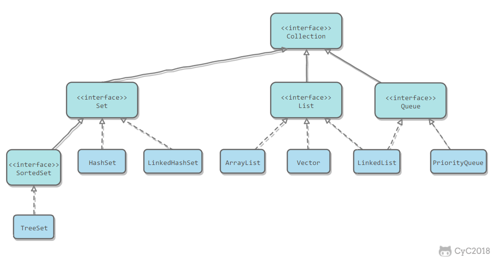
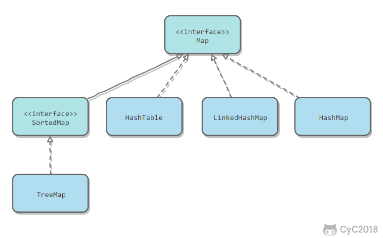
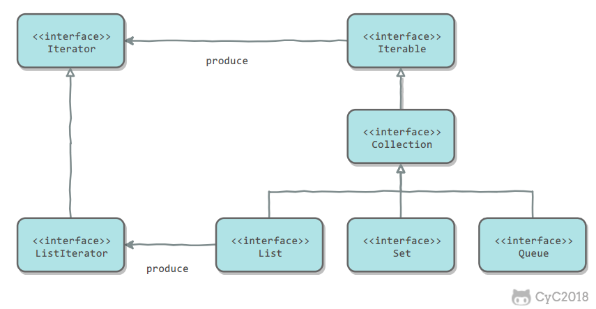

# Collection

容器主要包括 Collection 和 Map 两种，Collection 存储着对象的集合，而 Map 存储着键值对（两个对象）的映射表。

## Collection



### [👉 List](./list.md)

- ArrayList：基于动态数组实现，支持随机访问。
- Vector：和 ArrayList 类似，但它是线程安全的。
- LinkedList：基于双向链表实现，只能顺序访问，但是可以快速地在链表中间插入和删除元素。不仅如此，LinkedList 还可以用作栈、队列和双向队列。


### [👉 Set](./set.md)

- TreeSet：基于红黑树实现，支持有序性操作，例如根据一个范围查找元素的操作。但是查找效率不如 HashSet，HashSet 查找的时间复杂度为 O(1)，TreeSet 则为 O(logN)。
- HashSet：基于哈希表实现，支持快速查找，但不支持有序性操作。并且失去了元素的插入顺序信息，也就是说使用 Iterator 遍历 HashSet 得到的结果是不确定的。
- LinkedHashSet：具有 HashSet 的查找效率，且内部使用双向链表维护元素的插入顺序。

### [👉 Map](./map.md)



- TreeMap：基于红黑树实现。
- HashMap：基于哈希表实现。
- HashTable：和 HashMap 类似，但它是线程安全的，这意味着同一时刻多个线程可以同时写入 HashTable 并且不会导致数据不一致。它是遗留类，不应该去使用它。现在可以使用 ConcurrentHashMap 来支持线程安全，并且 ConcurrentHashMap 的效率会更高，因为 ConcurrentHashMap 引入了分段锁。
- LinkedHashMap：使用双向链表来维护元素的顺序，顺序为插入顺序或者最近最少使用（LRU）顺序。

### Queue

- LinkedList：可以用它来实现双向队列。
- PriorityQueue：基于堆结构实现，可以用它来实现优先队列。

## 容器中的设计模式

### 迭代器模式



Collection 继承了 Iterable 接口，其中的 iterator() 方法能够产生一个 Iterator 对象，通过这个对象就可以迭代遍历 Collection 中的元素。

从 JDK 1.5 之后可以使用 foreach 方法来遍历实现了 Iterable 接口的聚合对象。

```
List<String> list = new ArrayList<>();
list.add("a");
list.add("b");
for (String item : list) {
    System.out.println(item);
}
```

### 适配器模式

java.util.Arrays#asList() 可以把数组类型转换为 List 类型。

```
@SafeVarargs
public static <T> List<T> asList(T... a)
```

应该注意的是 asList() 的参数为泛型的变长参数，不能使用基本类型数组作为参数，只能使用相应的包装类型数组。

```
Integer[] arr = {1, 2, 3};
List list = Arrays.asList(arr);
```

也可以使用以下方式调用 asList()：

```
List list = Arrays.asList(1, 2, 3);
```