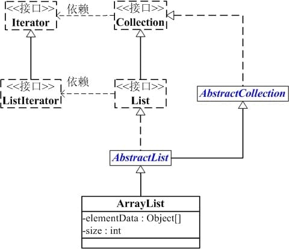
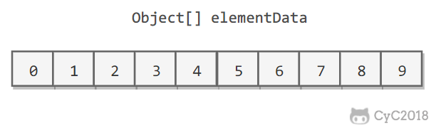
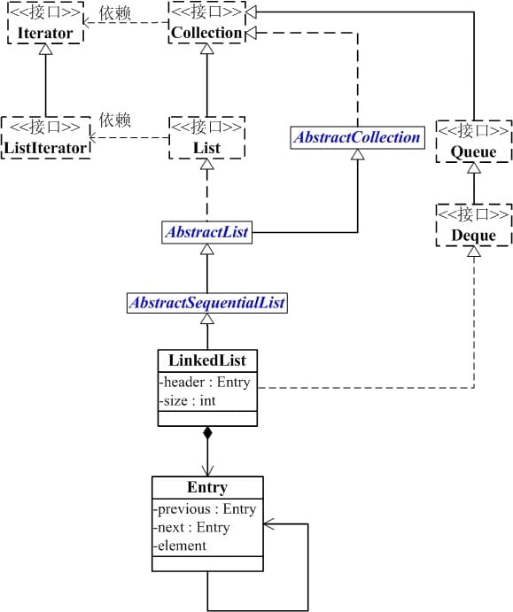
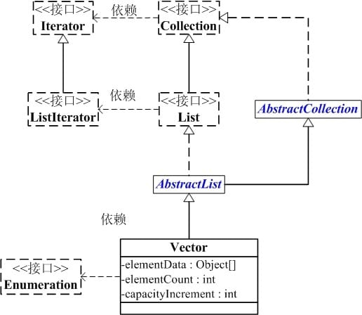
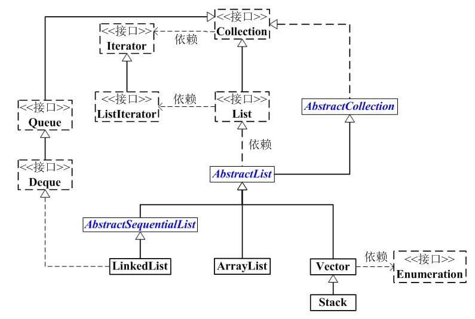

# List

## ArrayList

`ArrayList` 实现于 `List`、`RandomAccess` 接口。可以插入空数据，也支持随机访问。




```java
public class ArrayList<E> extends AbstractList<E>
        implements List<E>, RandomAccess, Cloneable, java.io.Serializable
```

```java
private static final int DEFAULT_CAPACITY = 10;
```


- 底层基于泛型数组
- 它允许所有元素, 包括 null
- ArrayList 实际上是通过一个数组去保存数据的.当我们构造 ArrayList 时；若使用默认构造函数, 则 ArrayList 的默认容量大小是 `10`.
- ArrayList 最大容量为 `Integer.MAX_VALUE - 8`;
- 当 ArrayList 容量不足以容纳全部元素时, ArrayList 会重新设置容量 :新的容量= `原始容量 * 1.5 + 1`.
- ArrayList 的克隆函数, 即是将全部元素克隆到一个数组中.
- ArrayList 实现 java.io.Serializable 的方式. 当写入到输出流时, 先写入“容量”,  再依次写入“每一个元素”；当读出输入流时, 先读取“容量”, 再依次读取“每一个元素”.

### 遍历方式

使用迭代器遍历

```java
Integer value = null;
Iterator iter = list.iterator();
while (iter.hasNext()) {
    value = (Integer)iter.next();
}
```

使用 RandomAccess 提供的 get() 方法遍历 (最快)

```java
Integer value = null;
int size = list.size();
for (int i=0; i<size; i++) {
    value = (Integer)list.get(i);        
}
```

foreach

```java
Integer value = null;
for (Integer integ:list) {
    value = integ;
}
```

### 扩容

添加元素时使用 ensureCapacityInternal() 方法来保证容量足够，如果不够时，需要使用 grow() 方法进行扩容，新容量的大小为 oldCapacity + (oldCapacity >> 1)，也就是旧容量的 1.5 倍。

扩容操作需要调用 Arrays.copyOf() 把原数组整个复制到新数组中，这个操作代价很高，因此最好在创建 ArrayList 对象时就指定大概的容量大小，减少扩容操作的次数。

**ArrayList 有三种方式来初始化，构造方法源码如下：**

```java
/**
 * 默认初始容量大小
 */
private static final int DEFAULT_CAPACITY = 10;


private static final Object[] DEFAULTCAPACITY_EMPTY_ELEMENTDATA = {};

/**
 *默认构造函数，使用初始容量10构造一个空列表(无参数构造)
 */
public ArrayList() {
    this.elementData = DEFAULTCAPACITY_EMPTY_ELEMENTDATA;
}

/**
 * 带初始容量参数的构造函数。（用户自己指定容量）
 */
public ArrayList(int initialCapacity) {
    if (initialCapacity > 0) {//初始容量大于0
        //创建initialCapacity大小的数组
        this.elementData = new Object[initialCapacity];
    } else if (initialCapacity == 0) {//初始容量等于0
        //创建空数组
        this.elementData = EMPTY_ELEMENTDATA;
    } else {//初始容量小于0，抛出异常
        throw new IllegalArgumentException("Illegal Capacity: "+
                                           initialCapacity);
    }
}


/**
*构造包含指定collection元素的列表，这些元素利用该集合的迭代器按顺序返回
*如果指定的集合为null，throws NullPointerException。 
*/
public ArrayList(Collection<? extends E> c) {
    elementData = c.toArray();
    if ((size = elementData.length) != 0) {
        // c.toArray might (incorrectly) not return Object[] (see 6260652)
        if (elementData.getClass() != Object[].class)
            elementData = Arrays.copyOf(elementData, size, Object[].class);
    } else {
        // replace with empty array.
        this.elementData = EMPTY_ELEMENTDATA;
    }
}
```

细心的同学一定会发现 ：**以无参数构造方法创建 ArrayList 时，实际上初始化赋值的是一个空数组。当真正对数组进行添加元素操作时，才真正分配容量。即向数组中添加第一个元素时，数组容量扩为10。** 下面在我们分析 ArrayList 扩容时会讲到这一点内容！


这里以无参构造函数创建的 ArrayList 为例分析

####  add()

`ArrayList `相当于动态数据，其中最重要的两个属性分别是: `elementData` 数组，以及 `size` 大小。 在调用 `add()` 方法的时候：

- 首先进行扩容校验。
- 将插入的值放到尾部，并将 size + 1 。

```java
/**
 * 将指定的元素追加到此列表的末尾。 
 */
public boolean add(E e) {
		// 添加元素之前，先调用ensureCapacityInternal方法
    ensureCapacityInternal(size + 1);  // Increments modCount!!
    // 这里看到 ArrayList 添加元素的实质就相当于为数组赋值
    elementData[size++] = e;
    return true;
}
```

如果是调用 `add(index,e)` 在指定位置添加的话：

```java
public void add(int index, E element) {
  rangeCheckForAdd(index);

  ensureCapacityInternal(size + 1);  // Increments modCount!!
  //复制，向后移动
  System.arraycopy(elementData, index, elementData, index + 1,
                   size - index);
  elementData[index] = element;
  size++;
}
```

- 也是首先扩容校验。
- 接着对数据进行复制，目的是把 index 位置空出来放本次插入的数据，并将后面的数据向后移动一个位置。

#### ensureCapacityInternal()

可以看到 `add` 方法 首先调用了`ensureCapacityInternal(size + 1)`

```java
//得到最小扩容量
private void ensureCapacityInternal(int minCapacity) {
    if (elementData == DEFAULTCAPACITY_EMPTY_ELEMENTDATA) {
          // 获取默认的容量和传入参数的较大值
        minCapacity = Math.max(DEFAULT_CAPACITY, minCapacity);
    }

    ensureExplicitCapacity(minCapacity);
}
```

**当 要 add 进第1个元素时，minCapacity为1，在Math.max()方法比较后，minCapacity 为10。**


####  ensureExplicitCapacity()

如果调用 `ensureCapacityInternal()` 方法就一定会进过（执行）这个方法，下面我们来研究一下这个方法的源码！

```java
//判断是否需要扩容
private void ensureExplicitCapacity(int minCapacity) {
    modCount++;

    // overflow-conscious code
    if (minCapacity - elementData.length > 0)
        //调用grow方法进行扩容，调用此方法代表已经开始扩容了
        grow(minCapacity);
}
```

我们来仔细分析一下：

- 当我们要 add 进第1个元素到 ArrayList 时，elementData.length 为0 （因为还是一个空的 list），因为执行了 `ensureCapacityInternal()` 方法 ，所以 minCapacity 此时为10。此时，`minCapacity - elementData.length > 0`成立，所以会进入 `grow(minCapacity)` 方法。
- 当add第2个元素时，minCapacity 为2，此时e lementData.length(容量)在添加第一个元素后扩容成 10 了。此时，`minCapacity - elementData.length > 0 `不成立，所以不会进入 （执行）`grow(minCapacity)` 方法。
- 添加第3、4···到第10个元素时，依然不会执行grow方法，数组容量都为10。

直到添加第11个元素，minCapacity(为11)比elementData.length（为10）要大。进入grow方法进行扩容。

#### grow()

```java
/**
 * 要分配的最大数组大小
 */
private static final int MAX_ARRAY_SIZE = Integer.MAX_VALUE - 8;

/**
 * ArrayList扩容的核心方法。
 */
private void grow(int minCapacity) {
    // oldCapacity为旧容量，newCapacity为新容量
    int oldCapacity = elementData.length;
    //将oldCapacity 右移一位，其效果相当于oldCapacity /2，
    //我们知道位运算的速度远远快于整除运算，整句运算式的结果就是将新容量更新为旧容量的1.5倍，
    int newCapacity = oldCapacity + (oldCapacity >> 1);
    //然后检查新容量是否大于最小需要容量，若还是小于最小需要容量，那么就把最小需要容量当作数组的新容量，
    if (newCapacity - minCapacity < 0)
        newCapacity = minCapacity;
   // 如果新容量大于 MAX_ARRAY_SIZE,进入(执行) `hugeCapacity()` 方法来比较 minCapacity 和 MAX_ARRAY_SIZE，
   //如果minCapacity大于最大容量，则新容量则为`Integer.MAX_VALUE`，否则，新容量大小则为 MAX_ARRAY_SIZE 即为 `Integer.MAX_VALUE - 8`。
    if (newCapacity - MAX_ARRAY_SIZE > 0)
        newCapacity = hugeCapacity(minCapacity);
    // minCapacity is usually close to size, so this is a win:
    elementData = Arrays.copyOf(elementData, newCapacity);
}
```

**int newCapacity = oldCapacity + (oldCapacity >> 1),所以 ArrayList 每次扩容之后容量都会变为原来的 1.5 倍！（JDK1.6版本以后）** JDk1.6版本时，扩容之后容量为 1.5 倍+1！详情请参考源码

::: tip

">>"（移位运算符）：>>1 右移一位相当于除2，右移n位相当于除以 2 的 n 次方。这里 oldCapacity 明显右移了1位所以相当于oldCapacity /2。对于大数据的2进制运算,位移运算符比那些普通运算符的运算要快很多,因为程序仅仅移动一下而已,不去计算,这样提高了效率,节省了资源 　

:::

**我们再来通过例子探究一下grow() 方法 ：**

- 当add第1个元素时，oldCapacity 为0，经比较后第一个if判断成立，newCapacity = minCapacity(为10)。但是第二个if判断不会成立，即newCapacity 不比 MAX_ARRAY_SIZE大，则不会进入 `hugeCapacity` 方法。数组容量为10，add方法中 return true,size增为1。
- 当add第11个元素进入grow方法时，newCapacity为15，比minCapacity（为11）大，第一个if判断不成立。新容量没有大于数组最大size，不会进入hugeCapacity方法。数组容量扩为15，add方法中return true,size增为11。
- 以此类推······

**这里补充一点比较重要，但是容易被忽视掉的知识点：**

- java 中的 `length `属性是针对数组说的,比如说你声明了一个数组,想知道这个数组的长度则用到了 length 这个属性.
- java 中的 `length()` 方法是针对字符串说的,如果想看这个字符串的长度则用到 `length()` 这个方法.
- java 中的 `size()` 方法是针对泛型集合说的,如果想看这个泛型有多少个元素,就调用此方法来查看!

#### hugeCapacity()

从上面 `grow()` 方法源码我们知道： 如果新容量大于 MAX_ARRAY_SIZE,进入(执行) `hugeCapacity()` 方法来比较 minCapacity 和 MAX_ARRAY_SIZE，如果minCapacity大于最大容量，则新容量则为`Integer.MAX_VALUE`，否则，新容量大小则为 MAX_ARRAY_SIZE 即为 `Integer.MAX_VALUE - 8`。

```java
private static int hugeCapacity(int minCapacity) {
    if (minCapacity < 0) // overflow
        throw new OutOfMemoryError();
    //对minCapacity和MAX_ARRAY_SIZE进行比较
    //若minCapacity大，将Integer.MAX_VALUE作为新数组的大小
    //若MAX_ARRAY_SIZE大，将MAX_ARRAY_SIZE作为新数组的大小
    //MAX_ARRAY_SIZE = Integer.MAX_VALUE - 8;
    return (minCapacity > MAX_ARRAY_SIZE) ?
        Integer.MAX_VALUE :
        MAX_ARRAY_SIZE;
}
```

#### System.arraycopy() 和 Arrays.copyOf()

阅读源码的话，我们就会发现 ArrayList 中大量调用了这两个方法。比如：我们上面讲的扩容操作以及`add(int index, E element)`、`toArray()` 等方法中都用到了该方法！

#### System.arraycopy()

```java
/**
 * 在此列表中的指定位置插入指定的元素。 
 *先调用 rangeCheckForAdd 对index进行界限检查；然后调用 ensureCapacityInternal 方法保证capacity足够大；
 *再将从index开始之后的所有成员后移一个位置；将element插入index位置；最后size加1。
 */
public void add(int index, E element) {
    rangeCheckForAdd(index);

    ensureCapacityInternal(size + 1);  // Increments modCount!!
    //arraycopy()方法实现数组自己复制自己
    //elementData:源数组;index:源数组中的起始位置;elementData：目标数组；index + 1：目标数组中的起始位置； size - index：要复制的数组元素的数量；
    System.arraycopy(elementData, index, elementData, index + 1, size - index);
    elementData[index] = element;
    size++;
}
```

我们写一个简单的方法测试以下：

```java
public class ArraycopyTest {

	public static void main(String[] args) {
		// TODO Auto-generated method stub
		int[] a = new int[10];
		a[0] = 0;
		a[1] = 1;
		a[2] = 2;
		a[3] = 3;
		System.arraycopy(a, 2, a, 3, 3);
		a[2]=99;
		for (int i = 0; i < a.length; i++) {
			System.out.println(a[i]);
		}
	}
}
```

结果：

```
0 1 99 2 3 0 0 0 0 0 
```

#### Arrays.copyOf()

```java
/**
 以正确的顺序返回一个包含此列表中所有元素的数组（从第一个到最后一个元素）; 返回的数组的运行时类型是指定数组的运行时类型。 
 */
public Object[] toArray() {
//elementData：要复制的数组；size：要复制的长度
    return Arrays.copyOf(elementData, size);
}
```

个人觉得使用 `Arrays.copyOf()`方法主要是为了给原有数组扩容，测试代码如下：

```java
public class ArrayscopyOfTest {

	public static void main(String[] args) {
		int[] a = new int[3];
		a[0] = 0;
		a[1] = 1;
		a[2] = 2;
		int[] b = Arrays.copyOf(a, 10);
		System.out.println("b.length"+b.length);
	}
}
```

结果：

```
10
```

**两者联系和区别**

**联系：**

看两者源代码可以发现 copyOf() 内部实际调用了 `System.arraycopy()` 方法

**区别：**

`arraycopy()` 需要目标数组，将原数组拷贝到你自己定义的数组里或者原数组，而且可以选择拷贝的起点和长度以及放入新数组中的位置 `copyOf()` 是系统自动在内部新建一个数组，并返回该数组。

#### ensureCapacity()

ArrayList 源码中有一个 `ensureCapacity` 方法不知道大家注意到没有，这个方法 ArrayList 内部没有被调用过，所以很显然是提供给用户调用的，那么这个方法有什么作用呢？

```java
/**
如有必要，增加此 ArrayList 实例的容量，以确保它至少可以容纳由minimum capacity参数指定的元素数。
 *
 * @param   minCapacity   所需的最小容量
 */
public void ensureCapacity(int minCapacity) {
    int minExpand = (elementData != DEFAULTCAPACITY_EMPTY_ELEMENTDATA)
        // any size if not default element table
        ? 0
        // larger than default for default empty table. It's already
        // supposed to be at default size.
        : DEFAULT_CAPACITY;

    if (minCapacity > minExpand) {
        ensureExplicitCapacity(minCapacity);
    }
}
```

**最好在 add 大量元素之前用 ensureCapacity 方法，以减少增量重新分配的次数**

我们通过下面的代码实际测试以下这个方法的效果：

```java
public class EnsureCapacityTest {
	public static void main(String[] args) {
		ArrayList<Object> list = new ArrayList<Object>();
		final int N = 10000000;
		long startTime = System.currentTimeMillis();
		for (int i = 0; i < N; i++) {
			list.add(i);
		}
		long endTime = System.currentTimeMillis();
		System.out.println("使用ensureCapacity方法前："+(endTime - startTime));

		list = new ArrayList<Object>();
		long startTime1 = System.currentTimeMillis();
		list.ensureCapacity(N);
		for (int i = 0; i < N; i++) {
			list.add(i);
		}
		long endTime1 = System.currentTimeMillis();
		System.out.println("使用ensureCapacity方法后："+(endTime1 - startTime1));
	}
}
```

运行结果：

```
使用ensureCapacity方法前：4637
使用ensureCapacity方法后：241
```

通过运行结果，我们可以很明显的看出向 ArrayList 添加大量元素之前最好先使用`ensureCapacity` 方法，以减少增量重新分配的次数


### 删除元素

需要调用 System.arraycopy() 将 index+1 后面的元素都复制到 index 位置上，该操作的时间复杂度为 O(N)，可以看出 ArrayList 删除元素的代价是非常高的

```java
public E remove(int index) {
    rangeCheck(index);
    modCount++;
    E oldValue = elementData(index);
    int numMoved = size - index - 1;
    if (numMoved > 0)
        System.arraycopy(elementData, index+1, elementData, index, numMoved);
    elementData[--size] = null; // clear to let GC do its work
    return oldValue;
}
```

### fail-fast

modCount 用来记录 ArrayList 结构发生变化的次数。结构发生变化是指添加或者删除至少一个元素的所有操作，或者是调整内部数组的大小，仅仅只是设置元素的值不算结构发生变化。

在进行序列化或者迭代等操作时，需要比较操作前后 modCount 是否改变，如果改变了需要抛出 ConcurrentModificationException

```java
private void writeObject(java.io.ObjectOutputStream s)
    throws java.io.IOException{
    // Write out element count, and any hidden stuff
    int expectedModCount = modCount;
    s.defaultWriteObject();

    // Write out size as capacity for behavioural compatibility with clone()
    s.writeInt(size);

    // Write out all elements in the proper order.
    for (int i=0; i<size; i++) {
        s.writeObject(elementData[i]);
    }

    if (modCount != expectedModCount) {
        throw new ConcurrentModificationException();
    }
}
```

### 序列化

ArrayList 基于数组实现，并且具有动态扩容特性，因此保存元素的数组不一定都会被使用，那么就没必要全部进行序列化。

保存元素的数组 elementData 使用 transient 修饰，该关键字声明数组默认不会被序列化。

```java
transient Object[] elementData; // non-private to simplify nested class access
```

ArrayList 实现了 writeObject() 和 readObject() 来控制只序列化数组中有元素填充那部分内容。

```java
private void readObject(java.io.ObjectInputStream s)
    throws java.io.IOException, ClassNotFoundException {
    elementData = EMPTY_ELEMENTDATA;

    // Read in size, and any hidden stuff
    s.defaultReadObject();

    // Read in capacity
    s.readInt(); // ignored

    if (size > 0) {
        // be like clone(), allocate array based upon size not capacity
        ensureCapacityInternal(size);

        Object[] a = elementData;
        // Read in all elements in the proper order.
        for (int i=0; i<size; i++) {
            a[i] = s.readObject();
        }
    }
}
private void writeObject(java.io.ObjectOutputStream s)
    throws java.io.IOException{
    // Write out element count, and any hidden stuff
    int expectedModCount = modCount;
    s.defaultWriteObject();

    // Write out size as capacity for behavioural compatibility with clone()
    s.writeInt(size);

    // Write out all elements in the proper order.
    for (int i=0; i<size; i++) {
        s.writeObject(elementData[i]);
    }

    if (modCount != expectedModCount) {
        throw new ConcurrentModificationException();
    }
}
```

序列化时需要使用 ObjectOutputStream 的 writeObject() 将对象转换为字节流并输出。

而 writeObject() 方法在传入的对象存在 writeObject() 的时候会去反射调用该对象的 writeObject() 来实现序列化。

反序列化使用的是 ObjectInputStream 的 readObject() 方法，原理类似。

```java
ArrayList list = new ArrayList();
ObjectOutputStream oos = new ObjectOutputStream(new FileOutputStream(file));
oos.writeObject(list);
```

## LinkedList




LinkedList 底层是基于双向链表实现的，也是实现了 List 接口，所以也拥有 List 的一些特点(JDK1.7/8 之后取消了循环，修改为双向链表)。使用 Node 存储链表节点信息。

```java
private static class Node<E> {
    E item;
    Node<E> next;
    Node<E> prev;
}
```

每个链表存储了 first 和 last 指针：

```java
transient Node<E> first;
transient Node<E> last;
```


- LinkedList 是一个继承于 AbstractSequentialList 的双向链表. 它也可以被当作堆栈、队列或双端队列进行操作.
- LinkedList 实现 List 接口, 能对它进行队列操作.
- LinkedList 实现 Deque 接口, 即能将 LinkedList 当作双端队列使用.
- LinkedList 实现了Cloneable接口, 即覆盖了函数 clone(), 能克隆.
- LinkedList 实现 java.io.Serializable 接口, 这意味着 LinkedList 支持序列化, 能通过序列化去传输.
- LinkedList 是非同步的.

### 与 ArrayList 的比较

- ArrayList 基于动态数组实现，LinkedList 基于双向链表实现；
- ArrayList 支持随机访问，LinkedList 不支持；
- LinkedList 在任意位置添加删除元素更快。

### 遍历方式

```java
import java.util.List;
import java.util.Iterator;
import java.util.LinkedList;
import java.util.NoSuchElementException;

/*
 * @desc 测试LinkedList的几种遍历方式和效率
 *
 * @author skywang
 */
public class LinkedListThruTest {
    public static void main(String[] args) {
        // 通过Iterator遍历LinkedList
        iteratorLinkedListThruIterator(getLinkedList()) ;
        
        // 通过快速随机访问遍历LinkedList
        iteratorLinkedListThruForeach(getLinkedList()) ;

        // 通过for循环的变种来访问遍历LinkedList
        iteratorThroughFor2(getLinkedList()) ;

        // 通过PollFirst()遍历LinkedList
        iteratorThroughPollFirst(getLinkedList()) ;

        // 通过PollLast()遍历LinkedList
        iteratorThroughPollLast(getLinkedList()) ;

        // 通过removeFirst()遍历LinkedList
        iteratorThroughRemoveFirst(getLinkedList()) ;

        // 通过removeLast()遍历LinkedList
        iteratorThroughRemoveLast(getLinkedList()) ;
    }
    
    private static LinkedList getLinkedList() {
        LinkedList llist = new LinkedList();
        for (int i=0; i<100000; i++)
            llist.addLast(i);

        return llist;
    }
    /**
     * 通过快迭代器遍历LinkedList
     */
    private static void iteratorLinkedListThruIterator(LinkedList<Integer> list) {
        if (list == null)
            return ;

        // 记录开始时间
        long start = System.currentTimeMillis();
        
        for(Iterator iter = list.iterator(); iter.hasNext();)
            iter.next();

        // 记录结束时间
        long end = System.currentTimeMillis();
        long interval = end - start;
        System.out.println("iteratorLinkedListThruIterator:" + interval+" ms");
    }

    /**
     * 通过快速随机访问遍历LinkedList
     */
    private static void iteratorLinkedListThruForeach(LinkedList<Integer> list) {
        if (list == null)
            return ;

        // 记录开始时间
        long start = System.currentTimeMillis();
        
        int size = list.size();
        for (int i=0; i<size; i++) {
            list.get(i);        
        }
        // 记录结束时间
        long end = System.currentTimeMillis();
        long interval = end - start;
        System.out.println("iteratorLinkedListThruForeach:" + interval+" ms");
    }

    /**
     * 通过另外一种for循环来遍历LinkedList
     */
    private static void iteratorThroughFor2(LinkedList<Integer> list) {
        if (list == null)
            return ;

        // 记录开始时间
        long start = System.currentTimeMillis();
        
        for (Integer integ:list) 
            ;

        // 记录结束时间
        long end = System.currentTimeMillis();
        long interval = end - start;
        System.out.println("iteratorThroughFor2:" + interval+" ms");
    }

    /**
     * 通过pollFirst()来遍历LinkedList
     */
    private static void iteratorThroughPollFirst(LinkedList<Integer> list) {
        if (list == null)
            return ;

        // 记录开始时间
        long start = System.currentTimeMillis();
        while(list.pollFirst() != null)
            ;

        // 记录结束时间
        long end = System.currentTimeMillis();
        long interval = end - start;
        System.out.println("iteratorThroughPollFirst:" + interval+" ms");
    }

    /**
     * 通过pollLast()来遍历LinkedList
     */
    private static void iteratorThroughPollLast(LinkedList<Integer> list) {
        if (list == null)
            return ;

        // 记录开始时间
        long start = System.currentTimeMillis();
        while(list.pollLast() != null)
            ;

        // 记录结束时间
        long end = System.currentTimeMillis();
        long interval = end - start;
        System.out.println("iteratorThroughPollLast:" + interval+" ms");
    }

    /**
     * 通过removeFirst()来遍历LinkedList
     */
    private static void iteratorThroughRemoveFirst(LinkedList<Integer> list) {
        if (list == null)
            return ;

        // 记录开始时间
        long start = System.currentTimeMillis();
        try {
            while(list.removeFirst() != null)
                ;
        } catch (NoSuchElementException e) {
        }

        // 记录结束时间
        long end = System.currentTimeMillis();
        long interval = end - start;
        System.out.println("iteratorThroughRemoveFirst:" + interval+" ms");
    }

    /**
     * 通过removeLast()来遍历LinkedList
     */
    private static void iteratorThroughRemoveLast(LinkedList<Integer> list) {
        if (list == null)
            return ;

        // 记录开始时间
        long start = System.currentTimeMillis();
        try {
            while(list.removeLast() != null)
                ;
        } catch (NoSuchElementException e) {
        }

        // 记录结束时间
        long end = System.currentTimeMillis();
        long interval = end - start;
        System.out.println("iteratorThroughRemoveLast:" + interval+" ms");
    }
}
```

返回结果

```java
iteratorLinkedListThruIterator:8 ms
iteratorLinkedListThruForeach:3724 ms
iteratorThroughFor2:5 ms
iteratorThroughPollFirst:8 ms
iteratorThroughPollLast:6 ms
iteratorThroughRemoveFirst:2 ms
iteratorThroughRemoveLast:2 ms
```

- 采用 ArrayList 对随机访问比较快, 而 for 循环中的 get() 方法, 采用的即是随机访问的方法, 因此在 ArrayList 里, for循环较快
- 采用 LinkedList 则是顺序访问比较快, iterator 中的 next() 方法, 采用的即是顺序访问的方法, 因此在 LinkedList里, 使用 iterator 较快
- 从数据结构角度分析, for 循环适合访问顺序结构,可以根据下标快速获取指定元素.而 Iterator 适合访问链式结构,因为迭代器是通过 next() 和 Pre() 来定位的.可以访问没有顺序的集合.


### 新增方法

```java
public boolean add(E e) {
    linkLast(e);
    return true;
}
 /**
 * Links e as last element.
 */
void linkLast(E e) {
    final Node<E> l = last;
    final Node<E> newNode = new Node<>(l, e, null);
    last = newNode;
    if (l == null)
        first = newNode;
    else
        l.next = newNode;
    size++;
    modCount++;
}
```

可见每次插入都是移动指针，和 ArrayList 的拷贝数组来说效率要高上不少。

### 查询方法

```java
public E get(int index) {
    checkElementIndex(index);
    return node(index).item;
}

Node<E> node(int index) {
    // assert isElementIndex(index);

    if (index < (size >> 1)) {
        Node<E> x = first;
        for (int i = 0; i < index; i++)
            x = x.next;
        return x;
    } else {
        Node<E> x = last;
        for (int i = size - 1; i > index; i--)
            x = x.prev;
        return x;
    }
}
```

上述代码，利用了双向链表的特性，如果`index`离链表头比较近，就从节点头部遍历。否则就从节点尾部开始遍历。使用空间（双向链表）来换取时间。

`node()`会以`O(n/2)`的性能去获取一个结点, 如果索引值大于链表大小的一半，那么将从尾结点开始遍历

这样的效率是非常低的，特别是当 index 越接近 size 的中间值时。

总结：

- LinkedList 插入，删除都是移动指针效率很高。
- 查找需要进行遍历查询，效率较低。

## Vector

`Vector` 也是实现于 `List` 接口，底层数据结构和 `ArrayList` 类似,也是一个动态数组存放数据。不过是在 `add()` 方法的时候使用 `synchronized` 进行同步写数据，但是开销较大，所以 `Vector` 是一个同步容器并不是一个并发容器。



- 线程安全
- Vector实际上是通过一个数组去保存数据的.当我们构造Vecotr时；若使用默认构造函数, 则Vector的默认容量大小是10.
- 当Vector容量不足以容纳全部元素时, Vector的容量会增加.若容量增加系数 >0, 则将容量的值增加“容量增加系数”；否则, 将容量大小增加一倍.
- Vector的克隆函数, 即是将全部元素克隆到一个数组中.

### 遍历方式

```java
import java.util.*;

/*
 * @desc Vector遍历方式和效率的测试程序.
 *
 * @author skywang
 */
public class VectorRandomAccessTest {

    public static void main(String[] args) {
        Vector vec= new Vector();
        for (int i=0; i<100000; i++)
            vec.add(i);
        iteratorThroughRandomAccess(vec) ;
        iteratorThroughIterator(vec) ;
        iteratorThroughFor2(vec) ;
        iteratorThroughEnumeration(vec) ;
    
    }

    private static void isRandomAccessSupported(List list) {
        if (list instanceof RandomAccess) {
            System.out.println("RandomAccess implemented!");
        } else {
            System.out.println("RandomAccess not implemented!");
        }

    }

    public static void iteratorThroughRandomAccess(List list) {

        long startTime;
        long endTime;
        startTime = System.currentTimeMillis();
        for (int i=0; i<list.size(); i++) {
            list.get(i);
        }
        endTime = System.currentTimeMillis();
        long interval = endTime - startTime;
        System.out.println("iteratorThroughRandomAccess:" + interval+" ms");
    }

    public static void iteratorThroughIterator(List list) {

        long startTime;
        long endTime;
        startTime = System.currentTimeMillis();
        for(Iterator iter = list.iterator(); iter.hasNext(); ) {
            iter.next();
        }
        endTime = System.currentTimeMillis();
        long interval = endTime - startTime;
        System.out.println("iteratorThroughIterator:" + interval+" ms");
    }


    public static void iteratorThroughFor2(List list) {

        long startTime;
        long endTime;
        startTime = System.currentTimeMillis();
        for(Object obj:list)
            ;
        endTime = System.currentTimeMillis();
        long interval = endTime - startTime;
        System.out.println("iteratorThroughFor2:" + interval+" ms");
    }

    public static void iteratorThroughEnumeration(Vector vec) {

        long startTime;
        long endTime;
        startTime = System.currentTimeMillis();
        for(Enumeration enu = vec.elements(); enu.hasMoreElements(); ) {
            enu.nextElement();
        }
        endTime = System.currentTimeMillis();
        long interval = endTime - startTime;
        System.out.println("iteratorThroughEnumeration:" + interval+" ms");
    }
}
```

返回结果

```
iteratorThroughRandomAccess:6 ms
iteratorThroughIterator:9 ms
iteratorThroughFor2:8 ms
iteratorThroughEnumeration:7 ms
```

### 扩容

以下是 `add()` 方法：

```java
public synchronized boolean add(E e) {
  modCount++;
  ensureCapacityHelper(elementCount + 1);
  elementData[elementCount++] = e;
  return true;
}
```

以及指定位置插入数据:

```java
public void add(int index, E element) {
    insertElementAt(element, index);
}
public synchronized void insertElementAt(E obj, int index) {
    modCount++;
    if (index > elementCount) {
        throw new ArrayIndexOutOfBoundsException(index
                                                 + " > " + elementCount);
    }
    ensureCapacityHelper(elementCount + 1);
    System.arraycopy(elementData, index, elementData, index + 1, elementCount - index);
    elementData[index] = obj;
    elementCount++;
}
```

### 同步

它的实现与 ArrayList 类似，但是使用了 synchronized 进行同步

```java
public synchronized boolean add(E e) {
    modCount++;
    ensureCapacityHelper(elementCount + 1);
    elementData[elementCount++] = e;
    return true;
}

public synchronized E get(int index) {
    if (index >= elementCount)
        throw new ArrayIndexOutOfBoundsException(index);

    return elementData(index);
}
```

可以使用 `Collections.synchronizedList();` 得到一个线程安全的 ArrayList。

```java
List<String> list = new ArrayList<>();
List<String> synList = Collections.synchronizedList(list);
```

也可以使用 concurrent 并发包下的 CopyOnWriteArrayList 类。

```java
List<String> list = new CopyOnWriteArrayList<>();
```

## CopyOnWriteArrayList

### 读写分离

写操作在一个复制的数组上进行，读操作还是在原始数组中进行，读写分离，互不影响。

写操作需要加锁，防止并发写入时导致写入数据丢失。

写操作结束之后需要把原始数组指向新的复制数组。

```java
public boolean add(E e) {
    final ReentrantLock lock = this.lock;
    lock.lock();
    try {
        Object[] elements = getArray();
        int len = elements.length;
        Object[] newElements = Arrays.copyOf(elements, len + 1);
        newElements[len] = e;
        setArray(newElements);
        return true;
    } finally {
        lock.unlock();
    }
}

final void setArray(Object[] a) {
    array = a;
}
@SuppressWarnings("unchecked")
private E get(Object[] a, int index) {
    return (E) a[index];
}
```

### 适用场景

CopyOnWriteArrayList 在写操作的同时允许读操作，大大提高了读操作的性能，因此很适合读多写少的应用场景。

但是 CopyOnWriteArrayList 有其缺陷：

- 内存占用：在写操作时需要复制一个新的数组，使得内存占用为原来的两倍左右；
- 数据不一致：读操作不能读取实时性的数据，因为部分写操作的数据还未同步到读数组中。

所以 CopyOnWriteArrayList 不适合内存敏感以及对实时性要求很高的场景。

## List 总结



- List 是一个接口, 它继承于 Collection 的接口.它代表着有序的队列.
- AbstractList 是一个抽象类, 它继承于 AbstractCollection. AbstractList 实现 List 接口中除 size()、get(int location)之外的函数.
- AbstractSequentialList 是一个抽象类, 它继承于 AbstractList. AbstractSequentialList 实现了“链表中, 根据 index 索引值操作链表的全部函数”.
- ArrayList, LinkedList, Vector, Stack 是 List 的4个实现类.
  - ArrayList 是一个数组队列, 相当于动态数组.它由数组实现, 随机访问效率高, 随机插入、随机删除效率低.
  - LinkedList 是一个双向链表.它也可以被当作堆栈、队列或双端队列进行操作. LinkedList 随机访问效率低, 但随机插入、随机删除效率低.
  - Vector 是矢量队列, 和 ArrayList 一样, 它也是一个动态数组, 由数组实现.但是 ArrayList 是非线程安全的, 而Vector 是线程安全的.
  - Stack 是栈, 它继承于 Vector.它的特性是: **先进后出(FILO, First In Last Out)**.

### 使用特点

如果涉及到“栈”、“队列”、“链表”等操作, 应该考虑用 List, 具体的选择哪个 List, 根据下面的标准来取舍.

- 对于需要 **快速插入, 删除元素**, 应该使用 **LinkedList.**
- 对于需要 **快速随机访问元素**, 应该使用 **ArrayList**.
- 对于 **单线程环境** 或者  **多线程环境**, 但 List 仅仅只会被单个线程操作,  此时应该使用非同步的类 (如ArrayList).
- 对于 **多线程环境**, 且 List 可能同时被多个线程操作 , 此时, 应该使用同步的类 (如Vector).

### ArrayList 和 LinkedList 比较

**LinkedList 中插入元素很快, 而 ArrayList 中插入元素很慢**

1. **LinkedList**: 通过 `add(int index, E element)` 向 LinkedList 插入元素时. 先是在双向链表中找到要插入节点的位置index；找到之后, 再插入一个新节点 (双向链表查找 index 位置的节点时, 有一个加速动作: 若index < 双向链表长度的1/2, 则从前向后查找; 否则, 从后向前查找).

2. **ArrayList**: `ensureCapacity(size+1)` 的作用是 **确认 ArrayList 的容量, 若容量不够, 则增加容量.**
   真正耗时的操作是 `System.arraycopy(elementData, index, elementData, index + 1, size - index);`

3. `System.arraycopy(elementData, index, elementData, index + 1, size - index);` 会移动 index 之后所有元素即可.这就意味着, ArrayList 的 add(int index, E element) 函数, 会引起 index 之后所有元素的改变.

**LinkedList 中随机访问很慢, 而 ArrayList 中随机访问很快**

1. **LinkedList**: 通过 `get(int index)`获取 LinkedList 第 index 个元素时, 需要遍历节点;

2. **ArrayList**:  通过 `get(int index)`获取 ArrayList 第 index 个元素时, 直接返回数组中 index 位置的元素, 而不需要像LinkedList 一样进行查找.

### Vector 和 ArrayList 比较

相同之处:

- 它们都继承于AbstractList, 并且实现List接口.

```java
// ArrayList的定义
public class ArrayList<E> extends AbstractList<E>
        implements List<E>, RandomAccess, Cloneable, java.io.Serializable
// Vector的定义
public class Vector<E> extends AbstractList<E>
    implements List<E>, RandomAccess, Cloneable, java.io.Serializable {}
```

- 它们都实现了 RandomAccess 和 Cloneable 接口
- 它们都是通过数组实现的, 本质上都是动态数组
- 它们的默认数组容量是10
- 它们都支持 Iterator 和 listIterator 遍历

不同之处:

- 线程安全性不一样, ArrayList 适用于单线程, Vector 适用于多线程
- 构造函数个数不同
- 容量增加方式不同
  - 逐个添加元素时, 若 ArrayList 容量不足时, `新的容量 = 原始容量 * 1.5 + 1`.
  - Vector
    - 增长系数 > 0 时 : `新的容量 = 原始容量 + 增长系数`
    - 增长系数 <= 0 时: `新的容量 = 原始容量 * 2`
- 对 Enumeration 的支持不同. Vector 支持通过 Enumeration 去遍历, 而 List 不支持    

### RandomAccess 接口

```java
public interface RandomAccess {}
```

`RandomAccess` 接口中什么都没有定义。所以，在我看来 `RandomAccess` 接口不过是一个标识罢了。标识什么？ 标识实现这个接口的类具有随机访问功能。

在 `binarySearch（`）方法中，它要判断传入的list 是否 `RamdomAccess` 的实例，如果是，调用`indexedBinarySearch（）`方法，如果不是，那么调用`iteratorBinarySearch（）`方法

```java
    public static <T>
    int binarySearch(List<? extends Comparable<? super T>> list, T key) {
        if (list instanceof RandomAccess || list.size()<BINARYSEARCH_THRESHOLD)
            return Collections.indexedBinarySearch(list, key);
        else
            return Collections.iteratorBinarySearch(list, key);
    }
```

`ArrayList` 实现了 `RandomAccess` 接口， 而 `LinkedList` 没有实现。为什么呢？我觉得还是和底层数据结构有关！`ArrayList` 底层是数组，而 `LinkedList` 底层是链表。数组天然支持随机访问，时间复杂度为 O（1），所以称为快速随机访问。链表需要遍历到特定位置才能访问特定位置的元素，时间复杂度为 O（n），所以不支持快速随机访问。，`ArrayList` 实现了 `RandomAccess` 接口，就表明了他具有快速随机访问功能。 `RandomAccess` 接口只是标识，并不是说 `ArrayList` 实现 `RandomAccess` 接口才具有快速随机访问功能的！


**下面再总结一下 list 的遍历方式选择：**

- 实现了 `RandomAccess` 接口的list，优先选择普通 for 循环 ，其次 foreach,
- 未实现 `RandomAccess`接口的list，优先选择iterator遍历（foreach遍历底层也是通过iterator实现的,），大size的数据，千万不要使用普通for循环