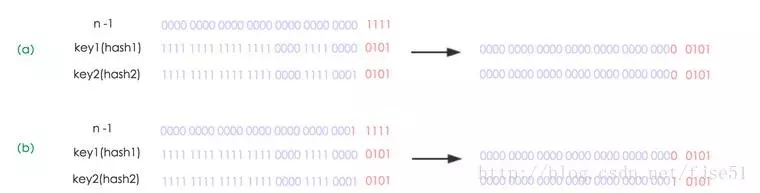

# Map


- Map 是映射接口, Map 中存储的内容是键值对 (key-value).
- AbstractMap 是继承于 Map 的抽象类, 它实现了 Map 中的大部分 API. 其它 Map 的实现类可以通过继承AbstractMap 来减少重复编码.
- SortedMap 是继承于 Map 的接口. SortedMap 中的内容是排序的键值对, 排序的方法是通过比较器(Comparator).
- NavigableMap 是继承于 SortedMap 的接口. 相比于 SortedMap,  NavigableMap 有一系列的导航方法；如"获取大于/等于某对象的键值对"、 **获取小于/等于某对象的键值对** 等等.
- TreeMap 继承于 AbstractMap, 且实现了 NavigableMap 接口；因此 TreeMap 中的内容是 **有序的键值对** ！
- HashMap 继承于 AbstractMap , 但没实现 NavigableMap 接口；因此 HashMap 的内容是 **键值对, 但不保证次序** ！
- Hashtable 虽然不是继承于 AbstractMap , 但它继承于 Dictionary(Dictionary也是键值对的接口) , 而且也实现 Map接口；因此 Hashtable 的内容也是 **键值对, 也不保证次序** .但和 HashMap 相比,  Hashtable 是线程安全的, 而且它支持通过 Enumeration 去遍历.
- WeakHashMap 继承于 AbstractMap .它和 HashMap 的键类型不同,  WeakHashMap 的键是 **弱键** .

在 JDK1.6中,新添加的节点是放在头节点, JDK1.8则是放在尾节点的
JDK1.8中,如果链表足够大时,将自动转换成红黑树保存


## API

```java
abstract void                 clear()
abstract boolean              containsKey(Object key)
abstract boolean              containsValue(Object value)
abstract Set<Entry<K, V>>     entrySet()
abstract boolean              equals(Object object)
abstract V                    get(Object key)
abstract int                  hashCode()
abstract boolean              isEmpty()
abstract Set<K>               keySet()
abstract V                    put(K key, V value)
abstract void                 putAll(Map<? extends K, ? extends V> map)
abstract V                    remove(Object key)
abstract int                  size()
abstract Collection<V>        values()
```

说明:

- Map提供接口分别用于返回 键集、值集或键-值映射关系集.
  - entrySet()用于返回键-值集的Set集合
  - keySet()用于返回键集的Set集合
  - values()用户返回值集的Collection集合
- 因为Map中不能包含重复的键；每个键最多只能映射到一个值.所以, 键-值集、键集都是Set, 值集时Collection.
- Map提供了 **键-值对** 、 **根据键获取值** 、 **删除键** 、 **获取容量大小** 等方法.

## HashMap

HashMap 是一个散列表, 它存储的内容是键值对(key-value)映射.
HashMap 继承于AbstractMap, 实现了Map、Cloneable、java.io.Serializable接口.
HashMap 的实现不是同步的, 这意味着它不是线程安全的.

它的 key、value都可以为 null. 此外, HashMap 中的映射不是有序的.

::: tip

JDK1.8 之前 HashMap 由 数组+链表 组成的，数组是 HashMap 的主体，链表则是主要为了解决哈希冲突而存在的（ **拉链法** 解决冲突）.JDK1.8 以后在解决哈希冲突时有了较大的变化，当链表长度大于阈值（默认为 8）时，将链表转化为红黑树，以减少搜索时间。

:::


HashMap 的实例有两个参数影响其性能: `初始容量` 和 `加载因子`.

容量 是哈希表中桶的数量, 初始容量 只是哈希表在创建时的容量.

加载因子 是哈希表在其容量自动增加之前可以达到多满的一种尺度.

当哈希表中的条目数超出了加载因子与当前容量的乘积时, 则要对该哈希表进行 rehash 操作（即重建内部数据结构）, 从而哈希表将具有大约两倍的桶数.
通常默认加载因子是 `0.75`,  这是在时间和空间成本上寻求一种折衷. 加载因子过高虽然减少了空间开销, 但同时也增加了查询成本（在大多数 HashMap 类的操作中, 包括 get 和 put 操作, 都反映了这一点）.

在设置初始容量时应该考虑到映射中所需的条目数及其加载因子, 以便最大限度地减少 rehash 操作次数. 如果初始容量大于最大条目数除以加载因子, 则不会发生 rehash 操作.


### 源码 (JDK7)

```java

package java.util;
import java.io.*;

public class HashMap<K,V>
    extends AbstractMap<K,V>
    implements Map<K,V>, Cloneable, Serializable
{

    // 默认的初始容量是16, 必须是2的幂.
    static final int DEFAULT_INITIAL_CAPACITY = 16;

    // 最大容量（必须是2的幂且小于2的30次方, 传入容量过大将被这个值替换）
    static final int MAXIMUM_CAPACITY = 1 << 30;

    // 默认加载因子
    static final float DEFAULT_LOAD_FACTOR = 0.75f;

    // 存储数据的Entry数组, 长度是2的幂.
    // HashMap是采用拉链法实现的, 每一个Entry本质上是一个单向链表
    transient Entry[] table;

    // HashMap的大小, 它是HashMap保存的键值对的数量
    transient int size;

    // HashMap的阈值, 用于判断是否需要调整HashMap的容量（threshold = 容量*加载因子）
    int threshold;

    // 加载因子实际大小
    final float loadFactor;

    // HashMap被改变的次数
    transient volatile int modCount;

    // 指定“容量大小”和“加载因子”的构造函数
    public HashMap(int initialCapacity, float loadFactor) {
        if (initialCapacity < 0)
            throw new IllegalArgumentException("Illegal initial capacity: " +
                                               initialCapacity);
        // HashMap的最大容量只能是MAXIMUM_CAPACITY
        if (initialCapacity > MAXIMUM_CAPACITY)
            initialCapacity = MAXIMUM_CAPACITY;
        if (loadFactor <= 0 || Float.isNaN(loadFactor))
            throw new IllegalArgumentException("Illegal load factor: " +
                                               loadFactor);

        // 找出“大于initialCapacity”的最小的2的幂
        int capacity = 1;
        while (capacity < initialCapacity)
            capacity <<= 1;

        // 设置“加载因子”
        this.loadFactor = loadFactor;
        // 设置“HashMap阈值”, 当HashMap中存储数据的数量达到threshold时, 就需要将HashMap的容量加倍.
        threshold = (int)(capacity * loadFactor);
        // 创建Entry数组, 用来保存数据
        table = new Entry[capacity];
        init();
    }


    // 指定“容量大小”的构造函数
    public HashMap(int initialCapacity) {
        this(initialCapacity, DEFAULT_LOAD_FACTOR);
    }

    // 默认构造函数.
    public HashMap() {
        // 设置“加载因子”
        this.loadFactor = DEFAULT_LOAD_FACTOR;
        // 设置“HashMap阈值”, 当HashMap中存储数据的数量达到threshold时, 就需要将HashMap的容量加倍.
        threshold = (int)(DEFAULT_INITIAL_CAPACITY * DEFAULT_LOAD_FACTOR);
        // 创建Entry数组, 用来保存数据
        table = new Entry[DEFAULT_INITIAL_CAPACITY];
        init();
    }

    // 包含“子Map”的构造函数
    public HashMap(Map<? extends K, ? extends V> m) {
        this(Math.max((int) (m.size() / DEFAULT_LOAD_FACTOR) + 1,
                      DEFAULT_INITIAL_CAPACITY), DEFAULT_LOAD_FACTOR);
        // 将m中的全部元素逐个添加到HashMap中
        putAllForCreate(m);
    }

    static int hash(int h) {
        h ^= (h >>> 20) ^ (h >>> 12);
        return h ^ (h >>> 7) ^ (h >>> 4);
    }

    // 返回索引值
    // h & (length-1) 保证返回值的小于length
    static int indexFor(int h, int length) {
        return h & (length-1);
    }

    public int size() {
        return size;
    }

    public boolean isEmpty() {
        return size == 0;
    }

    // 获取key对应的value
    public V get(Object key) {
        if (key == null)
            return getForNullKey();
        // 获取key的hash值
        int hash = hash(key.hashCode());
        // 在“该hash值对应的链表”上查找“键值等于key”的元素
        for (Entry<K,V> e = table[indexFor(hash, table.length)];
             e != null;
             e = e.next) {
            Object k;
            if (e.hash == hash && ((k = e.key) == key || key.equals(k)))
                return e.value;
        }
        return null;
    }

    // 获取“key为null”的元素的值
    // HashMap将“key为null”的元素存储在table[0]位置！
    private V getForNullKey() {
        for (Entry<K,V> e = table[0]; e != null; e = e.next) {
            if (e.key == null)
                return e.value;
        }
        return null;
    }

    // HashMap是否包含key
    public boolean containsKey(Object key) {
        return getEntry(key) != null;
    }

    // 返回“键为key”的键值对
    final Entry<K,V> getEntry(Object key) {
        // 获取哈希值
        // HashMap将“key为null”的元素存储在table[0]位置, “key不为null”的则调用hash()计算哈希值
        int hash = (key == null) ? 0 : hash(key.hashCode());
        // 在“该hash值对应的链表”上查找“键值等于key”的元素
        for (Entry<K,V> e = table[indexFor(hash, table.length)];
             e != null;
             e = e.next) {
            Object k;
            if (e.hash == hash &&
                ((k = e.key) == key || (key != null && key.equals(k))))
                return e;
        }
        return null;
    }

    // 将“key-value”添加到HashMap中
    public V put(K key, V value) {
        // 若“key为null”, 则将该键值对添加到table[0]中.
        if (key == null)
            return putForNullKey(value);
        // 若“key不为null”, 则计算该key的哈希值, 然后将其添加到该哈希值对应的链表中.
        int hash = hash(key.hashCode());
        int i = indexFor(hash, table.length);
        for (Entry<K,V> e = table[i]; e != null; e = e.next) {
            Object k;
            // 若“该key”对应的键值对已经存在, 则用新的value取代旧的value.然后退出！
            if (e.hash == hash && ((k = e.key) == key || key.equals(k))) {
                V oldValue = e.value;
                e.value = value;
                e.recordAccess(this);
                return oldValue;
            }
        }

        // 若“该key”对应的键值对不存在, 则将“key-value”添加到table中
        modCount++;
        addEntry(hash, key, value, i);
        return null;
    }

    // putForNullKey()的作用是将“key为null”键值对添加到table[0]位置
    private V putForNullKey(V value) {
        for (Entry<K,V> e = table[0]; e != null; e = e.next) {
            if (e.key == null) {
                V oldValue = e.value;
                e.value = value;
                e.recordAccess(this);
                return oldValue;
            }
        }
        // 这里的完全不会被执行到!
        modCount++;
        addEntry(0, null, value, 0);
        return null;
    }

    // 创建HashMap对应的“添加方法”, 
    // 它和put()不同.putForCreate()是内部方法, 它被构造函数等调用, 用来创建HashMap
    // 而put()是对外提供的往HashMap中添加元素的方法.
    private void putForCreate(K key, V value) {
        int hash = (key == null) ? 0 : hash(key.hashCode());
        int i = indexFor(hash, table.length);

        // 若该HashMap表中存在“键值等于key”的元素, 则替换该元素的value值
        for (Entry<K,V> e = table[i]; e != null; e = e.next) {
            Object k;
            if (e.hash == hash &&
                ((k = e.key) == key || (key != null && key.equals(k)))) {
                e.value = value;
                return;
            }
        }

        // 若该HashMap表中不存在“键值等于key”的元素, 则将该key-value添加到HashMap中
        createEntry(hash, key, value, i);
    }

    // 将“m”中的全部元素都添加到HashMap中.
    // 该方法被内部的构造HashMap的方法所调用.
    private void putAllForCreate(Map<? extends K, ? extends V> m) {
        // 利用迭代器将元素逐个添加到HashMap中
        for (Iterator<? extends Map.Entry<? extends K, ? extends V>> i = m.entrySet().iterator(); i.hasNext(); ) {
            Map.Entry<? extends K, ? extends V> e = i.next();
            putForCreate(e.getKey(), e.getValue());
        }
    }

    // 重新调整HashMap的大小, newCapacity是调整后的单位
    void resize(int newCapacity) {
        Entry[] oldTable = table;
        int oldCapacity = oldTable.length;
        if (oldCapacity == MAXIMUM_CAPACITY) {
            threshold = Integer.MAX_VALUE;
            return;
        }

        // 新建一个HashMap, 将“旧HashMap”的全部元素添加到“新HashMap”中, 
        // 然后, 将“新HashMap”赋值给“旧HashMap”.
        Entry[] newTable = new Entry[newCapacity];
        transfer(newTable);
        table = newTable;
        threshold = (int)(newCapacity * loadFactor);
    }

    // 将HashMap中的全部元素都添加到newTable中
    void transfer(Entry[] newTable) {
        Entry[] src = table;
        int newCapacity = newTable.length;
        for (int j = 0; j < src.length; j++) {
            Entry<K,V> e = src[j];
            if (e != null) {
                src[j] = null;
                do {
                    Entry<K,V> next = e.next;
                    int i = indexFor(e.hash, newCapacity);
                    e.next = newTable[i];
                    newTable[i] = e;
                    e = next;
                } while (e != null);
            }
        }
    }

    // 将"m"的全部元素都添加到HashMap中
    public void putAll(Map<? extends K, ? extends V> m) {
        // 有效性判断
        int numKeysToBeAdded = m.size();
        if (numKeysToBeAdded == 0)
            return;

        // 计算容量是否足够, 
        // 若“当前实际容量 < 需要的容量”, 则将容量x2.
        if (numKeysToBeAdded > threshold) {
            int targetCapacity = (int)(numKeysToBeAdded / loadFactor + 1);
            if (targetCapacity > MAXIMUM_CAPACITY)
                targetCapacity = MAXIMUM_CAPACITY;
            int newCapacity = table.length;
            while (newCapacity < targetCapacity)
                newCapacity <<= 1;
            if (newCapacity > table.length)
                resize(newCapacity);
        }

        // 通过迭代器, 将“m”中的元素逐个添加到HashMap中.
        for (Iterator<? extends Map.Entry<? extends K, ? extends V>> i = m.entrySet().iterator(); i.hasNext(); ) {
            Map.Entry<? extends K, ? extends V> e = i.next();
            put(e.getKey(), e.getValue());
        }
    }

    // 删除“键为key”元素
    public V remove(Object key) {
        Entry<K,V> e = removeEntryForKey(key);
        return (e == null ? null : e.value);
    }

    // 删除“键为key”的元素
    final Entry<K,V> removeEntryForKey(Object key) {
        // 获取哈希值.若key为null, 则哈希值为0；否则调用hash()进行计算
        int hash = (key == null) ? 0 : hash(key.hashCode());
        int i = indexFor(hash, table.length);
        Entry<K,V> prev = table[i];
        Entry<K,V> e = prev;

        // 删除链表中“键为key”的元素
        // 本质是“删除单向链表中的节点”
        while (e != null) {
            Entry<K,V> next = e.next;
            Object k;
            if (e.hash == hash &&
                ((k = e.key) == key || (key != null && key.equals(k)))) {
                modCount++;
                size--;
                if (prev == e)
                    table[i] = next;
                else
                    prev.next = next;
                e.recordRemoval(this);
                return e;
            }
            prev = e;
            e = next;
        }

        return e;
    }

    // 删除“键值对”
    final Entry<K,V> removeMapping(Object o) {
        if (!(o instanceof Map.Entry))
            return null;

        Map.Entry<K,V> entry = (Map.Entry<K,V>) o;
        Object key = entry.getKey();
        int hash = (key == null) ? 0 : hash(key.hashCode());
        int i = indexFor(hash, table.length);
        Entry<K,V> prev = table[i];
        Entry<K,V> e = prev;

        // 删除链表中的“键值对e”
        // 本质是“删除单向链表中的节点”
        while (e != null) {
            Entry<K,V> next = e.next;
            if (e.hash == hash && e.equals(entry)) {
                modCount++;
                size--;
                if (prev == e)
                    table[i] = next;
                else
                    prev.next = next;
                e.recordRemoval(this);
                return e;
            }
            prev = e;
            e = next;
        }

        return e;
    }

    // 清空HashMap, 将所有的元素设为null
    public void clear() {
        modCount++;
        Entry[] tab = table;
        for (int i = 0; i < tab.length; i++)
            tab[i] = null;
        size = 0;
    }

    // 是否包含“值为value”的元素
    public boolean containsValue(Object value) {
    // 若“value为null”, 则调用containsNullValue()查找
    if (value == null)
            return containsNullValue();

    // 若“value不为null”, 则查找HashMap中是否有值为value的节点.
    Entry[] tab = table;
        for (int i = 0; i < tab.length ; i++)
            for (Entry e = tab[i] ; e != null ; e = e.next)
                if (value.equals(e.value))
                    return true;
    return false;
    }

    // 是否包含null值
    private boolean containsNullValue() {
    Entry[] tab = table;
        for (int i = 0; i < tab.length ; i++)
            for (Entry e = tab[i] ; e != null ; e = e.next)
                if (e.value == null)
                    return true;
    return false;
    }

    // 克隆一个HashMap, 并返回Object对象
    public Object clone() {
        HashMap<K,V> result = null;
        try {
            result = (HashMap<K,V>)super.clone();
        } catch (CloneNotSupportedException e) {
            // assert false;
        }
        result.table = new Entry[table.length];
        result.entrySet = null;
        result.modCount = 0;
        result.size = 0;
        result.init();
        // 调用putAllForCreate()将全部元素添加到HashMap中
        result.putAllForCreate(this);

        return result;
    }

    // Entry是单向链表.
    // 它是 “HashMap链式存储法”对应的链表.
    // 它实现了Map.Entry 接口, 即实现getKey(), getValue(), setValue(V value), equals(Object o), hashCode()这些函数
    static class Entry<K,V> implements Map.Entry<K,V> {
        final K key;
        V value;
        // 指向下一个节点
        Entry<K,V> next;
        final int hash;

        // 构造函数.
        // 输入参数包括"哈希值(h)", "键(k)", "值(v)", "下一节点(n)"
        Entry(int h, K k, V v, Entry<K,V> n) {
            value = v;
            next = n;
            key = k;
            hash = h;
        }

        public final K getKey() {
            return key;
        }

        public final V getValue() {
            return value;
        }

        public final V setValue(V newValue) {
            V oldValue = value;
            value = newValue;
            return oldValue;
        }

        // 判断两个Entry是否相等
        // 若两个Entry的“key”和“value”都相等, 则返回true.
        // 否则, 返回false
        public final boolean equals(Object o) {
            if (!(o instanceof Map.Entry))
                return false;
            Map.Entry e = (Map.Entry)o;
            Object k1 = getKey();
            Object k2 = e.getKey();
            if (k1 == k2 || (k1 != null && k1.equals(k2))) {
                Object v1 = getValue();
                Object v2 = e.getValue();
                if (v1 == v2 || (v1 != null && v1.equals(v2)))
                    return true;
            }
            return false;
        }

        // 实现hashCode()
        public final int hashCode() {
            return (key==null   ? 0 : key.hashCode()) ^
                   (value==null ? 0 : value.hashCode());
        }

        public final String toString() {
            return getKey() + "=" + getValue();
        }

        // 当向HashMap中添加元素时, 绘调用recordAccess().
        // 这里不做任何处理
        void recordAccess(HashMap<K,V> m) {
        }

        // 当从HashMap中删除元素时, 绘调用recordRemoval().
        // 这里不做任何处理
        void recordRemoval(HashMap<K,V> m) {
        }
    }

    // 新增Entry.将“key-value”插入指定位置, bucketIndex是位置索引.
    void addEntry(int hash, K key, V value, int bucketIndex) {
        // 保存“bucketIndex”位置的值到“e”中
        Entry<K,V> e = table[bucketIndex];
        // 设置“bucketIndex”位置的元素为“新Entry”, 
        // 设置“e”为“新Entry的下一个节点”
        table[bucketIndex] = new Entry<K,V>(hash, key, value, e);
        // 若HashMap的实际大小 不小于 “阈值”, 则调整HashMap的大小
        if (size++ >= threshold)
            resize(2 * table.length);
    }

    // 创建Entry.将“key-value”插入指定位置, bucketIndex是位置索引.
    // 它和addEntry的区别是:
    // (01) addEntry()一般用在 新增Entry可能导致“HashMap的实际容量”超过“阈值”的情况下.
    //   例如, 我们新建一个HashMap, 然后不断通过put()向HashMap中添加元素；
    // put()是通过addEntry()新增Entry的.
    //   在这种情况下, 我们不知道何时“HashMap的实际容量”会超过“阈值”；
    //   因此, 需要调用addEntry()
    // (02) createEntry() 一般用在 新增Entry不会导致“HashMap的实际容量”超过“阈值”的情况下.
    //   例如, 我们调用HashMap“带有Map”的构造函数, 它绘将Map的全部元素添加到HashMap中；
    // 但在添加之前, 我们已经计算好“HashMap的容量和阈值”.也就是, 可以确定“即使将Map中
    // 的全部元素添加到HashMap中, 都不会超过HashMap的阈值”.
    //   此时, 调用createEntry()即可.
    void createEntry(int hash, K key, V value, int bucketIndex) {
        // 保存“bucketIndex”位置的值到“e”中
        Entry<K,V> e = table[bucketIndex];
        // 设置“bucketIndex”位置的元素为“新Entry”, 
        // 设置“e”为“新Entry的下一个节点”
        table[bucketIndex] = new Entry<K,V>(hash, key, value, e);
        size++;
    }

    // HashIterator是HashMap迭代器的抽象出来的父类, 实现了公共了函数.
    // 它包含“key迭代器(KeyIterator)”、“Value迭代器(ValueIterator)”和“Entry迭代器(EntryIterator)”3个子类.
    private abstract class HashIterator<E> implements Iterator<E> {
        // 下一个元素
        Entry<K,V> next;
        // expectedModCount用于实现fast-fail机制.
        int expectedModCount;
        // 当前索引
        int index;
        // 当前元素
        Entry<K,V> current;

        HashIterator() {
            expectedModCount = modCount;
            if (size > 0) { // advance to first entry
                Entry[] t = table;
                // 将next指向table中第一个不为null的元素.
                // 这里利用了index的初始值为0, 从0开始依次向后遍历, 直到找到不为null的元素就退出循环.
                while (index < t.length && (next = t[index++]) == null)
                    ;
            }
        }

        public final boolean hasNext() {
            return next != null;
        }

        // 获取下一个元素
        final Entry<K,V> nextEntry() {
            if (modCount != expectedModCount)
                throw new ConcurrentModificationException();
            Entry<K,V> e = next;
            if (e == null)
                throw new NoSuchElementException();

            // 注意！！！
            // 一个Entry就是一个单向链表
            // 若该Entry的下一个节点不为空, 就将next指向下一个节点;
            // 否则, 将next指向下一个链表(也是下一个Entry)的不为null的节点.
            if ((next = e.next) == null) {
                Entry[] t = table;
                while (index < t.length && (next = t[index++]) == null)
                    ;
            }
            current = e;
            return e;
        }

        // 删除当前元素
        public void remove() {
            if (current == null)
                throw new IllegalStateException();
            if (modCount != expectedModCount)
                throw new ConcurrentModificationException();
            Object k = current.key;
            current = null;
            HashMap.this.removeEntryForKey(k);
            expectedModCount = modCount;
        }

    }

    // value的迭代器
    private final class ValueIterator extends HashIterator<V> {
        public V next() {
            return nextEntry().value;
        }
    }

    // key的迭代器
    private final class KeyIterator extends HashIterator<K> {
        public K next() {
            return nextEntry().getKey();
        }
    }

    // Entry的迭代器
    private final class EntryIterator extends HashIterator<Map.Entry<K,V>> {
        public Map.Entry<K,V> next() {
            return nextEntry();
        }
    }

    // 返回一个“key迭代器”
    Iterator<K> newKeyIterator()   {
        return new KeyIterator();
    }
    // 返回一个“value迭代器”
    Iterator<V> newValueIterator()   {
        return new ValueIterator();
    }
    // 返回一个“entry迭代器”
    Iterator<Map.Entry<K,V>> newEntryIterator()   {
        return new EntryIterator();
    }

    // HashMap的Entry对应的集合
    private transient Set<Map.Entry<K,V>> entrySet = null;

    // 返回“key的集合”, 实际上返回一个“KeySet对象”
    public Set<K> keySet() {
        Set<K> ks = keySet;
        return (ks != null ? ks : (keySet = new KeySet()));
    }

    // Key对应的集合
    // KeySet继承于AbstractSet, 说明该集合中没有重复的Key.
    private final class KeySet extends AbstractSet<K> {
        public Iterator<K> iterator() {
            return newKeyIterator();
        }
        public int size() {
            return size;
        }
        public boolean contains(Object o) {
            return containsKey(o);
        }
        public boolean remove(Object o) {
            return HashMap.this.removeEntryForKey(o) != null;
        }
        public void clear() {
            HashMap.this.clear();
        }
    }

    // 返回“value集合”, 实际上返回的是一个Values对象
    public Collection<V> values() {
        Collection<V> vs = values;
        return (vs != null ? vs : (values = new Values()));
    }

    // “value集合”
    // Values继承于AbstractCollection, 不同于“KeySet继承于AbstractSet”, 
    // Values中的元素能够重复.因为不同的key可以指向相同的value.
    private final class Values extends AbstractCollection<V> {
        public Iterator<V> iterator() {
            return newValueIterator();
        }
        public int size() {
            return size;
        }
        public boolean contains(Object o) {
            return containsValue(o);
        }
        public void clear() {
            HashMap.this.clear();
        }
    }

    // 返回“HashMap的Entry集合”
    public Set<Map.Entry<K,V>> entrySet() {
        return entrySet0();
    }

    // 返回“HashMap的Entry集合”, 它实际是返回一个EntrySet对象
    private Set<Map.Entry<K,V>> entrySet0() {
        Set<Map.Entry<K,V>> es = entrySet;
        return es != null ? es : (entrySet = new EntrySet());
    }

    // EntrySet对应的集合
    // EntrySet继承于AbstractSet, 说明该集合中没有重复的EntrySet.
    private final class EntrySet extends AbstractSet<Map.Entry<K,V>> {
        public Iterator<Map.Entry<K,V>> iterator() {
            return newEntryIterator();
        }
        public boolean contains(Object o) {
            if (!(o instanceof Map.Entry))
                return false;
            Map.Entry<K,V> e = (Map.Entry<K,V>) o;
            Entry<K,V> candidate = getEntry(e.getKey());
            return candidate != null && candidate.equals(e);
        }
        public boolean remove(Object o) {
            return removeMapping(o) != null;
        }
        public int size() {
            return size;
        }
        public void clear() {
            HashMap.this.clear();
        }
    }

    // java.io.Serializable的写入函数
    // 将HashMap的“总的容量, 实际容量, 所有的Entry”都写入到输出流中
    private void writeObject(java.io.ObjectOutputStream s)
        throws IOException
    {
        Iterator<Map.Entry<K,V>> i =
            (size > 0) ? entrySet0().iterator() : null;

        // Write out the threshold, loadfactor, and any hidden stuff
        s.defaultWriteObject();

        // Write out number of buckets
        s.writeInt(table.length);

        // Write out size (number of Mappings)
        s.writeInt(size);

        // Write out keys and values (alternating)
        if (i != null) {
            while (i.hasNext()) {
            Map.Entry<K,V> e = i.next();
            s.writeObject(e.getKey());
            s.writeObject(e.getValue());
            }
        }
    }


    private static final long serialVersionUID = 362498820763181265L;

    // java.io.Serializable的读取函数:根据写入方式读出
    // 将HashMap的“总的容量, 实际容量, 所有的Entry”依次读出
    private void readObject(java.io.ObjectInputStream s)
         throws IOException, ClassNotFoundException
    {
        // Read in the threshold, loadfactor, and any hidden stuff
        s.defaultReadObject();

        // Read in number of buckets and allocate the bucket array;
        int numBuckets = s.readInt();
        table = new Entry[numBuckets];

        init();  // Give subclass a chance to do its thing.

        // Read in size (number of Mappings)
        int size = s.readInt();

        // Read the keys and values, and put the mappings in the HashMap
        for (int i=0; i<size; i++) {
            K key = (K) s.readObject();
            V value = (V) s.readObject();
            putForCreate(key, value);
        }
    }

    // 返回“HashMap总的容量”
    int   capacity()     { return table.length; }
    // 返回“HashMap的加载因子”
    float loadFactor()   { return loadFactor;   }
}
```


### 存储结构

内部包含了一个 Entry 类型的数组 table。

```java
transient Entry[] table;
```

Entry 存储着键值对。它包含了四个字段，从 next 字段我们可以看出 Entry 是一个链表。即数组中的每个位置被当成一个桶，一个桶存放一个链表。HashMap 使用拉链法来解决冲突，同一个链表中存放哈希值和散列桶取模运算结果相同的 Entry。


```java
static class Entry<K,V> implements Map.Entry<K,V> {
    final K key;
    V value;
    Entry<K,V> next;
    int hash;

    Entry(int h, K k, V v, Entry<K,V> n) {
        value = v;
        next = n;
        key = k;
        hash = h;
    }

    public final K getKey() {
        return key;
    }

    public final V getValue() {
        return value;
    }

    public final V setValue(V newValue) {
        V oldValue = value;
        value = newValue;
        return oldValue;
    }

    public final boolean equals(Object o) {
        if (!(o instanceof Map.Entry))
            return false;
        Map.Entry e = (Map.Entry)o;
        Object k1 = getKey();
        Object k2 = e.getKey();
        if (k1 == k2 || (k1 != null && k1.equals(k2))) {
            Object v1 = getValue();
            Object v2 = e.getValue();
            if (v1 == v2 || (v1 != null && v1.equals(v2)))
                return true;
        }
        return false;
    }

    public final int hashCode() {
        return Objects.hashCode(getKey()) ^ Objects.hashCode(getValue());
    }

    public final String toString() {
        return getKey() + "=" + getValue();
    }
}
```

### 拉链法原理(JDK8 之前)

所谓 **拉链法** 就是：将链表和数组相结合。也就是说创建一个链表数组，数组中每一格就是一个链表。若遇到哈希冲突，则将冲突的值加到链表中即可。

```java
HashMap<String, String> map = new HashMap<>();
map.put("K1", "V1");
map.put("K2", "V2");
map.put("K3", "V3");
```

- 新建一个 HashMap，默认大小为 16；
- 插入 <K1,V1> 键值对，先计算 K1 的 hashCode 为 115，使用除留余数法得到所在的桶下标 115%16=3 (为了简便这里直接使用取模, HashMap 则使用通过 `(length - 1) & hash(key)`来提高效率)。
- 插入 <K2,V2> 键值对，先计算 K2 的 hashCode 为 118，使用除留余数法得到所在的桶下标 118%16=6。
- 插入 <K3,V3> 键值对，先计算 K3 的 hashCode 为 118，使用除留余数法得到所在的桶下标 118%16=6，插在 <K2,V2> 前面。

应该注意到链表的插入是以**头插法**方式进行的，例如上面的 <K3,V3> 不是插在 <K2,V2> 后面，而是插入在链表头部。

查找需要分成两步进行：

- 计算键值对所在的桶；
- 在链表上顺序查找，时间复杂度显然和链表的长度成正比。


### 底层数据结构分析

#### JDK8 之前

JDK1.8 之前 HashMap 底层是 **数组和链表** 结合在一起使用也就是 **链表散列**。**HashMap 通过 key 的 hashCode 经过扰动函数处理过后得到 hash 值，然后通过 `(length - 1) & hash` 判断当前元素存放的位置，如果当前位置存在元素的话，就判断该元素与要存入的元素的 hash 值以及 key 是否相同，如果相同的话，直接覆盖，不相同就通过拉链法解决冲突。**

**所谓扰动函数指的就是 HashMap 的 hash 方法。使用 hash 方法也就是扰动函数是为了防止一些实现比较差的 hashCode() 方法 换句话说使用扰动函数之后可以减少碰撞。**

**JDK 1.8 HashMap 的 hash 方法源码:**

JDK 1.8 的 hash 方法 相比于 JDK 1.7 hash 方法更加简化，但是原理不变。

```java
static final int hash(Object key) {
  	int h;
  	// key.hashCode()：返回散列值也就是hashcode
  	// ^ ：按位异或
  	// >>>:无符号右移，忽略符号位，空位都以0补齐
  	return (key == null) ? 0 : (h = key.hashCode()) ^ (h >>> 16);
}
```

对比一下 JDK1.7 的 HashMap 的 hash 方法源码.

```java
final int hash(Object k) {
    int h = hashSeed;
    // 如果 key 是字符串，调用 sun.misc.Hashing.stringHash32 生成 hash 值
    // Oracle 表示能生成更好的 hash 分布，不过这在 jdk8 中已删除
    if (0 != h && k instanceof String) {
      return sun.misc.Hashing.stringHash32((String) k);
    }

    // 一次散列，调用 k 的 hashCode 方法，与 hashSeed 做异或操作
    h ^= k.hashCode();

    // 二次散列
    // This function ensures that hashCodes that differ only by
    // constant multiples at each bit position have a bounded
    // number of collisions (approximately 8 at default load factor).
    h ^= (h >>> 20) ^ (h >>> 12);
    return h ^ (h >>> 7) ^ (h >>> 4);
}
```

相比于 JDK1.8 的 hash 方法 ，JDK 1.7 的 hash 方法的性能会稍差一点点，因为毕竟扰动了 4 次。

##### put()

```java
public V put(K key, V value) {
    if (table == EMPTY_TABLE) {
        inflateTable(threshold);
    }
    // 键为 null 单独处理
    if (key == null)
        return putForNullKey(value);
    int hash = hash(key);
    // 确定桶下标
    int i = indexFor(hash, table.length);
    // 先找出是否已经存在键为 key 的键值对，如果存在的话就更新这个键值对的值为 value
    for (Entry<K,V> e = table[i]; e != null; e = e.next) {
        Object k;
        if (e.hash == hash && ((k = e.key) == key || key.equals(k))) {
            V oldValue = e.value;
            e.value = value;
            e.recordAccess(this);
            return oldValue;
        }
    }

    modCount++;
    // 插入新键值对
    addEntry(hash, key, value, i);
    return null;
}
```


::: tip

HashMap 允许插入键为 null 的键值对。但是因为无法调用 null 的 hashCode() 方法，也就无法确定该键值对的桶下标，只能通过强制指定一个桶下标来存放。HashMap 使用第 0 个桶存放键为 null 的键值对。

:::

```java
private V putForNullKey(V value) {
    for (Entry<K,V> e = table[0]; e != null; e = e.next) {
        if (e.key == null) {
            V oldValue = e.value;
            e.value = value;
            e.recordAccess(this);
            return oldValue;
        }
    }
    modCount++;
    addEntry(0, null, value, 0);
    return null;
}
```


JDK8 之前的 put 步骤如下:

1. 首先判断是否需要初始化;
2. 优先处理 key = null 的情况, 将元素存储到 table[0] 的桶中, 如果存在相同的元素, 则直接替换( HashMap 只允许存在一个 key = null 的元素);
3. 根据 key 生成 hash 从而找到桶的位置;
4. 然后遍历整个链表, 先对比 hash, 然后判断 key 是否相同来执行是否覆盖原有值, 如果相同则覆盖并返回原来的值;
5. 如果没有链表或者没有找到相同的值, 则在**表头**插入新的节点, 并将 modCount + 1, 最后返回 null;

使用链表的头插法，也就是新的键值对插在链表的头部，而不是链表的尾部。

```java
void addEntry(int hash, K key, V value, int bucketIndex) {
  	// 先判断是否需要扩容
    if ((size >= threshold) && (null != table[bucketIndex])) {
        resize(2 * table.length);
        hash = (null != key) ? hash(key) : 0;
        bucketIndex = indexFor(hash, table.length);
    }

    createEntry(hash, key, value, bucketIndex);
}

void createEntry(int hash, K key, V value, int bucketIndex) {
    Entry<K,V> e = table[bucketIndex];
    // 头插法，链表头部指向新的键值对
    table[bucketIndex] = new Entry<>(hash, key, value, e);
    size++;
}
```

##### 确定桶下标

很多操作都需要先确定一个键值对所在的桶下标。

```
int hash = hash(key);
int i = indexFor(hash, table.length);
```

###### 计算 hash 值

```java
final int hash(Object k) {
    int h = hashSeed;
    if (0 != h && k instanceof String) {
        return sun.misc.Hashing.stringHash32((String) k);
    }

    h ^= k.hashCode();

    // This function ensures that hashCodes that differ only by
    // constant multiples at each bit position have a bounded
    // number of collisions (approximately 8 at default load factor).
    h ^= (h >>> 20) ^ (h >>> 12);
    return h ^ (h >>> 7) ^ (h >>> 4);
}

public final int hashCode() {
    return Objects.hashCode(key) ^ Objects.hashCode(value);
}
```

###### 取模

令 x = 1<<4，即 x 为 2 的 4 次方，它具有以下性质：

```
x   : 00010000
x-1 : 00001111
```

令一个数 y 与 x-1 做与运算，可以去除 y 位级表示的第 4 位以上数：

```
y       : 10110010
x-1     : 00001111
y&(x-1) : 00000010
```

这个性质和 y 对 x 取模效果是一样的：

```
y   : 10110010
x   : 00010000
y%x : 00000010
```

我们知道，位运算的代价比求模运算小的多，因此在进行这种计算时用位运算的话能带来更高的性能。

确定桶下标的最后一步是将 key 的 hash 值对桶个数取模：hash%capacity，如果能保证 capacity 为 2 的 n 次方，那么就可以将这个操作转换为位运算。

```java
static int indexFor(int h, int length) {
    return h & (length-1);
}
```

##### 扩容

设 HashMap 的 table 长度为 M，需要存储的键值对数量为 N，如果哈希函数满足均匀性的要求，那么每条链表的长度大约为 N/M，因此平均查找次数的复杂度为 O(N/M)。

为了让查找的成本降低，应该尽可能使得 N/M 尽可能小，因此需要保证 M 尽可能大，也就是说 table 要尽可能大。HashMap 采用动态扩容来根据当前的 N 值来调整 M 值，使得空间效率和时间效率都能得到保证。

和扩容相关的参数主要有：capacity、size、threshold 和 load_factor。

| 参数       | 含义                                                         |
| ---------- | ------------------------------------------------------------ |
| capacity   | table 的容量大小，默认为 16。需要注意的是 capacity 必须保证为 2 的 n 次方。 |
| size       | 键值对数量。                                                 |
| threshold  | size 的临界值，当 size 大于等于 threshold 就必须进行扩容操作。 |
| loadFactor | 装载因子，table 能够使用的比例，threshold = capacity * loadFactor。 |

```java
static final int DEFAULT_INITIAL_CAPACITY = 16;

static final int MAXIMUM_CAPACITY = 1 << 30;

static final float DEFAULT_LOAD_FACTOR = 0.75f;

transient Entry[] table;

transient int size;

int threshold;

final float loadFactor;

transient int modCount;
```

从下面的添加元素代码中可以看出，当需要扩容时，令 capacity 为原来的两倍。

```java
void addEntry(int hash, K key, V value, int bucketIndex) {
    Entry<K,V> e = table[bucketIndex];
    table[bucketIndex] = new Entry<>(hash, key, value, e);
    if (size++ >= threshold)
        resize(2 * table.length);
}
```

扩容使用 resize() 实现，需要注意的是，扩容操作同样需要把 oldTable 的所有键值对重新插入 newTable 中，因此这一步是很费时的。

```java
void resize(int newCapacity) {
    Entry[] oldTable = table;
    int oldCapacity = oldTable.length;
    if (oldCapacity == MAXIMUM_CAPACITY) {
        threshold = Integer.MAX_VALUE;
        return;
    }
    Entry[] newTable = new Entry[newCapacity];
    transfer(newTable);
    table = newTable;
    threshold = (int)(newCapacity * loadFactor);
}

void transfer(Entry[] newTable) {
    Entry[] src = table;
    int newCapacity = newTable.length;
    for (int j = 0; j < src.length; j++) {
        Entry<K,V> e = src[j];
        if (e != null) {
            src[j] = null;
            do {
                Entry<K,V> next = e.next;
                int i = indexFor(e.hash, newCapacity);
                e.next = newTable[i];
                newTable[i] = e;
                e = next;
            } while (e != null);
        }
    }
}
```

###### 重新计算桶下标

在进行扩容时，需要把键值对重新放到对应的桶上。HashMap 使用了一个特殊的机制，可以降低重新计算桶下标的操作。

假设原数组长度 capacity 为 16，扩容之后 new capacity 为 32：

```java
capacity     : 00010000
new capacity : 00100000
```

对于一个 Key，

- 它的哈希值如果在第 5 位上为 0，那么取模得到的结果和之前一样；
- 如果为 1，那么得到的结果为原来的结果 +16。

###### 计算数组容量

HashMap 构造函数允许用户传入的容量不是 2 的 n 次方，因为它可以自动地将传入的容量转换为 2 的 n 次方。

先考虑如何求一个数的掩码，对于 10010000，它的掩码为 11111111，可以使用以下方法得到：

```java
mask |= mask >> 1    11011000
mask |= mask >> 2    11111110
mask |= mask >> 4    11111111
```

mask+1 是大于原始数字的最小的 2 的 n 次方。

```java
num     10010000
mask+1 100000000
```

以下是 HashMap 中计算数组容量的代码：

```java
static final int tableSizeFor(int cap) {
    int n = cap - 1;
    n |= n >>> 1;
    n |= n >>> 2;
    n |= n >>> 4;
    n |= n >>> 8;
    n |= n >>> 16;
    return (n < 0) ? 1 : (n >= MAXIMUM_CAPACITY) ? MAXIMUM_CAPACITY : n + 1;
}
```

#### JDK8 之后

相比于之前的版本，JDK8 在解决哈希冲突时有了较大的变化，当链表长度大于阈值(默认为 `8`)时，将链表转化为红黑树，以减少搜索时间, 当链表长度小于阈值时, 将红黑树转为链表(默认为  `6`)。


**类的属性：**

```java
public class HashMap<K,V> extends AbstractMap<K,V> implements Map<K,V>, Cloneable, Serializable {
    // 序列号
    private static final long serialVersionUID = 362498820763181265L;    
    // 默认的初始容量是16
    static final int DEFAULT_INITIAL_CAPACITY = 1 << 4;   
    // 最大容量
    static final int MAXIMUM_CAPACITY = 1 << 30; 
    // 默认的填充因子
    static final float DEFAULT_LOAD_FACTOR = 0.75f;
    // 当桶(bucket)上的结点数大于这个值时会转成红黑树
    static final int TREEIFY_THRESHOLD = 8; 
    // 当桶(bucket)上的结点数小于这个值时树转链表
    static final int UNTREEIFY_THRESHOLD = 6;
    // 桶中结构转化为红黑树对应的table的最小大小
    static final int MIN_TREEIFY_CAPACITY = 64;
    // 存储元素的数组，总是2的幂次倍
    transient Node<k,v>[] table; 
    // 存放具体元素的集
    transient Set<map.entry<k,v>> entrySet;
    // 存放元素的个数，注意这个不等于数组的长度。
    transient int size;
    // 每次扩容和更改map结构的计数器
    transient int modCount;   
    // 临界值 当实际大小(容量*填充因子)超过临界值时，会进行扩容
    int threshold;
    // 加载因子
    final float loadFactor;
}
```

- **loadFactor 加载因子**

  loadFactor加载因子是控制数组存放数据的疏密程度，loadFactor越趋近于1，那么 数组中存放的数据(entry)也就越多，也就越密，也就是会让链表的长度增加，loadFactor 越小，也就是趋近于 0，数组中存放的数据(entry)也就越少，也就越稀疏。

  **loadFactor 太大导致查找元素效率低，太小导致数组的利用率低，存放的数据会很分散。loadFactor 的默认值为 `0.75f` 是官方给出的一个比较好的临界值**。

  给定的默认容量为 `16`，负载因子为 `0.75`。Map 在使用过程中不断的往里面存放数据，当数量达到了 16 * 0.75 = 12 就需要将当前 16 的容量进行扩容，而扩容这个过程涉及到 **rehash**、**复制数据**等操作，所以非常消耗性能。

- **threshold**

  **threshold = capacity \* loadFactor**，当 **size >= threshold **的时候，那么就要考虑对数组的扩增了，也就是说，这个的意思就是 **衡量数组是否需要扩增的一个标准**。

**Node节点类源码:**

```java
// 继承自 Map.Entry<K,V>
static class Node<K,V> implements Map.Entry<K,V> {
       final int hash;// 哈希值，存放元素到hashmap中时用来与其他元素hash值比较
       final K key;//键
       V value;//值
       // 指向下一个节点
       Node<K,V> next;
       Node(int hash, K key, V value, Node<K,V> next) {
            this.hash = hash;
            this.key = key;
            this.value = value;
            this.next = next;
        }
        public final K getKey()        { return key; }
        public final V getValue()      { return value; }
        public final String toString() { return key + "=" + value; }
        // 重写hashCode()方法
        public final int hashCode() {
            return Objects.hashCode(key) ^ Objects.hashCode(value);
        }

        public final V setValue(V newValue) {
            V oldValue = value;
            value = newValue;
            return oldValue;
        }
        // 重写 equals() 方法
        public final boolean equals(Object o) {
            if (o == this)
                return true;
            if (o instanceof Map.Entry) {
                Map.Entry<?,?> e = (Map.Entry<?,?>)o;
                if (Objects.equals(key, e.getKey()) &&
                    Objects.equals(value, e.getValue()))
                    return true;
            }
            return false;
        }
}
```

**树节点类源码:**

```java
static final class TreeNode<K,V> extends LinkedHashMap.Entry<K,V> {
        TreeNode<K,V> parent;  // 父
        TreeNode<K,V> left;    // 左
        TreeNode<K,V> right;   // 右
        TreeNode<K,V> prev;    // needed to unlink next upon deletion
        boolean red;           // 判断颜色
        TreeNode(int hash, K key, V val, Node<K,V> next) {
            super(hash, key, val, next);
        }
        // 返回根节点
        final TreeNode<K,V> root() {
            for (TreeNode<K,V> r = this, p;;) {
                if ((p = r.parent) == null)
                    return r;
                r = p;
       }
```

##### 构造方法

```java
// 默认构造函数。
public HashMap() {
    this.loadFactor = DEFAULT_LOAD_FACTOR; // all   other fields defaulted
 }
 
 // 包含另一个“Map”的构造函数
 public HashMap(Map<? extends K, ? extends V> m) {
     this.loadFactor = DEFAULT_LOAD_FACTOR;
     putMapEntries(m, false);//下面会分析到这个方法
 }
 
 // 指定“容量大小”的构造函数
 public HashMap(int initialCapacity) {
     this(initialCapacity, DEFAULT_LOAD_FACTOR);
 }
 
 // 指定“容量大小”和“加载因子”的构造函数
 public HashMap(int initialCapacity, float loadFactor) {
     if (initialCapacity < 0)
         throw new IllegalArgumentException("Illegal initial capacity: " + initialCapacity);
     if (initialCapacity > MAXIMUM_CAPACITY)
         initialCapacity = MAXIMUM_CAPACITY;
     if (loadFactor <= 0 || Float.isNaN(loadFactor))
         throw new IllegalArgumentException("Illegal load factor: " + loadFactor);
     this.loadFactor = loadFactor;
     this.threshold = tableSizeFor(initialCapacity);
 }
```

**putMapEntries()**

```java
final void putMapEntries(Map<? extends K, ? extends V> m, boolean evict) {
    int s = m.size();
    if (s > 0) {
        // 判断table是否已经初始化
        if (table == null) { // pre-size
            // 未初始化，s为m的实际元素个数
            float ft = ((float)s / loadFactor) + 1.0F;
            int t = ((ft < (float)MAXIMUM_CAPACITY) ?
                    (int)ft : MAXIMUM_CAPACITY);
            // 计算得到的t大于阈值，则初始化阈值
            if (t > threshold)
                threshold = tableSizeFor(t);
        }
        // 已初始化，并且m元素个数大于阈值，进行扩容处理
        else if (s > threshold)
            resize();
        // 将m中的所有元素添加至HashMap中
        for (Map.Entry<? extends K, ? extends V> e : m.entrySet()) {
            K key = e.getKey();
            V value = e.getValue();
            putVal(hash(key), key, value, false, evict);
        }
    }
}
```

##### put()

HashMap 只提供了 put 用于添加元素，putVal 方法只是给 put 方法调用的一个方法，并没有提供给用户使用。

**对 putVal() 添加元素的分析如下：**

- 如果定位到的数组位置没有元素 就直接插入。
- 如果定位到的数组位置有元素就和要插入的 key 比较，如果 key 相同就直接覆盖，如果 key 不相同，就判断 p是否是一个树节点，如果是就调用 `e = ((TreeNode<K,V>)p).putTreeVal(this, tab, hash, key, value)` 将元素添加进入。如果不是就遍历链表插入(插入的是**链表尾部**)。


```java
public V put(K key, V value) {
    return putVal(hash(key), key, value, false, true);
}

final V putVal(int hash, K key, V value, boolean onlyIfAbsent,
                   boolean evict) {
    Node<K,V>[] tab; Node<K,V> p; int n, i;
    // table未初始化或者长度为0，进行扩容
    if ((tab = table) == null || (n = tab.length) == 0)
        n = (tab = resize()).length;
    // (n - 1) & hash 确定元素存放在哪个桶中，桶为空，新生成结点放入桶中(此时，这个结点是放在数组中)
    if ((p = tab[i = (n - 1) & hash]) == null)
        tab[i] = newNode(hash, key, value, null);
    // 桶中已经存在元素
    else {
        Node<K,V> e; K k;
        // 比较桶中第一个元素(数组中的结点)的hash值相等，key相等
        if (p.hash == hash &&
            ((k = p.key) == key || (key != null && key.equals(k))))
                // 将第一个元素赋值给e，用e来记录
                e = p;
        // hash值不相等，即key不相等；为红黑树结点
        else if (p instanceof TreeNode)
            // 放入树中
            e = ((TreeNode<K,V>)p).putTreeVal(this, tab, hash, key, value);
        // 为链表结点
        else {
            // 在链表最末插入结点
            for (int binCount = 0; ; ++binCount) {
                // 到达链表的尾部
                if ((e = p.next) == null) {
                    // 在尾部插入新结点
                    p.next = newNode(hash, key, value, null);
                    // 结点数量达到阈值，转化为红黑树
                    if (binCount >= TREEIFY_THRESHOLD - 1) // -1 for 1st
                        treeifyBin(tab, hash);
                    // 跳出循环
                    break;
                }
                // 判断链表中结点的key值与插入的元素的key值是否相等
                if (e.hash == hash &&
                    ((k = e.key) == key || (key != null && key.equals(k))))
                    // 相等，跳出循环
                    break;
                // 用于遍历桶中的链表，与前面的e = p.next组合，可以遍历链表
                p = e;
            }
        }
        // 表示在桶中找到key值、hash值与插入元素相等的结点
        if (e != null) { 
            // 记录e的value
            V oldValue = e.value;
            // onlyIfAbsent为false或者旧值为null
            if (!onlyIfAbsent || oldValue == null)
                //用新值替换旧值
                e.value = value;
            // 访问后回调
            afterNodeAccess(e);
            // 返回旧值
            return oldValue;
        }
    }
    // 结构性修改
    ++modCount;
    // 实际大小大于阈值则扩容
    if (++size > threshold)
        resize();
    // 插入后回调
    afterNodeInsertion(evict);
    return null;
} 
```

JDK8 之后的 put 步骤如下:

1. 判断当前桶是否为空，空的就需要初始化（resize 中会判断是否进行初始化）。
2. 根据当前 key 的 hashcode 定位到具体的桶中并判断是否为空，为空表明没有 Hash 冲突就直接在当前位置创建一个新桶即可。
3. 如果当前桶有值（ Hash 冲突），那么就要比较当前桶中的 `key、key 的 hashcode`与写入的 key 是否相等，相等就赋值给 `e`, 在第 8 步的时候会统一进行赋值及返回。
4. 如果当前桶为红黑树，那就要按照红黑树的方式写入数据。
5. 如果是个链表，就需要将当前的 key、value 封装成一个新节点写入到当前桶的后面（形成链表）。
6. 接着判断当前链表的大小是否大于预设的阈值，大于时就要转换为红黑树。
7. 如果在遍历过程中找到 key 相同时直接退出遍历。
8. 如果 `e != null` 就相当于存在相同的 key, 那就需要将值覆盖。
9. 最后判断是否需要进行扩容。


我们再来对比一下 JDK1.7 put 方法的代码**

**对于 put() 的分析如下：**

- 如果定位到的数组位置没有元素 就直接插入。
- 如果定位到的数组位置有元素，遍历以这个元素为头结点的链表，依次和插入的 key 比较，如果 key 相同就直接覆盖，不同就采用**头插法**插入元素。

```java
public V put(K key, V value)
    if (table == EMPTY_TABLE) { 
    inflateTable(threshold); 
}  
    if (key == null)
        return putForNullKey(value);
    int hash = hash(key);
    int i = indexFor(hash, table.length);
    for (Entry<K,V> e = table[i]; e != null; e = e.next) { // 先遍历
        Object k;
        if (e.hash == hash && ((k = e.key) == key || key.equals(k))) {
            V oldValue = e.value;
            e.value = value;
            e.recordAccess(this);
            return oldValue; 
        }
    }

    modCount++;
    addEntry(hash, key, value, i);  // 再插入
    return null;
}
```

##### get()

```java
public V get(Object key) {
    Node<K,V> e;
    return (e = getNode(hash(key), key)) == null ? null : e.value;
}

final Node<K,V> getNode(int hash, Object key) {
    Node<K,V>[] tab; Node<K,V> first, e; int n; K k;
    if ((tab = table) != null && (n = tab.length) > 0 &&
        (first = tab[(n - 1) & hash]) != null) {
        // 数组元素相等
        if (first.hash == hash && // always check first node
            ((k = first.key) == key || (key != null && key.equals(k))))
            return first;
        // 桶中不止一个节点
        if ((e = first.next) != null) {
            // 在树中get
            if (first instanceof TreeNode)
                return ((TreeNode<K,V>)first).getTreeNode(hash, key);
            // 在链表中get
            do {
                if (e.hash == hash &&
                    ((k = e.key) == key || (key != null && key.equals(k))))
                    return e;
            } while ((e = e.next) != null);
        }
    }
    return null;
}
```

- 首先将 key hash 之后取得所定位的桶。
- 如果桶为空则直接返回 null 。
- 否则判断桶的第一个位置 (有可能是链表、红黑树) 的 key 是否为查询的 key，是就直接返回 value。
- 如果第一个不匹配，则判断它的下一个是红黑树还是链表。
- 红黑树就按照树的查找方式返回值。
- 不然就按照链表的方式遍历匹配返回值。

##### resize()

进行扩容，会伴随着一次重新 hash 分配，并且会遍历 hash 表中所有的元素，是非常耗时的。在编写程序中，要尽量避免 resize。

```java
final Node<K,V>[] resize() {
    Node<K,V>[] oldTab = table;
    int oldCap = (oldTab == null) ? 0 : oldTab.length;
    int oldThr = threshold;
    int newCap, newThr = 0;
    if (oldCap > 0) {
        // 超过最大值就不再扩充了，就只好随你碰撞去吧
        if (oldCap >= MAXIMUM_CAPACITY) {
            threshold = Integer.MAX_VALUE;
            return oldTab;
        }
        // 没超过最大值，就扩充为原来的2倍
        else if ((newCap = oldCap << 1) < MAXIMUM_CAPACITY && oldCap >= DEFAULT_INITIAL_CAPACITY)
            newThr = oldThr << 1; // double threshold
    }
    else if (oldThr > 0) // initial capacity was placed in threshold
        newCap = oldThr;
    else { 
        // signifies using defaults
        newCap = DEFAULT_INITIAL_CAPACITY;
        newThr = (int)(DEFAULT_LOAD_FACTOR * DEFAULT_INITIAL_CAPACITY);
    }
    // 计算新的resize上限
    if (newThr == 0) {
        float ft = (float)newCap * loadFactor;
        newThr = (newCap < MAXIMUM_CAPACITY && ft < (float)MAXIMUM_CAPACITY ? (int)ft : Integer.MAX_VALUE);
    }
    threshold = newThr;
    @SuppressWarnings({"rawtypes","unchecked"})
        Node<K,V>[] newTab = (Node<K,V>[])new Node[newCap];
    table = newTab;
    if (oldTab != null) {
        // 把每个bucket都移动到新的buckets中
        for (int j = 0; j < oldCap; ++j) {
            Node<K,V> e;
            if ((e = oldTab[j]) != null) {
                oldTab[j] = null;
                if (e.next == null)
                    newTab[e.hash & (newCap - 1)] = e;
                else if (e instanceof TreeNode)
                    ((TreeNode<K,V>)e).split(this, newTab, j, oldCap);
                else { 
                    Node<K,V> loHead = null, loTail = null;
                    Node<K,V> hiHead = null, hiTail = null;
                    Node<K,V> next;
                    do {
                        next = e.next;
                        // 原索引
                        if ((e.hash & oldCap) == 0) {
                            if (loTail == null)
                                loHead = e;
                            else
                                loTail.next = e;
                            loTail = e;
                        }
                        // 原索引+oldCap
                        else {
                            if (hiTail == null)
                                hiHead = e;
                            else
                                hiTail.next = e;
                            hiTail = e;
                        }
                    } while ((e = next) != null);
                    // 原索引放到bucket里
                    if (loTail != null) {
                        loTail.next = null;
                        newTab[j] = loHead;
                    }
                    // 原索引+oldCap放到bucket里
                    if (hiTail != null) {
                        hiTail.next = null;
                        newTab[j + oldCap] = hiHead;
                    }
                }
            }
        }
    }
    return newTab;
}
```

#### JDK8 对 HashMap 的优化点

1.  JDK8 中没有 indexFor 函数，直接使用 `table [index = (n – 1) & hash]`（与运算交换左右，结果不变）。其中 table 数组为 HashMap 解决哈希冲突的数组 + 链表法中的数组;
2.  旧版本的 HashMap 存在一个问题，即使负载因子和 Hash 算法设计的再合理，也免不了会出现拉链过长的情况，一旦出现拉链过长，则会严重影响 HashMap 的性能 (时间复杂度是 `O(n)`)。于是，在 JDK8 版本中，对数据结构做了进一步的优化，引入了**红黑树**。而当链表长度太长（TREEIFY_THRESHOLD 默认超过  **8**, 并且 `table` 的长度不小于64(否则扩容一次)）时，链表就转换为红黑树，利用红黑树快速增删改查的特点提高 HashMap 的性能（`O (logn)`）。当长度小于（UNTREEIFY_THRESHOLD 默认为 **6**），就会退化成链表;

3. JDK8 充分利用缓存的 hash, 避免像 JDK7 每次 resize 时都要重新计算 hash;

经过观测可以发现，HashMap 使用的是 2 次幂的扩容 (指长度扩为原来 2 倍)。所以元素的位置要么是在原位置，要么是在原位置再移动 2 次幂的位置。看下图可以明白这句话的意思，n 为 table 的长度，图 (a) 表示扩容前的 key1 和 key2 两种 key 确定索引位置的示例，图 (b) 表示扩容后 key1 和 key2 两种 key 确定索引位置的示例，其中 hash1 是 key1 对应的哈希与高位运算（即 hash () 函数）结果。




   扩容后，table 长度 (n) 变为原来两倍，即 n 由

    0000 0000 0000 0000 0000 0000 0001 0000
    
    变为
    
    0000 0000 0000 0000 0000 0000 0010 0000

  因此 n-1 由

    0000 0000 0000 0000 0000 0000 0000 1111
    
    变为
    
    0000 0000 0000 0000 0000 0000 0001 1111

元素在重新计算 hash 之后，因为 n 变为 2 倍，那么 n-1 的 mask 范围在高位多 1bit (红色)，因此新的 index 就会发生这样的变化：


因此，我们在扩充 HashMap 的时候，不需要像 JDK7 的实现那样重新计算 hash，**只需要看看原来的 hash 值新增的那个 bit 是 1 还是 0 就好了，是 0 的话索引没变，是 1 的话索引变成 `原索引 + oldCap`**。(每个节点 e 的 hash 早就计算好，并保存在 final hash 中)。通过 `if ((e.hash & oldCap) == 0)` 判定前面那个 bit 是不是 1，如果是 1 则加上 oldCap。

```java
if (oldTab != null) {
            for (int j = 0; j < oldCap; ++j) {
                Node<K,V> e;
                if ((e = oldTab[j]) != null) {
                    oldTab[j] = null;
                    if (e.next == null)
                        newTab[e.hash & (newCap - 1)] = e;
                    else if (e instanceof TreeNode)
                        ((TreeNode<K,V>)e).split(this, newTab, j, oldCap);
                    else { // preserve order
                        Node<K,V> loHead = null, loTail = null;
                        Node<K,V> hiHead = null, hiTail = null;
                        Node<K,V> next;
                        do {
                            next = e.next;
                            if ((e.hash & oldCap) == 0) {
                                if (loTail == null)
                                    loHead = e;
                                else
                                    loTail.next = e;
                                loTail = e;
                            }
                            else {
                                if (hiTail == null)
                                    hiHead = e;
                                else
                                    hiTail.next = e;
                                hiTail = e;
                            }
                        } while ((e = next) != null);
                        if (loTail != null) {
                            loTail.next = null;
                            newTab[j] = loHead;
                        }
                        if (hiTail != null) {
                            hiTail.next = null;
                            newTab[j + oldCap] = hiHead;
                        }
                    }
                }
            }
        }
```

### HashMap 常用方法测试

```java
package map;

import java.util.Collection;
import java.util.HashMap;
import java.util.Set;

public class HashMapDemo {

    public static void main(String[] args) {
        HashMap<String, String> map = new HashMap<String, String>();
        // 键不能重复，值可以重复
        map.put("san", "张三");
        map.put("si", "李四");
        map.put("wu", "王五");
        map.put("wang", "老王");
        map.put("wang", "老王2");// 老王被覆盖
        map.put("lao", "老王");
        System.out.println("-------直接输出hashmap:-------");
        System.out.println(map);
        /**
         * 遍历HashMap
         */
        // 1.获取Map中的所有键
        System.out.println("-------foreach获取Map中所有的键:------");
        Set<String> keys = map.keySet();
        for (String key : keys) {
            System.out.print(key+"  ");
        }
        System.out.println();//换行
        // 2.获取Map中所有值
        System.out.println("-------foreach获取Map中所有的值:------");
        Collection<String> values = map.values();
        for (String value : values) {
            System.out.print(value+"  ");
        }
        System.out.println();//换行
        // 3.得到key的值的同时得到key所对应的值
        System.out.println("-------得到key的值的同时得到key所对应的值:-------");
        Set<String> keys2 = map.keySet();
        for (String key : keys2) {
            System.out.print(key + "：" + map.get(key)+"   ");

        }
        /**
         * 另外一种不常用的遍历方式
         */
        // 当我调用put(key,value)方法的时候，首先会把key和value封装到
        // Entry这个静态内部类对象中，把Entry对象再添加到数组中，所以我们想获取
        // map中的所有键值对，我们只要获取数组中的所有Entry对象，接下来
        // 调用Entry对象中的getKey()和getValue()方法就能获取键值对了
        Set<java.util.Map.Entry<String, String>> entrys = map.entrySet();
        for (java.util.Map.Entry<String, String> entry : entrys) {
            System.out.println(entry.getKey() + "--" + entry.getValue());
        }
        
        /**
         * HashMap其他常用方法
         */
        System.out.println("after map.size()："+map.size());
        System.out.println("after map.isEmpty()："+map.isEmpty());
        System.out.println(map.remove("san"));
        System.out.println("after map.remove()："+map);
        System.out.println("after map.get(si)："+map.get("si"));
        System.out.println("after map.containsKey(si)："+map.containsKey("si"));
        System.out.println("after containsValue(李四)："+map.containsValue("李四"));
        System.out.println(map.replace("si", "李四2"));
        System.out.println("after map.replace(si, 李四2):"+map);
    }

}
```

### 遍历

遍历 HashMap 的键值对:

```java
// 假设map是HashMap对象
// map中的key是String类型, value是Integer类型
Integer integ = null;
Iterator iter = map.entrySet().iterator();
while(iter.hasNext()) {
    Map.Entry entry = (Map.Entry)iter.next();
    // 获取key
    key = (String)entry.getKey();
        // 获取value
    integ = (Integer)entry.getValue();
}
```

遍历 HashMap 的键

```java
// 假设map是HashMap对象
// map中的key是String类型, value是Integer类型
String key = null;
Integer integ = null;
Iterator iter = map.keySet().iterator();
while (iter.hasNext()) {
        // 获取key
    key = (String)iter.next();
        // 根据key, 获取value
    integ = (Integer)map.get(key);
}
```

遍历 HashMap 的值

```java
// 假设map是HashMap对象
// map中的key是String类型, value是Integer类型
Integer value = null;
Collection c = map.values();
Iterator iter= c.iterator();
while (iter.hasNext()) {
    value = (Integer)iter.next();
}
```


### 并发问题

HashMap 并发场景下使用时容易出现死循环

```java
final HashMap<String, String> map = new HashMap<>();
for (int i = 0; i < 10000; i++) {
    new Thread(new Runnable() {
        @Override
        public void run() {
            map.put(UUID.randomUUID().toString(), "");
        }
    }).start();
}
```

#### 原因

Hash 表的尺寸和容量非常的重要。一般来说，Hash 表这个容器当有数据要插入时，都会检查容量有没有超过设定的 threshold，如果超过，需要增大 Hash 表的尺寸，但是这样一来，整个 Hash 表里的元素都需要被重算一遍。这叫 rehash，这个成本相当的大

HashMap 在并发下发生死链涉及到 4 个方法, 最初的起因是调用 put():

```java
public V put(K key, V value) {
    ......
    //计算Hash值
    int hash = hash(key.hashCode());
    int i = indexFor(hash, table.length);
    // 如果该 key 已存在，则替换掉旧的 value
    for (Entry<K,V> e = table[i]; e != null; e = e.next) {
        Object k;
        if (e.hash == hash && ((k = e.key) == key || key.equals(k))) {
            V oldValue = e.value;
            e.value = value;
            e.recordAccess(this);
            return oldValue;
        }
    }
    modCount++;
    // 该key 不存在，需要增加一个结点
    addEntry(hash, key, value, i);
    return null;
}
```

当 key 不存在时，调用 addEntry () 方法添加新节点:

```java
void addEntry(int hash, K key, V value, int bucketIndex) {
  	// 查看当前的 size 是否超过了设定的阈值 threshold，如果超过，需要 resize
  	if ((size >= threshold) && (null != table[bucketIndex])) {
    		resize(2 * table.length);
    		hash = (null != key) ? hash(key) : 0;
    		bucketIndex = indexFor(hash, table.length);
  	}

  	createEntry(hash, key, value, bucketIndex);
}
```

resize () 方法就是产生并发死锁的原因:

```java
void resize(int newCapacity) {
  	Entry[] oldTable = table;
  	int oldCapacity = oldTable.length;
  	if (oldCapacity == MAXIMUM_CAPACITY) {
    	threshold = Integer.MAX_VALUE;
    	return;
  	}
    // 创建一个指定大小的数组
    Entry[] newTable = new Entry[newCapacity];
  	// 将 Old Hash Table 上的数据迁移到 New Hash Table 上
    transfer(newTable, initHashSeedAsNeeded(newCapacity));
    // table 索引替换成新数组
    table = newTable;
    // 重新计算阈值
    threshold = (int)Math.min(newCapacity * loadFactor, MAXIMUM_CAPACITY + 1);
}
```

resize () 方法的本质就是创建新的 Entry 数组，将原 Map 中的元素重新计算位置，加入到新的 Map 中。虽然死锁的成因是扩充时调用 resize () 方法，但真正的产生是发生在 `transfer()` 中。

```java
void transfer(Entry[] newTable, boolean rehash) {
    int newCapacity = newTable.length;
    // 遍历旧的数组, 从 OldTable 将元素一个个拿出来，然后放到 NewTable 中
    for (Entry<K,V> e : table) {
        while(null != e) {
          Entry<K,V> next = e.next;
          if (rehash) {
            e.hash = null == e.key ? 0 : hash(e.key);
          }
          // 根据新的数组长度，重新计算索引
          int i = indexFor(e.hash, newCapacity);
          // 重设 e.next 指向节点
          e.next = newTable[i];
          // 将 e 放到索引为 i 处
          newTable[i] = e;
          // 将 e 设置成下个节点
          e = next;
        }
    }
}
```

该方法实现的机制就是将每个链表转化到新链表，并且链表中的**位置发生反转**，而这在多线程情况下是很容易造成链表回路，从而发生 get() 死循环。所以只要保证建新链时还是按照原来的顺序的话就不会产生循环（JDK 8 的改进）

整个过程如下:


transfe 过程

假设 hash 算法就是简单的用 key mod Entry 数组的长度。这里一定注意 e 和 next 的指向，当并发 resize () 时，这两个指针对于死锁产生起着至关重要的作用。根据方法执行情况，原 Map 中的链表元素在新的 Map 中将顺序颠倒，如上图所示，经过一次 resize () 后 key 为 7 的节点排在了 key 为 3 的节点之前。

```java
do {
  Entry<K,V> next = e.next;
  //计算节点在新的Map中的位置
  int i = indexFor(e.hash, newCapacity);
  e.next = newTable[i];
  newTable[i] = e;
   e = next;
} while (e != null);
```

再次黏贴这段代码就是强调这个 do while 循环就是产生死锁的罪魁祸首。下面模拟死锁产生的过程。
注意，并非所有情况下都会产生死锁，这也需要线程之间的默契配合，怎么讲呢，如图所示：

```java
do {
  Entry<K,V> next = e.next; //假设线程一执行至此被挂起，执行线程二
  int i = indexFor(e.hash, newCapacity);
  e.next = newTable[i];
  newTable[i] = e;
   e = next;
} while (e != null);
```


此时线程一，e 指向 key 为 3 的节点，next 指向 key 为 7 的节点。这点很重要，记下来。去执行线程二。
假设线程二正常执行，结束后的状态如下：


此时线程一被唤醒，线程一的工作空间里，e 和 next 指向的元素依旧是 key 为 3 和 7 的节点。线程一开始执行。

先是执行 newTalbe[i] = e。
然后是e = next，导致了e指向了key(7)。
而下一次循环的next = e.next导致了next指向了key(3)。


目前还没发生问题，线程一接着工作。把 key (7) 摘下来，放到 newTable [i] 的第一个，然后把 e 和 next 往下移。


e.next = newTable [i] 导致 key (3).next 指向了 key (7)。注意：此时的 key (7).next 已经指向了 key (3)， 环形链表就这样出现了。


#### 修复

从 JDK1.8 开始修复了死循环问题，不再是头插方式，而是后插入的放在尾部, 并且扩容后不再是一边遍历一边从共享数组中取值，而是组装完毕链表后直接赋值给共享数组。

#### 为什么线程不安全

HashMap 在并发时可能出现的问题主要是两方面：

1. 如果多个线程同时使用 put 方法添加元素，而且假设正好存在两个 put 的 key 发生了碰撞（根据 hash 值计算的 bucket 一样），那么根据 HashMap 的实现，这两个 key 会添加到数组的同一个位置，这样最终就会发生其中一个线程 put 的数据被覆盖
2. 如果多个线程同时检测到元素个数超过数组大小 * loadFactor，这样就会发生多个线程同时对 Node 数组进行扩容，都在重新计算元素位置以及复制数据，但是最终只有一个线程扩容后的数组会赋给 table，也就是说其他线程的都会丢失，并且各自线程 put 的数据也丢失

## ConcurrentHashMap

在多线程环境下, 建议使用 ConcurrentHashMap

### JDK7


如图所示，是由 Segment 数组、HashEntry 组成，和 HashMap 一样，仍然是数组加链表。


核心成员变量：

```java
/**
 * Segment 数组，存放数据时首先需要定位到具体的 Segment 中。
 */
final Segment<K,V>[] segments;

transient Set<K> keySet;
transient Set<Map.Entry<K,V>> entrySet;
```


Segment 是 ConcurrentHashMap 的一个内部类，主要的组成如下：

```java
   static final class Segment<K,V> extends ReentrantLock implements Serializable {

       private static final long serialVersionUID = 2249069246763182397L;
       
       // 和 HashMap 中的 HashEntry 作用一样，真正存放数据的桶
       transient volatile HashEntry<K,V>[] table;
			 // 每个 Segment 维护了一个 count 变量来统计该 Segment 中的键值对个数
       transient int count;

       transient int modCount;

       transient int threshold;

       final float loadFactor;
}
```

HashEntry 的定义如下:

```java
/**
 * ConcurrentHashMap list entry. Note that this is never exported
 * out as a user-visible Map.Entry.
 */
static final class HashEntry<K,V> {
    final int hash;
    final K key;
    volatile V value;
    volatile HashEntry<K,V> next;

    HashEntry(int hash, K key, V value, HashEntry<K,V> next) {
        this.hash = hash;
        this.key = key;
        this.value = value;
        this.next = next;
    }

    /**
     * Sets next field with volatile write semantics.  (See above
     * about use of putOrderedObject.)
     */
    final void setNext(HashEntry<K,V> n) {
        UNSAFE.putOrderedObject(this, nextOffset, n);
    }

    // Unsafe mechanics
    static final sun.misc.Unsafe UNSAFE;
    static final long nextOffset;
    static {
        try {
            UNSAFE = sun.misc.Unsafe.getUnsafe();
            Class k = HashEntry.class;
            nextOffset = UNSAFE.objectFieldOffset
                (k.getDeclaredField("next"));
        } catch (Exception e) {
            throw new Error(e);
        }
    }
}
```

和 HashMap 非常类似，唯一的区别就是其中的核心数据如 value ，以及链表都是 volatile 修饰的，保证了获取时的可见性.

ConcurrentHashMap 采用了分段锁技术，其中 Segment 继承于 ReentrantLock。不会像 HashTable 那样不管是 put 还是 get 操作都需要做同步处理，理论上 ConcurrentHashMap 支持 CurrencyLevel (Segment 数组数量, 默认 16 个) 的线程并发。每当一个线程占用锁访问一个 Segment 时，不会影响到其他的 Segment。

#### size()

在执行 size 操作时，需要遍历所有 Segment 然后把 count 累计起来。

ConcurrentHashMap 在执行 size 操作时先尝试不加锁，如果连续两次不加锁操作得到的结果一致，那么可以认为这个结果是正确的。

尝试次数使用 RETRIES_BEFORE_LOCK 定义，该值为 2，retries 初始值为 -1，因此尝试次数为 3。

如果尝试的次数超过 3 次，就需要对每个 Segment 加锁。

```java
/**
 * Number of unsynchronized retries in size and containsValue
 * methods before resorting to locking. This is used to avoid
 * unbounded retries if tables undergo continuous modification
 * which would make it impossible to obtain an accurate result.
 */
static final int RETRIES_BEFORE_LOCK = 2;

public int size() {
    // Try a few times to get accurate count. On failure due to
    // continuous async changes in table, resort to locking.
    final Segment<K,V>[] segments = this.segments;
    int size;
    boolean overflow; // true if size overflows 32 bits
    long sum;         // sum of modCounts
    long last = 0L;   // previous sum
    int retries = -1; // first iteration isn't retry
    try {
        for (;;) {
            // 超过尝试次数，则对每个 Segment 加锁
            if (retries++ == RETRIES_BEFORE_LOCK) {
                for (int j = 0; j < segments.length; ++j)
                    ensureSegment(j).lock(); // force creation
            }
            sum = 0L;
            size = 0;
            overflow = false;
            for (int j = 0; j < segments.length; ++j) {
                Segment<K,V> seg = segmentAt(segments, j);
                if (seg != null) {
                    sum += seg.modCount;
                    int c = seg.count;
                    if (c < 0 || (size += c) < 0)
                        overflow = true;
                }
            }
            // 连续两次得到的结果一致，则认为这个结果是正确的
            if (sum == last)
                break;
            last = sum;
        }
    } finally {
        if (retries > RETRIES_BEFORE_LOCK) {
            for (int j = 0; j < segments.length; ++j)
                segmentAt(segments, j).unlock();
        }
    }
    return overflow ? Integer.MAX_VALUE : size;
}
```

#### put()

```java
public V put(K key, V value) {
    Segment<K,V> s;
    if (value == null)
        throw new NullPointerException();
    int hash = hash(key);
    int j = (hash >>> segmentShift) & segmentMask;
    if ((s = (Segment<K,V>)UNSAFE.getObject          // nonvolatile; recheck
         (segments, (j << SSHIFT) + SBASE)) == null) //  in ensureSegment
        s = ensureSegment(j);
    return s.put(key, hash, value, false);
}
```

首先是通过 key 定位到 Segment，之后在对应的 Segment 中进行具体的 put。

```java
final V put(K key, int hash, V value, boolean onlyIfAbsent) {
  	// 将当前 Segment 中的 table 通过 key 的 hashcode 定位到 HashEntry
    HashEntry<K,V> node = tryLock() ? null :
        scanAndLockForPut(key, hash, value);
    V oldValue;
    try {
        HashEntry<K,V>[] tab = table;
        int index = (tab.length - 1) & hash;
        HashEntry<K,V> first = entryAt(tab, index);
        for (HashEntry<K,V> e = first;;) {
            if (e != null) {
                K k;
              	// 遍历该 HashEntry，如果不为空则判断传入的 key 和当前遍历的 key 是否相等，相等则覆盖旧的 value
                if ((k = e.key) == key ||
                    (e.hash == hash && key.equals(k))) {
                    oldValue = e.value;
                    if (!onlyIfAbsent) {
                        e.value = value;
                        ++modCount;
                    }
                    break;
                }
                e = e.next;
            }
          	// 不为空则需要新建一个 HashEntry 并加入到 Segment 中，同时会先判断是否需要扩容
            else {
                if (node != null)
                    node.setNext(first);
                else
                    node = new HashEntry<K,V>(hash, key, value, first);
                int c = count + 1;
                if (c > threshold && tab.length < MAXIMUM_CAPACITY)
                    rehash(node);
                else
                    setEntryAt(tab, index, node);
                ++modCount;
                count = c;
                oldValue = null;
                break;
            }
        }
    } finally {
      	// 最后会解除在 scanAndLockForPut 中所获取当前 Segment 的锁
        unlock();
    }
    return oldValue;
}
```

虽然 HashEntry 中的 value 是用 volatile 关键词修饰的，但是并不能保证并发的原子性，所以 put 操作时仍然需要加锁处理。

首先第一步的时候会尝试获取锁，如果获取失败肯定就有其他线程存在竞争，则利用 `scanAndLockForPut()` 自旋获取锁。

```java
private HashEntry<K,V> scanAndLockForPut(K key, int hash, V value) {
    HashEntry<K,V> first = entryForHash(this, hash);
    HashEntry<K,V> e = first;
    HashEntry<K,V> node = null;
    int retries = -1; // negative while locating node
    // 尝试使用自旋获取锁
    while (!tryLock()) {
      HashEntry<K,V> f; // to recheck first below
      if (retries < 0) {
        if (e == null) {
          if (node == null) // speculatively create node
            node = new HashEntry<K,V>(hash, key, value, null);
          retries = 0;
        }
        else if (key.equals(e.key))
          retries = 0;
        else
          e = e.next;
      }
      // 如果重试的次数达到了 MAX_SCAN_RETRIES 则改为阻塞锁获取，保证能获取成功
      else if (++retries > MAX_SCAN_RETRIES) {
        lock();
        break;
      }
      else if ((retries & 1) == 0 &&
               (f = entryForHash(this, hash)) != first) {
        e = first = f; // re-traverse if entry changed
        retries = -1;
      }
    }
    return node;
}
```


#### get()

获取元素时, 只需要将 Key 通过 Hash 之后定位到具体的 Segment ，再通过一次 Hash 定位到具体的元素上

```java
public V get(Object key) {
    Segment<K,V> s; // manually integrate access methods to reduce overhead
    HashEntry<K,V>[] tab;
    int h = hash(key);
    long u = (((h >>> segmentShift) & segmentMask) << SSHIFT) + SBASE;
    if ((s = (Segment<K,V>)UNSAFE.getObjectVolatile(segments, u)) != null &&
        (tab = s.table) != null) {
        for (HashEntry<K,V> e = (HashEntry<K,V>) UNSAFE.getObjectVolatile
                 (tab, ((long)(((tab.length - 1) & h)) << TSHIFT) + TBASE);
             e != null; e = e.next) {
            K k;
            if ((k = e.key) == key || (e.hash == h && key.equals(k)))
                return e.value;
        }
    }
    return null;
}
```

由于 HashEntry 中的 value 属性是用 volatile 关键词修饰的，保证了内存可见性，所以每次获取时都是最新值.

ConcurrentHashMap 的 get 方法是非常高效的，**因为整个过程都不需要加锁**.

#### 总结

1. JDK7 中的 ConcurrentHashMap 使用 Segment 分段锁机制来降低全局锁带来的性能损耗, 利用多个 Segment 维护对应桶(HashEntry)来来提高并发性, 理论上并发数等于 Segment 数(默认 16);
2. JDK7 中使用 `自旋锁 + 阻塞锁` 的方式来获取锁, 首先使用自旋锁, 到重试次数大于 64 次后, 则使用阻塞锁, 保证能获取成功;

### JDK8

1.7 已经解决了并发问题，并且能支持 N 个 Segment 这么多次数的并发，但依然存在 HashMap 在 1.7 版本中的问题,  **那就是查询遍历链表效率太低**

JDK8 中抛弃了原来的 Segment 分段锁, 开始使用 `CAS + synchronized` 来保证并发安全性, 并且将 1.7 中存放数据的 HashEntry 改为 Node，但作用都是相同的.

#### put()

```java
final V putVal(K key, V value, boolean onlyIfAbsent) {
    if (key == null || value == null) throw new NullPointerException();
  	// 根据 key 计算出 hashcode
    int hash = spread(key.hashCode());
    int binCount = 0;
    for (Node<K,V>[] tab = table;;) {
      Node<K,V> f; int n, i, fh;
      // 判断是否需要进行初始化
      if (tab == null || (n = tab.length) == 0)
        tab = initTable();
      // f 即为当前 key 定位出的 Node，如果为空表示当前位置可以写入数据，利用 CAS 尝试写入，失败则自旋保证成功
      else if ((f = tabAt(tab, i = (n - 1) & hash)) == null) {
        if (casTabAt(tab, i, null,
                     new Node<K,V>(hash, key, value, null)))
          break;                   // no lock when adding to empty bin
      }
      // 如果当前位置的 hashcode == MOVED == -1, 则需要进行扩容
      else if ((fh = f.hash) == MOVED)
        tab = helpTransfer(tab, f);
      else {
        V oldVal = null;
        // 如果都不满足，则利用 synchronized 锁写入数据
        synchronized (f) {
          if (tabAt(tab, i) == f) {
            if (fh >= 0) {
              binCount = 1;
              for (Node<K,V> e = f;; ++binCount) {
                K ek;
                if (e.hash == hash &&
                    ((ek = e.key) == key ||
                     (ek != null && key.equals(ek)))) {
                  oldVal = e.val;
                  if (!onlyIfAbsent)
                    e.val = value;
                  break;
                }
                Node<K,V> pred = e;
                if ((e = e.next) == null) {
                  pred.next = new Node<K,V>(hash, key,
                                            value, null);
                  break;
                }
              }
            }
            else if (f instanceof TreeBin) {
              Node<K,V> p;
              binCount = 2;
              if ((p = ((TreeBin<K,V>)f).putTreeVal(hash, key,
                                                    value)) != null) {
                oldVal = p.val;
                if (!onlyIfAbsent)
                  p.val = value;
              }
            }
          }
        }
        if (binCount != 0) {
          // 如果数量大于 TREEIFY_THRESHOLD 则要转换为红黑树
          if (binCount >= TREEIFY_THRESHOLD)
            treeifyBin(tab, i);
          if (oldVal != null)
            return oldVal;
          break;
        }
      }
    }
    addCount(1L, binCount);
    return null;
}
```


#### get ()

```java
public V get(Object key) {
    Node<K,V>[] tab; Node<K,V> e, p; int n, eh; K ek;
    // 根据计算出来的 hashcode 寻址，如果就在桶上那么直接返回值
    int h = spread(key.hashCode());
    if ((tab = table) != null && (n = tab.length) > 0 &&
        (e = tabAt(tab, (n - 1) & h)) != null) {
      if ((eh = e.hash) == h) {
        if ((ek = e.key) == key || (ek != null && key.equals(ek)))
          return e.val;
      }
      // 如果是红黑树那就按照树的方式获取值
      else if (eh < 0)
        return (p = e.find(h, key)) != null ? p.val : null;
      // 不满足那就按照链表的方式遍历获取值
      while ((e = e.next) != null) {
        if (e.hash == h &&
            ((ek = e.key) == key || (ek != null && key.equals(ek))))
          return e.val;
      }
    }
    return null;
}
```

#### transfer()

ConcurrentHashMap 是并发中的重中之重，也是最常用的数据结果，之前的文章中，我们介绍了 putVal 方法。[并发编程之 ConcurrentHashMap（JDK 1.8） putVal 源码分析](https://www.jianshu.com/p/77fda250bddf)。其中分析了 initTable 方法和 putVal 方法，但也留下了一句话：

> 这篇文章仅仅是 ConcurrentHashMap 的开头，关于 ConcurrentHashMap 里面的精华太多，值得我们好好学习。

说道精华，他的扩容方法绝对是精华，要知道，ConcurrentHashMap 扩容是高度并发的。

今天来逐行分析源码。

## 先说结论

首先说结论。源码加注释我会放在后面。该方法的执行逻辑如下：

1. 通过计算 CPU 核心数和 Map 数组的长度得到每个线程（CPU）要帮助处理多少个桶，并且这里每个线程处理都是平均的。默认每个线程处理 16 个桶。因此，如果长度是 16 的时候，扩容的时候只会有一个线程扩容。

2. 初始化临时变量 nextTable。将其在原有基础上扩容两倍。

3. 死循环开始转移。多线程并发转移就是在这个死循环中，根据一个 finishing 变量来判断，该变量为 true 表示扩容结束，否则继续扩容。

   3.1 进入一个 while 循环，分配数组中一个桶的区间给线程，默认是 16. 从大到小进行分配。当拿到分配值后，进行 i-- 递减。这个 i 就是数组下标。（`其中有一个 bound 参数，这个参数指的是该线程此次可以处理的区间的最小下标，超过这个下标，就需要重新领取区间或者结束扩容，还有一个 advance 参数，该参数指的是是否继续递减转移下一个桶，如果为 true，表示可以继续向后推进，反之，说明还没有处理好当前桶，不能推进`)
   3.2 出 while 循环，进 if 判断，判断扩容是否结束，如果扩容结束，清空临死变量，更新 table 变量，更新库容阈值。如果没完成，但已经无法领取区间（没了），该线程退出该方法，并将 sizeCtl 减一，表示扩容的线程少一个了。如果减完这个数以后，sizeCtl 回归了初始状态，表示没有线程再扩容了，该方法所有的线程扩容结束了。（`这里主要是判断扩容任务是否结束，如果结束了就让线程退出该方法，并更新相关变量`）。然后检查所有的桶，防止遗漏。
   3.3 如果没有完成任务，且 i 对应的槽位是空，尝试 CAS 插入占位符，让 putVal 方法的线程感知。
   3.4 如果 i 对应的槽位不是空，且有了占位符，那么该线程跳过这个槽位，处理下一个槽位。
   3.5 如果以上都是不是，说明这个槽位有一个实际的值。开始同步处理这个桶。
   3.6 到这里，都还没有对桶内数据进行转移，只是计算了下标和处理区间，然后一些完成状态判断。同时，如果对应下标内没有数据或已经被占位了，就跳过了。

4. 处理每个桶的行为都是同步的。防止 putVal 的时候向链表插入数据。
   4.1 如果这个桶是链表，那么就将这个链表根据 length 取于拆成两份，取于结果是 0 的放在新表的低位，取于结果是 1 放在新表的高位。
   4.2 如果这个桶是红黑数，那么也拆成 2 份，方式和链表的方式一样，然后，判断拆分过的树的节点数量，如果数量小于等于 6，改造成链表。反之，继续使用红黑树结构。
   4.3 到这里，就完成了一个桶从旧表转移到新表的过程。

好，以上，就是 transfer 方法的总体逻辑。还是挺复杂的。再进行精简，分成 3 步骤：

1. 计算每个线程可以处理的桶区间。默认 16.
2. 初始化临时变量 nextTable，扩容 2 倍。
3. 死循环，计算下标。完成总体判断。
4. 1 如果桶内有数据，同步转移数据。通常会像链表拆成 2 份。

大体就是上的的 3 个步骤。

再来看看源码和注释。

## 再看源码分析

源码加注释：

```
/**
 * Moves and/or copies the nodes in each bin to new table. See
 * above for explanation.
 * 
 * transferIndex 表示转移时的下标，初始为扩容前的 length。
 * 
 * 我们假设长度是 32
 */
private final void transfer(Node<K,V>[] tab, Node<K,V>[] nextTab) {
    int n = tab.length, stride;
    // 将 length / 8 然后除以 CPU核心数。如果得到的结果小于 16，那么就使用 16。
    // 这里的目的是让每个 CPU 处理的桶一样多，避免出现转移任务不均匀的现象，如果桶较少的话，默认一个 CPU（一个线程）处理 16 个桶
    if ((stride = (NCPU > 1) ? (n >>> 3) / NCPU : n) < MIN_TRANSFER_STRIDE)
        stride = MIN_TRANSFER_STRIDE; // subdivide range 细分范围 stridea：TODO
    // 新的 table 尚未初始化
    if (nextTab == null) {            // initiating
        try {
            // 扩容  2 倍
            Node<K,V>[] nt = (Node<K,V>[])new Node<?,?>[n << 1];
            // 更新
            nextTab = nt;
        } catch (Throwable ex) {      // try to cope with OOME
            // 扩容失败， sizeCtl 使用 int 最大值。
            sizeCtl = Integer.MAX_VALUE;
            return;// 结束
        }
        // 更新成员变量
        nextTable = nextTab;
        // 更新转移下标，就是 老的 tab 的 length
        transferIndex = n;
    }
    // 新 tab 的 length
    int nextn = nextTab.length;
    // 创建一个 fwd 节点，用于占位。当别的线程发现这个槽位中是 fwd 类型的节点，则跳过这个节点。
    ForwardingNode<K,V> fwd = new ForwardingNode<K,V>(nextTab);
    // 首次推进为 true，如果等于 true，说明需要再次推进一个下标（i--），反之，如果是 false，那么就不能推进下标，需要将当前的下标处理完毕才能继续推进
    boolean advance = true;
    // 完成状态，如果是 true，就结束此方法。
    boolean finishing = false; // to ensure sweep before committing nextTab
    // 死循环,i 表示下标，bound 表示当前线程可以处理的当前桶区间最小下标
    for (int i = 0, bound = 0;;) {
        Node<K,V> f; int fh;
        // 如果当前线程可以向后推进；这个循环就是控制 i 递减。同时，每个线程都会进入这里取得自己需要转移的桶的区间
        while (advance) {
            int nextIndex, nextBound;
            // 对 i 减一，判断是否大于等于 bound （正常情况下，如果大于 bound 不成立，说明该线程上次领取的任务已经完成了。那么，需要在下面继续领取任务）
            // 如果对 i 减一大于等于 bound（还需要继续做任务），或者完成了，修改推进状态为 false，不能推进了。任务成功后修改推进状态为 true。
            // 通常，第一次进入循环，i-- 这个判断会无法通过，从而走下面的 nextIndex 赋值操作（获取最新的转移下标）。其余情况都是：如果可以推进，将 i 减一，然后修改成不可推进。如果 i 对应的桶处理成功了，改成可以推进。
            if (--i >= bound || finishing)
                advance = false;// 这里设置 false，是为了防止在没有成功处理一个桶的情况下却进行了推进
            // 这里的目的是：1. 当一个线程进入时，会选取最新的转移下标。2. 当一个线程处理完自己的区间时，如果还有剩余区间的没有别的线程处理。再次获取区间。
            else if ((nextIndex = transferIndex) <= 0) {
                // 如果小于等于0，说明没有区间了 ，i 改成 -1，推进状态变成 false，不再推进，表示，扩容结束了，当前线程可以退出了
                // 这个 -1 会在下面的 if 块里判断，从而进入完成状态判断
                i = -1;
                advance = false;// 这里设置 false，是为了防止在没有成功处理一个桶的情况下却进行了推进
            }// CAS 修改 transferIndex，即 length - 区间值，留下剩余的区间值供后面的线程使用
            else if (U.compareAndSwapInt
                     (this, TRANSFERINDEX, nextIndex,
                      nextBound = (nextIndex > stride ?
                                   nextIndex - stride : 0))) {
                bound = nextBound;// 这个值就是当前线程可以处理的最小当前区间最小下标
                i = nextIndex - 1; // 初次对i 赋值，这个就是当前线程可以处理的当前区间的最大下标
                advance = false; // 这里设置 false，是为了防止在没有成功处理一个桶的情况下却进行了推进，这样对导致漏掉某个桶。下面的 if (tabAt(tab, i) == f) 判断会出现这样的情况。
            }
        }// 如果 i 小于0 （不在 tab 下标内，按照上面的判断，领取最后一段区间的线程扩容结束）
        //  如果 i >= tab.length(不知道为什么这么判断)
        //  如果 i + tab.length >= nextTable.length  （不知道为什么这么判断）
        if (i < 0 || i >= n || i + n >= nextn) {
            int sc;
            if (finishing) { // 如果完成了扩容
                nextTable = null;// 删除成员变量
                table = nextTab;// 更新 table
                sizeCtl = (n << 1) - (n >>> 1); // 更新阈值
                return;// 结束方法。
            }// 如果没完成
            if (U.compareAndSwapInt(this, SIZECTL, sc = sizeCtl, sc - 1)) {// 尝试将 sc -1. 表示这个线程结束帮助扩容了，将 sc 的低 16 位减一。
                if ((sc - 2) != resizeStamp(n) << RESIZE_STAMP_SHIFT)// 如果 sc - 2 不等于标识符左移 16 位。如果他们相等了，说明没有线程在帮助他们扩容了。也就是说，扩容结束了。
                    return;// 不相等，说明没结束，当前线程结束方法。
                finishing = advance = true;// 如果相等，扩容结束了，更新 finising 变量
                i = n; // 再次循环检查一下整张表
            }
        }
        else if ((f = tabAt(tab, i)) == null) // 获取老 tab i 下标位置的变量，如果是 null，就使用 fwd 占位。
            advance = casTabAt(tab, i, null, fwd);// 如果成功写入 fwd 占位，再次推进一个下标
        else if ((fh = f.hash) == MOVED)// 如果不是 null 且 hash 值是 MOVED。
            advance = true; // already processed // 说明别的线程已经处理过了，再次推进一个下标
        else {// 到这里，说明这个位置有实际值了，且不是占位符。对这个节点上锁。为什么上锁，防止 putVal 的时候向链表插入数据
            synchronized (f) {
                // 判断 i 下标处的桶节点是否和 f 相同
                if (tabAt(tab, i) == f) {
                    Node<K,V> ln, hn;// low, height 高位桶，低位桶
                    // 如果 f 的 hash 值大于 0 。TreeBin 的 hash 是 -2
                    if (fh >= 0) {
                        // 对老长度进行与运算（第一个操作数的的第n位于第二个操作数的第n位如果都是1，那么结果的第n为也为1，否则为0）
                        // 由于 Map 的长度都是 2 的次方（000001000 这类的数字），那么取于 length 只有 2 种结果，一种是 0，一种是1
                        //  如果是结果是0 ，Doug Lea 将其放在低位，反之放在高位，目的是将链表重新 hash，放到对应的位置上，让新的取于算法能够击中他。
                        int runBit = fh & n;
                        Node<K,V> lastRun = f; // 尾节点，且和头节点的 hash 值取于不相等
                        // 遍历这个桶
                        for (Node<K,V> p = f.next; p != null; p = p.next) {
                            // 取于桶中每个节点的 hash 值
                            int b = p.hash & n;
                            // 如果节点的 hash 值和首节点的 hash 值取于结果不同
                            if (b != runBit) {
                                runBit = b; // 更新 runBit，用于下面判断 lastRun 该赋值给 ln 还是 hn。
                                lastRun = p; // 这个 lastRun 保证后面的节点与自己的取于值相同，避免后面没有必要的循环
                            }
                        }
                        if (runBit == 0) {// 如果最后更新的 runBit 是 0 ，设置低位节点
                            ln = lastRun;
                            hn = null;
                        }
                        else {
                            hn = lastRun; // 如果最后更新的 runBit 是 1， 设置高位节点
                            ln = null;
                        }// 再次循环，生成两个链表，lastRun 作为停止条件，这样就是避免无谓的循环（lastRun 后面都是相同的取于结果）
                        for (Node<K,V> p = f; p != lastRun; p = p.next) {
                            int ph = p.hash; K pk = p.key; V pv = p.val;
                            // 如果与运算结果是 0，那么就还在低位
                            if ((ph & n) == 0) // 如果是0 ，那么创建低位节点
                                ln = new Node<K,V>(ph, pk, pv, ln);
                            else // 1 则创建高位
                                hn = new Node<K,V>(ph, pk, pv, hn);
                        }
                        // 其实这里类似 hashMap 
                        // 设置低位链表放在新链表的 i
                        setTabAt(nextTab, i, ln);
                        // 设置高位链表，在原有长度上加 n
                        setTabAt(nextTab, i + n, hn);
                        // 将旧的链表设置成占位符
                        setTabAt(tab, i, fwd);
                        // 继续向后推进
                        advance = true;
                    }// 如果是红黑树
                    else if (f instanceof TreeBin) {
                        TreeBin<K,V> t = (TreeBin<K,V>)f;
                        TreeNode<K,V> lo = null, loTail = null;
                        TreeNode<K,V> hi = null, hiTail = null;
                        int lc = 0, hc = 0;
                        // 遍历
                        for (Node<K,V> e = t.first; e != null; e = e.next) {
                            int h = e.hash;
                            TreeNode<K,V> p = new TreeNode<K,V>
                                (h, e.key, e.val, null, null);
                            // 和链表相同的判断，与运算 == 0 的放在低位
                            if ((h & n) == 0) {
                                if ((p.prev = loTail) == null)
                                    lo = p;
                                else
                                    loTail.next = p;
                                loTail = p;
                                ++lc;
                            } // 不是 0 的放在高位
                            else {
                                if ((p.prev = hiTail) == null)
                                    hi = p;
                                else
                                    hiTail.next = p;
                                hiTail = p;
                                ++hc;
                            }
                        }
                        // 如果树的节点数小于等于 6，那么转成链表，反之，创建一个新的树
                        ln = (lc <= UNTREEIFY_THRESHOLD) ? untreeify(lo) :
                            (hc != 0) ? new TreeBin<K,V>(lo) : t;
                        hn = (hc <= UNTREEIFY_THRESHOLD) ? untreeify(hi) :
                            (lc != 0) ? new TreeBin<K,V>(hi) : t;
                        // 低位树
                        setTabAt(nextTab, i, ln);
                        // 高位数
                        setTabAt(nextTab, i + n, hn);
                        // 旧的设置成占位符
                        setTabAt(tab, i, fwd);
                        // 继续向后推进
                        advance = true;
                    }
                }
            }
        }
    }
}
```

代码加注释比较长，有兴趣可以逐行对照，有 2 个判断楼主看不懂为什么这么判断，知道的同学可以提醒一下。

然后，说说精华的部分。

1. Cmap 支持并发扩容，实现方式是，将表拆分，让每个线程处理自己的区间。如下图：


假设总长度是 64 ，每个线程可以分到 16 个桶，各自处理，不会互相影响。

1. 而每个线程在处理自己桶中的数据的时候，是下图这样的：


扩容前的状态。

当对 4 号桶或者 10 号桶进行转移的时候，会将链表拆成两份，规则是根据节点的 hash 值取于 length，如果结果是 0，放在低位，否则放在高位。

因此，10 号桶的数据，黑色节点会放在新表的 10 号位置，白色节点会放在新桶的 26 号位置。

下图是循环处理桶中数据的逻辑：


处理完之后，新桶的数据是这样的：


image.png

## 总结

transfer 方法可以说很牛逼，很精华，内部多线程扩容性能很高，

通过给每个线程分配桶区间，避免线程间的争用，通过为每个桶节点加锁，避免 putVal 方法导致数据不一致。同时，在扩容的时候，也会将链表拆成两份，这点和 HashMap 的 resize 方法类似。

而如果有新的线程想 put 数据时，也会帮助其扩容。鬼斧神工，令人赞叹。


#### 总结

1. JDK8 使用 `CAS + synchronized` 来提高并发, 先使用 CAS 获取锁, 如果获取失败, 再使用 synchronized 来获取;
2. JDK8 中会将长链表转换为红黑树;

## LinkedHashMap

HashMap 是一个无序的 `Map`，因为每次根据 `key` 的 `hashcode` 映射到 `Entry` 数组上，所以遍历出来的顺序并不是写入的顺序。

因此 JDK 推出一个基于 `HashMap` 但具有顺序的 `LinkedHashMap` 来解决有排序需求的场景。

它的底层是继承于 `HashMap` 实现的，由一个双向链表所构成。

`LinkedHashMap` 的排序方式有两种：

- 根据写入顺序排序。
- 根据访问顺序排序 (accessOrder = true) 。

其中根据访问顺序排序时，每次 `get` 都会将访问的值移动到链表末尾，这样重复操作就能得到一个按照访问顺序排序的链表。

### 数据结构

```java
	@Test
	public void test(){
		Map<String, Integer> map = new LinkedHashMap<String, Integer>();
		map.put("1",1) ;
		map.put("2",2) ;
		map.put("3",3) ;
		map.put("4",4) ;
		map.put("5",5) ;
		System.out.println(map.toString());

	}
```

调试可以看到 `map` 的组成：


打开源码可以看到：

```java
/**
 * The head of the doubly linked list.
 */
private transient Entry<K,V> header;

/**
 * accessOrder 决定了顺序，默认为 false，此时维护的是插入顺序
 */
private final boolean accessOrder;

private static class Entry<K,V> extends HashMap.Entry<K,V> {
	// 双向链表节点定义
	Entry<K,V> before, after;

	Entry(int hash, K key, V value, HashMap.Entry<K,V> next) {
    	super(hash, key, value, next);
  }
}  
```

其中 `Entry` 继承于 `HashMap` 的 `Entry`，并新增了上下节点的指针，也就形成了双向链表。

还有一个 `header` 的成员变量，是这个双向链表的头结点。

上边的 demo 总结成一张图如下：


第一个类似于 `HashMap` 的结构，利用 `Entry` 中的 `next` 指针进行关联。

下边则是 `LinkedHashMap` 如何达到有序的关键。

就是利用了头节点和其余的各个节点之间通过 `Entry` 中的 `after` 和 `before` 指针进行关联。

其中还有一个 `accessOrder` 成员变量，默认是 `false`，默认按照插入顺序排序，为 `true` 时按照访问顺序排序，也可以调用:

```java
public LinkedHashMap(int initialCapacity,
    float loadFactor,
    boolean accessOrder) {
    	super(initialCapacity, loadFactor);
    	this.accessOrder = accessOrder;
}
```

这个构造方法可以显式的传入 `accessOrder `。

### 构造方法

`LinkedHashMap` 的构造方法:

```java
public LinkedHashMap() {
    super();
    accessOrder = false;
}
```

其实就是调用的 `HashMap` 的构造方法:

`HashMap` 实现：

```java
public HashMap(int initialCapacity, float loadFactor) {
    if (initialCapacity < 0)
        throw new IllegalArgumentException("Illegal initial capacity: " +
                                           initialCapacity);
    if (initialCapacity > MAXIMUM_CAPACITY)
        initialCapacity = MAXIMUM_CAPACITY;
    if (loadFactor <= 0 || Float.isNaN(loadFactor))
        throw new IllegalArgumentException("Illegal load factor: " +
                                           loadFactor);

    this.loadFactor = loadFactor;
    threshold = initialCapacity;
    //HashMap 只是定义了改方法，具体实现交给了 LinkedHashMap
    init();
}
```

可以看到里面有一个空的 `init()`，具体是由 `LinkedHashMap` 来实现的：

```java
@Override
void init() {
    header = new Entry<>(-1, null, null, null);
    header.before = header.after = header;
}
```

其实也就是对 `header` 进行了初始化。

### put() 

看 `LinkedHashMap` 的 `put()` 方法之前先看看 `HashMap` 的 `put` 方法：

```java
public V put(K key, V value) {
    if (table == EMPTY_TABLE) {
        inflateTable(threshold);
    }
    if (key == null)
        return putForNullKey(value);
    int hash = hash(key);
    int i = indexFor(hash, table.length);
    for (Entry<K,V> e = table[i]; e != null; e = e.next) {
        Object k;
        if (e.hash == hash && ((k = e.key) == key || key.equals(k))) {
            V oldValue = e.value;
            e.value = value;
            //空实现，交给 LinkedHashMap 自己实现
            e.recordAccess(this);
            return oldValue;
        }
    }

    modCount++;
    // LinkedHashMap 对其重写
    addEntry(hash, key, value, i);
    return null;
}

// LinkedHashMap 对其重写
void addEntry(int hash, K key, V value, int bucketIndex) {
    if ((size >= threshold) && (null != table[bucketIndex])) {
        resize(2 * table.length);
        hash = (null != key) ? hash(key) : 0;
        bucketIndex = indexFor(hash, table.length);
    }

    createEntry(hash, key, value, bucketIndex);
}

// LinkedHashMap 对其重写
void createEntry(int hash, K key, V value, int bucketIndex) {
    Entry<K,V> e = table[bucketIndex];
    table[bucketIndex] = new Entry<>(hash, key, value, e);
    size++;
}       
```

主体的实现都是借助于 `HashMap` 来完成的，只是对其中的 `recordAccess(), addEntry(), createEntry()` 进行了重写。

`LinkedHashMap` 的实现：

```java
//就是判断是否是根据访问顺序排序，如果是则需要将当前这个 Entry 移动到链表的末尾
void recordAccess(HashMap<K,V> m) {
    LinkedHashMap<K,V> lm = (LinkedHashMap<K,V>)m;
    if (lm.accessOrder) {
        lm.modCount++;
        remove();
        addBefore(lm.header);
    }
}

    
//调用了 HashMap 的实现，并判断是否需要删除最少使用的 Entry(默认不删除)    
void addEntry(int hash, K key, V value, int bucketIndex) {
    super.addEntry(hash, key, value, bucketIndex);

    // Remove eldest entry if instructed
    Entry<K,V> eldest = header.after;
    if (removeEldestEntry(eldest)) {
        removeEntryForKey(eldest.key);
    }
}

void createEntry(int hash, K key, V value, int bucketIndex) {
    HashMap.Entry<K,V> old = table[bucketIndex];
    Entry<K,V> e = new Entry<>(hash, key, value, old);
    //就多了这一步，将新增的 Entry 加入到 header 双向链表中
    table[bucketIndex] = e;
    e.addBefore(header);
    size++;
}

//写入到双向链表中
private void addBefore(Entry<K,V> existingEntry) {
    after  = existingEntry;
    before = existingEntry.before;
    before.after = this;
    after.before = this;
}  
        
```

### get()

LinkedHashMap 的 `get()` 方法也重写了：

```java
public V get(Object key) {
    Entry<K,V> e = (Entry<K,V>)getEntry(key);
    if (e == null)
        return null;
        
    //多了一个判断是否是按照访问顺序排序，是则将当前的 Entry 移动到链表头部。   
    e.recordAccess(this);
    return e.value;
}

void recordAccess(HashMap<K,V> m) {
    LinkedHashMap<K,V> lm = (LinkedHashMap<K,V>)m;
    if (lm.accessOrder) {
        lm.modCount++;
        
        //删除
        remove();
        //添加到头部
        addBefore(lm.header);
    }
}
```

### clear()

 清空就要比较简单了：

```java
//只需要把指针都指向自己即可，原本那些 Entry 没有引用之后就会被 JVM 自动回收。
public void clear() {
    super.clear();
    header.before = header.after = header;
}
```

### LRU

以下是使用 LinkedHashMap 实现的一个 LRU 缓存：

- 设定最大缓存空间 MAX_ENTRIES 为 3；
- 使用 LinkedHashMap 的构造函数将 accessOrder 设置为 true，开启 LRU 顺序；
- 覆盖 removeEldestEntry() 方法实现，在节点多于 MAX_ENTRIES 就会将最近最久未使用的数据移除。

```java
class LRUCache<K, V> extends LinkedHashMap<K, V> {
    private static final int MAX_ENTRIES = 3;

    protected boolean removeEldestEntry(Map.Entry eldest) {
        return size() > MAX_ENTRIES;
    }

    LRUCache() {
        super(MAX_ENTRIES, 0.75f, true);
    }
}
public static void main(String[] args) {
    LRUCache<Integer, String> cache = new LRUCache<>();
    cache.put(1, "a");
    cache.put(2, "b");
    cache.put(3, "c");
    cache.get(1);
    cache.put(4, "d");
    System.out.println(cache.keySet());
}

输出:
[3, 1, 4]
```

当 `accessOrder = true` 时, 每次 get() 后, 都会将元素移动到链表尾, 时间久了, 链表前面就是一些很少访问的元素了, 当删除时, 时从链表前面开始删除的, 这样就能实现一个简单 LRU 算法.

```java
// Remove eldest entry if instructed
Entry<K,V> eldest = header.after;
if (removeEldestEntry(eldest)) {
  	removeEntryForKey(eldest.key);
}
```


### 总结

总的来说 `LinkedHashMap` 其实就是对 `HashMap` 进行了拓展，使用了双向链表来保证了顺序性。

因为是继承于 `HashMap` 的，所以一些 `HashMap` 存在的问题 `LinkedHashMap` 也会存在，比如不支持并发等。

## TreeMap

- TreeMap 是一个有序的 key-value 集合, 它是通过红黑树实现的.
- TreeMap 继承于 AbstractMap , 所以它是一个 Map, 即一个 key-value 集合.
- TreeMap 实现了 NavigableMap 接口, 意味着它支持一系列的导航方法.比如返回有序的key集合.
- TreeMap 实现了 Cloneable 接口, 意味着它能被克隆.
- TreeMap 实现了 java.io.Serializable 接口, 意味着它支持序列化.

TreeMap基于红黑树（Red-Black tree）实现.该映射根据其键的自然顺序进行排序, 或者根据创建映射时提供的 Comparator 进行排序, 具体取决于使用的构造方法.
TreeMap的基本操作 containsKey、get、put 和 remove 的时间复杂度是 log(n) .
另外, TreeMap是非同步的. 它的iterator 方法返回的迭代器是fail-fastl的.


- TreeMap 实现继承于 AbstractMap , 并且实现了 NavigableMap 接口.
- TreeMap的本质是 R-B Tree(红黑树), 它包含几个重要的成员变量: root, size, comparator.root 是红黑数的根节点.它是Entry类型, Entry是红黑数的节点, 它包含了红黑数的6个基本组成成分:key(键)、value(值)、left(左孩子)、right(右孩子)、parent(父节点)、color(颜色).Entry节点根据key进行排序, Entry节点包含的内容为value. 
- 红黑数排序时, 根据 Entry 中的 key 进行排序；Entry 中的 key 比较大小是根据比较器 comparator 来进行判断的.
- size 是红黑数中节点的个数.

## WeakHashMap

- WeakHashMap 继承于AbstractMap, 实现了Map接口.

- 和HashMap一样, WeakHashMap 也是一个散列表, 它存储的内容也是键值对(key-value)映射, 而且键和值都可以是null.

- 不过WeakHashMap的键是 **弱键** .在 WeakHashMap 中, 当某个键不再正常使用时, 会被从WeakHashMap中被自动移除.更精确地说, 对于一个给定的键, 其映射的存在并不阻止垃圾回收器对该键的丢弃, 这就使该键成为可终止的, 被终止, 然后被回收.某个键被终止时, 它对应的键值对也就从映射中有效地移除了.

  这个 **弱键** 的原理呢？大致上就是, 通过WeakReference和ReferenceQueue实现的. WeakHashMap的key是 **弱键** , 即是WeakReference类型的；ReferenceQueue是一个队列, 它会保存被GC回收的 **弱键** .实现步骤是:

- 新建WeakHashMap, 将 **键值对** 添加到WeakHashMap中.
      实际上, WeakHashMap是通过数组table保存Entry(键值对)；每一个Entry实际上是一个单向链表, 即Entry是键值对链表.

- 当某 **弱键** 不再被其它对象引用, 并被GC回收时.在GC回收该 **弱键** 时, 这个 **弱键** 也同时会被添加到ReferenceQueue(queue)队列中.

- 当下一次我们需要操作 WeakHashMap 时, 会先同步 table 和 queue.table 中保存了全部的键值对, 而 queue 中保存被GC回收的键值对；同步它们, 就是删除table中被GC回收的键值对.


- WeakHashMap继承于AbstractMap, 并且实现了Map接口.
- WeakHashMap是哈希表, 但是它的键是"弱键".WeakHashMap中保护几个重要的成员变量:table, size, threshold, loadFactor, modCount, queue.
- table是一个Entry[]数组类型, 而Entry实际上就是一个单向链表.哈希表的"key-value键值对"都是存储在Entry数组中的. 
- size是Hashtable的大小, 它是Hashtable保存的键值对的数量. 
- threshold是Hashtable的阈值, 用于判断是否需要调整Hashtable的容量.threshold的值="容量*加载因子".
- loadFactor就是加载因子. 
- modCount是用来实现fail-fast机制的
- queue保存的是 **已被GC清除** 的 **弱引用的键** .

### 存储结构

WeakHashMap 的 Entry 继承自 WeakReference，被 WeakReference 关联的对象在下一次垃圾回收时会被回收。

WeakHashMap 主要用来实现缓存，通过使用 WeakHashMap 来引用缓存对象，由 JVM 对这部分缓存进行回收。

```java
private static class Entry<K,V> extends WeakReference<Object> implements Map.Entry<K,V>
```

### ConcurrentCache

Tomcat 中的 ConcurrentCache 使用了 WeakHashMap 来实现缓存功能。

ConcurrentCache 采取的是分代缓存：

- 经常使用的对象放入 eden 中，eden 使用 ConcurrentHashMap 实现，不用担心会被回收（伊甸园）；
- 不常用的对象放入 longterm，longterm 使用 WeakHashMap 实现，这些老对象会被垃圾收集器回收。
- 当调用 get() 方法时，会先从 eden 区获取，如果没有找到的话再到 longterm 获取，当从 longterm 获取到就把对象放入 eden 中，从而保证经常被访问的节点不容易被回收。
- 当调用 put() 方法时，如果 eden 的大小超过了 size，那么就将 eden 中的所有对象都放入 longterm 中，利用虚拟机回收掉一部分不经常使用的对象。

```java
public final class ConcurrentCache<K, V> {

    private final int size;

    private final Map<K, V> eden;

    private final Map<K, V> longterm;

    public ConcurrentCache(int size) {
        this.size = size;
        this.eden = new ConcurrentHashMap<>(size);
        this.longterm = new WeakHashMap<>(size);
    }

    public V get(K k) {
        V v = this.eden.get(k);
        if (v == null) {
            v = this.longterm.get(k);
            if (v != null)
                this.eden.put(k, v);
        }
        return v;
    }

    public void put(K k, V v) {
        if (this.eden.size() >= size) {
            this.longterm.putAll(this.eden);
            this.eden.clear();
        }
        this.eden.put(k, v);
    }
}
```

## Map 总结

- Map 是 **键值对** 映射的抽象接口.
- AbstractMap 实现了Map中的绝大部分函数接口.它减少了 **Map的实现类** 的重复编码.
- SortedMap 有序的 **键值对** 映射接口.
- NavigableMap 是继承于SortedMap的, 支持导航函数的接口.
- HashMap, Hashtable, TreeMap, WeakHashMap这4个类是 **键值对** 映射的实现类.它们各有区别！
  - HashMap 是基于 **拉链法** 实现的散列表.一般用于单线程程序中.
  - Hashtable 也是基于 **拉链法** 实现的散列表.它一般用于多线程程序中.
  - WeakHashMap 也是基于 **拉链法** 实现的散列表, 它一般也用于单线程程序中.相比 HashMap, WeakHashMap中的键是 **弱键** , 当 **弱键** 被GC回收时, 它对应的键值对也会被从 WeakHashMap中 删除；而 HashMap 中的键是强键.
  - TreeMap 是有序的散列表, 它是通过红黑树实现的.它一般用于单线程中存储有序的映射.

### HashMap 和 Hashtable 异同

**相同点**:
HashMap 和 Hashtable 都是存储  **键值对(key-value)**  的散列表, 而且都是采用拉链法实现的.
存储的思想都是:通过table数组存储, 数组的每一个元素都是一个Entry；而一个Entry就是一个单向链表, Entry链表中的每一个节点就保存了key-value键值对数据.

**添加key-value键值对**:首先, 根据key值计算出哈希值, 再计算出数组索引(即, 该key-value在table中的索引).然后, 根据数组索引找到Entry(即, 单向链表), 再遍历单向链表, 将key和链表中的每一个节点的key进行对比.若key已经存在Entry链表中, 则用该value值取代旧的value值；若key不存在Entry链表中, 则新建一个key-value节点, 并将该节点插入Entry链表的表头位置.
**删除key-value键值对**:删除键值对, 相比于 **添加键值对** 来说, 简单很多.首先, 还是根据key计算出哈希值, 再计算出数组索引(即, 该key-value在table中的索引).然后, 根据索引找出Entry(即, 单向链表).若节点key-value存在与链表Entry中, 则删除链表中的节点即可.

**不同点**:

- HashMap 继承于AbstractMap, 实现了Map、Cloneable、java.io.Serializable接口.
- Hashtable 继承于Dictionary, 实现了Map、Cloneable、java.io.Serializable接口.
- Hashtable 的几乎所有函数都是同步的, 即它是线程安全的, 支持多线程.
- HashMap的函数则是非同步的, 它不是线程安全的.若要在多线程中使用HashMap, 需要我们额外的进行同步处理. 对HashMap的同步处理可以使用Collections类提供的synchronizedMap静态方法, 或者直接使用JDK 5.0之后提供的java.util.concurrent包里的ConcurrentHashMap类.
- HashMap的key、value都可以为null.
- Hashtable的key、value都不可以为null.
- HashMap只支持Iterator(迭代器)遍历.
- Hashtable支持Iterator(迭代器)和Enumeration(枚举器)两种方式遍历.
- 通过Iterator迭代器遍历时, 遍历的顺序不同,HashMap是 **从前向后** 的遍历数组,Hashtabl是 **从后往前** 的遍历数组
- HashMap默认的容量大小是16；增加容量时, 每次将容量变为 **原始容量x2** .
- Hashtable默认的容量大小是11；增加容量时, 每次将容量变为 **原始容量x2 + 1** .
- HashMap添加元素时, 是使用自定义的哈希算法.
- Hashtable没有自定义哈希算法, 而直接采用的key的hashCode().

### HashMap 和 WeakHashMap 异同

相同点:

- 它们都是散列表, 存储的是 **键值对** 映射.
- 它们都继承于AbstractMap, 并且实现Map基础.
- 它们的构造函数都一样.
- 它们都包括4个构造函数, 而且函数的参数都一样.
- 默认的容量大小是16, 默认的加载因子是0.75.
- 它们的 **键** 和 **值** 都允许为null.
- 它们都是 **非同步的** .

不同点:

- HashMap实现了Cloneable和Serializable接口, 而WeakHashMap没有.
- HashMap的 **键** 是 **强引用(StrongReference)** , 而WeakHashMap的键是 **弱引用(WeakReference)** 

### Collections.synchronizedMap 和 ConcurrentHashMap

Map m = Collections.synchronizedMap(new HashMap());

使用 Collections 工具类的 synchronizedMap 包装一个同步的 HashMap
适用于并发量小的情况
它的原理是将 HashMap 包装在这个类中,然后在 HashMap 的每个操作都加上 synchronized

```java
private final Map<K,V> m;     // Backing Map
        final Object      mutex;        // Object on which to synchronize

        SynchronizedMap(Map<K,V> m) {
            if (m==null)
                throw new NullPointerException();
            this.m = m;
            mutex = this;
        }

        SynchronizedMap(Map<K,V> m, Object mutex) {
            this.m = m;
            this.mutex = mutex;
        }

        public int size() {
            synchronized (mutex) {return m.size();}
        }
        public boolean isEmpty() {
            synchronized (mutex) {return m.isEmpty();}
        }
        public boolean containsKey(Object key) {
            synchronized (mutex) {return m.containsKey(key);}
        }
        public boolean containsValue(Object value) {
            synchronized (mutex) {return m.containsValue(value);}
        }
        public V get(Object key) {
            synchronized (mutex) {return m.get(key);}
        }

        public V put(K key, V value) {
            synchronized (mutex) {return m.put(key, value);}
        }
        public V remove(Object key) {
            synchronized (mutex) {return m.remove(key);}
        }
        public void putAll(Map<? extends K, ? extends V> map) {
            synchronized (mutex) {m.putAll(map);}
        }
        public void clear() {
            synchronized (mutex) {m.clear();}
        }
```

ComcurrentHashMap

```java
public V put(K key, V value) {
        Segment<K,V> s;
        if (value == null)
            throw new NullPointerException();
        int hash = hash(key);
        int j = (hash >>> segmentShift) & segmentMask;
        if ((s = (Segment<K,V>)UNSAFE.getObject          // nonvolatile; recheck
             (segments, (j << SSHIFT) + SBASE)) == null) //  in ensureSegment
            s = ensureSegment(j);
        return s.put(key, hash, value, false);
    }
```

在 ConcurrentHashMap内部有一个Segment段, 它将大的HashMap切分成若干个段（小的HashMap）, 然后让数据在每一段上Hash, 这样多个线程在不同段上的Hash操作一定是线程安全的, 所以只需要同步同一个段上的线程就可以了, 这样实现了锁的分离, 大大增加了并发量.

在使用ConcurrentHashMap.size时会比较麻烦, 因为它要统计每个段的数据和, 在这个时候, 要把每一个段都加上锁, 然后再做数据统计.这个就是把锁分离后的小小弊端, 但是size方法应该是不会被高频率调用的方法.


