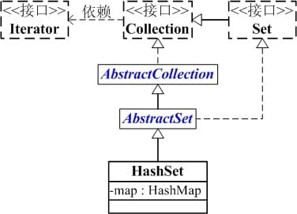

# Set


Set 都是基于 Map 实现的 , HashSet 是通过 HashMap 实现的, TreeSet 是通过 TreeMap 实现的

## HashSet

`HashSet` 是一个不允许存储重复元素的集合.



```java
public class HashSet<E>
       extends AbstractSet<E>
       implements Set<E>, Cloneable, java.io.Serializable
   {
       static final long serialVersionUID = -5024744406713321676L;
   
       // HashSet 是通过 map(HashMap对象) 保存内容的
      private transient HashMap<E,Object> map;
  
      // PRESENT 是向 map 中插入 key-value 对应的 value
      // 因为 HashSet 中只需要用到 key, 而 HashMap 是 key-value 键值对；
      // 所以向 map 中添加键值对时, 键值对的值固定是 PRESENT
      private static final Object PRESENT = new Object();
  
      // 默认构造函数
      public HashSet() {
          // 调用 HashMap 的默认构造函数, 创建 map
          map = new HashMap<E,Object>();
      }
      ....
}
```

### add

```java
    public boolean add(E e) {
        return map.put(e, PRESENT)==null;
    }
```

比较关键的就是这个 `add()` 方法。 可以看出它是将存放的对象当做了 `HashMap` 的健，`value` 都是相同的 `PRESENT` 。由于 `HashMap` 的 `key` 是不能重复的，所以每当有重复的值写入到 `HashSet` 时，`value` 会被覆盖，但 `key` 不会受到影响，这样就保证了 `HashSet` 中只能存放不重复的元素。

[👉 怎么向 Set 中存入相同的字符串](../se/string_kind.md#怎么向-set-中存入相同的字符串)

### 遍历方式

通过 Iterator 遍历 HashSet

```java
// 假设 set 是 HashSet 对象
for(Iterator iterator = set.iterator();
       iterator.hasNext(); ) { 
    iterator.next();
}   
```

通过 for-each 遍历 HashSet

```java
// 假设 set 是 HashSet 对象, 并且 set 中元素是 String 类型
String[] arr = (String[])set.toArray(new String[0]);
for (String str:arr)
    System.out.printf("for each : %s\n", str);
```

## TreeSet

### 遍历方式

```java
for(Iterator iter = set.iterator(); iter.hasNext(); ) { 
    iter.next();
} 
for(Iterator iter = set.descendingIterator(); iter.hasNext(); ) { 
    iter.next();
}
// 假设 set 是 TreeSet 对象, 并且 set 中元素是 String 类型
String[] arr = (String[])set.toArray(new String[0]);
for (String str:arr)
    System.out.printf("for each : %s\n", str);
```

TreeSet 不支持快速随机遍历, 只能通过迭代器进行遍历！