::: tip 并发 & 多线程

:::

<!-- more -->

[[toc]]

[TOC]

## 基础知识点

### 进程 线程

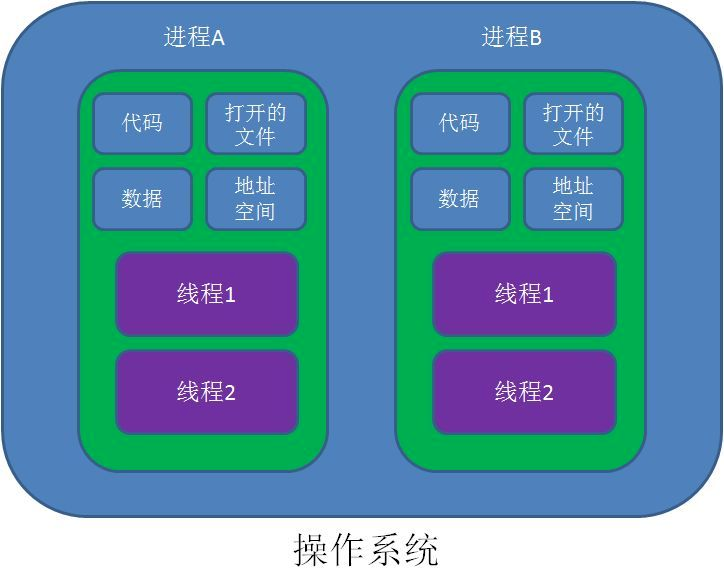

**对操作系统来说，线程是最小的执行单元，进程是最小的资源管理单元。**

无论进程还是线程，都是由操作系统所管理的。

**进程:**

进程是程序的一次执行过程，是系统运行程序的基本单位，因此进程是动态的。系统运行一个程序即是一个进程从创建，运行到消亡的过程。

在 Java 中，当我们启动 main 函数时其实就是启动了一个 JVM 的进程，而 main 函数所在的线程就是这个进程中的一个线程，也称主线程。

**线程:**

线程与进程相似，但线程是一个比进程更小的执行单位。一个进程在其执行的过程中可以产生多个线程。与进程不同的是同类的多个线程共享进程的**堆**和**方法区**资源，但每个线程有自己的**程序计数器**、**虚拟机栈**和**本地方法栈**，所以系统在产生一个线程，或是在各个线程之间作切换工作时，负担要比进程小得多，也正因为如此，线程也被称为轻量级进程。

Java 程序天生就是多线程程序，我们可以通过 JMX 来看一下一个普通的 Java 程序有哪些线程，代码如下。

```java
public class MultiThread {
	public static void main(String[] args) {
		// 获取 Java 线程管理 MXBean
		ThreadMXBean threadMXBean = ManagementFactory.getThreadMXBean();
		// 不需要获取同步的 monitor 和 synchronizer 信息，仅获取线程和线程堆栈信息
		ThreadInfo[] threadInfos = threadMXBean.dumpAllThreads(false, false);
		// 遍历线程信息，仅打印线程 ID 和线程名称信息
		for (ThreadInfo threadInfo : threadInfos) {
			System.out.println("[" + threadInfo.getThreadId() + "] " + threadInfo.getThreadName());
		}
	}
}
```

上述程序输出如下（输出内容可能不同，不用太纠结下面每个线程的作用，只用知道 main 线程执行 main 方法即可）：

```java
[5] Attach Listener //添加事件
[4] Signal Dispatcher // 分发处理给 JVM 信号的线程
[3] Finalizer //调用对象 finalize 方法的线程
[2] Reference Handler //清除 reference 线程
[1] main //main 线程,程序入口
```

从上面的输出内容可以看出：**一个 Java 程序的运行是 main 线程和多个其他线程同时运行**。

Java 中线程具有五种状态:

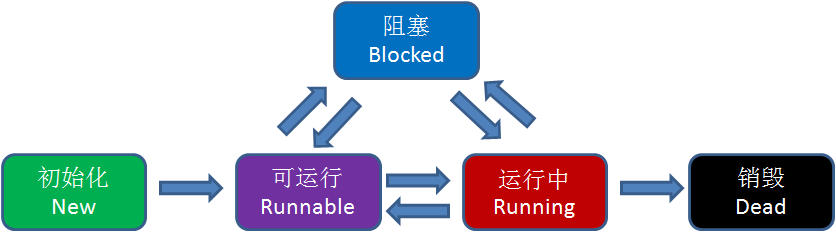

JVM 需要通过操作系统内核中的 TCB（Thread Control Block）模块来改变线程的状态，这一过程需要耗费一定的 CPU 资源

## 请简要描述线程与进程的关系, 区别及优缺点

**从 JVM 角度说进程和线程之间的关系**

### 进程和线程的关系

下图是 Java 内存区域，通过下图我们从 JVM 的角度来说一下线程和进程之间的关系

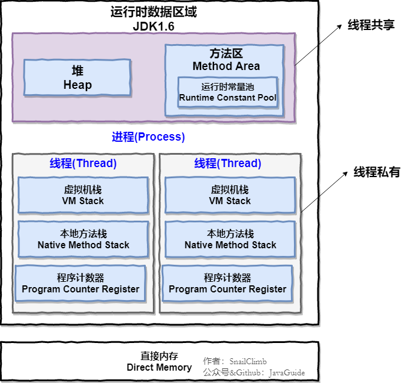

从上图可以看出：一个进程中可以有多个线程，多个线程共享进程的**堆**和**方法区 (JDK1.8 之后的元空间)资源，但是每个线程有自己的程序计数器**、**虚拟机栈** 和 **本地方法栈**。

**总结：** 线程 是 进程 划分成的更小的运行单位。线程和进程最大的不同在于基本上各进程是独立的，而各线程则不一定，因为同一进程中的线程极有可能会相互影响。线程执行开销小，但不利于资源的管理和保护；而进程正相反

下面是该知识点的扩展内容！

下面来思考这样一个问题：为什么**程序计数器**、**虚拟机栈**和**本地方法栈**是线程私有的呢？为什么堆和方法区是线程共享的呢？

### 程序计数器为什么是私有的

程序计数器主要有下面两个作用：

1. 字节码解释器通过改变程序计数器来依次读取指令，从而实现代码的流程控制，如：顺序执行、选择、循环、异常处理。
2. 在多线程的情况下，程序计数器用于记录当前线程执行的位置，从而当线程被切换回来的时候能够知道该线程上次运行到哪儿了。

需要注意的是，如果执行的是 native 方法，那么程序计数器记录的是 undefined 地址，只有执行的是 Java 代码时程序计数器记录的才是下一条指令的地址。

所以，程序计数器私有主要是为了**线程切换后能恢复到正确的执行位置**。

### 虚拟机栈和本地方法栈为什么是私有的

- **虚拟机栈：**每个 Java 方法在执行的同时会创建一个栈帧用于存储局部变量表、操作数栈、常量池引用等信息。从方法调用直至执行完成的过程，就对应着一个栈帧在 Java 虚拟机栈中入栈和出栈的过程。
- **本地方法栈：**和虚拟机栈所发挥的作用非常相似，区别是： **虚拟机栈为虚拟机执行 Java 方法 （也就是字节码）服务，而本地方法栈则为虚拟机使用到的 Native 方法服务。** 在 HotSpot 虚拟机中和 Java 虚拟机栈合二为一。

所以，为了**保证线程中的局部变量不被别的线程访问到**，虚拟机栈和本地方法栈是线程私有的。

### 一句话简单了解堆和方法区

堆和方法区是所有线程共享的资源，其中堆是进程中最大的一块内存，主要用于存放新创建的对象 (所有对象都在这里分配内存)，方法区主要用于存放已被加载的类信息、常量、静态变量、即时编译器编译后的代码等数据。

## 为什么要使用多线程

先从总体上来说：

- **从计算机底层来说：** 线程可以比作是轻量级的进程，是程序执行的最小单位, 线程间的切换和调度的成本远远小于进程。另外，多核 CPU 时代意味着多个线程可以同时运行，这减少了线程上下文切换的开销。
- **从当代互联网发展趋势来说：** 现在的系统动不动就要求百万级甚至千万级的并发量，而多线程并发编程正是开发高并发系统的基础，利用好多线程机制可以大大提高系统整体的并发能力以及性能。

再深入到计算机底层来探讨：

- **单核时代：** 在单核时代多线程主要是为了提高 CPU 和 IO 设备的综合利用率。举个例子：当只有一个线程的时候会导致 CPU 计算时，IO 设备空闲；进行 IO 操作时，CPU 空闲。我们可以简单地说这两者的利用率目前都是 50%左右。但是当有两个线程的时候就不一样了，当一个线程执行 CPU 计算时，另外一个线程可以进行 IO 操作，这样两个的利用率就可以在理想情况下达到 100%了。
- **多核时代:** 多核时代多线程主要是为了提高 CPU 利用率。举个例子：假如我们要计算一个复杂的任务，我们只用一个线程的话，CPU 只会一个 CPU 核心被利用到，而创建多个线程就可以让多个 CPU 核心被利用到，这样就提高了 CPU 的利用率。

## 使用多线程可能带来的问题

并发编程的目的就是为了能提高程序的执行效率提高程序运行速度，但是并发编程并不总是能提高程序运行速度的，而且并发编程可能会遇到很多问题，比如：内存泄漏、上下文切换、死锁还有受限于硬件和软件的资源闲置问题。

## 线程的生命周期和状态

Java 线程在运行的生命周期中的指定时刻只可能处于下面 6 种不同状态的其中一个状态


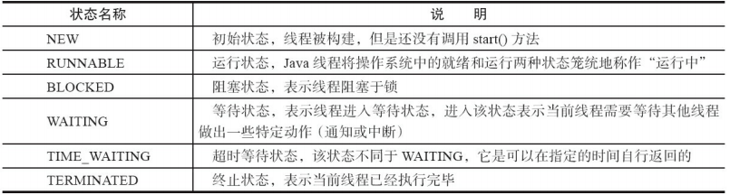


线程在生命周期中并不是固定处于某一个状态而是随着代码的执行在不同状态之间切换

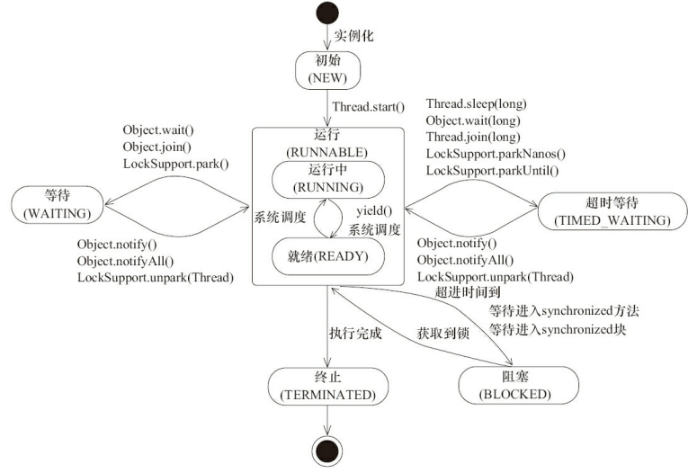

由上图可以看出：线程创建之后它将处于 **NEW（新建）** 状态，调用 `start()` 方法后开始运行，线程这时候处于 **READY（可运行）** 状态。可运行状态的线程获得了 CPU 时间片（timeslice）后就处于 **RUNNING（运行）** 状态。

::: tip

操作系统隐藏 Java 虚拟机（JVM）中的 RUNNABLE 和 RUNNING 状态，它只能看到 RUNNABLE 状态（图源：[HowToDoInJava](https://howtodoinjava.com/)：[Java Thread Life Cycle and Thread States](https://howtodoinjava.com/java/multi-threading/java-thread-life-cycle-and-thread-states/)），所以 Java 系统一般将这两个状态统称为 **RUNNABLE（运行中）** 状态 。

:::


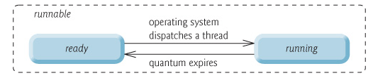

当线程执行 `wait()`方法之后，线程进入 **WAITING（等待）**状态。进入等待状态的线程需要依靠其他线程的通知才能够返回到运行状态，而 **TIME_WAITING(超时等待)** 状态相当于在等待状态的基础上增加了超时限制，比如通过 `sleep（long millis）`方法或 `wait（long millis）`方法可以将 Java 线程置于 TIMED WAITING 状态。当超时时间到达后 Java 线程将会返回到 RUNNABLE 状态。当线程调用同步方法时，在没有获取到锁的情况下，线程将会进入到 **BLOCKED（阻塞）** 状态。线程在执行 Runnable 的`run()`方法之后将会进入到 **TERMINATED（终止）** 状态。

## 什么是上下文切换

多线程编程中一般线程的个数都大于 CPU 核心的个数，而一个 CPU 核心在任意时刻只能被一个线程使用，为了让这些线程都能得到有效执行，CPU 采取的策略是为每个线程分配时间片并轮转的形式。当一个线程的时间片用完的时候就会重新处于就绪状态让给其他线程使用，这个过程就属于一次上下文切换。

概括来说就是：当前任务在执行完 CPU 时间片切换到另一个任务之前会先保存自己的状态，以便下次再切换会这个任务时，可以再加载这个任务的状态。**任务从保存到再加载的过程就是一次上下文切换**。

上下文切换通常是计算密集型的。也就是说，它需要相当可观的处理器时间，在每秒几十上百次的切换中，每次切换都需要纳秒量级的时间。所以，上下文切换对系统来说意味着消耗大量的 CPU 时间，事实上，可能是操作系统中时间消耗最大的操作。

Linux 相比与其他操作系统（包括其他类 Unix 系统）有很多的优点，其中有一项就是，其上下文切换和模式切换的时间消耗非常少。

## 死锁

### 认识线程死锁

多个线程同时被阻塞，它们中的一个或者全部都在等待某个资源被释放。由于线程被无限期地阻塞，因此程序不可能正常终止。

如下图所示，线程 A 持有资源 2，线程 B 持有资源 1，他们同时都想申请对方的资源，所以这两个线程就会互相等待而进入死锁状态。

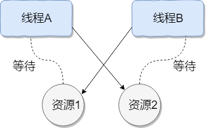

下面通过一个例子来说明线程死锁,代码模拟了上图的死锁的情况 (代码来源于《并发编程之美》)：

```java
public class DeadLockDemo {
    private static Object resource1 = new Object();//资源 1
    private static Object resource2 = new Object();//资源 2

    public static void main(String[] args) {
        new Thread(() -> {
            synchronized (resource1) {
                System.out.println(Thread.currentThread() + "get resource1");
                try {
                    Thread.sleep(1000);
                } catch (InterruptedException e) {
                    e.printStackTrace();
                }
                System.out.println(Thread.currentThread() + "waiting get resource2");
                synchronized (resource2) {
                    System.out.println(Thread.currentThread() + "get resource2");
                }
            }
        }, "线程 1").start();

        new Thread(() -> {
            synchronized (resource2) {
                System.out.println(Thread.currentThread() + "get resource2");
                try {
                    Thread.sleep(1000);
                } catch (InterruptedException e) {
                    e.printStackTrace();
                }
                System.out.println(Thread.currentThread() + "waiting get resource1");
                synchronized (resource1) {
                    System.out.println(Thread.currentThread() + "get resource1");
                }
            }
        }, "线程 2").start();
    }
}
```

Output

```java
Thread[线程 1,5,main]get resource1
Thread[线程 2,5,main]get resource2
Thread[线程 1,5,main]waiting get resource2
Thread[线程 2,5,main]waiting get resource1
```

线程 A 通过 synchronized (resource1) 获得 resource1 的监视器锁，然后通过` Thread.sleep(1000);`让线程 A 休眠 1s 为的是让线程 B 得到执行然后获取到 resource2 的监视器锁。线程 A 和线程 B 休眠结束了都开始企图请求获取对方的资源，然后这两个线程就会陷入互相等待的状态，这也就产生了死锁。上面的例子符合产生死锁的四个必要条件。

学过操作系统的朋友都知道产生死锁必须具备以下四个条件：

1. 互斥条件：该资源任意一个时刻只由一个线程占用。
2. 请求与保持条件：一个进程因请求资源而阻塞时，对已获得的资源保持不放。
3. 不剥夺条件: 线程已获得的资源在末使用完之前不能被其他线程强行剥夺，只有自己使用完毕后才释放资源。
4. 循环等待条件: 若干进程之间形成一种头尾相接的循环等待资源关系。

### 如何避免线程死锁

我们只要破坏产生死锁的四个条件中的其中一个就可以了。

**破坏互斥条件**

这个条件我们没有办法破坏，因为我们用锁本来就是想让他们互斥的（临界资源需要互斥访问）。

**破坏请求与保持条件**

一次性申请所有的资源。

**破坏不剥夺条件**

占用部分资源的线程进一步申请其他资源时，如果申请不到，可以主动释放它占有的资源。

**破坏循环等待条件**

靠按序申请资源来预防。按某一顺序申请资源，释放资源则反序释放。破坏循环等待条件。

我们对线程 2 的代码修改成下面这样就不会产生死锁了。

```java
        new Thread(() -> {
            synchronized (resource1) {
                System.out.println(Thread.currentThread() + "get resource1");
                try {
                    Thread.sleep(1000);
                } catch (InterruptedException e) {
                    e.printStackTrace();
                }
                System.out.println(Thread.currentThread() + "waiting get resource2");
                synchronized (resource2) {
                    System.out.println(Thread.currentThread() + "get resource2");
                }
            }
        }, "线程 2").start();
```

Output

```java
Thread[线程 1,5,main]get resource1
Thread[线程 1,5,main]waiting get resource2
Thread[线程 1,5,main]get resource2
Thread[线程 2,5,main]get resource1
Thread[线程 2,5,main]waiting get resource2
Thread[线程 2,5,main]get resource2

Process finished with exit code 0
```

我们分析一下上面的代码为什么避免了死锁的发生?

线程 1 首先获得到 resource1 的监视器锁,这时候线程 2 就获取不到了。然后线程 1 再去获取 resource2 的监视器锁，可以获取到。然后线程 1 释放了对 resource1、resource2 的监视器锁的占用，线程 2 获取到就可以执行了。这样就破坏了破坏循环等待条件，因此避免了死锁。

## sleep() 方法和 wait() 方法区别和共同点

- 两者最主要的区别在于：**sleep 方法没有释放锁，而 wait 方法释放了锁** 。
- 两者都可以暂停线程的执行。
- Wait 通常被用于线程间交互/通信，sleep 通常被用于暂停执行。
- wait() 方法被调用后，线程不会自动苏醒，需要别的线程调用同一个对象上的 notify() 或者 notifyAll() 方法。sleep() 方法执行完成后，线程会自动苏醒。

## start() 和 run() 的区别

new 一个 Thread，线程进入了新建状态; 调用 start() 方法，会启动一个线程并使线程进入了就绪状态，当分配到时间片后就可以开始运行了。 

start() 会执行线程的相应准备工作，然后自动执行 run() 方法的内容，这是真正的多线程工作。 而直接执行 run() 方法，会把 run 方法当成一个 main 线程下的普通方法去执行，并不会在某个线程中执行它，所以这并不是多线程工作。

**总结： 调用 start 方法方可启动线程并使线程进入就绪状态，而 run 方法只是 thread 的一个普通方法调用，还是在主线程里执行。**

## synchronized 相关

### 说一说自己对于 synchronized 关键字的了解

synchronized 关键字解决的是多个线程之间访问资源的同步性，synchronized 关键字可以保证被它修饰的方法或者代码块在任意时刻只能有一个线程执行。

另外，在 Java 早期版本中，synchronized 属于重量级锁，效率低下，因为监视器锁（monitor）是依赖于底层的操作系统的 Mutex Lock 来实现的，Java 的线程是映射到操作系统的原生线程之上的。如果要挂起或者唤醒一个线程，都需要操作系统帮忙完成，而操作系统实现线程之间的切换时需要从**用户态转换到内核态**，这个状态之间的转换需要相对比较长的时间，时间成本相对较高，这也是为什么早期的 synchronized 效率低的原因。

庆幸的是在 Java 6 之后 Java 官方对从 JVM 层面对 synchronized 较大优化，所以现在的 synchronized 锁效率也优化得很不错了。JDK1.6 对锁的实现引入了大量的优化，如自旋锁、适应性自旋锁、锁消除、锁粗化、偏向锁、轻量级锁等技术来减少锁操作的开销。

### 说说自己是怎么使用 synchronized 关键字

**synchronized 关键字最主要的三种使用方式：**

- **修饰实例方法:** 作用于当前对象实例加锁，进入同步代码前要获得当前对象实例的锁
- **修饰静态方法:**  也就是给当前类加锁，会作用于类的所有对象实例，因为静态成员不属于任何一个实例对象，是类成员（ static 表明这是该类的一个静态资源，不管 new 了多少个对象，只有一份）。所以如果一个线程 A调用一个实例对象的非静态 synchronized 方法，而线程 B 需要调用这个实例对象所属类的静态 synchronized 方法，是允许的，不会发生互斥现象，**因为访问静态 synchronized 方法占用的锁是当前类的锁，而访问非静态 synchronized 方法占用的锁是当前实例对象锁**。
- **修饰代码块:** 指定加锁对象，对给定对象加锁，进入同步代码库前要获得给定对象的锁。

**总结：** synchronized 关键字加到 static 静态方法和 synchronized(class) 代码块上都是是给 Class 类上锁。synchronized 关键字加到实例方法上是给对象实例上锁。尽量不要使用 synchronized(String a) 因为JVM中，字符串常量池具有缓存功能！

下面我以一个常见的面试题为例讲解一下 synchronized 关键字的具体使用。

面试中面试官经常会说：“单例模式了解吗？来给我手写一下！给我解释一下双重检验锁方式实现单例模式的原理呗！”

**双重校验锁实现对象单例（线程安全）**

```java
public class Singleton {

    private volatile static Singleton uniqueInstance;

    private Singleton() {
    }

    public static Singleton getUniqueInstance() {
       // 先判断对象是否已经实例过，没有实例化过才进入加锁代码
        if (uniqueInstance == null) {
            // 类对象加锁
            synchronized (Singleton.class) {
                if (uniqueInstance == null) {
                    uniqueInstance = new Singleton();
                }
            }
        }
        return uniqueInstance;
    }
}
```

另外，需要注意 uniqueInstance 采用 volatile 关键字修饰也是很有必要。

uniqueInstance 采用 volatile 关键字修饰也是很有必要的， uniqueInstance = new Singleton(); 这段代码其实是分为三步执行：

```java
memory = allocate();  // 1：分配对象的内存空间 
ctorInstance(memory); // 2：初始化对象 
instance = memory;    // 3：设置 uniqueInstance 指向刚分配的内存地址
```

但是由于 JVM 具有指令重排的特性，执行顺序有可能变成 1->3->2。

```java
memory = allocate();  // 1：分配对象的内存空间  
instance = memory;    // 3：设置instance指向刚分配的内存地址
					  					// 注意：此时对象尚未初始化
ctorInstance(memory); // 2：初始化对象
```

指令重排在单线程环境下不会出现问题，但是在多线程环境下会导致一个线程获得还没有初始化的实例。例如，线程 T1 执行了 1 和 3，此时 T2 调用 getUniqueInstance()  后发现 uniqueInstance 不为空，因此返回 uniqueInstance，但此时 uniqueInstance 还未被初始化。

使用 volatile 可以禁止 JVM 的指令重排，保证在多线程环境下也能正常运行。

### synchronized 关键字的底层原理

**synchronized 关键字底层原理属于 JVM 层面。**

**synchronized 同步语句块的情况**

```java
public class SynchronizedDemo {
	public void method() {
		synchronized (this) {
			System.out.println("synchronized 代码块");
		}
	}
}
```

通过 JDK 自带的 javap 命令查看 SynchronizedDemo 类的相关字节码信息：首先切换到类的对应目录执行 `javac SynchronizedDemo.java` 命令生成编译后的 .class 文件，然后执行`javap -c SynchronizedDemo.class`。

```java
Compiled from "SynchronizedDemo.java"
public class info.dong4j.interview.concurrent.SynchronizedDemo {
  public info.dong4j.interview.concurrent.SynchronizedDemo();
    Code:
       0: aload_0
       1: invokespecial #1                  // Method java/lang/Object."<init>":()V
       4: return

  public void method();
    Code:
       0: aload_0
       1: dup
       2: astore_1
       3: monitorenter
       4: getstatic     #2                  // Field java/lang/System.out:Ljava/io/PrintStream;
       7: ldc           #3                  // String synchronized 代码块
       9: invokevirtual #4                  // Method java/io/PrintStream.println:(Ljava/lang/String;)V
      12: aload_1
      13: monitorexit
      14: goto          22
      17: astore_2
      18: aload_1
      19: monitorexit
      20: aload_2
      21: athrow
      22: return
    Exception table:
       from    to  target type
           4    14    17   any
          17    20    17   any
}
```

从上面我们可以看出：

**synchronized 同步语句块的实现使用的是 monitorenter 和 monitorexit 指令，其中 monitorenter 指令指向同步代码块的开始位置，monitorexit 指令则指明同步代码块的结束位置。** 当执行 monitorenter 指令时，线程试图获取锁也就是获取 monitor(monitor对象存在于每个Java对象的对象头中，synchronized 锁便是通过这种方式获取锁的，也是为什么 Java 中任意对象可以作为锁的原因) 的持有权。当计数器为 0 则可以成功获取，获取后将锁计数器设为1 也就是加 1。相应的在执行 monitorexit 指令后，将锁计数器设为 0，表明锁被释放。如果获取对象锁失败，那当前线程就要阻塞等待，直到锁被另外一个线程释放为止。

**synchronized 修饰方法的的情况**

```java
public class SynchronizedDemo2 {
	public synchronized void method() {
		System.out.println("synchronized 方法");
	}
}
```

```java
public synchronized void method();
    descriptor: ()V
    flags: ACC_PUBLIC, ACC_SYNCHRONIZED
    Code:
      stack=2, locals=1, args_size=1
         0: getstatic     #2                  // Field java/lang/System.out:Ljava/io/PrintStream;
         3: ldc           #3                  // String synchronized 方法
         5: invokevirtual #4                  // Method java/io/PrintStream.println:(Ljava/lang/String;)V
         8: return
      LineNumberTable:
        line 5: 0
        line 6: 8
      LocalVariableTable:
        Start  Length  Slot  Name   Signature
            0       9     0  this   Linfo/dong4j/interview/concurrent/SynchronizedDemo2;

```

synchronized 修饰的方法并没有 monitorenter 指令和 monitorexit 指令，取得代之的确实是 **ACC_SYNCHRONIZED** 标识，该标识指明了该方法是一个同步方法，JVM 通过该 **ACC_SYNCHRONIZED** 访问标志来辨别一个方法是否声明为同步方法，从而执行相应的同步调用。

### JDK1.6 之后的 synchronized 关键字底层做了哪些优化

JDK1.6 对锁的实现引入了大量的优化，如偏向锁、轻量级锁、自旋锁、适应性自旋锁、锁消除、锁粗化等技术来减少锁操作的开销。

#### 偏向锁

**引入偏向锁的目的和引入轻量级锁的目的很像，他们都是为了没有多线程竞争的前提下，减少传统的重量级锁使用操作系统互斥量产生的性能消耗。但是不同是：轻量级锁在无竞争的情况下使用 CAS 操作去代替使用互斥量。而偏向锁在无竞争的情况下会把整个同步都消除掉**。

偏向锁的“偏”就是偏心的偏，它的意思是会偏向于第一个获得它的线程，如果在接下来的执行中，该锁没有被其他线程获取，那么持有偏向锁的线程就不需要进行同步！关于偏向锁的原理可以查看《深入理解Java虚拟机：JVM高级特性与最佳实践》第二版的13章第三节锁优化。

但是对于锁竞争比较激烈的场合，偏向锁就失效了，因为这样场合极有可能每次申请锁的线程都是不相同的，因此这种场合下不应该使用偏向锁，否则会得不偿失，需要注意的是，偏向锁失败后，并不会立即膨胀为重量级锁，而是先升级为轻量级锁。

#### 轻量级锁

倘若偏向锁失败，虚拟机并不会立即升级为重量级锁，它还会尝试使用一种称为轻量级锁的优化手段(1.6之后加入的)。**轻量级锁不是为了代替重量级锁，它的本意是在没有多线程竞争的前提下，减少传统的重量级锁使用操作系统互斥量产生的性能消耗，因为使用轻量级锁时，不需要申请互斥量。另外，轻量级锁的加锁和解锁都用到了CAS操作。** 关于轻量级锁的加锁和解锁的原理可以查看《深入理解Java虚拟机：JVM高级特性与最佳实践》第二版的13章第三节锁优化。

**轻量级锁能够提升程序同步性能的依据是“对于绝大部分锁，在整个同步周期内都是不存在竞争的”，这是一个经验数据。如果没有竞争，轻量级锁使用 CAS 操作避免了使用互斥操作的开销。但如果存在锁竞争，除了互斥量开销外，还会额外发生CAS操作，因此在有锁竞争的情况下，轻量级锁比传统的重量级锁更慢！如果锁竞争激烈，那么轻量级将很快膨胀为重量级锁！**

#### 自旋锁和自适应自旋

轻量级锁失败后，虚拟机为了避免线程真实地在操作系统层面挂起，还会进行一项称为自旋锁的优化手段。

互斥同步对性能最大的影响就是阻塞的实现，因为挂起线程/恢复线程的操作都需要转入内核态中完成（用户态转换到内核态会耗费时间）。

**一般线程持有锁的时间都不是太长，所以仅仅为了这一点时间去挂起线程/恢复线程是得不偿失的。** 所以，虚拟机的开发团队就这样去考虑：“我们能不能让后面来的请求获取锁的线程等待一会而不被挂起呢？看看持有锁的线程是否很快就会释放锁”。**为了让一个线程等待，我们只需要让线程执行一个忙循环（自旋），这项技术就叫做自旋**。

百度百科对自旋锁的解释：

::: tip 

何谓自旋锁？它是为实现保护共享资源而提出一种锁机制。其实，自旋锁与互斥锁比较类似，它们都是为了解决对某项资源的互斥使用。无论是互斥锁，还是自旋锁，在任何时刻，最多只能有一个保持者，也就说，在任何时刻最多只能有一个执行单元获得锁。但是两者在调度机制上略有不同。对于互斥锁，如果资源已经被占用，资源申请者只能进入睡眠状态。但是自旋锁不会引起调用者睡眠，如果自旋锁已经被别的执行单元保持，调用者就一直循环在那里看是否该自旋锁的保持者已经释放了锁，"自旋"一词就是因此而得名。

:::

自旋锁在 JDK1.6 之前其实就已经引入了，不过是默认关闭的，需要通过`--XX:+UseSpinning`参数来开启。JDK1.6 及1.6之后，就改为默认开启的了。需要注意的是：自旋等待不能完全替代阻塞，因为它还是要占用处理器时间。如果锁被占用的时间短，那么效果当然就很好了！反之，相反！自旋等待的时间必须要有限度。如果自旋超过了限定次数任然没有获得锁，就应该挂起线程。**自旋次数的默认值是10次，用户可以修改 `--XX:PreBlockSpin` 来更改**。

另外, **在 JDK1.6 中引入了自适应的自旋锁。自适应的自旋锁带来的改进就是：自旋的时间不在固定了，而是和前一次同一个锁上的自旋时间以及锁的拥有者的状态来决定，虚拟机变得越来越“聪明”了**。

#### 锁消除

锁消除理解起来很简单，它指的就是虚拟机即使编译器在运行时，如果检测到那些共享数据不可能存在竞争，那么就执行锁消除。锁消除可以节省毫无意义的请求锁的时间。

#### 锁粗化

原则上，我们在编写代码的时候，总是推荐将同步块的作用范围限制得尽量小，——直在共享数据的实际作用域才进行同步，这样是为了使得需要同步的操作数量尽可能变小，如果存在锁竞争，那等待线程也能尽快拿到锁。

大部分情况下，上面的原则都是没有问题的，但是如果一系列的连续操作都对同一个对象反复加锁和解锁，那么会带来很多不必要的性能消耗。

**锁主要存在四种状态，依次是：无锁状态、偏向锁状态、轻量级锁状态、重量级锁状态，他们会随着竞争的激烈而逐渐升级。注意锁可以升级不可降级，这种策略是为了提高获得锁和释放锁的效率。**

### synchronized 和ReentrantLock 的区别

#### 两者都是可重入锁

两者都是可重入锁。“可重入锁”概念是：自己可以再次获取自己的内部锁。比如一个线程获得了某个对象的锁，此时这个对象锁还没有释放，当其再次想要获取这个对象的锁的时候还是可以获取的，如果不可锁重入的话，就会造成死锁。同一个线程每次获取锁，锁的计数器都自增 1，所以要等到锁的计数器下降为 0 时才能释放锁。

#### synchronized 依赖于 JVM 而 ReentrantLock 依赖于 API

synchronized 是依赖于 JVM 实现的，前面我们也讲到了 虚拟机团队在 JDK1.6 为 synchronized 关键字进行了很多优化，但是这些优化都是在虚拟机层面实现的，并没有直接暴露给我们。ReentrantLock 是 JDK 层面实现的（也就是 API 层面，需要 lock() 和 unlock() 方法配合 try/finally 语句块来完成），所以我们可以通过查看它的源代码，来看它是如何实现的。

#### ReentrantLock 比 synchronized 增加了一些高级功能

相比synchronized，ReentrantLock增加了一些高级功能。主要来说主要有三点：**等待可中断；可实现公平锁；可实现选择性通知（锁可以绑定多个条件）**

- **ReentrantLock提供了一种能够中断等待锁的线程的机制**，通过 `lock.lockInterruptibly()` 来实现这个机制。也就是说正在等待的线程可以选择放弃等待，改为处理其他事情。
- **ReentrantLock 可以指定是公平锁还是非公平锁。而 synchronized 只能是非公平锁。所谓的公平锁就是先等待的线程先获得锁。**  ReentrantLock 默认情况是非公平的，可以通过 ReentrantLock 类的`ReentrantLock(boolean fair)`构造方法来制定是否是公平的。
- synchronized 关键字与 wait() 和 notify()/notifyAll() 方法相结合可以实现 等待/通知 机制，ReentrantLock 类当然也可以实现，但是需要借助于 Condition 接口与newCondition() 方法。Condition 是 JDK1.5 之后才有的，它具有很好的灵活性，比如可以实现多路通知功能也就是在一个 Lock 对象中可以创建多个 Condition 实例（即对象监视器），**线程对象可以注册在指定的 Condition 中，从而可以有选择性的进行线程通知，在调度线程上更加灵活。 在使用 notify()/notifyAll() 方法进行通知时，被通知的线程是由 JVM 选择的，用 ReentrantLock 类结合 Condition 实例可以实现“选择性通知”** ，这个功能非常重要，而且是 Condition 接口默认提供的。而 synchronized 关键字就相当于整个 Lock 对象中只有一个 Condition 实例，所有的线程都注册在它一个身上。如果执行 notifyAll() 方法的话就会通知所有处于等待状态的线程这样会造成很大的效率问题，而 Condition 实例的 signalAll() 方法 只会唤醒注册在该 Condition 实例中的所有等待线程。

如果你想使用上述功能，那么选择 ReentrantLock 是一个不错的选择。

#### 性能已不是选择标准

在 JDK1.6 之前，synchronized  的性能是比 ReenTrantLock 差很多。具体表示为：synchronized 关键字吞吐量随线程数的增加，下降得非常严重。而 ReenTrantLock 基本保持一个比较稳定的水平。我觉得这也侧面反映了， synchronized 关键字还有非常大的优化余地。后续的技术发展也证明了这一点，我们上面也讲了在 JDK1.6 之后 JVM 团队对 synchronized 关键字做了很多优化。

**JDK1.6 之后，synchronized 和 ReenTrantLock 的性能基本是持平了。所以网上那些说因为性能才选择 ReenTrantLock 的文章都是错的！JDK1.6之后，性能已经不是选择 synchronized 和 ReenTrantLock 的影响因素了！而且虚拟机在未来的性能改进中会更偏向于原生的 synchronized，所以还是提倡在 synchronized 能满足你的需求的情况下，优先考虑使用 synchronized 关键字来进行同步！优化后的 synchronized 和 ReenTrantLock 一样，在很多地方都是用到了 CAS 操作**。

## volatile 相关

### 讲一下 Java 内存模型

在 JDK1.2 之前，Java 的内存模型实现总是从**主存**（即共享内存）读取变量，是不需要进行特别的注意的。而在当前的 Java 内存模型下，线程可以把变量保存**本地内存**比如机器的寄存器）中，而不是直接在主存中进行读写。这就可能造成一个线程在主存中修改了一个变量的值，而另外一个线程还继续使用它在寄存器中的变量值的拷贝，造成**数据的不一致**。

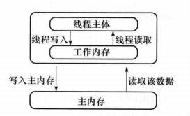

要解决这个问题，就需要把变量声明为 **volatile**，这就指示 JVM，这个变量是不稳定的，每次使用它都到主存中进行读取。

说白了， **volatile** 关键字的主要作用就是保证变量的可见性然后还有一个作用是防止指令重排序。

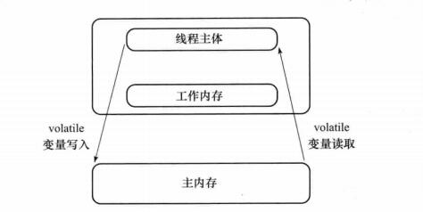

### 说说 synchronized 关键字和 volatile 关键字的区别

synchronized 关键字和 volatile 关键字比较

- **volatile 关键字**是线程同步的**轻量级实现**，所以 **volatile 性能肯定比 synchronized 关键字要好**。但是**volatile 关键字只能用于变量而 synchronized 关键字可以修饰方法以及代码块**。synchronized 关键字在 JavaSE1.6 之后进行了主要包括为了减少获得锁和释放锁带来的性能消耗而引入的偏向锁和轻量级锁以及其它各种优化之后执行效率有了显著提升，**实际开发中使用 synchronized 关键字的场景还是更多一些**。
- **多线程访问 volatile 关键字不会发生阻塞，而 synchronized 关键字可能会发生阻塞**
- **volatile 关键字能保证数据的可见性，但不能保证数据的原子性。synchronized 关键字两者都能保证。**
- **volatile 关键字主要用于解决变量在多个线程之间的可见性，而 synchronized 关键字解决的是多个线程之间访问资源的同步性。**

## ThreadLocal 相关

通常情况下，我们创建的变量是可以被任何一个线程访问并修改的。**如果想实现每一个线程都有自己的专属本地变量该如何解决呢？** JDK中提供的`ThreadLocal`类正是为了解决这样的问题。 **ThreadLocal类主要解决的就是让每个线程绑定自己的值，可以将 ThreadLocal 类形象的比喻成存放数据的盒子，盒子中可以存储每个线程的私有数据。**

**如果你创建了一个 ThreadLocal 变量，那么访问这个变量的每个线程都会有这个变量的本地副本，这也是ThreadLocal 变量名的由来。他们可以使用 get（） 和 set（） 方法来获取默认值或将其值更改为当前线程所存的副本的值，从而避免了线程安全问题。**

### ThreadLocal 示例

相信看了上面的解释，大家已经搞懂 ThreadLocal 类是个什么东西了。

```java
import java.text.SimpleDateFormat;
import java.util.Random;

public class ThreadLocalExample implements Runnable{

     // SimpleDateFormat 不是线程安全的，所以每个线程都要有自己独立的副本
    private static final ThreadLocal<SimpleDateFormat> formatter = ThreadLocal.withInitial(() -> new SimpleDateFormat("yyyyMMdd HHmm"));

    public static void main(String[] args) throws InterruptedException {
        ThreadLocalExample obj = new ThreadLocalExample();
        for(int i=0 ; i<10; i++){
            Thread t = new Thread(obj, ""+i);
            Thread.sleep(new Random().nextInt(1000));
            t.start();
        }
    }

    @Override
    public void run() {
        System.out.println("Thread Name= "+Thread.currentThread().getName()+" default Formatter = "+formatter.get().toPattern());
        try {
            Thread.sleep(new Random().nextInt(1000));
        } catch (InterruptedException e) {
            e.printStackTrace();
        }
        //formatter pattern is changed here by thread, but it won't reflect to other threads
        formatter.set(new SimpleDateFormat());

        System.out.println("Thread Name= "+Thread.currentThread().getName()+" formatter = "+formatter.get().toPattern());
    }

}
```

Output:

```java
Thread Name= 0 default Formatter = yyyyMMdd HHmm
Thread Name= 0 formatter = yy-M-d ah:mm
Thread Name= 1 default Formatter = yyyyMMdd HHmm
Thread Name= 2 default Formatter = yyyyMMdd HHmm
Thread Name= 1 formatter = yy-M-d ah:mm
Thread Name= 3 default Formatter = yyyyMMdd HHmm
Thread Name= 2 formatter = yy-M-d ah:mm
Thread Name= 4 default Formatter = yyyyMMdd HHmm
Thread Name= 3 formatter = yy-M-d ah:mm
Thread Name= 4 formatter = yy-M-d ah:mm
Thread Name= 5 default Formatter = yyyyMMdd HHmm
Thread Name= 5 formatter = yy-M-d ah:mm
Thread Name= 6 default Formatter = yyyyMMdd HHmm
Thread Name= 6 formatter = yy-M-d ah:mm
Thread Name= 7 default Formatter = yyyyMMdd HHmm
Thread Name= 7 formatter = yy-M-d ah:mm
Thread Name= 8 default Formatter = yyyyMMdd HHmm
Thread Name= 9 default Formatter = yyyyMMdd HHmm
Thread Name= 8 formatter = yy-M-d ah:mm
Thread Name= 9 formatter = yy-M-d ah:mm
```

从输出中可以看出，Thread-0 已经改变了formatter的值，但仍然是 thread-2默认格式化程序与初始化值相同，其他线程也一样。

上面有一段代码用到了创建 `ThreadLocal` 变量的那段代码用到了 Java8 的知识，它等于下面这段代码，如果你写了下面这段代码的话，IDEA 会提示你转换为 Java8 的格式。因为 ThreadLocal 类在 Java 8 中扩展，使用一个新的方法`withInitial()`，将 Supplier 功能接口作为参数。

```java
private static final ThreadLocal<SimpleDateFormat> formatter = new ThreadLocal<SimpleDateFormat>(){
        @Override
        protected SimpleDateFormat initialValue()
        {
            return new SimpleDateFormat("yyyyMMdd HHmm");
        }
    };
```

### ThreadLocal 原理

从 `Thread`类源代码入手。

```java
public class Thread implements Runnable {
 ......
// 与此线程有关的 ThreadLocal 值。由 ThreadLocal 类维护
ThreadLocal.ThreadLocalMap threadLocals = null;

// 与此线程有关的 InheritableThreadLocal 值。由 InheritableThreadLocal 类维护
ThreadLocal.ThreadLocalMap inheritableThreadLocals = null;
 ......
}
```

从上面 `Thread` 类 源代码可以看出 `Thread`  类中有一个  `threadLocals`  和 一个  `inheritableThreadLocals`  变量，它们都是  `ThreadLocalMap`  类型的变量,我们可以把  `ThreadLocalMap`  理解为 `ThreadLocal`  类实现的定制化的 `HashMap`。默认情况下这两个变量都是 null，只有当前线程调用  `ThreadLocal`  类的  `set `或  `get` 方法时才创建它们，实际上调用这两个方法的时候，我们调用的是 `ThreadLocalMap` 类对应的  `get() `、 `set() ` 方法。

`ThreadLocal `类的 `set()` 方法

```java
public void set(T value) {
    Thread t = Thread.currentThread();
    ThreadLocalMap map = getMap(t);
    if (map != null)
        map.set(this, value);
    else
        createMap(t, value);
}
ThreadLocalMap getMap(Thread t) {
    return t.threadLocals;
}
```

通过上面这些内容，我们足以通过猜测得出结论：**最终的变量是放在了当前线程的  ThreadLocalMap  中，并不是存在 ThreadLocal 上，ThreadLocal  可以理解为只是 ThreadLocalMap 的封装，传递了变量值。** `ThrealLocal` 类中可以通过 `Thread.currentThread()` 获取到当前线程对象后，直接通过 `getMap(Thread t)` 可以访问到该线程的`ThreadLocalMap `对象。

**每个 Thread 中都具备一个 ThreadLocalMap ，而 ThreadLocalMap 可以存储以 ThreadLocal 为 key 的键值对。** 比如我们在同一个线程中声明了两个 `ThreadLocal` 对象的话，会使用 `Thread`内部都是使用仅有那个`ThreadLocalMap` 存放数据的，`ThreadLocalMap`的 key 就是 `ThreadLocal`对象，value 就是 `ThreadLocal` 对象调用`set`方法设置的值。`ThreadLocal` 是 map 结构是为了让每个线程可以关联多个 `ThreadLocal`变量。这也就解释了 ThreadLocal 声明的变量为什么在每一个线程都有自己的专属本地变量。

`ThreadLocalMap` 是`ThreadLocal`的静态内部类。

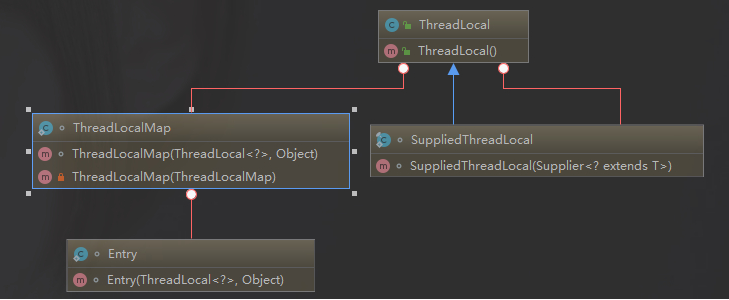


### ThreadLocal 内存泄露问题

`ThreadLocalMap` 中使用的 key 为 `ThreadLocal` 的弱引用,而 value 是强引用。所以，如果 `ThreadLocal` 没有被外部强引用的情况下，在垃圾回收的时候 key 会被清理掉，而 value 不会被清理掉。这样一来，`ThreadLocalMap` 中就会出现 key 为 null 的 Entry。假如我们不做任何措施的话，value 永远无法被 GC 回收，这个时候就可能会产生内存泄露。ThreadLocalMap 实现中已经考虑了这种情况，在调用 `set()`、`get()`、`remove()` 方法的时候，会清理掉 key 为 null 的记录。使用完 `ThreadLocal`方法后 最好手动调用`remove()`方法

```java
static class Entry extends WeakReference<ThreadLocal<?>> {
    /** The value associated with this ThreadLocal. */
    Object value;

    Entry(ThreadLocal<?> k, Object v) {
        super(k);
        value = v;
    }
}
```


::: tip  弱引用
如果一个对象只具有弱引用，那就类似于**可有可无的生活用品**。弱引用与软引用的区别在于：只具有弱引用的对象拥有更短暂的生命周期。在垃圾回收器线程扫描它 所管辖的内存区域的过程中，一旦发现了只具有弱引用的对象，不管当前内存空间足够与否，都会回收它的内存。不过，由于垃圾回收器是一个优先级很低的线程， 因此不一定会很快发现那些只具有弱引用的对象。
:::

弱引用可以和一个引用队列（ReferenceQueue）联合使用，如果弱引用所引用的对象被垃圾回收，Java 虚拟机就会把这个弱引用加入到与之关联的引用队列中。

## 线程池

### 为什么要用线程池

线程池提供了一种限制和管理资源（包括执行一个任务）。 每个线程池还维护一些基本统计信息，例如已完成任务的数量。

这里借用《Java并发编程的艺术》提到的来说一下使用线程池的好处：

- **降低资源消耗。** 通过重复利用已创建的线程降低线程创建和销毁造成的消耗。
- **提高响应速度。** 当任务到达时，任务可以不需要的等到线程创建就能立即执行。
- **提高线程的可管理性。** 线程是稀缺资源，如果无限制的创建，不仅会消耗系统资源，还会降低系统的稳定性，使用线程池可以进行统一的分配，调优和监控。

### 实现 Runnable 接口和 Callable 接口的区别

如果想让线程池执行任务的话需要实现的 Runnable 接口或 Callable 接口。 Runnable 接口或 Callable 接口实现类都可以被 ThreadPoolExecutor 或 ScheduledThreadPoolExecutor 执行。两者的区别在于 Runnable 接口不会返回结果但是 Callable 接口可以返回结果。

**备注：** 工具类`Executors`可以实现`Runnable`对象和`Callable`对象之间的相互转换。（`Executors.callable（Runnable task）`或`Executors.callable（Runnable task，Object resule）`）。

### 执行 execute() 方法和 submit() 方法的区别

**execute() 方法用于提交不需要返回值的任务，所以无法判断任务是否被线程池执行成功与否；**

**submit() 方法用于提交需要返回值的任务。线程池会返回一个 Future 类型的对象，通过这个 Future 对象可以判断任务是否执行成功**，并且可以通过 future 的 get() 方法来获取返回值，get() 方法会阻塞当前线程直到任务完成，而使用 `get（long timeout，TimeUnit unit）`方法则会阻塞当前线程一段时间后立即返回，这时候有可能任务没有执行完。

### 如何创建线程池

《阿里巴巴Java开发手册》中强制线程池不允许使用 Executors 去创建，而是通过 ThreadPoolExecutor 的方式，这样的处理方式让写的同学更加明确线程池的运行规则，规避资源耗尽的风险

::: tip Executors 返回线程池对象的弊端

1. **FixedThreadPool 和 SingleThreadExecutor** ： 允许**请求的队列长度**为 Integer.MAX_VALUE ，可能**堆积大量的请求**，从而导致 OOM。

2. **CachedThreadPool 和 ScheduledThreadPool** ： 允许**创建的线程数量**为 Integer.MAX_VALUE ，可能会**创建大量线程**，从而导致 OOM。

:::

#### 通过构造方法创建

```java
public ThreadPoolExecutor(int corePoolSize,
                          int maximumPoolSize,
                          long keepAliveTime,
                          TimeUnit unit,
                          BlockingQueue<Runnable> workQueue) {
    this(corePoolSize, maximumPoolSize, keepAliveTime, unit, workQueue,
         Executors.defaultThreadFactory(), defaultHandler);
}

public ThreadPoolExecutor(int corePoolSize,
                          int maximumPoolSize,
                          long keepAliveTime,
                          TimeUnit unit,
                          BlockingQueue<Runnable> workQueue,
                          ThreadFactory threadFactory) {
    this(corePoolSize, maximumPoolSize, keepAliveTime, unit, workQueue,
         threadFactory, defaultHandler);
}

public ThreadPoolExecutor(int corePoolSize,
                          int maximumPoolSize,
                          long keepAliveTime,
                          TimeUnit unit,
                          BlockingQueue<Runnable> workQueue,
                          RejectedExecutionHandler handler) {
    this(corePoolSize, maximumPoolSize, keepAliveTime, unit, workQueue,
         Executors.defaultThreadFactory(), handler);
}

public ThreadPoolExecutor(int corePoolSize,
                          int maximumPoolSize,
                          long keepAliveTime,
                          TimeUnit unit,
                          BlockingQueue<Runnable> workQueue,
                          ThreadFactory threadFactory,
                          RejectedExecutionHandler handler) {

                          ...
}
```


#### 通过 Executor 框架的工具类 Executors 创建

- **FixedThreadPool** ： 该方法返回一个固定线程数量的线程池。该线程池中的线程数量始终不变。当有一个新的任务提交时，线程池中若有空闲线程，则立即执行。若没有，则新的任务会被暂存在一个任务队列中，待有线程空闲时，便处理在任务队列中的任务。
- **SingleThreadExecutor：** 方法返回一个只有一个线程的线程池。若多余一个任务被提交到该线程池，任务会被保存在一个任务队列中，待线程空闲，按先入先出的顺序执行队列中的任务。
- **CachedThreadPool：** 该方法返回一个可根据实际情况调整线程数量的线程池。线程池的线程数量不确定，但若有空闲线程可以复用，则会优先使用可复用的线程。若所有线程均在工作，又有新的任务提交，则会创建新的线程处理任务。所有线程在当前任务执行完毕后，将返回线程池进行复用。

## Atomic 原子类

### 介绍一下Atomic 原子类

Atomic 翻译成中文是原子的意思。在化学上，我们知道原子是构成一般物质的最小单位，在化学反应中是不可分割的。在我们这里 Atomic 是指一个操作是不可中断的。即使是在多个线程一起执行的时候，一个操作一旦开始，就不会被其他线程干扰。

所以，所谓原子类说简单点就是具有原子/原子操作特征的类。

### JUC 包中的原子类是哪4类?

**基本类型**

使用原子的方式更新基本类型

- AtomicInteger：整形原子类
- AtomicLong：长整型原子类
- AtomicBoolean：布尔型原子类

**数组类型**

使用原子的方式更新数组里的某个元素

- AtomicIntegerArray：整形数组原子类
- AtomicLongArray：长整形数组原子类
- AtomicReferenceArray：引用类型数组原子类

**引用类型**

- AtomicReference：引用类型原子类
- AtomicStampedReference：原子更新引用类型里的字段原子类
- AtomicMarkableReference ：原子更新带有标记位的引用类型

**对象的属性修改类型**

- AtomicIntegerFieldUpdater：原子更新整形字段的更新器
- AtomicLongFieldUpdater：原子更新长整形字段的更新器
- AtomicStampedReference：原子更新带有版本号的引用类型。该类将整数值与引用关联起来，可用于解决原子的更新数据和数据的版本号，可以解决使用 CAS 进行原子更新时可能出现的 ABA 问题。

### 讲讲 AtomicInteger 的使用

**AtomicInteger 类常用方法**

```java
public final int get() // 获取当前的值
public final int getAndSet(int newValue) // 获取当前的值，并设置新的值
public final int getAndIncrement() // 获取当前的值，并自增
public final int getAndDecrement() // 获取当前的值，并自减
public final int getAndAdd(int delta) // 获取当前的值，并加上预期的值
boolean compareAndSet(int expect, int update) // 如果输入的数值等于预期值，则以原子方式将该值设置为输入值（update）
public final void lazySet(int newValue) // 最终设置为newValue,使用 lazySet 设置之后可能导致其他线程在之后的一小段时间内还是可以读到旧的值。
```

**AtomicInteger 类的使用示例**

使用 AtomicInteger 之后，不用对 increment() 方法加锁也可以保证线程安全。

```java
class AtomicIntegerTest {
    private AtomicInteger count = new AtomicInteger();
    //使用AtomicInteger之后，不需要对该方法加锁，也可以实现线程安全。
    public void increment() {
      count.incrementAndGet();
    }

    public int getCount() {
      return count.get();
    }
}
```

### 介绍一下 AtomicInteger 类的原理

AtomicInteger 类的部分源码：

```java
// setup to use Unsafe.compareAndSwapInt for updates（更新操作时提供“比较并替换”的作用）
private static final Unsafe unsafe = Unsafe.getUnsafe();
private static final long valueOffset;

static {
  try {
    valueOffset = unsafe.objectFieldOffset
      (AtomicInteger.class.getDeclaredField("value"));
  } catch (Exception ex) { throw new Error(ex); }
}

private volatile int value;
```

AtomicInteger 类主要利用 CAS (compare and swap) + volatile 和 native 方法来保证原子操作，从而避免 synchronized 的高开销，执行效率大为提升。

CAS 的原理是拿期望的值和原本的一个值作比较，如果相同则更新成新的值。UnSafe 类的 objectFieldOffset() 方法是一个本地方法，这个方法是用来拿到“原来的值”的内存地址，返回值是 valueOffset。另外 value 是一个 volatile 变量，在内存中可见，因此 JVM 可以保证任何时刻任何线程总能拿到该变量的最新值。

## AQS

**AQS核心思想是，如果被请求的共享资源空闲，则将当前请求资源的线程设置为有效的工作线程，并且将共享资源设置为锁定状态。如果被请求的共享资源被占用，那么就需要一套线程阻塞等待以及被唤醒时锁分配的机制，这个机制AQS是用CLH队列锁实现的，即将暂时获取不到锁的线程加入到队列中。**

AQS (AbstractQueuedSynchronizer) 原理图：

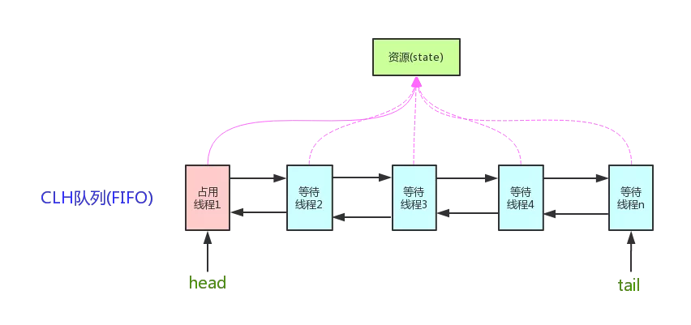


### AQS 组件总结

- **Semaphore(信号量)-允许多个线程同时访问：** synchronized 和 ReentrantLock 都是一次只允许一个线程访问某个资源，Semaphore(信号量)可以指定多个线程同时访问某个资源。
- **CountDownLatch （倒计时器）：** CountDownLatch 是一个同步工具类，用来协调多个线程之间的同步。这个工具通常用来控制线程等待，它可以让某一个线程等待直到倒计时结束，再开始执行。
- **CyclicBarrier(循环栅栏)：** CyclicBarrier 和 CountDownLatch 非常类似，它也可以实现线程间的技术等待，但是它的功能比 CountDownLatch 更加复杂和强大。主要应用场景和 CountDownLatch 类似。CyclicBarrier 的字面意思是可循环使用（Cyclic）的屏障（Barrier）。它要做的事情是，让一组线程到达一个屏障（也可以叫同步点）时被阻塞，直到最后一个线程到达屏障时，屏障才会开门，所有被屏障拦截的线程才会继续干活。CyclicBarrier 默认的构造方法是 CyclicBarrier(int parties)，其参数表示屏障拦截的线程数量，每个线程调用await() 方法告诉 CyclicBarrier 我已经到达了屏障，然后当前线程被阻塞。

## 悲观锁与乐观锁

::: tip
乐观锁对应于生活中乐观的人总是想着事情往好的方向发展，悲观锁对应于生活中悲观的人总是想着事情往坏的方向发展。这两种人各有优缺点，不能不以场景而定说一种人好于另外一种人。
:::

### 悲观锁

总是假设最坏的情况，每次去拿数据的时候都认为别人会修改，所以每次在拿数据的时候都会上锁，这样别人想拿这个数据就会阻塞直到它拿到锁（**共享资源每次只给一个线程使用，其它线程阻塞，用完后再把资源转让给其它线程**）。传统的关系型数据库里边就用到了很多这种锁机制，比如行锁，表锁等，读锁，写锁等，都是在做操作之前先上锁。Java中`synchronized`和`ReentrantLock`等独占锁就是悲观锁思想的实现。

我们可以利用 `Synchronized` 或者 `ReentrantLock` 进行加锁，可以将代码修改成下面的逻辑:

synchronized:

```java
synchronized(globalSession){
  if (status == GlobalStatus.Begin) {
  		globalSession.changeStatus(GlobalStatus.Rollbacking);
  }
}
```

`ReentrantLock` 进行加锁:

```java
 reentrantLock.lock();
 try {
    if  (status == GlobalStatus.Begin) {
    		globalSession.changeStatus(GlobalStatus.Rollbacking);
    }
    }finally {
        reentrantLock.unlock();
}
```

对于这种加锁比较简单，在 `Seata` 的 `Go-Server` 中目前是这样实现的。但是这种实现场景忽略了我们上面所说的一种情况，就是极端情况下，也就是有可能 99.9% 的情况下可能不会出现并发问题，只有 %0.1 的情况可能导致这个并发问题。虽然我们悲观锁一次加锁的时间也比较短，但是在这种高性能的中间件中还是不够，那么就引入了我们的乐观锁。

### 乐观锁

总是假设最好的情况，每次去拿数据的时候都认为别人不会修改，所以不会上锁，但是在更新的时候会判断一下在此期间别人有没有去更新这个数据，可以使用版本号机制和CAS算法实现。**乐观锁适用于多读的应用类型，这样可以提高吞吐量**，像数据库提供的类似于 **write_condition 机制** ，其实都是提供的乐观锁。在Java中`java.util.concurrent.atomic`包下面的原子变量类就是使用了乐观锁的一种实现方式 **CAS** 实现的。

一提起乐观锁，很多朋友都会想到数据库中乐观锁，如果没有利用乐观锁去做，我们会有如下的伪代码逻辑:

```java
select * from table where id = xxx for update;
if(status == begin){
    //do other thing
    update table set status = rollbacking;
}
```

上述代码在我们很多的业务逻辑中都能看见，这段代码有两个小问题：

1. **事务较大**，由于我们一上来就对我们数据加锁，那么必定在一个事务中，我们的查询和更新之间如果穿插了一些比较耗时的逻辑那么我们的事务就会导致较大。由于我们的每一个事务都会占据一个数据库连接，那么在流量较高的时会很容易出现数据库连接池不够的情况。
2. **锁定数据时间较长**，在我们整个事务中都是对这条数据加了行锁，如果有其他事务想对这个数据进行修改那么会长时间阻塞等待。

所以为了解决上面的问题，在很多如果竞争不大的场景下，我们就采用了乐观锁的方法，我们在数据库中加一个字段 version 代表着版本号，我们将代码修改成如下所示：

```java
select * from table where id = xxx ;
if(status == begin){
    //do other thing
    int result = (update table set status = rollbacking where version = xxx);
    if(result == 0){
        throw new someException();
    }
}
```

这里我们的查询语句不再有 for update，我们的事务也只缩小到 update 一句，我们通过我们第一句查询出来的 version 来进行判断，如果我们的更新的行数为 0，那么就证明其他事务对他进行了修改。这里可以抛出异常或者做一些其他的事。

从这里可以看出我们使用乐观锁将事务较大，锁定较长这两个问题都解决，但是对应而来的成本就是如果更新失败我们可能就会抛出异常或者做一些其他补救的措施，而我们的悲观锁在执行业务之前都已经限制住了。所以我们这里使用乐观锁一定只能在对某条数据并发处理的情况比较小的情况下。

#### 两种锁的使用场景

从上面对两种锁的介绍，我们知道两种锁各有优缺点，不可认为一种好于另一种，像**乐观锁适用于写比较少的情况下（多读场景）**，即冲突真的很少发生的时候，这样可以省去了锁的开销，加大了系统的整个吞吐量。但如果是多写的情况，一般会经常产生冲突，这就会导致上层应用会不断的进行retry，这样反倒是降低了性能，所以**一般多写的场景下用悲观锁就比较合适。**

#### 乐观锁常见的两种实现方式

::: tip

乐观锁一般会使用版本号机制或CAS算法实现。

:::

##### 版本号机制

一般是在数据表中加上一个数据版本号 version 字段，表示数据被修改的次数，当数据被修改时，version 值会加 1 。当线程 A 要更新数据值时，在读取数据的同时也会读取 version 值，在提交更新时，若刚才读取到的 version 值为当前数据库中的 version 值相等时才更新，否则重试更新操作，直到更新成功。 

**举一个简单的例子：** 假设数据库中帐户信息表中有一个 version 字段，当前值为 1 ；而当前帐户余额字段（ balance ）为 $100 。

1. 操作员 A 此时将其读出（ version=1 ），并从其帐户余额中扣除 $50（ $100-$50 ）。
2. 在操作员 A 操作的过程中，操作员B 也读入此用户信息（ version=1 ），并从其帐户余额中扣除 $20 （ $100-$20 ）。
3. 操作员 A 完成了修改工作，将数据版本号加 1（ version=2 ），连同帐户扣除后余额（ balance=$50 ），提交至数据库更新，此时由于提交数据版本大于数据库记录当前版本，数据被更新，数据库记录 version 更新为 2 。
4. 操作员 B 完成了操作，也将版本号加 1（ version=2 ）试图向数据库提交数据（ balance=$80 ），但此时比对数据库记录版本时发现，操作员 B 提交的数据版本号为 2 ，数据库记录当前版本也为 2 ，不满足 **提交版本必须大于记录当前版本才能执行更新**  的乐观锁策略，因此，操作员 B 的提交被驳回。

这样，就避免了操作员 B 用基于 version=1 的旧数据修改的结果覆盖操作员 A 的操作结果的可能。

##### CAS 算法

即 **compare and swap（比较与交换）**，是一种有名的**无锁算法**。无锁编程，即不使用锁的情况下实现多线程之间的变量同步，也就是在没有线程被阻塞的情况下实现变量的同步，所以也叫非阻塞同步（Non-blocking Synchronization）。**CAS算法 **涉及到三个操作数

- 需要读写的内存值 V
- 进行比较的值 A
- 拟写入的新值 B

当且仅当 V 的值等于 A 时，CAS 通过原子方式用新值 B 来更新 V 的值，否则不会执行任何操作（比较和替换是一个原子操作）。一般情况下是一个**自旋操作**，即 **不断的重试**。

#### 代码中的乐观锁

熟悉 `synchronized` 的同学肯定知道 `synchronized` 在 Jdk1.6 之后对其进行了优化，引入了锁膨胀的一个模型:

- 偏向锁：顾名思义偏向某个线程的锁，适用于某个线程能长期获取到该锁。
- 轻量级锁：如果偏向锁获取失败，那么会使用 CAS 自旋来完成，轻量级锁适用于线程交替进入临界区。
- 重量级锁：自旋失败之后，会采取重量级锁策略我们线程会阻塞挂起。

上面的级种锁模型中轻量级锁所适用的线程交替进入临界区很适合我们的场景，因为我们的全局事务一般来说不会是某个单线程一直在处理该事务 (当然也可以优化成这个模型，只是设计会比较复杂)，我们的全局事务再大多数情况下都会是不同线程交替进入处理这个事务逻辑，所以我们可以借鉴轻量级锁 CAS 自旋的思想，完成我们代码级别的自旋锁。这里也有朋友可能会问为什么不用 synchronized 呢？这里经过实测在交替进入临界区我们自己实现的 CAS 自旋性能是最高的，并且 synchronized 没有超时机制，不方便我们处理异常情况。

```java
 class GlobalSessionSpinLock {
     private AtomicBoolean globalSessionSpinLock = new AtomicBoolean(true);
     public void lock() throws TransactionException {
         boolean flag;
         do {
           flag = this.globalSessionSpinLock.compareAndSet(true, false);
         }while (!flag);
     }
     public void unlock() {
     		this.globalSessionSpinLock.compareAndSet(false, true);
     }
 }

// method rollback  
void rollback(){
    globalSessionSpinLock.lock();
    try {
      if (status == GlobalStatus.Begin) {
        	globalSession.changeStatus(GlobalStatus.Rollbacking);
      }
    }finally {
      	globalSessionSpinLock.unlock();
    }
}
```

上面我们用 `CAS` 简单的实现了一个乐观锁，但是这个乐观锁有个小缺点就是一旦出现竞争不能膨胀为悲观锁阻塞等待，并且也没有过期超时，有可能大量占用我们的 `CPU`，我们又继续进一步优化：

```java
public void lock() throws TransactionException {
    boolean flag;
    int times = 1;
    long beginTime = System.currentTimeMillis();
    long restTime = GLOBAL_SESSOION_LOCK_TIME_OUT_MILLS ;
    do {
        restTime -= (System.currentTimeMillis() - beginTime);
        if (restTime <= 0){
          throw new TransactionException(TransactionExceptionCode.FailedLockGlobalTranscation);
        }
        // Pause every PARK_TIMES_BASE times,yield the CPU
        if (times % PARK_TIMES_BASE == 0){
          // Exponential Backoff
          long backOffTime =  PARK_TIMES_BASE_NANOS << (times/PARK_TIMES_BASE);
          long parkTime = backOffTime < restTime ? backOffTime : restTime;
          LockSupport.parkNanos(parkTime);
        }
        flag = this.globalSessionSpinLock.compareAndSet(true, false);
        times++;
    }while (!flag);
}
```

上面的代码做了如下几个优化：

- 引入了超时机制，一般来说一个要做好这种对临界区域加锁一定要做好超时机制，尤其是在这种对性能要求较高的中间件中。
- 引入了锁膨胀机制，这里每循环一定次数如果获取不到锁，那么会线程挂起 `parkTime` 时间，挂起之后又继续循环获取，如果再次获取不到，此时我们会对我们的 parkTime 进行指数退避形式的挂起，将我们的挂起时间逐渐增长，直到超时。


#### 乐观锁的缺点

::: tip

ABA 问题是乐观锁一个常见的问题

:::

##### ABA 问题

如果一个变量 V 初次读取的时候是 A 值，并且在准备赋值的时候检查到它仍然是 A 值，那我们就能说明它的值没有被其他线程修改过了吗？很明显是不能的，因为在这段时间它的值可能被改为其他值，然后又改回 A ，那 CAS 操作就会误认为它从来没有被修改过。这个问题被称为CAS操作的 **"ABA"问题。**

JDK 1.5 以后的  `AtomicStampedReference 类` 就提供了此种能力，其中的  `compareAndSet 方法 `就是首先检查当前引用是否等于预期引用，并且当前标志是否等于预期标志，如果全部相等，则以原子方式将该引用和该标志的值设置为给定的更新值。

##### 循环时间长开销大

**自旋CAS（也就是不成功就一直循环执行直到成功）如果长时间不成功，会给 CPU 带来非常大的执行开销。** 如果 JVM 能支持处理器提供的 pause 指令那么效率会有一定的提升，pause 指令有两个作用，第一它可以延迟流水线执行指令（de-pipeline）,使 CPU 不会消耗过多的执行资源，延迟的时间取决于具体实现的版本，在一些处理器上延迟时间是零。第二它可以避免在退出循环的时候因内存顺序冲突（memory order violation）而引起 CPU 流水线被清空（CPU pipeline flush），从而提高 CPU 的执行效率。

##### 只能保证一个共享变量的原子操作

CAS 只对单个共享变量有效，当操作涉及跨多个共享变量时 CAS 无效。但是从 JDK 1.5开始，提供了`AtomicReference类` 来保证引用对象之间的原子性，你可以把多个变量放在一个对象里来进行 CAS 操作. 所以我们可以使用锁或者利用`AtomicReference类`把多个共享变量合并成一个共享变量来操作。

#### CAS 与 synchronized 的使用情景

::: tip

**简单的来说 CAS 适用于写比较少的情况下（多读场景，冲突一般较少），synchronized 适用于写比较多的情况下（多写场景，冲突一般较多）**

:::

1. 对于资源竞争较少（线程冲突较轻）的情况，使用 synchronized 同步锁进行线程阻塞和唤醒切换以及用户态内核态间的切换操作额外浪费消耗cpu资源；而 CAS 基于硬件实现，不需要进入内核，不需要切换线程，操作自旋几率较少，因此可以获得更高的性能。
2. 对于资源竞争严重（线程冲突严重）的情况，CAS 自旋的概率会比较大，从而浪费更多的 CPU 资源，效率低于 synchronized。

补充： Java 并发编程这个领域中 synchronized 关键字一直都是元老级的角色，很久之前很多人都会称它为 **“重量级锁”** 。但是，在 JavaSE 1.6 之后进行了主要包括为了减少获得锁和释放锁带来的性能消耗而引入的 **偏向锁** 和 **轻量级锁** 以及其它**各种优化**之后变得在某些情况下并不是那么重了。synchronized 的底层实现主要依靠 **Lock-Free** 的队列，基本思路是 **自旋后阻塞**，**竞争切换后继续竞争锁**，**稍微牺牲了公平性，但获得了高吞吐量**。在线程冲突较少的情况下，可以获得和 CAS 类似的性能；而线程冲突严重的情况下，性能远高于 CAS。

## 创建线程的方式

### 继承 Thread 类

看 jdk 源码可以发现，Thread 类其实是实现了 Runnable 接口的一个实例，继承 Thread 类后需要重写 run 方法并通过 start 方法启动线程。

继承 Thread 类耦合性太强了，因为 java 只能单继承，所以不利于扩展。

### 实现 Runnable 接口

通过实现 Runnable 接口并重写 run 方法，并把 Runnable 实例传给 Thread 对象，Thread 的 start 方法调用 run 方法再通过调用 Runnable 实例的 run 方法启动线程。

所以如果一个类继承了另外一个父类，此时要实现多线程就不能通过继承 Thread 的类实现。

### 实现 Callable 接口

通过实现 Callable 接口并重写 call 方法，并把 Callable 实例传给 FutureTask 对象，再把 FutureTask 对象传给 Thread 对象。它与 Thread、Runnable 最大的不同是 Callable 能返回一个异步处理的结果 Future 对象并能抛出异常，而其他两种不能。

## Runnable 接口和 Callable 接口的区别

Runnable 接口中的 run() 方法的返回值是 void，它做的事情只是纯粹地去执行 run() 方法中的代码而已；

Callable 接口中的 call() 方法是有返回值的，是一个泛型，和 Future、FutureTask 配合可以用来获取异步执行的结果。

这其实是很有用的一个特性，因为**多线程相比单线程更难、更复杂的一个重要原因就是因为多线程充满着未知性**，某条线程是否执行了？某条线程执行了多久？某条线程执行的时候我们期望的数据是否已经赋值完毕？无法得知，我们能做的只是等待这条多线程的任务执行完毕而已。而 Callable+Future/FutureTask 却可以获取多线程运行的结果，可以在等待时间太长没获取到需要的数据的情况下取消该线程的任务，真的是非常有用。

## CyclicBarrier和CountDownLatch的区别

两个看上去有点像的类，都在 java.util.concurrent 下，都可以用来表示代码运行到某个点上，二者的区别在于：

1. CyclicBarrier 的某个线程运行到某个点上之后，该线程即停止运行，直到所有的线程都到达了这个点，所有线程才重新运行；CountDownLatch 则不是，某线程运行到某个点上之后，只是给某个数值 -1 而已，该线程继续运行。

2. CyclicBarrier 只能唤起一个任务，CountDownLatch 可以唤起多个任务。

3. CyclicBarrier 可重用，CountDownLatch 不可重用，计数值为 0 该 CountDownLatch 就不可再用了。

## 什么是线程安全

又是一个理论的问题，各式各样的答案有很多，我给出一个个人认为解释地最好的：**如果你的代码在多线程下执行和在单线程下执行永远都能获得一样的结果，那么你的代码就是线程安全的**。

这个问题有值得一提的地方，就是线程安全也是有几个级别的：

**不可变**

像 String、Integer、Long 这些，都是 final 类型的类，任何一个线程都改变不了它们的值，要改变除非新创建一个，因此这些不可变对象不需要任何同步手段就可以直接在多线程环境下使用

**绝对线程安全**

不管运行时环境如何，调用者都不需要额外的同步措施。要做到这一点通常需要付出许多额外的代价，Java 中标注自己是线程安全的类，实际上绝大多数都不是线程安全的，不过绝对线程安全的类，Java 中也有，比方说CopyOnWriteArrayList、CopyOnWriteArraySet

**相对线程安全**

相对线程安全也就是我们通常意义上所说的线程安全，像 Vector 这种，add、remove 方法都是原子操作，不会被打断，但也仅限于此，如果有个线程在遍历某个 Vector 、有个线程同时在 add 这个 Vector，99% 的情况下都会出现 ConcurrentModificationException，也就是 **fail-fast 机制**。

**线程非安全**

这个就没什么好说的了，ArrayList、LinkedList、HashMap 等都是线程非安全的类

## Java 中如何获取到线程 dump 文件

死循环、死锁、阻塞、页面打开慢等问题，打线程 dump 是最好的解决问题的途径。所谓线程 dump 也就是线程堆栈，获取到线程堆栈有两步：

1. 获取到线程的 pid，可以通过使用 jps 命令，在Linux环境下还可以使用 `ps -ef | grep java`

2. 打印线程堆栈，可以通过使用 jstack pid 命令，在 Linux 环境下还可以使用 `kill -3 pid`

另外提一点，Thread 类提供了一个 getStackTrace() 方法也可以用于获取线程堆栈。这是一个实例方法，因此此方法是和具体线程实例绑定的，每次获取获取到的是具体某个线程当前运行的堆栈。

## 简述线程,程序,进程的基本概念.以及他们之间关系是什么?

**线程**与进程相似, 但线程是一个比进程更小的执行单位.一个进程在其执行的过程中可以产生多个线程.与进程不同的是同类的多个线程共享同一块内存空间和一组系统资源, 所以系统在产生一个线程, 或是在各个线程之间作切换工作时, 负担要比进程小得多, 也正因为如此, 线程也被称为轻量级进程.  

**程序**是含有指令和数据的文件, 被存储在磁盘或其他的数据存储设备中, 也就是说程序是静态的代码.

**进程**是程序的一次执行过程, 是系统运行程序的基本单位, 因此进程是动态的.系统运行一个程序即是一个进程从创建, 运行到消亡的过程.简单来说, 一个进程就是一个执行中的程序, 它在计算机中一个指令接着一个指令地执行着, 同时, 每个进程还占有某些系统资源如CPU时间, 内存空间, 文件, 文件, 输入输出设备的使用权等等.换句话说, 当程序在执行时, 将会被操作系统载入内存中.
线程是进程划分成的更小的运行单位.线程和进程最大的不同在于基本上各进程是独立的, 而各线程则不一定, 因为同一进程中的线程极有可能会相互影响.从另一角度来说, 进程属于操作系统的范畴, 主要是同一段时间内, 可以同时执行一个以上的程序, 而线程则是在同一程序内几乎同时执行一个以上的程序段.

## 进程间的通信
1. 管道( pipe)
2. 有名管道 (namedpipe)
3. 信号量(semophore ) 
4. 消息队列( messagequeue ) 
5. 信号 (sinal ) 
6. 共享内存(shared memory ) 
7. 套接字(socket ) 

## 线程间的通信
1. 锁机制:包括互斥锁、条件变量、读写锁
    - 互斥锁提供了以排他方式防止数据结构被并发修改的方法.
    - 读写锁允许多个线程同时读共享数据, 而对写操作是互斥的.
    - 条件变量可以以原子的方式阻塞进程, 直到某个特定条件为真为止.对条件的测试是在互斥锁的保护下进行的.条件变量始终与互斥锁一起使用.
2. 信号量机制(Semaphore):包括无名线程信号量和命名线程信号量
3. 信号机制(Signal):类似进程间的信号处理
    线程间的通信目的主要是用于线程同步, 所以线程没有像进程通信中的用于数据交换的通信机制.

## stop() 和 suspend() 方法为何不推荐使用

反对使用stop(), 是因为它不安全.
>它会解除由线程获取的所有锁定, 而且如果对象处于一种不连贯状态, 那么其他线程能在那种状态下检查和修改它们.结果很难检查出真正的问题所在.

suspend()方法容易发生死锁.
>调用suspend()的时候, 目标线程会停下来, 但却仍然持有在这之前获得的锁定.
>此时, 其他任何线程都不能访问锁定的资源, 除非被"挂起"的线程恢复运行.
>对任何线程来说, 如果它们想恢复目标线程, 同时又试图使用任何一个锁定的资源, 就会造成死锁.所以不应该使用suspend(), 而应在自己的Thread类中置入一个标志, 指出线程应该活动还是挂起.若标志指出线程应该挂起, 便用wait()命其进入等待状态.若标志指出线程应当恢复, 则用一个notify()重新启动线程. 

## sleep() 和 wait() 有什么区别

sleep就是正在执行的线程主动让出cpu, cpu去执行其他线程, 在sleep指定的时间过后, cpu才会回到这个线程上继续往下执行, 如果当前线程进入了同步锁, sleep方法并不会释放锁, 即使当前线程使用sleep方法让出了cpu, 但其他被同步锁挡住了的线程也无法得到执行.wait是指在一个已经进入了同步锁的线程内, 让自己暂时让出同步锁, 以便其他正在等待此锁的线程可以得到同步锁并运行, 只有其他线程调用了notify方法(notify并不释放锁, 只是告诉调用过wait方法的线程可以去参与获得锁的竞争了, 但不是马上得到锁, 因为锁还在别人手里, 别人还没释放.如果notify方法后面的代码还有很多, 需要这些代码执行完后才会释放锁, 可以在notfiy方法后增加一个等待和一些代码, 看看效果), 调用wait方法的线程就会解除wait状态和程序可以再次得到锁后继续向下运行

```java
public class MultiThread {
    public static void main(String[] args) {
        new Thread(new Thread1()).start();
        try {
            Thread.sleep(10);
        } catch (InterruptedException e) {
            e.printStackTrace();
        }
        new Thread(new Thread2()).start();
    }

    private static class Thread1 implements Runnable {
        @Override
        public void run() {
            // 由于这里的Thread1和下面的Thread2内部run方法要用同一对象作为监视器, 
            // 我们这里不能用this, 因为在Thread2里面的this和这个Thread1的this不是同一个对象.我们用MultiThread.class这个字节码对象, 
            // 当前虚拟机里引用这个变量时, 指向的都是同一个对象.
            synchronized (MultiThread.class) {
                System.out.println("enter thread1...");
                System.out.println("thread1 is waiting");
                try {
                    // 释放锁有两种方式, 第一种方式是程序自然离开监视器的范围, 也就是离开了synchronized关键字管辖的代码范围, 
                    // 另一种方式就是在synchronized关键字管辖的代码内部调用监视器对象的wait方法.这里, 使用wait方法释放锁.
                    MultiThread.class.wait();
                } catch (InterruptedException e) {
                    e.printStackTrace();
                }
                System.out.println("thread1 is going on...");
                System.out.println("thread1 is being over!");
            }
        }

    }

    private static class Thread2 implements Runnable {
        @Override
        public void run() {
            synchronized (MultiThread.class) {
                System.out.println("enter thread2...");
                System.out.println("thread2 notify other thread can release wait status..");
                // 由于notify方法并不释放锁,  即使thread2调用下面的sleep方法休息了10毫秒, 
                // 但thread1仍然不会执行, 因为thread2没有释放锁, 所以Thread1无法得不到锁.
                MultiThread.class.notify();
                System.out.println("thread2 is sleeping ten millisecond...");
                try {
                    Thread.sleep(10);
                } catch (InterruptedException e) {
                    e.printStackTrace();
                }
                System.out.println("thread2 is going on...");
                System.out.println("thread2 is being over!");
            }
        }
    }
}
```

## 当一个线程进入一个对象的一个synchronized方法后, 其它线程是否可进入此对象的其它方法? 

分几种情况:

1. 其他方法前是否加了 synchronized 关键字, 如果没加, 则能.
2. 如果这个方法内部调用了 wait, 则可以进入其他 synchronized 方法.
3. 如果其他个方法都加了 synchronized 关键字, 并且内部没有调用 wait, 则不能.
4. 如果其他方法是 static, 它用的同步锁是当前类的字节码, 与非静态的方法不能同步, 因为非静态的方法用的是this.

## Java 锁的种类

1. 自旋锁

```java
public class SpinLock {
  private AtomicReference<Thread> sign =new AtomicReference<>();
  public void lock(){
		Thread current = Thread.currentThread();
		while(!sign.compareAndSet(null, current)){
		}
}
public void unlock (){
	Thread current = Thread.currentThread();
	sign.compareAndSet(current, null);
  }
}
```
2. 自旋锁的其他种类
3. 阻塞锁
    - synchronized 关键字(其中的重量锁)
    - ReentrantLock
    
	```java
	Lock lock = new ReentrantLock();  
	lock.lock();  
	try {   
		// update object state  
	}  
	finally {  
		lock.unlock();   
	}  
	```
    - Object.wait()\notify()
    - LockSupport.park()/unpart()
4. 可重入锁
  
    - ReentrantLock
5. 读写锁
6. 互斥锁
7. 悲观锁
8. 乐观锁
9. 公平锁
10. 非公平锁
11. 偏向锁
12. 对象锁
13. 线程锁
14. 锁粗化
15. 轻量级锁
16. 锁消除
17. 锁膨胀
18. 信号量

## 简述 synchronized 和 java.util.concurrent.locks.Lock 的区别

主要相同点:Lock能完成synchronized所实现的所有功能 
主要不同点:Lock有比synchronized更精确的线程语义和更好的性能.synchronized会自动释放锁, 而Lock一定要求程序员手工释放, 并且必须在finally从句中释放.Lock还有更强大的功能, 例如, 它的tryLock方法可以非阻塞方式去拿锁. 

```java
import java.util.concurrent.locks.Lock;
import java.util.concurrent.locks.ReentrantLock;
public class ThreadTest {
    private int j;
    private Lock lock = new ReentrantLock();
    public static void main(String[] args) {
        ThreadTest tt = new ThreadTest();
        for (int i = 0; i < 2; i++) {
            new Thread(tt.new Adder()).start();
            new Thread(tt.new Subtractor()).start();
        }
    }
    private class Subtractor implements Runnable {
        public void run() {
            while (true) {
                synchronized (ThreadTest.this) {
                    System.out.println("j--=" + j--);
                }
                //lock.lock();
                //try {
                //    System.out.println("j--=" + j--);
                //} finally {
                //    lock.unlock();
                //}
            }
        }
    }
    private class Adder implements Runnable {
        public void run() {
            while (true) {
                synchronized (ThreadTest.this) {
                    System.out.println("j++=" + j++);
                }
                //lock.lock();
                //try {
                //    System.out.println("j++=" + j++);
                //} finally {
                //    lock.unlock();
                //}
            }
        }
    }
}
```

## 设计 4 个线程, 其中两个线程每次对j增加1, 另外两个线程对j每次减少1.写出程序. 

```java
public class ThreadTest1 {
    private int j;

    public static void main(String args[]) {
        ThreadTest1 tt  = new ThreadTest1();
        Inc         inc = tt.new Inc();
        Dec         dec = tt.new Dec();
        for (int i = 0; i < 2; i++) {
            Thread t = new Thread(inc);
            t.start();
            t = new Thread(dec);
            t.start();
        }
    }

    class Inc implements Runnable {
        public void run() {
            for (int i = 0; i < 2; i++) {
                inc();
            }
        }
    }

    class Dec implements Runnable {
        public void run() {
            for (int i = 0; i < 2; i++) {
                dec();
            }
        }
    }

    private synchronized void inc() {
        j++;
        System.out.println(Thread.currentThread().getName() + "-inc:" + j);
    }

    private synchronized void dec() {
        j--;
        System.out.println(Thread.currentThread().getName() + "-dec:" + j);
    }
}
```

## 子线程循环2次, 接着主线程循环5次, 接着又回到子线程循环2次, 接着再回到主线程又循环5次, 如此循环5次, 请写出程序.

```java
public class ThreadTest2 {
    public static void main(String[] args) {
        new ThreadTest2().init();
    }
    public void init() {
        final Business business = new Business();
        new Thread(
            new Runnable() {
                public void run() {
                    for (int i = 0; i < 5; i++) {
                        // 执行子线程
                        business.subThread(i);
                    }
                }
            }
        ).start();

        for (int i = 0; i < 5; i++) {
            business.mainThread(i);
        }
    }

    private class Business {
        boolean flag = true;//这里相当于定义了控制该谁执行的一个信号灯

        // 主线程开始执行 由于 flag=false 直接输出5次
        public synchronized void mainThread(int i) {
            if (flag)
                try {
                    this.wait();
                } catch (InterruptedException e) {
                    e.printStackTrace();
                }

            for (int j = 0; j < 5; j++) {
                System.out.println(Thread.currentThread().getName() + ":i=" + i + ",j=" + j);
            }
            flag = true;
            // 唤醒子线程
            this.notify();
        }

        // 多个线程执行此段代码时,获得锁的才能进入执行
        // 子线程先获得锁,然后信号为 true, 执行输出2次,最后信号,唤醒其他线程

        // 第二个线程进入时,由于 flag= false 进入阻塞状态
        public synchronized void subThread(int i) {
            if (!flag) {
                try {
                    this.wait();
                } catch (InterruptedException e) {
                    e.printStackTrace();
                }
            }
            // 执行2次子线程
            for (int j = 0; j < 2; j++) {
                System.out.println(Thread.currentThread().getName() + ":i=" + i + ",j=" + j);
            }
            // 子线程执行完了,将信号设置为关闭
            flag = false;
            // 唤醒另外的线程
            this.notify();
        }
    }
}
```

```java
public class ThreadTest3 {
    private static boolean flag = false;

    public static void main(String[] args) {
        new Thread(
            new Runnable() {
                public void run() {
                    for (int i = 0; i < 5; i++) {
                        synchronized (ThreadTest3.class) {
                            // 第二个子线程要等到主线程执行完一次后才能执行
                            if (flag) {
                                try {
                                    ThreadTest3.class.wait();
                                } catch (InterruptedException e) {
                                    e.printStackTrace();
                                }
                            }
                            for (int j = 0; j < 2; j++) {
                                System.out.println(
                                        Thread.currentThread().getName() +
                                                "i=" + i + ",j=" + j);
                            }
                            flag = true;
                            ThreadTest3.class.notify();
                        }
                    }
                }
            }
        ).start();

        for (int i = 0; i < 5; i++) {
            synchronized (ThreadTest3.class) {
                if (!flag) {
                    try {
                        ThreadTest3.class.wait();
                    } catch (InterruptedException e) {
                        e.printStackTrace();
                    }
                }
                for (int j = 0; j < 5; j++) {
                    System.out.println(
                            Thread.currentThread().getName() +
                                    "i=" + i + ",j=" + j);
                }
                flag = false;
                ThreadTest3.class.notify();
            }
        }
    }
}
```

```java
import java.util.concurrent.Executors;
import java.util.concurrent.ExecutorService;
import java.util.concurrent.locks.Lock;
import java.util.concurrent.locks.ReentrantLock;
import java.util.concurrent.locks.Condition;

public class ThreadTest4 {
    private static Lock      lock               = new ReentrantLock();
    private static Condition subThreadCondition = lock.newCondition();
    private static boolean   flag               = true;

    public static void main(String[] args) {
        ExecutorService threadPool = Executors.newFixedThreadPool(3);
        threadPool.execute(new Runnable() {
            public void run() {
                for (int i = 0; i < 5; i++) {
                    // 获得锁
                    lock.lock();
                    try {
                        if (!flag)
                            subThreadCondition.await();
                        for (int j = 0; j < 2; j++) {
                            System.out.println(Thread.currentThread().getName() + ",j=" + j);
                        }
                        flag = false;
                        subThreadCondition.signal();
                    } catch (Exception e) {
                    } finally {
                        lock.unlock();
                    }
                }
            }
        });
        threadPool.shutdown();
        for (int i = 0; i < 5; i++) {
            lock.lock();
            try {
                if (flag)
                    subThreadCondition.await();
                for (int j = 0; j < 5; j++) {
                    System.out.println(Thread.currentThread().getName() + ",j=" + j);
                }
                flag = true;
                subThreadCondition.signal();
            } catch (Exception e) {
            } finally {
                lock.unlock();
            }
        }
    }
}
```

 


## 一个线程如果出现了运行时异常会怎么样
如果这个异常没有被捕获的话，这个线程就停止执行了。另外重要的一点是：**如果这个线程持有某个某个对象的监视器，那么这个对象监视器会被立即释放**


## 如何在两个线程之间共享数据
通过在线程之间共享对象就可以了，然后通过wait/notify/notifyAll、await/signal/signalAll进行唤起和等待，比方说阻塞队列BlockingQueue就是为线程之间共享数据而设计的


## sleep方法和wait方法有什么区别
这个问题常问，sleep方法和wait方法都可以用来放弃CPU一定的时间，不同点在于如果线程持有某个对象的监视器，sleep方法不会放弃这个对象的监视器，wait方法会放弃这个对象的监视器


## 生产者消费者模型的作用是什么
这个问题很理论，但是很重要：

1）**通过平衡生产者的生产能力和消费者的消费能力来提升整个系统的运行效率**，这是生产者消费者模型最重要的作用

2）解耦，这是生产者消费者模型附带的作用，解耦意味着生产者和消费者之间的联系少，联系越少越可以独自发展而不需要收到相互的制约


## ThreadLocal有什么用
简单说ThreadLocal就是一种以**空间换时间**的做法，在每个Thread里面维护了一个以开地址法实现的ThreadLocal.ThreadLocalMap，把数据进行隔离，数据不共享，自然就没有线程安全方面的问题了


## 为什么wait()方法和notify()/notifyAll()方法要在同步块中被调用
这是JDK强制的，wait()方法和notify()/notifyAll()方法在调用前都必须先获得对象的锁

 


## wait()方法和notify()/notifyAll()方法在放弃对象监视器时有什么区别
wait()方法和notify()/notifyAll()方法在放弃对象监视器的时候的区别在于：**wait()方法立即释放对象监视器，notify()/notifyAll()方法则会等待线程剩余代码执行完毕才会放弃对象监视器**。


## 为什么要使用线程池

避免频繁地创建和销毁线程，达到线程对象的重用。另外，使用线程池还可以根据项目灵活地控制并发的数目。点击[这里](https://mp.weixin.qq.com/s?__biz=MzI3ODcxMzQzMw==&mid=2247483824&idx=1&sn=7e34a3944a93d649d78d618cf04e0619&scene=21#wechat_redirect)学习线程池详解。


## 怎么检测一个线程是否持有对象监视器
我也是在网上看到一道多线程面试题才知道有方法可以判断某个线程是否持有对象监视器：Thread类提供了一个holdsLock(Object obj)方法，当且仅当对象obj的监视器被某条线程持有的时候才会返回true，注意这是一个static方法，这意味着**"某条线程"指的是当前线程**。


## synchronized和ReentrantLock的区别
synchronized是和if、else、for、while一样的关键字，ReentrantLock是类，这是二者的本质区别。既然ReentrantLock是类，那么它就提供了比synchronized更多更灵活的特性，可以被继承、可以有方法、可以有各种各样的类变量，ReentrantLock比synchronized的扩展性体现在几点上：

（1）ReentrantLock可以对获取锁的等待时间进行设置，这样就避免了死锁

（2）ReentrantLock可以获取各种锁的信息

（3）ReentrantLock可以灵活地实现多路通知

另外，二者的锁机制其实也是不一样的。ReentrantLock底层调用的是Unsafe的park方法加锁，synchronized操作的应该是对象头中mark word，这点我不能确定。


## ConcurrentHashMap的并发度是什么
ConcurrentHashMap的并发度就是segment的大小，默认为16，这意味着最多同时可以有16条线程操作ConcurrentHashMap，这也是ConcurrentHashMap对Hashtable的最大优势，任何情况下，Hashtable能同时有两条线程获取Hashtable中的数据吗？


## ReadWriteLock是什么
首先明确一下，不是说ReentrantLock不好，只是ReentrantLock某些时候有局限。如果使用ReentrantLock，可能本身是为了防止线程A在写数据、线程B在读数据造成的数据不一致，但这样，如果线程C在读数据、线程D也在读数据，读数据是不会改变数据的，没有必要加锁，但是还是加锁了，降低了程序的性能。

因为这个，才诞生了读写锁ReadWriteLock。ReadWriteLock是一个读写锁接口，ReentrantReadWriteLock是ReadWriteLock接口的一个具体实现，实现了读写的分离，**读锁是共享的，写锁是独占的**，读和读之间不会互斥，读和写、写和读、写和写之间才会互斥，提升了读写的性能。


## FutureTask是什么
这个其实前面有提到过，FutureTask表示一个异步运算的任务。FutureTask里面可以传入一个Callable的具体实现类，可以对这个异步运算的任务的结果进行等待获取、判断是否已经完成、取消任务等操作。当然，由于FutureTask也是Runnable接口的实现类，所以FutureTask也可以放入线程池中。


## Linux环境下如何查找哪个线程使用CPU最长
这是一个比较偏实践的问题，这种问题我觉得挺有意义的。可以这么做：

（1）获取项目的pid，jps或者ps -ef | grep java，这个前面有讲过

（2）top -H -p pid，顺序不能改变

这样就可以打印出当前的项目，每条线程占用CPU时间的百分比。注意这里打出的是LWP，也就是操作系统原生线程的线程号，我笔记本山没有部署Linux环境下的Java工程，因此没有办法截图演示，网友朋友们如果公司是使用Linux环境部署项目的话，可以尝试一下。

使用"top -H -p pid"+"jps pid"可以很容易地找到某条占用CPU高的线程的线程堆栈，从而定位占用CPU高的原因，一般是因为不当的代码操作导致了死循环。

最后提一点，"top -H -p pid"打出来的LWP是十进制的，"jps pid"打出来的本地线程号是十六进制的，转换一下，就能定位到占用CPU高的线程的当前线程堆栈了。


## Java编程写一个会导致死锁的程序
第一次看到这个题目，觉得这是一个非常好的问题。很多人都知道死锁是怎么一回事儿：线程A和线程B相互等待对方持有的锁导致程序无限死循环下去。当然也仅限于此了，问一下怎么写一个死锁的程序就不知道了，这种情况说白了就是不懂什么是死锁，懂一个理论就完事儿了，实践中碰到死锁的问题基本上是看不出来的。

真正理解什么是死锁，这个问题其实不难，几个步骤：

1）两个线程里面分别持有两个Object对象：lock1和lock2。这两个lock作为同步代码块的锁；

2）线程1的run()方法中同步代码块先获取lock1的对象锁，Thread.sleep(xxx)，时间不需要太多，50毫秒差不多了，然后接着获取lock2的对象锁。这么做主要是为了防止线程1启动一下子就连续获得了lock1和lock2两个对象的对象锁

3）线程2的run)(方法中同步代码块先获取lock2的对象锁，接着获取lock1的对象锁，当然这时lock1的对象锁已经被线程1锁持有，线程2肯定是要等待线程1释放lock1的对象锁的

这样，线程1"睡觉"睡完，线程2已经获取了lock2的对象锁了，线程1此时尝试获取lock2的对象锁，便被阻塞，此时一个死锁就形成了。代码就不写了，占的篇幅有点多，Java多线程7：死锁这篇文章里面有，就是上面步骤的代码实现。

点击[这里](http://mp.weixin.qq.com/s?__biz=MzI3ODcxMzQzMw==&mid=2247483887&idx=1&sn=ab85965995bde2fb539aaa4b47e7e008&chksm=eb5384d9dc240dcfa20ce9ceedcc8f6174337f74482b103d0b9fc363b5e6b6366e7ddc4590c7&scene=21#wechat_redirect)提供了一个死锁的案例。


## 怎么唤醒一个阻塞的线程
如果线程是因为调用了wait()、sleep()或者join()方法而导致的阻塞，可以中断线程，并且通过抛出InterruptedException来唤醒它；如果线程遇到了IO阻塞，无能为力，因为IO是操作系统实现的，Java代码并没有办法直接接触到操作系统。


## 不可变对象对多线程有什么帮助
前面有提到过的一个问题，不可变对象保证了对象的内存可见性，对不可变对象的读取不需要进行额外的同步手段，提升了代码执行效率。


## 什么是多线程的上下文切换
多线程的上下文切换是指CPU控制权由一个已经正在运行的线程切换到另外一个就绪并等待获取CPU执行权的线程的过程。


## 如果你提交任务时，线程池队列已满，这时会发生什么
这里区分一下：

1）如果使用的是无界队列LinkedBlockingQueue，也就是无界队列的话，没关系，继续添加任务到阻塞队列中等待执行，因为LinkedBlockingQueue可以近乎认为是一个无穷大的队列，可以无限存放任务

2）如果使用的是有界队列比如ArrayBlockingQueue，任务首先会被添加到ArrayBlockingQueue中，ArrayBlockingQueue满了，会根据maximumPoolSize的值增加线程数量，如果增加了线程数量还是处理不过来，ArrayBlockingQueue继续满，那么则会使用拒绝策略RejectedExecutionHandler处理满了的任务，默认是AbortPolicy


## Java中用到的线程调度算法是什么
抢占式。一个线程用完CPU之后，操作系统会根据线程优先级、线程饥饿情况等数据算出一个总的优先级并分配下一个时间片给某个线程执行。


## Thread.sleep(0)的作用是什么
这个问题和上面那个问题是相关的，我就连在一起了。由于Java采用抢占式的线程调度算法，因此可能会出现某条线程常常获取到CPU控制权的情况，为了让某些优先级比较低的线程也能获取到CPU控制权，可以使用Thread.sleep(0)手动触发一次操作系统分配时间片的操作，这也是平衡CPU控制权的一种操作。


## 什么是自旋
很多synchronized里面的代码只是一些很简单的代码，执行时间非常快，此时等待的线程都加锁可能是一种不太值得的操作，因为线程阻塞涉及到用户态和内核态切换的问题。既然synchronized里面的代码执行得非常快，不妨让等待锁的线程不要被阻塞，而是在synchronized的边界做忙循环，这就是自旋。如果做了多次忙循环发现还没有获得锁，再阻塞，这样可能是一种更好的策略。


## 什么是Java内存模型
Java内存模型定义了一种多线程访问Java内存的规范。Java内存模型要完整讲不是这里几句话能说清楚的，我简单总结一下Java内存模型的几部分内容：

1）Java内存模型将内存分为了**主内存和工作内存**。类的状态，也就是类之间共享的变量，是存储在主内存中的，每次Java线程用到这些主内存中的变量的时候，会读一次主内存中的变量，并让这些内存在自己的工作内存中有一份拷贝，运行自己线程代码的时候，用到这些变量，操作的都是自己工作内存中的那一份。在线程代码执行完毕之后，会将最新的值更新到主内存中去

2）定义了几个原子操作，用于操作主内存和工作内存中的变量

3）定义了volatile变量的使用规则

4）happens-before，即先行发生原则，定义了操作A必然先行发生于操作B的一些规则，比如在同一个线程内控制流前面的代码一定先行发生于控制流后面的代码、一个释放锁unlock的动作一定先行发生于后面对于同一个锁进行锁定lock的动作等等，只要符合这些规则，则不需要额外做同步措施，如果某段代码不符合所有的happens-before规则，则这段代码一定是线程非安全的


## 什么是CAS

CAS，全称为Compare and Swap，即比较-替换。假设有三个操作数：**内存值V、旧的预期值A、要修改的值B，当且仅当预期值A和内存值V相同时，才会将内存值修改为B并返回true，否则什么都不做并返回false**。当然CAS一定要volatile变量配合，这样才能保证每次拿到的变量是主内存中最新的那个值，否则旧的预期值A对某条线程来说，永远是一个不会变的值A，只要某次CAS操作失败，永远都不可能成功。更多CAS详情请点击[这里](http://mp.weixin.qq.com/s?__biz=MzI3ODcxMzQzMw==&mid=2247483728&idx=1&sn=3d734dc972a244891406cfbc443eabed&chksm=eb538466dc240d7033b889665b579a490266b8c8f1e7a08da35f67ca484dad19503e8b230e05&scene=21#wechat_redirect)学习。


## 什么是乐观锁和悲观锁
1）乐观锁：就像它的名字一样，对于并发间操作产生的线程安全问题持乐观状态，乐观锁认为竞争不总是会发生，因此它不需要持有锁，将**比较-替换**这两个动作作为一个原子操作尝试去修改内存中的变量，如果失败则表示发生冲突，那么就应该有相应的重试逻辑。

2）悲观锁：还是像它的名字一样，对于并发间操作产生的线程安全问题持悲观状态，悲观锁认为竞争总是会发生，因此每次对某资源进行操作时，都会持有一个独占的锁，就像synchronized，不管三七二十一，直接上了锁就操作资源了。

点击[这里](http://mp.weixin.qq.com/s?__biz=MzI3ODcxMzQzMw==&mid=2247483753&idx=1&sn=fd09b268d8f374095c4e9e2d627f3305&chksm=eb53845fdc240d4938023e75a207cb29c615d1b5891ae340e85d0754e134af5a8b183b01ae52&scene=21#wechat_redirect)了解更多乐观锁与悲观锁详情。

 


## 什么是AQS
简单说一下AQS，AQS全称为AbstractQueuedSychronizer，翻译过来应该是抽象队列同步器。

如果说java.util.concurrent的基础是CAS的话，那么AQS就是整个Java并发包的核心了，ReentrantLock、CountDownLatch、Semaphore等等都用到了它。AQS实际上以双向队列的形式连接所有的Entry，比方说ReentrantLock，所有等待的线程都被放在一个Entry中并连成双向队列，前面一个线程使用ReentrantLock好了，则双向队列实际上的第一个Entry开始运行。

AQS定义了对双向队列所有的操作，而只开放了tryLock和tryRelease方法给开发者使用，开发者可以根据自己的实现重写tryLock和tryRelease方法，以实现自己的并发功能。

 


## 单例模式的线程安全性
老生常谈的问题了，首先要说的是单例模式的线程安全意味着：**某个类的实例在多线程环境下只会被创建一次出来**。单例模式有很多种的写法，我总结一下：

1）饿汉式单例模式的写法：线程安全

2）懒汉式单例模式的写法：非线程安全

3）双检锁单例模式的写法：线程安全

 


## Semaphore有什么作用
Semaphore就是一个信号量，它的作用是**限制某段代码块的并发数**。Semaphore有一个构造函数，可以传入一个int型整数n，表示某段代码最多只有n个线程可以访问，如果超出了n，那么请等待，等到某个线程执行完毕这段代码块，下一个线程再进入。由此可以看出如果Semaphore构造函数中传入的int型整数n=1，相当于变成了一个synchronized了。


## Hashtable的size()方法中明明只有一条语句"return count"，为什么还要做同步？
这是我之前的一个困惑，不知道大家有没有想过这个问题。某个方法中如果有多条语句，并且都在操作同一个类变量，那么在多线程环境下不加锁，势必会引发线程安全问题，这很好理解，但是size()方法明明只有一条语句，为什么还要加锁？

关于这个问题，在慢慢地工作、学习中，有了理解，主要原因有两点：

1）**同一时间只能有一条线程执行固定类的同步方法，但是对于类的非同步方法，可以多条线程同时访问**。所以，这样就有问题了，可能线程A在执行Hashtable的put方法添加数据，线程B则可以正常调用size()方法读取Hashtable中当前元素的个数，那读取到的值可能不是最新的，可能线程A添加了完了数据，但是没有对size++，线程B就已经读取size了，那么对于线程B来说读取到的size一定是不准确的。而给size()方法加了同步之后，意味着线程B调用size()方法只有在线程A调用put方法完毕之后才可以调用，这样就保证了线程安全性

2）**CPU执行代码，执行的不是Java代码，这点很关键，一定得记住**。Java代码最终是被翻译成机器码执行的，机器码才是真正可以和硬件电路交互的代码。**即使你看到Java代码只有一行，甚至你看到Java代码编译之后生成的字节码也只有一行，也不意味着对于底层来说这句语句的操作只有一个**。一句"return count"假设被翻译成了三句汇编语句执行，一句汇编语句和其机器码做对应，完全可能执行完第一句，线程就切换了。

 


## 线程类的构造方法、静态块是被哪个线程调用的
这是一个非常刁钻和狡猾的问题。请记住：线程类的构造方法、静态块是被new这个线程类所在的线程所调用的，而run方法里面的代码才是被线程自身所调用的。

如果说上面的说法让你感到困惑，那么我举个例子，假设Thread2中new了Thread1，main函数中new了Thread2，那么：

1）Thread2的构造方法、静态块是main线程调用的，Thread2的run()方法是Thread2自己调用的

2）Thread1的构造方法、静态块是Thread2调用的，Thread1的run()方法是Thread1自己调用的

 


## 同步方法和同步块，哪个是更好的选择

同步块，这意味着同步块之外的代码是异步执行的，这比同步整个方法更提升代码的效率。请知道一条原则：**同步的范围越小越好**。

借着这一条，我额外提一点，虽说同步的范围越少越好，但是在Java虚拟机中还是存在着一种叫做**锁粗化**的优化方法，这种方法就是把同步范围变大。这是有用的，比方说StringBuffer，它是一个线程安全的类，自然最常用的append()方法是一个同步方法，我们写代码的时候会反复append字符串，这意味着要进行反复的加锁->解锁，这对性能不利，因为这意味着Java虚拟机在这条线程上要反复地在内核态和用户态之间进行切换，因此Java虚拟机会将多次append方法调用的代码进行一个锁粗化的操作，将多次的append的操作扩展到append方法的头尾，变成一个大的同步块，这样就减少了加锁-->解锁的次数，有效地提升了代码执行的效率。

 


## 高并发、任务执行时间短的业务怎样使用线程池？并发不高、任务执行时间长的业务怎样使用线程池？并发高、业务执行时间长的业务怎样使用线程池？

这是我在并发编程网上看到的一个问题，把这个问题放在最后一个，希望每个人都能看到并且思考一下，因为这个问题非常好、非常实际、非常专业。关于这个问题，个人看法是：

1）高并发、任务执行时间短的业务，线程池线程数可以设置为CPU核数+1，减少线程上下文的切换

2）并发不高、任务执行时间长的业务要区分开看：

a）假如是业务时间长集中在IO操作上，也就是IO密集型的任务，因为IO操作并不占用CPU，所以不要让所有的CPU闲下来，可以加大线程池中的线程数目，让CPU处理更多的业务

b）假如是业务时间长集中在计算操作上，也就是计算密集型任务，这个就没办法了，和（1）一样吧，线程池中的线程数设置得少一些，减少线程上下文的切换

c）并发高、业务执行时间长，解决这种类型任务的关键不在于线程池而在于整体架构的设计，看看这些业务里面某些数据是否能做缓存是第一步，增加服务器是第二步，至于线程池的设置，设置参考其他有关线程池的文章。最后，业务执行时间长的问题，也可能需要分析一下，看看能不能使用中间件对任务进行拆分和解耦。


<!--
AQS 的实现原理
并行和并发有什么区别
线程和进程的区别
守护线程是什么
说一下 runnable 和 callable 有什么区别
线程有哪些状态
sleep() 和 wait() 有什么区别
notify() 和 notifyAll() 有什么区别
创建线程池有哪几种方式
线程池都有哪些状态
线程池中 submit() 和 execute()方法有什么区别
在 java 程序中怎么保证多线程的运行安全
多线程锁的升级原理是什么
synchronized 和 Lock 有什么区别
说一下 atomic 的原理
在什么场景下会使用 volatile, 说下 volatile 底层实现, 画一下内存模型, 说一下内存屏障, 说一下 happen-before 原则
Synchronized 的使用和原理, 有没有看过编译后的文件, Synchronized 和 ReentrantLock 区别
ConcurrentHashMap 在1.8 之前怎么实现的? 1.8 之后怎么实现, 手写 put 和 get 部分源码, ConcurrentHashMap 在 1.8 中如何实现多线程扩容的
解释一下线程池的几个参数, 你一般怎么创建线程池, 不同线程池有什么区别, 你一般会用哪一个, 为什么, 一般怎么顶一个线程数, 怎么统计线程池提交了多少任务, 完成了多少任务
写一个线程安全的单例
TreeMap 是线程安全的嘛. 如何实现一个线程安全的 TreeMap, ConcurrentSkipListMap 讲一下
Synchronized 为什么是重量级锁, Synchronized 锁的升级过程讲一下
如何控制某个方法允许并发访问线程的个数
什么导致线程阻塞
线程如何关闭
讲一下java中的同步的方法 数据一致性如何保证
如何保证线程安全
如何实现线程同步
两个进程同时要求写或者读, 能不能实现
如何防止进程的同步
线程间操作List 
Java中对象的生命周期 
Synchronized用法 
synchronize的原理 
谈谈对Synchronized关键字, 类锁, 方法锁, 重入锁的理解 
static synchronized 方法的多线程访问和作用 
同一个类里面两个synchronized方法, 两个线程同时访问的问题 
ReentrantLock的内部实现 
对象锁和类锁是否会互相影响
什么是线程池, 如何使用
Java的并发、多线程、线程模型 谈谈对多线程的理解 
多线程有什么要注意的问题
谈谈你对并发编程的理解并举例说明
谈谈你对多线程同步机制的理解
如何保证多线程读写文件的安全
多线程断点续传原理 断点续传的实现
10 个线程和 2 个线程的同步代码，哪个更容易写？
你是如何调用 wait（）方法的？使用 if 块还是循环？为什么？

* 什么是线程, 与进程的区别
线程的实现、线程的状态、优先级、线程调度、创建线程的多种方式、守护线程
线程与进程的区别

* 线程池
自己设计线程池、submit() 和 execute()、线程池原理
为什么不允许使用 Executors 创建线程池

* 线程安全
死锁、死锁如何排查、线程安全和内存模型的关系

* 锁
CAS、乐观锁与悲观锁、数据库相关锁机制、分布式锁、偏向锁、轻量级锁、重量级锁、monitor、
锁优化、锁消除、锁粗化、自旋锁、可重入锁、阻塞锁、死锁

* 死锁
什么是死锁
死锁如何解决
* synchronized
synchronized 是如何实现的
synchronized 和 lock 之间关系、不使用 synchronized 如何实现一个线程安全的单例
synchronized 和原子性、可见性和有序性之间的关系

* 基本概念
Vector, SimpleDateFormat 是线程安全类吗
什么 Java 原型不是线程安全的
哪些集合类是线程安全的
用 Runnable 还是 Thread
什么是线程
多线程的优点
多线程的几种实现方式
什么是线程安全
多线程中的忙循环是什么
如何创建一个线程
编写多线程程序有几种实现方式
什么是线程局部变量
线程和进程有什么区别？进程间如何通讯，线程间如何通讯
什么是多线程环境下的伪共享（false sharing）
同步和异步有何异同，在什么情况下分别使用他们？举例说明

* Current
ConcurrentHashMap 和 Hashtable的区别
ArrayBlockingQueue, CountDownLatch的用法
ConcurrentHashMap的并发度是什么
CyclicBarrier 和 CountDownLatch有什么不同？各自的内部原理和用法是什么
Semaphore的用法

* Thread
启动一个线程是调用 run() 还是 start() 方法？start() 和 run() 方法有什么区别
调用start()方法时会执行run()方法，为什么不能直接调用run()方法
sleep() 方法和对象的 wait() 方法都可以让线程暂停执行，它们有什么区别
yield方法有什么作用？sleep() 方法和 yield() 方法有什么区别
Java 中如何停止一个线程
stop() 和 suspend() 方法为何不推荐使用
如何在两个线程间共享数据
如何强制启动一个线程
如何让正在运行的线程暂停一段时间
什么是线程组，为什么在Java中不推荐使用
你是如何调用 wait（方法的）？使用 if 块还是循环？为什么

* 生命周期
有哪些不同的线程生命周期
线程状态，BLOCKED 和 WAITING 有什么区别
画一个线程的生命周期状态图
ThreadLocal 用途是什么，原理是什么，用的时候要注意什么

* ThreadPool
线程池是什么？为什么要使用它
如何创建一个Java线程池
ThreadPool用法与优势
提交任务时，线程池队列已满时会发会生什么
newCache 和 newFixed 有什么区别？简述原理。构造函数的各个参数的含义是什么，比如 coreSize, maxsize 等
线程池的实现策略
线程池的关闭方式有几种，各自的区别是什么
线程池中submit() 和 execute()方法有什么区别？

* 线程调度
Java中用到的线程调度算法是什么
什么是多线程中的上下文切换
你对线程优先级的理解是什么
什么是线程调度器 (Thread Scheduler) 和时间分片 (Time Slicing)

* 线程同步
请说出你所知的线程同步的方法
synchronized 的原理是什么
synchronized 和 ReentrantLock 有什么不同
什么场景下可以使用 volatile 替换 synchronized
有T1，T2，T3三个线程，怎么确保它们按顺序执行？怎样保证T2在T1执行完后执行，T3在T2执行完后执行
同步块内的线程抛出异常会发生什么
当一个线程进入一个对象的 synchronized 方法A 之后，其它线程是否可进入此对象的 synchronized 方法B
使用 synchronized 修饰静态方法和非静态方法有什么区别
如何从给定集合那里创建一个 synchronized 的集合

* 锁
Java Concurrency API 中 的 Lock 接口是什么？对比同步它有什么优势
Lock 与 Synchronized 的区别？Lock 接口比 synchronized 块的优势是什么
ReadWriteLock 是什么
锁机制有什么用
什么是乐观锁（Optimistic Locking）？如何实现乐观锁？如何避免ABA问题
解释以下名词：重排序，自旋锁，偏向锁，轻量级锁，可重入锁，公平锁，非公平锁，乐观锁，悲观锁
什么时候应该使用可重入锁
简述锁的等级方法锁、对象锁、类锁
Java中活锁和死锁有什么区别？
什么是死锁(Deadlock)？导致线程死锁的原因？如何确保 N 个线程可以访问 N 个资源同时又不导致死锁
死锁与活锁的区别，死锁与饥饿的区别
怎么检测一个线程是否拥有锁
如何实现分布式锁
有哪些无锁数据结构，他们实现的原理是什么
读写锁可以用于什么应用场景
Executors类是什么？ Executor和Executors的区别
什么是Java线程转储(Thread Dump)，如何得到它
如何在Java中获取线程堆栈
说出 3 条在 Java 中使用线程的最佳实践
在线程中你怎么处理不可捕捉异常
实际项目中使用多线程举例。你在多线程环境中遇到的常见的问题是什么？你是怎么解决它的
请说出与线程同步以及线程调度相关的方法
程序中有3个 socket，需要多少个线程来处理
假如有一个第三方接口，有很多个线程去调用获取数据，现在规定每秒钟最多有 10 个线程同时调用它，如何做到
如何在 Windows 和 Linux 上查找哪个线程使用的 CPU 时间最长
如何确保 main() 方法所在的线程是 Java 程序最后结束的线程
非常多个线程（可能是不同机器），相互之间需要等待协调才能完成某种工作，问怎么设计这种协调方案
你需要实现一个高效的缓存，它允许多个用户读，但只允许一个用户写，以此来保持它的完整性，你会怎样去实现它
-->