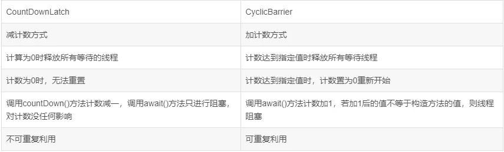

# AQS 与 CAS 

原子（atom）本意是 “不能被进一步分割的最小粒子”，而原子操作（atomic operation）意为” 不可被中断的一个或一系列操作” 。在多 处理器上实现原子操作就变得有点复杂。本文让我们一起来聊一聊在 Inter 处理器和 Java 里是如何实现原子操作的。

### 处理器如何实现原子操作

32 位 IA-32 处理器使用基于对缓存加锁或总线加锁的方式来实现多处理器之间的原子操作。

#### 处理器自动保证基本内存操作的原子性

首先处理器会自动保证基本的内存操作的原子性。处理器保证从系统内存当中读取或者写入一个字节是原子的，意思是当一个处理器读取一个字节时，其他处理器不能访问这个字节的内存地址。奔腾 6 和最新的处理器能自动保证单处理器对同一个缓存行里进行 16/32/64 位的操作是原子的，但是复杂的内存操作处理器不能自动保证其原子性，比如跨总线宽度，跨多个缓存行，跨页表的访问。但是处理器提供总线锁定和缓存锁定两个机制来保证复杂内存操作的原子性。

#### 使用总线锁保证原子性

第一个机制是通过总线锁保证原子性。如果多个处理器同时对共享变量进行读改写（i++ 就是经典的读改写操作）操作，那么共享变量就会被多个处理器同时进行操作，这样读改写操作就不是原子的，操作完之后共享变量的值会和期望的不一致，举个例子：如果 i=1, 我们进行两次 i++ 操作，我们期望的结果是 3，但是有可能结果是 2。如下图所示：


原因是有可能多个处理器同时从各自的缓存中读取变量 i，分别进行加一操作，然后分别写入系统内存当中。那么想要保证读改写共享变量的操作是原子的，就必须保证 CPU1 读改写共享变量的时候，CPU2 不能操作缓存了该共享变量内存地址的缓存。

处理器使用总线锁就是来解决这个问题的。所谓总线锁就是使用处理器提供的一个 LOCK＃信号，当一个处理器在总线上输出此信号时，其他处理器的请求将被阻塞住，那么该处理器可以独占使用共享内存。

#### 使用缓存锁保证原子性

第二个机制是通过缓存锁定保证原子性。在同一时刻我们只需保证对某个内存地址的操作是原子性即可，但总线锁定把 CPU 和内存之间通信锁住了，这使得锁定期间，其他处理器不能操作其他内存地址的 数据，所以总线锁定的开销比较大，最近的处理器在某些场合下使用缓存锁定代替总线锁定来进行优化。

频繁使用的内存会缓存在处理器的 L1，L2 和 L3 高速缓存里，那么原子操作就可以直接在处理器内部缓存中进行，并不需要声明总线锁，在奔腾 6 和最近的处理器中可以使用 “缓存锁定” 的方式来实现复杂的原子性。所谓 “缓存锁定” 就是如果缓存在处理器缓存行中内存区域在 LOCK 操作期间被锁定，当它执行锁操作回写内存时，处理器不在总线上声言 LOCK＃信号，而是修改内部的内存地址，并允许它的缓存 一致性机制来保证操作的原子性，因为缓存一致性机制会阻止同时修改被两个以上处理器缓存的内存区域数据，当其他处理器回写已被锁定的缓存行的数据时会起缓存行无效，在例 1 中，当 CPU1 修改缓存行中的 i 时使用缓存锁定，那么 CPU2 就不能同时缓存了 i 的缓存行。

但是有两种情况下处理器不会使用缓存锁定。第一种情况是：当操作的数据不能被缓存在处理器内部，或操作的数据跨多个缓存行，则处理器会调用总线锁定。第二种情况是：有些处理器不支持缓存锁定。对于 Inter486 和奔腾处理器，就算锁定的内存区域在处理器的缓存行中也会调用总线锁定。

以上两个机制我们可以通过 Inter 处理器提供了很多 LOCK 前缀的指令来实现。比如位测试和修改指令 BTS，BTR，BTC，交换指令 XADD，CMPXCHG 和其他一些操作数和逻辑指令，比如 ADD（加），OR（或）等，被这些指令操作的内存区域就会加锁，导致其他处理器不能同时访问它。

## CAS (compare and swap)

在  Java 中可以通过循环 CAS 的方式来实现原子操作，即 Compare and Swap。

CAS 有 3 个操作数，内存值 V，旧的预期值 A，要修改的新值 B。当且仅当预期值 A 和内存值 V 相同时，将内存值 V 修改为 B，否则什么都不做。

我们看一下AtomicInteger 这个类的 incrementAndGet 方法：

```java
public final int incrementAndGet() {
    for (;;) {
        int current = get();
        int next = current + 1;
        if (compareAndSet(current, next))
            return next;
    }
}
```

在这里采用了 CAS 操作，每次从内存中读取数据然后将此数据和 + 1 后的结果进行 CAS 操作，如果成功就返回结果，否则重试直到成功为止。而 compareAndSet 利用 JNI 来完成 CPU 指令的操作。

### CAS 中的 ABA 问题

CAS 用起来虽然很爽，但是会引起 ABA 问题，假设如下事件序列：

1. 线程1  从内存位置 V 中取出 A。

2. 线程 2 从位置 V 中取出 A。

3. 线程 2 进行了一些操作，将 B 写入位置 V。

4. 线程 2 将 A 再次写入位置 V。

5. 线程 1 进行 CAS 操作，发现位置 V 中仍然是 A，操作成功。

   
   
   尽管线程 1 的 CAS 操作成功，但不代表这个过程没有问题 —— 对于线程 1 ，线程 2 的修改已经丢失。

我们再举一个链表 ABA 的例子:

(1) 现有一个用单向链表实现的堆栈，栈顶为 A。这时线程 T1 已经知道 A.next 为 B，然后 [希望 ](http://www.liuhaihua.cn/archives/tag/希望)用 CAS 将栈顶替换为 B：

```
head.compareAndSet(A,B);
```

(2) 在 T1 执行上面这条指令之前，线程 T2 介入，将 A、B 出栈，再依次入栈 D、C、A，而对象 B 此时处于游离状态。

(3) 此时轮到线程 T1 执行 CAS 操作，检测发现栈顶仍为 A，所以 CAS 成功，栈顶变为 B。但实际上 B.next 为 null，此时堆栈中只有 B 一个元素，C 和 D 组成的链表不再存在于堆栈中，C、D 被丢掉了。


### 如何解决 CAS 中的 ABA 问题

ABA 问题的解决思路就是使用版本号。在变量前面追加上版本号，每次变量更新的时候把版本号加一，那么 A－B－A 就会变成 1A-2B－3A。

在  Java 中可以使用 AtomicStampedReference 这个类解决 ABA 问题，它内部不仅维护了对象值，还维护了一个 [时间 ](http://www.liuhaihua.cn/archives/tag/时间)戳（我这里把它称为时间戳，实际上它可以使任何一个整数，它使用整数来表示状态值）。当 AtomicStampedReference 对应的数值被修改时，除了更新数据本身外，还必须要更新时间戳。当 AtomicStampedReference 设置对象值时，对象值以及时间戳都必须满足期望值，写入才会成功。因此，即使对象值被反复读写，写回原值，只要时间戳发生变化，就能防止不恰当的写入。

```
/比较设置 参数依次为：期望值 写入新值 期望时间戳 新时间戳
public boolean compareAndSet(V expectedReference,V  
newReference,int expectedStamp,int newStamp)
//获得当前对象引用
public V getReference()
//获得当前时间戳
public int getStamp()
//设置当前对象引用和时间戳
public void set(V newReference, int newStamp)
```

我们将 incrementAndGet 方法使用该类重写一下， [代码 ](http://www.liuhaihua.cn/archives/tag/代码)如下：

```
public class AtomicStampedReferenceDemo {
    AtomicStampedReference<Integer> atomicStampedReference = new AtomicStampedReference<Integer>(0, 0);
    public int incrementAndGet() {
        for (;;) {
            int stamp = atomicStampedReference.getStamp();
            int ref = atomicStampedReference.getReference();
            int next = ref+1;
            if (atomicStampedReference.compareAndSet(ref,next, stamp, stamp + 1){
                return next;
            }
        }

    }
}
```

### 使用 CAS 会引发的问题

使用 CAS 虽然比 java 中使用锁的开销要低，但是也存在以下几点问题：

#### 1、ABA 问题

该问题的解决办法前面已经说的很详细，可以加版本号解决。

#### 2、循环时间长开销大

自旋 CAS 如果长时间不成功，会给 CPU 带来非常大的执行开销。如果 [JVM ](http://www.liuhaihua.cn/archives/tag/jvm)能支持处理器提供的 pause 指令那么效率会有一定的提升，pause 指令有两个作用，第一它可以延迟流水线执行指令（de-p [ip ](http://www.liuhaihua.cn/archives/tag/ip)eline）, 使 CPU 不会消耗过多的执行资源，延迟的时间取决于具体实现的版本，在一些处理器上延迟时间是零。第二它可以避免在退出循环的时候因内存顺序冲突（memory order violation）而引起 CPU 流水线被清空（CPU pipeline flush），从而提高 CPU 的执行效率。

#### 3、只能保证一个共享变量的原子操作

当对一个共享变量执行操作时，我们可以使用循环 CAS 的方式来保证原子操作，但是对多个共享变量操作时，循环 CAS 就无法保证操作的原子性，这个时候就可以用锁，或者有一个取巧的办法，就是把多个共享变量合并成一个共享变量来操作。比如有两个共享变量 i＝2,j=a，合并一下 ij=2a，然后用 CAS 来操作 ij。从 Java1.5 开始 JDK 提供了 AtomicReference 类来保证引用对象之间的原子性，你可以把多个变量放在一个对象里来进行 CAS 操作。

## AQS (AbstractQueuedSynchronizer)

### AQS 简单介绍

AQS 的全称为（AbstractQueuedSynchronizer），这个类在 java.util.concurrent.locks 包下面。

AQS 是一个用来构建锁和同步器的框架，使用 AQS 能简单且高效地构造出应用广泛的大量的同步器，比如我们提到的 ReentrantLock，Semaphore，其他的诸如 ReentrantReadWriteLock，SynchronousQueue，FutureTask 等等皆是基于 AQS 的。当然，我们自己也能利用 AQS 非常轻松容易地构造出符合我们自己需求的同步器。

### AQS 原理

#### AQS 原理概览

**AQS 核心思想是，如果被请求的共享资源空闲，则将当前请求资源的线程设置为有效的工作线程，并且将共享资源设置为锁定状态。如果被请求的共享资源被占用，那么就需要一套线程阻塞等待以及被唤醒时锁分配的机制，这个机制 AQS 是用 CLH 队列锁实现的，即将暂时获取不到锁的线程加入到队列中。**

::: tip

CLH (Craig,Landin,and Hagersten) 队列是一个虚拟的双向队列（虚拟的双向队列即不存在队列实例，仅存在结点之间的关联关系）。AQS 是将每条请求共享资源的线程封装成一个 CLH 锁队列的一个结点（Node）来实现锁的分配。

:::


看个 AQS (AbstractQueuedSynchronizer) 原理图：


AQS 使用一个 int 成员变量来表示同步状态，通过内置的 FIFO 队列来完成获取资源线程的排队工作。AQS 使用 CAS 对该同步状态进行原子操作实现对其值的修改。

```java
private volatile int state;//共享变量，使用volatile修饰保证线程可见性
```

状态信息通过 procted 类型的 getState，setState，compareAndSetState 进行操作

```java
//返回同步状态的当前值
protected final int getState() {  
        return state;
}
 // 设置同步状态的值
protected final void setState(int newState) { 
        state = newState;
}
//原子地（CAS操作）将同步状态值设置为给定值update如果当前同步状态的值等于expect（期望值）
protected final boolean compareAndSetState(int expect, int update) {
        return unsafe.compareAndSwapInt(this, stateOffset, expect, update);
}
```

#### AQS 对资源的共享方式

**AQS 定义两种资源共享方式**

- **Exclusive**（独占）：只有一个线程能执行，如 ReentrantLock。又可分为公平锁和非公平锁：

  - 公平锁：按照线程在队列中的排队顺序，先到者先拿到锁
  - 非公平锁：当线程要获取锁时，无视队列顺序直接去抢锁，谁抢到就是谁的

- **Share**（共享）：多个线程可同时执行，如 Semaphore/CountDownLatch。Semaphore、CountDownLatCh、 CyclicBarrier、ReadWriteLock 我们都会在后面讲到。

ReentrantReadWriteLock 可以看成是组合式，因为 ReentrantReadWriteLock 也就是读写锁允许多个线程同时对某一资源进行读。

不同的自定义同步器争用共享资源的方式也不同。自定义同步器在实现时只需要实现共享资源 state 的获取与释放方式即可，至于具体线程等待队列的维护（如获取资源失败入队 / 唤醒出队等），AQS 已经在上层已经帮我们实现好了。

#### AQS 底层使用了模板方法模式

同步器的设计是基于模板方法模式的，如果需要自定义同步器一般的方式是这样（模板方法模式很经典的一个应用）：

1. 使用者继承 AbstractQueuedSynchronizer 并重写指定的方法。（这些重写方法很简单，无非是对于共享资源 state 的获取和释放）
2. 将 AQS 组合在自定义同步组件的实现中，并调用其模板方法，而这些模板方法会调用使用者重写的方法。

这和我们以往通过实现接口的方式有很大区别，这是模板方法模式很经典的一个运用。下面简单的给大家介绍一下模板方法模式，模板方法模式是一个很容易理解的设计模式之一。

::: tip
模板方法模式是基于” 继承 “的，主要是为了在不改变模板结构的前提下在子类中重新定义模板中的内容以实现复用代码。举个很简单的例子假如我们要去一个地方的步骤是：购票 `buyTicket()`-> 安检 `securityCheck()`-> 乘坐某某工具回家 `ride()`-> 到达目的地 `arrive()`。我们可能乘坐不同的交通工具回家比如飞机或者火车，所以除了 `ride()` 方法，其他方法的实现几乎相同。我们可以定义一个包含了这些方法的抽象类，然后用户根据自己的需要继承该抽象类然后修改 `ride()` 方法。
:::


**AQS 使用了模板方法模式，自定义同步器时需要重写下面几个 AQS 提供的模板方法：**

```java
isHeldExclusively()//该线程是否正在独占资源。只有用到condition才需要去实现它。
tryAcquire(int)//独占方式。尝试获取资源，成功则返回true，失败则返回false。
tryRelease(int)//独占方式。尝试释放资源，成功则返回true，失败则返回false。
tryAcquireShared(int)//共享方式。尝试获取资源。负数表示失败；0表示成功，但没有剩余可用资源；正数表示成功，且有剩余资源。
tryReleaseShared(int)//共享方式。尝试释放资源，成功则返回true，失败则返回false。
```

默认情况下，每个方法都抛出 `UnsupportedOperationException`。 这些方法的实现必须是内部线程安全的，并且通常应该简短而不是阻塞。AQS 类中的其他方法都是 final ，所以无法被其他类使用，只有这几个方法可以被其他类使用。

以 ReentrantLock 为例，state 初始化为 0，表示未锁定状态。A 线程 lock () 时，会调用 tryAcquire () 独占该锁并将 state+1。此后，其他线程再 tryAcquire () 时就会失败，直到 A 线程 unlock () 到 state=0（即释放锁）为止，其它线程才有机会获取该锁。当然，释放锁之前，A 线程自己是可以重复获取此锁的（state 会累加），这就是可重入的概念。但要注意，获取多少次就要释放多么次，这样才能保证 state 是能回到零态的。

再以 CountDownLatch 以例，任务分为 N 个子线程去执行，state 也初始化为 N（注意 N 要与线程个数一致）。这 N 个子线程是并行执行的，每个子线程执行完后 countDown () 一次，state 会 CAS (Compare and Swap) 减 1。等到所有子线程都执行完后 (即 state=0)，会 unpark () 主调用线程，然后主调用线程就会从 await () 函数返回，继续后余动作。

一般来说，自定义同步器要么是独占方法，要么是共享方式，他们也只需实现 `tryAcquire-tryRelease`、`tryAcquireShared-tryReleaseShared` 中的一种即可。但 AQS 也支持自定义同步器同时实现独占和共享两种方式，如 `ReentrantReadWriteLock`。

推荐两篇 AQS 原理和相关源码分析的文章：

- http://www.cnblogs.com/waterystone/p/4920797.html
- https://www.cnblogs.com/chengxiao/archive/2017/07/24/7141160.html

### Semaphore (信号量)- 允许多个线程同时访问

**synchronized 和 ReentrantLock 都是一次只允许一个线程访问某个资源，Semaphore (信号量) 可以指定多个线程同时访问某个资源。**示例代码如下：

```java
/**
 * @Description: 需要一次性拿一个许可的情况
 */
public class SemaphoreExample1 {
    // 请求的数量
    private static final int threadCount = 550;

    public static void main(String[] args) throws InterruptedException {
        // 创建一个具有固定线程数量的线程池对象（如果这里线程池的线程数量给太少的话你会发现执行的很慢）
        ExecutorService threadPool = Executors.newFixedThreadPool(300);
        // 一次只能允许执行的线程数量。
        final Semaphore semaphore = new Semaphore(20);

        for (int i = 0; i < threadCount; i++) {
            final int threadnum = i;
            threadPool.execute(() -> {// Lambda 表达式的运用
                try {
                    semaphore.acquire();// 获取一个许可，所以可运行线程数量为20/1=20
                    test(threadnum);
                    semaphore.release();// 释放一个许可
                } catch (InterruptedException e) {
                    // TODO Auto-generated catch block
                    e.printStackTrace();
                }

            });
        }
        threadPool.shutdown();
        System.out.println("finish");
    }

    public static void test(int threadnum) throws InterruptedException {
        Thread.sleep(1000);// 模拟请求的耗时操作
        System.out.println("threadnum:" + threadnum);
        Thread.sleep(1000);// 模拟请求的耗时操作
    }
}
```

执行 `acquire` 方法阻塞，直到有一个许可证可以获得然后拿走一个许可证；每个 `release` 方法增加一个许可证，这可能会释放一个阻塞的 acquire 方法。然而，其实并没有实际的许可证这个对象，Semaphore 只是维持了一个可获得许可证的数量。 Semaphore 经常用于限制获取某种资源的线程数量。

当然一次也可以一次拿取和释放多个许可，不过一般没有必要这样做：

```java
semaphore.acquire(5);// 获取5个许可，所以可运行线程数量为20/5=4
test(threadnum);
semaphore.release(5);// 获取5个许可，所以可运行线程数量为20/5=4
```

除了 `acquire` 方法之外，另一个比较常用的与之对应的方法是 `tryAcquire` 方法，该方法如果获取不到许可就立即返回 false。

Semaphore 有两种模式，公平模式和非公平模式。

- **公平模式：** 调用 acquire 的顺序就是获取许可证的顺序，遵循 FIFO；
- **非公平模式：** 抢占式的。

**Semaphore 对应的两个构造方法如下：**

```java
public Semaphore(int permits) {
    sync = new NonfairSync(permits);
}

public Semaphore(int permits, boolean fair) {
    sync = fair ? new FairSync(permits) : new NonfairSync(permits);
}
```

**这两个构造方法，都必须提供许可的数量，第二个构造方法可以指定是公平模式还是非公平模式，默认非公平模式。**

由于篇幅问题，如果对 Semaphore 源码感兴趣的朋友可以看下面这篇文章：

- https://blog.csdn.net/qq_19431333/article/details/70212663

### CountDownLatch （倒计时器）

CountDownLatch 是一个同步工具类，用来协调多个线程之间的同步。这个工具通常用来控制线程等待，它可以让某一个线程等待直到倒计时结束，再开始执行。

#### CountDownLatch 的两种典型用法

①某一线程在开始运行前等待 n 个线程执行完毕。将 CountDownLatch 的计数器初始化为 n ：`new CountDownLatch(n)`，每当一个任务线程执行完毕，就将计数器减 1 `countdownlatch.countDown()`，当计数器的值变为 0 时，在 `CountDownLatch上 await()` 的线程就会被唤醒。一个典型应用场景就是启动一个服务时，主线程需要等待多个组件加载完毕，之后再继续执行。

②实现多个线程开始执行任务的最大并行性。注意是并行性，不是并发，强调的是多个线程在某一时刻同时开始执行。类似于赛跑，将多个线程放到起点，等待发令枪响，然后同时开跑。做法是初始化一个共享的 `CountDownLatch` 对象，将其计数器初始化为 1 ：`new CountDownLatch(1)`，多个线程在开始执行任务前首先 `coundownlatch.await()`，当主线程调用 countDown () 时，计数器变为 0，多个线程同时被唤醒。

#### CountDownLatch 的使用示例

```java
/**
 * @Description: CountDownLatch 使用方法示例
 */
public class CountDownLatchExample1 {
    // 请求的数量
    private static final int threadCount = 550;

    public static void main(String[] args) throws InterruptedException {
        // 创建一个具有固定线程数量的线程池对象（如果这里线程池的线程数量给太少的话你会发现执行的很慢）
        ExecutorService threadPool = Executors.newFixedThreadPool(300);
        final CountDownLatch countDownLatch = new CountDownLatch(threadCount);
        for (int i = 0; i < threadCount; i++) {
            final int threadnum = i;
            threadPool.execute(() -> {// Lambda 表达式的运用
                try {
                    test(threadnum);
                } catch (InterruptedException e) {
                    // TODO Auto-generated catch block
                    e.printStackTrace();
                } finally {
                    countDownLatch.countDown();// 表示一个请求已经被完成
                }

            });
        }
        countDownLatch.await();
        threadPool.shutdown();
        System.out.println("finish");
    }

    public static void test(int threadnum) throws InterruptedException {
        Thread.sleep(1000);// 模拟请求的耗时操作
        System.out.println("threadnum:" + threadnum);
        Thread.sleep(1000);// 模拟请求的耗时操作
    }
}
```

上面的代码中，我们定义了请求的数量为 550，当这 550 个请求被处理完成之后，才会执行 `System.out.println("finish");`。

#### CountDownLatch 的不足

CountDownLatch 是一次性的，计数器的值只能在构造方法中初始化一次，之后没有任何机制再次对其设置值，当 CountDownLatch 使用完毕后，它不能再次被使用。

### CyclicBarrier (循环栅栏)

CyclicBarrier 和 CountDownLatch 非常类似，它也可以实现线程间的技术等待，但是它的功能比 CountDownLatch 更加复杂和强大。主要应用场景和 CountDownLatch 类似。

CyclicBarrier 的字面意思是可循环使用（Cyclic）的屏障（Barrier）。它要做的事情是，让一组线程到达一个屏障（也可以叫同步点）时被阻塞，直到最后一个线程到达屏障时，屏障才会开门，所有被屏障拦截的线程才会继续干活。CyclicBarrier 默认的构造方法是 `CyclicBarrier(int parties)`，其参数表示屏障拦截的线程数量，每个线程调用 `await` 方法告诉 CyclicBarrier 我已经到达了屏障，然后当前线程被阻塞。

#### CyclicBarrier 的应用场景

CyclicBarrier 可以用于多线程计算数据，最后合并计算结果的应用场景。比如我们用一个 Excel 保存了用户所有银行流水，每个 Sheet 保存一个帐户近一年的每笔银行流水，现在需要统计用户的日均银行流水，先用多线程处理每个 sheet 里的银行流水，都执行完之后，得到每个 sheet 的日均银行流水，最后，再用 barrierAction 用这些线程的计算结果，计算出整个 Excel 的日均银行流水。

#### CyclicBarrier 的使用示例

示例 1：

```java
/**
 * @Description: 测试 CyclicBarrier 类中带参数的 await() 方法
 */
public class CyclicBarrierExample2 {
    // 请求的数量
    private static final int threadCount = 550;
    // 需要同步的线程数量
    private static final CyclicBarrier cyclicBarrier = new CyclicBarrier(5);

    public static void main(String[] args) throws InterruptedException {
        // 创建线程池
        ExecutorService threadPool = Executors.newFixedThreadPool(10);

        for (int i = 0; i < threadCount; i++) {
            final int threadNum = i;
            Thread.sleep(1000);
            threadPool.execute(() -> {
                try {
                    test(threadNum);
                } catch (InterruptedException e) {
                    // TODO Auto-generated catch block
                    e.printStackTrace();
                } catch (BrokenBarrierException e) {
                    // TODO Auto-generated catch block
                    e.printStackTrace();
                }
            });
        }
        threadPool.shutdown();
    }

    public static void test(int threadnum) throws InterruptedException, BrokenBarrierException {
        System.out.println("threadnum:" + threadnum + "is ready");
        try {
            cyclicBarrier.await(2000, TimeUnit.MILLISECONDS);
        } catch (Exception e) {
            System.out.println("-----CyclicBarrierException------");
        }
        System.out.println("threadnum:" + threadnum + "is finish");
    }

}
```

运行结果，如下：

```java
threadnum:0is ready
threadnum:1is ready
threadnum:2is ready
threadnum:3is ready
threadnum:4is ready
threadnum:4is finish
threadnum:0is finish
threadnum:1is finish
threadnum:2is finish
threadnum:3is finish
threadnum:5is ready
threadnum:6is ready
threadnum:7is ready
threadnum:8is ready
threadnum:9is ready
threadnum:9is finish
threadnum:5is finish
threadnum:8is finish
threadnum:7is finish
threadnum:6is finish
......
```

可以看到当线程数量也就是请求数量达到我们定义的 5 个的时候， `await` 方法之后的方法才被执行。

另外，CyclicBarrier 还提供一个更高级的构造函数 `CyclicBarrier(int parties, Runnable barrierAction)`，用于在线程到达屏障时，优先执行 `barrierAction`，方便处理更复杂的业务场景。示例代码如下：

```java
/**
 * @Description: 新建 CyclicBarrier 的时候指定一个 Runnable
 */
public class CyclicBarrierExample3 {
    // 请求的数量
    private static final int threadCount = 550;
    // 需要同步的线程数量
    private static final CyclicBarrier cyclicBarrier = new CyclicBarrier(5, () -> {
        System.out.println("------当线程数达到之后，优先执行------");
    });

    public static void main(String[] args) throws InterruptedException {
        // 创建线程池
        ExecutorService threadPool = Executors.newFixedThreadPool(10);

        for (int i = 0; i < threadCount; i++) {
            final int threadNum = i;
            Thread.sleep(1000);
            threadPool.execute(() -> {
                try {
                    test(threadNum);
                } catch (InterruptedException e) {
                    // TODO Auto-generated catch block
                    e.printStackTrace();
                } catch (BrokenBarrierException e) {
                    // TODO Auto-generated catch block
                    e.printStackTrace();
                }
            });
        }
        threadPool.shutdown();
    }

    public static void test(int threadnum) throws InterruptedException, BrokenBarrierException {
        System.out.println("threadnum:" + threadnum + "is ready");
        cyclicBarrier.await();
        System.out.println("threadnum:" + threadnum + "is finish");
    }

}
```

运行结果，如下：

```
threadnum:0is ready
threadnum:1is ready
threadnum:2is ready
threadnum:3is ready
threadnum:4is ready
------当线程数达到之后，优先执行------
threadnum:4is finish
threadnum:0is finish
threadnum:2is finish
threadnum:1is finish
threadnum:3is finish
threadnum:5is ready
threadnum:6is ready
threadnum:7is ready
threadnum:8is ready
threadnum:9is ready
------当线程数达到之后，优先执行------
threadnum:9is finish
threadnum:5is finish
threadnum:6is finish
threadnum:8is finish
threadnum:7is finish
......
```

#### CyclicBarrier 和 CountDownLatch 的区别

CountDownLatch 是计数器，只能使用一次，而 CyclicBarrier 的计数器提供 reset 功能，可以多次使用。但是我不那么认为它们之间的区别仅仅就是这么简单的一点。我们来从 jdk 作者设计的目的来看，javadoc 是这么描述它们的：


::: tip

CountDownLatch: A synchronization aid that allows one or more threads to wait until a set of operations being performed in other threads completes.(CountDownLatch: 一个或者多个线程，等待其他多个线程完成某件事情之后才能执行；)
CyclicBarrier : A synchronization aid that allows a set of threads to all wait for each other to reach a common barrier point.(CyclicBarrier : 多个线程互相等待，直到到达同一个同步点，再继续一起执行。)

:::

对于 CountDownLatch 来说，重点是 “一个线程（多个线程）等待”，而其他的 N 个线程在完成 “某件事情” 之后，可以终止，也可以等待。而对于 CyclicBarrier，重点是多个线程，在任意一个线程没有完成，所有的线程都必须等待。

CountDownLatch 是计数器，线程完成一个记录一个，只不过计数不是递增而是递减，而 CyclicBarrier 更像是一个阀门，需要所有线程都到达，阀门才能打开，然后继续执行。



CyclicBarrier 和 CountDownLatch 的区别这部分内容参考了如下两篇文章：

- https://blog.csdn.net/u010185262/article/details/54692886
- https://blog.csdn.net/tolcf/article/details/50925145?utm_source=blogxgwz0


https://www.jianshu.com/p/2a48778871a9

https://blog.csdn.net/u010862794/article/details/72892300/


