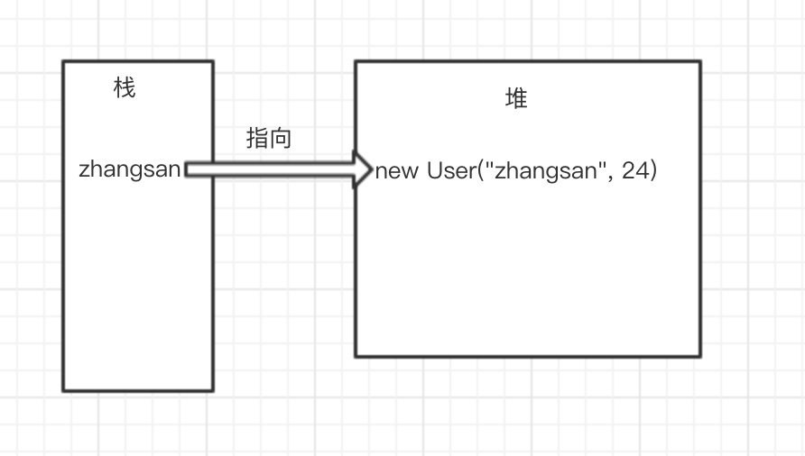

# ThreadLocal 深度理解

# 1 背景

某一天在某一个群里面的某个群友突然提出了一个问题:"threadlocal 的 key 是弱引用，那么在 threadlocal.get () 的时候，发生 GC 之后，key 是否是 null？" 屏幕前的你可以好好的想想这个问题，在这里我先卖个关子，先讲讲 Java 中引用和 ThreadLocal 的那些事。

# 2 Java 中的引用

对于很多 Java 初学者来说，会把引用和对象给搞混淆。下面有一段代码，

```
User zhangsan = new User("zhangsan", 24);
```

这里先提个问题 zhangsan 到底是引用还是对象呢？很多人会认为 zhangsan 是个对象，如果你也是这样认为的话那么再看一下下面一段代码

```
User zhangsan;
zhangsan = new User("zhangsan", 24);
```

这段代码和开始的代码其实执行效果是一致的，这段代码的第一行 User zhangsan，定义了 zhangsan，那你认为 zhangsan 还是对象吗？如果你还认为的话，那么这个对象应该是什么呢？的确，zhangsan 其实只是一个引用，对 JVM 内存划分熟悉的同学应该熟悉下面的图片:



我们一般所说的引用其实都是代指的强引用，在 JDK1.2 之后引用不止这一种，一般来说分为四种：强引用，软引用，弱引用，虚引用。而接下来我会一一介绍这四种引用。

## 2.1 强引用

上面我们说过了 User zhangsan = new User ("zhangsan", 24); 这种就是强引用，有点类似 C 的指针。对强引用他的特点有下面几个:

- 强引用可以直接访问目标对象。
- 只要这个对象被强引用所关联，那么垃圾回收器都不会回收，那怕是抛出 OOM 异常。
- 容易导致内存泄漏。

## 2.2 软引用

在 Java 中使用 SoftReference 帮助我们定义软引用。其构造方法有两个:

```
public SoftReference(T referent);
public SoftReference(T referent, ReferenceQueue<? super T> q);
```

两个构造方法相似，第二个比第一个多了一个引用队列，在构造方法中的第一个参数就是我们的实际被指向的对象，这里用新建一个 SoftReference 来替代我们上面强引用的等号。 下面是构造软引用的例子:

```
 softZhangsan = new SoftReference(new User("zhangsan", 24));
```

#### 2.2.1 软引用有什么用？

如果某个对象他只被软引用所指向，那么他将会在内存要溢出的时候被回收，也就是当我们要出现 OOM 的时候，如果回收了一波内存还不够，这才抛出 OOM, 弱引用回收的时候如果设置了引用队列，那么这个软引用还会进一次引用队列，但是引用所指向的对象已经被回收。这里要和下面的弱引用区分开来，弱引用是只要有垃圾回收，那么他所指向的对象就会被回收。下面是一个代码例子:

```
public static void main(String[] args) {
        ReferenceQueue<User> referenceQueue = new ReferenceQueue();
        SoftReference softReference = new SoftReference(new User("zhangsan",24), referenceQueue);
        //手动触发GC
        System.gc();
        Thread.sleep(1000);
        System.out.println("手动触发GC:" + softReference.get());
        System.out.println("手动触发的队列:" + referenceQueue.poll());
        //通过堆内存不足触发GC
        makeHeapNotEnough();
        System.out.println("通过堆内存不足触发GC:" + softReference.get());
        System.out.println("通过堆内存不足触发GC:" + referenceQueue.poll());
    }

    private static void makeHeapNotEnough() {
        SoftReference softReference = new SoftReference(new byte[1024*1024*5]);
        byte[] bytes = new byte[1024*1024*5];
    }
    输出:
    手动触发GC:User{name='zhangsan', age=24}
    手动触发的队列:null
    通过堆内存不足触发GC:null
    通过堆内存不足触发GC:java.lang.ref.SoftReference@4b85612c
```

通过 - Xmx10m 设置我们堆内存大小为 10，方便构造堆内存不足的情况。可以看见我们输出的情况我们手动调用 System.gc 并没有回收我们的软引用所指向的对象，只有在内存不足的情况下才能触发。

#### 2.2.2 软引用的应用

在 SoftReference 的 doc 中有这么一句话:

> Soft references are most often used to implement memory-sensitive caches

也就是说软引用经常用来实现内存敏感的高速缓存。怎么理解这句话呢？我们知道软引用他只会在内存不足的时候才触发，不会像强引用那用容易内存溢出，我们可以用其实现高速缓存，一方面内存不足的时候可以回收，一方面也不会频繁回收。在高速本地缓存 Caffeine 中实现了软引用的缓存，当需要缓存淘汰的时候，如果是只有软引用指向那么久会被回收。不熟悉 Caffeine 的同学可以阅读[深入理解 Caffeine](https://mp.weixin.qq.com/s/BH6vcUgI8na7iLaF0RGrSg)

## 2.3 弱引用

弱引用在 Java 中使用 WeakReference 来定义一个弱引用，上面我们说过他比软引用更加弱，只要发生垃圾回收，若这个对象只被弱引用指向，那么就会被回收。这里我们就不多废话了，直接上例子:

```
public static void main(String[] args)  {
        WeakReference weakReference = new WeakReference(new User("zhangsan",24));
        System.gc();
        System.out.println("手动触发GC:" + weakReference.get());
    }
输出结果:
手动触发GC:null
```

可以看见上面的例子只要垃圾回收一触发，该对象就被回收了。

#### 2.3.1 弱引用的作用

在 WeakReference 的注释中写到:

> Weak references are most often used to implement canonicalizing mappings.

从中可以知道弱引用更多的是用来实现 canonicalizing mappings (规范化映射)。在 JDK 中 WeakHashMap 很好的体现了这个例子:

```
public static void main(String[] args) throws Exception {
        WeakHashMap<User, String> weakHashMap = new WeakHashMap();
        //强引用
        User zhangsan = new User("zhangsan", 24);
        weakHashMap.put(zhangsan, "zhangsan");
        System.out.println("有强引用的时候:map大小" + weakHashMap.size());
        //去掉强引用
        zhangsan = null;
        System.gc();
        Thread.sleep(1000);
        System.out.println("无强引用的时候:map大小"+weakHashMap.size());
    }
输出结果为:
有强引用的时候:map大小1
无强引用的时候:map大小0
```

可以看出在 GC 之后我们在 map 中的键值对就被回收了，在 weakHashMap 中其实只有 Key 是弱引用做关联的，然后通过引用队列再去对我们的 map 进行回收处理。

## 2.4 虚引用

虚引用是最弱的引用，在 Java 中使用 PhantomReference 进行定义。弱到什么地步呢？也就是你定义了虚引用根本无法通过虚引用获取到这个对象，更别谈影响这个对象的生命周期了。在虚引用中唯一的作用就是用队列接收对象即将死亡的通知。

```
    public static void main(String[] args) throws Exception {
        ReferenceQueue referenceQueue = new ReferenceQueue();
        PhantomReference phantomReference = new PhantomReference(new User("zhangsan", 24), referenceQueue);
        System.out.println("什么也不做，获取:" + phantomReference.get());
    }
输出结果:
什么也不做，获取:null
```

在 PhantomReference 的注释中写到:

> Phantom references are most often used for scheduling pre-mortem cleanup actions in a more flexible way than is possible with the Java finalization mechanism.

虚引用得最多的就是在对象死前所做的清理操作，这是一个比 Java 的 finalization 梗灵活的机制。 在 DirectByteBuffer 中使用 Cleaner 用来回收对外内存，Cleaner 是 PhantomReference 的子类，当 DirectByteBuffer 被回收的时候未防止内存泄漏所以通过这种方式进行回收，有点类似于下面的代码:

```
public static void main(String[] args) throws Exception {
        Cleaner.create(new User("zhangsan", 24), () -> {System.out.println("我被回收了，当前线程:{}"+ Thread.currentThread().getName());});
        System.gc();
        Thread.sleep(1000);
    }
输出:
我被回收了，当前线程:Reference Handler
```

# 3 ThreadLocal

ThreadLocal 是一个本地线程副本变量工具类，基本在我们的代码中随处可见。这里就不过多的介绍他了。

## 3.1 ThreadLocal 和弱引用的那些事

上面说了这么多关于引用的事，这里终于回到了主题了我们的 ThreadLocal 和弱引用有什么关系呢？

在我们的 Thread 类中有下面这个变量:

```
ThreadLocal.ThreadLocalMap threadLocals
```

ThreadLocalMap 本质上也是个 Map, 其中 Key 是我们的 ThreadLocal 这个对象，Value 就是我们在 ThreadLocal 中保存的值。也就是说我们的 ThreadLocal 保存和取对象都是通过 Thread 中的 ThreadLocalMap 来操作的，而 key 就是本身。在 ThreadLocalMap 中 Entry 有如下定义:

```
 static class Entry extends WeakReference<ThreadLocal<?>> {
            /** The value associated with this ThreadLocal. */
            Object value;

            Entry(ThreadLocal<?> k, Object v) {
                super(k);
                value = v;
            }
        }
```

可以看见 Entry 是 WeakReference 的子类，而这个弱引用所关联的对象正是我们的 ThreadLocal 这个对象。我们又回到上面的问题:

> "threadlocal 的 key 是弱引用，那么在 threadlocal.get () 的时候，发生 GC 之后，key 是否是 null？"

这个问题晃眼一看，弱引用嘛，还有垃圾回收那肯定是为 null，这其实是不对的，因为题目说的是在做 threadlocal.get () 操作，证明其实还是有强引用存在的。所以 key 并不为 null。如果我们的强引用不存在的话，那么 Key 就会被回收，也就是会出现我们 value 没被回收，key 被回收，导致 value 永远存在，出现内存泄漏。这也是 ThreadLocal 经常会被很多书籍提醒到需要 remove () 的原因。

你也许会问看到很多源码的 ThreadLocal 并没有写 remove 依然再用得很好呢？那其实是因为很多源码经常是作为静态变量存在的生命周期和 Class 是一样的，而 remove 需要再那些方法或者对象里面使用 ThreadLocal，因为方法栈或者对象的销毁从而强引用丢失，导致内存泄漏。

## 3.2 FastThreadLocal

FastThreadLocal 是 Netty 中提供的高性能本地线程副本变量工具。在 Netty 的 io.netty.util 中提供了很多牛逼的工具，后续会一一给大家介绍，这里就先说下 FastThreadLocal。

FastThreadLocal 有下面几个特点:

- 使用数组代替 ThreadLocalMap 存储数据，从而获取更快的性能。(缓存行和一次定位，不会有 hash 冲突)
- 由于使用数组，不会出现 Key 回收，value 没被回收的尴尬局面，所以避免了内存泄漏。

# 