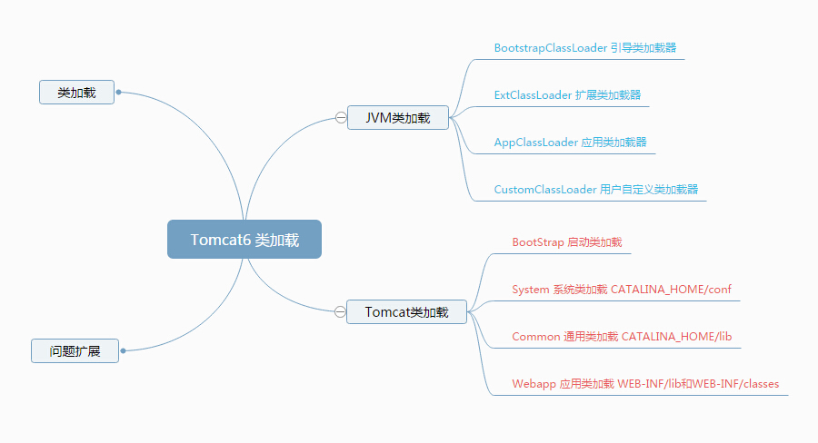
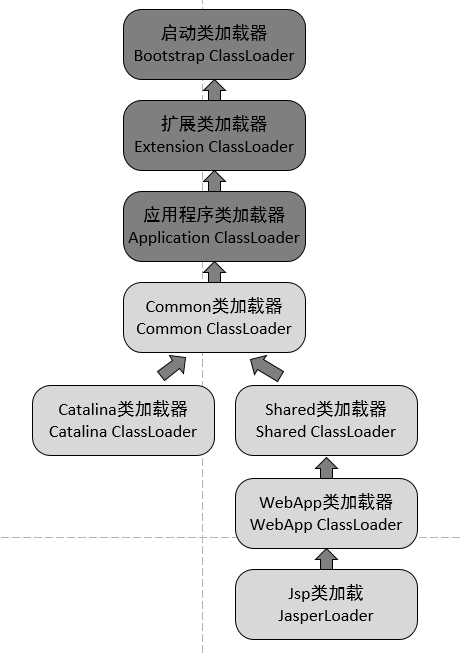
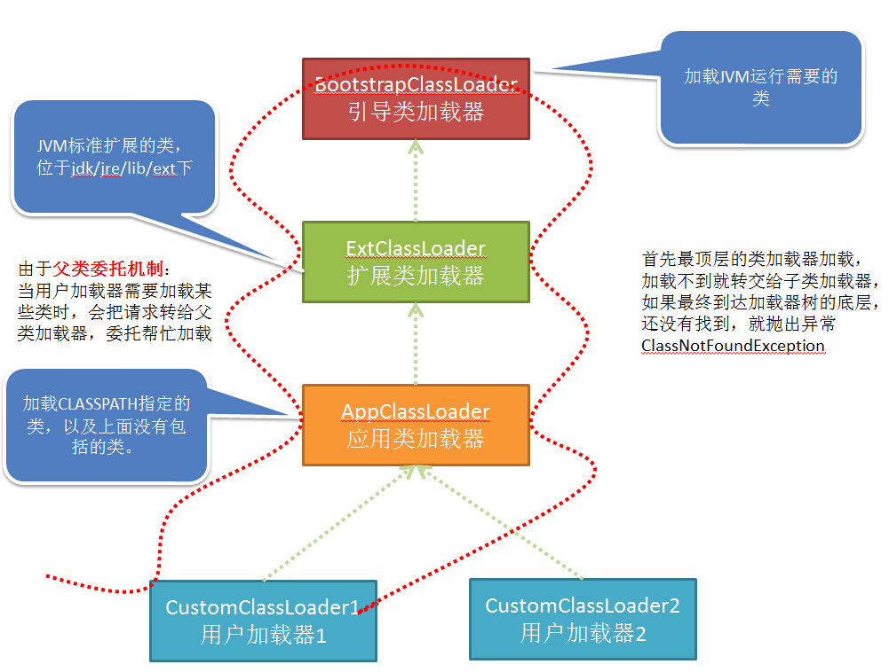
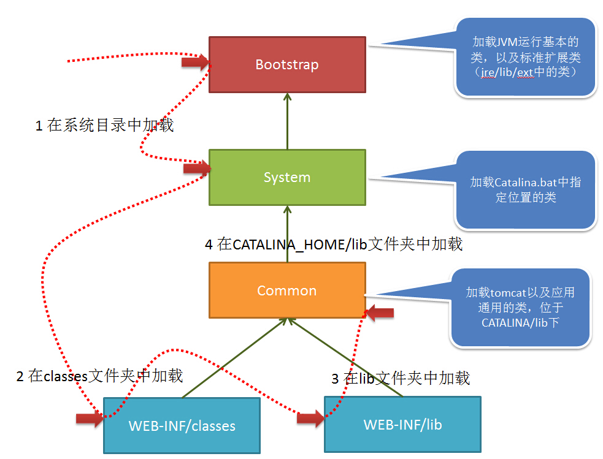
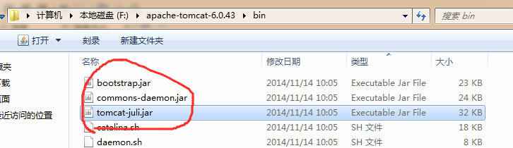
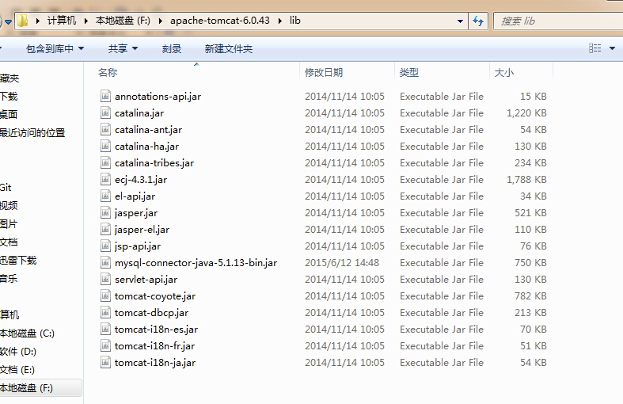
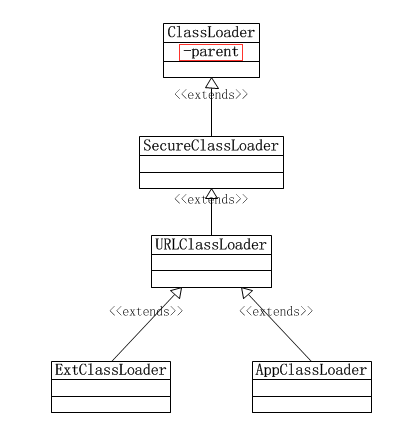
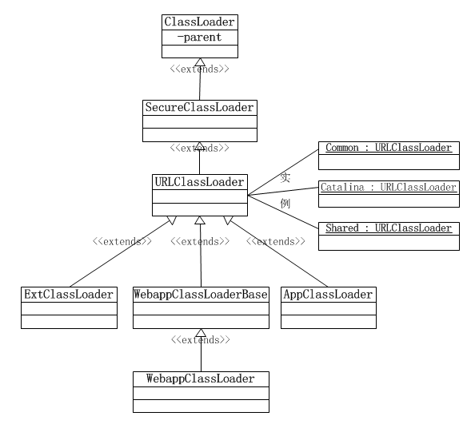
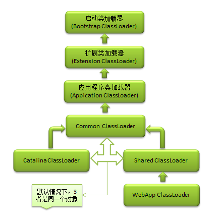

# [图解Tomcat类加载机制](https://www.cnblogs.com/aspirant/p/8991830.html)

**[Tomcat](./tomcat.md)的类加载机制是违反了双亲委托原则的，对于一些未加载的非基础类(Object,String等)，各个web应用自己的类加载器(WebAppClassLoader)会优先加载，加载不到时再交给commonClassLoader走[双亲委托](../jvm/parents_dlegation_mode.md)**

**对于JVM来说：**

****因此，按照这个过程可以想到，如果同样在CLASSPATH指定的目录中和自己工作目录中存放相同的class，会优先加载CLASSPATH目录中的文件。****



## 为什么 Tomcat 不遵循双亲委派机制

Tomcat 不遵循双亲委派机制，那么如果我自己定义一个恶意的HashMap，会不会有风险呢？(**阿里的面试官问**)

答： 显然不会有风险，如果有，Tomcat都运行这么多年了，那群Tomcat大神能不改进吗？ tomcat不遵循双亲委派机制，只是自定义的classLoader顺序不同，但顶层还是相同的，

还是要去顶层请求classloader.

## Tomcat 怎么破坏的双亲委派机制

我们先思考一下：
Tomcat是个web容器， 那么它要解决什么问题:

1. 一个web容器可能需要部署两个应用程序，不同的应用程序可能会依赖同一个第三方类库的不同版本，不能要求同一个类库在同一个服务器只有一份，因此要保证每个应用程序的类库都是独立的，保证相互隔离。 
2. 部署在同一个web容器中相同的类库相同的版本可以共享。否则，如果服务器有10个应用程序，那么要有10份相同的类库加载进虚拟机，这是扯淡的。 
3. web容器也有自己依赖的类库，不能于应用程序的类库混淆。基于安全考虑，应该让容器的类库和程序的类库隔离开来。 
4. web容器要支持jsp的修改，我们知道，jsp 文件最终也是要编译成class文件才能在虚拟机中运行，但程序运行后修改jsp已经是司空见惯的事情，否则要你何用？ 所以，web容器需要支持 jsp 修改后不用重启。

再看看我们的问题：Tomcat 如果使用默认的类加载机制行不行？ 
答案是不行的。为什么？我们看，第一个问题，如果使用默认的类加载器机制，那么是无法加载两个相同类库的不同版本的，默认的累加器是不管你是什么版本的，只在乎你的全限定类名，并且只有一份。第二个问题，默认的类加载器是能够实现的，因为他的职责就是保证唯一性。第三个问题和第一个问题一样。我们再看第四个问题，我们想我们要怎么实现jsp文件的热修改（楼主起的名字），jsp 文件其实也就是class文件，那么如果修改了，但类名还是一样，类加载器会直接取方法区中已经存在的，修改后的jsp是不会重新加载的。那么怎么办呢？我们可以直接卸载掉这jsp文件的类加载器，所以你应该想到了，每个jsp文件对应一个唯一的类加载器，当一个jsp文件修改了，就直接卸载这个jsp类加载器。重新创建类加载器，重新加载jsp文件。

### Tomcat 如何实现自己独特的类加载机制？

所以，Tomcat 是怎么实现的呢？牛逼的Tomcat团队已经设计好了。我们看看他们的设计图：



我们看到，前面3个类加载和默认的一致，CommonClassLoader、CatalinaClassLoader、SharedClassLoader和WebappClassLoader则是Tomcat自己定义的类加载器，它们分别加载`/common/*`、`/server/*`、`/shared/*`（在tomcat 6之后已经合并到根目录下的lib目录下）和`/WebApp/WEB-INF/*`中的Java类库。其中WebApp类加载器和Jsp类加载器通常会存在多个实例，每一个Web应用程序对应一个WebApp类加载器，每一个JSP文件对应一个Jsp类加载器。

* commonLoader：Tomcat最基本的类加载器，加载路径中的class可以被Tomcat容器本身以及各个Webapp访问；
* catalinaLoader：Tomcat容器私有的类加载器，加载路径中的class对于Webapp不可见；
* sharedLoader：各个Webapp共享的类加载器，加载路径中的class对于所有Webapp可见，但是对于Tomcat容器不可见；
* WebappClassLoader：各个Webapp私有的类加载器，加载路径中的class只对当前Webapp可见；

从图中的委派关系中可以看出：

> CommonClassLoader能加载的类都可以被Catalina ClassLoader和SharedClassLoader使用，从而实现了公有类库的共用，而CatalinaClassLoader和Shared ClassLoader自己能加载的类则与对方相互隔离。
> 
> WebAppClassLoader可以使用SharedClassLoader加载到的类，但各个WebAppClassLoader实例之间相互隔离。
> 
> 而JasperLoader的加载范围仅仅是这个JSP文件所编译出来的那一个.Class文件，它出现的目的就是为了被丢弃：当Web容器检测到JSP文件被修改时，会替换掉目前的JasperLoader的实例，并通过再建立一个新的Jsp类加载器来实现JSP文件的HotSwap功能。

好了，至此，我们已经知道了tomcat为什么要这么设计，以及是如何设计的，那么，tomcat 违背了java 推荐的双亲委派模型了吗？答案是：违背了。 我们前面说过：

> 双亲委派模型要求除了顶层的启动类加载器之外，其余的类加载器都应当由自己的父类加载器加载。

很显然，tomcat 不是这样实现，tomcat 为了实现隔离性，没有遵守这个约定，每个webappClassLoader加载自己的目录下的class文件，不会传递给父类加载器。

### 我们扩展出一个问题：如果 tomcat 的 Common ClassLoader 想加载 WebApp ClassLoader 中的类，该怎么办？

看了前面的关于破坏双亲委派模型的内容，我们心里有数了，我们可以使用线程上下文类加载器实现，使用线程上下文加载器，可以让父类加载器请求子类加载器去完成类加载的动作。牛逼吧。

## 类加载

　　在JVM中并不是一次性把所有的文件都加载到，而是一步一步的，按照需要来加载。

　　比如JVM启动时，会通过不同的类加载器加载不同的类。当用户在自己的代码中，需要某些额外的类时，再通过加载机制加载到JVM中，并且存放一段时间，便于频繁使用。

　　因此使用哪种类加载器、在什么位置加载类都是JVM中重要的知识。

### JVM类加载

　　JVM类加载采用 父类委托机制，如下图所示：



　　JVM中包括集中类加载器：

　　1 BootStrapClassLoader 引导类加载器

　　2 ExtClassLoader 扩展类加载器

　　3 AppClassLoader 应用类加载器

　　4 CustomClassLoader 用户自定义类加载器

　　他们的区别上面也都有说明。需要注意的是，不同的类加载器加载的类是不同的，因此如果用户加载器1加载的某个类，其他用户并不能够使用。

　　**当JVM运行过程中，用户需要加载某些类时，会按照下面的步骤（父类委托机制）**：

　　1 用户自己的类加载器，把加载请求传给父加载器，父加载器再传给其父加载器，一直到加载器树的顶层。

　　2 最顶层的类加载器首先针对其特定的位置加载，如果加载不到就转交给子类。

　　3 如果一直到底层的类加载都没有加载到，那么就会抛出异常ClassNotFoundException。

　　**因此，按照这个过程可以想到，如果同样在CLASSPATH指定的目录中和自己工作目录中存放相同的class，会优先加载CLASSPATH目录中的文件。**

### Tomcat类加载

　　在tomcat中类的加载稍有不同，如下图：



　　当tomcat启动时，会创建几种类加载器：

　　**1 Bootstrap 引导类加载器** 

　　加载JVM启动所需的类，以及标准扩展类（位于jre/lib/ext下）

　　**2 System 系统类加载器** 

　　加载tomcat启动的类，比如bootstrap.jar，通常在catalina.bat或者catalina.sh中指定。位于CATALINA_HOME/bin下。



　　**3 Common 通用类加载器** 

　　加载tomcat使用以及应用通用的一些类，位于CATALINA_HOME/lib下，比如servlet-api.jar



**　　4 webapp 应用类加载器**

　　每个应用在部署后，都会创建一个唯一的类加载器。该类加载器会加载位于 WEB-INF/lib下的jar文件中的class 和 WEB-INF/classes下的class文件。

　　**当应用需要到某个类时，则会按照下面的顺序进行类加载**：

　　1 使用bootstrap引导类加载器加载

　　2 使用system系统类加载器加载

　　3 使用应用类加载器在WEB-INF/classes中加载

　　4 使用应用类加载器在WEB-INF/lib中加载

　　5 使用common类加载器在CATALINA_HOME/lib中加载

## 问题扩展

　　通过对上面tomcat类加载机制的理解，就不难明白 为什么java文件放在Eclipse中的src文件夹下会优先jar包中的class?

　　这是因为Eclipse中的src文件夹中的文件java以及webContent中的JSP都会在tomcat启动时，被编译成class文件放在 WEB-INF/class 中。

　　而Eclipse外部引用的jar包，则相当于放在 WEB-INF/lib 中。

　　因此肯定是 **java文件或者JSP文件编译出的class优先加载**。

　　通过这样，我们就可以简单的把java文件放置在src文件夹中，通过对该java文件的修改以及调试，便于学习拥有源码java文件、却没有打包成xxx-source的jar包。

　　另外呢，开发者也会因为粗心而犯下面的错误。

　　在 CATALINA_HOME/lib 以及 WEB-INF/lib 中放置了 不同版本的jar包，此时就会导致某些情况下报加载不到类的错误。

　　还有如果多个应用使用同一jar包文件，当放置了多份，就可能导致 多个应用间 出现类加载不到的错误。

## 1\. java类加载器

近来了解tomcat的类加载机制，所以先回顾一下java虚拟机类加载器，如果从java虚拟机的角度来看的话，其实类加载器只分为两种：一种是启动类加载器(即Bootstrap ClassLoader)，通过使用JNI来实现，我们无法获取到到它的实例；另一种则是java语言实现`java.lang.ClassLoader`的子类。一般从我们的角度来看，会根据类加载路径会把类加载器分为3种：Bootstrap ClassLoader,ExtClassLoader,AppClassLoader.后两者是`sun.misc.Launcher`类的内部类，而前者在JDK源码中是没有与之对应的类的，倒是在`sun.misc.Launcher`中可以看到一些它的加载路径信息。如果找不到sun的源码，可以下载[OpenJDK](http://download.java.net/openjdk/jdk7/promoted/b147/openjdk-7-fcs-src-b147-27_jun_2011.zip)的来看一下。

Bootstrap ClassLoader： 引导类加载器，从%JAVA_RUNTIME_JRE%/lib目录加载，但并不是将该目录所有的类库都加载，它会加载一些符合文件名称的，例如：rt.jar,resources.jar等。在`sun.misc.Launcher`源码中也可以看得它的加载路径：

```java
private static String bootClassPath = System.getProperty("sun.boot.class.path");
```

或者配置-Xbootclasspath参数指定加载的路径，通过获取环境变量`sun.boot.class.path`看一下到底具体加载了那些类：

```
D:\Program Files\Java\jdk1.7.0_67\jre\lib\resources.jar
D:\Program Files\Java\jdk1.7.0_67\jre\lib\rt.jar
D:\Program Files\Java\jdk1.7.0_67\jre\lib\sunrsasign.jar
D:\Program Files\Java\jdk1.7.0_67\jre\lib\jsse.jar
D:\Program Files\Java\jdk1.7.0_67\jre\lib\jce.jar
D:\Program Files\Java\jdk1.7.0_67\jre\lib\charsets.jar
D:\Program Files\Java\jdk1.7.0_67\jre\lib\jfr.jar
D:\Program Files\Java\jdk1.7.0_67\jre\classes
```

Extension ClassLoader：扩展类加载器，实现类为`sun.misc.Launcher$ExtClassLoader`，加载%JAVA_RUNTIME_JRE%/lib/ext/目录下的jar包，也可以在`sun.misc.Launcher`源码中也可以看得它的加载路径：

```java
String s = System.getProperty("java.ext.dirs");
```

通过获取`java.ext.dirs`环境变量打印一下：

```
D:\Program Files\Java\jdk1.7.0_67\jre\lib\ext
```

Appication ClassLoader：应用程序类加载器，或者叫系统类加载器，实现类为`sun.misc.Launcher$AppClassLoader`。从`sun.misc.Launcher`的构造函数中可以看到，当`AppClassLoader`被初始化以后，它会被设置为当前线程的上下文类加载器以及保存到`Launcher`类的loader属性中，而通过`ClassLoader.getSystemClassLoader()`获取的也正是该类加载器(Launcher.loader)。应用类加载器从用户类路径中加载类库，可以在源码中看到：

```java
final String s = System.getProperty("java.class.path");
```

### 1.1 类关系



由图看到Bootstrap ClassLoader并不在继承链上，因为它是java虚拟机内置的类加载器，对外不可见。可以看到顶层`ClassLoader`有一个parent属性，用来表示着类加载器之间的层次关系（双亲委派模型）；注意，`ExtClassLoader`类在初始化时显式指定了parent为null，所以它的父类加载器默认为`Bootstrap ClassLoader`。在tomcat中都是通过扩展`URLClassLoader`来实现自己的类加载器。

### 1.2 双亲委托模型

这3种类加载器之间存在着父子关系(区别于java里的继承)，子加载器保存着父加载器的引用。当一个类加载器需要加载一个目标类时，会先委托父加载器去加载，然后父加载器会在自己的加载路径中搜索目标类，父加载器在自己的加载范围中找不到时，才会交还给子加载器加载目标类。

采用双亲委托模式可以避免类加载混乱，而且还将类分层次了，例如java中lang包下的类在jvm启动时就被启动类加载器加载了，而用户一些代码类则由应用程序类加载器(AppClassLoader)加载，基于双亲委托模式，就算用户定义了与lang包中一样的类，最终还是由应用程序类加载器委托给启动类加载器去加载，这个时候启动类加载器发现已经加载过了lang包下的类了，所以两者都不会再重新加载。当然，如果使用者通过自定义的类加载器可以强行打破这种双亲委托模型，但也不会成功的，java安全管理器抛出将会抛出`java.lang.SecurityException`异常。


1. 启动类加载器是扩展类加载器的父类加载器：扩展类加载器在`sun.misc.Launcher`构造函数中被初始化，它的父类加载器被设置了为null，那为什么还说启动类加载器是它的父加载器？看一下`ClassLoader.loadClass()`方法：

```java
protected Class loadClass(String name, boolean resolve) throws ClassNotFoundException{ 
    synchronized (getClassLoadingLock(name)) { // 首先，查找该类是否已经被加载过了
        Class c = findLoadedClass(name); if (c == null) {  //未被加载过
            long t0 = System.nanoTime(); try { if (parent != null) {  // 父类加载器不为null，则调用父类加载器尝试加载
                    c = parent.loadClass(name, false);
                } else {   // 父类加载器为null，则调用本地方法，交由启动类加载器加载，所以说ExtClassLoader的父类加载器为Bootstrap ClassLoader
                    c = findBootstrapClassOrNull(name);
                }
            } catch (ClassNotFoundException e) {
            } if (c == null) { //仍然加载不到，只能由本加载器通过findClass去加载
                long t1 = System.nanoTime();
                c = findClass(name); // this is the defining class loader; record the stats
                sun.misc.PerfCounter.getParentDelegationTime().addTime(t1 - t0);
                sun.misc.PerfCounter.getFindClassTime().addElapsedTimeFrom(t1);
                sun.misc.PerfCounter.getFindClasses().increment();
            }
        } if (resolve) {
            resolveClass(c);
        } return c;
    }
}
```

从代码中看到，如果parent==null，将会由启动类加载器尝试加载，所以扩展类加载器的父类加载器是启动类加载器。

1. 扩展类加载器是应用程序类加载器的父类加载器：这个比较好理解，依然是在`sun.misc.Launcher`构造函数初始化应用程序类加载器时，指定了ExtClassLoader为AppClassLoader的父类加载器:

```java
loader = AppClassLoader.getAppClassLoader(extcl);//loader是ClassLoader的属性,extcl是扩展类加载器实例
```

1. 应用程序类加载器是自定义类加载器的父类加载器：这里指的是使用默认构造函数进行自定义类加载器(否则 你可以指定parent来构造一个父加载器为ExtClassLoader的自定义类加载器)，无论是通过扩展ClassLoader还是URLClassLoader最终都会获取系统类加载器(AppClassLoader)作为父类加载器：

```java
protected ClassLoader() { //调用getSystemClassLoader方法获取系统类加载器作为父类加载器
        this(checkCreateClassLoader(), getSystemClassLoader()); 
    } public static ClassLoader getSystemClassLoader() {
        initSystemClassLoader(); //初始化系统类加载器
 ..... return scl;
    } private static synchronized void initSystemClassLoader() {
        ......
        sun.misc.Launcher l = sun.misc.Launcher.getLauncher();
        ......
        scl = l.getClassLoader();  //这里拿到的就是在Launcher构造函数中构造的AppClassLoader实例
 ......
        }
}
```

## 2\. tomcat7类加载器

tomcat作为一个java web容器，也有自己的类加载机制，通过自定义的类加载机制以实现共享类库的抽取，不同web应用之间的资源隔离还有热加载等功能。除了一些java自身的一些类加载器处，它实现的主要类加载器有：Common ClassLoader,Catalina ClassLoader,Shared ClassLoader以及WebApp ClassLoader.通过下面类关系图以及逻辑关系图，同时对比上文内容梳理这些类加载器之间的关系。

### 2.1 类关系图



从图中看到了Common,Catalina,Shared类加载器是URLClassLoader类的一个实例，只是它们的类加载路径不一样，在tomcat/conf/catalina.properties配置文件中配置(common.loader,server.loader,shared.loader).WebAppClassLoader继承自WebAppClassLoaderBase,基本所有逻辑都在WebAppClassLoaderBase为中实现了，可以看出tomcat的所有类加载器都是以URLClassLoader为基础进行扩展。

### 2.2 逻辑关系图



上面说到Common,Catalina,Shared类加载器是URLClassLoader类的一个实例，在默认的配置中，它们其实都是同一个对象，即commonLoader，结合初始化时的代码(只保留关键代码)：

```java
private void initClassLoaders() {
    commonLoader = createClassLoader("common", null);  // commonLoader的加载路径为common.loader
    if( commonLoader == null ) {
        commonLoader=this.getClass().getClassLoader();
    }
    catalinaLoader = createClassLoader("server", commonLoader); // 加载路径为server.loader，默认为空，父类加载器为commonLoader
    sharedLoader = createClassLoader("shared", commonLoader); // 加载路径为shared.loader，默认为空，父类加载器为commonLoader
} private ClassLoader createClassLoader(String name, ClassLoader parent) throws Exception {
    String value = CatalinaProperties.getProperty(name + ".loader"); if ((value == null) || (value.equals(""))) return parent;      // catalinaLoader与sharedLoader的加载路径均为空，所以直接返回commonLoader对象，默认3者为同一个对象
}
```

在上面的代码初始化时很明确是指出了，catalina与shared类加载器的父类加载器为common类加载器，而初始化commonClassLoader时父类加载器设置为null，最终会调到`createClassLoader`静态方法：

```java
public static ClassLoader createClassLoader(List repositories, final ClassLoader parent) throws Exception {
    ..... return AccessController.doPrivileged( new PrivilegedAction() {
                @Override public URLClassLoader run() { if (parent == null) return new URLClassLoader(array);  //该构造方法默认获取系统类加载器为父类加载器，即AppClassLoader
                    else
                        return new URLClassLoader(array, parent);
                }
            });

}
```

在`createClassLoader`中指定参数`parent==null`时，最终会以系统类加载器(AppClassLoader)作为父类加载器，这解释了为什么commonClassLoader的父类加载器是AppClassLoader.

一个web应用对应着一个`StandardContext`实例，每个web应用都拥有独立web应用类加载器(WebClassLoader)，这个类加载器在`StandardContext.startInternal()`中被构造了出来：

```java
if (getLoader() == null) {
        WebappLoader webappLoader = new WebappLoader(getParentClassLoader());
        webappLoader.setDelegate(getDelegate());
        setLoader(webappLoader);
}
```

这里`getParentClassLoader()`会获取父容器`StandarHost.parentClassLoader`对象属性，而这个对象属性是在`Catalina$SetParentClassLoaderRule.begin()`初始化，初始化的值其实就是`Catalina.parentClassLoader`对象属性，再来跟踪一下`Catalina.parentClassLoader`，在`Bootstrap.init()`时通过反射调用了`Catalina.setParentClassLoader()`，将`Bootstrap.sharedLoader`属性设置为`Catalina.parentClassLoader`，所以WebClassLoader的父类加载器是Shared ClassLoader.

### 2.3 类加载逻辑

tomcat的类加载机制是违反了双亲委托原则的，对于一些未加载的非基础类(Object,String等)，各个web应用自己的类加载器(WebAppClassLoader)会优先加载，加载不到时再交给commonClassLoader走双亲委托。具体的加载逻辑位于W`ebAppClassLoaderBase.loadClass()`方法中，代码篇幅长，这里以文字描述加载一个类过程：

1. 先在本地缓存中查找是否已经加载过该类(对于一些已经加载了的类，会被缓存在`resourceEntries`这个数据结构中)，如果已经加载即返回，否则 继续下一步。
2. 让系统类加载器(AppClassLoader)尝试加载该类，主要是为了防止一些基础类会被web中的类覆盖，如果加载到即返回，返回继续。
3. 前两步均没加载到目标类，那么web应用的类加载器将自行加载，如果加载到则返回，否则继续下一步。
4. 最后还是加载不到的话，则委托父类加载器(Common ClassLoader)去加载。

第3第4两个步骤的顺序已经违反了双亲委托机制，除了tomcat之外，JDBC,JNDI,`Thread.currentThread().setContextClassLoader();`等很多地方都一样是违反了双亲委托。