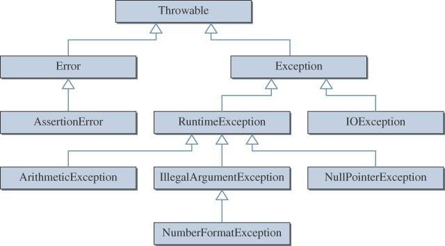
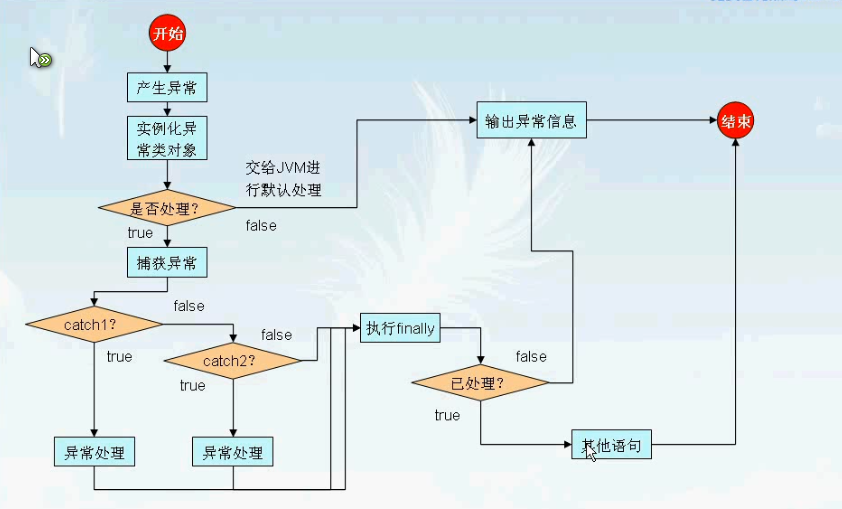

# 面向对象之异常处理

## 概述
- Java异常是Java提供的一种识别及响应错误的一致性机制。
- Java异常机制可以使程序中异常处理代码和正常业务代码分离，保证程序代码更加优雅，并提高程序健壮性。
- 在有效使用异常的情况下，异常能清晰的回答what, where, why这3个问题：
    - **异常类型** -->"什么"被抛出;
    - **异常堆栈跟踪** -->"在哪"抛出;
    - **异常信息** -->"为什么"会抛出;

##Throwable类



　　Throwable是 Java 语言中所有错误或异常的超类。
Throwable包含两个子类: Error 和 Exception。它们通常用于指示发生了异常情况。
　　Throwable包含了其线程创建时线程执行堆栈的快照，它提供了printStackTrace()等接口用于获取堆栈跟踪数据等信息。
### Exception
　　Exception及其子类是 Throwable 的一种形式，它指出了合理的应用程序想要捕获的条件。
### RuntimeException 
　　RuntimeException是那些可能在 Java 虚拟机正常运行期间抛出的异常的超类。
　　编译器不会检查RuntimeException异常。例如，除数为零时，抛出ArithmeticException异常。RuntimeException是ArithmeticException的超类。当代码发生除数为零的情况时，倘若既"没有通过throws声明抛出ArithmeticException异常"，也"没有通过try...catch...处理该异常"，也能通过编译。这就是我们所说的"编译器不会检查RuntimeException异常"！
　　如果代码会产生RuntimeException异常，则需要通过修改代码进行避免。例如，若会发生除数为零的情况，则需要通过代码避免该情况的发生！
### Error
　　和Exception一样，Error也是Throwable的子类。它用于指示合理的应用程序不应该试图捕获的严重问题，大多数这样的错误都是异常条件。
　　和RuntimeException一样，编译器也不会检查Error。


##  异常分类(Exception):
Java将可抛出(Throwable)的结构分为三种类型：
1. 被检查的异常(CheckedException)
2. 运行时异常(RuntimeException)
3. 错误(Error)
### **运行时异常**
- 定义: 
    RuntimeException及其子类都被称为运行时异常。
- 特点: 
    Java编译器不会检查它。也就是说，当程序中可能出现这类异常时，倘若既"没有通过throws声明抛出它"，也"没有用try-catch语句捕获它"，还是会编译通过。例如，除数为零时产生的ArithmeticException异常，数组越界时产生的IndexOutOfBoundsException异常，fail-fail机制产生的ConcurrentModificationException异常等，都属于运行时异常。
　　虽然Java编译器不会检查运行时异常，但是我们也可以通过throws进行声明抛出，也可以通过try-catch对它进行捕获处理。
　　如果产生运行时异常，则需要通过修改代码来进行避免。例如，若会发生除数为零的情况，则需要通过代码避免该情况的发生！
### **被检查的异常**(编译期异常)
- 定义: 
    Exception类本身，以及Exception的子类中除了"运行时异常"之外的其它子类都属于被检查异常。
- 特点: 
    Java编译器会检查它。此类异常，要么通过throws进行声明抛出，要么通过try-catch进行捕获处理，否则不能通过编译。例如，CloneNotSupportedException就属于被检查异常。当通过clone()接口去克隆一个对象，而该对象对应的类没有实现Cloneable接口，就会抛出CloneNotSupportedException异常。
　　被检查异常通常都是可以恢复的。
### **错误**
- 定义: 
Error类及其子类。
- 特点: 
和运行时异常一样，编译器也不会对错误进行检查。
　　当资源不足、约束失败、或是其它程序无法继续运行的条件发生时，就产生错误。程序本身无法修复这些错误的。例如，VirtualMachineError就属于错误。
　　按照Java惯例，我们是不应该实现任何新的Error子类的！
对于上面的3种结构，我们在抛出异常或错误时，到底该哪一种？《Effective Java》中给出的建议是：
>**对于可以恢复的条件使用被检查异常，对于程序错误使用运行时异常**。


## 异常处理关键字

- **try** --> 用于监听。将要被监听的代码(可能抛出异常的代码)放在try语句块之内，当try语句块内发生异常时，异常就被抛出。
- **catch** --> 用于捕获异常。catch用来捕获try语句块中发生的异常。
- **finally** --> finally语句块总是会被执行。它主要用于回收在try块里打开的物力资源(如数据库连接、网络连接和磁盘文件)。只有finally块，执行完成之后，才会回来执行try或者catch块中的return或者throw语句，如果finally中使用了return或者throw等终止方法的语句，则就不会跳回执行，直接停止。
>finalize()是Object类的一个方法,用来回收没有被引用的对象,被GC调用;
- **throw** --> 用于抛出异常。
- **throws** --> 用在方法签名中，用于声明该方法可能抛出的异常。

## 异常的控制流程
在java中,异常是被一个方法抛出的对象.当一个方法抛出异常时,该方法从调用栈中被弹出,同时把产生的异常的对象抛给栈中的钱一个方法.


### 异常处理
- 捕获这个异常,不然它沿着调用栈继续向下抛出
- 捕获这个异常,并继续向下抛出
- 不捕获这个异常,从而导致方法从调用栈中被弹出,异常对象继续抛出给调用栈的下面的方法
- Try程序块里面的语句是按顺序执行的语句
- 当try程序块里面的语句抛出一个异常的时候，程序的控制转向了相匹配的catch程序块，catch程序块里面的语句被执行。
- 当异常发生后，程序执行将忽略try程序块中剩余的语句，继续执行程序块后面的语句。
- 如果在try程序块中没有抛出异常，那么catch块将被忽略。程序将继续执行try-catch下面的语句
- 在一个try-catch语句中，当有多个catch块的时候，它们被顺序检查
- 在检查过程中，注意异常的匹配关系是很重要的
- 当一个异常被抛出，与它相匹配的catch块被执行，其它的catch块，就被忽略掉不再执行
- 如果没有catch块匹配抛出的异常，那么系统会在堆栈中搜索，找到一个匹配的捕获方法。
- 如果仍然没有找到，那么系统将处理抛出异常
- 即使在try程序块内部有一个return语句，finally语句块也要被执行
- 当在try程序块中，遇到return语句，finally块中的语句在方法返回之前被执行

## 异常处理流程
1. 如果程序产生了异常,那么会自动的由JVM根据异常的类型,实例化一个指定异常类的对象;
2. 如果没有处理异常的操作,
    - 就交给JVM默认处理-->输出异常信息
3. 如果有异常处理,
    - 则由try语句捕获异常类对象;
    - 然后匹配后面的catch语句,
        - 如果成功,则使用指定的处理语句
        - 如果都不匹配,则由JVM默认处理
4. 不管是否有异常,都会执行finally语句,如果没有异常,执行完finally,则会继续执行之后的其他语句;如果此时有异常没有处理(没有catch匹配),那么拽会执行finally语句,但是执行完finally后,将默认交给JVM进行异常的输出,并且程序中断.



## 异常的抛出
### **throws**
一个完整的方法声明:
`访问修饰符 可选修饰符 返回类型 方法名(参数列表) throws 异常类型`
作用:

- 通知本方法的调用者,本方法**有可能**有某种或几种类型的异常
- 子类重写的方法不能抛出比父类更多(范围)的异常;

3种类:
- 表示层类:主要负责UI的,跟用户打交道,放在最外面的一层;
- 业务层类:处理表示层接受到的数据;
- 持久层类:存储数据;

### **throw** 
抛出异常对象 
throw new 异常类();
执行到throw时一定会有异常的抛出,就会执行异常抛出执行流程

## 自定义异常类
- 继承 Exception 类;
- 重载Exception的构造方法,一般都是构造3个带参构造方法;  
    - 目的是把其他异常的信息封装到自定义异常信息中;
    - 自定义需要的业务上的异常欣喜;
- 添加自定义异常的特有方法;
    - 大概思路:
        - 新定义一个异常类,继承Exception类
        - 在B内中的方法中声明抛出自定义异常
        - 在B方法内会出现异常的语句用try - catch 包起来
        - 在catch语句中throw new 自定义异常类名(参数列表);
        - 如果 A 类是 B 类的方法的调用者,如果不处理异常,必须在方法中声明 throws 自定义异常类名 
        - 如果mian方法是A的调用者,如果不抛出异常,就必须处理这个异常;
        - 如果抛出异常,可以不处理,交给JVM处理;


----

## finally 关键字
```java
public classTest {
    public static void main (String[] args) {
        System.out.println (new Test().test() );
    }
    static int test() {
        int x = 1;
        try {
            return x;
        }
        finally {
            ++x;
        }
    }
}
```

::: tip 输出:
1
:::

```java
public class smallT {
    public static void main (String args[]) {
        smallT t = new smallT();
        int b = t.get();
        System.out.println (b);
    }

    public int get() {
        try {
            return 1 ;
        }
        finally {
            return 2 ;
        }
    }
}
```

::: tip 输出:
2
:::

```java
public classTest {
    public static voidmain (String[] args) {
        System.out.println (newTest().test() );;
    }
    int test() {
        try {
            return func1();
        }
        finally {
            return func2();
        }
    }
    int func1() {
        System.out.println ("func1");
        return 1;
    }
    int func2() {
        System.out.println ("func2");
        return 2;
    }
}
```

::: tip 输出:
func1
func2
2
:::

--------

