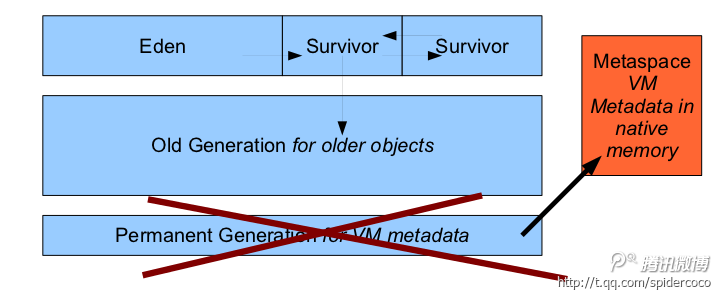

# Java 8 的元空间

Java 6 中的堆结构是这样的：

### 持久代

持久代中包含了虚拟机中所有可通过反射获取到的数据，比如 Class 和 Method 对象。不同的 Java 虚拟机之间可能会进行类共享，因此持久代又分为只读区和读写区。

JVM 用于描述应用程序中用到的类和方法的元数据也存储在持久代中。JVM 运行时会用到多少持久代的空间取决于应用程序用到了多少类。除此之外，Java SE 库中的类和方法也都存储在这里。

如果 JVM 发现有的类已经不再需要了，它会去回收（卸载）这些类，将它们的空间释放出来给其它类使用。Full GC 会进行持久代的回收。

* JVM 中类的元数据在 Java 堆中的存储区域。
* Java 类对应的 HotSpot 虚拟机中的内部表示也存储在这里。
* 类的层级信息，字段，名字。
* 方法的编译信息及字节码。
* 变量
* 常量池和符号解析

#### 持久代的大小

* 它的上限是 MaxPermSize，默认是 64M
* Java 堆中的连续区域 : 如果存储在非连续的堆空间中的话，要定位出持久代到新对象的引用非常复杂并且耗时。卡表（card table），是一种记忆集（Remembered Set），它用来记录某个内存代中普通对象指针（oops）的修改。
* 持久代用完后，会抛出 OutOfMemoryError "PermGen space" 异常。解决方案：应用程序清理引用来触发类卸载；增加 MaxPermSize 的大小。
* 需要多大的持久代空间取决于类的数量，方法的大小，以及常量池的大小。

#### 为什么移除持久代

* 它的大小是在启动时固定好的——很难进行调优。-XX:MaxPermSize，设置成多少好呢？
* HotSpot 的内部类型也是 Java 对象：它可能会在 Full GC 中被移动，同时它对应用不透明，且是非强类型的，难以跟踪调试，还需要存储元数据的元数据信息（meta-metadata）。
* 简化 Full GC：每一个回收器有专门的元数据迭代器。
* 可以在 GC 不进行暂停的情况下并发地释放类数据。
* 使得原来受限于持久代的一些改进未来有可能实现

#### 那么 JVM 的元数据都去哪儿了？

### 元空间 (metaspace)

持久代的空间被彻底地删除了，它被一个叫元空间的区域所替代了。持久代删除了之后，很明显，JVM 会忽略 PermSize 和 MaxPermSize 这两个参数，还有就是你再也看不到 java.lang.OutOfMemoryError: PermGen error 的异常了。

JDK 8 的 HotSpot JVM 现在使用的是本地内存来表示类的元数据，这个区域就叫做元空间。

元空间的特点：

* 充分利用了 Java 语言规范中的好处：类及相关的元数据的生命周期与类加载器的一致。
* 每个加载器有专门的存储空间
* 只进行线性分配
* 不会单独回收某个类
* 省掉了 GC 扫描及压缩的时间
* 元空间里的对象的位置是固定的
* 如果 GC 发现某个类加载器不再存活了，会把相关的空间整个回收掉

#### 元空间的内存分配模型

* 绝大多数的类元数据的空间都从本地内存中分配
* 用来描述类元数据的类也被删除了
* 分元数据分配了多个虚拟内存空间
* 给每个类加载器分配一个内存块的列表。块的大小取决于类加载器的类型; sun / 反射 / 代理对应的类加载器的块会小一些
* 归还内存块，释放内存块列表
* 一旦元空间的数据被清空了，虚拟内存的空间会被回收掉
* 减少碎片的策略

我们来看下 JVM 是如何给元数据分配虚拟内存的空间的

你可以看到虚拟内存空间是如何分配的 (vs1,vs2,vs3) ，以及类加载器的内存块是如何分配的。CL 是 Class Loader 的缩写。

#### 理解_mark 和_klass 指针

要想理解下面这张图，你得搞清楚这些指针都是什么东西。

JVM 中，每个对象都有一个指向它自身类的指针，不过这个指针只是指向具体的实现类，而不是接口或者抽象类。

对于 32 位的 JVM:

_mark : 4 字节常量

_klass: 指向类的 4 字节指针 对象的内存布局中的第二个字段 (_klass，在 32 位 JVM 中，相对对象在内存中的位置的偏移量是 4，64 位的是 8) 指向的是内存中对象的类定义。

64 位的 JVM：

_mark : 8 字节常量

_klass: 指向类的 8 字节的指针

开启了指针压缩的 64 位 JVM： _mark : 8 字节常量

_klass: 指向类的 4 字节的指针

#### Java 对象的内存布局

类指针压缩空间（Compressed Class Pointer Space）

只有是 64 位平台上启用了类指针压缩才会存在这个区域。对于 64 位平台，为了压缩 JVM 对象中的_klass 指针的大小，引入了类指针压缩空间（Compressed Class Pointer Space）。

压缩指针后的内存布局

指针压缩概要

* 64 位平台上默认打开
* 使用 - XX:+UseCompressedOops 压缩对象指针 "oops" 指的是普通对象指针 ("ordinary" object pointers)。 Java 堆中对象指针会被压缩成 32 位。 使用堆基地址（如果堆在低 26G 内存中的话，基地址为 0）

* 使用 - XX:+UseCompressedClassPointers 选项来压缩类指针

* 对象中指向类元数据的指针会被压缩成 32 位

* 类指针压缩空间会有一个基地址

#### 元空间和类指针压缩空间的区别

* 类指针压缩空间只包含类的元数据，比如 InstanceKlass, ArrayKlass 仅当打开了 UseCompressedClassPointers 选项才生效 为了提高性能，Java 中的虚方法表也存放到这里 这里到底存放哪些元数据的类型，目前仍在减少

* 元空间包含类的其它比较大的元数据，比如方法，字节码，常量池等。

### 元空间的调优

使用 - XX:MaxMetaspaceSize 参数可以设置元空间的最大值，默认是没有上限的，也就是说你的系统内存上限是多少它就是多少。-XX:MetaspaceSize 选项指定的是元空间的初始大小，如果没有指定的话，元空间会根据应用程序运行时的需要动态地调整大小。

#### MaxMetaspaceSize 的调优

* -XX:MaxMetaspaceSize={unlimited}
* 元空间的大小受限于你机器的内存
* 限制类的元数据使用的内存大小，以免出现虚拟内存切换以及本地内存分配失败。如果怀疑有类加载器出现泄露，应当使用这个参数；32 位机器上，如果地址空间可能会被耗尽，也应当设置这个参数。
* 元空间的初始大小是 21M——这是 GC 的初始的高水位线，超过这个大小会进行 Full GC 来进行类的回收。
* 如果启动后 GC 过于频繁，请将该值设置得大一些
* 可以设置成和持久代一样的大小，以便推迟 GC 的执行时间

#### CompressedClassSpaceSize 的调优

* 只有当 - XX:+UseCompressedClassPointers 开启了才有效
* -XX:CompressedClassSpaceSize=1G
* 由于这个大小在启动的时候就固定了的，因此最好设置得大点。
* 没有使用到的话不要进行设置
* JVM 后续可能会让这个区可以动态的增长。不需要是连续的区域，只要从基地址可达就行；可能会将更多的类元信息放回到元空间中；未来会基于 PredictedLoadedClassCount 的值来自动的设置该空间的大小

#### 元空间的一些工具

* jmap -permstat 改成了 jmap -clstats。它用来打印 Java 堆的类加载器的统计数据。对每一个类加载器，会输出它的名字，是否存活，地址，父类加载器，以及它已经加载的类的数量及大小。除此之外，驻留的字符串（intern）的数量及大小也会打印出来。
* jstat -gc，这个命令输出的是元空间的信息而非持久代的
* jcmd GC.class_stats 提供类元数据大小的详细信息。使用这个功能启动程序时需要加上 - XX:+UnlockDiagnosticVMOptions 选项。

#### 提高 GC 的性能

如果你理解了元空间的概念，很容易发现 GC 的性能得到了提升。

* Full GC 中，元数据指向元数据的那些指针都不用再扫描了。很多复杂的元数据扫描的代码（尤其是 CMS 里面的那些）都删除了。
* 元空间只有少量的指针指向 Java 堆。这包括：类的元数据中指向 java/lang/Class 实例的指针; 数组类的元数据中，指向 java/lang/Class 集合的指针。
* 没有元数据压缩的开销
* 减少了根对象的扫描（不再扫描虚拟机里面的已加载类的字典以及其它的内部哈希表）
* 减少了 Full GC 的时间
* G1 回收器中，并发标记阶段完成后可以进行类的卸载

#### 总结

* Hotspot 中的元数据现在存储到了元空间里。mmap 中的内存块的生命周期与类加载器的一致。
* 类指针压缩空间（Compressed class pointer space）目前仍然是固定大小的，但它的空间较大
* 可以进行参数的调优，不过这不是必需的。
* 未来可能会增加其它的优化及新特性。比如， 应用程序类数据共享；新生代 GC 优化，G1 回收器进行类的回收；减少元数据的大小，以及 JVM 内部对象的内存占用量。

