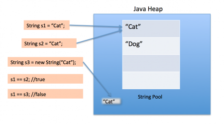
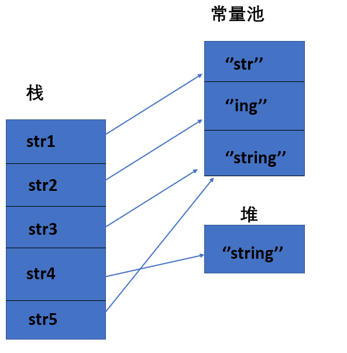

# String 类和常量池

**String 对象的两种创建方式：**

```java
String str1 = "abcd";//先检查字符串常量池中有没有"abcd"，如果字符串常量池中没有，则创建一个，然后 str1 指向字符串常量池中的对象，如果有，则直接将 str1 指向"abcd""；
String str2 = new String("abcd");//堆中创建一个新的对象
String str3 = new String("abcd");//堆中创建一个新的对象
System.out.println(str1==str2);//false
System.out.println(str2==str3);//false
```

这两种不同的创建方法是有差别的。

- 第一种方式是在常量池中拿对象；
- 第二种方式是直接在堆内存空间创建一个新的对象。

记住一点：**只要使用 new 方法，便需要创建新的对象。**

再给大家一个图应该更容易理解



**String 类型的常量池比较特殊。它的主要使用方法有两种：**

- 直接使用双引号声明出来的 String 对象会直接存储在常量池中。
- 如果不是用双引号声明的 String 对象，可以使用 String 提供的 intern 方法。String.intern() 是一个 Native 方法，它的作用是：如果运行时常量池中已经包含一个等于此 String 对象内容的字符串，则返回常量池中该字符串的引用；如果没有，则在常量池中创建与此 String 内容相同的字符串，并返回常量池中创建的字符串的引用。

```java
String s1 = new String("计算机");
String s2 = s1.intern();
String s3 = "计算机";
System.out.println(s2);//计算机
System.out.println(s1 == s2);//false，因为一个是堆内存中的 String 对象一个是常量池中的 String 对象，
System.out.println(s3 == s2);//true，因为两个都是常量池中的 String 对象
```

**字符串拼接:**

```java
String str1 = "str";
String str2 = "ing";

String str3 = "str" + "ing";//常量池中的对象
String str4 = str1 + str2; //在堆上创建的新的对象	  
String str5 = "string";//常量池中的对象
System.out.println(str3 == str4);//false
System.out.println(str3 == str5);//true
System.out.println(str4 == str5);//false
```



尽量避免多个字符串拼接，因为这样会重新创建对象。如果需要改变字符串的话，可以使用 StringBuilder 或者 StringBuffer。

## String s1 = new String("abc")

**将创建 1 或 2 个字符串。如果池中已存在字符串文字“abc”，则池中只会创建一个字符串“s1”。如果池中没有字符串文字“abc”，那么它将首先在池中创建，然后在堆空间中创建，因此将创建总共 2 个字符串对象。**

**验证：**

```java
String s1 = new String("abc");// 堆内存的地址值
String s2 = "abc";
System.out.println(s1 == s2);// 输出 false,因为一个是堆内存，一个是常量池的内存，故两者是不同的。
System.out.println(s1.equals(s2));// 输出 true
```

**结果：**

```
false
true
```

## 8 种基本类型的包装类和常量池

- **Java 基本类型的包装类的大部分都实现了常量池技术，即 Byte,Short,Integer,Long,Character,Boolean；这 5 种包装类默认创建了数值[-128，127] 的相应类型的缓存数据，但是超出此范围仍然会去创建新的对象。**
- **两种浮点数类型的包装类 Float,Double 并没有实现常量池技术。**

```java
Integer i1 = 33;
Integer i2 = 33;
System.out.println(i1 == i2);// 输出 true
Integer i11 = 333;
Integer i22 = 333;
System.out.println(i11 == i22);// 输出 false
Double i3 = 1.2;
Double i4 = 1.2;
System.out.println(i3 == i4);// 输出 false
```

**Integer 缓存源代码：**

```java
/**
 *此方法将始终缓存-128 到 127（包括端点）范围内的值，并可以缓存此范围之外的其他值。
 */
public static Integer valueOf(int i) {
    if (i >= IntegerCache.low && i <= IntegerCache.high)
        return IntegerCache.cache[i + (-IntegerCache.low)];
    return new Integer(i);
}
```

**应用场景：**

1. Integer i1=40；Java 在编译的时候会直接将代码封装成 Integer i1=Integer.valueOf(40);，从而使用常量池中的对象。
2. Integer i1 = new Integer(40);这种情况下会创建新的对象。

```java
Integer i1 = 40;
Integer i2 = new Integer(40);
System.out.println(i1==i2);//输出 false
```

**Integer 比较更丰富的一个例子:**

```java
Integer i1 = 40;
Integer i2 = 40;
Integer i3 = 0;
Integer i4 = new Integer(40);
Integer i5 = new Integer(40);
Integer i6 = new Integer(0);

System.out.println("i1=i2   " + (i1 == i2));
System.out.println("i1=i2+i3   " + (i1 == i2 + i3));
System.out.println("i1=i4   " + (i1 == i4));
System.out.println("i4=i5   " + (i4 == i5));
System.out.println("i4=i5+i6   " + (i4 == i5 + i6));   
System.out.println("40=i5+i6   " + (40 == i5 + i6));     
```

结果：

```java
i1=i2       true
i1=i2+i3    true
i1=i4       false
i4=i5       false
i4=i5+i6    true
40=i5+i6    true
```

解释：

语句 i4 == i5 + i6，因为+这个操作符不适用于 Integer 对象，首先 i5 和 i6 进行自动拆箱操作，进行数值相加，即 i4 == 40。然后 Integer 对象无法与数值进行直接比较，所以 i4 自动拆箱转为 int 值 40，最终这条语句转为 40 == 40 进行数值比较。