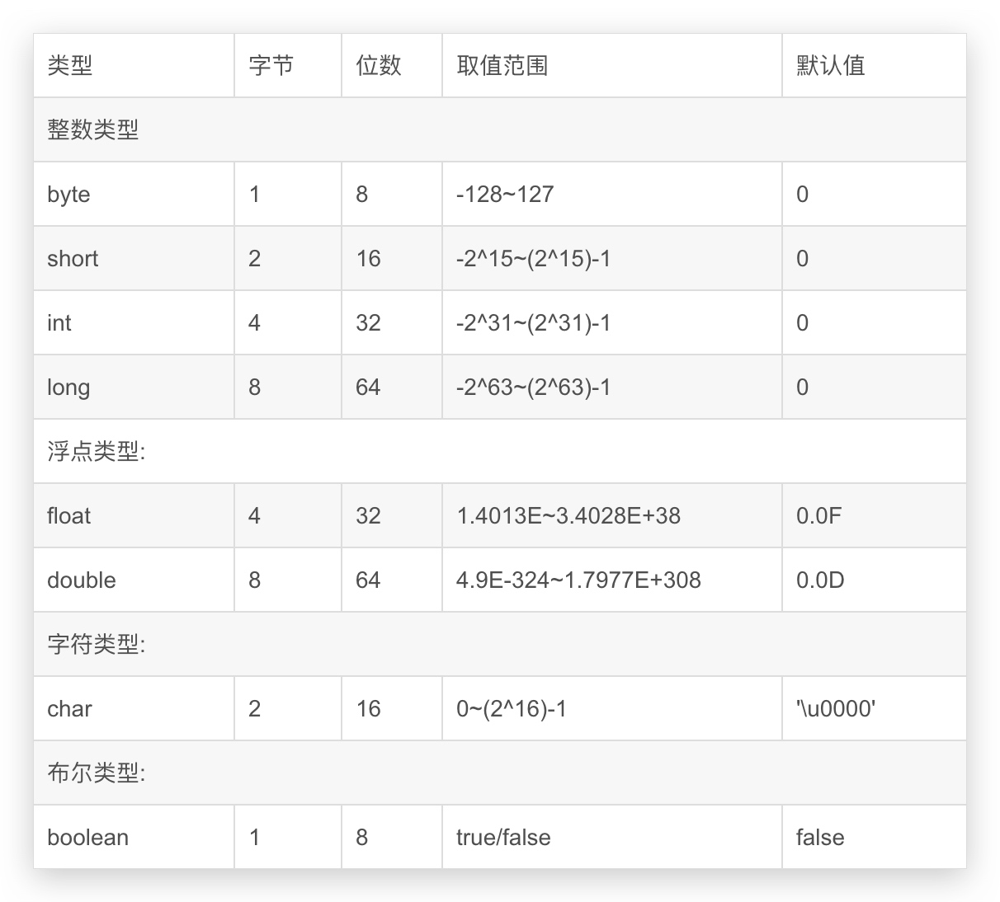
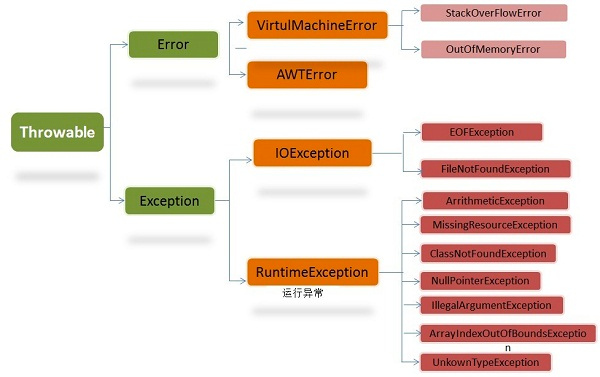

# Java SE 

[[toc]]

## 1. 什么是面向对象

### 1.1 面向对象和面向过程的区别

#### 面向过程

**优点**: 性能比面向对象高, 在面向对象中, 因为类调用时需要实例化, 开销比较大, 比较消耗资源; 

比如单片机, 嵌入式开发, Linux/Unix等一般采用面向过程开发, 性能是最重要的因素.

**缺点**: 没有面向对象易维护, 易复用, 易扩展  

#### 面向对象

**优点**: 易维护, 易复用, 易扩展, 由于面向对象有封装, 继承, 多态性的特性, 可以设计出低耦合的系统, 使系统更加灵活, 更加易于维护

**缺点**: 性能比面向过程低

### 1.2 面向对象的三大基本特征

#### [👉封装](./encapsulation.md)

封装把一个对象的属性私有化, 同时提供一些可以被外界访问的属性的方法, 如果属性不想被外界访问, 我们大可不必提供方法给外界访问.但是如果一个类没有提供给外界访问的方法, 那么这个类也没有什么意义了.

#### [👉继承](./inheritance.md)

继承是使用已存在的类的定义作为基础建立新类的技术, 新类的定义可以增加新的数据或新的功能, 也可以用父类的功能, 但不能选择性地继承父类.通过使用继承我们能够非常方便地复用以前的代码.

**关于继承如下 3 点请记住:**

1. 子类拥有父类非 private 的属性和方法.
2. 子类可以拥有自己属性和方法, 即子类可以对父类进行扩展.
3. 子类可以用自己的方式实现父类的方法.(以后介绍).

#### [👉多态](./polymorphism.md)

所谓多态就是指程序中定义的引用变量所指向的具体类型和通过该引用变量发出的方法调用在编程时并不确定, 而是在程序运行期间才确定, 即一个引用变量到底会指向哪个类的实例对象, 该引用变量发出的方法调用到底是哪个类中实现的方法, 必须在由程序运行期间才能决定.

在 Java 中有两种形式可以实现多态:继承(多个子类对同一方法的重写)和接口(实现接口并覆盖接口中同一方法).

### 1.3 五大基本原则

#### 单一职责原则(SRP)

　　一个类应该有且只有一个去改变它的理由, 这意味着一个类应该只有一项工作.

　　比如在职员类里, 将工程师, 销售人员, 销售经理这些情况都放在职员类里考虑, 其结果将会非常混乱, 在这个假设下, 职员类里的每个方法都要if else判断是哪种情况, 从类结构上来说将会十分臃肿.

#### 开放封闭原则(OCP)

　　对象或实体应该对扩展开放, 对修改封闭.

　　更改封闭即是在我们对模块进行扩展时, 勿需对源有程序代码和DLL进行修改或重新编译文件! 这个原则对我们在设计类的时候很有帮助, 坚持这个原则就必须尽量考虑接口封装, 抽象机制和多态技术! 

#### 里氏替换原则(LSP)

　　在对象 x 为类型 T 时 q(x) 成立, 那么当 S 是 T 的子类时, 对象 y 为类型 S 时 q(y) 也应成立.(即对父类的调用同样适用于子类)

#### 依赖倒置原则(DIP)

　　高层次的模块不应该依赖于低层次的模块, 他们都应该依赖于抽象.具体实现应该依赖于抽象, 而不是抽象依赖于实现.

　　可以这样理解, 上面我举例子的时候先说了兔子和绵羊, 然后才推出食草动物.但如果我们继续认识了牛, 马等食草动物, 我们会发现我们需要不断调整食草动物的描述, 这样程序会变得僵化, 所以我们不应该让子类依赖于实体, 不应该让父类模块依赖于子类模块.所以我们需要将食草动物设计为抽象类, 即**抽象类或接口**.这样下层只需要实现相应的细节而不会影响父类.

#### 接口隔离原则(ISP)

　　不应强迫客户端实现一个它用不上的接口, 或是说客户端不应该被迫依赖它们不使用的方法, 使用多个专门的接口比使用单个接口要好的多! 

　　比如, 为了减少接口的定义, 将许多类似的方法都放在一个接口中, 最后会发现, 维护和实现接口的时候花了太多精力, 而接口所定义的操作相当于对客户端的一种承诺, 这种承诺当然是越少越好, 越精练越好, 过多的承诺带来的就是你的大量精力和时间去维护! 

## 2. Java 语言有哪些特点

1. 简单易学; 
2. 面向对象(封装, 继承, 多态); 
3. 平台无关性( Java 虚拟机实现平台无关性); 
4. 可靠性; 
5. 安全性; 
6. 支持多线程( C++ 语言没有内置的多线程机制, 因此必须调用操作系统的多线程功能来进行多线程程序设计, 而 Java 语言却提供了多线程支持); 
7. 支持网络编程并且很方便( Java 语言诞生本身就是为简化网络编程设计的, 因此 Java 语言不仅支持网络编程而且很方便); 
8. 编译与解释并存; 

## 3. Java 如何实现的平台无关

Java 经过编译之后生成的 .class 的[👉字节码](../jvm/class.md)文件, 运行平台上只要有JVM就能运行, 不需要进行再次编译

## 4. JVM 还支持哪些语言

1. kotlin
2. Scala
3. Clojure
4. Groovy
5. Jython
6. JRuby
7. Ceylon
8. Eta
9. Haxe

## 5. [👉接口和抽象类的区别](./abstract_interface.md)

1. 接口的方法默认是 public, 所有方法在接口中不能有实现(Java 8 开始接口方法可以有默认实现), 抽象类可以有非抽象的方法
2. 接口中的实例变量默认是 final 类型的, 而抽象类中则不一定 
3. 一个类可以实现多个接口, 但最多只能实现一个抽象类 
4. 一个类实现接口的话要实现接口的所有方法, 而抽象类不一定 
5. 接口不能用 new 实例化, 但可以声明, 但是必须引用一个实现该接口的对象 从设计层面来说, 抽象是对类的抽象, 是一种模板设计, 接口是行为的抽象, 是一种行为的规范.

备注:在 JDK8 中, 接口也可以定义静态方法, 可以直接用接口名调用.实现类和实现是不可以调用的.如果同时实现两个接口, 接口中定义了一样的默认方法, 必须重写, 不然会报错.(详见issue:[👉https://github.com/Snailclimb/JavaGuide/issues/146](https://github.com/Snailclimb/JavaGuide/issues/146))

## 6. JVM JDK 和 JRE 的区别

### JVM

Java虚拟机(JVM)是运行 Java 字节码的虚拟机.JVM有针对不同系统的特定实现(Windows, Linux, macOS), 目的是使用相同的字节码, 它们都会给出相同的结果.

**Java 程序从源代码到运行一般有下面3步:**


我们需要格外注意的是 .class->机器码 这一步.在这一步 jvm 类加载器首先加载字节码文件, 然后通过解释器逐行解释执行, 这种方式的执行速度会相对比较慢.而且, 有些方法和代码块是经常需要被调用的, 也就是所谓的热点代码, 所以后面引进了 **JIT 编译器**, JIT 属于**运行时**编译.当 JIT 编译器完成第一次编译后, 其会将字节码对应的机器码保存下来, 下次可以直接使用.而我们知道, 机器码的运行效率肯定是高于 Java 解释器的.这也解释了我们为什么经常会说 Java 是编译与解释共存的语言.

::: tip
HotSpot采用了惰性评估(Lazy Evaluation)的做法, 根据二八定律, 消耗大部分系统资源的只有那一小部分的代码(热点代码), 而这也就是JIT所需要编译的部分.JVM会根据代码每次被执行的情况收集信息并相应地做出一些优化, 因此执行的次数越多, 它的速度就越快.JDK 9引入了一种新的编译模式AOT(Ahead of Time Compilation), 它是直接将字节码编译成机器码, 这样就避免了JIT预热等各方面的开销.JDK支持分层编译和AOT协作使用.但是 , AOT 编译器的编译质量是肯定比不上 JIT 编译器的.
:::

总结:Java虚拟机(JVM)是运行 Java 字节码的虚拟机.JVM有针对不同系统的特定实现(Windows, Linux, macOS), 目的是使用相同的字节码, 它们都会给出相同的结果.字节码和不同系统的 JVM  实现是 Java 语言"一次编译, 随处可以运行"的关键所在. 

### JDK 和 JRE

JDK是Java Development Kit, 它是功能齐全的Java SDK.它拥有JRE所拥有的一切, 还有编译器(javac)和工具(如javadoc和jdb).它能够创建和编译程序.

JRE 是 Java运行时环境.它是运行已编译 Java 程序所需的所有内容的集合, 包括 Java虚拟机(JVM), Java类库, java命令和其他的一些基础构件.但是, 它不能用于创建新程序.

如果你只是为了运行一下 Java 程序的话, 那么你只需要安装 JRE 就可以了.如果你需要进行一些 Java 编程方面的工作, 那么你就需要安装JDK了.但是, 这不是绝对的.有时, 即使您不打算在计算机上进行任何Java开发, 仍然需要安装JDK.例如, 如果要使用JSP部署Web应用程序, 那么从技术上讲, 您只是在应用程序服务器中运行Java程序.那你为什么需要JDK呢? 因为应用程序服务器会将 JSP 转换为 Java servlet, 并且需要使用 JDK 来编译 servlet.

## 7. 什么是字节码, 采用字节码的最大好处是什么

::: tip
在 Java 中, JVM可以理解的代码就叫做`字节码`(即扩展名为 `.class` 的文件), 它不面向任何特定的处理器, 只面向虚拟机.Java 语言通过字节码的方式, 在一定程度上解决了传统解释型语言执行效率低的问题, 同时又保留了解释型语言可移植的特点.
所以 Java 程序运行时比较高效, 而且由于字节码并不专对一种特定的机器, 因此Java程序无须重新编译便可在多种不同的计算机上运行.
:::

**先看下java中的编译器和解释器:** 　　

Java中引入了虚拟机的概念, 即在机器和编译程序之间加入了一层抽象的虚拟的机器.
这台虚拟的机器在任何平台上都提供给编译程序一个的共同的接口.
编译程序只需要面向虚拟机, 生成虚拟机能够理解的代码, 然后由解释器来将虚拟机代码转换为特定系统的机器码执行.
在Java中, 这种供虚拟机理解的代码叫做`字节码` (即扩展名为`.class`的文件) , 它不面向任何特定的处理器, 只面向虚拟机.每一种平台的解释器是不同的, 但是实现的虚拟机是相同的.
Java源程序经过编译器编译后变成字节码, 字节码由虚拟机解释执行, 虚拟机将每一条要执行的字节码送给解释器, 解释器将其翻译成特定机器上的机器码, 然后在特定的机器上运行.
这也就是解释了Java的编译与解释并存的特点.

Java源代码---->编译器---->jvm可执行的Java字节码(即虚拟指令)---->jvm---->jvm中解释器----->机器可执行的二进制机器码---->程序运行. 

**采用字节码的好处:** 　　

Java 语言通过字节码的方式, 在一定程度上解决了传统解释型语言执行效率低的问题, 同时又保留了解释型语言可移植的特点.所以Java程序运行时比较高效, 而且, 由于字节码并不专对一种特定的机器, 因此, Java程序无须重新编译便可在多种不同的计算机上运行.

## 8. Oracle JDK 和 OpenJDK 的对比

可能在看这个问题之前很多人和我一样并没有接触和使用过  OpenJDK .那么Oracle和OpenJDK之间是否存在重大差异? 下面通过我通过我收集到一些资料对你解答这个被很多人忽视的问题.

对于Java 7, 没什么关键的地方.OpenJDK项目主要基于Sun捐赠的HotSpot源代码.此外, OpenJDK被选为Java 7的参考实现, 由Oracle工程师维护.关于JVM, JDK, JRE和OpenJDK之间的区别, Oracle博客帖子在2012年有一个更详细的答案:

::: tip OpenJDK存储库中的源代码与用于构建Oracle JDK的代码之间的区别
**非常接近**

Oracle JDK 版本构建过程基于 OpenJDK 7 构建, 只添加了几个部分, 例如部署代码, 其中包括 Oracle 的 Java 插件和 Java WebStart 的实现, 以及一些封闭的源代码派对组件, 如图形光栅化器, 一些开源的第三方组件, 如 Rhino, 以及一些零碎的东西, 如附加文档或第三方字体.展望未来, 我们的目的是开源 Oracle JDK 的所有部分, 除了我们考虑商业功能的部分.
:::

总结:

1. Oracle JDK版本将每三年发布一次, 而OpenJDK版本每三个月发布一次; 
2. OpenJDK 是一个参考模型并且是完全开源的, 而Oracle JDK是OpenJDK的一个实现, 并不是完全开源的; 
3. Oracle JDK 比 OpenJDK 更稳定.OpenJDK和Oracle JDK的代码几乎相同, 但Oracle JDK有更多的类和一些错误修复.因此, 如果您想开发企业/商业软件, 我建议您选择Oracle JDK, 因为它经过了彻底的测试和稳定.某些情况下, 有些人提到在使用OpenJDK 可能会遇到了许多应用程序崩溃的问题, 但是, 只需切换到Oracle JDK就可以解决问题; 
4. 在响应性和JVM性能方面, Oracle JDK与OpenJDK相比提供了更好的性能; 
5. Oracle JDK不会为即将发布的版本提供长期支持, 用户每次都必须通过更新到最新版本获得支持来获取最新版本; 
6. Oracle JDK根据二进制代码许可协议获得许可, 而OpenJDK根据GPL v2许可获得许可.

## 9. Java 和 C++ 的区别

我知道很多人没学过 C++, 但是面试官就是没事喜欢拿咱们 Java 和 C++ 比呀! 没办法! ! ! 就算没学过C++, 也要记下来! 

- 都是面向对象的语言, 都支持封装, 继承和多态
- Java 不提供指针来直接访问内存, 程序内存更加安全
- Java 的类是单继承的, C++ 支持多重继承; 虽然 Java 的类不可以多继承, 但是接口可以多继承.
- Java 有自动内存管理机制, 不需要程序员手动释放无用内存

## 10. 什么是 Java 程序的主类 应用程序和小程序的主类有何不同

一个程序中可以有多个类, 但只能有一个类是主类.在 Java 应用程序中, 这个主类是指包含 main()方法的类.而在 Java 小程序中, 这个主类是一个继承自系统类 JApplet 或 Applet 的子类.应用程序的主类不一定要求是 public 类, 但小程序的主类要求必须是 public 类.主类是 Java 程序执行的入口点.

## 11. Java 应用程序与小程序之间有那些差别

简单说应用程序是从主线程启动(也就是 main() 方法).applet 小程序没有main方法, 主要是嵌在浏览器页面上运行(调用init()线程或者run()来启动), 嵌入浏览器这点跟 flash 的小游戏类似.

## 12. import java 和 javax 的区别

刚开始的时候 JavaAPI 所必需的包是 java 开头的包, javax 当时只是扩展 API 包来说使用.然而随着时间的推移, javax 逐渐的扩展成为 Java API 的组成部分.但是, 将扩展从 javax 包移动到 java 包将是太麻烦了, 最终会破坏一堆现有的代码.因此, 最终决定 javax 包将成为标准API的一部分.

所以, 实际上 java 和 javax 没有区别.这都是一个名字.

## 13. [👉为什么说 Java 中只有值传递](value_transfer.md)

**值传递和引用传递的区别**

|      | 值传递            | 引用传递           |
|:-----|:---------------|:---------------|
| 根本区别 | 会创建副本          | 不创建副本          |
| 所以   | 函数中**无法改变**原始值 | 函数中**可改变**原始对象 |

## 14. 重载和重写的区别

**[👉重载(Overload)](./encapsulation.md#方法的重载-Overload):** 

1. 发生在同一个类中, 方法名必须相同
2. 参数类型不同, 个数不同, 顺序不同
3. 方法返回值和访问修饰符可以不同
4. 发生在编译时. 　　

**[👉重写(Override)](./inheritance.md#重写-Override):**   

1. 发生在父子类中
2. 方法名, 参数列表必须相同
3. 返回值范围小于等于父类 
4. 抛出的异常范围小于等于父类
5. 访问修饰符范围大于等于父类
6. 如果父类方法访问修饰符为 private 则子类就不能重写该方法

## 15. 构造方法有哪些特性

1. 名字与类名相同; 
2. 没有返回值, 但不能用void声明构造函数; 
3. 生成类的对象时自动执行, 无需调用.

## 16. 构造器 Constructor 是否可被 override

在讲继承的时候我们就知道父类的私有属性和构造方法并不能被继承, 所以 Constructor 也就不能被 override(重写),但是可以 overload(重载),所以你可以看到一个类中有多个构造函数的情况.

## 17. 在 Java 中定义一个不做事且没有参数的构造方法的作用

Java 程序在执行子类的构造方法之前, 如果没有用 super() 来调用父类特定的构造方法, 则会调用父类中"没有参数的构造方法".因此, 如果父类中只定义了有参数的构造方法, 而在子类的构造方法中又没有用 super() 来调用父类中特定的构造方法, 则编译时将发生错误, 因为 Java 程序在父类中找不到没有参数的构造方法可供执行.解决办法是在父类里加上一个不做事且没有参数的构造方法.
　

## 18. 创建一个对象用什么运算符, 对象实体与对象引用有何不同

[👉创建对象的几种方式](./new_instance_way.md)

new 运算符, new 创建对象实例(对象实例在堆内存中), 对象引用指向对象实例(对象引用存放在栈内存中).一个对象引用可以指向0个或1个对象(一根绳子可以不系气球, 也可以系一个气球);一个对象可以有n个引用指向它(可以用n条绳子系住一个气球).

## 19. 在调用子类构造方法之前会先调用父类没有参数的构造方法, 其目的是什么

帮助子类做初始化工作.

## 20. 字符型常量和字符串常量的区别

1. 形式上: 字符常量是单引号引起的一个字符 字符串常量是双引号引起的若干个字符
2. 含义上: 字符常量相当于一个整形值( ASCII 值),可以参加表达式运算 字符串常量代表一个地址值(该字符串在内存中存放位置)
3. 占内存大小 字符常量只占2个字节 字符串常量占若干个字节(至少一个字符结束标志) (**注意: char在Java中占两个字节**)

::: tip Java 编程思想第四版:2.2.2节

:::

## 21. 成员变量与局部变量的区别

1. 从语法形式上, 看成员变量是属于类的, 而局部变量是在方法中定义的变量或是方法的参数; 成员变量可以被 public,private,static 等修饰符所修饰, 而局部变量不能被访问控制修饰符及 static 所修饰; 但是, 成员变量和局部变量都能被 final 所修饰; 
2. 从变量在内存中的存储方式来看, 成员变量是对象的一部分, 而对象存在于堆内存, 局部变量存在于栈内存
3. 从变量在内存中的生存时间上看, 成员变量是对象的一部分, 它随着对象的创建而存在, 而局部变量随着方法的调用而自动消失.
4. 成员变量如果没有被赋初值, 则会自动以类型的默认值而赋值(一种情况例外被 final 修饰的成员变量也必须显示地赋值); 而局部变量则不会自动赋值.

## 22. 什么是方法的返回值, 返回值在类的方法里的作用是什么

 方法的返回值是指我们获取到的某个方法体中的代码执行后产生的结果! (前提是该方法可能产生结果).返回值的作用:接收出结果, 使得它可以用于其他的操作! 

## 23. 一个类的构造方法的作用是什么 若一个类没有声明构造方法,该程序能正确执行吗, 为什么

主要作用是完成对类对象的初始化工作.可以执行.因为一个类即使没有声明构造方法也会有默认的不带参数的构造方法.

## 24. 静态方法和实例方法的区别

1. 在外部调用静态方法时, 可以使用"类名.方法名"的方式, 也可以使用"对象名.方法名"的方式.而实例方法只有后面这种方式.也就是说, 调用静态方法可以无需创建对象. 
2. 静态方法在访问本类的成员时, 只允许访问静态成员(即静态成员变量和静态方法), 而不允许访问实例成员变量和实例方法; 实例方法则无此限制.

## 25. 是否可以从一个 static 方法内部发出对非 static 方法的调用

不可以.因为非static方法是要与对象关联在一起的, 必须创建一个对象后, 才可以在该对象上进行方法调用, 而static方法调用时不需要创建对象, 可以直接调用.
也就是说, 当一个static方法被调用时, 可能还没有创建任何实例对象, 如果从一个static方法中发出对非static方法的调用, 那个非static方法是关联到哪个对象上的呢? 
这个逻辑无法成立, 所以, 一个static方法内部发出对非static方法的调用.

## 26. 静态变量和实例变量的区别
 
在语法定义上的区别:静态变量前要加static关键字, 而实例变量前则不加.
在程序运行时的区别:实例变量属于某个对象的属性, 必须创建了实例对象, 其中的实例变量才会被分配空间, 才能使用这个实例变量.静态变量不属于某个实例对象, 而是属于类, 所以也称为类变量, 只要程序加载了类的字节码, 不用创建任何实例对象, 静态变量就会被分配空间, 静态变量就可以被使用了.总之, 实例变量必须创建对象后才可以通过这个对象来使用, 静态变量则可以直接使用类名来引用.
例如, 对于下面的程序, 无论创建多少个实例对象, 永远都只分配了一个staticVar变量, 并且每创建一个实例对象, 这个staticVar就会加1; 但是, 每创建一个实例对象, 就会分配一个instanceVar, 即可能分配多个instanceVar, 并且每个instanceVar的值都只自加了1次.

```java
public class VariantTest{
    public static int staticVar = 0; 
    public int instanceVar = 0; 
    public VariantTest(){
        staticVar++;
        instanceVar++;
        System.out.println("staticVar=" + staticVar + ",instanceVar=" + instanceVar);
    }
}
```

## 27. [👉子类, 父类初始化顺序](./init_sequence.md)

1. 父类中静态成员变量和静态代码块
2. 子类中静态成员变量和静态代码块
3. 父类中普通成员变量和代码块
4. 父类的构造函数
5. 子类中普通成员变量和代码块
6. 子类的构造函数

## 28. 什么是内部类, 内部类的作用

[👉内部类](./inner_class.md)

## 29. 非静态内部类初始化方式

```java
Outer outer = new Outer();
outer.inner inner = outer.new Inner();
```

## 30. 静态内部类初始化方式

```java
Outer.Inner inner = new Outer.Inner();
```

## 31. 对象的相等与指向他们的引用相等,两者有什么不同

对象的相等, 比的是内存中存放的内容是否相等. 而引用相等, 比较的是他们指向的内存地址是否相等.

## 32. int char long 各占多少字节数



## 33. [👉什么是单精度和双精度](./float_double.md)

## 34. 为什么不能用浮点型表示金额

浮点类型会丢失精度

## 35. Java 中应该使用什么数据类型来代表价格

BigDecimal

## 36. 怎么将 byte 转换为 String

```java
byte[] bs1 = {97,98,100};
String s = new String(bs1);
```

## 37. 能将 int 强制转换为 byte 类型的变量, 如果该值大于 byte 类型的范围, 将会出现什么现象

可以强转, 但有可能发生数据溢出.

int 强转为 byte, 取低八位,其余丢掉.

然后 取反加一, 符号位不变

[👉原码, 反码, 补码](./computer_code.md)

## 38. 存在两个类, B 继承 A, C 继承 B, B 能不能转换为 C,  如 C = (C) B; 

可以

## 39. Java 中 ++ 操作符是线程安全的吗

如果只方法中使用, 则是安全的
如果是类成员, 就不是线程安全的操作.
它涉及到多个指令, 如读取变量值, 增加, 然后存储回内存, 这个过程可能会出现多个线程交差.

可使用 synchronized, AtomicInteger 保证线程安全

## 40. a = a + b 与 a += b 的区别

`a += b` 是先计算出 a 的值, 然后用一个 temp 对象存储, 之后和 b 进行相加, 然后将值赋值给 a 引用.
`a = a + b` 则是先计算 a + b, 然后再赋值给 a 引用, 给 a 引用的时候如果 引用 a 有计算过程, 则会再次计算.

`+=` 操作时, 如果两边的操作数的精度不一样时会**自动向下转换**
而 `a = a + b`则不会自动转化, 需要手动进行**强制类型转换**

## 41. short s1 = 1; s1 = s1 + 1;有什么错, short s1 = 1; s1 += 1;有什么错

对于 `short s1 = 1; s1 = s1 + 1;` 由于 `s1 + 1` 运算时会自动提升表达式的类型, 所以结果是int型, 再赋值给 short 类型 s1 时, 编译器将报告需要强制转换类型的错误.
对于 `short s1 = 1; s1 += 1;` 由于 += 是 Java 语言规定的运算符, java 编译器会对它进行特殊处理, 因此可以正确编译.

## 42. 我能在不进行强制转换的情况下将一个 double 值赋值给 long 类型的变量

不行

## 44. 3 * 0.1 == 0.3 将会返回什么, true 还是 false 

结果为 false 请看[👉原因](https://www.zhihu.com/question/56545018)

## 45. int 和 Integer 哪个会占用更多的内存

Integer 

## 46. [👉自动装箱与拆箱](./wrapper_class.md)

**装箱**:将基本类型用它们对应的引用类型包装起来; 

**拆箱**:将包装类型转换为基本数据类型; 

## 47. Object有哪些公用方法

**Object是所有类的父类, 任何类都默认继承Object**

**clone** 保护方法, 实现对象的浅复制, 只有实现了Cloneable接口才可以调用该方法, 否则抛出CloneNotSupportedException异常.

**equals** 在Object中与==是一样的, 子类一般需要重写该方法.

**hashCode** 该方法用于哈希查找, 重写了equals方法一般都要重写hashCode方法.这个方法在一些具有哈希功能的Collection中用到.

**getClass** final方法, 获得运行时类型

**wait** 使当前线程等待该对象的锁, 当前线程必须是该对象的拥有者, 也就是具有该对象的锁. **wait()** 方法一直等待, 直到获得锁或者被中断. **wait(long timeout)** 设定一个超时间隔, 如果在规定时间内没有获得锁就返回.

**调用该方法后当前线程进入睡眠状态, 直到以下事件发生**

1. 其他线程调用了该对象的notify方法. 
2. 其他线程调用了该对象的notifyAll方法. 
3. 其他线程调用了interrupt中断该线程. 
4. 时间间隔到了. 
5. 此时该线程就可以被调度了, 如果是被中断的话就抛出一个InterruptedException异常.

**notify** 唤醒在该对象上等待的某个线程.

**notifyAll** 唤醒在该对象上等待的所有线程.

**toString** 转换成字符串, 一般子类都有重写, 否则打印句柄.

## 48. 写clone()方法时, 通常都有一行代码, 是什么  

clone 有缺省行为, `super.clone();` 因为首先要把父类中的成员复制到位, 然后才是复制自己的成员

## 49. 说说 & 和 && 的区别. 

&和&&都可以用作逻辑与的运算符, 表示逻辑与(and), 当运算符两边的表达式的结果都为true时, 整个运算结果才为true, 否则, 只要有一方为false, 则结果为false.
&&还具有短路的功能, 即如果第一个表达式为false, 则不再计算第二个表达式, 例如, 对于if(str != null && !str.equals(""))表达式, 当str为null时, 后面的表达式不会执行, 所以不会出现NullPointerException如果将&&改为&, 则会抛出NullPointerException异常.If(x==33 & ++y>0) y会增长, If(x==33 && ++y>0)不会增长
&还可以用作位运算符, 当&操作符两边的表达式不是boolean类型时, &表示按位与操作, 我们通常使用0x0f来与一个整数进行&运算, 来获取该整数的最低4个bit位, 例如, 0x31 & 0x0f的结果为0x01. 

## 4. char型变量中能不能存贮一个中文汉字, 为什么 

char型变量是用来存储Unicode编码的字符的, unicode编码字符集中包含了汉字, 所以 char 型变量中当然可以存储汉字.
不过, 如果某个特殊的汉字没有被包含在unicode编码字符集中, 
那么, 这个char型变量中就不能存储这个特殊汉字.

::: tip 补充说明
unicode编码占用两个字节, 所以, char类型的变量也是占用两个字节.
:::

## 9. Math.round(11.5) 等于多少, Math.round(-11.5) 等于多少

Math类中提供了三个与取整有关的方法:ceil, floor, round, 这些方法的作用与它们的英文名称的含义相对应, 例如, ceil的英文意义是天花板, 该方法就表示向上取整, 所以, Math.ceil(11.3)的结果为12,Math.ceil(-11.3)的结果是-11; floor的英文意义是地板, 该方法就表示向下取整, 所以, Math.floor(11.6)的结果为11,Math.floor(-11.6)的结果是-12; 最难掌握的是round方法, 它表示"四舍五入", 算法为Math.floor(x+0.5), 即将原来的数字加上0.5后再向下取整, 所以, Math.round(11.5)的结果为12, Math.round(-11.5)的结果为-11.

## 26. == 与 equals(重要)

**==** : 它的作用是判断两个对象的地址是不是相等.即, 判断两个对象是不是同一个对象.(基本数据类型==比较的是值, 引用数据类型==比较的是内存地址)

**equals()** : 它的作用也是判断两个对象是否相等.但它一般有两种使用情况:
-  情况1:类没有覆盖 equals() 方法.则通过 equals() 比较该类的两个对象时, 等价于通过"=="比较这两个对象.
- 情况2:类覆盖了 equals() 方法.一般, 我们都覆盖 equals() 方法来两个对象的内容相等; 若它们的内容相等, 则返回 true (即, 认为这两个对象相等).


**举个例子**:

```java
public class test1 {
    public static void main(String[] args) {
        String a = new String("ab"); // a 为一个引用
        String b = new String("ab"); // b为另一个引用,对象的内容一样
        String aa = "ab"; // 放在常量池中
        String bb = "ab"; // 从常量池中查找
        if (aa == bb) // true
            System.out.println("aa==bb");
        if (a == b) // false, 非同一对象
            System.out.println("a==b");
        if (a.equals(b)) // true
            System.out.println("aEQb");
        if (42 == 42.0) { // true
            System.out.println("true");
        }
    }
}
```

**说明**:

- String 中的 equals 方法是被重写过的, 因为 object 的 equals 方法是比较的对象的内存地址, 而 String 的 equals 方法比较的是对象的值.
- 当创建 String 类型的对象时, 虚拟机会在常量池中查找有没有已经存在的值和要创建的值相同的对象, 如果有就把它赋给当前引用.如果没有就在常量池中重新创建一个 String 对象.

##  27. [👉hashCode](./hashcode.md) 与 equals (重要)

面试官可能会问你:

"你重写过 hashcode 和 equals 么, 为什么重写 equals 时必须重写hashCode方法? "

### hashCode()介绍

hashCode() 的作用是获取哈希码, 也称为散列码; 它实际上是返回一个int整数.这个哈希码的作用是确定该对象在哈希表中的索引位置.hashCode() 定义在JDK的Object.java中, 这就意味着Java中的任何类都包含有hashCode() 函数.

散列表存储的是键值对(key-value), 它的特点是:能根据"键"快速的检索出对应的"值".这其中就利用到了散列码! (可以快速找到所需要的对象)

### 为什么要有 hashCode

1. 通过hashCode可以很快的查到小内存块. 
2. 通过hashCode比较比equal方法快, 当get时先比较hashCode, 如果hashCode不同, 直接返回false.

**我们以 "HashSet 如何检查重复" 为例子来说明为什么要有 hashCode:**

当你把对象加入 HashSet 时, HashSet 会先计算对象的 hashcode 值来判断对象加入的位置, 同时也会与其他已经加入的对象的 hashcode 值作比较, 如果没有相符的hashcode, HashSet会假设对象没有重复出现.但是如果发现有相同 hashcode 值的对象, 这时会调用 equals()方法来检查 hashcode 相等的对象是否真的相同.如果两者相同, HashSet 就不会让其加入操作成功.如果不同的话, 就会重新散列到其他位置.(摘自我的Java启蒙书《Head first java》第二版).这样我们就大大减少了 equals 的次数, 相应就大大提高了执行速度.

### hashCode()与equals()的相关规定

1. 如果两个对象相等, 则hashcode一定也是相同的
2. 两个对象相等,对两个对象分别调用equals方法都返回true
3. 两个对象有相同的hashcode值, 它们也不一定是相等的
4. **因此, equals 方法被覆盖过, 则 hashCode 方法也必须被覆盖**
5. hashCode() 的默认行为是对堆上的对象产生独特值.如果没有重写 hashCode(), 则该 class 的两个对象无论如何都不会相等(即使这两个对象指向相同的数据)

## 为什么equals()相等, hashCode就一定要相等, 而hashCode相等, 却不要求equals相等

1. 因为是按照hashCode来访问小内存块, 所以hashCode必须相等. 
2. HashMap获取一个对象是比较key的hashCode相等和equal为true.

之所以hashCode相等, 却可以equal不等, 就比如ObjectA和ObjectB他们都有属性name, 那么hashCode都以name计算, 所以hashCode一样, 但是两个对象属于不同类型, 所以equal为false.

## String 问题

### [👉字符串的不可变性](./string_immutable.md)

简单的来说:String 类中使用 final 关键字字符数组保存字符串, `private　final　char　value[]`, 所以 String 对象是不可变的.
而StringBuilder 与 StringBuffer 都继承自 AbstractStringBuilder 类, 在 AbstractStringBuilder 中也是使用字符数组保存字符串`char[]value` 但是没有用 final 关键字修饰, 所以这两种对象都是可变的.

StringBuilder 与 StringBuffer 的构造方法都是调用父类构造方法也就是 AbstractStringBuilder 实现的, 大家可以自行查阅源码.

AbstractStringBuilder.java

```java
abstract class AbstractStringBuilder implements Appendable, CharSequence {
    char[] value;
    int count;
    AbstractStringBuilder() {
    }
    AbstractStringBuilder(int capacity) {
        value = new char[capacity];
    }
}
```

### [👉String, StringBuffer, StringBuilder 的区别](./string_kind.md)

- 异同点
	- 都是 `final` 类,都不允许被继承;
	- `String` 长度不可改变,其他2种长度可变;
	- `StringBuffer` 是线程安全的,但是效率低, `StringBuilder` 线程不安全但是效率高
	- 性能: `StringBuilder > StringBuffer > String`
	- String 覆盖了 equals 方法和 hashCode 方法, 而 StringBuffer, StringBuilder 没有覆盖 equals 方法和 hashCode 方法, 所以, 将 StringBuffer,StringBuilder 对象存储进 Java 集合类中时会出现问题.

- 使用策略
	- 基本原则:
		- 如果操作少量的数据,用 `String` ;
		- 单线程操作大量数据,使用 `StringBuilder` ;
		- 多线程操作大量数据,使用 `StringBuffer` ;
	- 不建议使用 `String` 类的 "+" 进行频繁的字符串拼接,而是使用 `StringBuilder` 或者 `StringBuffer` 类;
	- `StringBuilder` 一般使用在方法内部来完成类似 "+" 功能,因为线程安全,用完后丢弃;
	- `StringBuffer` 主要用在全局变量中;
	- 相同情况下使用 `StirngBuilder` 相比使用 `StringBuffer`  仅能获得 10%~15% 左右的性能提升, 但却要冒多线程不安全的风险.
	而在现实的模块化编程中, 负责某一模块的程序员不一定能清晰地判断该模块是否会放入多线程的环境中运行, 
	因此:除非确定系统的瓶颈是在 `StringBuffer` 上, 并且确定你的模块不会运行在多线程模式下, 才可以采用 `StringBuilder` ;
	否则还是用 `StringBuffer` .
		
### [👉JDK6 和 JDK7 中 substring 的原理及区别](./substring_jdk6_jdk7.md)

JDK6 中 substring 还会引用原来的字符串, 可能会造成内存溢出;
JDK7 中是新创建了一个字符串, 不会造成内存溢出;

### replace replaceAll replaceFirst 区别

replace 的参数是 char 和 CharSequence , 即可以支持字符的替换, 也支持字符串的替换 ( CharSequence 即字符串序列的意思,说白了也就是字符串) ; 

replaceAll 的参数是 regex , 即基于规则表达式的替换, 比如:可以通过 `replaceAll("\\d", "*")` 把一个字符串所有的数字字符都换成星号; 

**相同点**: 都是全部替换, 即把源字符串中的某一字符或字符串全部换成指定的字符或字符串; 

**不同点**: replaceAll 支持正则表达式, 因此会对参数进行解析 (两个参数均是) , 如 `replaceAll("\\d", "*")`, 而 replace 则不会, `replace("\\d","*")`就是替换 `"\\d"` 的字符串, 而不会解析为正则.

另外还有一个不同点:"\"在java中是一个转义字符, 所以需要用两个代表一个.
例如 `System.out.println( "\\" )` ;只打印出一个 "\".但是 "\" 也是正则表达式中的转义字符, 需要用两个代表一个.
所以:`\\\\` 被 Java 转换成 \\, \\ 又被正则表达式转换成 \, 因此用 replaceAll 替换 "\" 为 "\\" , 就要用 `replaceAll("\\\\","\\\\\\\\")`, 而 replace 则 `replace("\\","\\\\")`.

如果只想替换第一次出现的, 可以使用replaceFirst(), 这个方法也是基于规则表达式的替换, 但与 replaceAll() 不同的是, 只替换第一次出现的字符串.

```java
String s = "my.test.txt";
// replace将字符串中的. 都替换为 #
System.out.println(s.replace(".", "#"));    
// replaceAll 用到了正则表达式, 其中. 是任意字符的意思, 所以结果是字符串全部替换为#
System.out.println(s.replaceAll(".", "#"));   
// replaceFirst 用到了正则表达式,  其中. 是任意字符的意思, 所以第一个字符被#号代替
System.out.println(s.replaceFirst(".", "#")); 
// 正则表达式中双杠是原生字符串的意思, 所以结果是字符串中第一个. 被#代替得到   
System.out.println(s.replaceFirst("\\.", "#"));   
```

### [👉String 对 "+" 的重载, 字符串拼接的几种方式和区别](./string_append.md)

### [👉String.valueOf 和 Integer.toString 的区别](./valueof_tostring.md)

### [👉switch 对 String 的支持](./string_switch.md)

通过字符串 hash, 然后使用 switch-int 结构进行处理

## 19. [👉final finally finalize 的区别](./final_finally_finalize.md)

### final

- final关键字可以用于成员变量, 本地变量, 方法以及类.
- final成员变量必须在声明的时候初始化或者在构造器中初始化, 否则就会报编译错误.
- 你不能够对final变量再次赋值.
- 本地变量必须在声明时赋值.
- 在匿名类中所有变量都必须是final变量.
- final方法不能被重写.
- final类不能被继承.
- final关键字不同于finally关键字, 后者用于异常处理.
- final关键字容易与finalize()方法搞混, 后者是在Object类中定义的方法, 是在垃圾回收之前被JVM调用的方法.
- 接口中声明的所有变量本身是final的.
- final和abstract这两个关键字是反相关的, final类就不可能是abstract的.
- final方法在编译阶段绑定, 称为静态绑定(static binding).
- 没有在声明时初始化final变量的称为空白final变量(blank final variable), 它们必须在构造器中初始化, 或者调用this()初始化.不这么做的话, 编译器会报错"final变量(变量名)需要进行初始化".
- 将类, 方法, 变量声明为final能够提高性能, 这样JVM就有机会进行估计, 然后优化.
- final 修饰的引用变量的指针不可变,但是引用对象中的值是可以改变的

内存屏障问题

### finally

finally 是异常处理语句结构的一部分, 表示总是执行. 
**return 的先后问题**

```java
public class Test {
    public static void main(String[] args) {
        System.out.println(test());
    }
    private static int test() {
        int x = 1;
        try {
            return x;
        } finally {
            ++x;
        }
    }
}
```
返回 1
在执行到 return x 时,已经将值返回,放入到内存栈中, finally 只是执行了 +1操作,并没有改变内存栈中的值

```java
public class Test {
    public static void main(String[] args) {
        System.out.println(test());
    }
    private static int test() {
        int x = 1;
        try {
            return x;
        } finally {
            return ++x;
        }
    }
}
```
返回 2
finally 保存程序会执行,第一个 return 返回值,放入内存栈中,然后 finally 再次返回值,覆盖原来的值

```java
public class Test1 {
    public static void main(String[] args) {
        // TODO Auto-generated method stub
        System.out.println(test());
    }

    private static int test() {
        try {
            return func1();
        } finally {
            return func2();
        }
    }

    private static int func1() {
        System.out.println("func1");
        return 1;
    }

    private static int func2() {
        System.out.println("func2");
        return 2;
    }
}
```
返回结果

```
func1
func2
2
```

### finalize
finalize()是Object类的一个方法, 在垃圾收集器执行的时候会调用被回收对象的此方法, 可以覆盖此方法提供垃圾收集时的其他资源回收, 例如关闭文件等.JVM不保证此方法总被调用
并且 finalize() 只会被执行一次, 所以对象有可能被复活一次

```java
public class CanReliveObj {
    private static CanReliveObj obj;

    @Override
    protected void finalize() throws Throwable {
        super.finalize();
        System.out.println("CanReliveObj finalize called");
        obj = this;
    }

    @Override
    public String toString() {
        return "I am CanReliveObj";
    }

    public static void main(String[] args) throws InterruptedException {
        obj = new CanReliveObj();
        obj = null; // 可复活
        System.gc();
        Thread.sleep(1000);
        if (obj == null) {
            System.out.println("obj 是 null");
        } else {
            System.out.println("obj 可用");
        }
        System.out.println("第二次gc");
        obj = null; // 不可复活
        System.gc();
        Thread.sleep(1000);
        if (obj == null) {
            System.out.println("obj 是 null");
        } else {
            System.out.println("obj 可用");
        }
    }
}
```
返回结果

```
CanReliveObj finalize called
obj 可用
第二次gc
obj 是 null
```

## 5. 使用final关键字修饰一个变量时, 是引用不能变, 还是引用的对象不能变

使用final关键字修饰一个变量时, 是指引用变量不能变, 引用变量所指向的对象中的内容还是可以改变的.例如, 对于如下语句:
`final StringBuffer a=new StringBuffer("immutable");
`
执行如下语句将报告编译期错误:
`a=new StringBuffer("");
`
但是, 执行如下语句则可以通过编译:
`a.append(" broken!");`

有人在定义方法的参数时, 可能想采用如下形式来阻止方法内部修改传进来的参数对象:

```java
public void method(final  StringBuffer  param){
} 
```

实际上, 这是办不到的, 在该方法内部仍然可以增加如下代码来修改参数对象:
		param.append("a");

## 17. length 和 length() 和 size()

数组是 length 属性
字符串是 length() 方法
集合是 size() 方法

## 18. String s="a"+"b"+"c"+"d";

```java
String s1 = "a";
String s2 = s1 + "b";
String s3 = "a" + "b";
System.out.println(s2 == "ab"); // false
System.out.println(s3 == "ab"); // true
String s = "a" + "b" + "c" + "d";
// javac 编译可以对字符串常量直接相加的表达式进行优化, 不必要等到运行期去进行加法运算处理, 
// 而是在编译时去掉其中的加号, 直接将其编译成一个这些常量相连的结果.
System.out.println(s == "abcd"); // true 
```

## 33 Java 序列化中如果有些字段不想进行序列化,怎么办

对于不想进行序列化的变量, 使用 `transient` 关键字修饰.

`transient` 关键字的作用是:

1. 阻止实例中那些用此关键字修饰的的变量序列化; 
2. 当对象被反序列化时, 被 transient 修饰的变量值不会被持久化和恢复.

::: warning 注意
transient 只能修饰变量, 不能修饰类和方法.
:::

## 57. [👉什么是反射](./reflect.md)

## 58. 什么是 java 序列化, 什么情况下需要序列化 

## 59. 动态代理是什么, 有哪些应用 

## 60. 怎么实现动态代理 

## 什么是反射机制, 反射机制的应用场景有哪些

### 反射机制介绍

JAVA反射机制是在运行状态中, 对于任意一个类, 都能够知道这个类的所有属性和方法; 对于任意一个对象, 都能够调用它的任意一个方法和属性; 这种动态获取的信息以及动态调用对象的方法的功能称为java语言的反射机制.

### 静态编译和动态编译

- **静态编译**: 在编译时确定类型, 绑定对象
- **动态编译**: 运行时确定类型, 绑定对象

### 反射机制优缺点

- **优点**:  运行期类型的判断, 动态加载类, 提高代码灵活度.
- **缺点**:  性能瓶颈:反射相当于一系列解释操作, 通知 JVM 要做的事情, 性能比直接的java代码要慢很多.

### 反射的应用场景

反射是框架设计的灵魂.

在我们平时的项目开发过程中, 基本上很少会直接使用到反射机制, 但这不能说明反射机制没有用, 实际上有很多设计, 开发都与反射机制有关, 例如模块化的开发, 通过反射去调用对应的字节码; 动态代理设计模式也采用了反射机制, 还有我们日常使用的 Spring／Hibernate 等框架也大量使用到了反射机制.

举例:

1. 我们在使用JDBC连接数据库时使用Class.forName()通过反射加载数据库的驱动程序; 
2. Spring框架也用到很多反射机制, 最经典的就是xml的配置模式.Spring 通过 XML 配置模式装载 Bean 的过程:
    1. 将程序内所有 XML 或 Properties 配置文件加载入内存中;
    2. Java类里面解析xml或properties里面的内容, 得到对应实体类的字节码字符串以及相关的属性信息; 
    3. 使用反射机制, 根据这个字符串获得某个类的Class实例; 
    4. 动态配置实例的属性

## 32 [👉Java 中的异常处理](./exception.md)

### Java 异常类层次结构图



在 Java 中, 所有的异常都有一个共同的祖先java.

lang包中的 **Throwable类**.Throwable: 有两个重要的子类:**Exception(异常)** 和 **Error(错误)** , 二者都是 Java 异常处理的重要子类, 各自都包含大量子类.

**Error(错误):是程序无法处理的错误**, 表示运行应用程序中较严重问题.大多数错误与代码编写者执行的操作无关, 而表示代码运行时 JVM(Java 虚拟机)出现的问题.

例如, Java虚拟机运行错误(Virtual MachineError), 当 JVM 不再有继续执行操作所需的内存资源时, 将出现 OutOfMemoryError.这些异常发生时, Java虚拟机(JVM)一般会选择线程终止.

这些错误表示故障发生于虚拟机自身, 或者发生在虚拟机试图执行应用时, 如Java虚拟机运行错误(Virtual MachineError), 类定义错误(NoClassDefFoundError)等.这些错误是不可查的, 因为它们在应用程序的控制和处理能力之 外, 而且绝大多数是程序运行时不允许出现的状况.对于设计合理的应用程序来说, 即使确实发生了错误, 本质上也不应该试图去处理它所引起的异常状况.在 Java中, 错误通过Error的子类描述.

**Exception(异常):是程序本身可以处理的异常**. Exception 类有一个重要的子类 **RuntimeException**.RuntimeException 异常由Java虚拟机抛出.**NullPointerException**(要访问的变量没有引用任何对象时, 抛出该异常), **ArithmeticException**(算术运算异常, 一个整数除以0时, 抛出该异常)和 **ArrayIndexOutOfBoundsException** (下标越界异常).

**注意:异常和错误的区别:异常能被程序本身可以处理, 错误是无法处理.**

### Throwable 类常用方法

- **public string getMessage()**:返回异常发生时的详细信息
- **public string toString()**:返回异常发生时的简要描述
- **public string getLocalizedMessage()**:返回异常对象的本地化信息.使用Throwable的子类覆盖这个方法, 可以声称本地化信息.如果子类没有覆盖该方法, 则该方法返回的信息与getMessage()返回的结果相同
- **public void printStackTrace()**:在控制台上打印Throwable对象封装的异常信息

### 异常处理总结

- try 块:用于捕获异常.其后可接零个或多个catch块, 如果没有catch块, 则必须跟一个finally块.
- catch 块:用于处理try捕获到的异常.
- finally 块:无论是否捕获或处理异常, finally块里的语句都会被执行. 当在try块或catch块中遇到return语句时, finally语句块将在方法返回之前被执行.

**在以下4种特殊情况下, finally块不会被执行:**

1. 在finally语句块中发生了异常.
2. 在前面的代码中用了System.exit()退出程序.
3. 程序所在的线程死亡.
4. 关闭CPU.

## throw 和 throws 的区别

## try-catch-finally 中哪个部分可以省略 

## try-catch-finally 中, 如果 catch 中 return 了, finally 还会执行吗 

## 常见的异常类有哪些 

## 基本概念

## UnsupportedOperationException 是什么

##  NullPointerException 和 ArrayIndexOutOfBoundException 之间有什么相同之处

## Error 和 Exception 有什么区别

## 什么是受检查的异常, 什么是运行时异常

## 运行时异常与一般异常有何异同

## 简述一个你最常见到的 runtime exception(运行时异常)

## finally

## 如果执行finally代码块之前方法返回了结果, 或者JVM退出了, finally块中的代码还会执行吗

## try里有return, finally还执行么, 那么紧跟在这个try后的finally {}里的code会不会被执行, 什么时候被执行, 在return前还是后

## 在什么情况下, finally语句不会执行

## finally关键词在异常处理中如何使用

## throw 和 throws 有什么区别

## OOM你遇到过哪些情况 你是怎么搞定的

## SOF你遇到过哪些情况 

## 既然我们可以用RuntimeException来处理错误, 那么你认为为什么Java中还存在检查型异常

## 当自己创建异常类的时候应该注意什么

## 导致空指针异常的原因

## 异常处理 handle or declare 原则应该如何理解

## 怎么利用 JUnit 来测试一个方法的异常

## catch块里别不写代码有什么问题

## 你曾经自定义实现过异常吗 怎么写的

## 什么是 异常链

## 在try块中可以抛出异常吗

## Excption 与 Error 包结构, OOM 你遇到过哪些情况, SOF 你遇到过哪些情况

Throwable是 Java 语言中所有错误或异常的超类。 Throwable包含两个子类: Error 和 Exception 。它们通常用于指示发生了异常情况。 Throwable包含了其线程创建时线程执行堆栈的快照，它提供了printStackTrace()等接口用于获取堆栈跟踪数据等信息。

Java将可抛出(Throwable)的结构分为三种类型：

被检查的异常(Checked Exception)。 运行时异常(RuntimeException)。 错误(Error)。

**运行时异常 RuntimeException**

定义 : RuntimeException及其子类都被称为运行时异常。 特点 : Java编译器不会检查它 也就是说，当程序中可能出现这类异常时，倘若既"没有通过throws声明抛出它"，也"没有用try-catch语句捕获它"，还是会编译通过。

例如，除数为零时产生的ArithmeticException异常，数组越界时产生的IndexOutOfBoundsException异常，fail-fail机制产生的ConcurrentModificationException异常等，都属于运行时异常。

**堆内存溢出 OutOfMemoryError (OOM)**

除了程序计数器外，虚拟机内存的其他几个运行时区域都有发生OutOfMemoryError(OOM)异常的可能。

Java Heap 溢出。 一般的异常信息：java.lang.OutOfMemoryError:Java heap spacess。 java堆用于存储对象实例，我们只要不断的创建对象，并且保证GC Roots到对象之间有可达路径来避免垃圾回收机制清除这些对象，就会在对象数量达到最大堆容量限制后产生内存溢出异常。

**堆栈溢出 StackOverflow  (SOF)**

StackOverflowError 的定义： 当应用程序递归太深而发生堆栈溢出时，抛出该错误。 因为栈一般默认为1-2m，一旦出现死循环或者是大量的递归调用，在不断的压栈过程中，造成栈容量超过1m而导致溢出。

栈溢出的原因：

递归调用。 大量循环或死循环。 全局变量是否过多。 数组、List、map数据过大。

## 34 获取用键盘输入常用的的两种方法

方法1:通过 Scanner

```java
Scanner input = new Scanner(System.in);
String s  = input.nextLine();
input.close();
```

方法2:通过 BufferedReader 

```java
BufferedReader input = new BufferedReader(new InputStreamReader(System.in)); 
String s = input.readLine(); 
```

## 枚举的用法, 枚举的实现, 枚举与单例, Enum 类

## Java 枚举如何比较

## switch 对枚举的支持

## 枚举的序列化如何实现

## 枚举的线程安全性问题

## Serializable 的意义

1. 比如说你的内存不够用了, 那计算机就要将内存里面的一部分对象暂时的保存到硬盘中, 等到要用的时候再读入到内存中, 硬盘的那部分存储空间就是所谓的虚拟内存.在比如过你要将某个特定的对象保存到文件中, 我隔几天在把它拿出来用, 那么这时候就要实现Serializable接口; 
2. 在进行java的Socket编程的时候, 你有时候可能要传输某一类的对象, 那么也就要实现Serializable接口; 最常见的你传输一个字符串, 它是JDK里面的类, 也实现了Serializable接口, 所以可以在网络上传输.
3. 如果要通过远程的方法调用 (RMI) 去调用一个远程对象的方法, 如在计算机A中调用另一台计算机B的对象的方法, 那么你需要通过JNDI服务获取计算机B目标对象的引用, 将对象从B传送到A, 就需要实现序列化接口.

例如:

在web 开发中, 如果对象被保存在了Session 中, tomcat 在重启时要把Session 对象序列化到硬盘, 这个对象就必须实现Serializable接口.

如果对象要经过分布式系统 进行网络传输或通过rmi 等远程调用, 这就需要在网络上传输对象, 被传输的对象就必 须实现Serializable接口.

## Serializable 和 Parcelable 的区别

## 什么是序列化与反序列化

- 只有实现了 Serializable 和 Externalizable 接口的类的对象才能被序列化.Externalizable接口继承自 Serializable接口, 实现Externalizable接口的类完全由自身来控制序列化的行为, 而仅实现Serializable接口的类可以采用默认的序列化方式 . 
- 默认实现Serializable接口的序列化是对于一个类的非static, 非transient的实例变量进行序列化与反序列化.刚刚上面也说了, 如果要对static实例变量进行序列化就要使用Externalizable接口, 手动实现.
- serialVersionUID的作用
- 父类的序列化
    - 要想将父类对象也序列化, 就需要让父类也实现Serializable 接口.如果父类不实现的话的, 就需要有默认的无参的构造函数.在父类没有实现 Serializable 接口时, 虚拟机是不会序列化父对象的, 而一个 Java 对象的构造必须先有父对象, 才有子对象, 反序列化也不例外.所以反序列化时, 为了构造父对象, 只能调用父类的无参构造函数作为默认的父对象.因此当我们取父对象的变量值时, 它的值是调用父类无参构造函数后的值.如果你kao虑到这种序列化的情况, 在父类无参构造函数中对变量进行初始化, 否则的话, 父类变量值都是默认声明的值, 如 int 型的默认是 0, string 型的默认是 null.
- 关键字transient
- 当持久化对象时, 可能有一个特殊的对象数据成员, 我们不想用serialization机制来保存它. 为了在一个特定对象的一个域上关闭serialization, 可以在这个域前加上关键字transient.   
transient是Java语言的关键字, 用来表示一个域不是该对象序列化的一部分.当一个对象被序列化的时候, transient型变量的值不包括在序列化的表示中, 然而非transient型的变量是被包括进去的

## 如何将一个Java对象序列化到文件里 

## 序列化底层原理

## 序列化与单例模式 

## protobuf

## 为什么说序列化并不安全

## 什么是深拷贝和浅拷贝

## 61.为什么要使用克隆

## 62.如何实现对象克隆

## 63.深拷贝和浅拷贝区别是什么

## Java 中 IO 流分为几种

## BIO, NIO, AIO 有什么区别 

## Files的常用方法都有哪些 

[[toc]]