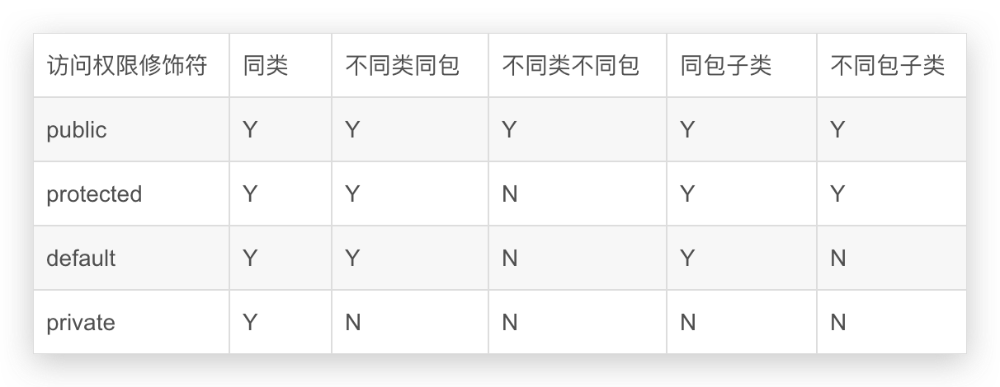

# 面向对象之封装

[👈 **相关面试题**](./README.md#_1-2-面向对象的三大基本特征)

- 隐藏对象的属性和实现细节, 仅对外公开接口;
- 控制在程序中属性的读和修改的访问级别；
- 将抽象得到的数据和行为（或功能）相结合, 形成一个有机的整体, 也就是将数据与操作数据的源代码进行有机的结合, 形成“类”, 其中数据和函数都是类的成员.

**通俗的说就是:**

利用抽象数据类型将数据和基于数据的操作组合在一起,是其构成一个不可分割的独立实体,数据被保护在抽象数据类型的内部,尽可能的隐藏内部的细节,只保留一些对外的接口使之与外部发生联系.
用户无需知道内部的实现细节,但可以通过该对象对外提供的接口来访问该对象.

## 封装的好处 

1. 良好的封装能够减少耦合
2. 类内部的结构可以自由修改
3. 可以对成员进行更精确的控制
4. 隐藏信息,实现细节

## JavaBean

**JavaBean 规范**: 标准java类 Sun公司规定
为私有属性提供符合命名规范的set和get方法

1. JavaBean必须方法一个包中
2. JavaBean必须声明为public class
3. JavaBean的所有属性必须声明为private
4. 通过setter和getter方法设值和取值
5. 通过JSP调用是,则需要一个无参的构造方法
6. 编写代码要严格遵循Java程序的命名规范

## geter和setter更深入理解

- 当把类的属性和方法访问权限设置为private时,一般都提供上面2个公共方法;
在这2个方法体内,可以添加一些限制代码;
比如说setter方法,需要用户输入账号密码才有权限修改
getter也可以这么做,还可以在返回值的时候做一些动作;
这就是隐藏.
- 也可以用private修饰setter方法或不提供,那么这个属性就是只读;
- 用private修饰getter方法或不提供,这个属性就是只写;

### 一个简单的封装

```java
class Person {
   private String name;
   private int age;
   private double weight;
   private boolean genger;

   private boolean count = true;
   public Person(){

   }
   public Person(String name, int age, double weight, boolean genger){
        this.name   = name;
        this.age    = age ;
        this.weight = weight;
        this.genger = genger;
   }

   public void setName(String name){
    //访问修饰符是public,说明可以被外界调用
    //但是有条件,值允许被调用一次,意思是可以修改一次姓名;
        if(count){
            this.name = name;
            count = false;
        }else
            System.out.println("姓名只允许被修改一次");
   }
   //外界只能取得名字
   public String getName(){
        return name;
   }
   //setAge,让外界不能调用此方法,
   //表示一个人的年龄是只读的,别人无权更改
   private void setAge(int age){
        this.age = age;
   }
   public int getAge(){
        return age;
   }

   private void setWeight(double weight){
        this.weight = weight;
   }
   public double getWeight(){
        return weight;
   }

   //此处没有setGenger方法,表示人的性别不能被更改
   public String getGenger(){
        return genger ? "男" : "女";
   }

}

public class EncapsulationDemo{
    public static void main(String[] args) {
        Person p = new Person("张三",26,62.8,true);
        System.out.println("姓名:" + p.getName() + "\n" +
                           "年龄:" + p.getAge() + "岁\n" +
                           "体重:" + p.getWeight() + "Kg\n" +
                           "性别:" + p.getGenger() );
    }
}
```

**数组的封装**

```java
public class ArrayClass {
	private int[]	array;
	// 下标
	private int		index;
	// 新建数组长度
	private int		size;

	// 调用无参构造的时候,默认初始大小为1;
	public ArrayClass() {
		size = 1;
		array = new int[size];
		index = 0;
	}

	// 调用有参构造的时候,用户自定义数字大小
	public ArrayClass(int size) {
		this.size = size;
		array = new int[size];
		index = 0;
	}
}
```

--------

## 方法的重载-Overload

**同一个类中的方法名相同,参数列表不同;和返回值类型无关**

重载是静态多态的前提

::: tip 我是这样理解重载的
妈, 我饿了 (我想吃蛋炒饭)   --> 然后我妈给我炒了蛋炒饭吃

妈, 我饿了 (我想吃饺子)   --> 然后我妈给我煮了饺子吃

妈, 我饿了 ()   --> 然后我妈给了我一杯白开水.....
:::

```java
//伪代码
//妈妈类
class Mon{
	public void 煮饭的方法(){
		System.out.println("多喝点开水就不饿了");
	}
	public void 煮饭的方法(蛋炒饭){
		System.out.println("乖儿子来吃蛋炒饭");
	}
	public void 煮饭的方法(饺子){
		System.out.println("乖儿子来吃饺子");
	}
}

public class Test{
	public static void main(String[] args){
		Mon m = new Mon();
		m.煮饭的方法(饺子);
		m.煮饭的方法(蛋炒饭);
		m.煮饭的方法();
	}	
}
```
我调用我妈妈的煮饭的方法,传入不同的参数,我妈妈做出不同的反应.

就这样吧,这就是重载,不知道懂了没有......


**为什么不能用返回值类型类区分重载**
比如下面两个方法, 虽然他们有同样的名字和形式, 但却很容易区分它们:
Java代码`void f(){} ` `int f(){reurn1;}`
只要编译器可以根据语境明确判断出语义, 比如在int x =f()中, 那么的确可以据此区分重载方法.
不过, 有时你并不关心方法的返回值, 你想要的是方法调用的其他效果, 这时你可能会调用方法而忽略其返回值.
所以, 如果像下面这样调用方法:f()；此时Java如何才能判断该调用哪一个f()呢？
因此, 根据方法的返回值来区分重载方法是行不通的

## 访问权限修饰符



[👈 **返回到面试题**](./README.md#_1-2-面向对象的三大基本特征)
