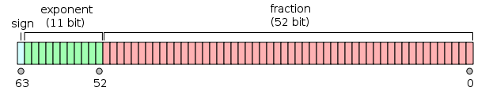
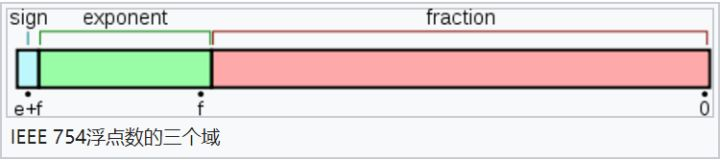

# 单精度与双精度

## 单精度

单精度是这样的格式, 1位符号, 8位指数, 23位小数.

也即float, 一般在计算机中存储占用4字节, 也32位, 有效位数为7位

## 双精度

双精度是1位符号, 11位指数, 52位小数

double, 在计算机中存储占用8字节, 64位, 有效位数为16位.

在 Java 中, 默认的浮点类型是 double, 如果需要使用 float, 则需要在浮点数后面添加 `f`

## 浮点数在计算机中的存储

在计算机中, 保存这个数使用的是浮点表示法, 分为三大部分:

1. 第一部分用来存储符号位（sign）, 用来区分正负数, 这里是0, 表示正数
2. 第二部分用来存储指数（exponent）, 这里的指数是十进制的6
3. 第三部分用来存储小数（fraction）, 这里的小数部分是001110011

比如float类型是32位, 是单精度浮点表示法:符号位（sign）占用1位, 用来表示正负数, 指数位（exponent）占用8位, 用来表示指数, 小数位（fraction）占用23位, 用来表示小数, 不足位数补0.
而double类型是64位, 是双精度浮点表示法:符号位占用1位, 指数位占用11位, 小数位占用52位.

**指数位决定了大小范围**, 因为指数位能表示的数越大则能表示的数越大

**小数位决定了计算精度**, 因为小数位能表示的数越大, 则能计算的精度越大
