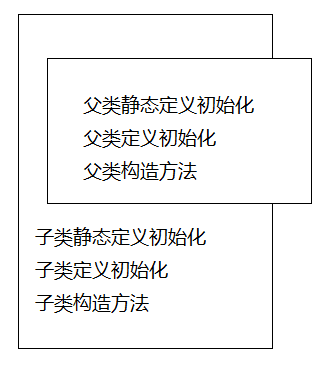
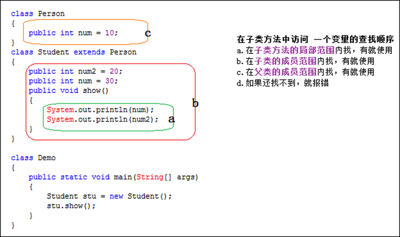

[👈 **相关面试题**](./README.md#_1-2-面向对象的三大基本特征)

Java继承是使用已存在的类的定义作为基础建立新类的技术, 新类的定义可以增加新的数据或新的功能, 也可以用父类的功能, 但不能选择性地继承父类.这种技术使得复用以前的代码非常容易, 能够大大缩短开发周期, 降低开发费用.比如可以先定义一个类叫车, 车有以下属性:车体大小, 颜色, 方向盘, 轮胎, 而又由车这个类派生出轿车和卡车两个类, 为轿车添加一个小后备箱, 而为卡车添加一个大货箱.

1. 子类拥有父类非private的属性和方法.
2. 子类可以拥有自己属性和方法, 即子类可以对父类进行扩展.
3. 子类可以用自己的方式实现父类的方法.(重载)

## 继承 (类与类的关系)
有相同的属性和相同的行为时,定义为父类,
其他的子类只需要写特有的属性和方法.

在面向对象中,可以通过扩展一个已有的类,并继承该类的属性和行为,
来创建一个新的类,从而达到代码的复用.

继承是所有OOP语言不可缺少的部分, 
在java中使用`extends`关键字来表示继承关系.
当创建一个类时, 总是在继承, 如果没有明确指出要继承的类, 
就总是隐式地从根类Object进行继承.

继承不会继承父类的构造方法
因为:

1. 语法上如果继承来了父类的构造方法,但是类名是父类名,跟子类名不一样
2. 在面向对象的思想上说不通

**类与类的关系**

- has a (组合) -属性
- is a (继承)  
- use a (使用) -参数或局部变量

**关于私有属性 有没有继承 能不能继承 算不算继承?**
**私有属性在子类的存储空间当中他是切实存在的**
子类可以继承父类的所有成员跟方法, 继承下来不代表可以访问, 要访问得看访问控制规则.私有属性也可以继承, 不过根据访问控制规则, 私有属性虽继承下来却不可以访问的, 只有通过public的方法才能访问继承下来的私有属性.

B继承A类, .A类中的私有属性, 到了B会怎么样, 能继承、访问吗？
答案是:如果A中的属性有增加setter getter 方法, 可以访问的:
比如下面这段代码:

```java
class Person {
private String name;
private int age;
public Person() {
  }
  public Person(String name, int age){
	this.name = name;
	this.age = age;
}
public void setName(String name){
	this.name = name;
}
public String getName(){
	return name;
}
public void setAge(int age){
	this.age = age;
}
public int getAge(){
	return age;
}
}
class Man extends Person {

}
```
类Man继承于Person类, 这样一来的话, 
Person类称为父类（基类）, Man类称为子类（导出类/派生类）.
如果两个类存在继承关系, 则子类会自动继承父类的方法和变量, 
在子类中可以调用父类范围访问修饰符允许的方法和变量.

在上面的例子中,子类实例可以通过setter方法访问父类的私有属性,所以就证明了子类是继承了父类的全部属性和方法的.
只是这样就破坏了封装性,

在java中, 只允许单继承, 也就是说 一个类最多只能显示地继承于一个父类.
但是一个类却可以被多个类继承, 一个类可以拥有多个子类.

### 子类继承父类的成员变量
当子类继承了某个类之后, 便可以使用父类中的成员变量, 
但是并不是完全继承父类的所有成员变量.具体的原则如下:

- 能够继承父类的public和protected成员变量；能够继承父类的private成员变量(用setter,getter方法来使用private属性)；
- 对于父类的包访问权限成员变量, 如果子类和父类在同一个包下, 则子类能够继承；否则, 子类不能够继承；
- **对于子类可以继承的父类成员变量, 如果在子类中出现了同名称的成员变量, 则会发生隐藏现象, **即子类的成员变量会屏蔽掉父类的同名成员变量.如果要在子类中访问父类中同名成员变量, 需要使用`super`关键字来进行引用

### 子类继承父类的方法
- 对于父类的包访问权限成员方法, 如果子类和父类在同一个包下, 则子类能够继承；否则, 子类不能够继承；
- 对于子类可以继承的父类成员方法, 如果在子类中出现了同名称的成员方法, 则称为覆盖, 即子类的成员方法会覆盖掉父类的同名成员方法.如果要在子类中访问父类中同名成员方法, 需要使用super关键字来进行引用.

　　
###  构造器
　　子类是不能够继承父类的构造器, 它只能够被调用.
　　值得注意的是, 如果父类的构造器都是带有参数的, **则必须在子类的构造器中显示地通过super关键字调用父类的构造器并配以适当的参数列表.**如果父类有无参构造器, 则在子类的构造器中用super关键字调用父类构造器不是必须的, 如果没有使用super关键字, 系统会自动调用父类的无参构造器.
		  
**这是为什么呢?:**
因为使用子类时候,实例化一个子类对象时,然后就可以调用父类的public属性和方法;
但是在调用父类属性和方法之前,我们并没有实例化父类对象,所以这个时候,
必须在子类构造器中调用父类构造器;

- `子类名 a = new 子类名();`
  - 如果父类没有无参构造器,则在子类构造器中必须显示的用super调用父类构造器.
  - 如果父类有无参构造,则可以不写super,系统自动调用父类无参构造;
当new一个子类时,调用子类构造器,然后子类构造器中调用父类构造器,

看下面这个例子就清楚了:

```java
class Shape {
  protected String name;
  public Shape(){  //无参构造方法 作用是初始化name
	  name = "shape";
  }
  public Shape(String name) { //有参构造方法  new shape( "张三")
	  this.name = name;
  }
}
class Circle extends Shape { //Circle 继承 Shape 
  private double radius;
  public Circle() { //无参构造方法
	  radius = 0;
  }
  public Circle(double radius) { 
	  this.radius = radius;
  }
  public Circle(double radius,String name) {
	  this.radius = radius;
	  this.name = name;
  }
} 
```

这样的代码是没有问题的, 如果把父类的无参构造器去掉, 则下面的代码必然会出错:

　　改成下面这样就行了:

```java
class Shape {
  protected String name;
  //public Shape(){
	  //name = "shape";
  //}
  public Shape(String name) {
	  this.name = name;
  }
}
class Circle extends Shape {
  private double radius;
  public Circle() {
	  radius = 0;
  }
  public Circle(double radius) {
	  this.radius = radius;
  }
  public Circle(double radius,String name) {
	  super(name);
	  this.radius = radius;
	  this.name = name;
  }
} 
```

子类的构造方法, 不管这个构造方法带不带参数, 默认的它都会先去寻找父类的不带参数的构造方法.如果父类没有不带参数的构造方法, 那么子类必须用supper关键子来调用父类带参数的构造方法, 否则编译不能通过

####  super
super主要有两种用法:
　　   1）super.成员变量/super.成员方法;
　　   2）super(parameter1,parameter2....)

　　第一种用法主要用来在子类中调用父类的同名成员变量或者方法；第二种主要用在子类的构造器中显示地调用父类的构造器, 要注意的是, 如果是用在子类构造器中, 则必须是子类构造器的第一个语句.

[this和super关键字的区别](http://blog.csdn.net/codeai/article/details/46851293)
可以在我的另一篇博客中看到

### 向上转型
在上面的继承中我们谈到继承是is-a的相互关系, 猫继承与动物, 所以我们可以说猫是动物, 或者说猫是动物的一种.这样将猫看做动物就是向上转型.如下:

```java
public class Person {  
  public void display(){  
	  System.out.println("Play Person...");  
  }  
	
  static void display(Person person){  
	  person.display();  
  }  
}  

public class Husband extends Person{  
  public static void main(String[] args) {  
	  Husband husband = new Husband();  
	  Person.display(husband);      //向上转型  
  }  
}  
```
在这我们通过Person.display(husband).这句话可以看出husband是person类型.
	 将子类转换成父类, 在继承关系上面是向上移动的, 所以一般称之为向上转型.由于向上转型是从一个叫专用类型向较通用类型转换, 所以它总是安全的, 唯一发生变化的可能就是属性和方法的丢失.这就是为什么编译器在“未曾明确表示转型”或“未曾指定特殊标记”的情况下, 仍然允许向上转型的原因.

这也是多态的一种,关于多态,将在下一篇博客中总结.


**常见的面试笔试题**

1.下面这段代码的输出结果是什么？

```java
public class Test {
  public static void main(String[] args)  {
	 new Circle();
  }
}
class Draw {
  public Draw(String type) {
	  System.out.println(type+" draw constructor");
  }
}
class Shape {
  private Draw draw = new Draw("shape");
  public Shape(){
	  System.out.println("shape constructor");
  }
}
class Circle extends Shape { 
  private Draw draw = new Draw("circle"); 
  public Circle() {
	  System.out.println("circle constructor");
  }
} 
```
>输出 1.shape draw construtor  
>        2.shape construtor
>        3.circle draw constructor
>        4.circle constructor


　　这道题目主要考察的是类继承时构造器的调用顺序和初始化顺序.要记住一点:父类的构造器调用以及初始化过程一定在子类的前面.由于Circle类的父类是Shape类, 所以Shape类先进行初始化, 然后再执行Shape类的构造器.接着才是对子类Circle进行初始化, 最后执行Circle的构造器.

类继承时构造器的调用顺序和初始化顺序


在子类中访问一个变量时的查找顺序(查找方法一样)



## 重写-Override
发生在继承的时候,子类方法跟父类方法重名,发生了覆盖,重写子类方法的实现;

1. 方法名相同
2. 参数列表相同
3. 返回类型相同
4. 访问修饰符必须大于等于父类
5. 抛出的异常不能比父类多

### 隐藏和覆盖的区别
- 隐藏发生在子类属性名跟父类属性名同名的时候,在子类中调用重名的属性的时候,只能访问到子类的那个属性;如果要调用父类的同名属性,必须用super.属性名调用
- 覆盖发生在子类方法名跟父类方法名相同的时候,也要用super.方法名()来调用父类中的同名方法;

### 重载和重写
重写:是有继承关系的2个类发生的
重载:一个类中有多个相同的方法名
##总结:
继承:把具有相同属性,相同行为的类抽取出来,作为一个父类,然后另一个类去继承这个类,那么这个类就有了父类的属性和方法

**关系:**
is a

**特点:**
内存上,叠加

**效果:**
子类拥有父类的属性和行为方法,但是不继承父类的构造方法;

**构造调用顺序:**
先父类构造,再子类构造
修改父类的行为-->重写

**谨慎继承**
	 上面讲了继承所带来的诸多好处, 那我们是不是就可以大肆地使用继承呢？送你一句话:慎用继承.
	 首先我们需要明确, 继承存在如下缺陷:
	   1、父类变, 子类就必须变.
	   2、继承破坏了封装, 对于父类而言, 它的实现细节对与子类来说都是透明的.
	   3、继承是一种强耦合关系.
	 所以说当我们使用继承的时候, 我们需要确信使用继承确实是有效可行的办法.那么到底要不要使用继承呢？《Think in java》中提供了解决办法:问一问自己是否需要从子类向父类进行向上转型.如果必须向上转型, 则继承是必要的, 但是如果不需要, 则应当好好考虑自己是否需要继承.


## Object类
Object类是所有类的直接父类,如果声明一个类时没有显式的继承另一个类,那么这个类就会继承Object类,从而拥有了Object类中的所有方法,数组也不例外.

### Object类的中方法
Object类一共有11个方法,作为祖宗类,而这11个方法还得以保留,说明这些方法的通用性很高,所以我们都必须掌握.

1. `protected  Object clone()` 创建并返回此对象的一个副本 
2. `boolean equals(Object obj)` 指示其他某个对象是否与此对象“相等”. 
    - 对于Object类中,equals的底层实现就是使用的"=="运算符,而这并不能满足我们对对象的比较,所以必须重写,在String类中就重写了此方法
    - 基本思路:
        - 先判断是否是同一个类的实例,如果是就返回true;
        - 如果不是,再分别比较每个属性值,如果有一个不同,就返回flase
        - 如果都相同,就返回true
3. `protected  void finalize()` 当垃圾回收器确定不存在对该对象的更多引用时, 由对象的垃圾回收器调用此方法. 
4. `Class<?> getClass()` 返回此 Object 的运行时类(反射中用到). 
5. `int hash Code()` 返回该对象的哈希码值 
6. `void notify()` 唤醒在此对象监视器上等待的单个线程 
7. `void notifyAll()` 唤醒在此对象监视器上等待的所有线程
8. `String toString()` 返回该对象的字符串表示 
    - 此方法的实现:
        - `getClass().getName() + '@' + Integer.toHexString(hashCode())`
    - 如果不重写这个此方法,返回的是 `类名@引用值`,对于我们来说没用,所以一般使用toString方法时都需要重写
9. `void wait()` 在其他线程调用此对象的 notify() 方法或 notifyAll() 方法前, 导致当前线程等待. 
10. `void wait(long timeout)` 在其他线程调用此对象的 notify() 方法或 notifyAll() 方法, 或者超过指定的时间量前, 导致当前线程等待 
11. `void wait(long timeout, int nanos)` 在其他线程调用此对象的 notify() 方法或 notifyAll() 方法, 或者其他某个线程中断当前线程, 或者已超过某个实际时间量前, 导致当前线程等待.
  
[👈 **返回到面试题**](./README.md#_1-2-面向对象的三大基本特征)