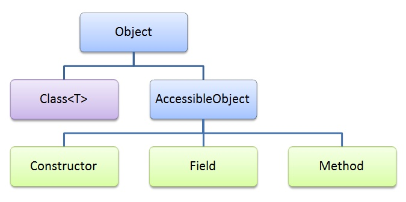
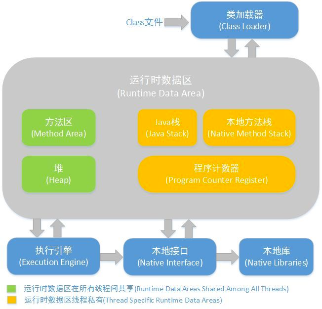
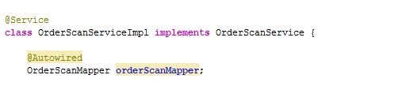

# 深入理解反射



::: tip 什么是反射
Java 反射是可以让我们在运行时，通过一个类的 Class 对象来获取它获取类的方法、属性、父类、接口等类的内部信息的机制(自省).

能够在程序运行时 动态访问, 修改某个类中任意属性（状态）和方法（行为）（包括private实例和方法）
:::

## 反射的作用

Java 反射主要提供以下功能：

- 在**运行时**判断任意一个对象所属的类
- 在**运行时**构造任意一个类的对象
- 在**运行时**判断任意一个类所具有的成员变量和方法（通过反射甚至可以调用private方法, 使用 `setAccessible(true)`）
- 在**运行时**调用任意一个对象的方法

反射机制很重要的一点就是 **运行时**，其使得我们可以在程序运行时加载、探索以及使用编译期间完全未知的 .class 文件。
换句话说，Java 程序可以加载一个运行时才得知名称的 .class 文件，然后获悉其完整构造，并生成其对象实体、或对其 fields（变量）设值、或调用其 methods（方法）

比如我们可以通过 `Class.forName("类的全限定名").newInstance()` 来实例化一个对象.

`Class.forName("类的全限定名")` 就是通过类的全限定名来生成一个当前类的 class 对象, 然后调用 .newInstance() 来实例化当前类的实例

[深入理解 Class.forName()](./class_forname.md).

编译时的加载时静态, 运行时的加载是动态加载. 像 `new Student`() 就是静态加载, 如果在编译时未找到 Student 这个类, 编译会报错;

`Class.forName("info.dong4j.Student")` 就是动态加载, 这种方式获取类的实例, 编译阶段不会有任何问题, 即使 Student 类不存在也能通过编译.

我们在使用 IDE(Eclipse, IDEA)时, 当我们输入一个对象或类并想调用它的属性或方法时，一按点号，编译器就会自动列出它的属性或方法，这里就会用到反射。

## 反射的原理

我们先从 .class 的加载说起

Java 程序从源代码到运行需要以下 3 个步骤:


当 JVM 把 .class 文件加载到内存中后, 会生成对应的 `java.lang.Class` 对象. 这个 class 对象就是对当前加载的类的一个元数据的描述, 比如 类名, 父类, 包含的方法等.

[深入理解 Java 中的 Class 类](./class.md)



上面是 Java 的内存模型, 展示了一个 .class 文件通过 JVM 加载后的运行时内存分布.

从一段简单的代码说说 .class 的加载过程

```java
Object object = new Object();
```

首先JVM会启动，你的代码会编译成一个.class 文件，
然后被类加载器加载进 JVM 的内存中，你的类 Object加 载到方法区中，创建了 Object 类的 **class对象** 到堆中，
注意这个不是new出来的对象，而是**类的类型对象**，每个类只有一个class对象，作为方法区类的数据结构的接口。
jvm创建对象前，会先检查类是否加载，寻找类对应的class对象，
若加载好，则为你的对象分配内存，初始化也就是代码: `new Object()`

## 反射的使用

`java.lang.reflect` 包结构

```python
.
├── AccessibleObject.java
├── AnnotatedArrayType.java
├── AnnotatedElement.java
├── AnnotatedParameterizedType.java
├── AnnotatedType.java
├── AnnotatedTypeVariable.java
├── AnnotatedWildcardType.java
├── Array.java
├── Constructor.java
├── Executable.java
├── Field.java
├── GenericArrayType.java
├── GenericDeclaration.java
├── GenericSignatureFormatError.java
├── InvocationHandler.java
├── InvocationTargetException.java
├── MalformedParameterizedTypeException.java
├── MalformedParametersException.java
├── Member.java
├── Method.java
├── Modifier.java
├── Parameter.java
├── ParameterizedType.java
├── Proxy.java
├── ReflectAccess.java
├── ReflectPermission.java
├── Type.java
├── TypeVariable.java
├── UndeclaredThrowableException.java
├── WeakCache.java
├── WildcardType.java
└── package-info.java
```

反射涉及到的四个核心类:

- `java.lang.Class.java` 类对象；
- `java.lang.reflect.Constructor.java`：类的构造器对象；
- `java.lang.reflect.Method.java`：类的方法对象；
- `java.lang.reflect.Field.java`：类的属性对象；

通过反射解析 [Annotation](./annotation.md) 

### 1. 获取 Class 对象

- 使用 Class.forName() 静态方法

```java
public static Class<?> forName(String className)

// 比如在 JDBC 开发中常用此方法加载数据库驱动:

Class.forName(driver);
```

- 直接获取某一个对象的 class

```java
Class<?> klass = int.class;
Class<?> classInt = Integer.TYPE;
```

- 调用某个对象的 getClass() 方法

```java
StringBuilder str = new StringBuilder("123");
Class<?> klass = str.getClass();
```

**Class 的其他方法**

| 方法 | 用途 |
| --- | --- |
| asSubclass(Class clazz) | 把传递的类的对象转换成代表其子类的对象 |
| Cast | 把对象转换成代表类或是接口的对象 |
| getClassLoader() | 获得类的加载器 |
| getClasses() | 返回一个数组，数组中包含该类中所有公共类和接口类的对象 |
| getDeclaredClasses() | 返回一个数组，数组中包含该类中所有类和接口类的对象 |
| forName(String className) | 根据类名返回类的对象 |
| getName() | 获得类的完整路径名字 |
| newInstance() | 创建类的实例 |
| getPackage() | 获得类的包 |
| getSimpleName() | 获得类的名字 |
| getSuperclass() | 获得当前类继承的父类的名字 |
| getInterfaces() | 获得当前类实现的类或是接口 |

### 2. 获取注解

| 方法 | 用途 |
| --- | --- |
| getAnnotation(Class annotationClass) | 返回该类中与参数类型匹配的公有注解对象 |
| getAnnotations() | 返回该类所有的公有注解对象 |
| getDeclaredAnnotation(Class annotationClass) | 返回该类中与参数类型匹配的所有注解对象 |
| getDeclaredAnnotations() | 返回该类所有的注解对象 |

### 3. 获取泛型类型

```java
//People类
public class People<T> {}
//Person类继承People类
public class Person<T> extends People<String> implements PersonInterface<Integer> {}
//PersonInterface接口
public interface PersonInterface<T> {}

Person<String> person = new Person<>();
//第一种方式 通过对象getClass方法
Class<?> class1 = person.getClass();
Type genericSuperclass = class1.getGenericSuperclass();//获取class对象的直接超类的 Type
Type[] interfaceTypes = class1.getGenericInterfaces();//获取class对象的所有接口的Type集合


getComponentType(genericSuperclass);
getComponentType(interfaceTypes[0]);
```

**getComponentType() 具体实现**

```java
private Class<?> getComponentType(Type type) {
    Class<?> componentType = null;
    if (type instanceof ParameterizedType) {
        //getActualTypeArguments()返回表示此类型实际类型参数的 Type 对象的数组。
        Type[] actualTypeArguments = ((ParameterizedType) type).getActualTypeArguments();
        if (actualTypeArguments != null && actualTypeArguments.length > 0) {
        componentType = (Class<?>) actualTypeArguments[0];
        }
    } else if (type instanceof GenericArrayType) {
        // 表示一种元素类型是参数化类型或者类型变量的数组类型
        componentType = (Class<?>) ((GenericArrayType) type).getGenericComponentType();
    } else {
        componentType = (Class<?>) type;
    }
    return componentType;
}
```

### 4. 获取 Constructor

| 方法 | 用途 |
| --- | --- |
| getConstructor(Class[] parameterTypes) | 获得该类中与参数类型匹配的公有构造方法 |
| getConstructors() | 获得该类的所有公有构造方法 |
| getDeclaredConstructor(Class[] parameterTypes) | 获得该类中与参数类型匹配的构造方法 |
| getDeclaredConstructors() | 获得该类所有构造方法 |

### 5. 获取 Method 与执行方法

| 方法 | 用途 |
| --- | --- |
| getMethod(String name, Class<?>... parameterTypes) | 获得该类某个公有的方法 |
| getMethods() | 获得该类所有公有的方法 |
| getDeclaredMethod(String name, Class[] parameterTypes) | 获得该类某个方法 |
| getDeclaredMethods() | 获得类或接口声明的所有方法，包括公共、保护、默认（包）访问和私有方法，但不包括继承的方法 |

#### Method API

Method代表类的方法。

| 方法 | 用途 |
| --- | --- |
| invoke(Object obj, Object... args) | 传递object对象及参数调用该对象对应的方法 |

完整的代码

```java
@Slf4j
public class MethodTest {
    public static void main(String[] args) throws IllegalAccessException, NoSuchMethodException, InstantiationException, InvocationTargetException {
        test();
    }

    private static void test() throws IllegalAccessException, InstantiationException, NoSuchMethodException, InvocationTargetException {
        Class<?> c = MethodClass.class;
        // 创建 methodClass 实例
        Object object = c.newInstance();
        // 获取所有公用（public）方法，包括其继承类的公用方法。
        Method[] methods = c.getMethods();
        log.warn("getMethods 获取的方法：");
        for (Method m : methods) {
            log.info("{}", m);
        }
        // 获得类或接口声明的所有方法，包括公共、保护、默认（包）访问和私有方法，但不包括继承的方法。
        Method[] declaredMethods = c.getDeclaredMethods();
        log.warn("getDeclaredMethods获取的方法：");
        for (Method m : declaredMethods) {
            log.info("{}", m);
        }

        // 获取 methodClass 类的 add 方法
        Method method = c.getMethod("add", int.class, int.class);
        // 调用method对应的方法 => add(1,4)
        Object result = method.invoke(object, 1, 4);
        log.info("result = {}", result);

    }
}

class MethodClass {
    public final int fuck = 3;

    public int add(int a, int b) {
        return a + b;
    }

    private int sub(int a, int b) {
        return a + b;
    }
}
```

程序运行的结果如下:

```python
03-03 20:10 [ WARN] - [ main] i.d.i.r.MethodTest :: getMethods 获取的方法：
03-03 20:10 [ INFO] - [ main] i.d.i.r.MethodTest :: public int info.dong4j.interview.reflect.MethodClass.add(int,int)
03-03 20:10 [ INFO] - [ main] i.d.i.r.MethodTest :: public final void java.lang.Object.wait(long,int) throws java.lang.InterruptedException
03-03 20:10 [ INFO] - [ main] i.d.i.r.MethodTest :: public final native void java.lang.Object.wait(long) throws java.lang.InterruptedException
03-03 20:10 [ INFO] - [ main] i.d.i.r.MethodTest :: public final void java.lang.Object.wait() throws java.lang.InterruptedException
03-03 20:10 [ INFO] - [ main] i.d.i.r.MethodTest :: public boolean java.lang.Object.equals(java.lang.Object)
03-03 20:10 [ INFO] - [ main] i.d.i.r.MethodTest :: public java.lang.String java.lang.Object.toString()
03-03 20:10 [ INFO] - [ main] i.d.i.r.MethodTest :: public native int java.lang.Object.hashCode()
03-03 20:10 [ INFO] - [ main] i.d.i.r.MethodTest :: public final native java.lang.Class java.lang.Object.getClass()
03-03 20:10 [ INFO] - [ main] i.d.i.r.MethodTest :: public final native void java.lang.Object.notify()
03-03 20:10 [ INFO] - [ main] i.d.i.r.MethodTest :: public final native void java.lang.Object.notifyAll()
03-03 20:10 [ WARN] - [ main] i.d.i.r.MethodTest :: getDeclaredMethods获取的方法：
03-03 20:10 [ INFO] - [ main] i.d.i.r.MethodTest :: public int info.dong4j.interview.reflect.MethodClass.add(int,int)
03-03 20:10 [ INFO] - [ main] i.d.i.r.MethodTest :: private int info.dong4j.interview.reflect.MethodClass.sub(int,int)
03-03 20:10 [ INFO] - [ main] i.d.i.r.MethodTest :: result = 5
```

可以看到，通过 getMethods() 获取的方法可以获取到父类的方法,比如 java.lang.Object 下定义的各个方法。

### 6. 获取 Field

| 方法 | 用途 |
| --- | --- |
| getField(String name) | 获得某个公有的属性对象 |
| getFields() | 获得所有公有的属性对象 |
| getDeclaredField(String name) | 获得某个属性对象 |
| getDeclaredFields() | 获得所有已声明的成员变量，但不能得到其父类的成员变量 |

#### Field API

Field代表类的成员变量（成员变量也称为类的属性）。

| 方法 | 用途 |
| --- | --- |
| equals(Object obj) | 属性与obj相等则返回true |
| get(Object obj) | 获得obj中对应的属性值 |
| set(Object obj, Object value) | 设置obj中对应属性值 |

### 7. 判断是否为某个类的实例

我们用 instanceof 关键字来判断是否为某个类的实例。
同时我们也可以借助反射中 Class 对象的 isInstance() 方法来判断是否为某个类的实例，它是一个 native 方法：

```java
public native boolean isInstance(Object obj);
```

### 8. 创建实例

- 使用 Class 对象的 newInstance() 方法来创建 Class 对象对应类的实例

```java
Class<?> c = String.class;
Object str = c.newInstance();
```

- 先通过 Class 对象获取指定的 Constructor 对象，再调用 Constructor 对象的 newInstance() 方法来创建实例 (这种方法可以用指定的构造器构造类的实例)

```java
// 获取String所对应的Class对象
Class<?> c = String.class;
// 获取String类带一个String参数的构造器
Constructor constructor = c.getConstructor(String.class);
// 根据构造器创建实例
Object obj = constructor.newInstance("23333");
System.out.println(obj);
```

[Class.newInstance() 和 Constructor.newInstance() 之间的区别](./new_instance_way.md#_4-class-newinstance-和constructor-newinstance-之间的区别)

### 9. Class 中其他重要的方法

| 方法 | 用途 |
| --- | --- |
| isAnnotation() | 如果是注解类型则返回true |
| isAnnotationPresent(Class annotationClass) | 如果是指定类型注解类型则返回true |
| isAnonymousClass() | 如果是匿名类则返回true |
| isArray() | 如果是一个数组类则返回true |
| isEnum() | 如果是枚举类则返回true |
| isInterface() | 如果是接口类则返回true |
| isLocalClass() | 如果是局部类则返回true |
| isMemberClass() | 如果是内部类则返回true |

### 10. 利用反射创建数组

数组在 Java 里是比较特殊的一种类型，它可以赋值给一个 Object Reference

下面我们看一看利用反射创建数组的例子:

```java
public static void testArray() throws ClassNotFoundException {
    Class<?> cls = Class.forName("java.lang.String");
    Object array = Array.newInstance(cls,25);
    //往数组里添加内容
    Array.set(array,0,"hello");
    Array.set(array,1,"Java");
    Array.set(array,2,"fuck");
    Array.set(array,3,"Scala");
    Array.set(array,4,"Clojure");
    //获取某一项的内容
    System.out.println(Array.get(array,3));
}
```

其中的 Array 类为 `java.lang.reflect.Array` 类。
我们通过 `Array.newInstance()` 创建数组对象，它的原型是:

```java
public static Object newInstance(Class<?> componentType, int length)
    throws NegativeArraySizeException {
    return newArray(componentType, length);
}
```
而 newArray 方法是一个 native 方法，它在 HotSpot JVM 里的具体实现我们后边再研究，这里先把源码贴出来：

```java
private static native Object newArray(Class<?> componentType, int length)
        throws NegativeArraySizeException;
```

源码目录：`openjdk\hotspot\src\share\vm\runtime\reflection.cpp`

```c
arrayOop Reflection::reflect_new_array(oop element_mirror, jint length, TRAPS) {
  if (element_mirror == NULL) {
    THROW_0(vmSymbols::java_lang_NullPointerException());
  }
  if (length < 0) {
    THROW_0(vmSymbols::java_lang_NegativeArraySizeException());
  }
  if (java_lang_Class::is_primitive(element_mirror)) {
    Klass* tak = basic_type_mirror_to_arrayklass(element_mirror, CHECK_NULL);
    return TypeArrayKlass::cast(tak)->allocate(length, THREAD);
  } else {
    Klass* k = java_lang_Class::as_Klass(element_mirror);
    if (k->oop_is_array() && ArrayKlass::cast(k)->dimension() >= MAX_DIM) {
      THROW_0(vmSymbols::java_lang_IllegalArgumentException());
    }
    return oopFactory::new_objArray(k, length, THREAD);
  }
}
```

另外，Array 类的 set 和 get 方法都为 native 方法，在 HotSpot JVM 里分别对应 Reflection::array_set 和 Reflection::array_get 方法

### 11. 利用反射修改 String 的值

我们知道 String 是不可变的类 ([String 为什么不可变](./string_immutable.md)).

String 定义如下:

```java
public final class String
    implements java.io.Serializable, Comparable<String>, CharSequence {
    /** The value is used for character storage. */
    private final char value[];
    /** Cache the hash code for the string */
    private int hash; // Default to 0
    ...
}
```

- 因为 String 被 final 修饰, 因此我们不能继承 String;
- 真正存储数据的是一个被 final 修饰的私有字符数组 `private final char value[];`
    - 因为是 private 且没有对应的 setValue(), 因此外部不能访问此变量
    - 因为被 final 修饰, 意味着 String 一旦被初始化, 就不能改变.

::: tip 这里有个小知识点
value 数组被 [final](./final_finally_finalize.md) 修饰, 并不是说 value 数组里面的字符不能被修改, 而是 value 这个应用不能再指向其他数组.

因此我们可以通过反射直接修改 value 数组里面的值
:::

```java
@Slf4j
public class ChangeStringValue {

    public static void main(String[] args) throws IllegalAccessException, NoSuchFieldException {
        changeValue();
    }

    private static void changeValue() throws IllegalAccessException, NoSuchFieldException {
        String s = "abcd";
        log.info("修改前 s = {}", s);
        // 获取 String 类中的 value 字段
        Field valueField = String.class.getDeclaredField("value");
        // 改变 value 属性的访问权限
        valueField.setAccessible(true);
        // 获取 s 对象上的 value 属性的值
        char[] value = (char[]) valueField.get(s);
        // 改变 value 所引用的数组中的第 4 个字符
        value[3] = 'e';
        log.info("修改后 s = " + s);
        // 改变整个字符串
        valueField.set(s, new char[] {'1', '2', '3'});
        // 由于 JDK6 之后取消了 count 字段, 由 value.length 直接返回长度, 下面的代码将执行失败
        // 因为改变了 value 的值，字符串长度已经改变了，需要同时改变 count 的值，不然使用 s 时会报数组越界 (JDK6)
        Field countField = String.class.getDeclaredField("count");
        countField.setAccessible(true);
        countField.set(s, 3);
        log.info("s = " + s);
    }
}
```

输出结果:

```java
03-03 20:47 [ INFO] - [ main] i.d.i.r.ChangeStringValue :: 修改前 s = abcd
03-03 20:47 [ INFO] - [ main] i.d.i.r.ChangeStringValue :: 修改后 s = abce
Exception in thread "main" java.lang.NoSuchFieldException: count
	at java.lang.Class.getDeclaredField(Class.java:1961)
	at info.dong4j.interview.reflect.ChangeStringValue.changeValue(ChangeStringValue.java:37)
	at info.dong4j.interview.reflect.ChangeStringValue.main(ChangeStringValue.java:19)
```

代码中的注释已经写得非常清楚, 需要注意的是 JDK6 之后 String 不再单独维护 count 字段了.

[JDK6 JDK7 JDK8 中 String 的区别 ](./string_resource.md#jdk6-jdk7-jdk8-中-string-的区别)

### 12. 利用反射破坏单例模式

[单例模式](../../design-patterns/singleton.md)即一个类只有一个对象实例, 单例的实现方式有多种, 但是有几种单例的实现不安全, 我们可以使用反射来破坏单例

```java
@Slf4j
public class DestroySingleton {

    public static void main(String[] args) throws InvocationTargetException,
                                                      NoSuchMethodException,
                                                      InstantiationException,
                                                      IllegalAccessException,
                                                      NoSuchFieldException {
        Singleton singleton1 = Singleton.getSingleton();

        Singleton singleton2 = destroyByReflect(Singleton.class);

        if (singleton1 == singleton2) {
            log.info("destroyByReflect: 相等 singleton = {}", singleton1);
        } else {
            log.info("destroyByReflect: 不相等. singleton1 = {}, singleton2 = {}", singleton1, singleton2);
        }
    }

    private static <T> T destroyByReflect(Class<T> tClass) throws NoSuchMethodException,
                                                                  IllegalAccessException,
                                                                  InvocationTargetException,
                                                                  InstantiationException {
        // 获取当前Class所表示类中指定的一个的构造器,和访问权限无关
        Constructor<T> constructor = tClass.getDeclaredConstructor();
        // 设置私有方法的可访问
        constructor.setAccessible(true);
        //实例化对象
        return constructor.newInstance();
    }
}


/**
 * DCL方式获取单例
 */
class Singleton {
    private volatile static Singleton singleton;

    private Singleton() {
    }

    static Singleton getSingleton() {
        if (singleton == null) {
            synchronized (Singleton.class) {
                if (singleton == null) {
                    singleton = new Singleton();
                    return singleton;
                }
            }
        }
        return singleton;
    }
}
```

输出结果:

```
不相等. singleton1 = info.dong4j.interview.reflect.Singleton@163f4c24, singleton2 = info.dong4j.interview.reflect.Singleton@159fdae5
```

### 13. [读取配置文件](https://github.com/dong4j/java-interview-code/blob/master/java-se/src/main/java/info/dong4j/interview/reflect/ReadProperties.java)

通过反射读取配置文件来动态加载 class

```java
@Slf4j
public class ReadProperties {
    // 获取配置文件属性
    private static String getValue() throws Exception {
        // 获取配置文件的对象
        Properties properties = new Properties();
        // 获取输入流

        ClassLoader classLoader = ReadProperties.class.getClassLoader();
        // getResource()方法会去classpath下找这个文件，获取到url resource, 得到这个资源后，调用url.getFile获取到 文件 的绝对路径
        URL url = classLoader.getResource("app.properties");
        assert url != null;
        log.debug(url.getFile());
        File file = new File(url.getFile());
        FileReader reader = new FileReader(file);
        // 将流加载到配置文件对象中
        properties.load(reader);
        reader.close();
        return properties.getProperty("message");
    }

    public static void main(String[] args) throws Exception {
        Class cla = Class.forName(getValue());
        Method method = cla.getDeclaredMethod("showMessage", String.class);
        Object object = cla.newInstance();
        // 调用配置文件中类的方法
        method.invoke(object, "hahaha");
    }
}
```

```properties
message=info.dong4j.interview.reflect.Message
```

### 14. Apllo 动态刷新配置

## 反射的主要用途

[来自知乎 @清浅池塘 的回答](https://www.zhihu.com/question/66525147/answer/243752511)

Java的反射特性一般结合注解和配置文件（如：XML）来使用，这也是大部分框架（Spring等）支持两种配置方式的原因。
如果是注解方式：当服务端启动时，Spring框架会去扫描指定目录下的类，通过反射看类有没有Service注解，如果类上有 Service注解，会提前初始化（new）这个类。
初始化好所有类以后，再去查找所有属性，看属性有没有Autowired注解，有的话，会给这个属性注入值（反射赋值），见下图。



如果是XML方式，原理上也差不多，只不过是先解析XML，拿到XML里的配置信息，再去初始化（new）或给属性反射赋值。
所以我们写业务代码的时候才不用一个个的去new实现类，所有参数都赋上值，这部分工作Spring已经利用反射技术给完成了。

在实际工作中，当写到部分业务逻辑时，经常有新手问我，好麻烦呀，为什么每次写一个类，先要写一个interface，再写一个实现类？工作中大部分接口都只有一个实现类，这也是造成他们困惑的原因。

那什么情况下会有多个实现类呢？比如手机APP的用户注册，一般有验证短信这个功能，有时候不能过度依赖一个第三方发短信的平台，假设这家短信平台的服务挂了，会导致我们的APP无法注册，验证短信等。
我们之前短信平台用的是云片网的短信平台，并找了阿里短信平台做备用，由于这两个厂商的API完全不一致，写出来的代码也不一样，大部分人写代码会像下面这样写

```java
sendMessage(){
   if(云片网发短信开关为开启){
        调用第三方云片网发短信API发送短信;
    }else if(阿里短信平台发短信开关为开启){
        调用第三方阿里短信平台发短信API发送短信;
    }else if(....){
        ...........;//如果有新的需求，增加else if逻辑
    }else{

    }
}
```

这样写也能完成功能，大部分代码都会这么写，但有几个问题，
第一：假设我们打开了阿里短信平台的开关，但忘了去关闭云片网短信平台的开关，会导致不调用阿里短信平台去发送短信，还是会去调用云片网短信平台去发送短信。 
第二：假设某天老板说，这两家短信平台费率太高，要使用其它短信平台，**这时候开发人员还会来修改这段这段代码，增加新的else if条件，并写下相关的调用短信平台的代码**，这样就**违背了类设计的六大设计原则：开闭原则(Open-Close Principle)，**类的设计应该**对扩展开放，对修改关闭。
**这里明显修改了这个方法（类），一旦修改了这段代码（这个类），测试人员就会对这段代码（这个类）里所有的else if条件（整个类）都要进行覆盖测试**。

那有没有办法一次写好这段代码，以后就算新增加其它短信平台也不用修改这段代码呢？有，我们可以利用反射来完美实现，先定义一个接口，接口里声明了一个方法发送短信()

```java
interface 短信接口(){
   void sendMessage();
}
```

这时候就可以写实现了，写了两个实现类，一个是云片网发送短信的实现，一个是阿里短信平台发送短信的实现

```java
class 云片网短信接口实现 implments 短信接口{
   void sendMessage(){
       调用第三方云片网发短信API发送短信;
   }
}

class 阿里短信接口实现 implments 短信接口{
    void sendMessage(){
        调用第三方阿里短信平台发短信API发送短信;
    }
}
```

这时候客户端调用发送短信的时候只需要三行代码就解决了

```java
String 实现类名 = 从数据库或缓存里读取到的实现类名
//反射创建子类实例
短信接口 接口 = Class.forName(实现类名).newInstance();
接口.sendMessage();
```

以上代码Class.forName()方法中的“实现类名”可以放在数据库或缓存里，到时候修改一下，就能随心切换了。

上属例子不但涉及了到了面向对象中的**多态**，还有六大设计原则中的**依赖倒置（依赖于抽象编程，而不是实现）**，
以后就算增加新的短信平台，只是再扩展一个新的实现类，
上面这三行发送短信的代码都不用改，把实现类名传入客户端就行了，这就是**对扩展开放，对修改关闭。**
这么做还有一个好处就是**解耦**，客户端不再和这几家短信平台的发送短信的代码有任何耦合。
**这也是面向对象的设计技巧之一**。
具体的发送短信的代码不写在客户端，而是利用接口和几个不同的实现类来完成各自的发送短信的职责，这也是六大设计原则中的**单一职责**，
当阿里短信平台的API需要从1.0升级到2.0的时候，这时候我会去修改阿里云短信平台实现类的发送短信的方法，但其它实现类和客户端不需要做任何修改，没任何影响


实际开发中，有时候后台日志需要打印整个对象来看一下所有的属性，大多数人会利用IDE去实现 toString 方法来打印，所有的JavaBean都要覆盖 toString 实现，如果觉得麻烦，可以利用反射技术遍历JavaBean的所有参数名称及值即可。

也可以利用反射和注解写一个前端参数验证框架来验证前端传过来的参数是否必输，长度等，如下

```java
public class SelectOrderInfoRequestVO extends BaseRequestVO {
    //可以通过反射拿到注解，判断订单号是否必输，长度是否大于20等
    @RequestParam(isMust = true, maxLength = 20)
    public String orderId;
}
```

还有著名的junit测试框架也是利用反射方法名和参数名来进行测试的.

**反射最重要的用途就是开发各种通用框架**

很多框架（比如 Spring）都是配置化的（比如通过 XML 文件配置 Bean），为了保证框架的通用性，它们可能需要根据配置文件加载不同的对象或类，调用不同的方法，这个时候就必须用到反射，运行时动态加载需要加载的对象

## 反射与动态代理

利用Java反射机制你可以在运行期动态的创建接口的实现。
`java.lang.reflect.Proxy` 类就可以实现这一功能。
动态的代理的用途十分广泛，比如:

1. 数据库连接和事物管理（transaction management）;
2. 单元测试时用到的动态 mock 对象;
3. AOP 中的方法拦截功能等等都使用到了动态代理;

### 创建代理

通过使用 Proxy.newProxyInstance() 方法创建动态代理。
`newProxyInstance()` 方法有三个参数：

1. 类加载器（ClassLoader）用来加载动态代理类。
2. 一个要实现的接口的数组。
3. 一个 InvocationHandler 把所有方法的调用都转到代理上。

```java
InvocationHandler handler = new MyInvocationHandler();
MyInterface proxy = (MyInterface) Proxy.newProxyInstance(
                            MyInterface.class.getClassLoader(),
                            new Class[] { MyInterface.class },
                            handler);
```

在执行完这段代码之后，变量 proxy 包含一个 MyInterface 接口的的动态实现。
所有对 proxy 的调用都被转向到实现了 InvocationHandler 接口的 handler 上。

### InvocationHandler 接口

接口定义:

```java
public interface InvocationHandler {
    Object invoke(Object proxy, Method method, Object[] args) throws Throwable;
}
```

实现类定义:

```java
public class MyInvocationHandler implements InvocationHandler{

  public Object invoke(Object proxy, Method method, Object[] args)
  throws Throwable {
    //do something "dynamic"
  }
}
```

传入 invoke() 方法中的 proxy 参数是实现要代理接口的动态代理对象.
invoke() 方法中的 Method 对象参数代表了被动态代理的接口中要调用的方法，从这个method对象中你可以获取到这个方法名字，方法的参数，参数类型等等信息.
Object数组参数包含了被动态代理的方法需要的方法参数。

::: tip 注意
原生数据类型（如int，long等等）方法参数传入等价的包装对象（如Integer， Long等等）。
:::

### 常见用例

动态代理常被应用到以下几种情况中

-数据库连接以及事物管理
- 单元测试中的动态Mock对象
- 自定义工厂与依赖注入（DI）容器之间的适配器
- 类似AOP的方法拦截器

#### 数据库连接以及事物管理

```
web controller --> proxy.execute(...);
  proxy --> connection.setAutoCommit(false);
  proxy --> realAction.execute();
    realAction does database work
  proxy --> connection.commit();
```

#### 单元测试中的动态Mock对象

#### 自定义工厂与依赖注入（DI）容器之间的适配器

#### 类似AOP的方法拦截器

## 反射与类加载

Java允许你在运行期动态加载和重载类，但是这个功能并没有像人们希望的那么简单直接.
你可能会质疑为什么Java动态类加载特性是Java反射机制的一部分而不是Java核心平台的一部分。
不管怎样，这篇文章被放到了Java反射系列里面而且也没有更好的系列来包含它了。

### 类加载器

所有Java应用中的类都是被java.lang.ClassLoader类的一系列子类加载的。因此要想动态加载类的话也必须使用java.lang.ClassLoader的子类。

一个类一旦被加载时，这个类引用的所有类也同时会被加载。类加载过程是一个递归的模式，所有相关的类都会被加载。但并不一定是一个应用里面所有类都会被加载，与这个被加载类的引用链无关的类是不会被加载的，直到有引用关系的时候它们才会被加载。

### 类加载体系

在Java中类加载是一个有序的体系。当你新创建一个标准的Java类加载器时你必须提供它的父加载器。当一个类加载器被调用来加载一个类的时候，首先会调用这个加载器的父加载器来加载。如果父加载器无法找到这个类，这时候这个加载器才会尝试去加载这个类。

### 类加载

类加载器加载类的顺序如下：
1、检查这个类是否已经被加载。
2、如果没有被加载，则首先调用父加载器加载。
3、如果父加载器不能加载这个类，则尝试加载这个类。

当你实现一个有重载类功能的类加载器，它的顺序与上述会有些不同。类重载不会请求的他的父加载器来进行加载。在后面的段落会进行讲解。

### 动态类加载

动态加载一个类十分简单。你要做的就是获取一个类加载器然后调用它的loadClass()方法。下面是个例子：

```java
public class MainClass {

  public static void main(String[] args){
    ClassLoader classLoader = MainClass.class.getClassLoader();

    try {
        Class aClass = classLoader.loadClass("com.jenkov.MyClass");
        System.out.println("aClass.getName() = " + aClass.getName());
    } catch (ClassNotFoundException e) {
        e.printStackTrace();
    }

}
```

### 动态类重载

动态类重载有一点复杂。Java内置的类加载器在加载一个类之前会检查它是否已经被加载。因此重载一个类是无法使用Java内置的类加载器的，如果想要重载一个类你需要手动继承ClassLoader。

在你定制ClassLoader的子类之后，你还有一些事需要做。所有被加载的类都需要被链接。这个过程是通过ClassLoader.resolve()方法来完成的。由于这是一个final方法，因此这个方法在ClassLoader的子类中是无法被重写的。resolve()方法是不会允许给定的ClassLoader实例链接一个类两次。所以每当你想要重载一个类的时候你都需要使用一个新的ClassLoader的子类。你在设计类重载功能的时候这是必要的条件。


#### 自定义类重载

在前面已经说过你不能使用已经加载过类的类加载器来重载一个类。因此你需要其他的ClassLoader实例来重载这个类。但是这又带来了一些新的挑战。

所有被加载到Java应用中的类都以类的全名（包名 + 类名）作为一个唯一标识来让ClassLoader实例来加载。这意味着，类MyObject被类加载器A加载，如果类加载器B又加载了MyObject类，那么两个加载器加载出来的类是不同的。看看下面的代码：

```java
MyObject object = (MyObject)
    myClassReloadingFactory.newInstance("com.jenkov.MyObject");
```

MyObject类在上面那段代码中被引用，它的变量名是object。这就导致了MyObject这个类会被这段代码所在类的类加载器所加载。

如果myClassReloadingFactory工厂对象使用不同的类加载器重载MyObject类，你不能把重载的MyObject类的实例转换（cast）到类型为MyObject的对象变量。一旦MyObject类分别被两个类加载器加载，那么它就会被认为是两个不同的类，尽管它们的类的全名是完全一样的。你如果尝试把这两个类的实例进行转换就会报ClassCastException。
你可以解决这个限制，不过你需要从以下两个方面修改你的代码：
1、标记这个变量类型为一个接口，然后只重载这个接口的实现类。
2、标记这个变量类型为一个超类，然后只重载这个超类的子类。

请看下面这两个例子：

```java
MyObjectInterface object = (MyObjectInterface)
    myClassReloadingFactory.newInstance("com.jenkov.MyObject");

MyObjectSuperclass object = (MyObjectSuperclass)
    myClassReloadingFactory.newInstance("com.jenkov.MyObject");
```

只要保证变量的类型是超类或者接口，这两个方法就可以正常运行，当它们的子类或是实现类被重载的时候超类跟接口是不会被重载的。

为了保证这种方式可以运行你需要手动实现类加载器然后使得这些接口或超类可以被它的父加载器加载。当你的类加载器加载MyObject类时，超类MyObjectSuperclass或者接口MyObjectSuperclass也会被加载，因为它们是MyObject的依赖。你的类加载器必须要代理这些类的加载到同一个类加载器，这个类加载器加载这个包括接口或者超类的类。

### 类加载/重载示例

光说不练假把式。让我们看看一个简单的例子。下面这个例子是一个类加载器的子类。注意在这个类不想被重载的情况下它是如何把对一个类的加载代理到它的父加载器上的。如果一个类被它的父加载器加载，这个类以后将不能被重载。记住，一个类只能被同一个ClassLoader实例加载一次。
就像我之前说的那样，这仅仅是一个简单的例子，通过这个例子会向你展示类加载器的基本行为。这并不是一个可以让你直接用于设计你项目中类加载器的模板。你自己设计的类加载器应该不仅仅只有一个，如果你想用来重载类的话你可能会设计很多加载器。并且你也不会像下面这样将需要加载的类的路径硬编码（hardcore）到你的代码中。

```java
public class MyClassLoader extends ClassLoader{

    public MyClassLoader(ClassLoader parent) {
        super(parent);
    }

    public Class loadClass(String name) throws ClassNotFoundException {
        if(!"reflection.MyObject".equals(name))
                return super.loadClass(name);

        try {
            String url = "file:C:/data/projects/tutorials/web/WEB-INF/" +
                            "classes/reflection/MyObject.class";
            URL myUrl = new URL(url);
            URLConnection connection = myUrl.openConnection();
            InputStream input = connection.getInputStream();
            ByteArrayOutputStream buffer = new ByteArrayOutputStream();
            int data = input.read();

            while(data != -1){
                buffer.write(data);
                data = input.read();
            }

            input.close();

            byte[] classData = buffer.toByteArray();

            return defineClass("reflection.MyObject",
                    classData, 0, classData.length);

        } catch (MalformedURLException e) {
            e.printStackTrace();
        } catch (IOException e) {
            e.printStackTrace();
        }

        return null;
    }
}
```

下面是使用MyClassLoader的例子：

```java
public static void main(String[] args) throws
    ClassNotFoundException,
    IllegalAccessException,
    InstantiationException {

    ClassLoader parentClassLoader = MyClassLoader.class.getClassLoader();
    MyClassLoader classLoader = new MyClassLoader(parentClassLoader);
    Class myObjectClass = classLoader.loadClass("reflection.MyObject");

    AnInterface2       object1 =
            (AnInterface2) myObjectClass.newInstance();

    MyObjectSuperClass object2 =
            (MyObjectSuperClass) myObjectClass.newInstance();

    //create new class loader so classes can be reloaded.
    classLoader = new MyClassLoader(parentClassLoader);
    myObjectClass = classLoader.loadClass("reflection.MyObject");

    object1 = (AnInterface2)       myObjectClass.newInstance();
    object2 = (MyObjectSuperClass) myObjectClass.newInstance();

}
```

下面这个就是被加载的reflection.MyObject类。注意它既继承了一个超类并且也实现了一个接口。这样做仅仅是为了通过例子演示这个特性。在你自定义的情况下你可能仅会实现一个类或者继承一两个接口。

```java
public class MyObject extends MyObjectSuperClass implements AnInterface2{
    //... body of class ... override superclass methods
    //    or implement interface methods
}
```

## 反射的特点

### 优点

- **灵活、自由度高**, 不受类的访问权限限制，想对类做啥就做啥；

### 缺点

- 性能问题：
    通过反射访问、修改类的属性和方法时会远慢于直接操作，但性能问题的严重程度取决于在程序中是如何使用反射的。如果使用得很少，不是很频繁，性能将不会是什么问题；
- 安全性问题：
    反射可以随意访问和修改类的所有状态和行为，破坏了类的封装性，如果不熟悉被反射类的实现原理，随意修改可能导致潜在的逻辑问题；
- 兼容性问题：
    因为反射会涉及到直接访问类的方法名和实例名，不同版本的API如果有变动，反射时找不到对应的属性和方法时会报异常；

