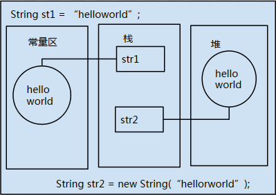
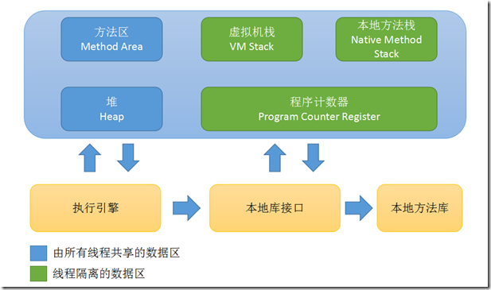
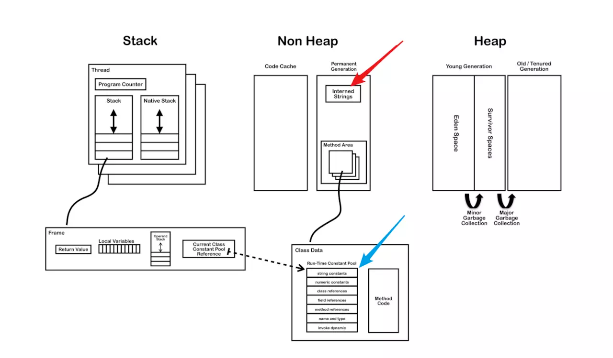

::: tip
字符串操作在编程中我们会大量使用,所以掌握字符串相关类对我们来说很重要.
Java为我们提供了 3 种操作字符串的类.由于 `String` 类的特殊,有必要了解一下Java运行时内存的概念,才能更好的理解字符串相关类的底层操作.
:::

<!-- more -->

## Java中内存知识

[👈 **相关面试题**](./README.md#_51-👉-string-stringbuffer-stringbuilder-的区别)

在反射中我们学到,对于每一个被JVM加载到内存中的类,都会在方法区保存一份这个类的信息;
包括:

- 类的基本信息
	- 类的全名,直接父类的全民
	- 该类的接口
	- 该类的访问修饰符
- 类的详细信息
	-  运行时常量池  --> 字符串,常量,类名和方法名常量.
	-  字段信息  --> 字段名,类型,修饰符
	-  方法信息  --> 方法名,返回值类型,参数类型,修饰符,异常,方法的字节码
	-  静态变量  --> 在方法区中的静态区保存被类的所有实例共享的变量和静态快
	-  到类classloader的引用
	-  到类class的引用   JVM为每一个被加载到内存的类型创建一个class实例,用实例代表这个被加载的类

由此引出反射的概念:
在加载类的时候,加入方法区的所有信息,最后都会影城Class类的实例,代表这个被加载的类.方法去中的所有信息,都是可以通过这个Class类对象反射得到.

### Java运行时数据区的划分

- 程序计数器(Program Counter Register)
- 本地方法栈 (Native Method Stacks)
- Java虚拟机栈 (Java Visual Machine Stacks)
	- 局部变量,引用名等保存在栈中
	- 不共享,每个线程会有属于自己的栈
- Java堆 (Java Heap)
	- 被`new` 关键字所创建出来的所有实例对象
	- 被各个线程共享
- 方法区 (Method Area)
	- 被各个线程共享
	- 存储类信息,常量,静态变量,以及编译后的代码等数据

## String类

### String类的声明

`public final class String extends Object implements Serializable, Comparable<String>, CharSequence`
String类声明中,是被final修饰,所以可以看出字符串的内容是不可变的,而且是不能被继承的类;一旦一个String对象被创建,包含在这个对象中的内容是不可改变的,直至这个对象被回收;
其实String类在底层就是通过字符数组来实现的,对于数组,我们知道它的长度不可变,自然而然的String类也不可变了.

### String类在内存中的表现形式

1. 隐式创建
`String str1 = "helloworld";`
	- 在栈中声明一个str1的引用,然后在**常量区**中查找是否有"helloworld"这个常量;
		- 如果有,则直接返回一个引用给str1;
		- 如果没有,则先在常量区中创建 'helloworld"字符串,然后返回引用;
2. 显式创建
`String str2 = new String("张三");`
	- 在栈中声明一个str2的引用,然后在**堆**中创建一个字符串对象,里面的值是"张三";
	- 返回这个对象的引用;
	

然后我们可以通过 对象调用String类的方法,但是问题来了, `"helloworld".toCharArray()` 这句代码不会报错,说明`"helloworld"`可以当一个对象来使用,那么堆中的`"helloworld"`和常量池中的`"helloworld"`是什么关系呢?
那就让我们来说说他们2个之间不得不说的故事.

```java
// helloworld在常量区中
String str1 = "helloworld";
// 对象在堆中
String str2 = new String("helloworld");
```



对于上面2行代码,会在不同的区域创建2个对象.

- 执行第一行时,
	- 在栈中声明一个str1的引用,然后在**常量区**中查找是否有"helloworld"这个常量;
		- 如果有,则直接返回一个引用给str1;
		- 如果没有,则先在常量区中创建 'helloworld"字符串,然后返回引用;
- 执行第二行时,会在堆中创建一个字符串对象,这个对象的值为`"helloworld"`,然后再去常量区参看是否有`"helloworld"`这个常量字符串;
	- 如果没有,就在常量区创建一个`"helloworld"`字符串常量,然后与这个对象关联;
	- 如果有,则把常量区的`"helloworld"`引用同堆中对象关联起来;

无论如何,只要用new关键字实例化一个个字符串对象,都会在堆中创建实例,而隐式创建的话则不一定新建一个字符串常量;

那么问题来了
`String str2 = new String("helloworld");`会在内存中创建几个对象,几个引用?
答案是3个对象,2个引用;

- 对象 
	- String这个类的对象(反射机制)
	- String实例化对象 (堆中)
	- 常量区中的字符串对象
- 引用
	- 堆中字符串对象的引用
	- 常量区中字符串的引用

我们可以通过String类的intern()方法来实验一下
当调用 intern 方法时, 如果常量池中已经包含一个等于此 String 对象的字符串(用 equals(Object) 方法确定), 则返回池中的字符串.否则, 将此 String 对象添加到池中, 并返回此 String 对象的引用

```java
public static void main (String[] args) {
    String s1 = "osEye.net";
    String s2 = new String ("osEye.net");
    if (s1 == s2) {
        System.out.println ("字符串引用s1和字符串引用s2所指向的是同一个对象");
    } else {
        System.out.println ("字符串引用s1和字符串引用s2所指向的不是同一个对象");
        if (s1.intern() == s2.intern() ) {
            System.out.println ("字符串引用s1和字符串引用s2在字符串常量池中联系的是同一个对象");
        } else {
            System.out.println ("字符串引用s1和字符串引用s2在字符串常量池中联系的不是同一个对象");
        }
    }
}
```
>输出
>字符串引用s1和字符串引用s2所指向的不是同一个对象
>字符串引用s1和字符串引用s2在字符串常量池中联系的是同一个对象

这种机制很好的实现了共享和节省内存空间,当我需要使用字符串时,如果内存中有这个字符串了,就不会再创建,而是直接返回已存在的字符串的引用.

对于
`String s = "hello" + "world"` 的分析
在JDK1.5之前,这条语句会生成2个字符串常量,
但是在JDK1.5之后,编译器对此做出了优化,最终只有一个字符串常量"helloworld"存入常量区中.
这种优化就是默认的调用了StringBuilder.append()方法;

### String类的使用
介绍几个常用的字符串操作的方法

- `charAt(int index)`  返回指定索引处的 char 值.
- `equals(Object anObject)` 将此字符串与指定的对象比较.
- `equalsIgnoreCase(String anotherString)`  将此 String 与另一个 String 比较, 不考虑大小写
- `indexOf(int ch)`  返回指定字符在此字符串中第一次出现处的索引.
- `length()` 返回此字符串的长度.
- `matches(String regex)` 告知此字符串是否匹配给定的正则表达式.
- `replace(char oldChar, char newChar)` 返回一个新的字符串, 它是通过用 newChar 替换此字符串中出现的所有 oldChar 得到的.
- `split(String regex)`  根据给定正则表达式的匹配拆分此字符串.
- `substring(int beginIndex)` 返回一个新的字符串, 它是此字符串的一个子字符串.
- `trim()` 返回字符串的副本, 忽略前导空白和尾部空白.
- `toCharArray()` 将此字符串转换为一个新的字符数组.

判断是否为空字符串
s != null && s != "";
**注意**判断不能为空必须放在前面,因为可能会报空指针异常


## 不可变性

简单的来说:String 类中使用 final 关键字字符数组保存字符串, `private　final　char　value[]`, 所以 String 对象是不可变的.而StringBuilder 与 StringBuffer 都继承自 AbstractStringBuilder 类, 在 AbstractStringBuilder 中也是使用字符数组保存字符串`char[] value` 但是没有用 final 关键字修饰, 所以这两种对象都是可变的.

StringBuilder 与 StringBuffer 的构造方法都是调用父类构造方法也就是 AbstractStringBuilder 实现的, 大家可以自行查阅源码.

AbstractStringBuilder.java

```java
abstract class AbstractStringBuilder implements Appendable, CharSequence {
    char[] value;
    int count;
    AbstractStringBuilder() {
    }
    AbstractStringBuilder(int capacity) {
        value = new char[capacity];
    }
```

## 线程安全性

String 中的对象是不可变的, 也就可以理解为常量, 线程安全.AbstractStringBuilder 是 StringBuilder 与 StringBuffer 的公共父类, 定义了一些字符串的基本操作, 如 expandCapacity、append、insert、indexOf 等公共方法. StringBuffer 对方法加了同步锁或者对调用的方法加了同步锁, 所以是线程安全的. StringBuilder 并没有对方法进行加同步锁, 所以是非线程安全的.
　　

**性能**

每次对 String 类型进行改变的时候, 都会生成一个新的 String 对象, 然后将指针指向新的 String 对象. StringBuffer 每次都会对 StringBuffer 对象本身进行操作, 而不是生成新的对象并改变对象引用.相同情况下使用 StirngBuilder 相比使用 StringBuffer 仅能获得 10%~15% 左右的性能提升, 但却要冒多线程不安全的风险.

**对于三者使用的总结:** 
1. 操作少量的数据 = String
2. 单线程操作字符串缓冲区下操作大量数据 = StringBuilder
3. 多线程操作字符串缓冲区下操作大量数据 = StringBuffer

####  String 为什么是不可变的
简单来说就是 String 类利用了 final 修饰的 char 类型数组存储字符, 源码如下图所以:

```java
/** The value is used for character storage. */
private final char value[];
```

####  String 真的是不可变的吗？
我觉得如果别人问这个问题的话, 回答不可变就可以了.
下面只是给大家看两个有代表性的例子:

**1) String 不可变但不代表引用不可以变**

```java
String str = "Hello";
str = str + " World";
System.out.println("str = " + str);
```
结果:
```
str = Hello World
```
解析:

实际上, 原来 String 的内容是不变的, 只是 str 由原来指向 "Hello" 的内存地址转为指向 "Hello World" 的内存地址而已, 也就是说多开辟了一块内存区域给 "Hello World" 字符串.

**2) 通过反射是可以修改所谓的“不可变”对象**

```java
// 创建字符串"Hello World",  并赋给引用s
String s = "Hello World";
System.out.println("s = " + s); // Hello World
// 获取String类中的value字段
Field valueFieldOfString = String.class.getDeclaredField("value");
// 改变value属性的访问权限
valueFieldOfString.setAccessible(true);
// 获取s对象上的value属性的值
char[] value = (char[]) valueFieldOfString.get(s);
// 改变value所引用的数组中的第5个字符
value[5] = '_';
System.out.println("s = " + s); // Hello_World
```

结果:

```
s = Hello World
s = Hello_World
```

解析:

用反射可以访问私有成员,  然后反射出  String 对象中的 value 属性,  进而改变通过获得的 value 引用改变数组的结构.但是一般我们不会这么做, 这里只是简单提一下有这个东西.

---------

## StringBuffer 类

- 为了能让 String 里面的内容能够改变,所以用 StringBuffer 类封装了 String 类;
- 使用 append() 方法向字符串末尾添加字符串,
- 线程安全的,效率比 String 高
- 经常使用在字符串拼接的地方,比如说数据库语句

## StringBuilder 类

### 与 StringBuffer 类的对比

```java
// StringBuffer 类的 append() 方法
public synchronized StringBuffer append(String str){
	super.append(str);
	return this;
}

// StringBuilder 类的 append() 方法
public StringBuilder append(String str){
	super.append(str);
	return this;
}
```
StringBuilder 是线程不安全的,效率比 StringBuffer 高,在不考虑线程安全的时候优先考虑使用 StringBuilder.

## 3 种字符串对比

- 异同点
	- 都是 `final` 类,都不允许被继承;
	- `String` 长度不可改变,其他 2 种长度可变;
	- `StringBuffer` 是线程安全的,但是效率低, `StringBuilder` 线程不安全但是效率高
	- 性能: `StringBuilder > StringBuffer > String`
	- String 覆盖了 equals 方法和 hashCode 方法, 而 StringBuffer,StringBuilder 没有覆盖 equals 方法和 hashCode方法, 所以将 StringBuffer,StringBuilder 对象存储进 Java 集合类中时会出现问题.

- 使用策略
	- 基本原则:
		- 如果操作少量的数据,用 `String` ;
		- 单线程操作大量数据,使用 `StringBuilder` ;
		- 多线程操作大量数据,使用 `StringBuffer` ;
	- 不建议使用 `String` 类的 "+" 进行频繁的字符串拼接,而是使用 `StringBuilder` 或者 `StringBuffer` 类;
	- `StringBuilder` 一般使用在方法内部来完成类似"+"功能, 因为线程安全,用完后丢弃;
	- `StringBuffer` 主要用在全局变量中;
	- 相同情况下使用  `StirngBuilder`  相比使用 ` StringBuffer`  仅能获得 10%~15% 左右的性能提升, 但却要冒多线程不安全的风险. 而在现实的模块化编程中, 负责某一模块的程序员不一定能清晰地判断该模块是否会放入多线程的环境中运行, 因此:除非确定系统的瓶颈是在  `StringBuffer`  上, 并且确定你的模块不会运行在多线程模式下, 才可以采用 `StringBuilder` ;否则还是用 `StringBuffer` .
	
### 怎么向 Set 中存入相同的字符串

由于 StringBuilder 和 StringBuffer 都未重写 equals() 和 hashCode(), 因此可以使用 StringBuilder 或 StringBuffer 创建相同的字符串存入 Set 中

```java
@Test
public void test3(){
    StringBuffer stringBuffer1 = new StringBuffer("123");
    StringBuffer stringBuffer2 = new StringBuffer("123");
    StringBuilder stringBuilder1 = new StringBuilder("123");
    StringBuilder stringBuilder2 = new StringBuilder("123");
    Set<CharSequence> stringBuffers = new HashSet<>();
    stringBuffers.add(stringBuffer1);
    stringBuffers.add(stringBuffer2);
    stringBuffers.add(stringBuilder1);
    stringBuffers.add(stringBuilder2);
    System.out.println(stringBuffers.size()); // 4
}
```

### 在 Java 虚拟机中, 字符串常量到底存放在哪里

前阵子和朋友讨论一个问题: 字符串常量归常量池管理, 那比如 `String str = "abc";`  "abc" 这个对象是放在内存中的哪个位置, 是字符串常量池中还是堆？

这句代码的 abc 当然在常量池中, 只有 `new String("abc")` 这个对象才在堆中创建“, 他们大概是这么回答.

"abc" 这个东西, 是放在常量池中, 这个答案是错误的.

**字符串 "abc" 的本体、实例, 应该是存在于Java堆中.**

可能还真的有部分同学对这个知识点不熟悉, 今天和大家聊聊字符串这个问题 ~

初学 Java 时, 学到字符串这一部分, 有一段代码

```java
String str1 = "hello";
String str2 = new String("hello"); 
```

> 书上的解释是:执行第一行的时候, 已经把 "hello" 字符串放到了常量池中, 执行第二行代码时, 会将常量池中已经存在的 "hello" 复制一份到堆内存中, 创建一个的新的 String 对象.虽然值一样, 但他们是不同的对象.

当时看完这个解释, 我产生了很多疑惑.因为在此之前已经知道字符串的底层是 char 数组实现的.我很疑惑:

* 他 copy 一份过去, 是 copy 了 char 数组?
* 还是 copy 整个 String 对象？
* "hello" 这个对象实例真的存放在常量池中？

当时在网上搜了一些文章和答案, 各有说辞, 大部分回答都是 "str" 这个对象在常量池中, 但也有认为字符串常量实例(或叫对象)是在堆中创建, 只是将其引用放到字符串常量池中, 交给常量池管理.

## Java 内存区域 — 运行时数据区

理清这个问题前, 需要梳理一下前置知识.

从一个经典的示意图讲起, 以 hotspot 虚拟机为例, 此内存模型需建立在 JDK1.7 之前的版本来讨论, JDK1.7 之后有所改变, 但是原理还是一样的.



Java虚拟机管理的内存是运行时数据区那一部分, 简单概括一下其中各个区域的区别:

* **虚拟机栈**:线程私有, 生命周期与线程相同, 即每条线程都一个独立的栈(VM Stack).每个方法执行时都会创建一个栈帧, 也就是说, 当有一个线程执行了多个方法时, 就会有一个栈, 栈中有多个栈帧.

* **本地方法栈**:线程私有

* **程序计数器**:线程私有

* **堆Heap**:线程共享, 是 Java 虚拟机所管理的内存中最大的一块, 在虚拟机启动时创建.此内存区域的唯一目的就是存放对象实例, 几乎所有的对象实例都在这里分配内存.**在 Java 虚拟机规范中的描述是:所有的对象实例以及数组都要在堆上分配.** *(原文:The heap is the runtime data area from which memory for all class instances and arrays is allocated)*但有特殊情况, 随着 JIT 编译器的发展, 逃逸分析和标量替换技术的逐渐成熟, 对象也可以在**栈上**分配.另外, 虽说堆是线程共享, 但其中也可以划分出多个线程私有的分配缓冲区*(Thread Local Allocation Buffer, TLAB)*.

* **方法区**:线程共享, 它用于存储已被虚拟机加载的**类信息、常量、静态变量、即时编译器编译后的代码等数据**.

## Java 的三种常量池

此外, Java 有三种常量池, 即**字符串常量池(又叫全局字符串池)、class文件常量池、运行时常量池**.



**1. 字符串常量池(也叫全局字符串池、string pool、string literal pool)**

字符串常量池在每个VM中只有一份, 他在内存中的位置如图, 红色箭头所指向的区域 Interned Strings

**2. 运行时常量池(runtime constant pool)**

当程序运行到某个类时, class 文件中的信息就会被解析到内存的**方法区**里的**运行时常量池**中. 看图可清晰感知到每一个类被加载进来都会产生一个**运行时常量池**, 由此可知, **每个类都有一个运行时常量池**. 它在内存中的位置如图, 蓝色箭头所指向的区域, 方法区中的 Class Date 中的运行时常量池(Run-Time Constant Pool)


**3. class 文件常量池(class constant pool)**

class 常量池是在编译后每个class文件都有的, class 文件中除了包含类的版本、字段、方法、接口等描述信息外, 还有一项信息就是 ***常量池****(constant pool table)*, 用于存放编译器生成的各种字面量(Literal)和符号引用(Symbolic References).*字面量就是我们所说的常量概念, 如文本字符串、被声明为final的常量值等.*他在 class 文件中的位置如上图所示, Constant Pool 中.

## 个人理解

```java
public static void main(String[] args) {
	String str = "hello";
}
```

回到一开始说到的这句代码, 可以来总结一下它的执行过程了.

1. 首先, 字面量 "hello" 在编译期, 就会被记录在 class文件的 **class 常量池**中.
2. 而当 class文件被加载到内存中后, JVM 就会将 class 常量池中的**大部分内容存放到运行时常量池**中, 但是**字符串 "hello" 的本体**(对象)和其他所有对象一样, 是**会在堆中创建**, **再将引用放到字符串常量池**, 也就是图一的 Interned Strings的位置.(RednaxelaFX 的文章里, 测试结果是在新生代的Eden区.但因为一直有一个引用驻留在字符串常量池, 所以不会被GC清理掉)
3. 而到了 `String str = "hello"` 这步, JVM 会去字符串常量池中找, 如果找到了, JVM 会在栈中的局部变量表里创建str 变量, 然后把字符串常量池中的(hello 对象的)**引用**赋值给 str 变量.

在《深入理解Java虚拟机》这本书中也有字符串相关的解释, 举其中几个例子:

**例子1**

> (原文)运行时常量池(Runtime Constant Pool)是方法区的一部分.Class文件中除了有类的版本、字段、方法、接口等描述信息外, 还有一项信息是常量池(Constant Pool Table), 用于存放编译期生成的各种字面量和符号引用, **这部分内容将在类加载后进入方法区的运行时常量池中存放.**

最后一句描述不太准确, 编译期生成的各种字面量并不是全部进入方法区的运行时常量池中.**字符串字面量就不进入运行时常量池**, 而是**在堆中创建了对象**, **再将引用驻留到字符串常量池中.**

**例子2**

```java
//代码清单2-7&emsp;String.intern()返回引用的测试

public class RuntimeConstantPoolOOM{

	public static void main(String[]args){
		String str1 = new StringBuilder("计算机").append("软件").toString();
		System.out.println(str1.intern() == str1);
		String str2 = new StringBuilder("ja").append("va").toString();
		System.out.println(str2.intern() == str2);
	}
}
```

::: tip 原文
这段代码在JDK 1.6中运行, 会得到两个false, 而在JDK 1.7中运行, 会得到一个true和一个false.
产生差异的原因是: 在JDK 1.6中, intern() 方法会把首次遇到的字符串实例复制到永久代中, 返回的也是永久代中这个字符串实例的引用, 而由 StringBuilder 创建的字符串实例在 Java 堆上, 所以必然不是同一个引用, 将返回false.而JDK 1.7(以及部分其他虚拟机, 例如 JRockit) 的 intern() 实现不会再复制实例, 只是在常量池中记录首次出现的实例引用, 因此 intern() 返回的引用和由 StringBuilder 创建的那个字符串实例是同一个.对 str2 比较返回 false 是因为 “java” 这个字符串在执行 StringBuilder.toString() 之前已经出现过, 字符串常量池中已经有它的引用了, 不符合“首次出现”的原则, 而“计算机软件”这个字符串则是首次出现的, 因此返回true.
:::

原文解释也不太准确, 我觉得在 JDK 1.6中, intern() 并不会把首次遇到的字符串实例复制到永久代中, 而是会将实例再复制一份到堆(heap)中, 然后将其引用放入字符串常量池中进行管理, 所以此代码返回 false.而JDK1.7中的 intern()不会再复制实例, 直接将首次遇到的此字符串实例的引用, 放入字符串常量池, 于是返回 true. 关于此观点, 还没看到大神文章实锤, 欢迎讨论.

最后再延伸一点, 大家都知道, 字符串的 value 是 final 修饰的 char 数组, 那么以下这段代码:

```java
// private final char value[];
String str1 = "hello world";
String str2 = new String("hello world");
String str3 = new String("hello world");
```

str1、str2、str3 三个变量所指向的都是不同的对象.(str1 != str2 != str3)

那么, 这三个对象里的 char 数组是否是同一个数组？相信大家都有答案了.

* * *

此文所讨论的 Java 内存模型是建立在 JDK1.7 之前. JDK 7 开始 Hotspot 虚拟机把字符串常量池 (Interned String位置) 从永久代(PermGen) 挪到 Heap 堆, JDK 8 又彻底取消 PermGen, 把诸如 class 之类的元数据都挪到 GC 堆之外管理. 但不管怎样, 基本原理还是不变的, 字面量 "hello" 等依旧不是放在 Interned String 中.

* * *

**推荐文章:**

* [请别再拿 “String s = new String("xyz"); 创建了多少个String实例” 来面试了吧](https://link.juejin.im/?target=https%3A%2F%2Frednaxelafx.iteye.com%2Fblog%2F774673)
* [借 HSDB 来探索HotSpot VM的运行时数据](https://link.juejin.im/?target=https%3A%2F%2Frednaxelafx.iteye.com%2Fblog%2F1847971) *作者:RednaxelaFX, 曾为《深入理解Java虚拟机》提推荐语*
* [Java 用这样的方式生成字符串: String str = "Hello" , 到底有没有在堆中创建对象？](https://link.juejin.im/?target=https%3A%2F%2Fwww.zhihu.com%2Fquestion%2F29884421%2Fanswer%2F113785601) - 胖君的回答 - 知乎

[👈 **相关面试题**](./README.md#_51-👉-string-stringbuffer-stringbuilder-的区别)