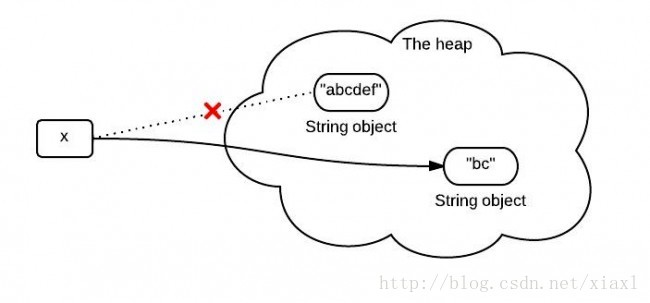
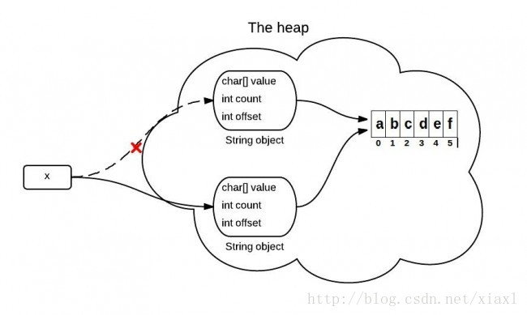
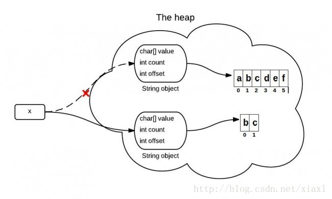

# JDK6 和JDK7 中 substring 的原理及区别
  
转一篇不错的文章, 原文地址如下: 
[http://www.hollischuang.com/archives/1232](http://www.hollischuang.com/archives/1232)

`substring(int beginIndex, int endIndex)` 方法在**jdk 6**和**jdk 7**中的实现是不同的.
了解他们的区别可以帮助你更好的使用他.
为简单起见, 后文中用substring()代表`substring(int beginIndex, int endIndex)`方法.

## substring() 的作用

`substring(int beginIndex, int endIndex)`方法截取字符串并返回其[beginIndex,endIndex-1]范围内的内容.

```
String x = "abcdef";
x = x.substring(1,3);
System.out.println(x);
```

输出内容:

```
bc
```

## 调用substring()时发生了什么？

你可能知道, 因为x是不可变的, 当使用x.substring(1,3)对x赋值的时候, 它会指向一个全新的字符串:



然而, 这个图不是完全正确的表示堆中发生的事情.因为在jdk6 和 jdk7中调用substring时发生的事情并不一样.

## JDK 6中的substring

String是通过字符数组实现的在jdk 6 中, String类包含三个成员变量:`char value[],  int offset, int count`.他们分别用来存储真正的字符数组, 数组的第一个位置索引以及字符串中包含的字符个数.

当调用substring方法的时候, 会创建一个新的string对象, 但是这个string的值仍然指向堆中的同一个字符数组.这两个对象中只有count和offset 的值是不同的.



下面是证明上说观点的Java源码中的关键代码:

```
//JDK 6
String(int offset, int count, char value[]) {
  this.value = value;
  this.offset = offset;
  this.count = count;
}

public String substring(int beginIndex, int endIndex) {
  //check boundary
  return  new String(offset + beginIndex, endIndex - beginIndex, value);
}
```

## JDK 6中的substring导致的问题

如果你有一个很长很长的字符串, 但是当你使用substring进行切割的时候你只需要很短的一段.这可能导致性能问题, 因为你需要的只是一小段字符序列, 但是你却引用了整个字符串（因为这个非常长的字符数组一直在被引用, 所以无法被回收, 就可能导致内存泄露）.在JDK 6中, 一般用以下方式来解决该问题, 原理其实就是生成一个新的字符串并引用他.

```
x = x.substring(x, y) + ""
```

## JDK 7 中的substring

上面提到的问题, 在jdk 7中得到解决.在jdk 7 中, substring方法会在堆内存中创建一个新的数组.



Java源码中关于这部分的主要代码如下:

```
//JDK 7
public String(char value[], int offset, int count) {
  //check boundary
  this.value = Arrays.copyOfRange(value, offset, offset + count);
}

public String substring(int beginIndex, int endIndex) {
  //check boundary
  int subLen = endIndex - beginIndex;
  return new String(value, beginIndex, subLen);
}
```
  
  
