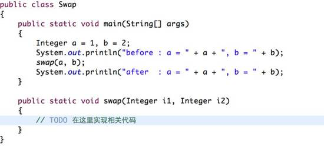
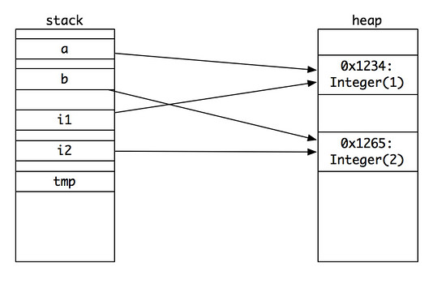
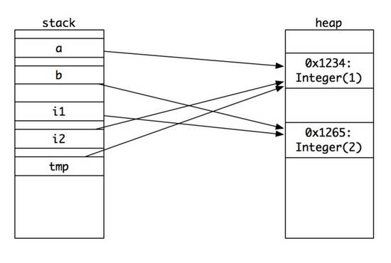
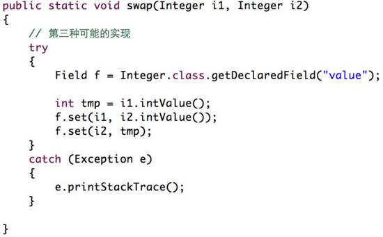
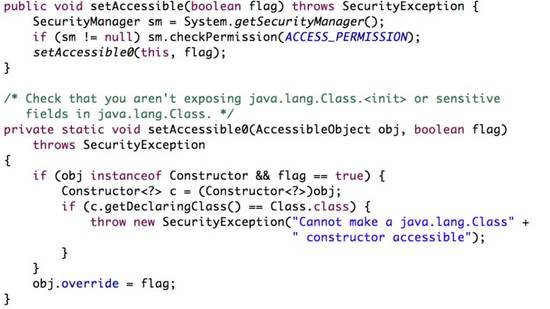
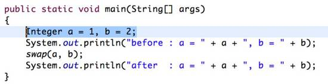
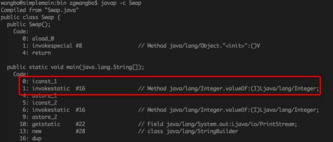
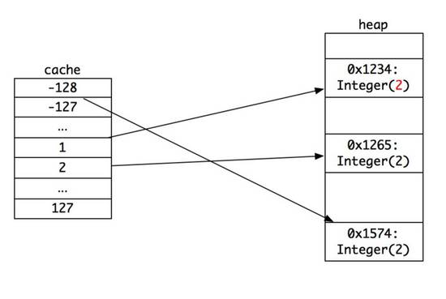
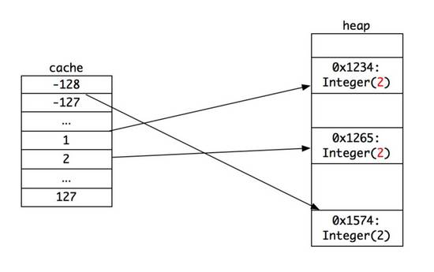
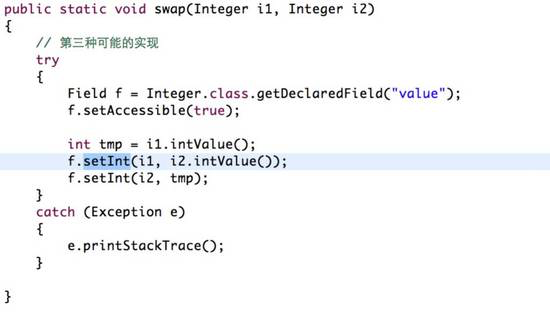

# 一个简单代码的不简单实现

前几天看有人贴了一个 java 代码的问题, 实在有意思, 今天拿出来和大家分享分享.题目是这样的:给定两个 Integer 类型的变量 a 和 b , 要求实现一个函数 swap , 交换他们的值.代码如下:



==== 想一想的分割线 ====

大家用 30 秒钟想想怎么样实现呢？

==== 时间到的分割线 ====

估摸着好多盆友一看这个题目, 第一反应是:擦, 这么简单的题, 让我来做, 是不是在侮辱我的智商！！！

#### 最简单的实现:

这题目初看一眼, 确实好简单, 可能只需要 10 秒钟就可以完成（主要时间花在打字上）:


好了, 这就是实现代码, 三行！那我们来看看结果:

```
before : a = 1, b = 2
after : a = 1, b = 2
```

怎么样, 这个结果你猜对了嘛？就是完全没有交换.那是为什么呢？老王画了一张图:



在我们的 main 函数里, 有两个对象变量 a 和 b , 他们分别指向堆上的两个 Integer 对象, 地址分别为: 0x1234 和 0x1265 , 值分别为 1 和 2 .在 java 里,  Object a = new Object() 这句话执行类似于 c++ 里面的 CObj* c = new CObj() , 这里 a 和 c 实际都是指针（ java 称做引用）,  a 和 c 的值, 实际是一个内存地址, 而不是 1 、 2 、 3 这样的具体的数字.

所以, 在做 swap 函数调用的时候, 传递的是值, 也就是 i1 得到的 a 的值:一个内存地址, 指向 0x1234 .同理,  i2 得到的也是 b 的值:另外一个内存地址: 0x1265 .

好了, 现在 swap 入栈,  i1 、 i2 、 tmp 都是指针:

tmp = i1; // tmp 得到 i1 的值: 0x1234
i1  = i2; // i1 得到 i2 的值: 0x1265
i2  = tmp; // i2 得到 tmp 的值: 0x1234

可以看到, 在 swap 里面,  i1 和 i2 做了一个指针交换, 最后的结果如下:



最终,  a 和 b 还是指向对应的内存区域, 而这个内存区域的值还是不变.所以,  swap 这个函数等于啥都没干, 完全是浪费表情 ...

那这个题目似乎看起来就是无解的, 对嘛？（谁这么无聊搞一个无解的题目来浪费表情！！！）

#### 换值, 解题的曙光:

在准备放弃之前, 我们发现了有一个解法似乎可以做:如果把地址 0x1234 和 0x1265 中的值 1 和 2 对换,  a 和 b 的值就变化了, 对吧！

那我们就聚焦到用什么方法可以改变这个值呢？

如果 Integer 提供一个函数, 叫做 setIntValue(int value) , 那就万事大吉了.我们可以实现这样的代码:

```java
public **static ****void **swap(Integer i1, Integer i2) {
// 第二种可能的实现
    **int **tmp = i1. getIntValue ( )
    i1.setIntValue(i2. getIntValue ());
    i2. setIntValue ( tmp );
}
```

于是, 我们就去查阅 java.lang.Integer 的代码实现.可惜的是, 他没有这个函数 ... 我们的梦想、我们的曙光, 就这样破灭了 ...

#### 反射, 又燃起新的曙光:

在我们快要绝望的时候, 我们突然发现了这个东东:

```java
private **final ****int**value ;
```

java 的 Integer 实现, 实际内部将整数值存放在一个叫 int 类型的 value 变量里.他虽然有 get 函数, 但是却没有 set 函数.因为他是 final 的（不可修改）！

那怎么办呢？哦, 我们差点忘了 java 里有一个神器:反射！我们可以用反射把取到这个变量, 并赋值给他, 对吧！



于是, 我们写下了如上的代码.我们从 Integer 类里面, 取出 value 这个属性, 然后分别设置上对应的值.哈哈哈, 这下总该完美了吧！ run 一把:


sad... 我们得到了这样的异常:私有的、 final 的成员是不准我们访问的！

看起来似乎真的没办法了.

#### 老王的绝杀:

这时候, 老王从口袋里掏出了以前存起来的绝杀武器:反射访问控制变量:

AccessibleObject.setAccessible( **boolean **flag)

Field 这个类是从 AccessibleObject 集成下来的, 而 AccessibleObject 提供了一个方法, 叫做 setAccessible , 他能让我们改变对于属性的访问控制.



他会将 override 变量设置为我们想要的值, 然后在 Field 类里面:


只要这个 override 的只被设置成 true , 我们就可以顺利调用 set 函数啦, 于是, 我们就简单改一下实现代码:


就只加了这一句话, 我们就成功了！哈哈哈哈！！！ 来看结果吧:

before : a = 1, b = 2

after  : a = 2, b = 2

等等等等,  好像 a 已经变了, 但是 b 似乎还没变！ 这是怎么搞的？同样的实现方法,  a 变了,  b 没变, 完全说不通啊, 难道 java 虚拟机出问题了？这个时候, 心里真是一万头草泥马奔过 ...

看似只差一步, 实际还有万里之遥:

那问题到底出在哪儿呢？那我们重头开始看看这段代码.



在函数的一开始, 我们就定义了两个变量: Integer a = 1; Integer b = 2; 这里 1 和 2 是主类型, 换句话说他们是 int 类型, 而 a 和 b 是 Integer 类型. 他们是等价的嘛？回答是: NO ！！！

#### 装箱

那如果类型不等价, 为啥编译的时候不出错呢？这里就要谈到一个 java 编译器的一个特性:装箱.这个是个什么东东？

按道理说, 我们给 a 赋值的时候, 应该是这样写: Integer a = new Integer(1) , 这才是标准的写法, 对吧.不过这样写多麻烦啊, 于是,  java 编译器给大家做了一个方便的事儿, 就是你可以 Integer a = 1 这样写, 然后由编译器来帮你把剩下的东西补充完整（ java 编译器真是可爱, 他还有很多其他的糖衣, 以后有机会老王专门来介绍）.

那编译器给我们做了什么事情呢？难道是:

a = 1 === 编译 ===> a = new Integer(1) ？

老王最初也认为是这样的, 不过后来发现, 错了, 他做的操作是:

a = 1 === 编译 ===> a = Integer.valueOf(1)

上面这个过程像不像把 1 这个 int 类型放入到 Integer 的箱子里呢？

这是怎么确认的呢？很简单, 我们用 javap 来查看编译后的 Swap.class 代码即可:



看, 我们的 main 函数第一行, 定义 Integer a = 1 , 实际上是做了 Integer a = Integer.valueOf(1) .这个确实是让人出乎意料.那这个函数做了什么事情呢？


这个函数的参数是一个 int , 然后如果这个 int 在 IntegerCache 的 low 和 high 之间, 就从 IntegerCache 里面获取, 只有超出这个范围, 才新建一个 Integer 类型.


这是 IntegerCache 的实现, 默认在 -128 和 127 之间的数, 一开始就被新建了, 所以他们只有一个实例.老王画了下面的示意图（为了让大家看的清楚, 没有画完所有的内存）


我们可以这样来验证:

Integer i1 = 1;

Integer i2 = 1;

Integer i3 = 128;

Integer i4 = 128;

System. *out *.println(i1 == i2);

System. *out *.println(i3 == i4);

大家猜到答案了么？ 结果是: true ,  false

因为 Integer i1 = 1; 实际是 Integer i1 = Integer.valueOf(1) , 在 cache 里, 我们找到了 1 对应的对象地址, 然后就直接返回了；同理,  i2 也是 cache 里找到后直接返回的.这样, 他们就有相同的地址, 因而双等号的地址比较就是相同的. i3 和 i4 则不在 cache 里, 因此他们分别新建了两个对象, 所以地址不同.

好了, 做了这个铺垫以后, 我们再回到最初的问题, 看看 swap 函数的实现.


这个函数的入参: i1 和 i2 分别指向 a 和 b 对应的内存地址, 这个时候, 将 i1 的值（也就是 value ）传递给 int 型的 tmp , 则 tmp 的值为整数值 1 , 然后我们想把 i2 的整数值 2 设置给 i1 : f.set(i1, i2.intValue()); 这个地方看起来很正常吧？

我们来看看这个函数的原型吧: **public ****void **set(Objectobj, Object value) 他需要的传入参数是两个 Object , 而我们传入的是什么呢？ Integer 的 i1 , 和 int 的 i2.intValue() .对于第一个参数, 是完全没问题的；而第二个参数, 编译器又给我们做了一次装箱, 最终转化出来的代码就像这样:

i1.value = Integer.valueOf(i2.intValue()).intValue();

那我们手动执行一下, 

a 、 i2.intValue() -> 2

b 、 Integer.valueOf(2) -> 0x1265

c 、 0x1265.intValue() -> 2

d 、 i1.value -> 2

所以这个时候, 内存里的数据就是这样的了: **0x1234 ****被改成 ****2 ****了！！！**



接着, 我们执行下一句: f.set(i2, tmp); 按照上面的步骤, 我们先展开:

i2.value = Integer.valueOf(tmp).intValue();

这里 tmp 等于 1 , 于是分步执行如下:

a 、 Integer.valueOf(1) -> 0x1234

b 、 0x1234.intValue() -> **2**

c 、 i2.value -> 2

注意步骤 b 的值就是上一步从 1 改成 2 的那个值, 因此最终内存的值就是:



所以, 我们才看到最后 a 和 b 输出的都是 2 .终于终于, 我们分析清楚了结果了 ~~

那要达到最后我们要求的交换, 怎么样修改呢？我们有两种方法

1 、不要让 Integer.valueOf 装箱发挥作用, 避免使用 cache , 因此可以这样写:


我们用 new Integer 代替了 Integer.valueOf 的自动装箱, 这样 tmp 就分配到了一个不同的地址；

2 、我们使用 setInt 函数代替 set 函数, 这样, 需要传入的就是 int 型, 而不是 Integer , 就不会发生自动装箱



so... 问题解决了！

==== 总结的分割线 ====

看看, 就是这么简单的一个代码实现, 却隐藏了这么不简单的实现, 包含了:

1.函数调用的值传递；

2.对象引用的值乃是内存地址；

3. 反射的可访问性；

4.java 编译器的自动装箱；

5. Integer 装箱的对象缓存.
