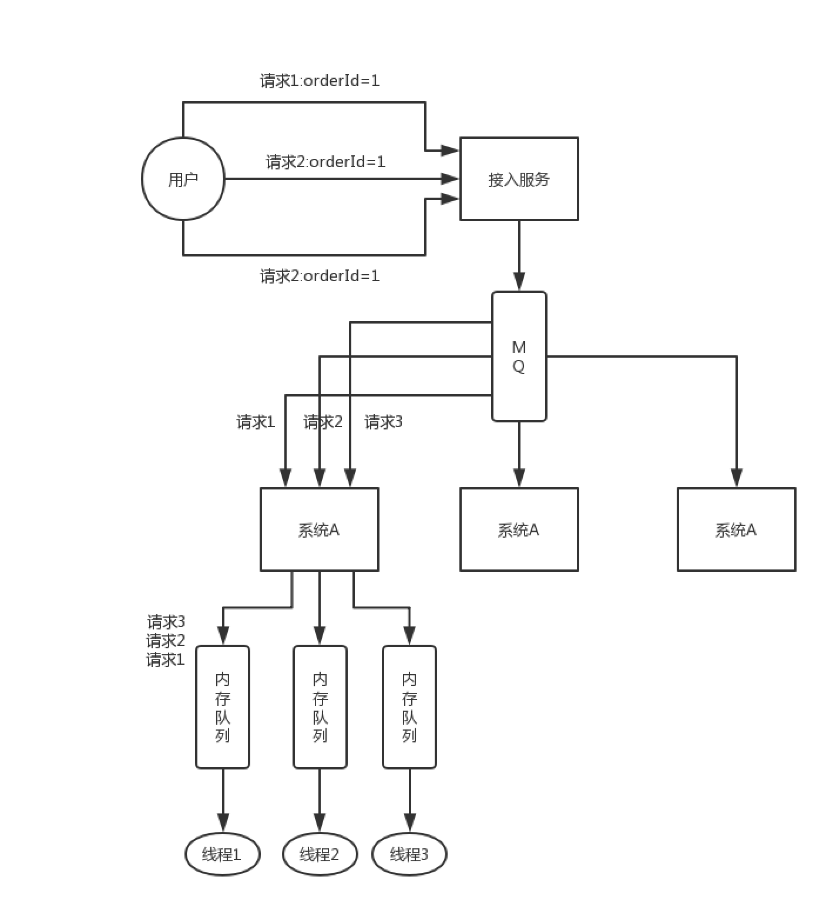

## 分布式服务接口的幂等性如何设计

所谓**幂等性**，就是说一个接口，多次发起同一个请求，你这个接口得保证结果是准确的，比如不能多扣款、不能多插入一条数据、不能将统计值多加了 1。这就是幂等性。

其实保证幂等性主要是三点：

- 对于每个请求必须有一个唯一的标识，举个栗子：订单支付请求，肯定得包含订单 id，一个订单 id 最多支付一次，对吧。
- 每次处理完请求之后，必须有一个记录标识这个请求处理过了。常见的方案是在 mysql 中记录个状态啥的，比如支付之前记录一条这个订单的支付流水。
- 每次接收请求需要进行判断，判断之前是否处理过。比如说，如果有一个订单已经支付了，就已经有了一条支付流水，那么如果重复发送这个请求，则此时先插入支付流水，orderId 已经存在了，唯一键约束生效，报错插入不进去的。然后你就不用再扣款了。

实际运作过程中，你要结合自己的业务来，比如说利用 redis，用 orderId 作为唯一键。只有成功插入这个支付流水，才可以执行实际的支付扣款。

要求是支付一个订单，必须插入一条支付流水，order_id 建一个唯一键 `unique key`。你在支付一个订单之前，先插入一条支付流水，order_id 就已经进去了。你就可以写一个标识到 redis 里面去，`set order_id payed`，下一次重复请求过来了，先查 redis 的 order_id 对应的 value，如果是 `payed` 就说明已经支付过了，你就别重复支付了。

## 分布式服务接口请求的顺序性如何保证

首先，一般来说，个人建议是，你们从业务逻辑上设计的这个系统最好是不需要这种顺序性的保证，因为一旦引入顺序性保障，比如使用**分布式锁**，会**导致系统复杂度上升**，而且会带来**效率低下**，热点数据压力过大等问题。

下面我给个我们用过的方案吧，简单来说，首先你得用 dubbo 的一致性 hash 负载均衡策略，将比如某一个订单 id 对应的请求都给分发到某个机器上去，接着就是在那个机器上，因为可能还是多线程并发执行的，你可能得立即将某个订单 id 对应的请求扔一个**内存队列**里去，强制排队，这样来确保他们的顺序性。

但是这样引发的后续问题就很多，比如说要是某个订单对应的请求特别多，造成某台机器成**热点**怎么办？解决这些问题又要开启后续一连串的复杂技术方案......曾经这类问题弄的我们头疼不已，所以，还是建议什么呢？

最好是比如说刚才那种，一个订单的插入和删除操作，能不能合并成一个操作，就是一个删除，或者是其它什么，避免这种问题的产生。