# 消息中间件

消息队列中间件是分布式系统中重要的组件, 主要解决

1. 应用耦合
2. 异步消息
3. 流量削锋等问题

实现高性能、高可用、可伸缩和最终一致性架构. 
使用较多的消息队列有ActiveMQ、RabbitMQ、ZeroMQ、Kafka、MetaMQ、RocketMQ. 

## 消息队列常见使用场景

### 1. 异步处理

场景说明: 用户注册后, 需要发注册邮件和注册短信. 传统的做法有两种: 串行的方式和并行方式. 

**串行方式**: 将注册信息写入数据库成功后, 发送注册邮件, 再发送注册短信. 以上三个任务全部完成后, 返回给客户. 

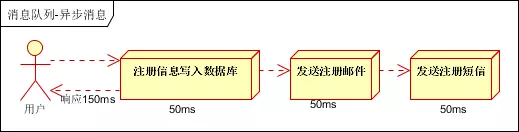

**并行方式**: 将注册信息写入数据库成功后, 发送注册邮件的同时, 发送注册短信. 以上三个任务完成后, 返回给客户端. 与串行的差别是, 并行的方式可以提高处理的时间. 

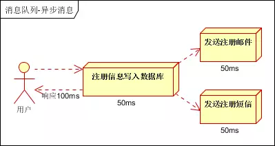

假设三个业务节点每个使用50毫秒钟, 不考虑网络等其他开销, 则串行方式的时间是150毫秒, 并行的时间可能是100毫秒. 

因为CPU在单位时间内处理的请求数是一定的, 假设CPU1秒内吞吐量是100次. 则串行方式1秒内CPU可处理的请求量是7次（1000/150）. 并行方式处理的请求量是10次（1000/100）. 

**小结**: 如以上案例描述, 传统的方式系统的性能（并发量, 吞吐量, 响应时间）会有瓶颈. 如何解决这个问题呢? 

引入消息队列, 将不是必须的业务逻辑, 异步处理. 改造后的架构如下: 

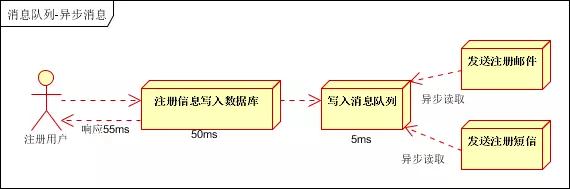

按照以上约定, 用户的响应时间相当于是注册信息写入数据库的时间, 也就是50毫秒. 注册邮件, 发送短信写入消息队列后, 直接返回, 因此写入消息队列的速度很快, 基本可以忽略, 因此用户的响应时间可能是50毫秒. 因此架构改变后, 系统的吞吐量提高到每秒20QPS. 比串行提高了3倍, 比并行提高了两倍! 

### 2. 应用解耦

场景说明: 用户下单后, 订单系统需要通知库存系统. 传统的做法是, 订单系统调用库存系统的接口. 如下图: 

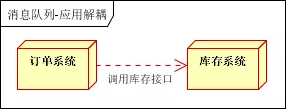

**传统模式的缺点: **

假如库存系统无法访问, 则订单减库存将失败, 从而导致订单失败, 订单系统与库存系统耦合. 

如何解决以上问题呢? 引入应用消息队列后的方案, 如下图: 

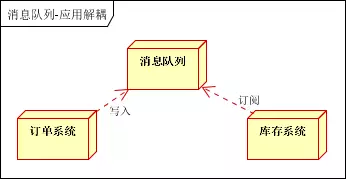

订单系统: 用户下单后, 订单系统完成持久化处理, 将消息写入消息队列, 返回用户订单下单成功

库存系统: 订阅下单的消息, 采用拉/推的方式, 获取下单信息, 库存系统根据下单信息, 进行库存操作

假如: 在下单时库存系统不能正常使用. 也不影响正常下单, 因为下单后, 订单系统写入消息队列就不再关心其他的后续操作了. 实现订单系统与库存系统的应用解耦. 

### 3. 流量削锋

流量削锋也是消息队列中的常用场景, 一般在秒杀或团抢活动中使用广泛! 

应用场景: 秒杀活动, 一般会因为流量过大, 导致流量暴增, 应用挂掉. 为解决这个问题, 一般需要在应用前端加入消息队列. 

可以控制活动的人数, 可以缓解短时间内高流量压垮应用. 

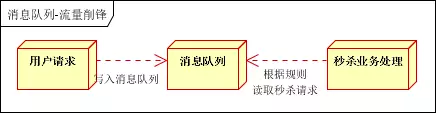

用户的请求, 服务器接收后, 首先写入消息队列. 假如消息队列长度超过最大数量, 则直接抛弃用户请求或跳转到错误页面. 

秒杀业务根据消息队列中的请求信息, 再做后续处理. 

### 4. 日志处理

日志处理是指将消息队列用在日志处理中, 比如Kafka的应用, 解决大量日志传输的问题. 架构简化如下: 

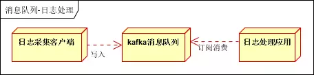

日志采集客户端, 负责日志数据采集, 定时写受写入Kafka队列; Kafka消息队列, 负责日志数据的接收, 存储和转发; 日志处理应用: 订阅并消费kafka队列中的日志数据. 

以下是新浪kafka日志处理应用案例: 

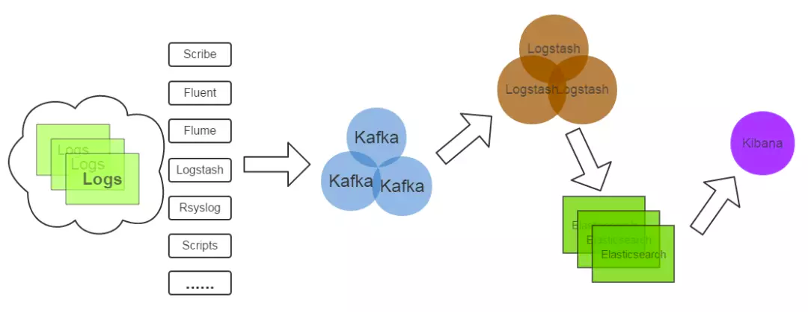

**Kafka**: 接收用户日志的消息队列; 

**Logstash**: 做日志解析, 统一成JSON输出给Elasticsearch; 

**Elasticsearch**: 实时日志分析服务的核心技术, 一个schemaless, 实时的数据存储服务, 通过index组织数据, 兼具强大的搜索和统计功能; 

**Kibana**: 基于Elasticsearch的数据可视化组件, 超强的数据可视化能力是众多公司选择ELK stack的重要原因. 

### 5. 消息通讯

消息通讯是指, 消息队列一般都内置了高效的通信机制, 因此也可以用在纯的消息通讯. 比如实现点对点消息队列, 或者聊天室等. 

**点对点通讯: **

客户端A和客户端B使用同一队列, 进行消息通讯. 

**聊天室通讯: **

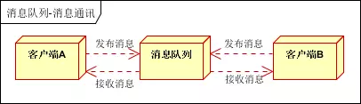

客户端A, 客户端B, 客户端N订阅同一主题, 进行消息发布和接收. 实现类似聊天室效果. 

以上实际是消息队列的两种消息模式, 点对点或发布订阅模式. 模型为示意图, 供参考. 

## 消息中间件示例

### 1. 电商系统

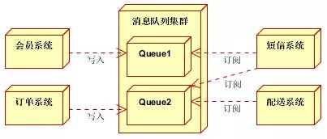

消息队列采用高可用, 可持久化的消息中间件. 比如Active MQ, Rabbit MQ, Rocket Mq. 

应用将主干逻辑处理完成后, 写入消息队列. 
消息发送是否成功可以开启消息的确认模式. （消息队列返回消息接收成功状态后, 应用再返回, 这样保障消息的完整性）; 

扩展流程（发短信, 配送处理）订阅队列消息. 采用推或拉的方式获取消息并处理; 

消息将应用解耦的同时, 带来了数据一致性问题, 可以采用最终一致性方式解决. 比如主数据写入数据库, 扩展应用根据消息队列, 并结合数据库方式实现基于消息队列的后续处理; 

### 2. 日志收集系统

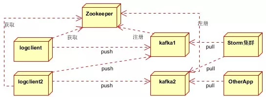

分为Zookeeper注册中心, 日志收集客户端, Kafka集群和Storm集群（OtherApp）四部分组成. 

1. Zookeeper注册中心, 提出负载均衡和地址查找服务; 
2. 日志收集客户端, 用于采集应用系统的日志, 并将数据推送到kafka队列; 
3. Kafka集群: 接收, 路由, 存储, 转发等消息处理; 
4. Storm集群: 与OtherApp处于同一级别, 采用拉的方式消费队列中的数据; 

