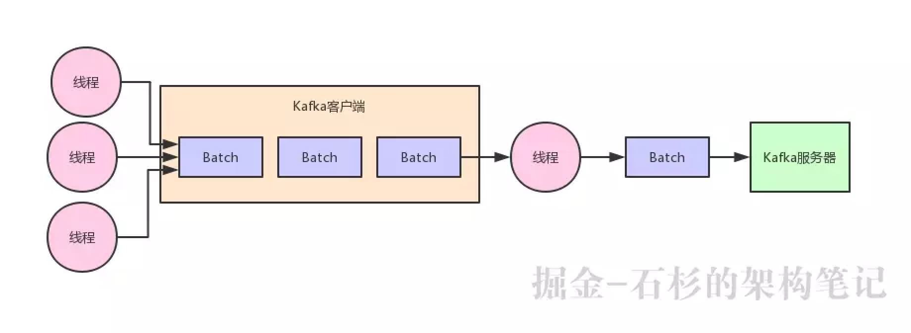
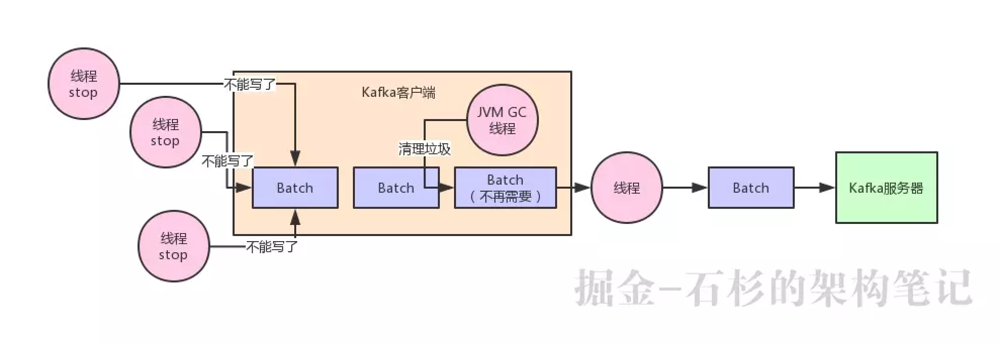
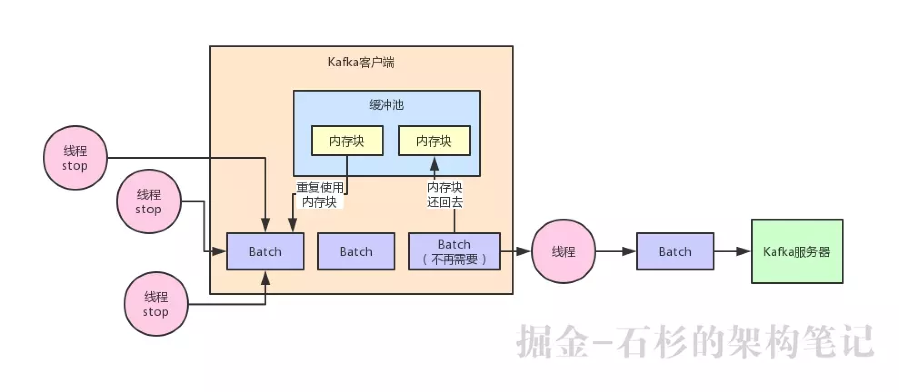

# [Kafka 如何通过精妙的架构设计优化 JVM GC 问题](https://juejin.im/post/5cceec5c51882541914ade42)

## Kafka 的客户端缓冲机制

首先，先得给大家明确一个事情，那就是在客户端发送消息给 kafka 服务器的时候，一定是有一个内存缓冲机制的。

也就是说，消息会先写入一个内存缓冲中，然后直到多条消息组成了一个 Batch，才会一次网络通信把 Batch 发送过去。

整个过程如下图所示：

## 内存缓冲造成的频繁 GC 问题

那么这种内存缓冲机制的本意，其实就是把多条消息组成一个 Batch，一次网络请求就是一个 Batch 或者多个 Batch。

这样每次网络请求都可以发送很多数据过去，避免了一条消息一次网络请求。从而提升了吞吐量，即单位时间内发送的数据量。

但是问题来了，大家可以思考一下，一个 Batch 中的数据，会取出来然后封装在底层的网络包里，通过网络发送出去到达 Kafka 服务器。

那么然后呢？这个 Batch 里的数据都发送过去了，现在 Batch 里的数据应该怎么处理？

你要知道，这些 Batch 里的数据此时可还在客户端的 JVM 的内存里啊！那么此时从代码实现层面，一定会尝试避免任何变量去引用这些 Batch 对应的数据，然后尝试触发 JVM 自动回收掉这些内存垃圾。

这样不断的让 JVM 回收垃圾，就可以不断的清理掉已经发送成功的 Batch 了，然后就可以不断的腾出来新的内存空间让后面新的数据来使用。

这种想法很好，但是实际线上运行的时候一定会有问题，**最大的问题，就是 JVM GC 问题。**

大家都知道一点，JVM GC 在回收内存垃圾的时候，他会有一个 “Stop the World” 的过程，也就是垃圾回收线程运行的时候，会导致其他工作线程短暂的停顿，这样可以便于他自己安安静静的回收内存垃圾。

这个也很容易想明白，毕竟你要是在回收内存垃圾的时候，你的工作线程还在不断的往内存里写数据，制造更多的内存垃圾，那你让人家 JVM 怎么回收垃圾？

这就好比在大马路上，如果地上有很多垃圾，现在要把垃圾都扫干净，最好的办法是什么？大家都让开，把马路空出来，然后清洁工就是把垃圾清理干净。

但是如果清洁工在清扫垃圾的时候，结果一帮人在旁边不停的嗑瓜子扔瓜子壳，吃西瓜扔西瓜皮，不停的制造垃圾，你觉得清洁工内心啥感受？当然是很愤慨了，照这么搞，地上的垃圾永远的都搞不干净了！

通过了上面的语言描述，我们再来一张图，大家看看就更加清楚了

现在 JVM GC 是越来越先进，从 CMS 垃圾回收器到 G1 垃圾回收器，核心的目标之一就是不断的缩减垃圾回收的时候，导致其他工作线程停顿的时间。

所以现在越是新款的垃圾回收器导致工作线程停顿的时间越短，但是再怎么短，他也还是存在啊！

所以说，如何尽可能在自己的设计上避免 JVM 频繁的 GC 就是一个非常考验水平的事儿了。

## Kafka 设计者实现的缓冲池机制

在 Kafka 客户端内部，对这个问题实现了一个非常优秀的机制，就是**缓冲池的机制**

简单来说，就是每个 Batch 底层都对应一块内存空间，这个内存空间就是专门用来存放写入进去的消息的。

然后呢，当一个 Batch 被发送到了 kafka 服务器，这个 Batch 的数据不再需要了，就意味着这个 Batch 的内存空间不再使用了。

此时这个 Batch 底层的内存空间不要交给 JVM 去垃圾回收，而是把这块内存空间给放入一个缓冲池里。

这个缓冲池里放了很多块内存空间，下次如果你又有一个新的 Batch 了，那么不就可以直接从这个缓冲池里获取一块内存空间就 ok 了？

然后如果一个 Batch 发送出去了之后，再把内存空间给人家还回来不就好了？以此类推，循环往复。

同样，听完了上面的文字描述，再来一张图，看完这张图相信大伙儿就明白了：

一旦使用了这个缓冲池机制之后，就不涉及到频繁的大量内存的 GC 问题了。

为什么呢？因为他可以上来就占用固定的内存，比如 32MB。然后把 32MB 划分为 N 多个内存块，比如说一个内存块是 16KB，这样的话这个缓冲池里就会有很多的内存块。

然后你需要创建一个新的 Batch，就从缓冲池里取一个 16KB 的内存块就可以了，然后这个 Batch 就不断的写入消息，但是最多就是写 16KB，因为 Batch 底层的内存块就 16KB。

接着如果 Batch 被发送到 Kafka 服务器了，此时 Batch 底层的内存块就直接还回缓冲池就可以了。

下次别人再要构建一个 Batch 的时候，再次使用缓冲池里的内存块就好了。这样就可以利用有限的内存，对他不停的反复重复的利用。因为如果你的 Batch 使用完了以后是把内存块还回到缓冲池中去，那么就不涉及到垃圾回收了。

如果没有频繁的垃圾回收，自然就避免了频繁导致的工作线程的停顿了，JVM GC 问题是不是就得到了大幅度的优化？

没错，正是这个设计思想让 Kafka 客户端的性能和吞吐量都非常的高，这里蕴含了大量的优秀的机制。

那么此时有人说了，如果我现在把一个缓冲池里的内存资源都占满了，现在缓冲池里暂时没有内存块了，怎么办呢？

很简单，阻塞你的写入操作，不让你继续写入消息了。把你给阻塞住，不停的等待，直到有内存块释放出来，然后再继续让你写入消息。

## 总结一下

这篇文章我们从 Kafka 内存缓冲机制的设计思路开始，一直分析到了 JVM GC 问题的产生原因以及恶劣的影响。

接着谈到了 Kafka 优秀的缓冲池机制的设计思想以及他是如何解决这个问题的，分析了很多 Kafka 作者在设计的时候展现出的优秀的技术设计思想和能力。

希望大家多吸取这里的精华，在以后面试或者工作的时候，可以把这些优秀的思想纳为己用。