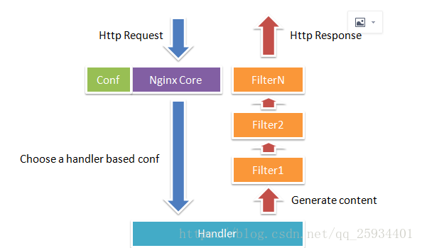

# Nginx 

# nginx面试汇总

#### Nginx的模块与工作原理是什么?

**Nginx由内核和模块组成，其中，内核的设计非常微小和简洁，完成的工作也非常简单，仅仅通过查找配置文件将客户端请求映射到一个location block（location是Nginx配置中的一个指令，用于URL匹配），而在这个location中所配置的每个指令将会启动不同的模块去完成相应的工作。** 
**Nginx的模块从结构上分为核心模块、基础模块和第三方模块：**

* 核心模块：HTTP模块、EVENT模块和MAIL模块
* 基础模块：HTTP Access模块、HTTP FastCGI模块、HTTP
* 第三方模块：HTTP Upstream Request Hash模块、Notice模块和HTTPAccess Key模块。

**用户根据自己的需要开发的模块都属于第三方模块。正是有了这么多模块的支撑，Nginx的功能才会如此强大。** 
**Nginx的模块从功能上分为如下三类：**

* Handlers（处理器模块）。此类模块直接处理请求，并进行输出内容和修改headers信息等操作。Handlers处理器模块一般只能有一个。
* Filters （过滤器模块）。此类模块主要对其他处理器模块输出的内容进行修改操作，最后由Nginx输出。 Proxies（代理类模块）。此类模块是Nginx的HTTP
* Upstream之类的模块，这些模块主要与后端一些服务比如FastCGI等进行交互，实现服务代理和负载均衡等功能。

图1-1展示了Nginx模块常规的HTTP请求和响应的过程。 



Nginx本身做的工作实际很少，当它接到一个HTTP请求时，它仅仅是通过查找配置文件将此次请求映射到一个location block，而此location中所配置的各个指令则会启动不同的模块去完成工作，因此模块可以看做Nginx真正的劳动工作者。通常一个location中的指令会涉及一个handler模块和多个filter模块（当然，多个location可以复用同一个模块）。handler模块负责处理请求，完成响应内容的生成，而filter模块对响应内容进行处理。 
Nginx的模块直接被编译进Nginx，因此属于静态编译方式。启动Nginx后，Nginx的模块被自动加载，不像Apache，首先将模块编译为一个so文件，然后在配置文件中指定是否进行加载。在解析配置文件时，Nginx的每个模块都有可能去处理某个请求，但是同一个处理请求只能由一个模块来完成。

#### 怎么理解Nginx的进程模型?

在工作方式上，Nginx分为单工作进程和多工作进程两种模式。在单工作进程模式下，除主进程外，还有一个工作进程，工作进程是单线程的；在多工作进程模式下，每个工作进程包含多个线程。Nginx默认为单工作进程模式。 
Nginx在启动后，会有一个master进程和多个worker进程。 
**master进程** 
主要用来管理worker进程，包含：接收来自外界的信号，向各worker进程发送信号，监控worker进程的运行状态，当worker进程退出后(异常情况下)，会自动重新启动新的worker进程。 
master进程充当整个进程组与用户的交互接口，同时对进程进行监护。它不需要处理网络事件，不负责业务的执行，只会通过管理worker进程来实现重启服务、平滑升级、更换日志文件、配置文件实时生效等功能。 
我们要控制nginx，只需要通过kill向master进程发送信号就行了。比如kill -HUP pid，则是告诉nginx，从容地重启nginx，我们一般用这个信号来重启nginx，或重新加载配置，因为是从容地重启，因此服务是不中断的。master进程在接收到HUP信号后是怎么做的呢？首先master进程在接到信号后，会先重新加载配置文件，然后再启动新的worker进程，并向所有老的worker进程发送信号，告诉他们可以光荣退休了。新的worker在启动后，就开始接收新的请求，而老的worker在收到来自master的信号后，就不再接收新的请求，并且在当前进程中的所有未处理完的请求处理完成后，再退出。当然，直接给master进程发送信号，这是比较老的操作方式，nginx在0.8版本之后，引入了一系列命令行参数，来方便我们管理。比如，./nginx -s reload，就是来重启nginx，./nginx -s stop，就是来停止nginx的运行。如何做到的呢？我们还是拿reload来说，我们看到，执行命令时，我们是启动一个新的nginx进程，而新的nginx进程在解析到reload参数后，就知道我们的目的是控制nginx来重新加载配置文件了，它会向master进程发送信号，然后接下来的动作，就和我们直接向master进程发送信号一样了。 

而基本的网络事件，则是放在worker进程中来处理了。多个worker进程之间是对等的，他们同等竞争来自客户端的请求，各进程互相之间是独立的。一个请求，只可能在一个worker进程中处理，一个worker进程，不可能处理其它进程的请求。worker进程的个数是可以设置的，一般我们会设置与机器cpu核数一致，这里面的原因与nginx的进程模型以及事件处理模型是分不开的。 
worker进程之间是平等的，每个进程，处理请求的机会也是一样的。当我们提供80端口的http服务时，一个连接请求过来，每个进程都有可能处理这个连接，怎么做到的呢？首先，每个worker进程都是从master进程fork过来，在master进程里面，先建立好需要listen的socket（listenfd）之后，然后再fork出多个worker进程。所有worker进程的listenfd会在新连接到来时变得可读，为保证只有一个进程处理该连接，所有worker进程在注册listenfd读事件前抢accept_mutex，抢到互斥锁的那个进程注册listenfd读事件，在读事件里调用accept接受该连接。当一个worker进程在accept这个连接之后，就开始读取请求，解析请求，处理请求，产生数据后，再返回给客户端，最后才断开连接，这样一个完整的请求就是这样的了。我们可以看到，一个请求，完全由worker进程来处理，而且只在一个worker进程中处理。worker进程之间是平等的，每个进程，处理请求的机会也是一样的。当我们提供80端口的http服务时，一个连接请求过来，每个进程都有可能处理这个连接，怎么做到的呢？首先，每个worker进程都是从master进程fork过来，在master进程里面，先建立好需要listen的socket（listenfd）之后，然后再fork出多个worker进程。所有worker进程的listenfd会在新连接到来时变得可读，为保证只有一个进程处理该连接，所有worker进程在注册listenfd读事件前抢accept_mutex，抢到互斥锁的那个进程注册listenfd读事件，在读事件里调用accept接受该连接。当一个worker进程在accept这个连接之后，就开始读取请求，解析请求，处理请求，产生数据后，再返回给客户端，最后才断开连接，这样一个完整的请求就是这样的了。我们可以看到，一个请求，完全由worker进程来处理，而且只在一个worker进程中处理。 
nginx的进程模型，可以由下图来表示： 


##### Nginx+FastCGI运行原理?

**1、什么是 FastCGI** 
FastCGI是一个可伸缩地、高速地在HTTP server和动态脚本语言间通信的接口。多数流行的HTTP server都支持FastCGI，包括Apache、Nginx和lighttpd等。同时，FastCGI也被许多脚本语言支持，其中就有PHP。 
FastCGI是从CGI发展改进而来的。传统CGI接口方式的主要缺点是性能很差，因为每次HTTP服务器遇到动态程序时都需要重新启动脚本解析器来执行解析，然后将结果返回给HTTP服务器。这在处理高并发访问时几乎是不可用的。另外传统的CGI接口方式安全性也很差，现在已经很少使用了。 
FastCGI接口方式采用C/S结构，可以将HTTP服务器和脚本解析服务器分开，同时在脚本解析服务器上启动一个或者多个脚本解析守护进程。当HTTP服务器每次遇到动态程序时，可以将其直接交付给FastCGI进程来执行，然后将得到的结果返回给浏览器。这种方式可以让HTTP服务器专一地处理静态请求或者将动态脚本服务器的结果返回给客户端，这在很大程度上提高了整个应用系统的性能。 
**2、Nginx+FastCGI运行原理** 
Nginx不支持对外部程序的直接调用或者解析，所有的外部程序（包括PHP）必须通过FastCGI接口来调用。FastCGI接口在Linux下是socket（这个socket可以是文件socket，也可以是ip socket）。 
wrapper：为了调用CGI程序，还需要一个FastCGI的wrapper（wrapper可以理解为用于启动另一个程序的程序），这个wrapper绑定在某个固定socket上，如端口或者文件socket。当Nginx将CGI请求发送给这个socket的时候，通过FastCGI接口，wrapper接收到请求，然后Fork(派生）出一个新的线程，这个线程调用解释器或者外部程序处理脚本并读取返回数据；接着，wrapper再将返回的数据通过FastCGI接口，沿着固定的socket传递给Nginx；最后，Nginx将返回的数据（html页面或者图片）发送给客户端。这就是Nginx+FastCGI的整个运作过程，如图1-3所示。 


所以，我们首先需要一个wrapper，这个wrapper需要完成的工作： 
1\. 通过调用fastcgi（库）的函数通过socket和ningx通信（读写socket是fastcgi内部实现的功能，对wrapper是非透明的） 
2\. 调度thread，进行fork和kill 
3\. 和application（php）进行通信

##### 什么是spawn-fcgi与PHP-FPM?

FastCGI接口方式在脚本解析服务器上启动一个或者多个守护进程对动态脚本进行解析，这些进程就是FastCGI进程管理器，或者称为FastCGI引擎。 spawn-fcgi与PHP-FPM就是支持PHP的两个FastCGI进程管理器。因此HTTPServer完全解放出来，可以更好地进行响应和并发处理。 
**spawn-fcgi与PHP-FPM的异同：** 
1）spawn-fcgi是HTTP服务器lighttpd的一部分，目前已经独立成为一个项目，一般与lighttpd配合使用来支持PHP。但是ligttpd的spwan-fcgi在高并发访问的时候，会出现内存泄漏甚至自动重启FastCGI的问题。即：PHP脚本处理器当机，这个时候如果用户访问的话，可能就会出现白页(即PHP不能被解析或者出错)。

2）Nginx是个轻量级的HTTP server，必须借助第三方的FastCGI处理器才可以对PHP进行解析，因此其实这样看来nginx是非常灵活的，它可以和任何第三方提供解析的处理器实现连接从而实现对PHP的解析(在nginx.conf中很容易设置)。nginx也可以使用spwan-fcgi(需要一同安装lighttpd，但是需要为nginx避开端口，一些较早的blog有这方面安装的教程)，但是由于spawn-fcgi具有上面所述的用户逐渐发现的缺陷，现在慢慢减少用nginx+spawn-fcgi组合了。

由于spawn-fcgi的缺陷，现在出现了第三方(目前已经加入到PHP core中)的PHP的FastCGI处理器PHP-FPM，它和spawn-fcgi比较起来有如下优点：

由于它是作为PHP的patch补丁来开发的，安装的时候需要和php源码一起编译，也就是说编译到php core中了，因此在性能方面要优秀一些； 
同时它在处理高并发方面也优于spawn-fcgi，至少不会自动重启fastcgi处理器。因此，推荐使用Nginx+PHP/PHP-FPM这个组合对PHP进行解析。

相对Spawn-FCGI，PHP-FPM在CPU和内存方面的控制都更胜一筹，而且前者很容易崩溃，必须用crontab进行监控，而PHP-FPM则没有这种烦恼。

FastCGI 的主要优点是把动态语言和HTTP Server分离开来，所以Nginx与PHP/PHP-FPM经常被部署在不同的服务器上，以分担前端Nginx服务器的压力，使Nginx专一处理静态请求和转发动态请求，而PHP/PHP-FPM服务器专一解析PHP动态请求。

##### Nginx+PHP-FPM?

PHP-FPM是管理FastCGI的一个管理器，它作为PHP的插件存在，在安装PHP要想使用PHP-FPM时在老php的老版本（php5.3.3之前）就需要把PHP-FPM以补丁的形式安装到PHP中，而且PHP要与PHP-FPM版本一致，这是必须的）

PHP-FPM其实是PHP源代码的一个补丁，旨在将FastCGI进程管理整合进PHP包中。必须将它patch到你的PHP源代码中，在编译安装PHP后才可以使用。

PHP5.3.3已经集成php-fpm了，不再是第三方的包了。PHP-FPM提供了更好的PHP进程管理方式，可以有效控制内存和进程、可以平滑重载PHP配置，比spawn-fcgi具有更多优点，所以被PHP官方收录了。在./configure的时候带 –enable-fpm参数即可开启PHP-FPM。

fastcgi已经在php5.3.5的core中了，不必在configure时添加 –enable-fastcgi了。老版本如php5.2的需要加此项。

当我们安装Nginx和PHP-FPM完后，配置信息：

```conf
PHP-FPM的默认配置php-fpm.conf：
listen_address  127.0.0.1:9000 #这个表示php的fastcgi进程监听的ip地址以及端口
start_servers
min_spare_servers
max_spare_servers

Nginx配置运行php： 编辑nginx.conf加入如下语句：
location ~ \.php$ {
    root html;   
    fastcgi_pass 127.0.0.1:9000; 指定了fastcgi进程侦听的端口,nginx就是通过这里与php交互的
    fastcgi_index index.php;
    include fastcgi_params;
     fastcgi_param SCRIPT_FILENAME   /usr/local/nginx/html$fastcgi_script_name;
}
```

Nginx通过location指令，将所有以php为后缀的文件都交给127.0.0.1:9000来处理，而这里的IP地址和端口就是FastCGI进程监听的IP地址和端口。

其整体工作流程： 
1)、FastCGI进程管理器php-fpm自身初始化，启动主进程php-fpm和启动start_servers个CGI 子进程。 
主进程php-fpm主要是管理fastcgi子进程，监听9000端口。 
fastcgi子进程等待来自Web Server的连接。 
2)、当客户端请求到达Web Server Nginx是时，Nginx通过location指令，将所有以php为后缀的文件都交给127.0.0.1:9000来处理，即Nginx通过location指令，将所有以php为后缀的文件都交给127.0.0.1:9000来处理。 
3）FastCGI进程管理器PHP-FPM选择并连接到一个子进程CGI解释器。Web server将CGI环境变量和标准输入发送到FastCGI子进程。 
4)、FastCGI子进程完成处理后将标准输出和错误信息从同一连接返回Web Server。当FastCGI子进程关闭连接时，请求便告处理完成。 
5)、FastCGI子进程接着等待并处理来自FastCGI进程管理器（运行在 WebServer中）的下一个连接。

Nginx为啥性能高－多进程IO模型 
参考[http://mp.weixin.qq.com/s?__biz=MjM5NTg2NTU0Ng==&mid=407889757&idx=3&sn=cfa8a70a5fd2a674a91076f67808273c&scene=23&srcid=0401aeJQEraSG6uvLj69Hfve#rd](http://mp.weixin.qq.com/s?__biz=MjM5NTg2NTU0Ng==&mid=407889757&idx=3&sn=cfa8a70a5fd2a674a91076f67808273c&scene=23&srcid=0401aeJQEraSG6uvLj69Hfve#rd) 
1、nginx采用多进程模型好处 
首先，对于每个worker进程来说，独立的进程，不需要加锁，所以省掉了锁带来的开销，同时在编程以及问题查找时，也会方便很多。 
其次，采用独立的进程，可以让互相之间不会影响，一个进程退出后，其它进程还在工作，服务不会中断，master进程则很快启动新的worker进程。当然，worker进程的异常退出，肯定是程序有bug了，异常退出，会导致当前worker上的所有请求失败，不过不会影响到所有请求，所以降低了风险。

##### nginx多进程事件模型：异步非阻塞?

虽然nginx采用多worker的方式来处理请求，每个worker里面只有一个主线程，那能够处理的并发数很有限啊，多少个worker就能处理多少个并发，何来高并发呢？非也，这就是nginx的高明之处，nginx采用了异步非阻塞的方式来处理请求，也就是说，nginx是可以同时处理[成千上万](https://www.baidu.com/s?wd=%E6%88%90%E5%8D%83%E4%B8%8A%E4%B8%87&tn=24004469_oem_dg&rsv_dl=gh_pl_sl_csd)个请求的。一个worker进程可以同时处理的请求数只受限于内存大小，而且在架构设计上，不同的worker进程之间处理并发请求时几乎没有同步锁的限制，worker进程通常不会进入睡眠状态，因此，当Nginx上的进程数与CPU核心数相等时（最好每一个worker进程都绑定特定的CPU核心），进程间切换的代价是最小的。

而apache的常用工作方式（apache也有异步非阻塞版本，但因其与自带某些模块冲突，所以不常用），每个进程在一个时刻只处理一个请求，因此，当并发数上到几千时，就同时有几千的进程在处理请求了。这对操作系统来说，是个不小的挑战，进程带来的内存占用非常大，进程的上下文切换带来的cpu开销很大，自然性能就上不去了，而这些开销完全是没有意义的。

##### 为什么nginx可以采用异步非阻塞的方式来处理?

看看一个请求的完整过程:首先，请求过来，要建立连接，然后再接收数据，接收数据后，再发送数据。

具体到系统底层，就是读写事件，而当读写事件没有准备好时，必然不可操作，如果不用非阻塞的方式来调用，那就得阻塞调用了，事件没有准备好，那就只能等了，等事件准备好了，你再继续吧。阻塞调用会进入内核等待，cpu就会让出去给别人用了，对单线程的worker来说，显然不合适，当网络事件越多时，大家都在等待呢，cpu空闲下来没人用，cpu利用率自然上不去了，更别谈高并发了。好吧，你说加进程数，这跟apache的线程模型有什么区别，注意，别增加无谓的上下文切换。所以，在nginx里面，最忌讳阻塞的系统调用了。不要阻塞，那就非阻塞喽。非阻塞就是，事件没有准备好，马上返回EAGAIN，告诉你，事件还没准备好呢，你慌什么，过会再来吧。好吧，你过一会，再来检查一下事件，直到事件准备好了为止，在这期间，你就可以先去做其它事情，然后再来看看事件好了没。虽然不阻塞了，但你得不时地过来检查一下事件的状态，你可以做更多的事情了，但带来的开销也是不小的。

##### nginx支持的事件模型?

```
Nginx支持如下处理连接的方法（I/O复用方法），这些方法可以通过use指令指定。
  ● select– 标准方法。 如果当前平台没有更有效的方法，它是编译时默认的方法。你可以使用配置参数 –with-select_module 和 –without-select_module 来启用或禁用这个模块。
  ● poll– 标准方法。 如果当前平台没有更有效的方法，它是编译时默认的方法。你可以使用配置参数 –with-poll_module 和 –without-poll_module 来启用或禁用这个模块。
  ● kqueue– 高效的方法，使用于 FreeBSD 4.1+, OpenBSD 2.9+, NetBSD 2.0 和 MacOS X. 使用双处理器的MacOS X系统使用kqueue可能会造成内核崩溃。
  ● epoll – 高效的方法，使用于Linux内核2.6版本及以后的系统。在某些发行版本中，如SuSE 8.2, 有让2.4版本的内核支持epoll的补丁。
  ● rtsig – 可执行的实时信号，使用于Linux内核版本2.2.19以后的系统。默认情况下整个系统中不能出现大于1024个POSIX实时(排队)信号。这种情况 对于高负载的服务器来说是低效的；所以有必要通过调节内核参数 /proc/sys/kernel/rtsig-max 来增加队列的大小。可是从Linux内核版本2.6.6-mm2开始， 这个参数就不再使用了，并且对于每个进程有一个独立的信号队列，这个队列的大小可以用 RLIMIT_SIGPENDING 参数调节。当这个队列过于拥塞，nginx就放弃它并且开始使用 poll 方法来处理连接直到恢复正常。
  ● /dev/poll – 高效的方法，使用于 Solaris 7 11/99+, HP/UX 11.22+ (eventport), IRIX 6.5.15+ 和 Tru64 UNIX 5.1A+.
  ● eventport – 高效的方法，使用于 Solaris 10. 为了防止出现内核崩溃的问题， 有必要安装这个 安全补丁。
```

##### 在linux下面，只有epoll是高效的方法,epoll到底是如何高效的

Epoll是Linux内核为处理大批量句柄而作了改进的poll。 要使用epoll只需要这三个系统调用：epoll_create(2)， epoll_ctl(2)， epoll_wait(2)。它是在2.5.44内核中被引进的(epoll(4) is a new API introduced in Linux kernel 2.5.44)，在2.6内核中得到广泛应用。

##### epoll的优点?

● 支持一个进程打开大数目的socket描述符(FD) 
select 最不能忍受的是一个进程所打开的FD是有一定限制的，由FD_SETSIZE设置，默认值是2048。对于那些需要支持的上万连接数目的IM服务器来说显 然太少了。这时候你一是可以选择修改这个宏然后重新编译内核，不过资料也同时指出这样会带来网络效率的下降，二是可以选择多进程的解决方案(传统的 Apache方案)，不过虽然linux上面创建进程的代价比较小，但仍旧是不可忽视的，加上进程间数据同步远比不上线程间同步的高效，所以也不是一种完 美的方案。不过 epoll则没有这个限制，它所支持的FD上限是最大可以打开文件的数目，这个数字一般远大于2048,举个例子,在1GB内存的机器上大约是10万左 右，具体数目可以cat /proc/sys/fs/file-max察看,一般来说这个数目和系统内存关系很大。 
● IO效率不随FD数目增加而线性下降 
传统的select/poll另一个致命弱点就是当你拥有一个很大的socket集合，不过由于网络延时，任一时间只有部分的socket是”活跃”的，但 是select/poll每次调用都会线性扫描全部的集合，导致效率呈现线性下降。但是epoll不存在这个问题，它只会对”活跃”的socket进行操 作—这是因为在内核实现中epoll是根据每个fd上面的callback函数实现的。那么，只有”活跃”的socket才会主动的去调用 callback函数，其他idle状态socket则不会，在这点上，epoll实现了一个”伪”AIO，因为这时候推动力在os内核。在一些 benchmark中，如果所有的socket基本上都是活跃的—比如一个高速LAN环境，epoll并不比select/poll有什么效率，相 反，如果过多使用epoll_ctl,效率相比还有稍微的下降。但是一旦使用idle connections模拟WAN环境,epoll的效率就远在select/poll之上了。 
● 使用mmap加速内核与用户空间的消息传递。 
这 点实际上涉及到epoll的具体实现了。无论是select,poll还是epoll都需要内核把FD消息通知给用户空间，如何避免不必要的内存拷贝就很 重要，在这点上，epoll是通过内核于用户空间mmap同一块内存实现的。而如果你想我一样从2.5内核就关注epoll的话，一定不会忘记手工 mmap这一步的。 
● 内核微调 
这一点其实不算epoll的优点了，而是整个linux平台的优点。也许你可以怀疑linux平台，但是你无法回避linux平台赋予你微调内核的能力。比如，内核TCP/IP协 议栈使用内存池管理sk_buff结构，那么可以在运行时期动态调整这个内存pool(skb_head_pool)的大小— 通过echo XXXX>/proc/sys/net/core/hot_list_length完成。再比如listen函数的第2个参数(TCP完成3次握手 的数据包队列长度)，也可以根据你平台内存大小动态调整。更甚至在一个数据包面数目巨大但同时每个数据包本身大小却很小的特殊系统上尝试最新的NAPI网卡驱动架构。 
(epoll内容，参考epoll_互动百科) 
推荐设置worker的个数为cpu的核数，在这里就很容易理解了，更多的worker数，只会导致进程来竞争cpu资源了，从而带来不必要的上下文切换。而且，nginx为了更好的利用多核特性，提供了cpu亲缘性的绑定选项，我们可以将某一个进程绑定在某一个核上，这样就不会因为进程的切换带来cache的失效。像这种小的优化在nginx中非常常见，同时也说明了nginx作者的[苦心孤诣](https://www.baidu.com/s?wd=%E8%8B%A6%E5%BF%83%E5%AD%A4%E8%AF%A3&tn=24004469_oem_dg&rsv_dl=gh_pl_sl_csd)。比如，nginx在做4个字节的字符串比较时，会将4个字符转换成一个int型，再作比较，以减少cpu的指令数等等。

##### Nginx优化怎么做？

**1.　编译安装过程优化**

```
1）.减小Nginx编译后的文件大小
在编译Nginx时，默认以debug模式进行，而在debug模式下会插入很多跟踪和ASSERT之类的信息，编译完成后，一个Nginx要有好几兆字节。而在编译前取消Nginx的debug模式，编译完成后Nginx只有几百千字节。因此可以在编译之前，修改相关源码，取消debug模式。具体方法如下：
在Nginx源码文件被解压后，找到源码目录下的auto/cc/gcc文件，在其中找到如下几行：

  1. # debug  
  2. CFLAGS=”$CFLAGS -g” 
注释掉或删掉这两行，即可取消debug模式。
2.为特定的CPU指定CPU类型编译优化
在编译Nginx时，默认的GCC编译参数是“-O”，要优化GCC编译，可以使用以下两个参数：

  1. --with-cc-opt='-O3' 
  2. --with-cpu-opt=CPU  #为特定的 CPU 编译，有效的值包括：
pentium, pentiumpro, pentium3, # pentium4, athlon, opteron, amd64, sparc32, sparc64, ppc64 
要确定CPU类型，可以通过如下命令：

  1. [root@localhost home]#cat /proc/cpuinfo | grep "model name" 
```

**2\. 利用TCMalloc优化Nginx的性能**

```
TCMalloc的全称为Thread-Caching Malloc，是谷歌开发的开源工具google-perftools中的一个成员。与标准的glibc库的Malloc相比，TCMalloc库在内存分配效率和速度上要高很多，这在很大程度上提高了服务器在高并发情况下的性能，从而降低了系统的负载。下面简单介绍如何为Nginx添加TCMalloc库支持。
要安装TCMalloc库，需要安装libunwind（32位操作系统不需要安装）和google-perftools两个软件包，libunwind库为基于64位CPU和操作系统的程序提供了基本函数调用链和函数调用寄存器功能。下面介绍利用TCMalloc优化Nginx的具体操作过程。
1).安装libunwind库
可以从http://download.savannah.gnu.org/releases/libunwind下载相应的libunwind版本，这里下载的是libunwind-0.99-alpha.tar.gz。安装过程如下：

1. [root@localhost home]#tar zxvf libunwind-0.99-alpha.tar.gz  
2. [root@localhost home]# cd libunwind-0.99-alpha/  
3. [root@localhost libunwind-0.99-alpha]#CFLAGS=-fPIC ./configure  
4. [root@localhost libunwind-0.99-alpha]#make CFLAGS=-fPIC  
5. [root@localhost libunwind-0.99-alpha]#make CFLAGS=-fPIC install 

2).安装google-perftools
可以从http://google-perftools.googlecode.com下载相应的google-perftools版本，这里下载的是google-perftools-1.8.tar.gz。安装过程如下：

1. [root@localhost home]#tar zxvf google-perftools-1.8.tar.gz  
2. [root@localhost home]#cd google-perftools-1.8/  
3. [root@localhost google-perftools-1.8]# ./configure  
4. [root@localhost google-perftools-1.8]#make && make install  
5. [root@localhost google-perftools-1.8]#echo "/usr/
local/lib" > /etc/ld.so.conf.d/usr_local_lib.conf  
6. [root@localhost google-perftools-1.8]# ldconfig 
至此，google-perftools安装完成。

3).重新编译Nginx

为了使Nginx支持google-perftools，需要在安装过程中添加“–with-google_perftools_module”选项重新编译Nginx。安装代码如下：

1\. [root@localhostnginx-0.7.65]#./configure \  
2\. >--with-google_perftools_module --with-http_stub_status_module  --prefix=/opt/nginx  
3\. [root@localhost nginx-0.7.65]#make  
4\. [root@localhost nginx-0.7.65]#make install 

到这里Nginx安装完成。

4).为google-perftools添加线程目录

创建一个线程目录，这里将文件放在/tmp/tcmalloc下。操作如下：

1\. [root@localhost home]#mkdir /tmp/tcmalloc  
2\. [root@localhost home]#chmod 0777 /tmp/tcmalloc 

5).修改Nginx主配置文件

修改nginx.conf文件，在pid这行的下面添加如下代码：

1\. #pid        logs/nginx.pid;  
2\. google_perftools_profiles /tmp/tcmalloc; 

接着，重启Nginx即可完成google-perftools的加载。

6).验证运行状态
为了验证google-perftools已经正常加载，可通过如下命令查看：

1\. [root@ localhost home]# lsof -n | grep tcmalloc  
2\. nginx      2395 nobody   9w  REG    8,8       0    1599440 /tmp/tcmalloc.2395  
3\. nginx      2396 nobody   11w REG   8,8       0    1599443 /tmp/tcmalloc.2396  
4\. nginx      2397 nobody   13w REG  8,8        0    1599441  /tmp/tcmalloc.2397  
5\. nginx     2398 nobody    15w REG  8,8     0    1599442 /tmp/tcmalloc.2398 

由于在Nginx配置文件中设置worker_processes的值为4，因此开启了4个Nginx线程，每个线程会有一行记录。每个线程文件后面的数字值就是启动的Nginx的pid值。
至此，利用TCMalloc优化Nginx的操作完成。
```

**3.Nginx内核参数优化**

```
内核参数的优化，主要是在Linux系统中针对Nginx应用而进行的系统内核参数优化。
下面给出一个优化实例以供参考。

  1. net.ipv4.tcp_max_tw_buckets = 6000 
  2. net.ipv4.ip_local_port_range = 1024 65000  
  3. net.ipv4.tcp_tw_recycle = 1 
  4. net.ipv4.tcp_tw_reuse = 1 
  5. net.ipv4.tcp_syncookies = 1 
  6. net.core.somaxconn = 262144 
  7. net.core.netdev_max_backlog = 262144 
  8. net.ipv4.tcp_max_orphans = 262144 
  9. net.ipv4.tcp_max_syn_backlog = 262144 
  10. net.ipv4.tcp_synack_retries = 1 
  11. net.ipv4.tcp_syn_retries = 1 
  12. net.ipv4.tcp_fin_timeout = 1 
  13. net.ipv4.tcp_keepalive_time = 30 
将上面的内核参数值加入/etc/sysctl.conf文件中，然后执行如下命令使之生效：
  1. [root@ localhost home]#/sbin/sysctl -p 
下面对实例中选项的含义进行介绍：
net.ipv4.tcp_max_tw_buckets ：选项用来设定timewait的数量，默认是180 000，这里设为6000。
net.ipv4.ip_local_port_range:选项用来设定允许系统打开的端口范围。在高并发情况否则端口号会不够用。
net.ipv4.tcp_tw_recycle:选项用于设置启用timewait快速回收.
net.ipv4.tcp_tw_reuse:选项用于设置开启重用，允许将TIME-WAIT sockets重新用于新的TCP连接。
net.ipv4.tcp_syncookies:选项用于设置开启SYN Cookies，当出现SYN等待队列溢出时，启用cookies进行处理。
net.core.somaxconn:选项的默认值是128， 这个参数用于调节系统同时发起的tcp连接数，在高并发的请求中，默认的值可能会导致链接超时或者重传，因此，需要结合并发请求数来调节此值。
net.core.netdev_max_backlog:选项表示当每个网络接口接收数据包的速率比内核处理这些包的速率快时，允许发送到队列的数据包的最大数目。
net.ipv4.tcp_max_orphans:选项用于设定系统中最多有多少个TCP套接字不被关联到任何一个用户文件句柄上。如果超过这个数字，孤立连接将立即被复位并打印出警告信息。这个限制只是为了防止简单的DoS攻击。不能过分依靠这个限制甚至人为减小这个值，更多的情况下应该增加这个值。
net.ipv4.tcp_max_syn_backlog:选项用于记录那些尚未收到客户端确认信息的连接请求的最大值。对于有128MB内存的系统而言，此参数的默认值是1024，对小内存的系统则是128。
net.ipv4.tcp_synack_retries参数的值决定了内核放弃连接之前发送SYN+ACK包的数量。
net.ipv4.tcp_syn_retries选项表示在内核放弃建立连接之前发送SYN包的数量。
net.ipv4.tcp_fin_timeout选项决定了套接字保持在FIN-WAIT-2状态的时间。默认值是60秒。正确设置这个值非常重要，有时即使一个负载很小的Web服务器，也会出现大量的死套接字而产生内存溢出的风险。
net.ipv4.tcp_syn_retries选项表示在内核放弃建立连接之前发送SYN包的数量。
如果发送端要求关闭套接字，net.ipv4.tcp_fin_timeout选项决定了套接字保持在FIN-WAIT-2状态的时间。接收端可以出错并永远不关闭连接，甚至意外宕机。
net.ipv4.tcp_fin_timeout的默认值是60秒。需要注意的是，即使一个负载很小的Web服务器，也会出现因为大量的死套接字而产生内存溢出的风险。FIN-WAIT-2的危险性比FIN-WAIT-1要小，因为它最多只能消耗1.5KB的内存，但是其生存期长些。
net.ipv4.tcp_keepalive_time选项表示当keepalive启用的时候，TCP发送keepalive消息的频度。默认值是2（单位是小时）。
```

**4.　PHP-FPM的优化**

```
如果您高负载网站使用PHP-FPM管理FastCGI，这些技巧也许对您有用:
1）增加FastCGI进程数
把PHP FastCGI子进程数调到100或以上，在4G内存的服务器上200就可以建议通过压力测试获取最佳值。
2）增加 PHP-FPM打开文件描述符的限制
标签rlimit_files用于设置PHP-FPM对打开文件描述符的限制，默认值为1024。这个标签的值必须和Linux内核打开文件数关联起来，例如，要将此值设置为65 535，就必须在Linux命令行执行“ulimit -HSn 65536”。
       然后 增加 PHP-FPM打开文件描述符的限制:
     # vi /path/to/php-fpm.conf
    找到“<valuename="rlimit_files">1024</value>”
把1024更改为 4096或者更高.
重启 PHP-FPM.
       ulimit -n 要调整为65536甚至更大。如何调这个参数，可以参考网上的一些文章。命令行下执行 ulimit -n65536即可修改。如果不能修改，需要设置  /etc/security/limits.conf，加入
* hard nofile65536
* soft nofile 65536

         3）适当增加max_requests
    标签max_requests指明了每个children最多处理多少个请求后便会被关闭，默认的设置是500。
    <value name="max_requests"> 500 </value>
```

**5.nginx.conf的参数优化**

```
nginx要开启的进程数 一般等于cpu的总核数 其实一般情况下开4个或8个就可以。
每个nginx进程消耗的内存10兆的模样
worker_cpu_affinity
仅适用于linux，使用该选项可以绑定worker进程和CPU（2.4内核的机器用不了）
假如是8 cpu 分配如下：
worker_cpu_affinity 00000001 00000010 00000100 00001000 00010000
00100000 01000000 10000000
nginx可以使用多个worker进程，原因如下：
to use SMP 
to decrease latency when workers blockend on disk I/O 
to limit number of connections per process when select()/poll() is
used The worker_processes and worker_connections from the event sections
allows you to calculate maxclients value: k max_clients = worker_processes * worker_connections
worker_rlimit_nofile 102400;
每个nginx进程打开文件描述符最大数目 配置要和系统的单进程打开文件数一致,linux 2.6内核下开启文件打开数为65535，worker_rlimit_nofile就相应应该填写65535 nginx调度时分配请求到进程并不是那么的均衡，假如超过会返回502错误。我这里写的大一点
use epoll
Nginx使用了最新的epoll（Linux 2.6内核）和kqueue（freebsd）网络I/O模型，而Apache则使用的是传统的select模型。
处理大量的连接的读写，Apache所采用的select网络I/O模型非常低效。在高并发服务器中，轮询I/O是最耗时间的操作 目前Linux下能够承受高并发
访问的Squid、Memcached都采用的是epoll网络I/O模型。
worker_connections 65535;
每个工作进程允许最大的同时连接数 （Maxclient = work_processes *　worker_connections）
keepalive_timeout 75
keepalive超时时间
这里需要注意官方的一句话：
The parameters can differ from each other. Line Keep-Alive:
timeout=time understands Mozilla and Konqueror. MSIE itself shuts
keep-alive connection approximately after 60 seconds.

client_header_buffer_size 16k
large_client_header_buffers 4 32k
客户请求头缓冲大小 
nginx默认会用client_header_buffer_size这个buffer来读取header值，如果header过大，它会使用large_client_header_buffers来读取
如果设置过小HTTP头/Cookie过大 会报400 错误 nginx 400 bad request
求行如果超过buffer，就会报HTTP 414错误(URI Too Long) nginx接受最长的HTTP头部大小必须比其中一个buffer大，否则就会报400的HTTP错误(Bad Request)。
open_file_cache max 102400
使用字段:http, server, location 这个指令指定缓存是否启用,如果启用,将记录文件以下信息: ·打开的文件描述符,大小信息和修改时间. ·存在的目录信息. ·在搜索文件过程中的错误信息 -- 没有这个文件,无法正确读取,参考open_file_cache_errors 指令选项:
·max - 指定缓存的最大数目,如果缓存溢出,最长使用过的文件(LRU)将被移除
例: open_file_cache max=1000 inactive=20s; open_file_cache_valid 30s; open_file_cache_min_uses 2; open_file_cache_errors on;
open_file_cache_errors
语法:open_file_cache_errors on | off 默认值:open_file_cache_errors off 使用字段:http, server, location 这个指令指定是否在搜索一个文件是记录cache错误.
open_file_cache_min_uses
语法:open_file_cache_min_uses number 默认值:open_file_cache_min_uses 1 使用字段:http, server, location 这个指令指定了在open_file_cache指令无效的参数中一定的时间范围内可以使用的最小文件数,如 果使用更大的值,文件描述符在cache中总是打开状态.
open_file_cache_valid
语法:open_file_cache_valid time 默认值:open_file_cache_valid 60 使用字段:http, server, location 这个指令指定了何时需要检查open_file_cache中缓存项目的有效信息.

开启gzip
gzip on;
gzip_min_length 1k;
gzip_buffers 4 16k;
gzip_http_version 1.0;
gzip_comp_level 2;
gzip_types text/plain application/x-JavaScript text/css
application/xml;
gzip_vary on;
缓存静态文件：
location ~* ^.+\.(swf|gif|png|jpg|js|css)$ {
root /usr/local/ku6/ktv/show.ku6.com/;
expires 1m;
}
```

###### 1、请解释一下什么是Nginx?

答：Nginx是一个web服务器和反向代理服务器，用于HTTP、HTTPS、SMTP、POP3和IMAP协议。

###### 2、请列举Nginx的一些特性？

答：Nginx服务器的特性包括： 
1）反向代理/L7负载均衡器 
2）嵌入式Perl解释器 
3）动态二进制升级 
4）可用于重新编写URL，具有非常好的PCRE支持

###### 3、nginx和apache的区别？

1）轻量级，同样起web 服务，比apache 占用更少的内存及资源 
2）抗并发，nginx 处理请求是异步非阻塞的，而apache 则是阻塞型的，在高并发下nginx 能保持低资源低消耗高性能 
3）高度模块化的设计，编写模块相对简单 
4）最核心的区别在于apache是同步多进程模型，一个连接对应一个进程；nginx是异步的，多个连接（万级别）可以对应一个进程

###### 4.nginx是如何实现高并发的

一个主进程，多个工作进程，每个工作进程可以处理多个请求，每进来一个request，会有一个worker进程去处理。但不是全程的处理，处理到可能发生阻塞的地方，比如向上游（后端）服务器转发request，并等待请求返回。那么，这个处理的worker继续处理其他请求，而一旦上游服务器返回了，就会触发这个事件，worker才会来接手，这个request才会接着往下走。由于web server的工作性质决定了每个request的大部份生命都是在网络传输中，实际上花费在server机器上的时间片不多。这是几个进程就解决高并发的秘密所在。即@skoo所说的webserver刚好属于网络io密集型应用，不算是计算密集型。

###### 5、请解释Nginx如何处理HTTP请求。

Nginx使用反应器模式。主事件循环等待操作系统发出准备事件的信号，这样数据就可以从套接字读取，在该实例中读取到缓冲区并进行处理。单个线程可以提供数万个并发连接。

###### 6、在Nginx中，如何使用未定义的服务器名称来阻止处理请求?

只需将请求删除的服务器就可以定义为： 
Server { 
listen 80; server_name “ “ ; 
return 444; 
} 
这里，服务器名被保留为一个空字符串，它将在没有“主机”头字段的情况下匹配请求，而一个特殊的Nginx的非标准代码444被返回，从而终止连接。

###### 7、 使用“反向代理服务器”的优点是什么?

反向代理服务器可以隐藏源服务器的存在和特征。它充当互联网云和web服务器之间的中间层。这对于安全方面来说是很好的，特别是当您使用web托管服务时。

###### 8、请列举Nginx服务器的最佳用途。

Nginx服务器的最佳用法是在网络上部署动态HTTP内容，使用SCGI、WSGI应用程序服务器、用于脚本的FastCGI处理程序。它还可以作为负载均衡器。

###### 9、请解释Nginx服务器上的Master和Worker进程分别是什么?

Master进程：读取及评估配置和维持 
Worker进程：处理请求

###### 10、请解释你如何通过不同于80的端口开启Nginx?

答：为了通过一个不同的端口开启Nginx，你必须进入/etc/Nginx/sites-enabled/，如果这是默认文件，那么你必须打开名为“default”的文件。编辑文件，并放置在你想要的端口： 
Like server { 
listen 81; 
}

###### 11、请解释是否有可能将Nginx的错误替换为502错误、503?

502 =错误网关 503 =服务器超载 有可能，但是您可以确保fastcgi_intercept_errors被设置为ON，并使用错误页面指令。 
Location / { fastcgi_pass 127.0.01:9001; fastcgi_intercept_errors on; error_page 502 =503/error_page.html; #… }

###### 12、在Nginx中，解释如何在URL中保留双斜线?

要在URL中保留双斜线，就必须使用merge_slashes_off; 
语法:merge_slashes [on/off] 
默认值: merge_slashes on 
环境: http，server

###### 13、请解释ngx_http_upstream_module的作用是什么?

ngx_http_upstream_module用于定义可通过fastcgi传递、proxy传递、uwsgi传递、memcached传递和scgi传递指令来引用的服务器组。

###### 14、请解释什么是C10K问题?

C10K问题是指无法同时处理大量客户端(10,000)的网络套接字。

###### 15、请陈述stub_status和sub_filter指令的作用是什么?

1）Stub_status指令：该指令用于了解Nginx当前状态的当前状态，如当前的活动连接，接受和处理当前读/写/等待连接的总数 2）Sub_filter指令：它用于搜索和替换响应中的内容，并快速修复陈旧的数据

###### 16、解释Nginx是否支持将请求压缩到上游?

您可以使用Nginx模块gunzip将请求压缩到上游。gunzip模块是一个过滤器，它可以对不支持“gzip”编码方法的客户机或服务器使用“内容编码:gzip”来解压缩响应。

###### 17、解释如何在Nginx中获得当前的时间?

要获得Nginx的当前时间，必须使用SSI模块、dategmt和dategmt和dategmt&amp;#x548C;" role="presentation" style="box-sizing: border-box; outline: 0px; font-family: &quot;Microsoft YaHei&quot;, &quot;SF Pro Display&quot;, Roboto, Noto, Arial, &quot;PingFang SC&quot;, sans-serif; display: inline; font-style: normal; font-weight: normal; line-height: normal; font-size: 16px; text-indent: 0px; text-align: left; text-transform: none; letter-spacing: normal; word-spacing: normal; overflow-wrap: break-word; white-space: nowrap; float: none; direction: ltr; max-width: none; max-height: none; min-width: 0px; min-height: 0px; border: 0px; padding: 0px; margin: 0px; position: relative;">date_local的变量。Proxy_set_header THE-TIME $date_gmt;

###### 18、用Nginx服务器解释-s的目的是什么?

用于运行Nginx -s参数的可执行文件。

###### 19、解释如何在Nginx服务器上添加模块?

在编译过程中，必须选择Nginx模块，因为Nginx不支持模块的运行时间选择。 
nginx 的 upstream目前支持 4 种方式的分配 
1)、轮询（默认） 
每个请求按时间顺序逐一分配到不同的后端服务器，如果后端服务器down掉，能自动剔除。 
2)、weight 
指定轮询几率，weight和访问比率成正比，用于后端服务器性能不均的情况。 
2)、ip_hash 
每个请求按访问ip的hash结果分配，这样每个访客固定访问一个后端服务器，可以解决session的问题。 
3)、fair（第三方） 
按后端服务器的响应时间来分配请求，响应时间短的优先分配。 
4)、url_hash（第三方） 
nginx内置策略包含加权轮询和ip hash 
加权轮询算法分为先深搜索和先广搜索，那么nginx采用的是先深搜索算法，即将首先将请求都分给高权重的机器，直到该机器的权值降到了比其他机器低，才开始将请求分给下一个高权重的机器；

###### 缺省安装的 nginx + php-fpm 环境，假设用户浏览一个耗时的网页，但是却在服务端渲染页面的中途关闭了浏览器，那么请问服务端的 php 脚本是继续执行还是退出执行？

正常情况下，如果客户端client异常退出了，服务端的程序还是会继续执行，直到与IO进行了两次交互操作。服务端发现客户端已经断开连接，这个时候会触发一个user_abort，如果这个没有设置ignore_user_abort，那么这个php-fpm的程序才会被中断。 
拓展阅读：[http://www.cnblogs.com/yjf512/p/5362025.html?foxhandler=RssReadRenderProcessHandler](http://www.cnblogs.com/yjf512/p/5362025.html?foxhandler=RssReadRenderProcessHandler)

###### 首先，Nginx 日志格式中的 timelocal表示的是什么时间？请求开始的时间？请求结束的时间？其次，当我们从前到后观察日志中的timelocal表示的是什么时间？请求开始的时间？请求结束的时间？其次，当我们从前到后观察日志中的timelocal&amp;#x8868;&amp;#x793A;&amp;#x7684;&amp;#x662F;&amp;#x4EC0;&amp;#x4E48;&amp;#x65F6;&amp;#x95F4;&amp;#xFF1F;&amp;#x8BF7;&amp;#x6C42;&amp;#x5F00;&amp;#x59CB;&amp;#x7684;&amp;#x65F6;&amp;#x95F4;&amp;#xFF1F;&amp;#x8BF7;&amp;#x6C42;&amp;#x7ED3;&amp;#x675F;&amp;#x7684;&amp;#x65F6;&amp;#x95F4;&amp;#xFF1F;&amp;#x5176;&amp;#x6B21;&amp;#xFF0C;&amp;#x5F53;&amp;#x6211;&amp;#x4EEC;&amp;#x4ECE;&amp;#x524D;&amp;#x5230;&amp;#x540E;&amp;#x89C2;&amp;#x5BDF;&amp;#x65E5;&amp;#x5FD7;&amp;#x4E2D;&amp;#x7684;" role="presentation" style="box-sizing: border-box; outline: 0px; font-family: &quot;Microsoft YaHei&quot;, &quot;SF Pro Display&quot;, Roboto, Noto, Arial, &quot;PingFang SC&quot;, sans-serif; display: inline; font-style: normal; font-weight: normal; line-height: normal; font-size: 16px; text-indent: 0px; text-align: left; text-transform: none; letter-spacing: normal; word-spacing: normal; overflow-wrap: break-word; white-space: nowrap; float: none; direction: ltr; max-width: none; max-height: none; min-width: 0px; min-height: 0px; border: 0px; padding: 0px; margin: 0px; position: relative;">time_local 时间时，有时候会发现时间顺序前后错乱的现象，请说明原因。

$time_local：在服务器里请求开始写入本地的时间，因为请求发生时间有前有后，所以会时间顺序前后错乱。

###### 在Nginx+PHP环境中，Web错误日志里偶尔会出现如下错误信息：「recv() failed (104: Connection reset by peer) while reading response header from upstream」，请分析可能的原因是什么。

遇到这种情况，第一解决方法是重启php服务，service php5-fpm restart，但是这个治标不治本，相对治本的方法是把php的pm.max_requests值改大一点，比如500;第二个方法，修改php-fpm的request_terminate_timeout，把值改成=0。 
这个情况要看后端的php，要么是链接不上，要么是php服务挂了，要么就是链接超时。 
worker数不够挂掉就会504，worker处理超时就会502。 
拓展阅读：[http://serverfault.com/questions/543999/nginx-errors-recv-failed-104-connection-reset-by-peer-while-reading-respon](http://serverfault.com/questions/543999/nginx-errors-recv-failed-104-connection-reset-by-peer-while-reading-respon)

###### 已知Nginx和PHP-FPM安装在同一台服务器上，Nginx连接PHP-FPM有两种方式：一种是类似127.0.0.1:9000的TCP socket；另一种是类似/tmp/php-fpm.sock的Unix domain socket。请问如何选择，需要注意什么。

Unix domain socket的流程不会走到TCP 那层，直接以文件形式，以stream socket通讯。如果是TCP socket,则需要走到IP层。说的通俗一点，追求可靠性就是tcp（需要占用一个端口，更稳），追求高性能就是Unix Socket（不需要占用端口，更快）。 
拓展阅读：[https://blog.linuxeye.com/364.html](https://blog.linuxeye.com/364.html) 
[http://www.cnxct.com/default-configuration-and-performance-of-nginx-phpfpm-and-tcp-socket-or-unix-domain-socket/](http://www.cnxct.com/default-configuration-and-performance-of-nginx-phpfpm-and-tcp-socket-or-unix-domain-socket/) (这篇文章强烈推荐，写得特别好！）

###### 在Nginx中，请说明Rewrite模块里break和last的区别。

官方文档的定义如下： 
last：停止执行当前这一轮的ngx_http_rewrite_module指令集，然后查找匹配改变后URI的新location； 
break：停止执行当前这一轮的ngx_http_rewrite_module指令集； 
千言万语举个例子： 
location /test1.txt/ { 
rewrite /test1.txt/ /test2.txt break; 
}

location ~ test2.txt { 
return 508; 
} 
使用break会匹配两次URL，如果没有满足项，就会停止匹配下面的location,直接发起请求www.xxx.com/test2.txt，由于不存在文件test2.txt，则会直接显示404。 
使用last的话，会继续搜索下面是否有符合条件(符合重写后的/test2.txt请求)的location，匹配十次，如果十次没有得到的结果，那么就跟break一样了。返回上面的例子，/test2.txt刚好与面location的条件对应上了，进入花括号{}里面的代码执行，这里会返回508。（这里的508是我自己随便设定的）

###### 事件驱动框架：

nginx事件驱动框架（书本p254）：所谓事件驱动架构，简单来说，就是由一些事件发生源来产生事件，由一个或多个事件收集器（epolld等）来收集、分发事件，然后许多事件处理器会注册自己感兴趣的事件，同时会“消费”这些事件。nginx不会使用进程或线程作为事件消费者，只能是某个模块，当前进程调用模块。

传统web服务器（如Apache）的，所谓事件局限在TCP连接建立、关闭上，其他读写都不在是事件驱动，这时会退化成按序执行每个操作的批处理模式，这样每个请求在连接建立后都将始终占用系统资源，直到连接关闭才会释放资源。大大浪费了内存、cpu等资源。并且把一个进程或线程作为事件消费者。 
传统web服务器与Nginx间重要差别： 
前者每个事件消费者独占一个进程资源，后者只是被事件分发者进程短期调用而已。

###### 请求的多阶段异步处理

请求的多阶段异步处理只能基于事件驱动框架实现，就是把一个请求的处理过程按照事件的触发方式分为多个阶段，每个阶段都可以有事件收集、分发器（epoll等）来触发。比如一个http请求可以分为七个阶段

###### 一个master进程（管理），多个work（工作）进程。

master对work进程采用信号进行控制

###### 平台无关的代码实现：

在核心代码都使用了与操作系统无关的代码实现，在与操作系统相关的系统调用上则分别针对各个操作系统都有独立实现，这最终造就了Nginx的可移植性。

###### 内存池的设计

为了减少避免出现内存碎片、减少向操作系统申请内存的次数、降低各个模块的开发复杂度，Nginx采用了简单的内存池（统一申请，统一释放）。比如为每个http请求分配一个内存池，请求结束时销毁整个内存池。

###### 什么是Nginx？

Nginx是一个高性能的HTTP和反向代理服务器，及电子邮件（IMAP/POP3）代理服务器，同时也是一个非常高效的反向代理、负载平衡。 
多进程异步非阻塞事件处理机制：运用了epoll模型

###### 为什么要用Nginx？

优点： 
跨平台、配置简单 
非阻塞、高并发连接：处理2-3万并发连接数，官方监测能支持5万并发 
内存消耗小：开启10个nginx才占150M内存，Nginx采取了分阶段资源分配技术 
nginx处理静态文件好,耗费内存少 
内置的健康检查功能：如果有一个服务器宕机，会做一个健康检查，再发送的请求就不会发送到宕机的服务器了。重新将请求提交到其他的节点上。 
节省宽带：支持GZIP压缩，可以添加浏览器本地缓存 
稳定性高：宕机的概率非常小 
master/worker结构：一个master进程，生成一个或者多个worker进程 
接收用户请求是异步的：浏览器将请求发送到nginx服务器，它先将用户请求全部接收下来，再一次性发送给后端web服务器，极大减轻了web服务器的压力 
一边接收web服务器的返回数据，一边发送给浏览器客户端 
网络依赖性比较低，只要ping通就可以负载均衡 
可以有多台nginx服务器 
事件驱动：通信机制采用epoll模型

###### 为什么Nginx性能这么高？

得益于它的事件处理机制： 
异步非阻塞事件处理机制：运用了epoll模型，提供了一个队列，排队解决

###### 为什么不使用多线程？

Apache: 创建多个进程或线程，而每个进程或线程都会为其分配cpu和内存（线程要比进程小的多，所以worker支持比perfork高的并发），并发过大会榨干服务器资源。

Nginx: 采用单线程来异步非阻塞处理请求（管理员可以配置Nginx主进程的工作进程的数量）(epoll)，不会为每个请求分配cpu和内存资源，节省了大量资源，同时也减少了大量的CPU的上下文切换。所以才使得Nginx支持更高的并发。

###### Nginx是如何处理一个请求的呢？

首先，nginx在启动时，会解析配置文件，得到需要监听的端口与ip地址，然后在nginx的master进程里面 
先初始化好这个监控的socket，再进行listen 
然后再fork出多个子进程出来, 子进程会竞争accept新的连接。 
此时，客户端就可以向nginx发起连接了。当客户端与nginx进行三次握手，与nginx建立好一个连接后 
此时，某一个子进程会accept成功，然后创建nginx对连接的封装，即ngx_connection_t结构体 
接着，根据事件调用相应的事件处理模块，如http模块与客户端进行数据的交换。 
最后，nginx或客户端来主动关掉连接，到此，一个连接就[寿终正寝](https://www.baidu.com/s?wd=%E5%AF%BF%E7%BB%88%E6%AD%A3%E5%AF%9D&tn=24004469_oem_dg&rsv_dl=gh_pl_sl_csd)了

###### 正向代理

一个位于客户端和原始服务器(origin server)之间的服务器，为了从原始服务器取得内容，客户端向代理发送一个请求并指定目标(原始服务器)，然后代理向原始服务器转交请求并将获得的内容返回给客户端。客户端才能使用正向代理 
正向代理总结就一句话：代理端代理的是客户端

###### 反向代理

反向代理（Reverse Proxy）方式是指以代理服务器来接受internet上的连接请求，然后将请求，发给内部网络上的服务器 
并将从服务器上得到的结果返回给internet上请求连接的客户端，此时代理服务器对外就表现为一个反向代理服务器 
反向代理总结就一句话：代理端代理的是服务端

###### 动态资源、静态资源分离

动态资源、静态资源分离是让动态网站里的动态网页根据一定规则把不变的资源和经常变的资源区分开来，动静资源做好了拆分以后，我们就可以根据静态资源的特点将其做缓存操作，这就是网站静态化处理的核心思路 
动态资源、静态资源分离简单的概括是：动态文件与静态文件的分离

###### 为什么要做动、静分离？

在我们的软件开发中，有些请求是需要后台处理的（如：.jsp,.do等等），有些请求是不需要经过后台处理的（如：css、html、jpg、js等等文件） 
这些不需要经过后台处理的文件称为静态文件，否则动态文件。因此我们后台处理忽略静态文件。这会有人又说那我后台忽略静态文件不就完了吗 
当然这是可以的，但是这样后台的请求次数就明显增多了。在我们对资源的响应速度有要求的时候，我们应该使用这种动静分离的策略去解决 
动、静分离将网站静态资源（HTML，JavaScript，CSS，img等文件）与后台应用分开部署，提高用户访问静态代码的速度，降低对后台应用访问 
这里我们将静态资源放到nginx中，动态资源转发到tomcat服务器中

###### 负载均衡

负载均衡即是代理服务器将接收的请求均衡的分发到各服务器中 
负载均衡主要解决网络拥塞问题，提高服务器响应速度，服务就近提供，达到更好的访问质量，减少后台服务器大并发压力


