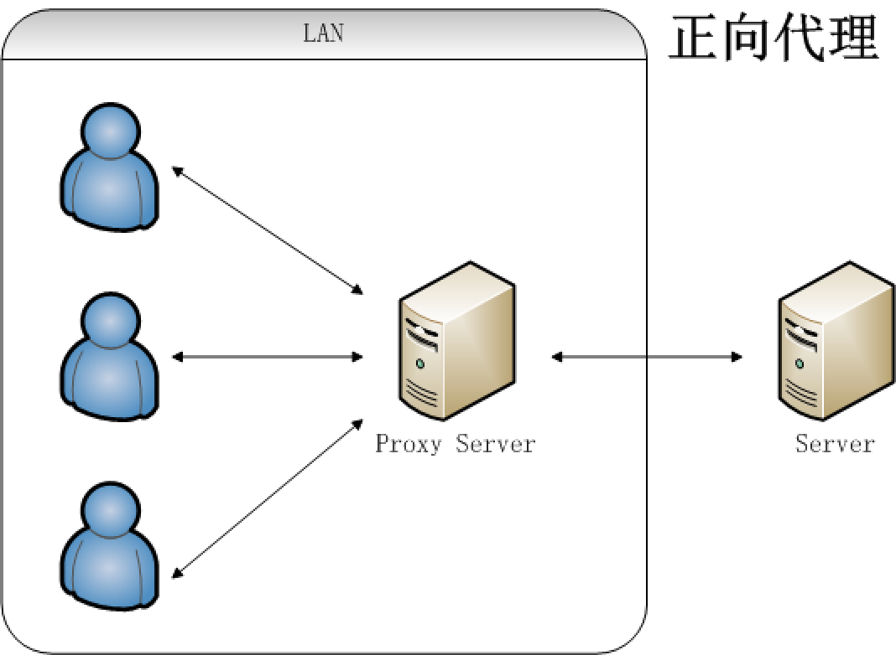
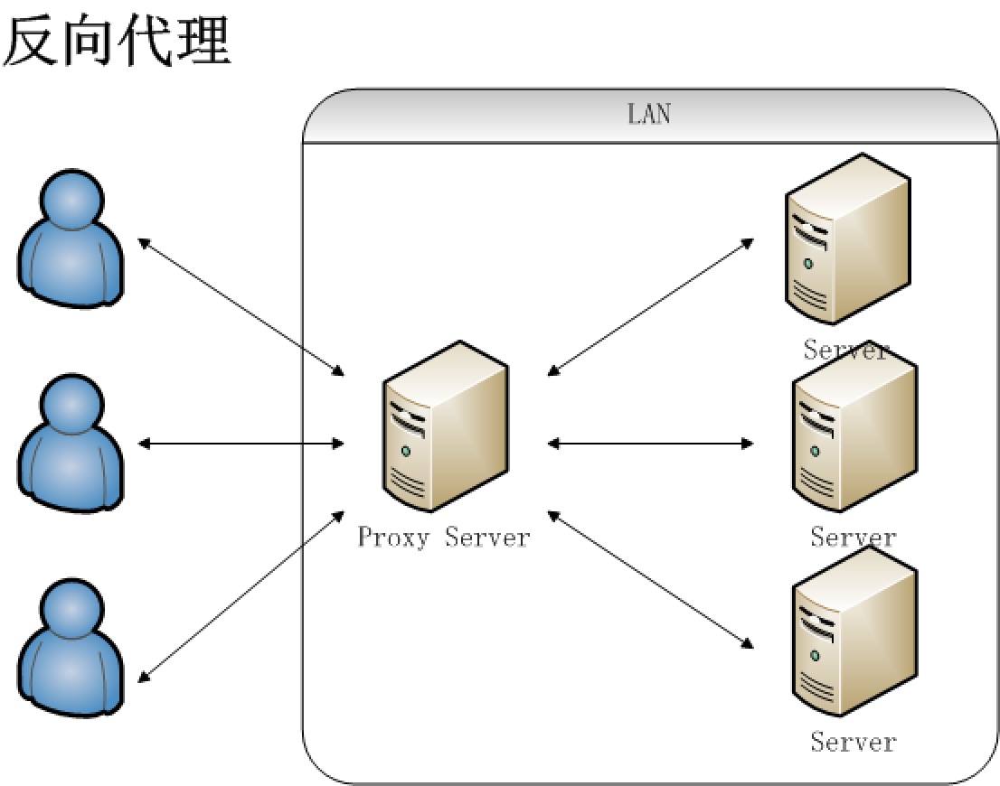

# Nginx

Nginx是一款轻量级的Web 服务器/反向代理服务器及电子邮件（IMAP/POP3）代理服务器。 Nginx 主要提供反向代理、负载均衡、动静分离(静态资源服务)等服务。下面我简单地介绍一下这些名词。

## 反向代理

谈到反向代理，就不得不提一下正向代理。无论是正向代理，还是反向代理，说到底，就是代理模式的衍生版本罢了

- **正向代理：**某些情况下，代理我们用户去访问服务器，需要用户手动的设置代理服务器的ip和端口号。正向代理比较常见的一个例子就是 VPN 了。
- **反向代理：** 是用来代理服务器的，代理我们要访问的目标服务器。代理服务器接受请求，然后将请求转发给内部网络的服务器，并将从服务器上得到的结果返回给客户端，此时代理服务器对外就表现为一个服务器。

通过下面两幅图，大家应该更好理解（图源：http://blog.720ui.com/2016/nginx_action_05_proxy/）：

所以，简单的理解，就是正向代理是为客户端做代理，代替客户端去访问服务器，而反向代理是为服务器做代理，代替服务器接受客户端请求。

## 负载均衡

在高并发情况下需要使用，其原理就是将并发请求分摊到多个服务器执行，减轻每台服务器的压力，多台服务器(集群)共同完成工作任务，从而提高了数据的吞吐量。

Nginx支持的weight轮询（默认）、ip_hash、fair、url_hash这四种负载均衡调度算法，感兴趣的可以自行查阅。

负载均衡相比于反向代理更侧重的是将请求分担到多台服务器上去，所以谈论负载均衡只有在提供某服务的服务器大于两台时才有意义。

## 动静分离

动静分离是让动态网站里的动态网页根据一定规则把不变的资源和经常变的资源区分开来，动静资源做好了拆分以后，我们就可以根据静态资源的特点将其做缓存操作，这就是网站静态化处理的核心思路。

## 为什么要用 Nginx

> 这部分内容参考极客时间—[Nginx核心知识100讲的内容](https://time.geekbang.org/course/intro/138?code=AycjiiQk6uQRxnVJzBupFkrGkvZlmYELPRsZbWzaAHE=)。

如果面试官问你这个问题，就一定想看你知道 Nginx 服务器的一些优点吗。

Nginx 有以下5个优点：

1. 高并发、高性能（这是其他web服务器不具有的）
2. 可扩展性好（模块化设计，第三方插件生态圈丰富）
3. 高可靠性（可以在服务器行持续不间断的运行数年）
4. 热部署（这个功能对于 Nginx 来说特别重要，热部署指可以在不停止 Nginx服务的情况下升级 Nginx）
5. BSD许可证（意味着我们可以将源代码下载下来进行修改然后使用自己的版本）

## Nginx 的四个主要组成部分了解吗

> 这部分内容参考极客时间—[Nginx核心知识100讲的内容](https://time.geekbang.org/course/intro/138?code=AycjiiQk6uQRxnVJzBupFkrGkvZlmYELPRsZbWzaAHE=)。

- Nginx 二进制可执行文件：由各模块源码编译出一个文件
- nginx.conf 配置文件：控制Nginx 行为
- acess.log 访问日志： 记录每一条HTTP请求信息
- error.log 错误日志：定位问题