# 缓存

## 命中率

当某个请求能够通过访问缓存而得到响应时，称为缓存命中。

缓存命中率越高，缓存的利用率也就越高。

## 最大空间

缓存通常位于内存中，内存的空间通常比磁盘空间小的多，因此缓存的最大空间不可能非常大。

当缓存存放的数据量超过最大空间时，就需要淘汰部分数据来存放新到达的数据。

## 淘汰策略

- FIFO（First In First Out）：先进先出策略，在实时性的场景下，需要经常访问最新的数据，那么就可以使用 FIFO，使得最先进入的数据（最晚的数据）被淘汰。
- LRU（Least Recently Used）：最近最久未使用策略，优先淘汰最久未使用的数据，也就是上次被访问时间距离现在最久的数据。该策略可以保证内存中的数据都是热点数据，也就是经常被访问的数据，从而保证缓存命中率。
- LFU（Least Frequently Used）：最不经常使用策略，优先淘汰一段时间内使用次数最少的数据。

## LRU

以下是基于 双向链表 + HashMap 的 LRU 算法实现，对算法的解释如下：

- 访问某个节点时，将其从原来的位置删除，并重新插入到链表头部。这样就能保证链表尾部存储的就是最近最久未使用的节点，当节点数量大于缓存最大空间时就淘汰链表尾部的节点。
- 为了使删除操作时间复杂度为 O(1)，就不能采用遍历的方式找到某个节点。HashMap 存储着 Key 到节点的映射，通过 Key 就能以 O(1) 的时间得到节点，然后再以 O(1) 的时间将其从双向队列中删除。

```java
public class LRU<K, V> implements Iterable<K> {

    private Node head;
    private Node tail;
    private HashMap<K, Node> map;
    private int maxSize;

    private class Node {

        Node pre;
        Node next;
        K k;
        V v;

        public Node(K k, V v) {
            this.k = k;
            this.v = v;
        }
    }


    public LRU(int maxSize) {

        this.maxSize = maxSize;
        this.map = new HashMap<>(maxSize * 4 / 3);

        head = new Node(null, null);
        tail = new Node(null, null);

        head.next = tail;
        tail.pre = head;
    }


    public V get(K key) {

        if (!map.containsKey(key)) {
            return null;
        }

        Node node = map.get(key);
        unlink(node);
        appendHead(node);

        return node.v;
    }


    public void put(K key, V value) {

        if (map.containsKey(key)) {
            Node node = map.get(key);
            unlink(node);
        }

        Node node = new Node(key, value);
        map.put(key, node);
        appendHead(node);

        if (map.size() > maxSize) {
            Node toRemove = removeTail();
            map.remove(toRemove.k);
        }
    }


    private void unlink(Node node) {

        Node pre = node.pre;
        Node next = node.next;

        pre.next = next;
        next.pre = pre;

        node.pre = null;
        node.next = null;
    }


    private void appendHead(Node node) {
        Node next = head.next;
        node.next = next;
        next.pre = node;
        node.pre = head;
        head.next = node;
    }


    private Node removeTail() {

        Node node = tail.pre;

        Node pre = node.pre;
        tail.pre = pre;
        pre.next = tail;

        node.pre = null;
        node.next = null;

        return node;
    }


    @Override
    public Iterator<K> iterator() {

        return new Iterator<K>() {
            private Node cur = head.next;

            @Override
            public boolean hasNext() {
                return cur != tail;
            }

            @Override
            public K next() {
                Node node = cur;
                cur = cur.next;
                return node.k;
            }
        };
    }
}
```

## 缓存位置

### 浏览器

当 HTTP 响应允许进行缓存时，浏览器会将 HTML、CSS、JavaScript、图片等静态资源进行缓存。

### ISP

网络服务提供商（ISP）是网络访问的第一跳，通过将数据缓存在 ISP 中能够大大提高用户的访问速度。

### 反向代理

反向代理位于服务器之前，请求与响应都需要经过反向代理。通过将数据缓存在反向代理，在用户请求反向代理时就可以直接使用缓存进行响应。

### 本地缓存

使用 Guava Cache 将数据缓存在服务器本地内存中，服务器代码可以直接读取本地内存中的缓存，速度非常快。

### 分布式缓存

使用 Redis、Memcache 等分布式缓存将数据缓存在分布式缓存系统中。

相对于本地缓存来说，分布式缓存单独部署，可以根据需求分配硬件资源。不仅如此，服务器集群都可以访问分布式缓存，而本地缓存需要在服务器集群之间进行同步，实现难度和性能开销上都非常大。

### 数据库缓存

MySQL 等数据库管理系统具有自己的查询缓存机制来提高查询效率。

### Java 内部的缓存

Java 为了优化空间，提高字符串、基本数据类型包装类的创建效率，设计了字符串常量池及 Byte、Short、Character、Integer、Long、Boolean 这六种包装类缓冲池。

### CPU 多级缓存

CPU 为了解决运算速度与主存 IO 速度不匹配的问题，引入了多级缓存结构，同时使用 MESI 等缓存一致性协议来解决多核 CPU 缓存数据一致性的问题。

## CDN

内容分发网络（Content distribution network，CDN）是一种互连的网络系统，它利用更靠近用户的服务器从而更快更可靠地将 HTML、CSS、JavaScript、音乐、图片、视频等静态资源分发给用户。

CDN 主要有以下优点：

- 更快地将数据分发给用户；
- 通过部署多台服务器，从而提高系统整体的带宽性能；
- 多台服务器可以看成是一种冗余机制，从而具有高可用性。


## 缓存问题

### 缓存穿透

指的是对某个一定不存在的数据进行请求，该请求将会穿透缓存到达数据库。

解决方案：

- 对这些不存在的数据缓存一个空数据；
- 对这类请求进行过滤。

### 缓存雪崩

指的是由于数据没有被加载到缓存中，或者缓存数据在同一时间大面积失效（过期），又或者缓存服务器宕机，导致大量的请求都到达数据库。

在有缓存的系统中，系统非常依赖于缓存，缓存分担了很大一部分的数据请求。当发生缓存雪崩时，数据库无法处理这么大的请求，导致数据库崩溃。

解决方案：

- 为了防止缓存在同一时间大面积过期导致的缓存雪崩，可以通过观察用户行为，合理设置缓存过期时间来实现；
- 为了防止缓存服务器宕机出现的缓存雪崩，可以使用分布式缓存，分布式缓存中每一个节点只缓存部分的数据，当某个节点宕机时可以保证其它节点的缓存仍然可用。
- 也可以进行缓存预热，避免在系统刚启动不久由于还未将大量数据进行缓存而导致缓存雪崩。

### 缓存一致性

缓存一致性要求数据更新的同时缓存数据也能够实时更新。

解决方案：

- 在数据更新的同时立即去更新缓存；
- 在读缓存之前先判断缓存是否是最新的，如果不是最新的先进行更新。

要保证缓存一致性需要付出很大的代价，缓存数据最好是那些对一致性要求不高的数据，允许缓存数据存在一些脏数据。

### 缓存 “无底洞” 现象

指的是为了满足业务要求添加了大量缓存节点，但是性能不但没有好转反而下降了的现象。

产生原因：缓存系统通常采用 hash 函数将 key 映射到对应的缓存节点，随着缓存节点数目的增加，键值分布到更多的节点上，导致客户端一次批量操作会涉及多次网络操作，这意味着批量操作的耗时会随着节点数目的增加而不断增大。此外，网络连接数变多，对节点的性能也有一定影响。

解决方案：

- 优化批量数据操作命令；
- 减少网络通信次数；
- 降低接入成本，使用长连接 / 连接池，NIO 等。

## 数据分布

### 哈希分布

哈希分布就是将数据计算哈希值之后，按照哈希值分配到不同的节点上。例如有 N 个节点，数据的主键为 key，则将该数据分配的节点序号为：hash(key)%N。

传统的哈希分布算法存在一个问题：当节点数量变化时，也就是 N 值变化，那么几乎所有的数据都需要重新分布，将导致大量的数据迁移。

### 顺序分布

将数据划分为多个连续的部分，按数据的 ID 或者时间分布到不同节点上。例如 User 表的 ID 范围为 1 ~ 7000，使用顺序分布可以将其划分成多个子表，对应的主键范围为 1 ~ 1000，1001 ~ 2000，...，6001 ~ 7000。

顺序分布相比于哈希分布的主要优点如下：

- 能保持数据原有的顺序；
- 并且能够准确控制每台服务器存储的数据量，从而使得存储空间的利用率最大。

## 一致性哈希

Distributed Hash Table（DHT） 是一种哈希分布方式，其目的是为了克服传统哈希分布在服务器节点数量变化时大量数据迁移的问题。

### 基本原理

将哈希空间 [0, 2n-1] 看成一个哈希环，每个服务器节点都配置到哈希环上。每个数据对象通过哈希取模得到哈希值之后，存放到哈希环中顺时针方向第一个大于等于该哈希值的节点上。

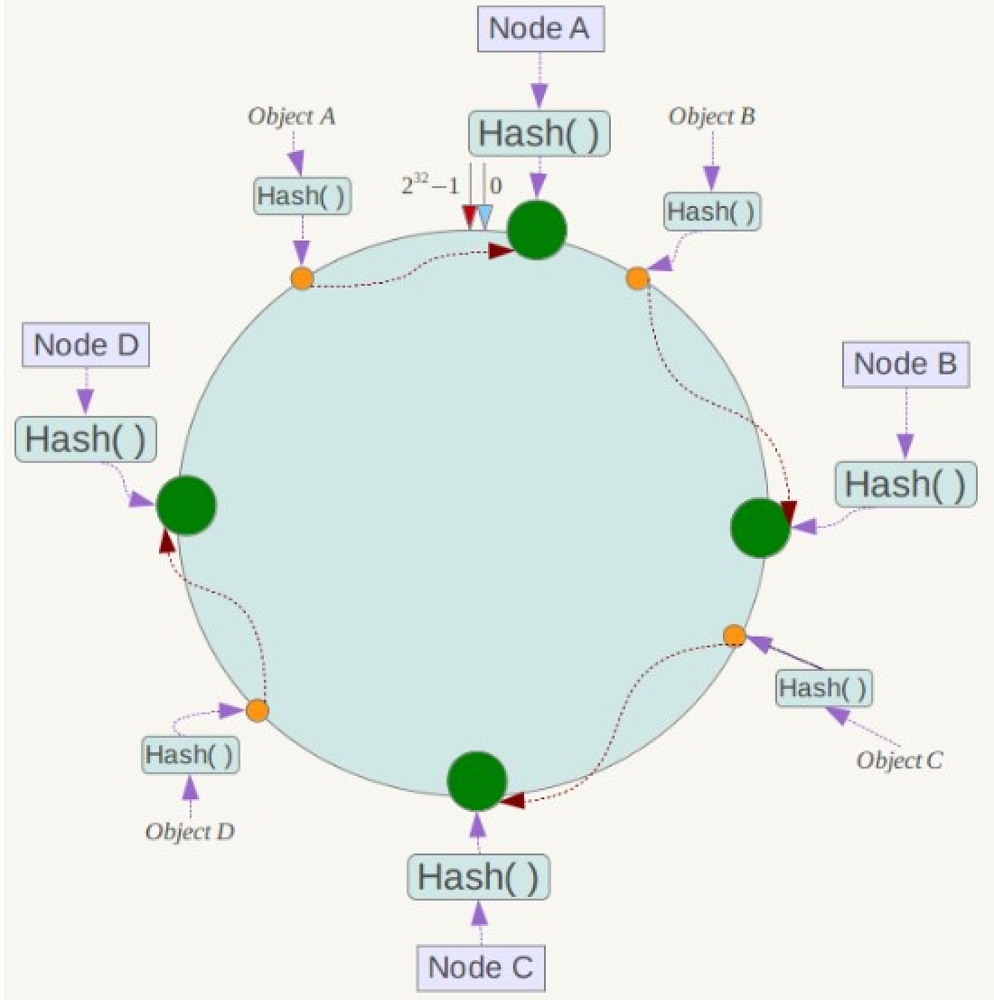

一致性哈希在增加或者删除节点时只会影响到哈希环中相邻的节点，例如下图中新增节点 X，只需要将它前一个节点 C 上的数据重新进行分布即可，对于节点 A、B、D 都没有影响。

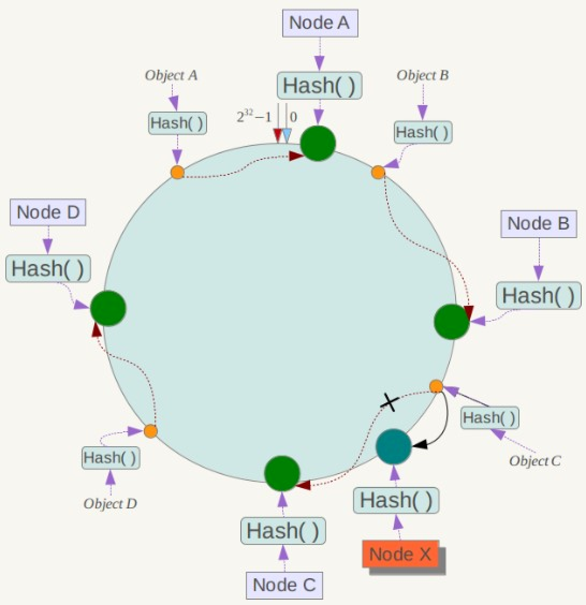


### 虚拟节点

上面描述的一致性哈希存在数据分布不均匀的问题，节点存储的数据量有可能会存在很大的不同。

数据不均匀主要是因为节点在哈希环上分布的不均匀，这种情况在节点数量很少的情况下尤其明显。

解决方式是通过增加虚拟节点，然后将虚拟节点映射到真实节点上。虚拟节点的数量比真实节点来得多，那么虚拟节点在哈希环上分布的均匀性就会比原来的真实节点好，从而使得数据分布也更加均匀。

## 为什么使用缓存

用缓存，主要有两个用途：**高性能**、**高并发**。

### 高性能

假设这么个场景，你有个操作，一个请求过来，吭哧吭哧你各种乱七八糟操作 mysql，半天查出来一个结果，耗时 600ms。但是这个结果可能接下来几个小时都不会变了，或者变了也可以不用立即反馈给用户。那么此时咋办？

缓存啊，折腾 600ms 查出来的结果，扔缓存里，一个 key 对应一个 value，下次再有人查，别走 mysql 折腾 600ms 了，直接从缓存里，通过一个 key 查出来一个 value，2ms 搞定。性能提升 300 倍。

就是说对于一些需要复杂操作耗时查出来的结果，且确定后面不怎么变化，但是有很多读请求，那么直接将查询出来的结果放在缓存中，后面直接读缓存就好。

### 高并发

mysql 这么重的数据库，压根儿设计不是让你玩儿高并发的，虽然也可以玩儿，但是天然支持不好。mysql 单机支撑到 `2000QPS` 也开始容易报警了。

所以要是你有个系统，高峰期一秒钟过来的请求有 1万，那一个 mysql 单机绝对会死掉。你这个时候就只能上缓存，把很多数据放缓存，别放 mysql。缓存功能简单，说白了就是 `key-value` 式操作，单机支撑的并发量轻松一秒几万十几万，支撑高并发 so easy。单机承载并发量是 mysql 单机的几十倍。

::: tip

缓存是走内存的，内存天然就支撑高并发。

:::

## 缓存的相关问题

### 缓存与数据库双写不一致

一般来说，如果允许缓存可以稍微的跟数据库偶尔有不一致的情况，也就是说如果你的系统**不是严格要求** “缓存+数据库” 必须保持一致性的话，最好不要做这个方案，即：**读请求和写请求串行化**，串到一个**内存队列**里去。

串行化可以保证一定不会出现不一致的情况，但是它也会导致系统的吞吐量大幅度降低，用比正常情况下多几倍的机器去支撑线上的一个请求。

#### Cache Aside Pattern

最经典的缓存+数据库读写的模式，就是 Cache Aside Pattern。

- 读的时候，先读缓存，缓存没有的话，就读数据库，然后取出数据后放入缓存，同时返回响应。
- 更新的时候，**先更新数据库，然后再删除缓存**。

**为什么是删除缓存，而不是更新缓存**

原因很简单，很多时候，在复杂点的缓存场景，缓存不单单是数据库中直接取出来的值。

比如可能更新了某个表的一个字段，然后其对应的缓存，是需要查询另外两个表的数据并进行运算，才能计算出缓存最新的值的。

另外更新缓存的代价有时候是很高的。是不是说，每次修改数据库的时候，都一定要将其对应的缓存更新一份？也许有的场景是这样，但是对于**比较复杂的缓存数据计算的场景**，就不是这样了。如果你频繁修改一个缓存涉及的多个表，缓存也频繁更新。但是问题在于，**这个缓存到底会不会被频繁访问到？**

举个栗子，一个缓存涉及的表的字段，在 1 分钟内就修改了 20 次，或者是 100 次，那么缓存更新 20 次、100 次；但是这个缓存在 1 分钟内只被读取了 1 次，有**大量的冷数据**。实际上，如果你只是删除缓存的话，那么在 1 分钟内，这个缓存不过就重新计算一次而已，开销大幅度降低。**用到缓存才去算缓存。**

其实删除缓存，而不是更新缓存，就是一个 lazy 计算的思想，不要每次都重新做复杂的计算，不管它会不会用到，而是让它到需要被使用的时候再重新计算。像 mybatis，hibernate，都有懒加载思想。查询一个部门，部门带了一个员工的 list，没有必要说每次查询部门，都里面的 1000 个员工的数据也同时查出来啊。80% 的情况，查这个部门，就只是要访问这个部门的信息就可以了。先查部门，同时要访问里面的员工，那么这个时候只有在你要访问里面的员工的时候，才会去数据库里面查询 1000 个员工。

#### 最初级的缓存不一致问题及解决方案

问题：先更新数据库，再删除缓存。如果删除缓存失败了，那么会导致数据库中是新数据，缓存中是旧数据，数据就出现了不一致。

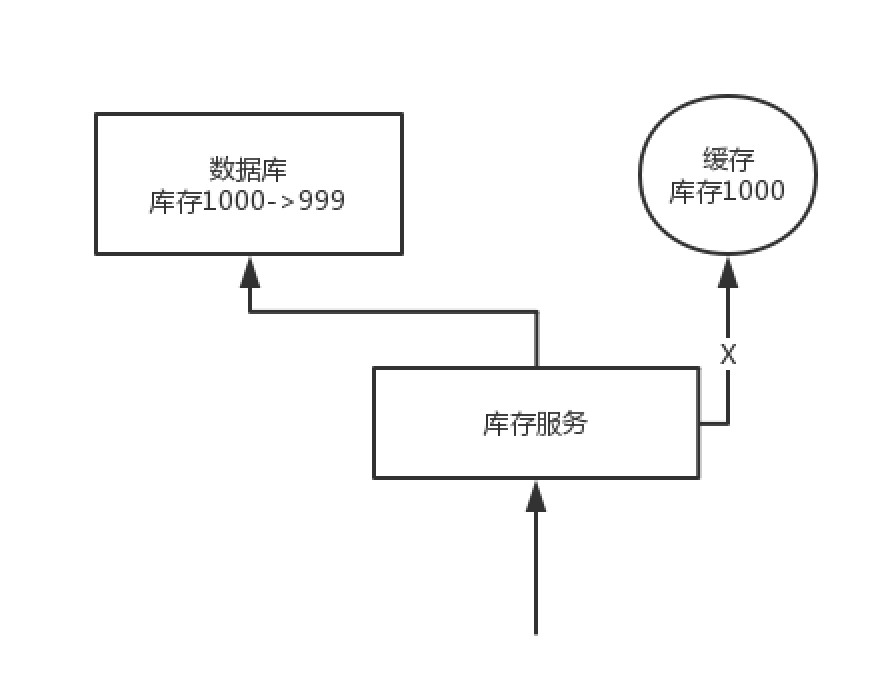

##### 解决方案

**先删除缓存，再更新数据库**。如果数据库更新失败了，那么数据库中是旧数据，缓存中是空的，那么数据不会不一致。因为读的时候缓存没有，所以去读了数据库中的旧数据，然后更新到缓存中。

#### 比较复杂的数据不一致问题分析

数据发生了变更，先删除了缓存，然后要去修改数据库，此时还没修改。一个请求过来，去读缓存，发现缓存空了，去查询数据库，**查到了修改前的旧数据**，放到了缓存中。随后数据变更的程序完成了数据库的修改。完了，数据库和缓存中的数据不一样了...

**为什么上亿流量高并发场景下，缓存会出现这个问题？**

只有在对一个数据在并发的进行读写的时候，才可能会出现这种问题。其实如果说你的并发量很低的话，特别是读并发很低，每天访问量就 1 万次，那么很少的情况下，会出现刚才描述的那种不一致的场景。但是问题是，如果每天的是上亿的流量，每秒并发读是几万，每秒只要有数据更新的请求，就**可能会出现上述的数据库+缓存不一致的情况**。

##### 解决方案

更新数据的时候，根据**数据的唯一标识**，将操作路由之后，发送到一个 jvm 内部队列中。读取数据的时候，如果发现数据不在缓存中，那么将重新读取数据+更新缓存的操作，根据唯一标识路由之后，也发送同一个 jvm 内部队列中。

一个队列对应一个工作线程，每个工作线程**串行**拿到对应的操作，然后一条一条的执行。这样的话，一个数据变更的操作，先删除缓存，然后再去更新数据库，但是还没完成更新。此时如果一个读请求过来，没有读到缓存，那么可以先将缓存更新的请求发送到队列中，此时会在队列中积压，然后同步等待缓存更新完成。

这里有一个**优化点**，一个队列中，其实**多个更新缓存请求串在一起是没意义的**，因此可以做过滤，如果发现队列中已经有一个更新缓存的请求了，那么就不用再放个更新请求操作进去了，直接等待前面的更新操作请求完成即可。

待那个队列对应的工作线程完成了上一个操作的数据库的修改之后，才会去执行下一个操作，也就是缓存更新的操作，此时会从数据库中读取最新的值，然后写入缓存中。

如果请求还在等待时间范围内，不断轮询发现可以取到值了，那么就直接返回；如果请求等待的时间超过一定时长，那么这一次直接从数据库中读取当前的旧值。

高并发的场景下，该解决方案要注意的问题：

- 读请求长时阻塞

由于读请求进行了非常轻度的异步化，所以一定要注意读超时的问题，每个读请求必须在超时时间范围内返回。

该解决方案，最大的风险点在于说，**可能数据更新很频繁**，导致队列中积压了大量更新操作在里面，然后**读请求会发生大量的超时**，最后导致大量的请求直接走数据库。务必通过一些模拟真实的测试，看看更新数据的频率是怎样的。

另外一点，因为一个队列中，可能会积压针对多个数据项的更新操作，因此需要根据自己的业务情况进行测试，可能需要**部署多个服务**，每个服务分摊一些数据的更新操作。如果一个内存队列里居然会挤压 100 个商品的库存修改操作，每隔库存修改操作要耗费 10ms 去完成，那么最后一个商品的读请求，可能等待 10 * 100 = 1000ms = 1s 后，才能得到数据，这个时候就导致**读请求的长时阻塞**。

一定要做根据实际业务系统的运行情况，去进行一些压力测试，和模拟线上环境，去看看最繁忙的时候，内存队列可能会挤压多少更新操作，可能会导致最后一个更新操作对应的读请求，会 hang 多少时间，如果读请求在 200ms 返回，如果你计算过后，哪怕是最繁忙的时候，积压 10 个更新操作，最多等待 200ms，那还可以的。

**如果一个内存队列中可能积压的更新操作特别多**，那么你就要**加机器**，让每个机器上部署的服务实例处理更少的数据，那么每个内存队列中积压的更新操作就会越少。

其实根据之前的项目经验，一般来说，数据的写频率是很低的，因此实际上正常来说，在队列中积压的更新操作应该是很少的。像这种针对读高并发、读缓存架构的项目，一般来说写请求是非常少的，每秒的 QPS 能到几百就不错了。

我们来**实际粗略测算一下**。

如果一秒有 500 的写操作，如果分成 5 个时间片，每 200ms 就 100 个写操作，放到 20 个内存队列中，每个内存队列，可能就积压 5 个写操作。每个写操作性能测试后，一般是在 20ms 左右就完成，那么针对每个内存队列的数据的读请求，也就最多 hang 一会儿，200ms 以内肯定能返回了。

经过刚才简单的测算，我们知道，单机支撑的写 QPS 在几百是没问题的，如果写 QPS 扩大了 10 倍，那么就扩容机器，扩容 10 倍的机器，每个机器 20 个队列。

- 读请求并发量过高

这里还必须做好压力测试，确保恰巧碰上上述情况的时候，还有一个风险，就是突然间大量读请求会在几十毫秒的延时 hang 在服务上，看服务能不能扛的住，需要多少机器才能扛住最大的极限情况的峰值。

但是因为并不是所有的数据都在同一时间更新，缓存也不会同一时间失效，所以每次可能也就是少数数据的缓存失效了，然后那些数据对应的读请求过来，并发量应该也不会特别大。

- 多服务实例部署的请求路由

可能这个服务部署了多个实例，那么必须**保证**说，执行数据更新操作，以及执行缓存更新操作的请求，都通过 Nginx 服务器**路由到相同的服务实例上**。

比如说，对同一个商品的读写请求，全部路由到同一台机器上。可以自己去做服务间的按照某个请求参数的 hash 路由，也可以用 Nginx 的 hash 路由功能等等。

- 热点商品的路由问题，导致请求的倾斜

万一某个商品的读写请求特别高，全部打到相同的机器的相同的队列里面去了，可能会造成某台机器的压力过大。就是说，因为只有在商品数据更新的时候才会清空缓存，然后才会导致读写并发，所以其实要根据业务系统去看，如果更新频率不是太高的话，这个问题的影响并不是特别大，但是的确可能某些机器的负载会高一些。

### 缓存雪崩

缓存雪崩，是指在某一个时间段，缓存集中过期失效或缓存服务突然挂掉, 所有请求全部落到数据库上, 瞬间击垮数据库.

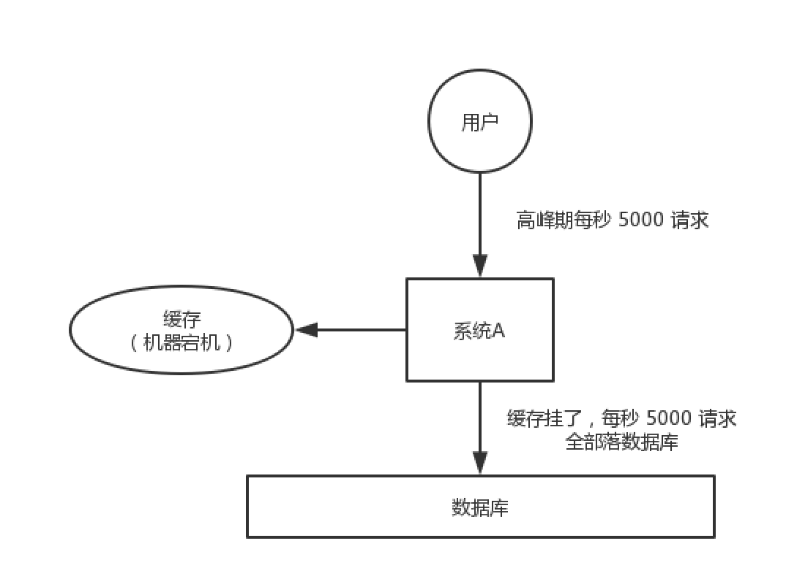

#### 解决方案

缓存雪崩的事前事中事后的解决方案如下。

- 事前：redis 高可用，主从+哨兵，redis cluster，避免全盘崩溃。
- 事中：本地 ehcache 缓存 + hystrix 限流&降级，避免 MySQL 被打死。
- 事后：redis 持久化，一旦重启，自动从磁盘上加载数据，快速恢复缓存数据。

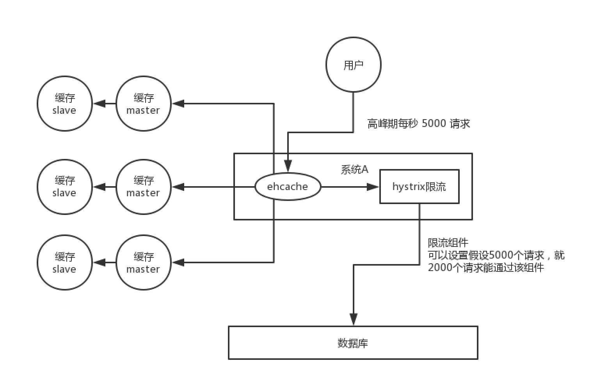

用户发送一个请求，系统 A 收到请求后，先查本地 ehcache 缓存，如果没查到再查 redis。如果 ehcache 和 redis 都没有，再查数据库，将数据库中的结果，写入 ehcache 和 redis 中。

限流组件，可以设置每秒的请求，有多少能通过组件，剩余的未通过的请求，怎么办？**走降级**！可以返回一些默认的值，或者友情提示，或者空白的值。

好处：

- 数据库绝对不会死，限流组件确保了每秒只有多少个请求能通过。
- 只要数据库不死，就是说，对用户来说，2/5 的请求都是可以被处理的。
- 只要有 2/5 的请求可以被处理，就意味着你的系统没死，对用户来说，可能就是点击几次刷不出来页面，但是多点几次，就可以刷出来一次


### 缓存穿透

缓存穿透，是指查询一个数据库不存在的数据.

比如数据库 id 是从 1 开始的，结果黑客发过来的请求 id 全部都是负数。这样的话，缓存中不会有，请求每次都“视缓存于无物”，直接查询数据库。这种恶意攻击场景的缓存穿透就会直接把数据库给打死。

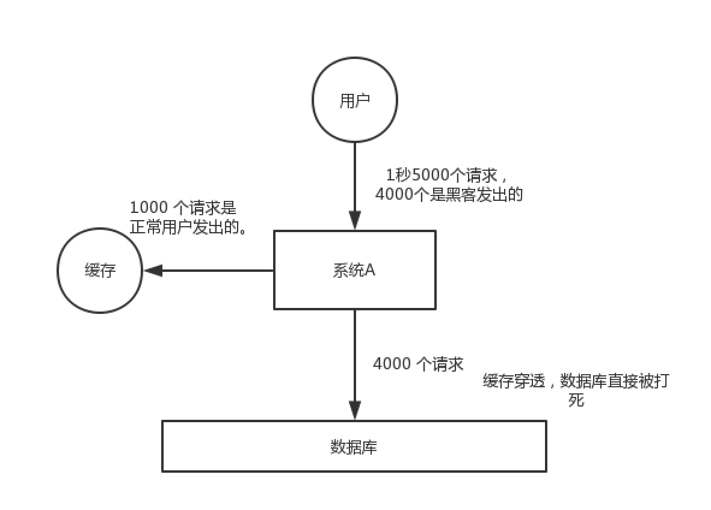

#### 解决方案

每次系统 A 从数据库中只要没查到，就写一个空值到缓存里去，比如 `set -999 UNKNOWN`。然后设置一个过期时间，这样的话，下次有相同的 key 来访问的时候，在缓存失效之前，都可以直接从缓存中取数据。

### 缓存击穿

缓存击穿，就是说某个 key 非常热点，访问非常频繁，处于集中式高并发访问的情况，当这个 key 在失效的瞬间，大量的请求就击穿了缓存，直接请求数据库，就像是在一道屏障上凿开了一个洞。

#### 解决方案

可以将热点数据设置为永远不过期；或者基于 redis or zookeeper 实现互斥锁，等待第一个请求构建完缓存之后，再释放锁，进而其它请求才能通过该 key 访问数据。

### 缓存并发竞争

**多客户端同时并发写**一个 key，可能本来应该先到的数据后到了，导致数据版本错了；或者是多客户端同时获取一个 key，修改值之后再写回去，只要顺序错了，数据就错了

#### 解决方案

某个时刻，多个系统实例都去更新某个 key。可以基于 zookeeper 实现分布式锁。每个系统通过 zookeeper 获取分布式锁，确保同一时间，只能有一个系统实例在操作某个 key，别人都不允许读和写。

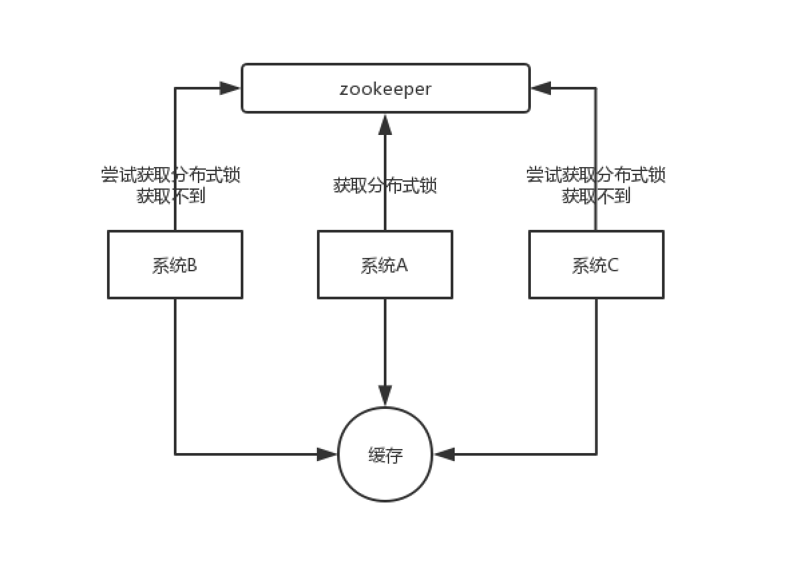

### Redis 和 Memcached 的区别

### Redis 支持复杂的数据结构

redis 相比 memcached 来说，拥有[👉🏿 更多的数据结构]()，能支持更丰富的数据操作。如果需要缓存能够支持更复杂的结构和操作， redis 会是不错的选择。

### Redis 原生支持集群模式

在 redis3.x 版本中，便能支持 cluster 模式，而 memcached 没有原生的集群模式，需要依靠客户端来实现往集群中分片写入数据。

#### 性能对比

由于 redis 只使用**单核**，而 memcached 可以使用**多核**，所以平均每一个核上 redis 在存储小数据时比 memcached 性能更高。而在 100k 以上的数据中，memcached 性能要高于 redis。虽然 redis 最近也在存储大数据的性能上进行优化，但是比起 memcached，还是稍有逊色。

### Redis 的线程模型

redis 内部使用文件事件处理器 `file event handler`，这个文件事件处理器是单线程的，所以 redis 才叫做单线程的模型。它采用 IO 多路复用机制同时监听多个 socket，将产生事件的 socket 压入内存队列中，事件分派器根据 socket 上的事件类型来选择对应的事件处理器进行处理。

文件事件处理器的结构包含 4 个部分：

- 多个 socket
- IO 多路复用程序
- 文件事件分派器
- 事件处理器（连接应答处理器、命令请求处理器、命令回复处理器）

多个 socket 可能会并发产生不同的操作，每个操作对应不同的文件事件，但是 IO 多路复用程序会监听多个 socket，会将产生事件的 socket 放入队列中排队，事件分派器每次从队列中取出一个 socket，根据 socket 的事件类型交给对应的事件处理器进行处理。

来看客户端与 redis 的一次通信过程：

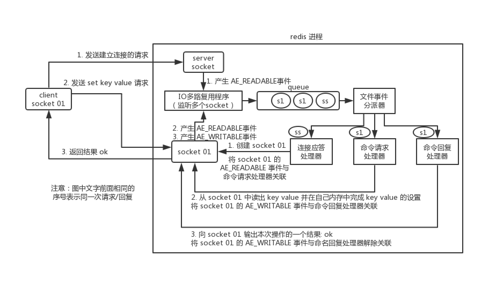

首先，redis 服务端进程初始化的时候，会将 server socket 的 `AE_READABLE` 事件与连接应答处理器关联。

客户端 socket01 向 redis 进程的 server socket 请求建立连接，此时 server socket 会产生一个 `AE_READABLE` 事件，IO 多路复用程序监听到 server socket 产生的事件后，将该 socket 压入队列中。文件事件分派器从队列中获取 socket，交给**连接应答处理器**。连接应答处理器会创建一个能与客户端通信的 socket01，并将该 socket01 的 `AE_READABLE` 事件与命令请求处理器关联。

假设此时客户端发送了一个 `set key value` 请求，此时 redis 中的 socket01 会产生 `AE_READABLE` 事件，IO 多路复用程序将 socket01 压入队列，此时事件分派器从队列中获取到 socket01 产生的 `AE_READABLE` 事件，由于前面 socket01 的 `AE_READABLE` 事件已经与命令请求处理器关联，因此事件分派器将事件交给命令请求处理器来处理。命令请求处理器读取 socket01 的 `key value` 并在自己内存中完成 `key value` 的设置。操作完成后，它会将 socket01 的 `AE_WRITABLE` 事件与命令回复处理器关联。

如果此时客户端准备好接收返回结果了，那么 redis 中的 socket01 会产生一个 `AE_WRITABLE` 事件，同样压入队列中，事件分派器找到相关联的命令回复处理器，由命令回复处理器对 socket01 输入本次操作的一个结果，比如 `ok`，之后解除 socket01 的 `AE_WRITABLE` 事件与命令回复处理器的关联。

这样便完成了一次通信。

### Redis 单线程模型也能效率这么高

- 纯内存操作。
- 核心是基于非阻塞的 IO 多路复用机制。
- C 语言实现，一般来说，C 语言实现的程序“距离”操作系统更近，执行速度相对会更快。
- 单线程反而避免了多线程的频繁上下文切换问题，预防了多线程可能产生的竞争问题。

### Redis 的过期策略

redis 过期策略是：**定期删除+惰性删除**。

所谓**定期删除**，指的是 redis 默认是每隔 100ms 就随机抽取一些设置了过期时间的 key，检查其是否过期，如果过期就删除。

假设 redis 里放了 10w 个 key，都设置了过期时间，你每隔几百毫秒，就检查 10w 个 key，那 redis 基本上就死了，cpu 负载会很高的，消耗在你的检查过期 key 上了。注意，这里可不是每隔 100ms 就遍历所有的设置过期时间的 key，那样就是一场性能上的**灾难**。实际上 redis 是每隔 100ms **随机抽取**一些 key 来检查和删除的。

但是问题是，定期删除可能会导致很多过期 key 到了时间并没有被删除掉，那咋整呢？所以就是惰性删除了。这就是说，在你获取某个 key 的时候，redis 会检查一下 ，这个 key 如果设置了过期时间那么是否过期了？如果过期了此时就会删除，不会给你返回任何东西。

::: tip

获取 key 的时候，如果此时 key 已经过期，就删除，不会返回任何东西。

:::


但是实际上这还是有问题的，如果定期删除漏掉了很多过期 key，然后你也没及时去查，也就没走惰性删除，此时会怎么样？如果大量过期 key 堆积在内存里，导致 redis 内存块耗尽了，咋整？

答案是：**走内存淘汰机制**。

### Redis 内存淘汰机制

Redis 内存淘汰机制有以下几个：

1. **volatile-lru**：从**已设置过期时间**的数据集（server.db[i].expires）中挑选**最近最少使用**的数据淘汰
2. **volatile-ttl**：从**已设置过期时间**的数据集（server.db[i].expires）中挑选**将要过期**的数据淘汰
3. **volatile-random**：从**已设置过期时间**的数据集（server.db[i].expires）中**任意选择数据**淘汰
4. **allkeys-lru**：当内存不足以容纳新写入数据时，在键空间中，移除**最近最少使用**的key（这个是最常用的）
5. **allkeys-random**：从数据集（server.db[i].dict）中**任意选择数据**淘汰
6. **no-eviction**：**禁止驱逐数据**，也就是说当内存不足以容纳新写入数据时，新写入操作会报错。这个应该没人使用吧！

4.0版本后增加以下两种：

1. **volatile-lfu**：从**已设置过期时间**的数据集(server.db[i].expires)中挑选**最不经常使用**的数据淘汰
2. **allkeys-lfu**：当内存不足以容纳新写入数据时，在键空间中，移除**最不经常使用**的key

### LRU 的实现

使用 LinkedHashMap 实现

```java
class LRUCache<K, V> extends LinkedHashMap<K, V> {
    private final int CACHE_SIZE;

    /**
     * 传递进来最多能缓存多少数据
     *
     * @param cacheSize 缓存大小
     */
    public LRUCache(int cacheSize) {
        // true 表示让 linkedHashMap 按照访问顺序来进行排序，最近访问的放在头部，最老访问的放在尾部。
        super((int) Math.ceil(cacheSize / 0.75) + 1, 0.75f, true);
        CACHE_SIZE = cacheSize;
    }

    @Override
    protected boolean removeEldestEntry(Map.Entry<K, V> eldest) {
        // 当 map中的数据量大于指定的缓存个数的时候，就自动删除最老的数据。
        return size() > CACHE_SIZE;
    }
}
```

当 `accessOrder = true` 时, 每次 get() 后, 都会将元素移动到链表尾, 时间久了, 链表前面就是一些很少访问的元素了, 当删除时, 时从链表前面开始删除的, 这样就能实现一个简单 LRU 算法.

### Redis 高并发

redis 实现**高并发**主要依靠**主从架构**，一主多从，一般来说，很多项目其实就足够了，单主用来写入数据，单机几万 QPS，多从用来查询数据，多个从实例可以提供每秒 10w 的 QPS。

如果想要在实现高并发的同时，容纳大量的数据，那么就需要 redis 集群，使用 redis 集群之后，可以提供每秒几十万的读写并发。

单机的 redis，能够承载的 QPS 大概就在上万到几万不等。对于缓存来说，一般都是用来支撑**读高并发**的。因此架构做成主从(master-slave)架构，一主多从，主负责写，并且将数据复制到其它的 slave 节点，从节点负责读。所有的**读请求全部走从节点**。这样也可以很轻松实现水平扩容，**支撑读高并发**。

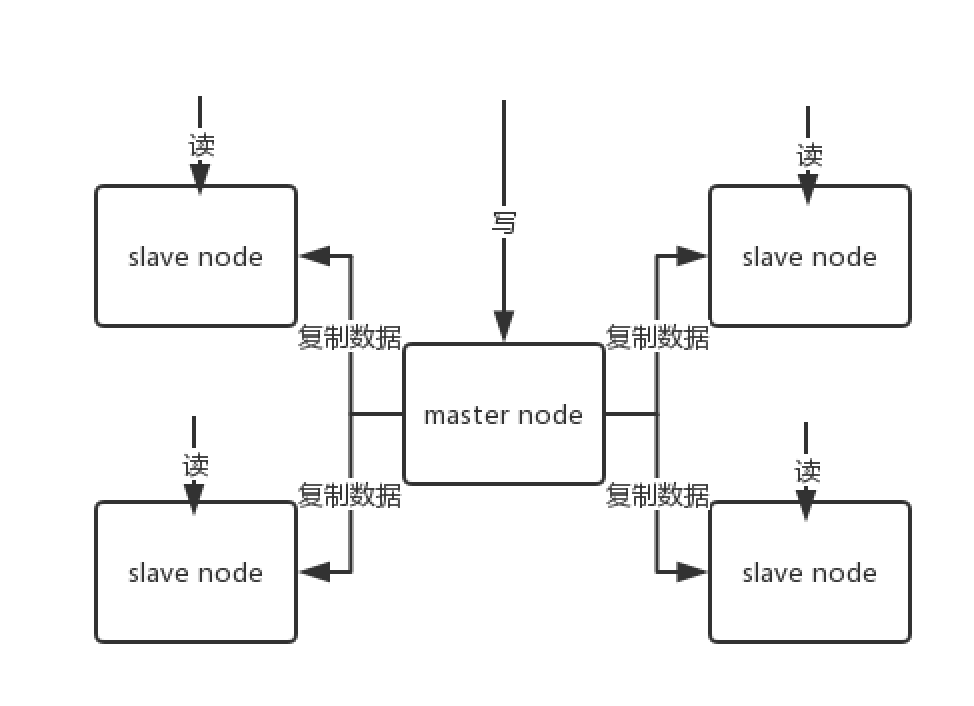

redis replication -> 主从架构 -> 读写分离 -> 水平扩容支撑读高并发

#### Redis replication 的核心机制

- redis 采用**异步方式**复制数据到 slave 节点，不过 redis2.8 开始，slave node 会周期性地确认自己每次复制的数据量；
- 一个 master node 是可以配置多个 slave node 的；
- slave node 也可以连接其他的 slave node；
- slave node 做复制的时候，不会 block master node 的正常工作；
- slave node 在做复制的时候，也不会 block 对自己的查询操作，它会用旧的数据集来提供服务；但是复制完成的时候，需要删除旧数据集，加载新数据集，这个时候就会暂停对外服务了；
- slave node 主要用来进行横向扩容，做读写分离，扩容的 slave node 可以提高读的吞吐量。

注意，如果采用了主从架构，那么建议必须**开启** master node 的持久化，不建议用 slave node 作为 master node 的数据热备，因为那样的话，如果你关掉 master 的持久化，可能在 master 宕机重启的时候数据是空的，然后可能一经过复制， slave node 的数据也丢了。

另外，master 的各种备份方案，也需要做。万一本地的所有文件丢失了，从备份中挑选一份 rdb 去恢复 master，这样才能**确保启动的时候，是有数据的**，即使采用了后续讲解的高可用机制，slave node 可以自动接管 master node，但也可能 sentinel 还没检测到 master failure，master node 就自动重启了，还是可能导致上面所有的 slave node 数据被清空。

#### 主从复制的核心原理

当启动一个 slave node 的时候，它会发送一个 `PSYNC` 命令给 master node。

如果这是 slave node 初次连接到 master node，那么会触发一次 `full resynchronization` 全量复制。此时 master 会启动一个后台线程，开始生成一份 `RDB` 快照文件，同时还会将从客户端 client 新收到的所有写命令缓存在内存中。`RDB` 文件生成完毕后， master 会将这个 `RDB` 发送给 slave，slave 会先**写入本地磁盘，然后再从本地磁盘加载到内存**中，接着 master 会将内存中缓存的写命令发送到 slave，slave 也会同步这些数据。slave node 如果跟 master node 有网络故障，断开了连接，会自动重连，连接之后 master node 仅会复制给 slave 部分缺少的数据。

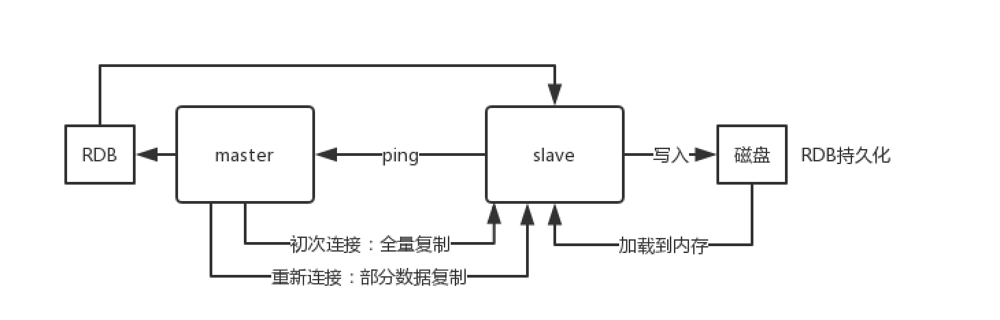

#### 主从复制的断点续传

从 redis2.8 开始，就支持主从复制的断点续传，如果主从复制过程中，网络连接断掉了，那么可以接着上次复制的地方，继续复制下去，而不是从头开始复制一份。

master node 会在内存中维护一个 backlog，master 和 slave 都会保存一个 replica offset 还有一个 master run id，offset 就是保存在 backlog 中的。如果 master 和 slave 网络连接断掉了，slave 会让 master 从上次 replica offset 开始继续复制，如果没有找到对应的 offset，那么就会执行一次 `resynchronization`。

::: tip 如果根据 host+ip 定位 master node，是不靠谱的，如果 master node 重启或者数据出现了变化，那么 slave node 应该根据不同的 run id 区分。

:::

#### 无磁盘化复制

master 在内存中直接创建 `RDB`，然后发送给 slave，不会在自己本地落地磁盘了。只需要在配置文件中开启 `repl-diskless-sync yes` 即可。

```shell
repl-diskless-sync yes

# 等待 5s 后再开始复制，因为要等更多 slave 重新连接过来
repl-diskless-sync-delay 5
```

#### 过期 key 处理

slave 不会过期 key，只会等待 master 过期 key。如果 master 过期了一个 key，或者通过 LRU 淘汰了一个 key，那么会模拟一条 del 命令发送给 slave。

#### 复制的完整流程

slave node 启动时，会在自己本地保存 master node 的信息，包括 master node 的`host`和`ip`，但是复制流程没开始。

slave node 内部有个定时任务，每秒检查是否有新的 master node 要连接和复制，如果发现，就跟 master node 建立 socket 网络连接。然后 slave node 发送 `ping` 命令给 master node。如果 master 设置了 requirepass，那么 slave node 必须发送 masterauth 的口令过去进行认证。master node **第一次执行全量复制**，将所有数据发给 slave node。而在后续，master node 持续将写命令，异步复制给 slave node。

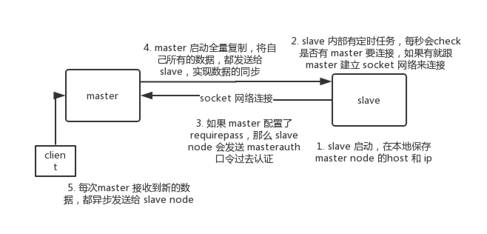

#### 全量复制

- master 执行 bgsave ，在本地生成一份 rdb 快照文件。
- master node 将 rdb 快照文件发送给 slave node，如果 rdb 复制时间超过 60秒（repl-timeout），那么 slave node 就会认为复制失败，可以适当调大这个参数(对于千兆网卡的机器，一般每秒传输 100MB，6G 文件，很可能超过 60s)
- master node 在生成 rdb 时，会将所有新的写命令缓存在内存中，在 slave node 保存了 rdb 之后，再将新的写命令复制给 slave node。
- 如果在复制期间，内存缓冲区持续消耗超过 64MB，或者一次性超过 256MB，那么停止复制，复制失败。

```
client-output-buffer-limit slave 256MB 64MB 60
```

- slave node 接收到 rdb 之后，清空自己的旧数据，然后重新加载 rdb 到自己的内存中，同时**基于旧的数据版本**对外提供服务。
- 如果 slave node 开启了 AOF，那么会立即执行 BGREWRITEAOF，重写 AOF。

#### 增量复制

- 如果全量复制过程中，master-slave 网络连接断掉，那么 slave 重新连接 master 时，会触发增量复制。
- master 直接从自己的 backlog 中获取部分丢失的数据，发送给 slave node，默认 backlog 就是 1MB。
- slave 就是根据 slave 发送的 psync 中的 offset 来从 backlog 中获取数据的。

#### heartbeat

主从节点互相都会发送 heartbeat 信息。

master 默认每隔 10秒 发送一次 heartbeat，slave node 每隔 1秒 发送一个 heartbeat。

#### 异步复制

master 每次接收到写命令之后，先在内部写入数据，然后异步发送给 slave node。

#### 如何才能做到高可用

如果系统在 365 天内，有 99.99% 的时间，都是可以哗哗对外提供服务的，那么就说系统是高可用的。

一个 slave 挂掉了，是不会影响可用性的，还有其它的 slave 在提供相同数据下的相同的对外的查询服务。

但是，如果 master node 死掉了，会怎么样？没法写数据了，写缓存的时候，全部失效了。slave node 还有什么用呢，没有 master 给它们复制数据了，系统相当于不可用了。

redis 的高可用架构，叫做 `failover` **故障转移**，也可以叫做主备切换。

master node 在故障时，自动检测，并且将某个 slave node 自动切换为 master node 的过程，叫做主备切换。这个过程，实现了 redis 的主从架构下的高可用。

Redis 主备切换技术方案有:

1. Keepalived
2. Sentinel


### Redis 哨兵集群实现高可用

redis 高可用，如果是做主从架构部署，那么加上哨兵就可以了，就可以实现，任何一个实例宕机，可以进行主备切换

#### 哨兵的介绍

sentinel，中文名是哨兵。哨兵是 redis 集群机构中非常重要的一个组件，主要有以下功能：

- 集群监控：负责监控 redis master 和 slave 进程是否正常工作。
- 消息通知：如果某个 redis 实例有故障，那么哨兵负责发送消息作为报警通知给管理员。
- 故障转移：如果 master node 挂掉了，会自动转移到 slave node 上。
- 配置中心：如果故障转移发生了，通知 client 客户端新的 master 地址。

哨兵用于实现 redis 集群的高可用，本身也是分布式的，作为一个哨兵集群去运行，互相协同工作。

- 故障转移时，判断一个 master node 是否宕机了，需要大部分的哨兵都同意才行，涉及到了分布式选举的问题。
- 即使部分哨兵节点挂掉了，哨兵集群还是能正常工作的，因为如果一个作为高可用机制重要组成部分的故障转移系统本身是单点的，那就很坑爹了。

#### 哨兵的核心知识

- 哨兵至少需要 3 个实例，来保证自己的健壮性。
- 哨兵 + redis 主从的部署架构，是**不保证数据零丢失**的，只能保证 redis 集群的高可用性。
- 对于哨兵 + redis 主从这种复杂的部署架构，尽量在测试环境和生产环境，都进行充足的测试和演练。

哨兵集群必须部署 2 个以上节点，如果哨兵集群仅仅部署了 2 个哨兵实例，quorum = 1。

```
+----+         +----+
| M1 |---------| R1 |
| S1 |         | S2 |
+----+         +----+
```

配置 `quorum=1`，如果 master 宕机， s1 和 s2 中只要有 1 个哨兵认为 master 宕机了，就可以进行切换，同时 s1 和 s2 会选举出一个哨兵来执行故障转移。但是同时这个时候，需要 majority，也就是大多数哨兵都是运行的。

```
2 个哨兵，majority=2
3 个哨兵，majority=2
4 个哨兵，majority=2
5 个哨兵，majority=3
...
```

如果此时仅仅是 M1 进程宕机了，哨兵 s1 正常运行，那么故障转移是 OK 的。但是如果是整个 M1 和 S1 运行的机器宕机了，那么哨兵只有 1 个，此时就没有 majority 来允许执行故障转移，虽然另外一台机器上还有一个 R1，但是故障转移不会执行。

经典的 3 节点哨兵集群是这样的：

```
       +----+
       | M1 |
       | S1 |
       +----+
          |
+----+    |    +----+
| R2 |----+----| R3 |
| S2 |         | S3 |
+----+         +----+
```

配置 `quorum=2`，如果 M1 所在机器宕机了，那么三个哨兵还剩下 2 个，S2 和 S3 可以一致认为 master 宕机了，然后选举出一个来执行故障转移，同时 3 个哨兵的 majority 是 2，所以还剩下的 2 个哨兵运行着，就可以允许执行故障转移。

#### redis 哨兵主备切换的数据丢失问题

##### 两种情况和导致数据丢失

主备切换的过程，可能会导致数据丢失：

- 异步复制导致的数据丢失

因为 master->slave 的复制是异步的，所以可能有部分数据还没复制到 slave，master 就宕机了，此时这部分数据就丢失了。

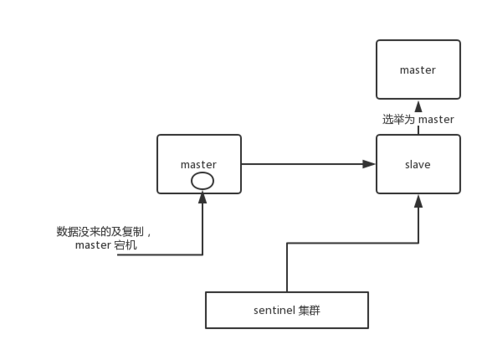

- 脑裂导致的数据丢失

脑裂，也就是说，某个 master 所在机器突然**脱离了正常的网络**，跟其他 slave 机器不能连接，但是实际上 master 还运行着。此时哨兵可能就会**认为** master 宕机了，然后开启选举，将其他 slave 切换成了 master。这个时候，集群里就会有两个 master ，也就是所谓的**脑裂**。

此时虽然某个 slave 被切换成了 master，但是可能 client 还没来得及切换到新的 master，还继续向旧 master 写数据。因此旧 master 再次恢复的时候，会被作为一个 slave 挂到新的 master 上去，自己的数据会清空，重新从新的 master 复制数据。而新的 master 并没有后来 client 写入的数据，因此，这部分数据也就丢失了。

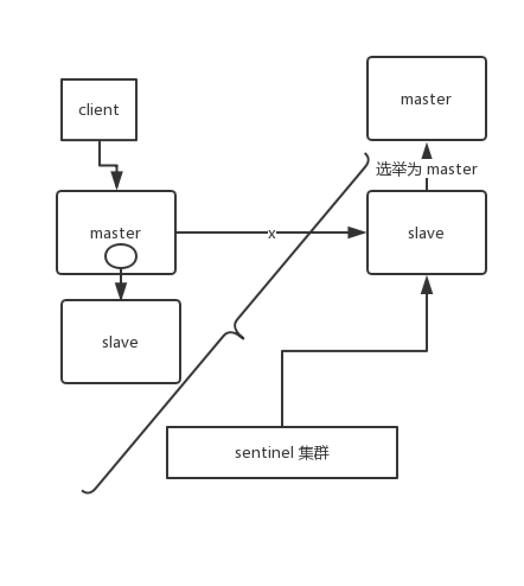

#### 数据丢失问题的解决方案

进行如下配置：

```
min-slaves-to-write 1
min-slaves-max-lag 10
```

表示，要求至少有 1 个 slave，数据复制和同步的延迟不能超过 10 秒。

如果说一旦所有的 slave，数据复制和同步的延迟都超过了 10 秒钟，那么这个时候，master 就不会再接收任何请求了。

- 减少异步复制数据的丢失

有了 `min-slaves-max-lag` 这个配置，就可以确保说，一旦 slave 复制数据和 ack 延时太长，就认为可能 master 宕机后损失的数据太多了，那么就拒绝写请求，这样可以把 master 宕机时由于部分数据未同步到 slave 导致的数据丢失降低的可控范围内。

- 减少脑裂的数据丢失

如果一个 master 出现了脑裂，跟其他 slave 丢了连接，那么上面两个配置可以确保说，如果不能继续给指定数量的 slave 发送数据，而且 slave 超过 10 秒没有给自己 ack 消息，那么就直接拒绝客户端的写请求。因此在脑裂场景下，最多就丢失 10 秒的数据。

#### sdown 和 odown 转换机制

- sdown 是主观宕机，就一个哨兵如果自己觉得一个 master 宕机了，那么就是主观宕机
- odown 是客观宕机，如果 quorum 数量的哨兵都觉得一个 master 宕机了，那么就是客观宕机

sdown 达成的条件很简单，如果一个哨兵 ping 一个 master，超过了 `is-master-down-after-milliseconds` 指定的毫秒数之后，就主观认为 master 宕机了；如果一个哨兵在指定时间内，收到了 quorum 数量的其它哨兵也认为那个 master 是 sdown 的，那么就认为是 odown 了。

#### 哨兵集群的自动发现机制

哨兵互相之间的发现，是通过 redis 的 `pub/sub` 系统实现的，每个哨兵都会往 `__sentinel__:hello` 这个 channel 里发送一个消息，这时候所有其他哨兵都可以消费到这个消息，并感知到其他的哨兵的存在。

每隔两秒钟，每个哨兵都会往自己监控的某个 master+slaves 对应的 `__sentinel__:hello` channel 里**发送一个消息**，内容是自己的 host、ip 和 runid 还有对这个 master 的监控配置。

每个哨兵也会去**监听**自己监控的每个 master+slaves 对应的 `__sentinel__:hello` channel，然后去感知到同样在监听这个 master+slaves 的其他哨兵的存在。

每个哨兵还会跟其他哨兵交换对 `master` 的监控配置，互相进行监控配置的同步。

#### slave 配置的自动纠正

哨兵会负责自动纠正 slave 的一些配置，比如 slave 如果要成为潜在的 master 候选人，哨兵会确保 slave 复制现有 master 的数据；如果 slave 连接到了一个错误的 master 上，比如故障转移之后，那么哨兵会确保它们连接到正确的 master 上。

#### slave->master 选举算法

如果一个 master 被认为 odown 了，而且 majority 数量的哨兵都允许主备切换，那么某个哨兵就会执行主备切换操作，此时首先要选举一个 slave 来，会考虑 slave 的一些信息：

- 跟 master 断开连接的时长
- slave 优先级
- 复制 offset
- run id

如果一个 slave 跟 master 断开连接的时间已经超过了 `down-after-milliseconds` 的 10 倍，外加 master 宕机的时长，那么 slave 就被认为不适合选举为 master。

```
(down-after-milliseconds * 10) + milliseconds_since_master_is_in_SDOWN_state
```

接下来会对 slave 进行排序：

- 按照 slave 优先级进行排序，slave priority 越低，优先级就越高。
- 如果 slave priority 相同，那么看 replica offset，哪个 slave 复制了越多的数据，offset 越靠后，优先级就越高。
- 如果上面两个条件都相同，那么选择一个 run id 比较小的那个 slave。

#### quorum 和 majority

每次一个哨兵要做主备切换，首先需要 quorum 数量的哨兵认为 odown，然后选举出一个哨兵来做切换，这个哨兵还需要得到 majority 哨兵的授权，才能正式执行切换。

如果 quorum < majority，比如 5 个哨兵，majority 就是 3，quorum 设置为 2，那么就 3 个哨兵授权就可以执行切换。

但是如果 quorum >= majority，那么必须 quorum 数量的哨兵都授权，比如 5 个哨兵，quorum 是 5，那么必须 5 个哨兵都同意授权，才能执行切换。

#### configuration epoch

哨兵会对一套 redis master+slaves 进行监控，有相应的监控的配置。

执行切换的那个哨兵，会从要切换到的新 master（salve->master）那里得到一个 configuration epoch，这就是一个 version 号，每次切换的 version 号都必须是唯一的。

如果第一个选举出的哨兵切换失败了，那么其他哨兵，会等待 failover-timeout 时间，然后接替继续执行切换，此时会重新获取一个新的 configuration epoch，作为新的 version 号。

#### configuration 传播

哨兵完成切换之后，会在自己本地更新生成最新的 master 配置，然后同步给其他的哨兵，就是通过之前说的 `pub/sub` 消息机制。

这里之前的 version 号就很重要了，因为各种消息都是通过一个 channel 去发布和监听的，所以一个哨兵完成一次新的切换之后，新的 master 配置是跟着新的 version 号的。其他的哨兵都是根据版本号的大小来更新自己的 master 配置的。

### Redis 持久化的两种方式

- RDB：RDB 持久化机制，是对 redis 中的数据执行**周期性**的持久化。
- AOF：AOF 机制对每条写入命令作为日志，以 `append-only` 的模式写入一个日志文件中，在 redis 重启的时候，可以通过**回放** AOF 日志中的写入指令来重新构建整个数据集。

通过 RDB 或 AOF，都可以将 redis 内存中的数据给持久化到磁盘上面来，然后可以将这些数据备份到别的地方去，比如说阿里云等云服务。

如果 redis 挂了，服务器上的内存和磁盘上的数据都丢了，可以从云服务上拷贝回来之前的数据，放到指定的目录中，然后重新启动 redis，redis 就会自动根据持久化数据文件中的数据，去恢复内存中的数据，继续对外提供服务。

如果同时使用 RDB 和 AOF 两种持久化机制，那么在 redis 重启的时候，会使用 **AOF** 来重新构建数据，因为 AOF 中的**数据更加完整**。

#### RDB 优缺点

- RDB 会生成多个数据文件，每个数据文件都代表了某一个时刻中 redis 的数据，这种多个数据文件的方式，**非常适合做冷备**，可以将这种完整的数据文件发送到一些远程的安全存储上去，比如说 Amazon 的 S3 云服务上去，在国内可以是阿里云的 ODPS 分布式存储上，以预定好的备份策略来定期备份 redis 中的数据。
- RDB 对 redis 对外提供的读写服务，影响非常小，可以让 redis **保持高性能**，因为 redis 主进程只需要 fork 一个子进程，让子进程执行磁盘 IO 操作来进行 RDB 持久化即可。
- 相对于 AOF 持久化机制来说，直接基于 RDB 数据文件来重启和恢复 redis 进程，更加快速。
- 如果想要在 redis 故障时，尽可能少的丢失数据，那么 RDB 没有 AOF 好。一般来说，RDB 数据快照文件，都是每隔 5 分钟，或者更长时间生成一次，这个时候就得接受一旦 redis 进程宕机，那么会丢失最近 5 分钟的数据。
- RDB 每次在 fork 子进程来执行 RDB 快照数据文件生成的时候，如果数据文件特别大，可能会导致对客户端提供的服务暂停数毫秒，或者甚至数秒。

#### AOF 优缺点

- AOF 可以更好的保护数据不丢失，一般 AOF 会每隔 1 秒，通过一个后台线程执行一次`fsync`操作，最多丢失 1 秒钟的数据。
- AOF 日志文件以 `append-only` 模式写入，所以没有任何磁盘寻址的开销，写入性能非常高，而且文件不容易破损，即使文件尾部破损，也很容易修复。
- AOF 日志文件即使过大的时候，出现后台重写操作，也不会影响客户端的读写。因为在 `rewrite` log 的时候，会对其中的指令进行压缩，创建出一份需要恢复数据的最小日志出来。在创建新日志文件的时候，老的日志文件还是照常写入。当新的 merge 后的日志文件 ready 的时候，再交换新老日志文件即可。
- AOF 日志文件的命令通过非常可读的方式进行记录，这个特性非常**适合做灾难性的误删除的紧急恢复**。比如某人不小心用 `flushall` 命令清空了所有数据，只要这个时候后台 `rewrite` 还没有发生，那么就可以立即拷贝 AOF 文件，将最后一条 `flushall` 命令给删了，然后再将该 `AOF` 文件放回去，就可以通过恢复机制，自动恢复所有数据。
- 对于同一份数据来说，AOF 日志文件通常比 RDB 数据快照文件更大。
- AOF 开启后，支持的写 QPS 会比 RDB 支持的写 QPS 低，因为 AOF 一般会配置成每秒 `fsync` 一次日志文件，当然，每秒一次 `fsync`，性能也还是很高的。（如果实时写入，那么 QPS 会大降，redis 性能会大大降低）
- 以前 AOF 发生过 bug，就是通过 AOF 记录的日志，进行数据恢复的时候，没有恢复一模一样的数据出来。所以说，类似 AOF 这种较为复杂的基于命令日志 / merge / 回放的方式，比基于 RDB 每次持久化一份完整的数据快照文件的方式，更加脆弱一些，容易有 bug。不过 AOF 就是为了避免 rewrite 过程导致的 bug，因此每次 rewrite 并不是基于旧的指令日志进行 merge 的，而是**基于当时内存中的数据进行指令的重新构建**，这样健壮性会好很多。

#### RDB 和 AOF 到底该如何选择

- 不要仅仅使用 RDB，因为那样会导致你丢失很多数据；
- 也不要仅仅使用 AOF，因为那样有两个问题：第一，你通过 AOF 做冷备，没有 RDB 做冷备来的恢复速度更快；第二，RDB 每次简单粗暴生成数据快照，更加健壮，可以避免 AOF 这种复杂的备份和恢复机制的 bug；
- redis 支持同时开启开启两种持久化方式，我们可以综合使用 AOF 和 RDB 两种持久化机制，用 AOF 来保证数据不丢失，作为数据恢复的第一选择; 用 RDB 来做不同程度的冷备，在 AOF 文件都丢失或损坏不可用的时候，还可以使用 RDB 来进行快速的数据恢复。

### Redis 集群模式的工作原理

#### redis cluster 介绍

- 自动将数据进行分片，每个 master 上放一部分数据
- 提供内置的高可用支持，部分 master 不可用时，还是可以继续工作的

在 redis cluster 架构下，每个 redis 要放开两个端口号，比如一个是 6379，另外一个就是 加1w 的端口号，比如 16379。

16379 端口号是用来进行节点间通信的，也就是 cluster bus 的东西，cluster bus 的通信，用来进行故障检测、配置更新、故障转移授权。cluster bus 用了另外一种二进制的协议，`gossip` 协议，用于节点间进行高效的数据交换，占用更少的网络带宽和处理时间。

#### 节点间的内部通信机制

##### 基本通信原理

集群元数据的维护有两种方式：集中式、Gossip 协议。redis cluster 节点间采用 gossip 协议进行通信。

**集中式**是将集群元数据（节点信息、故障等等）几种存储在某个节点上。集中式元数据集中存储的一个典型代表，就是大数据领域的 `storm`。它是分布式的大数据实时计算引擎，是集中式的元数据存储的结构，底层基于 zookeeper（分布式协调的中间件）对所有元数据进行存储维护。

[](https://github.com/doocs/advanced-java/blob/master/images/zookeeper-centralized-storage.png)

redis 维护集群元数据采用另一个方式， `gossip` 协议，所有节点都持有一份元数据，不同的节点如果出现了元数据的变更，就不断将元数据发送给其它的节点，让其它节点也进行元数据的变更。

[](https://github.com/doocs/advanced-java/blob/master/images/redis-gossip.png)

**集中式**的**好处**在于，元数据的读取和更新，时效性非常好，一旦元数据出现了变更，就立即更新到集中式的存储中，其它节点读取的时候就可以感知到；**不好**在于，所有的元数据的更新压力全部集中在一个地方，可能会导致元数据的存储有压力。

gossip 好处在于，元数据的更新比较分散，不是集中在一个地方，更新请求会陆陆续续打到所有节点上去更新，降低了压力；不好在于，元数据的更新有延时，可能导致集群中的一些操作会有一些滞后。

- 10000 端口：每个节点都有一个专门用于节点间通信的端口，就是自己提供服务的端口号+10000，比如 7001，那么用于节点间通信的就是 17001 端口。每个节点每隔一段时间都会往另外几个节点发送 `ping` 消息，同时其它几个节点接收到 `ping` 之后返回 `pong`。
- 交换的信息：信息包括故障信息，节点的增加和删除，hash slot 信息等等。

##### gossip 协议

gossip 协议包含多种消息，包含 `ping`,`pong`,`meet`,`fail` 等等。

- meet：某个节点发送 meet 给新加入的节点，让新节点加入集群中，然后新节点就会开始与其它节点进行通信。

```
redis-trib.rb add-node
```

其实内部就是发送了一个 gossip meet 消息给新加入的节点，通知那个节点去加入我们的集群。

- ping：每个节点都会频繁给其它节点发送 ping，其中包含自己的状态还有自己维护的集群元数据，互相通过 ping 交换元数据。
- pong：返回 ping 和 meeet，包含自己的状态和其它信息，也用于信息广播和更新。
- fail：某个节点判断另一个节点 fail 之后，就发送 fail 给其它节点，通知其它节点说，某个节点宕机啦。

##### ping 消息深入

ping 时要携带一些元数据，如果很频繁，可能会加重网络负担。

每个节点每秒会执行 10 次 ping，每次会选择 5 个最久没有通信的其它节点。当然如果发现某个节点通信延时达到了 `cluster_node_timeout / 2`，那么立即发送 ping，避免数据交换延时过长，落后的时间太长了。比如说，两个节点之间都 10 分钟没有交换数据了，那么整个集群处于严重的元数据不一致的情况，就会有问题。所以 `cluster_node_timeout` 可以调节，如果调得比较大，那么会降低 ping 的频率。

每次 ping，会带上自己节点的信息，还有就是带上 1/10 其它节点的信息，发送出去，进行交换。至少包含 `3` 个其它节点的信息，最多包含 `总节点数减 2` 个其它节点的信息。

#### 分布式寻址算法

- hash 算法（大量缓存重建）
- 一致性 hash 算法（自动缓存迁移）+ 虚拟节点（自动负载均衡）
- redis cluster 的 hash slot 算法

##### hash 算法

来了一个 key，首先计算 hash 值，然后对节点数取模。然后打在不同的 master 节点上。一旦某一个 master 节点宕机，所有请求过来，都会基于最新的剩余 master 节点数去取模，尝试去取数据。这会导致**大部分的请求过来，全部无法拿到有效的缓存**，导致大量的流量涌入数据库。

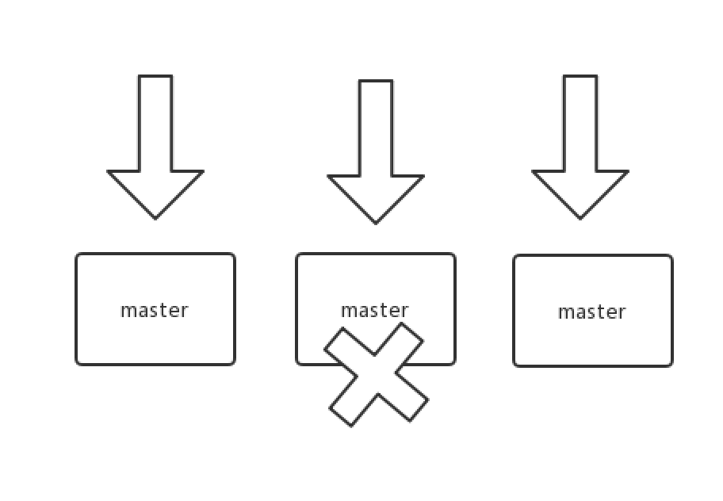

##### 一致性 hash 算法

一致性 hash 算法将整个 hash 值空间组织成一个虚拟的圆环，整个空间按顺时针方向组织，下一步将各个 master 节点（使用服务器的 ip 或主机名）进行 hash。这样就能确定每个节点在其哈希环上的位置。

来了一个 key，首先计算 hash 值，并确定此数据在环上的位置，从此位置沿环**顺时针“行走”**，遇到的第一个 master 节点就是 key 所在位置。

在一致性哈希算法中，如果一个节点挂了，受影响的数据仅仅是此节点到环空间前一个节点（沿着逆时针方向行走遇到的第一个节点）之间的数据，其它不受影响。增加一个节点也同理。

燃鹅，一致性哈希算法在节点太少时，容易因为节点分布不均匀而造成**缓存热点**的问题。为了解决这种热点问题，一致性 hash 算法引入了虚拟节点机制，即对每一个节点计算多个 hash，每个计算结果位置都放置一个虚拟节点。这样就实现了数据的均匀分布，负载均衡。

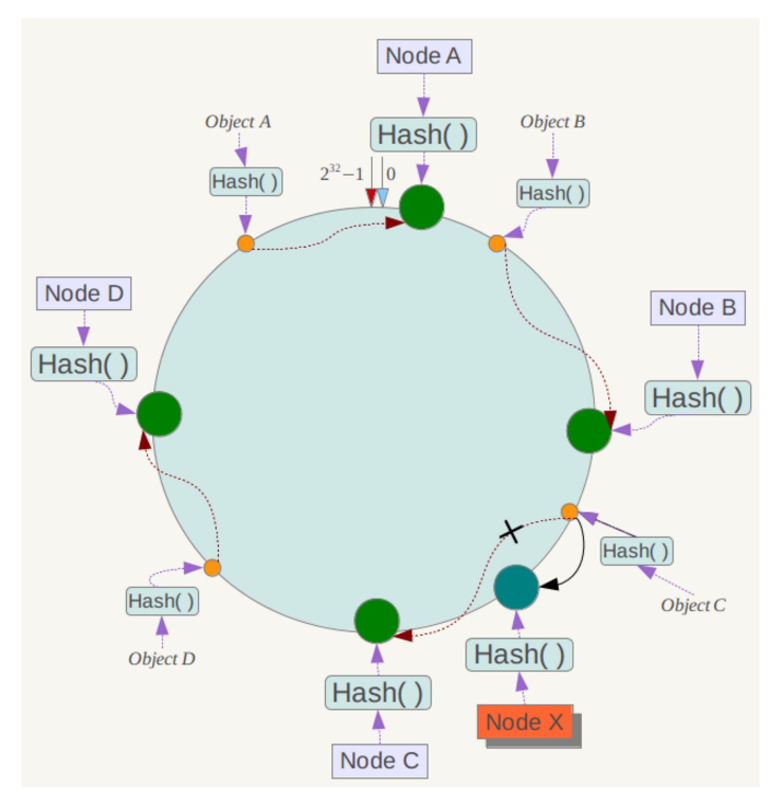

##### redis cluster 的 hash slot 算法

redis cluster 有固定的 `16384` 个 hash slot，对每个 `key` 计算 `CRC16` 值，然后对 `16384` 取模，可以获取 key 对应的 hash slot。

redis cluster 中每个 master 都会持有部分 slot，比如有 3 个 master，那么可能每个 master 持有 5000 多个 hash slot。hash slot 让 node 的增加和移除很简单，增加一个 master，就将其他 master 的 hash slot 移动部分过去，减少一个 master，就将它的 hash slot 移动到其他 master 上去。移动 hash slot 的成本是非常低的。客户端的 api，可以对指定的数据，让他们走同一个 hash slot，通过 `hash tag` 来实现。

任何一台机器宕机，另外两个节点，不影响的。因为 key 找的是 hash slot，不是机器。

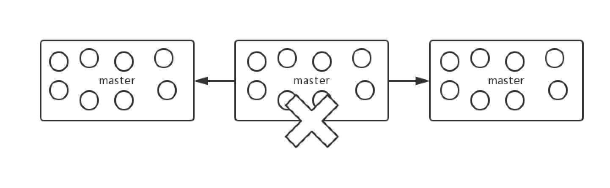

#### redis cluster 的高可用与主备切换原理

redis cluster 的高可用的原理，几乎跟哨兵是类似的。

##### 判断节点宕机

如果一个节点认为另外一个节点宕机，那么就是 `pfail`，**主观宕机**。如果多个节点都认为另外一个节点宕机了，那么就是 `fail`，**客观宕机**，跟哨兵的原理几乎一样，sdown，odown。

在 `cluster-node-timeout` 内，某个节点一直没有返回 `pong`，那么就被认为 `pfail`。

如果一个节点认为某个节点 `pfail` 了，那么会在 `gossip ping` 消息中，`ping` 给其他节点，如果**超过半数**的节点都认为 `pfail` 了，那么就会变成 `fail`。

##### 从节点过滤

对宕机的 master node，从其所有的 slave node 中，选择一个切换成 master node。

检查每个 slave node 与 master node 断开连接的时间，如果超过了 `cluster-node-timeout * cluster-slave-validity-factor`，那么就**没有资格**切换成 `master`。

##### 从节点选举

每个从节点，都根据自己对 master 复制数据的 offset，来设置一个选举时间，offset 越大（复制数据越多）的从节点，选举时间越靠前，优先进行选举。

所有的 master node 开始 slave 选举投票，给要进行选举的 slave 进行投票，如果大部分 master node`（N/2 + 1）`都投票给了某个从节点，那么选举通过，那个从节点可以切换成 master。

从节点执行主备切换，从节点切换为主节点。

##### 与哨兵比较

整个流程跟哨兵相比，非常类似，所以说，redis cluster 功能强大，直接集成了 replication 和 sentinel 的功能。