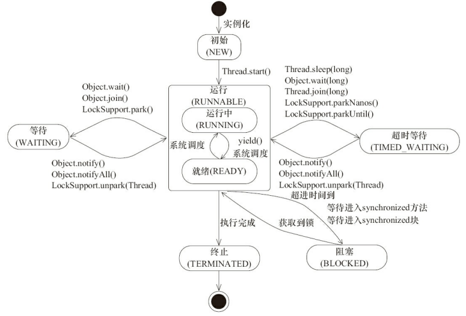

# 并发相关面试题

→ 并发与并行
什么是并发、什么是并行

并发与并行的区别

→ 什么是线程, 与进程的区别
线程的实现、线程的状态、优先级、线程调度、创建线程的多种方式、守护线程

线程与进程的区别

→ 线程池
自己设计线程池、submit() 和 execute()、线程池原理

为什么不允许使用 Executors 创建线程池

→ 线程安全
死锁、死锁如何排查、线程安全和内存模型的关系

→ 锁
CAS、乐观锁与悲观锁、数据库相关锁机制、分布式锁、偏向锁、轻量级锁、重量级锁、monitor、

锁优化、锁消除、锁粗化、自旋锁、可重入锁、阻塞锁、死锁

→ 死锁
什么是死锁

死锁如何解决

→ synchronized
synchronized 是如何实现的？

synchronized 和 lock 之间关系、不使用 synchronized 如何实现一个线程安全的单例

synchronized 和原子性、可见性和有序性之间的关系

→ volatile
happens-before、内存屏障、编译器指令重排和 CPU 指令重

volatile 的实现原理

volatile 和原子性、可见性和有序性之间的关系

有了 symchronized 为什么还需要 volatile

→ sleep 和 wait
→ wait 和 notify
→ notify 和 notifyAll
→ ThreadLocal
→ 写一个死锁的程序
→ 写代码来解决生产者消费者问题
→ 并方包
Thread、Runnable、Callable、ReentrantLock、ReentrantReadWriteLock、Atomic*、Semaphore、CountDownLatch、ConcurrentHashMap、Executors

## 29. 简述线程,程序,进程的基本概念.以及他们之间关系是什么?

**线程**与进程相似, 但线程是一个比进程更小的执行单位.一个进程在其执行的过程中可以产生多个线程.与进程不同的是同类的多个线程共享同一块内存空间和一组系统资源, 所以系统在产生一个线程, 或是在各个线程之间作切换工作时, 负担要比进程小得多, 也正因为如此, 线程也被称为轻量级进程.  

**程序**是含有指令和数据的文件, 被存储在磁盘或其他的数据存储设备中, 也就是说程序是静态的代码.

**进程**是程序的一次执行过程, 是系统运行程序的基本单位, 因此进程是动态的.系统运行一个程序即是一个进程从创建, 运行到消亡的过程.简单来说, 一个进程就是一个执行中的程序, 它在计算机中一个指令接着一个指令地执行着, 同时, 每个进程还占有某些系统资源如CPU时间, 内存空间, 文件, 文件, 输入输出设备的使用权等等.换句话说, 当程序在执行时, 将会被操作系统载入内存中.
线程是进程划分成的更小的运行单位.线程和进程最大的不同在于基本上各进程是独立的, 而各线程则不一定, 因为同一进程中的线程极有可能会相互影响.从另一角度来说, 进程属于操作系统的范畴, 主要是同一段时间内, 可以同时执行一个以上的程序, 而线程则是在同一程序内几乎同时执行一个以上的程序段.

## 30. 线程有哪些基本状态?

参考《Java 并发编程艺术》4.1.4节.

Java 线程在运行的生命周期中的指定时刻只可能处于下面6种不同状态的其中一个状态.


线程在生命周期中并不是固定处于某一个状态而是随着代码的执行在不同状态之间切换.Java 线程状态变迁如下图所示:



## 11. 进程间的通信
1. 管道( pipe)
2. 有名管道 (namedpipe)
3. 信号量(semophore ) 
4. 消息队列( messagequeue ) 
5. 信号 (sinal ) 
6. 共享内存(shared memory ) 
7. 套接字(socket ) 

## 12. 线程间的通信
1. 锁机制:包括互斥锁、条件变量、读写锁
    - 互斥锁提供了以排他方式防止数据结构被并发修改的方法.
    - 读写锁允许多个线程同时读共享数据, 而对写操作是互斥的.
    - 条件变量可以以原子的方式阻塞进程, 直到某个特定条件为真为止.对条件的测试是在互斥锁的保护下进行的.条件变量始终与互斥锁一起使用.
2. 信号量机制(Semaphore):包括无名线程信号量和命名线程信号量
3. 信号机制(Signal):类似进程间的信号处理
    线程间的通信目的主要是用于线程同步, 所以线程没有像进程通信中的用于数据交换的通信机制.
    

## 20. stop()和suspend()方法为何不推荐使用？

反对使用stop(), 是因为它不安全.
>它会解除由线程获取的所有锁定, 而且如果对象处于一种不连贯状态, 那么其他线程能在那种状态下检查和修改它们.结果很难检查出真正的问题所在.

suspend()方法容易发生死锁.
>调用suspend()的时候, 目标线程会停下来, 但却仍然持有在这之前获得的锁定.
>此时, 其他任何线程都不能访问锁定的资源, 除非被"挂起"的线程恢复运行.
>对任何线程来说, 如果它们想恢复目标线程, 同时又试图使用任何一个锁定的资源, 就会造成死锁.所以不应该使用suspend(), 而应在自己的Thread类中置入一个标志, 指出线程应该活动还是挂起.若标志指出线程应该挂起, 便用wait()命其进入等待状态.若标志指出线程应当恢复, 则用一个notify()重新启动线程. 

## 21. sleep() 和 wait() 有什么区别? 

sleep就是正在执行的线程主动让出cpu, cpu去执行其他线程, 在sleep指定的时间过后, cpu才会回到这个线程上继续往下执行, 如果当前线程进入了同步锁, sleep方法并不会释放锁, 即使当前线程使用sleep方法让出了cpu, 但其他被同步锁挡住了的线程也无法得到执行.wait是指在一个已经进入了同步锁的线程内, 让自己暂时让出同步锁, 以便其他正在等待此锁的线程可以得到同步锁并运行, 只有其他线程调用了notify方法(notify并不释放锁, 只是告诉调用过wait方法的线程可以去参与获得锁的竞争了, 但不是马上得到锁, 因为锁还在别人手里, 别人还没释放.如果notify方法后面的代码还有很多, 需要这些代码执行完后才会释放锁, 可以在notfiy方法后增加一个等待和一些代码, 看看效果), 调用wait方法的线程就会解除wait状态和程序可以再次得到锁后继续向下运行

```java
public class MultiThread {
    public static void main(String[] args) {
        new Thread(new Thread1()).start();
        try {
            Thread.sleep(10);
        } catch (InterruptedException e) {
            e.printStackTrace();
        }
        new Thread(new Thread2()).start();
    }

    private static class Thread1 implements Runnable {
        @Override
        public void run() {
            // 由于这里的Thread1和下面的Thread2内部run方法要用同一对象作为监视器, 
            // 我们这里不能用this, 因为在Thread2里面的this和这个Thread1的this不是同一个对象.我们用MultiThread.class这个字节码对象, 
            // 当前虚拟机里引用这个变量时, 指向的都是同一个对象.
            synchronized (MultiThread.class) {
                System.out.println("enter thread1...");
                System.out.println("thread1 is waiting");
                try {
                    // 释放锁有两种方式, 第一种方式是程序自然离开监视器的范围, 也就是离开了synchronized关键字管辖的代码范围, 
                    // 另一种方式就是在synchronized关键字管辖的代码内部调用监视器对象的wait方法.这里, 使用wait方法释放锁.
                    MultiThread.class.wait();
                } catch (InterruptedException e) {
                    e.printStackTrace();
                }
                System.out.println("thread1 is going on...");
                System.out.println("thread1 is being over!");
            }
        }

    }

    private static class Thread2 implements Runnable {
        @Override
        public void run() {
            synchronized (MultiThread.class) {
                System.out.println("enter thread2...");
                System.out.println("thread2 notify other thread can release wait status..");
                // 由于notify方法并不释放锁,  即使thread2调用下面的sleep方法休息了10毫秒, 
                // 但thread1仍然不会执行, 因为thread2没有释放锁, 所以Thread1无法得不到锁.
                MultiThread.class.notify();
                System.out.println("thread2 is sleeping ten millisecond...");
                try {
                    Thread.sleep(10);
                } catch (InterruptedException e) {
                    e.printStackTrace();
                }
                System.out.println("thread2 is going on...");
                System.out.println("thread2 is being over!");
            }
        }
    }
}
```

## 22. 多线程有几种实现方法?同步有几种实现方法? 

多线程有两种实现方法, 分别是继承Thread类与实现Runnable接口 
同步的实现方面有两种, 分别是synchronized,wait与notify 
wait():使一个线程处于等待状态, 并且释放所持有的对象的lock. 
sleep():使一个正在运行的线程处于睡眠状态, 是一个静态方法, 调用此方法要捕捉InterruptedException异常. 
notify():唤醒一个处于等待状态的线程, 注意的是在调用此方法的时候, 并不能确切的唤醒某一个等待状态的线程, 而是由JVM确定唤醒哪个线程, 而且不是按优先级. 
Allnotity():唤醒所有处入等待状态的线程, 注意并不是给所有唤醒线程一个对象的锁, 而是让它们竞争.

## 23. 当一个线程进入一个对象的一个synchronized方法后, 其它线程是否可进入此对象的其它方法? 

分几种情况:

1. 其他方法前是否加了synchronized关键字, 如果没加, 则能.
2. 如果这个方法内部调用了wait, 则可以进入其他synchronized方法.
3. 如果其他个方法都加了synchronized关键字, 并且内部没有调用wait, 则不能.
4. 如果其他方法是static, 它用的同步锁是当前类的字节码, 与非静态的方法不能同步, 因为非静态的方法用的是this.

## 24. Java 锁的种类

1. 自旋锁

```java
public class SpinLock {
  private AtomicReference<Thread> sign =new AtomicReference<>();
  public void lock(){
		Thread current = Thread.currentThread();
		while(!sign.compareAndSet(null, current)){
		}
}
public void unlock (){
	Thread current = Thread.currentThread();
	sign.compareAndSet(current, null);
  }
}
```
2. 自旋锁的其他种类
3. 阻塞锁
    - synchronized 关键字(其中的重量锁)
    - ReentrantLock
    
	```java
	Lock lock = new ReentrantLock();  
	lock.lock();  
	try {   
		// update object state  
	}  
	finally {  
		lock.unlock();   
	}  
	```
    - Object.wait()\notify()
    - LockSupport.park()/unpart()
4. 可重入锁
    - ReentrantLockß
5. 读写锁
6. 互斥锁
7. 悲观锁
8. 乐观锁
9. 公平锁
10. 非公平锁
11. 偏向锁
12. 对象锁
13. 线程锁
14. 锁粗化
15. 轻量级锁
16. 锁消除
17. 锁膨胀
18. 信号量

## 25. 简述synchronized和java.util.concurrent.locks.Lock的异同 ？ 

主要相同点:Lock能完成synchronized所实现的所有功能 
主要不同点:Lock有比synchronized更精确的线程语义和更好的性能.synchronized会自动释放锁, 而Lock一定要求程序员手工释放, 并且必须在finally从句中释放.Lock还有更强大的功能, 例如, 它的tryLock方法可以非阻塞方式去拿锁. 

```java
import java.util.concurrent.locks.Lock;
import java.util.concurrent.locks.ReentrantLock;
public class ThreadTest {
    private int j;
    private Lock lock = new ReentrantLock();
    public static void main(String[] args) {
        ThreadTest tt = new ThreadTest();
        for (int i = 0; i < 2; i++) {
            new Thread(tt.new Adder()).start();
            new Thread(tt.new Subtractor()).start();
        }
    }
    private class Subtractor implements Runnable {
        public void run() {
            while (true) {
                synchronized (ThreadTest.this) {
                    System.out.println("j--=" + j--);
                }
                //lock.lock();
                //try {
                //    System.out.println("j--=" + j--);
                //} finally {
                //    lock.unlock();
                //}
            }
        }
    }
    private class Adder implements Runnable {
        public void run() {
            while (true) {
                synchronized (ThreadTest.this) {
                    System.out.println("j++=" + j++);
                }
                //lock.lock();
                //try {
                //    System.out.println("j++=" + j++);
                //} finally {
                //    lock.unlock();
                //}
            }
        }
    }
}
```

## 26. 设计4个线程, 其中两个线程每次对j增加1, 另外两个线程对j每次减少1.写出程序. 

```java
public class ThreadTest1 {
    private int j;

    public static void main(String args[]) {
        ThreadTest1 tt  = new ThreadTest1();
        Inc         inc = tt.new Inc();
        Dec         dec = tt.new Dec();
        for (int i = 0; i < 2; i++) {
            Thread t = new Thread(inc);
            t.start();
            t = new Thread(dec);
            t.start();
        }
    }

    class Inc implements Runnable {
        public void run() {
            for (int i = 0; i < 2; i++) {
                inc();
            }
        }
    }

    class Dec implements Runnable {
        public void run() {
            for (int i = 0; i < 2; i++) {
                dec();
            }
        }
    }

    private synchronized void inc() {
        j++;
        System.out.println(Thread.currentThread().getName() + "-inc:" + j);
    }

    private synchronized void dec() {
        j--;
        System.out.println(Thread.currentThread().getName() + "-dec:" + j);
    }
}
```

## 27. 子线程循环2次, 接着主线程循环5次, 接着又回到子线程循环2次, 接着再回到主线程又循环5次, 如此循环5次, 请写出程序.

```java
public class ThreadTest2 {
    public static void main(String[] args) {
        new ThreadTest2().init();
    }
    public void init() {
        final Business business = new Business();
        new Thread(
            new Runnable() {
                public void run() {
                    for (int i = 0; i < 5; i++) {
                        // 执行子线程
                        business.subThread(i);
                    }
                }
            }
        ).start();

        for (int i = 0; i < 5; i++) {
            business.mainThread(i);
        }
    }

    private class Business {
        boolean flag = true;//这里相当于定义了控制该谁执行的一个信号灯

        // 主线程开始执行 由于 flag=false 直接输出5次
        public synchronized void mainThread(int i) {
            if (flag)
                try {
                    this.wait();
                } catch (InterruptedException e) {
                    e.printStackTrace();
                }

            for (int j = 0; j < 5; j++) {
                System.out.println(Thread.currentThread().getName() + ":i=" + i + ",j=" + j);
            }
            flag = true;
            // 唤醒子线程
            this.notify();
        }

        // 多个线程执行此段代码时,获得锁的才能进入执行
        // 子线程先获得锁,然后信号为 true, 执行输出2次,最后信号,唤醒其他线程

        // 第二个线程进入时,由于 flag= false 进入阻塞状态
        public synchronized void subThread(int i) {
            if (!flag) {
                try {
                    this.wait();
                } catch (InterruptedException e) {
                    e.printStackTrace();
                }
            }
            // 执行2次子线程
            for (int j = 0; j < 2; j++) {
                System.out.println(Thread.currentThread().getName() + ":i=" + i + ",j=" + j);
            }
            // 子线程执行完了,将信号设置为关闭
            flag = false;
            // 唤醒另外的线程
            this.notify();
        }
    }
}
```

```java
public class ThreadTest3 {
    private static boolean flag = false;

    public static void main(String[] args) {
        new Thread(
            new Runnable() {
                public void run() {
                    for (int i = 0; i < 5; i++) {
                        synchronized (ThreadTest3.class) {
                            // 第二个子线程要等到主线程执行完一次后才能执行
                            if (flag) {
                                try {
                                    ThreadTest3.class.wait();
                                } catch (InterruptedException e) {
                                    e.printStackTrace();
                                }
                            }
                            for (int j = 0; j < 2; j++) {
                                System.out.println(
                                        Thread.currentThread().getName() +
                                                "i=" + i + ",j=" + j);
                            }
                            flag = true;
                            ThreadTest3.class.notify();
                        }
                    }
                }
            }
        ).start();

        for (int i = 0; i < 5; i++) {
            synchronized (ThreadTest3.class) {
                if (!flag) {
                    try {
                        ThreadTest3.class.wait();
                    } catch (InterruptedException e) {
                        e.printStackTrace();
                    }
                }
                for (int j = 0; j < 5; j++) {
                    System.out.println(
                            Thread.currentThread().getName() +
                                    "i=" + i + ",j=" + j);
                }
                flag = false;
                ThreadTest3.class.notify();
            }
        }
    }
}
```

```java
import java.util.concurrent.Executors;
import java.util.concurrent.ExecutorService;
import java.util.concurrent.locks.Lock;
import java.util.concurrent.locks.ReentrantLock;
import java.util.concurrent.locks.Condition;

public class ThreadTest4 {
    private static Lock      lock               = new ReentrantLock();
    private static Condition subThreadCondition = lock.newCondition();
    private static boolean   flag               = true;

    public static void main(String[] args) {
        ExecutorService threadPool = Executors.newFixedThreadPool(3);
        threadPool.execute(new Runnable() {
            public void run() {
                for (int i = 0; i < 5; i++) {
                    // 获得锁
                    lock.lock();
                    try {
                        if (!flag)
                            subThreadCondition.await();
                        for (int j = 0; j < 2; j++) {
                            System.out.println(Thread.currentThread().getName() + ",j=" + j);
                        }
                        flag = false;
                        subThreadCondition.signal();
                    } catch (Exception e) {
                    } finally {
                        lock.unlock();
                    }
                }
            }
        });
        threadPool.shutdown();
        for (int i = 0; i < 5; i++) {
            lock.lock();
            try {
                if (flag)
                    subThreadCondition.await();
                for (int j = 0; j < 5; j++) {
                    System.out.println(Thread.currentThread().getName() + ",j=" + j);
                }
                flag = true;
                subThreadCondition.signal();
            } catch (Exception e) {
            } finally {
                lock.unlock();
            }
        }
    }
}
```

## volatile的使用

## synchronied的使用

## reentrantlock的实现和Synchronied的区别

## CAS的实现原理以及问题

## AQS的实现原理

35.并行和并发有什么区别？

36.线程和进程的区别？

37.守护线程是什么？

38.创建线程有哪几种方式？

39.说一下 runnable 和 callable 有什么区别？

40.线程有哪些状态？

41.sleep() 和 wait() 有什么区别？

42.notify()和 notifyAll()有什么区别？

43.线程的 run()和 start()有什么区别？

44.创建线程池有哪几种方式？

45.线程池都有哪些状态？

46.线程池中 submit()和 execute()方法有什么区别？

47.在 java 程序中怎么保证多线程的运行安全？

48.多线程锁的升级原理是什么？

49.什么是死锁？

50.怎么防止死锁？

51.ThreadLocal 是什么？有哪些使用场景？

52.说一下 synchronized 底层实现原理？

53.synchronized 和 volatile 的区别是什么？

54.synchronized 和 Lock 有什么区别？

55.synchronized 和 ReentrantLock 区别是什么？

56.说一下 atomic 的原理？

## 在什么场景下会使用 volatile, 说下 volatile 底层实现, 画一下内存模型, 说一下内存屏障, 说一下 happen-before 原则

## Synchronized 的使用和原理, 有没有看过编译后的文件, Synchronized 和 ReentrantLock 区别

## ConcurrentHashMap 在1.8 之前怎么实现的? 1.8 之后怎么实现, 手写 put 和 get 部分源码, ConcurrentHashMap 在 1.8 中如何实现多线程扩容的

## 解释一下线程池的几个参数, 你一般怎么创建线程池, 不同线程池有什么区别, 你一般会用哪一个, 为什么, 一般怎么顶一个线程数, 怎么统计线程池提交了多少任务, 完成了多少任务

## 写一个线程安全的单例

## TreeMap 是线程安全的嘛. 如何实现一个线程安全的 TreeMap, ComcurrentSkipListMap 讲一下

## 什么是悲观锁, 乐观锁, 无锁几次有哪些, CAS 是如何保证的, 讲一下 AutomicLong 和 LongAdder 的区别和底层实现

## Synchronized 为什么是重量级锁, Synchronized 锁的升级过程讲一下