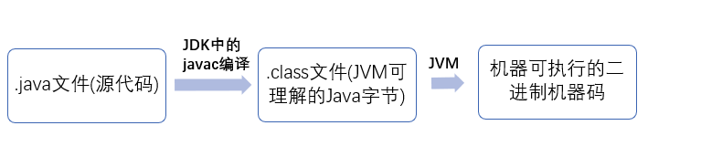
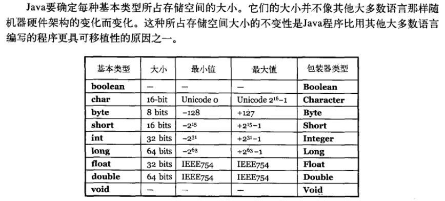

# Java SE 相关面试题

## 1. 面向对象和面向过程的区别

### 面向过程

**优点：** 性能比面向对象高，在面向对象中, 因为类调用时需要实例化，开销比较大，比较消耗资源; 

比如单片机、嵌入式开发、Linux/Unix等一般采用面向过程开发，性能是最重要的因素。

**缺点：** 没有面向对象易维护、易复用、易扩展

### 面向对象

**优点：** 易维护、易复用、易扩展，由于面向对象有封装、继承、多态性的特性，可以设计出低耦合的系统，使系统更加灵活、更加易于维护

**缺点：** 性能比面向过程低

## 2. Java 语言有哪些特点

1. 简单易学；
2. 面向对象（封装，继承，多态）；
3. 平台无关性（ Java 虚拟机实现平台无关性）；
4. 可靠性；
5. 安全性；
6. 支持多线程（ C++ 语言没有内置的多线程机制，因此必须调用操作系统的多线程功能来进行多线程程序设计，而 Java 语言却提供了多线程支持）；
7. 支持网络编程并且很方便（ Java 语言诞生本身就是为简化网络编程设计的，因此 Java 语言不仅支持网络编程而且很方便）；
8. 编译与解释并存；

## 3. JVM JDK 和 JRE 的区别

### JVM

Java虚拟机（JVM）是运行 Java 字节码的虚拟机。JVM有针对不同系统的特定实现（Windows，Linux，macOS），目的是使用相同的字节码，它们都会给出相同的结果。

::: tip 什么是字节码?采用字节码的好处是什么?
 在 Java 中，JVM可以理解的代码就叫做`字节码`（即扩展名为 `.class` 的文件），它不面向任何特定的处理器，只面向虚拟机。Java 语言通过字节码的方式，在一定程度上解决了传统解释型语言执行效率低的问题，同时又保留了解释型语言可移植的特点。所以 Java 程序运行时比较高效，而且，由于字节码并不专对一种特定的机器，因此，Java程序无须重新编译便可在多种不同的计算机上运行。
:::

**Java 程序从源代码到运行一般有下面3步：**


我们需要格外注意的是 .class->机器码 这一步。在这一步 jvm 类加载器首先加载字节码文件，然后通过解释器逐行解释执行，这种方式的执行速度会相对比较慢。而且，有些方法和代码块是经常需要被调用的，也就是所谓的热点代码，所以后面引进了 **JIT 编译器**，JIT 属于**运行时**编译。当 JIT 编译器完成第一次编译后，其会将字节码对应的机器码保存下来，下次可以直接使用。而我们知道，机器码的运行效率肯定是高于 Java 解释器的。这也解释了我们为什么经常会说 Java 是编译与解释共存的语言。

::: tip
HotSpot采用了惰性评估(Lazy Evaluation)的做法，根据二八定律，消耗大部分系统资源的只有那一小部分的代码（热点代码），而这也就是JIT所需要编译的部分。JVM会根据代码每次被执行的情况收集信息并相应地做出一些优化，因此执行的次数越多，它的速度就越快。JDK 9引入了一种新的编译模式AOT(Ahead of Time Compilation)，它是直接将字节码编译成机器码，这样就避免了JIT预热等各方面的开销。JDK支持分层编译和AOT协作使用。但是 ，AOT 编译器的编译质量是肯定比不上 JIT 编译器的。
:::

总结：Java虚拟机（JVM）是运行 Java 字节码的虚拟机。JVM有针对不同系统的特定实现（Windows，Linux，macOS），目的是使用相同的字节码，它们都会给出相同的结果。字节码和不同系统的 JVM  实现是 Java 语言“一次编译，随处可以运行”的关键所在。 

### JDK 和 JRE

JDK是Java Development Kit，它是功能齐全的Java SDK。它拥有JRE所拥有的一切，还有编译器（javac）和工具（如javadoc和jdb）。它能够创建和编译程序。

JRE 是 Java运行时环境。它是运行已编译 Java 程序所需的所有内容的集合，包括 Java虚拟机（JVM），Java类库，java命令和其他的一些基础构件。但是，它不能用于创建新程序。

如果你只是为了运行一下 Java 程序的话，那么你只需要安装 JRE 就可以了。如果你需要进行一些 Java 编程方面的工作，那么你就需要安装JDK了。但是，这不是绝对的。有时，即使您不打算在计算机上进行任何Java开发，仍然需要安装JDK。例如，如果要使用JSP部署Web应用程序，那么从技术上讲，您只是在应用程序服务器中运行Java程序。那你为什么需要JDK呢？因为应用程序服务器会将 JSP 转换为 Java servlet，并且需要使用 JDK 来编译 servlet。

## 4. Oracle JDK 和 OpenJDK 的对比

可能在看这个问题之前很多人和我一样并没有接触和使用过  OpenJDK 。那么Oracle和OpenJDK之间是否存在重大差异？下面通过我通过我收集到一些资料对你解答这个被很多人忽视的问题。

对于Java 7，没什么关键的地方。OpenJDK项目主要基于Sun捐赠的HotSpot源代码。此外，OpenJDK被选为Java 7的参考实现，由Oracle工程师维护。关于JVM，JDK，JRE和OpenJDK之间的区别，Oracle博客帖子在2012年有一个更详细的答案：

::: tip OpenJDK存储库中的源代码与用于构建Oracle JDK的代码之间的区别
**非常接近**

Oracle JDK 版本构建过程基于 OpenJDK 7 构建，只添加了几个部分，例如部署代码，其中包括 Oracle 的 Java 插件和 Java WebStart 的实现，以及一些封闭的源代码派对组件，如图形光栅化器，一些开源的第三方组件，如 Rhino，以及一些零碎的东西，如附加文档或第三方字体。展望未来，我们的目的是开源 Oracle JDK 的所有部分，除了我们考虑商业功能的部分。
:::

总结：

1. Oracle JDK版本将每三年发布一次，而OpenJDK版本每三个月发布一次；
2. OpenJDK 是一个参考模型并且是完全开源的，而Oracle JDK是OpenJDK的一个实现，并不是完全开源的；
3. Oracle JDK 比 OpenJDK 更稳定。OpenJDK和Oracle JDK的代码几乎相同，但Oracle JDK有更多的类和一些错误修复。因此，如果您想开发企业/商业软件，我建议您选择Oracle JDK，因为它经过了彻底的测试和稳定。某些情况下，有些人提到在使用OpenJDK 可能会遇到了许多应用程序崩溃的问题，但是，只需切换到Oracle JDK就可以解决问题；
4. 在响应性和JVM性能方面，Oracle JDK与OpenJDK相比提供了更好的性能；
5. Oracle JDK不会为即将发布的版本提供长期支持，用户每次都必须通过更新到最新版本获得支持来获取最新版本；
6. Oracle JDK根据二进制代码许可协议获得许可，而OpenJDK根据GPL v2许可获得许可。

## 5. Java 和 C++ 的区别

我知道很多人没学过 C++，但是面试官就是没事喜欢拿咱们 Java 和 C++ 比呀！没办法！！！就算没学过C++，也要记下来！

- 都是面向对象的语言，都支持封装、继承和多态
- Java 不提供指针来直接访问内存，程序内存更加安全
- Java 的类是单继承的，C++ 支持多重继承；虽然 Java 的类不可以多继承，但是接口可以多继承。
- Java 有自动内存管理机制，不需要程序员手动释放无用内存

## 6. 什么是 Java 程序的主类 应用程序和小程序的主类有何不同

一个程序中可以有多个类，但只能有一个类是主类。在 Java 应用程序中，这个主类是指包含 main（）方法的类。而在 Java 小程序中，这个主类是一个继承自系统类 JApplet 或 Applet 的子类。应用程序的主类不一定要求是 public 类，但小程序的主类要求必须是 public 类。主类是 Java 程序执行的入口点。

## 7. Java 应用程序与小程序之间有那些差别

简单说应用程序是从主线程启动(也就是 main() 方法)。applet 小程序没有main方法，主要是嵌在浏览器页面上运行(调用init()线程或者run()来启动)，嵌入浏览器这点跟 flash 的小游戏类似。

## 8. 字符型常量和字符串常量的区别

1. 形式上: 字符常量是单引号引起的一个字符 字符串常量是双引号引起的若干个字符
2. 含义上: 字符常量相当于一个整形值( ASCII 值),可以参加表达式运算 字符串常量代表一个地址值(该字符串在内存中存放位置)
3. 占内存大小 字符常量只占2个字节 字符串常量占若干个字节(至少一个字符结束标志) (**注意： char在Java中占两个字节**)

::: tip Java 编程思想第四版：2.2.2节

:::

## 9. 构造器 Constructor 是否可被 override

在讲继承的时候我们就知道父类的私有属性和构造方法并不能被继承，所以 Constructor 也就不能被 override（重写）,但是可以 overload（重载）,所以你可以看到一个类中有多个构造函数的情况。

## 10. 重载和重写的区别

**重载：** 发生在同一个类中，方法名必须相同，参数类型不同、个数不同、顺序不同，方法返回值和访问修饰符可以不同，发生在编译时。 　　

**重写：**   发生在父子类中，方法名、参数列表必须相同，返回值范围小于等于父类，抛出的异常范围小于等于父类，访问修饰符范围大于等于父类；如果父类方法访问修饰符为 private 则子类就不能重写该方法。

## 11. Java 面向对象编程三大特性: 封装 继承 多态

### [封装](../java/se/encapsulation.md)

封装把一个对象的属性私有化，同时提供一些可以被外界访问的属性的方法，如果属性不想被外界访问，我们大可不必提供方法给外界访问。但是如果一个类没有提供给外界访问的方法，那么这个类也没有什么意义了。

### [继承](../java/se/inheritance.md)

继承是使用已存在的类的定义作为基础建立新类的技术，新类的定义可以增加新的数据或新的功能，也可以用父类的功能，但不能选择性地继承父类。通过使用继承我们能够非常方便地复用以前的代码。

**关于继承如下 3 点请记住：**

1. 子类拥有父类非 private 的属性和方法。
2. 子类可以拥有自己属性和方法，即子类可以对父类进行扩展。
3. 子类可以用自己的方式实现父类的方法。（以后介绍）。

### [多态](../java/se/polymorphism.md)

所谓多态就是指程序中定义的引用变量所指向的具体类型和通过该引用变量发出的方法调用在编程时并不确定，而是在程序运行期间才确定，即一个引用变量到底会指向哪个类的实例对象，该引用变量发出的方法调用到底是哪个类中实现的方法，必须在由程序运行期间才能决定。

在Java中有两种形式可以实现多态：继承（多个子类对同一方法的重写）和接口（实现接口并覆盖接口中同一方法）。

## 12. [String,StringBuffer, StringBuilder 的区别](../java/se/string_kind.md)

**可变性**

简单的来说：String 类中使用 final 关键字字符数组保存字符串，`private　final　char　value[]`，所以 String 对象是不可变的。而StringBuilder 与 StringBuffer 都继承自 AbstractStringBuilder 类，在 AbstractStringBuilder 中也是使用字符数组保存字符串`char[]value` 但是没有用 final 关键字修饰，所以这两种对象都是可变的。

StringBuilder 与 StringBuffer 的构造方法都是调用父类构造方法也就是 AbstractStringBuilder 实现的，大家可以自行查阅源码。

AbstractStringBuilder.java

```java
abstract class AbstractStringBuilder implements Appendable, CharSequence {
    char[] value;
    int count;
    AbstractStringBuilder() {
    }
    AbstractStringBuilder(int capacity) {
        value = new char[capacity];
    }
}
```

**线程安全性**

String 中的对象是不可变的，也就可以理解为常量，线程安全。AbstractStringBuilder 是 StringBuilder 与 StringBuffer 的公共父类，定义了一些字符串的基本操作，如 expandCapacity、append、insert、indexOf 等公共方法。StringBuffer 对方法加了同步锁或者对调用的方法加了同步锁，所以是线程安全的。StringBuilder 并没有对方法进行加同步锁，所以是非线程安全的。
　　
**性能**

每次对 String 类型进行改变的时候，都会生成一个新的 String 对象，然后将指针指向新的 String 对象。StringBuffer 每次都会在对象本身进行操作，而不是生成新的对象并改变对象引用。相同情况下使用 StringBuilder 相比使用 StringBuffer 仅能获得 10%~15% 左右的性能提升，但却要冒多线程不安全的风险。

**对于三者使用的总结：** 

1. 操作少量的数据 = String
2. 单线程操作字符串缓冲区下操作大量数据 = StringBuilder
3. 多线程操作字符串缓冲区下操作大量数据 = StringBuffer

## 13. [自动装箱与拆箱](../java/se/wrapper_class.md)

**装箱**：将基本类型用它们对应的引用类型包装起来；

**拆箱**：将包装类型转换为基本数据类型；

## 14. 在一个静态方法内调用一个非静态成员为什么是非法的

由于静态方法可以不通过对象进行调用，因此在静态方法里，不能调用其他非静态变量，也不可以访问非静态变量成员。

## 15. 在 Java 中定义一个不做事且没有参数的构造方法的作用

　Java 程序在执行子类的构造方法之前，如果没有用 super() 来调用父类特定的构造方法，则会调用父类中“没有参数的构造方法”。因此，如果父类中只定义了有参数的构造方法，而在子类的构造方法中又没有用 super() 来调用父类中特定的构造方法，则编译时将发生错误，因为 Java 程序在父类中找不到没有参数的构造方法可供执行。解决办法是在父类里加上一个不做事且没有参数的构造方法。
　
## 16. import java 和 javax 的区别

刚开始的时候 JavaAPI 所必需的包是 java 开头的包，javax 当时只是扩展 API 包来说使用。然而随着时间的推移，javax 逐渐的扩展成为 Java API 的组成部分。但是，将扩展从 javax 包移动到 java 包将是太麻烦了，最终会破坏一堆现有的代码。因此，最终决定 javax 包将成为标准API的一部分。

所以，实际上 java 和 javax 没有区别。这都是一个名字。

## 17. [接口和抽象类的区别](../java/se/abstract_interface.md)

1. 接口的方法默认是 public，所有方法在接口中不能有实现(Java 8 开始接口方法可以有默认实现），抽象类可以有非抽象的方法
2. 接口中的实例变量默认是 final 类型的，而抽象类中则不一定 
3. 一个类可以实现多个接口，但最多只能实现一个抽象类 
4. 一个类实现接口的话要实现接口的所有方法，而抽象类不一定 
5. 接口不能用 new 实例化，但可以声明，但是必须引用一个实现该接口的对象 从设计层面来说，抽象是对类的抽象，是一种模板设计，接口是行为的抽象，是一种行为的规范。

备注:在 JDK8 中，接口也可以定义静态方法，可以直接用接口名调用。实现类和实现是不可以调用的。如果同时实现两个接口，接口中定义了一样的默认方法，必须重写，不然会报错。(详见issue:[https://github.com/Snailclimb/JavaGuide/issues/146](https://github.com/Snailclimb/JavaGuide/issues/146))

## 18. 成员变量与局部变量的区别

1. 从语法形式上，看成员变量是属于类的，而局部变量是在方法中定义的变量或是方法的参数；成员变量可以被 public,private,static 等修饰符所修饰，而局部变量不能被访问控制修饰符及 static 所修饰；但是，成员变量和局部变量都能被 final 所修饰；
2. 从变量在内存中的存储方式来看，成员变量是对象的一部分，而对象存在于堆内存，局部变量存在于栈内存
3. 从变量在内存中的生存时间上看，成员变量是对象的一部分，它随着对象的创建而存在，而局部变量随着方法的调用而自动消失。
4. 成员变量如果没有被赋初值，则会自动以类型的默认值而赋值（一种情况例外被 final 修饰的成员变量也必须显示地赋值）；而局部变量则不会自动赋值。

## 19. 创建一个对象用什么运算符?对象实体与对象引用有何不同?

[创建对象的几种方式](../java/se/new_instance_way.md)

new 运算符，new 创建对象实例（对象实例在堆内存中），对象引用指向对象实例（对象引用存放在栈内存中）。一个对象引用可以指向0个或1个对象（一根绳子可以不系气球，也可以系一个气球）;一个对象可以有n个引用指向它（可以用n条绳子系住一个气球）。

## 20. 什么是方法的返回值?返回值在类的方法里的作用是什么?

 方法的返回值是指我们获取到的某个方法体中的代码执行后产生的结果！（前提是该方法可能产生结果）。返回值的作用:接收出结果，使得它可以用于其他的操作！

## 21. 一个类的构造方法的作用是什么 若一个类没有声明构造方法,该程序能正确执行吗 ?为什么?

主要作用是完成对类对象的初始化工作。可以执行。因为一个类即使没有声明构造方法也会有默认的不带参数的构造方法。

## 22. 构造方法有哪些特性

1. 名字与类名相同；
2. 没有返回值，但不能用void声明构造函数；
3. 生成类的对象时自动执行，无需调用。

## 23. 静态方法和实例方法有何不同

1. 在外部调用静态方法时，可以使用"类名.方法名"的方式，也可以使用"对象名.方法名"的方式。而实例方法只有后面这种方式。也就是说，调用静态方法可以无需创建对象。 
2. 静态方法在访问本类的成员时，只允许访问静态成员（即静态成员变量和静态方法），而不允许访问实例成员变量和实例方法；实例方法则无此限制.

## 24. 对象的相等与指向他们的引用相等,两者有什么不同?

对象的相等，比的是内存中存放的内容是否相等。而引用相等，比较的是他们指向的内存地址是否相等。

## 25. 在调用子类构造方法之前会先调用父类没有参数的构造方法,其目的是?

帮助子类做初始化工作。

## 26. == 与 equals(重要)

**==** : 它的作用是判断两个对象的地址是不是相等。即，判断两个对象是不是同一个对象。(基本数据类型==比较的是值，引用数据类型==比较的是内存地址)

**equals()** : 它的作用也是判断两个对象是否相等。但它一般有两种使用情况：
-  情况1：类没有覆盖 equals() 方法。则通过 equals() 比较该类的两个对象时，等价于通过“==”比较这两个对象。
- 情况2：类覆盖了 equals() 方法。一般，我们都覆盖 equals() 方法来两个对象的内容相等；若它们的内容相等，则返回 true (即，认为这两个对象相等)。


**举个例子：**

```java
public class test1 {
    public static void main(String[] args) {
        String a = new String("ab"); // a 为一个引用
        String b = new String("ab"); // b为另一个引用,对象的内容一样
        String aa = "ab"; // 放在常量池中
        String bb = "ab"; // 从常量池中查找
        if (aa == bb) // true
            System.out.println("aa==bb");
        if (a == b) // false，非同一对象
            System.out.println("a==b");
        if (a.equals(b)) // true
            System.out.println("aEQb");
        if (42 == 42.0) { // true
            System.out.println("true");
        }
    }
}
```

**说明：**

- String 中的 equals 方法是被重写过的，因为 object 的 equals 方法是比较的对象的内存地址，而 String 的 equals 方法比较的是对象的值。
- 当创建 String 类型的对象时，虚拟机会在常量池中查找有没有已经存在的值和要创建的值相同的对象，如果有就把它赋给当前引用。如果没有就在常量池中重新创建一个 String 对象。

##  27. hashCode 与 equals (重要)

面试官可能会问你：“你重写过 hashcode 和 equals 么，为什么重写equals时必须重写hashCode方法？”

### hashCode（）介绍

hashCode() 的作用是获取哈希码，也称为散列码；它实际上是返回一个int整数。这个哈希码的作用是确定该对象在哈希表中的索引位置。hashCode() 定义在JDK的Object.java中，这就意味着Java中的任何类都包含有hashCode() 函数。

散列表存储的是键值对(key-value)，它的特点是：能根据“键”快速的检索出对应的“值”。这其中就利用到了散列码！（可以快速找到所需要的对象）

### 为什么要有 hashCode

**我们以“HashSet 如何检查重复”为例子来说明为什么要有 hashCode：**

当你把对象加入 HashSet 时，HashSet 会先计算对象的 hashcode 值来判断对象加入的位置，同时也会与其他已经加入的对象的 hashcode 值作比较，如果没有相符的hashcode，HashSet会假设对象没有重复出现。但是如果发现有相同 hashcode 值的对象，这时会调用 equals（）方法来检查 hashcode 相等的对象是否真的相同。如果两者相同，HashSet 就不会让其加入操作成功。如果不同的话，就会重新散列到其他位置。（摘自我的Java启蒙书《Head first java》第二版）。这样我们就大大减少了 equals 的次数，相应就大大提高了执行速度。

### hashCode（）与equals（）的相关规定

1. 如果两个对象相等，则hashcode一定也是相同的
2. 两个对象相等,对两个对象分别调用equals方法都返回true
3. 两个对象有相同的hashcode值，它们也不一定是相等的
4. **因此，equals 方法被覆盖过，则 hashCode 方法也必须被覆盖**
5. hashCode() 的默认行为是对堆上的对象产生独特值。如果没有重写 hashCode()，则该 class 的两个对象无论如何都不会相等（即使这两个对象指向相同的数据）

## 28. 为什么Java中只有值传递

 [为什么Java中只有值传递？](https://github.com/Snailclimb/Java-Guide/blob/master/%E9%9D%A2%E8%AF%95%E5%BF%85%E5%A4%87/%E6%9C%80%E6%9C%80%E6%9C%80%E5%B8%B8%E8%A7%81%E7%9A%84Java%E9%9D%A2%E8%AF%95%E9%A2%98%E6%80%BB%E7%BB%93/%E7%AC%AC%E4%B8%80%E5%91%A8%EF%BC%882018-8-7%EF%BC%89.md)

## 29. 简述线程,程序,进程的基本概念.以及他们之间关系是什么?

**线程**与进程相似，但线程是一个比进程更小的执行单位。一个进程在其执行的过程中可以产生多个线程。与进程不同的是同类的多个线程共享同一块内存空间和一组系统资源，所以系统在产生一个线程，或是在各个线程之间作切换工作时，负担要比进程小得多，也正因为如此，线程也被称为轻量级进程。  

**程序**是含有指令和数据的文件，被存储在磁盘或其他的数据存储设备中，也就是说程序是静态的代码。

**进程**是程序的一次执行过程，是系统运行程序的基本单位，因此进程是动态的。系统运行一个程序即是一个进程从创建，运行到消亡的过程。简单来说，一个进程就是一个执行中的程序，它在计算机中一个指令接着一个指令地执行着，同时，每个进程还占有某些系统资源如CPU时间，内存空间，文件，文件，输入输出设备的使用权等等。换句话说，当程序在执行时，将会被操作系统载入内存中。
线程是进程划分成的更小的运行单位。线程和进程最大的不同在于基本上各进程是独立的，而各线程则不一定，因为同一进程中的线程极有可能会相互影响。从另一角度来说，进程属于操作系统的范畴，主要是同一段时间内，可以同时执行一个以上的程序，而线程则是在同一程序内几乎同时执行一个以上的程序段。

## 30. 线程有哪些基本状态?

参考《Java 并发编程艺术》4.1.4节。

Java 线程在运行的生命周期中的指定时刻只可能处于下面6种不同状态的其中一个状态。


线程在生命周期中并不是固定处于某一个状态而是随着代码的执行在不同状态之间切换。Java 线程状态变迁如下图所示：


## 31 关于 final 关键字的一些总结

[final、finally 和 finalize 的区别](../java/se/final_finally_finalize.md)

final关键字主要用在三个地方：变量、方法、类。

1. 对于一个final变量，如果是基本数据类型的变量，则其数值一旦在初始化之后便不能更改；如果是引用类型的变量，则在对其初始化之后便不能再让其指向另一个对象。
2. 当用final修饰一个类时，表明这个类不能被继承。final类中的所有成员方法都会被隐式地指定为final方法。
3. 使用final方法的原因有两个。第一个原因是把方法锁定，以防任何继承类修改它的含义；第二个原因是效率。在早期的Java实现版本中，会将final方法转为内嵌调用。但是如果方法过于庞大，可能看不到内嵌调用带来的任何性能提升（现在的Java版本已经不需要使用final方法进行这些优化了）。类中所有的private方法都隐式地指定为final。

## 32 [Java 中的异常处理](../java/se/exception.md)

### Java 异常类层次结构图


   在 Java 中，所有的异常都有一个共同的祖先java.lang包中的 **Throwable类**。Throwable： 有两个重要的子类：**Exception（异常）** 和 **Error（错误）** ，二者都是 Java 异常处理的重要子类，各自都包含大量子类。

**Error（错误）:是程序无法处理的错误**，表示运行应用程序中较严重问题。大多数错误与代码编写者执行的操作无关，而表示代码运行时 JVM（Java 虚拟机）出现的问题。例如，Java虚拟机运行错误（Virtual MachineError），当 JVM 不再有继续执行操作所需的内存资源时，将出现 OutOfMemoryError。这些异常发生时，Java虚拟机（JVM）一般会选择线程终止。

这些错误表示故障发生于虚拟机自身、或者发生在虚拟机试图执行应用时，如Java虚拟机运行错误（Virtual MachineError）、类定义错误（NoClassDefFoundError）等。这些错误是不可查的，因为它们在应用程序的控制和处理能力之 外，而且绝大多数是程序运行时不允许出现的状况。对于设计合理的应用程序来说，即使确实发生了错误，本质上也不应该试图去处理它所引起的异常状况。在 Java中，错误通过Error的子类描述。

**Exception（异常）:是程序本身可以处理的异常**。</font>Exception 类有一个重要的子类 **RuntimeException**。RuntimeException 异常由Java虚拟机抛出。**NullPointerException**（要访问的变量没有引用任何对象时，抛出该异常）、**ArithmeticException**（算术运算异常，一个整数除以0时，抛出该异常）和 **ArrayIndexOutOfBoundsException** （下标越界异常）。

**注意：异常和错误的区别：异常能被程序本身可以处理，错误是无法处理。**

### Throwable 类常用方法

- **public string getMessage()**:返回异常发生时的详细信息
- **public string toString()**:返回异常发生时的简要描述
- **public string getLocalizedMessage()**:返回异常对象的本地化信息。使用Throwable的子类覆盖这个方法，可以声称本地化信息。如果子类没有覆盖该方法，则该方法返回的信息与getMessage（）返回的结果相同
- **public void printStackTrace()**:在控制台上打印Throwable对象封装的异常信息

### 异常处理总结

- try 块：用于捕获异常。其后可接零个或多个catch块，如果没有catch块，则必须跟一个finally块。
- catch 块：用于处理try捕获到的异常。
- finally 块：无论是否捕获或处理异常，finally块里的语句都会被执行。当在try块或catch块中遇到return语句时，finally语句块将在方法返回之前被执行。

**在以下4种特殊情况下，finally块不会被执行：**

1. 在finally语句块中发生了异常。
2. 在前面的代码中用了System.exit()退出程序。
3. 程序所在的线程死亡。
4. 关闭CPU。

## 33 Java 序列化中如果有些字段不想进行序列化,怎么办?

对于不想进行序列化的变量，使用transient关键字修饰。

transient关键字的作用是：阻止实例中那些用此关键字修饰的的变量序列化；当对象被反序列化时，被transient修饰的变量值不会被持久化和恢复。transient只能修饰变量，不能修饰类和方法。

## 34 获取用键盘输入常用的的两种方法

方法1：通过 Scanner

```java
Scanner input = new Scanner(System.in);
String s  = input.nextLine();
input.close();
```

方法2：通过 BufferedReader 

```java
BufferedReader input = new BufferedReader(new InputStreamReader(System.in)); 
String s = input.readLine(); 
```

## 1. equals 的写法

```java
public boolean equals(Object o){
    if(this == o) return true;
    if(o == null) return false;
    if(!o instanceof strudent) return false;
    student s = (student)o;
    if(s.name.equals(this.name) && s.age == this.age) return true;
    else return false;
}
```

## 2. 说说 & 和 && 的区别。 
&和&&都可以用作逻辑与的运算符，表示逻辑与（and），当运算符两边的表达式的结果都为true时，整个运算结果才为true，否则，只要有一方为false，则结果为false。
&&还具有短路的功能，即如果第一个表达式为false，则不再计算第二个表达式，例如，对于if(str != null && !str.equals(“”))表达式，当str为null时，后面的表达式不会执行，所以不会出现NullPointerException如果将&&改为&，则会抛出NullPointerException异常。If(x==33 & ++y>0) y会增长，If(x==33 && ++y>0)不会增长
&还可以用作位运算符，当&操作符两边的表达式不是boolean类型时，&表示按位与操作，我们通常使用0x0f来与一个整数进行&运算，来获取该整数的最低4个bit位，例如，0x31 & 0x0f的结果为0x01。 

备注：这道题先说两者的共同点，再说出&&和&的特殊之处，并列举一些经典的例子来表明自己理解透彻深入、实际经验丰富。

## 3. short s1 = 1; s1 = s1 + 1;有什么错? short s1 = 1; s1 += 1;有什么错? 
对于short s1 = 1; s1 = s1 + 1; 由于s1+1运算时会自动提升表达式的类型，所以结果是int型，再赋值给short类型s1时，编译器将报告需要强制转换类型的错误。
对于short s1 = 1; s1 += 1;由于 += 是java语言规定的运算符，java编译器会对它进行特殊处理，因此可以正确编译。

## 4. char型变量中能不能存贮一个中文汉字?为什么? 
char型变量是用来存储Unicode编码的字符的，unicode编码字符集中包含了汉字，所以，char型变量中当然可以存储汉字啦。不过，如果某个特殊的汉字没有被包含在unicode编码字符集中，那么，这个char型变量中就不能存储这个特殊汉字。补充说明：unicode编码占用两个字节，所以，char类型的变量也是占用两个字节。

## 5. 使用final关键字修饰一个变量时，是引用不能变，还是引用的对象不能变？ 
使用final关键字修饰一个变量时，是指引用变量不能变，引用变量所指向的对象中的内容还是可以改变的。例如，对于如下语句：
 final StringBuffer a=new StringBuffer("immutable");
执行如下语句将报告编译期错误：
a=new StringBuffer("");
但是，执行如下语句则可以通过编译：
a.append(" broken!"); 

有人在定义方法的参数时，可能想采用如下形式来阻止方法内部修改传进来的参数对象：
	public void method(final  StringBuffer  param)
	{
	} 
实际上，这是办不到的，在该方法内部仍然可以增加如下代码来修改参数对象：
		param.append("a");
		
## 6. "==" 和 equals 方法究竟有什么区别？
==操作符专门用来比较两个变量的值是否相等，也就是用于比较变量所对应的内存中所存储的数值是否相同，要比较两个基本类型的数据或两个引用变量是否相等，只能用==操作符。
如果一个变量指向的数据是对象类型的，那么，这时候涉及了两块内存，对象本身占用一块内存（堆内存），变量也占用一块内存，例如Objet obj = new Object();变量obj是一个内存，new Object()是另一个内存，此时，变量obj所对应的内存中存储的数值就是对象占用的那块内存的首地址。对于指向对象类型的变量，如果要比较两个变量是否指向同一个对象，即要看这两个变量所对应的内存中的数值是否相等，这时候就需要用==操作符进行比较。
equals方法是用于比较两个独立对象的内容是否相同，就好比去比较两个人的长相是否相同，它比较的两个对象是独立的。例如，对于下面的代码：
String a=new String("foo");
String b=new String("foo");
两条new语句创建了两个对象，然后用a,b这两个变量分别指向了其中一个对象，这是两个不同的对象，它们的首地址是不同的，即a和b中存储的数值是不相同的，所以，表达式a==b将返回false，而这两个对象中的内容是相同的，所以，表达式a.equals(b)将返回true。
在实际开发中，我们经常要比较传递进行来的字符串内容是否等，例如，String input = …;input.equals(“quit”)，许多人稍不注意就使用==进行比较了，这是错误的，随便从网上找几个项目实战的教学视频看看，里面就有大量这样的错误。记住，字符串的比较基本上都是使用equals方法。
如果一个类没有自己定义equals方法，那么它将继承Object类的equals方法，Object类的equals方法的实现代码如下：
boolean equals(Object o){
return this==o;
}
这说明，如果一个类没有自己定义equals方法，它默认的equals方法（从Object 类继承的）就是使用==操作符，也是在比较两个变量指向的对象是否是同一对象，这时候使用equals和使用==会得到同样的结果，如果比较的是两个独立的对象则总返回false。如果你编写的类希望能够比较该类创建的两个实例对象的内容是否相同，那么你必须覆盖equals方法，由你自己写代码来决定在什么情况即可认为两个对象的内容是相同的。

## 7. 静态变量和实例变量的区别？ 
在语法定义上的区别：静态变量前要加static关键字，而实例变量前则不加。
在程序运行时的区别：实例变量属于某个对象的属性，必须创建了实例对象，其中的实例变量才会被分配空间，才能使用这个实例变量。静态变量不属于某个实例对象，而是属于类，所以也称为类变量，只要程序加载了类的字节码，不用创建任何实例对象，静态变量就会被分配空间，静态变量就可以被使用了。总之，实例变量必须创建对象后才可以通过这个对象来使用，静态变量则可以直接使用类名来引用。
例如，对于下面的程序，无论创建多少个实例对象，永远都只分配了一个staticVar变量，并且每创建一个实例对象，这个staticVar就会加1；但是，每创建一个实例对象，就会分配一个instanceVar，即可能分配多个instanceVar，并且每个instanceVar的值都只自加了1次。

```java
public class VariantTest{
		public static int staticVar = 0; 
		public int instanceVar = 0; 
		public VariantTest(){
			staticVar++;
			instanceVar++;
			System.out.println("staticVar=" + staticVar + ",instanceVar=" + instanceVar);
		}
}
```

## 8. 是否可以从一个static方法内部发出对非static方法的调用？ 
不可以。因为非static方法是要与对象关联在一起的，必须创建一个对象后，才可以在该对象上进行方法调用，而static方法调用时不需要创建对象，可以直接调用。也就是说，当一个static方法被调用时，可能还没有创建任何实例对象，如果从一个static方法中发出对非static方法的调用，那个非static方法是关联到哪个对象上的呢？这个逻辑无法成立，所以，一个static方法内部发出对非static方法的调用。

## 9. Math.round(11.5)等於多少? Math.round(-11.5)等於多少?
Math类中提供了三个与取整有关的方法：ceil、floor、round，这些方法的作用与它们的英文名称的含义相对应，例如，ceil的英文意义是天花板，该方法就表示向上取整，所以，Math.ceil(11.3)的结果为12,Math.ceil(-11.3)的结果是-11；floor的英文意义是地板，该方法就表示向下取整，所以，Math.floor(11.6)的结果为11,Math.floor(-11.6)的结果是-12；最难掌握的是round方法，它表示“四舍五入”，算法为Math.floor(x+0.5)，即将原来的数字加上0.5后再向下取整，所以，Math.round(11.5)的结果为12，Math.round(-11.5)的结果为-11。

## 10. 类的加载机制


类初始化时机：只有当对类的主动使用的时候才会导致类的初始化，类的主动使用包括以下六种：

- 创建类的实例，也就是new的方式
- 访问某个类或接口的静态变量，或者对该静态变量赋值
- 调用类的静态方法
- 反射（如Class.forName(“com.shengsiyuan.Test”)）
- 初始化某个类的子类，则其父类也会被初始化
- Java虚拟机启动时被标明为启动类的类（Java Test），直接使用java.exe命令来运行某个主类

在如下几种情况下，Java虚拟机将结束生命周期

- 执行了System.exit()方法
- 程序正常执行结束
- 程序在执行过程中遇到了异常或错误而异常终止
- 由于操作系统出现错误而导致Java虚拟机进程终止


**启动类加载器：**
Bootstrap ClassLoader，负责加载存放在JDK\jre\lib(JDK代表JDK的安装目录，下同)下，或被-Xbootclasspath参数指定的路径中的，并且能被虚拟机识别的类库（如rt.jar，所有的java.*开头的类均被Bootstrap ClassLoader加载）。启动类加载器是无法被Java程序直接引用的。

**扩展类加载器：**
Extension ClassLoader，该加载器由sun.misc.Launcher$ExtClassLoader实现，它负责加载JDK\jre\lib\ext目录中，或者由java.ext.dirs系统变量指定的路径中的所有类库（如javax.*开头的类），开发者可以直接使用扩展类加载器。

**应用程序类加载器：**
Application ClassLoader，该类加载器由sun.misc.Launcher$AppClassLoader来实现，它负责加载用户类路径（ClassPath）所指定的类，开发者可以直接使用该类加载器，如果应用程序中没有自定义过自己的类加载器，一般情况下这个就是程序中默认的类加载器。

### [双亲委派模型](../java/jvm/parents_dlegation_mode.md)

::: tip 双亲委派模型的工作流程
如果一个类加载器收到了类加载的请求，它首先不会自己去尝试加载这个类，而是把请求委托给父加载器去完成，依次向上，因此，所有的类加载请求最终都应该被传递到顶层的启动类加载器中，只有当父加载器在它的搜索范围中没有找到所需的类时，即无法完成该加载，子加载器才会尝试自己去加载该类。
:::

**双亲委派机制:**

1. 当AppClassLoader加载一个class时，它首先不会自己去尝试加载这个类，而是把类加载请求委派给父类加载器ExtClassLoader去完成。
2. 当ExtClassLoader加载一个class时，它首先也不会自己去尝试加载这个类，而是把类加载请求委派给BootStrapClassLoader去完成。
3. 如果BootStrapClassLoader加载失败（例如在$JAVA_HOME/jre/lib里未查找到该class），会使用ExtClassLoader来尝试加载；
4. 若ExtClassLoader也加载失败，则会使用AppClassLoader来加载，如果AppClassLoader也加载失败，则会报出异常ClassNotFoundException。

```java
public Class<?> loadClass(String name)throws ClassNotFoundException {
            return loadClass(name, false);
}

protected synchronized Class<?> loadClass(String name, boolean resolve)throws ClassNotFoundException {
	// 首先判断该类型是否已经被加载
	Class c = findLoadedClass(name);
	if (c == null) {
		//如果没有被加载，就委托给父类加载或者委派给启动类加载器加载
		try {
			if (parent != null) {
				 //如果存在父类加载器，就委派给父类加载器加载
				c = parent.loadClass(name, false);
			} else {
			//如果不存在父类加载器，就检查是否是由启动类加载器加载的类，通过调用本地方法native Class findBootstrapClass(String name)
				c = findBootstrapClass0(name);
			}
		} catch (ClassNotFoundException e) {
		 // 如果父类加载器和启动类加载器都不能完成加载任务，才调用自身的加载功能
			c = findClass(name);
		}
	}
	if (resolve) {
		resolveClass(c);
	}
	return c;
}
```

**双亲委派模型意义：**

- 系统类防止内存中出现多份同样的字节码
- 保证Java程序安全稳定运行

**自定义加载器**

```java
package com.neo.classloader;
import java.io.*;

public class MyClassLoader extends ClassLoader {
    private String root;
    protected Class<?> findClass(String name) throws ClassNotFoundException {
        byte[] classData = loadClassData(name);
        if (classData == null) {
            throw new ClassNotFoundException();
        } else {
            return defineClass(name, classData, 0, classData.length);
        }
    }

    private byte[] loadClassData(String className) {
        String fileName = root + File.separatorChar
                + className.replace('.', File.separatorChar) + ".class";
        try {
            InputStream ins = new FileInputStream(fileName);
            ByteArrayOutputStream baos = new ByteArrayOutputStream();
            int bufferSize = 1024;
            byte[] buffer = new byte[bufferSize];
            int length = 0;
            while ((length = ins.read(buffer)) != -1) {
                baos.write(buffer, 0, length);
            }
            return baos.toByteArray();
        } catch (IOException e) {
            e.printStackTrace();
        }
        return null;
    }
    public String getRoot() {
        return root;
    }
    public void setRoot(String root) {
        this.root = root;
    }
    public static void main(String[] args)  {
        MyClassLoader classLoader = new MyClassLoader();
        classLoader.setRoot("E:\\temp");
        Class<?> testClass = null;
        try {
            testClass = classLoader.loadClass("com.neo.classloader.Test2");
            Object object = testClass.newInstance();
            System.out.println(object.getClass().getClassLoader());
        } catch (ClassNotFoundException e) {
            e.printStackTrace();
        } catch (InstantiationException e) {
            e.printStackTrace();
        } catch (IllegalAccessException e) {
            e.printStackTrace();
        }
    }
}
```

## 11. 进程间的通信
1. 管道( pipe)
2. 有名管道 (namedpipe)
3. 信号量(semophore ) 
4. 消息队列( messagequeue ) 
5. 信号 (sinal ) 
6. 共享内存(shared memory ) 
7. 套接字(socket ) 

## 12. 线程间的通信
1. 锁机制：包括互斥锁、条件变量、读写锁
    - 互斥锁提供了以排他方式防止数据结构被并发修改的方法。
    - 读写锁允许多个线程同时读共享数据，而对写操作是互斥的。
    - 条件变量可以以原子的方式阻塞进程，直到某个特定条件为真为止。对条件的测试是在互斥锁的保护下进行的。条件变量始终与互斥锁一起使用。
2. 信号量机制(Semaphore)：包括无名线程信号量和命名线程信号量
3. 信号机制(Signal)：类似进程间的信号处理
    线程间的通信目的主要是用于线程同步，所以线程没有像进程通信中的用于数据交换的通信机制。
    
## 13. 写clone()方法时，通常都有一行代码，是什么？ 
clone 有缺省行为，`super.clone();` 因为首先要把父类中的成员复制到位，然后才是复制自己的成员

## 14. 非静态内部类初始化方式

```java
Outer outer = new Outer();
outer.inner inner = outer.new Inner();
```

## 15. 静态内部类初始化方式

```java
Outer.Inner inner = new Outer.Inner();
```

## 16. String、StringBuffer与StringBuilder之间区别

- StringBuilder >  StringBuffer  >  String
- StringBuilder：线程非安全的
- StringBuffer：线程安全的
- String覆盖了equals方法和hashCode方法，而StringBuffer,StringBuilder没有覆盖equals方法和hashCode方法，所以，将StringBuffer,StringBuilder对象存储进Java集合类中时会出现问题。

## 17. length 和 length() 和 size()

数组是 length 属性
字符串是 length() 方法
集合是 size() 方法

## 18. String s="a"+"b"+"c"+"d";

```java
String s1 = "a";
String s2 = s1 + "b";
String s3 = "a" + "b";
System.out.println(s2 == "ab"); // false
System.out.println(s3 == "ab"); // true
String s = "a" + "b" + "c" + "d";
// javac编译可以对字符串常量直接相加的表达式进行优化，不必要等到运行期去进行加法运算处理，
// 而是在编译时去掉其中的加号，直接将其编译成一个这些常量相连的结果。
System.out.println(s == "abcd"); // true 
```

## 19. final, finally, finalize 的区别。

[final、finally 和 finalize 的区别是什么？](../java/se/final_finally_finalize.md)

### final

- final关键字可以用于成员变量、本地变量、方法以及类。
- final成员变量必须在声明的时候初始化或者在构造器中初始化，否则就会报编译错误。
- 你不能够对final变量再次赋值。
- 本地变量必须在声明时赋值。
- 在匿名类中所有变量都必须是final变量。
- final方法不能被重写。
- final类不能被继承。
- final关键字不同于finally关键字，后者用于异常处理。
- final关键字容易与finalize()方法搞混，后者是在Object类中定义的方法，是在垃圾回收之前被JVM调用的方法。
- 接口中声明的所有变量本身是final的。
- final和abstract这两个关键字是反相关的，final类就不可能是abstract的。
- final方法在编译阶段绑定，称为静态绑定(static binding)。
- 没有在声明时初始化final变量的称为空白final变量(blank final variable)，它们必须在构造器中初始化，或者调用this()初始化。不这么做的话，编译器会报错“final变量(变量名)需要进行初始化”。
- 将类、方法、变量声明为final能够提高性能，这样JVM就有机会进行估计，然后优化。
- final 修饰的引用变量的指针不可变,但是引用对象中的值是可以改变的

内存屏障问题

### finally
finally 是异常处理语句结构的一部分，表示总是执行。 
**return 的先后问题**

```java
public class Test {
    public static void main(String[] args) {
        System.out.println(test());
    }
    private static int test() {
        int x = 1;
        try {
            return x;
        } finally {
            ++x;
        }
    }
}
```
返回 1
在执行到 return x 时,已经将值返回,放入到内存栈中, finally 只是执行了 +1操作,并没有改变内存栈中的值

```java
public class Test {
    public static void main(String[] args) {
        System.out.println(test());
    }
    private static int test() {
        int x = 1;
        try {
            return x;
        } finally {
            return ++x;
        }
    }
}
```
返回 2
finally 保存程序会执行,第一个 return 返回值,放入内存栈中,然后 finally 再次返回值,覆盖原来的值

```java
public class Test1 {
    public static void main(String[] args) {
        // TODO Auto-generated method stub
        System.out.println(test());
    }

    private static int test() {
        try {
            return func1();
        } finally {
            return func2();
        }
    }

    private static int func1() {
        System.out.println("func1");
        return 1;
    }

    private static int func2() {
        System.out.println("func2");
        return 2;
    }
}
```
返回结果

```
func1
func2
2
```

### finalize
finalize()是Object类的一个方法，在垃圾收集器执行的时候会调用被回收对象的此方法，可以覆盖此方法提供垃圾收集时的其他资源回收，例如关闭文件等。JVM不保证此方法总被调用
并且 finalize() 只会被执行一次, 所以对象有可能被复活一次

```java
public class CanReliveObj {
    private static CanReliveObj obj;

    @Override
    protected void finalize() throws Throwable {
        super.finalize();
        System.out.println("CanReliveObj finalize called");
        obj = this;
    }

    @Override
    public String toString() {
        return "I am CanReliveObj";
    }

    public static void main(String[] args) throws InterruptedException {
        obj = new CanReliveObj();
        obj = null; // 可复活
        System.gc();
        Thread.sleep(1000);
        if (obj == null) {
            System.out.println("obj 是 null");
        } else {
            System.out.println("obj 可用");
        }
        System.out.println("第二次gc");
        obj = null; // 不可复活
        System.gc();
        Thread.sleep(1000);
        if (obj == null) {
            System.out.println("obj 是 null");
        } else {
            System.out.println("obj 可用");
        }
    }
}
```
返回结果

```
CanReliveObj finalize called
obj 可用
第二次gc
obj 是 null
```

## 20. stop()和suspend()方法为何不推荐使用？

反对使用stop()，是因为它不安全。
>它会解除由线程获取的所有锁定，而且如果对象处于一种不连贯状态，那么其他线程能在那种状态下检查和修改它们。结果很难检查出真正的问题所在。

suspend()方法容易发生死锁。
>调用suspend()的时候，目标线程会停下来，但却仍然持有在这之前获得的锁定。
>此时，其他任何线程都不能访问锁定的资源，除非被"挂起"的线程恢复运行。
>对任何线程来说，如果它们想恢复目标线程，同时又试图使用任何一个锁定的资源，就会造成死锁。所以不应该使用suspend()，而应在自己的Thread类中置入一个标志，指出线程应该活动还是挂起。若标志指出线程应该挂起，便用wait()命其进入等待状态。若标志指出线程应当恢复，则用一个notify()重新启动线程。 

## 21. sleep() 和 wait() 有什么区别? 

sleep就是正在执行的线程主动让出cpu，cpu去执行其他线程，在sleep指定的时间过后，cpu才会回到这个线程上继续往下执行，如果当前线程进入了同步锁，sleep方法并不会释放锁，即使当前线程使用sleep方法让出了cpu，但其他被同步锁挡住了的线程也无法得到执行。wait是指在一个已经进入了同步锁的线程内，让自己暂时让出同步锁，以便其他正在等待此锁的线程可以得到同步锁并运行，只有其他线程调用了notify方法（notify并不释放锁，只是告诉调用过wait方法的线程可以去参与获得锁的竞争了，但不是马上得到锁，因为锁还在别人手里，别人还没释放。如果notify方法后面的代码还有很多，需要这些代码执行完后才会释放锁，可以在notfiy方法后增加一个等待和一些代码，看看效果），调用wait方法的线程就会解除wait状态和程序可以再次得到锁后继续向下运行

```java
public class MultiThread {
    public static void main(String[] args) {
        new Thread(new Thread1()).start();
        try {
            Thread.sleep(10);
        } catch (InterruptedException e) {
            e.printStackTrace();
        }
        new Thread(new Thread2()).start();
    }

    private static class Thread1 implements Runnable {
        @Override
        public void run() {
            // 由于这里的Thread1和下面的Thread2内部run方法要用同一对象作为监视器，
            // 我们这里不能用this，因为在Thread2里面的this和这个Thread1的this不是同一个对象。我们用MultiThread.class这个字节码对象，
            // 当前虚拟机里引用这个变量时，指向的都是同一个对象。
            synchronized (MultiThread.class) {
                System.out.println("enter thread1...");
                System.out.println("thread1 is waiting");
                try {
                    // 释放锁有两种方式，第一种方式是程序自然离开监视器的范围，也就是离开了synchronized关键字管辖的代码范围，
                    // 另一种方式就是在synchronized关键字管辖的代码内部调用监视器对象的wait方法。这里，使用wait方法释放锁。
                    MultiThread.class.wait();
                } catch (InterruptedException e) {
                    e.printStackTrace();
                }
                System.out.println("thread1 is going on...");
                System.out.println("thread1 is being over!");
            }
        }

    }

    private static class Thread2 implements Runnable {
        @Override
        public void run() {
            synchronized (MultiThread.class) {
                System.out.println("enter thread2...");
                System.out.println("thread2 notify other thread can release wait status..");
                // 由于notify方法并不释放锁， 即使thread2调用下面的sleep方法休息了10毫秒，
                // 但thread1仍然不会执行，因为thread2没有释放锁，所以Thread1无法得不到锁。
                MultiThread.class.notify();
                System.out.println("thread2 is sleeping ten millisecond...");
                try {
                    Thread.sleep(10);
                } catch (InterruptedException e) {
                    e.printStackTrace();
                }
                System.out.println("thread2 is going on...");
                System.out.println("thread2 is being over!");
            }
        }
    }
}
```

## 22. 多线程有几种实现方法?同步有几种实现方法? 

多线程有两种实现方法，分别是继承Thread类与实现Runnable接口 
同步的实现方面有两种，分别是synchronized,wait与notify 
wait():使一个线程处于等待状态，并且释放所持有的对象的lock。 
sleep():使一个正在运行的线程处于睡眠状态，是一个静态方法，调用此方法要捕捉InterruptedException异常。 
notify():唤醒一个处于等待状态的线程，注意的是在调用此方法的时候，并不能确切的唤醒某一个等待状态的线程，而是由JVM确定唤醒哪个线程，而且不是按优先级。 
Allnotity():唤醒所有处入等待状态的线程，注意并不是给所有唤醒线程一个对象的锁，而是让它们竞争。

## 23. 当一个线程进入一个对象的一个synchronized方法后，其它线程是否可进入此对象的其它方法? 

分几种情况：

1. 其他方法前是否加了synchronized关键字，如果没加，则能。
2. 如果这个方法内部调用了wait，则可以进入其他synchronized方法。
3. 如果其他个方法都加了synchronized关键字，并且内部没有调用wait，则不能。
4. 如果其他方法是static，它用的同步锁是当前类的字节码，与非静态的方法不能同步，因为非静态的方法用的是this。

## 24. Java 锁的种类

1. 自旋锁

```java
public class SpinLock {
  private AtomicReference<Thread> sign =new AtomicReference<>();
  public void lock(){
		Thread current = Thread.currentThread();
		while(!sign.compareAndSet(null, current)){
		}
}
public void unlock (){
	Thread current = Thread.currentThread();
	sign.compareAndSet(current, null);
  }
}
```
2. 自旋锁的其他种类
3. 阻塞锁
    - synchronized 关键字（其中的重量锁）
    - ReentrantLock
    
	```java
	Lock lock = new ReentrantLock();  
	lock.lock();  
	try {   
		// update object state  
	}  
	finally {  
		lock.unlock();   
	}  
	```
    - Object.wait()\notify()
    - LockSupport.park()/unpart()
4. 可重入锁
    - ReentrantLockß
5. 读写锁
6. 互斥锁
7. 悲观锁
8. 乐观锁
9. 公平锁
10. 非公平锁
11. 偏向锁
12. 对象锁
13. 线程锁
14. 锁粗化
15. 轻量级锁
16. 锁消除
17. 锁膨胀
18. 信号量

## 25. 简述synchronized和java.util.concurrent.locks.Lock的异同 ？ 

主要相同点：Lock能完成synchronized所实现的所有功能 
主要不同点：Lock有比synchronized更精确的线程语义和更好的性能。synchronized会自动释放锁，而Lock一定要求程序员手工释放，并且必须在finally从句中释放。Lock还有更强大的功能，例如，它的tryLock方法可以非阻塞方式去拿锁。 

```java
import java.util.concurrent.locks.Lock;
import java.util.concurrent.locks.ReentrantLock;
public class ThreadTest {
    private int j;
    private Lock lock = new ReentrantLock();
    public static void main(String[] args) {
        ThreadTest tt = new ThreadTest();
        for (int i = 0; i < 2; i++) {
            new Thread(tt.new Adder()).start();
            new Thread(tt.new Subtractor()).start();
        }
    }
    private class Subtractor implements Runnable {
        public void run() {
            while (true) {
                synchronized (ThreadTest.this) {
                    System.out.println("j--=" + j--);
                }
                //lock.lock();
                //try {
                //    System.out.println("j--=" + j--);
                //} finally {
                //    lock.unlock();
                //}
            }
        }
    }
    private class Adder implements Runnable {
        public void run() {
            while (true) {
                synchronized (ThreadTest.this) {
                    System.out.println("j++=" + j++);
                }
                //lock.lock();
                //try {
                //    System.out.println("j++=" + j++);
                //} finally {
                //    lock.unlock();
                //}
            }
        }
    }
}
```

## 26. 设计4个线程，其中两个线程每次对j增加1，另外两个线程对j每次减少1。写出程序。 

```java
public class ThreadTest1 {
    private int j;

    public static void main(String args[]) {
        ThreadTest1 tt  = new ThreadTest1();
        Inc         inc = tt.new Inc();
        Dec         dec = tt.new Dec();
        for (int i = 0; i < 2; i++) {
            Thread t = new Thread(inc);
            t.start();
            t = new Thread(dec);
            t.start();
        }
    }

    class Inc implements Runnable {
        public void run() {
            for (int i = 0; i < 2; i++) {
                inc();
            }
        }
    }

    class Dec implements Runnable {
        public void run() {
            for (int i = 0; i < 2; i++) {
                dec();
            }
        }
    }

    private synchronized void inc() {
        j++;
        System.out.println(Thread.currentThread().getName() + "-inc:" + j);
    }

    private synchronized void dec() {
        j--;
        System.out.println(Thread.currentThread().getName() + "-dec:" + j);
    }
}
```

## 27. 子线程循环2次，接着主线程循环5次，接着又回到子线程循环2次，接着再回到主线程又循环5次，如此循环5次，请写出程序。

```java
public class ThreadTest2 {
    public static void main(String[] args) {
        new ThreadTest2().init();
    }
    public void init() {
        final Business business = new Business();
        new Thread(
            new Runnable() {
                public void run() {
                    for (int i = 0; i < 5; i++) {
                        // 执行子线程
                        business.subThread(i);
                    }
                }
            }
        ).start();

        for (int i = 0; i < 5; i++) {
            business.mainThread(i);
        }
    }

    private class Business {
        boolean flag = true;//这里相当于定义了控制该谁执行的一个信号灯

        // 主线程开始执行 由于 flag=false 直接输出5次
        public synchronized void mainThread(int i) {
            if (flag)
                try {
                    this.wait();
                } catch (InterruptedException e) {
                    e.printStackTrace();
                }

            for (int j = 0; j < 5; j++) {
                System.out.println(Thread.currentThread().getName() + ":i=" + i + ",j=" + j);
            }
            flag = true;
            // 唤醒子线程
            this.notify();
        }

        // 多个线程执行此段代码时,获得锁的才能进入执行
        // 子线程先获得锁,然后信号为 true, 执行输出2次,最后信号,唤醒其他线程

        // 第二个线程进入时,由于 flag= false 进入阻塞状态
        public synchronized void subThread(int i) {
            if (!flag) {
                try {
                    this.wait();
                } catch (InterruptedException e) {
                    e.printStackTrace();
                }
            }
            // 执行2次子线程
            for (int j = 0; j < 2; j++) {
                System.out.println(Thread.currentThread().getName() + ":i=" + i + ",j=" + j);
            }
            // 子线程执行完了,将信号设置为关闭
            flag = false;
            // 唤醒另外的线程
            this.notify();
        }
    }
}
```

```java
public class ThreadTest3 {
    private static boolean flag = false;

    public static void main(String[] args) {
        new Thread(
            new Runnable() {
                public void run() {
                    for (int i = 0; i < 5; i++) {
                        synchronized (ThreadTest3.class) {
                            // 第二个子线程要等到主线程执行完一次后才能执行
                            if (flag) {
                                try {
                                    ThreadTest3.class.wait();
                                } catch (InterruptedException e) {
                                    e.printStackTrace();
                                }
                            }
                            for (int j = 0; j < 2; j++) {
                                System.out.println(
                                        Thread.currentThread().getName() +
                                                "i=" + i + ",j=" + j);
                            }
                            flag = true;
                            ThreadTest3.class.notify();
                        }
                    }
                }
            }
        ).start();

        for (int i = 0; i < 5; i++) {
            synchronized (ThreadTest3.class) {
                if (!flag) {
                    try {
                        ThreadTest3.class.wait();
                    } catch (InterruptedException e) {
                        e.printStackTrace();
                    }
                }
                for (int j = 0; j < 5; j++) {
                    System.out.println(
                            Thread.currentThread().getName() +
                                    "i=" + i + ",j=" + j);
                }
                flag = false;
                ThreadTest3.class.notify();
            }
        }
    }
}
```

```java
import java.util.concurrent.Executors;
import java.util.concurrent.ExecutorService;
import java.util.concurrent.locks.Lock;
import java.util.concurrent.locks.ReentrantLock;
import java.util.concurrent.locks.Condition;

public class ThreadTest4 {
    private static Lock      lock               = new ReentrantLock();
    private static Condition subThreadCondition = lock.newCondition();
    private static boolean   flag               = true;

    public static void main(String[] args) {
        ExecutorService threadPool = Executors.newFixedThreadPool(3);
        threadPool.execute(new Runnable() {
            public void run() {
                for (int i = 0; i < 5; i++) {
                    // 获得锁
                    lock.lock();
                    try {
                        if (!flag)
                            subThreadCondition.await();
                        for (int j = 0; j < 2; j++) {
                            System.out.println(Thread.currentThread().getName() + ",j=" + j);
                        }
                        flag = false;
                        subThreadCondition.signal();
                    } catch (Exception e) {
                    } finally {
                        lock.unlock();
                    }
                }
            }
        });
        threadPool.shutdown();
        for (int i = 0; i < 5; i++) {
            lock.lock();
            try {
                if (flag)
                    subThreadCondition.await();
                for (int j = 0; j < 5; j++) {
                    System.out.println(Thread.currentThread().getName() + ",j=" + j);
                }
                flag = true;
                subThreadCondition.signal();
            } catch (Exception e) {
            } finally {
                lock.unlock();
            }
        }
    }
}
```


## 28. 数据库驱动为什么要使用 Class.forName()

在Java开发特别是数据库开发中，经常会用到Class.forName( )这个方法。通过查询Java Documentation我们会发现使用Class.forName( )静态方法的目的是为了动态加载类。在加载完成后，一般还要调用Class下的newInstance( )静态方法来实例化对象以便操作。

因此，单单使用Class.forName( )是动态加载类是没有用的，其最终目的是为了实例化对象。
Class.forName("")返回的是类
Class.forName("").newInstance()返回的是object

刚才提到，Class.forName("");的作用是要求JVM查找并加载指定的类，如果在类中有静态初始化器的话，JVM必然会执行该类的静态代码段。
而在JDBC规范中明确要求这个Driver类必须向DriverManager注册自己，即任何一个JDBC Driver的 Driver类的代码都必须类似如下：

```java
public class MyJDBCDriver implements Driver {
    static {
        DriverManager.registerDriver(new MyJDBCDriver());
        }
}
```

既然在静态初始化器的中已经进行了注册，所以我们在使用JDBC时只需要Class.forName(XXX.XXX);就可以了。

```
we just want to load the driver to jvm only, 
but not need to user the instance of driver, 
so call Class.forName(xxx.xx.xx) is enough, 
if you call Class.forName(xxx.xx.xx).newInstance(), 
the result will same as calling Class.forName(xxx.xx.xx), 
because Class.forName(xxx.xx.xx).newInstance() will load driver first, 
and then create instance, but the instacne you will never use in usual,
so you need not to create it.
```

总结：jdbc数据库驱动程序最终的目的，是为了程序员能拿到数据库连接，而进行jdbc规范的数据库操作。拿到连接的过程是不需要你自己来实例化驱动程序的，而是通过 DriverManger.getConnection(string str); 。因此一般情况下，对于程序员来说，除非特别需求，是不会自己去实例化一个数据库驱动使用里面的方法的。

