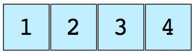
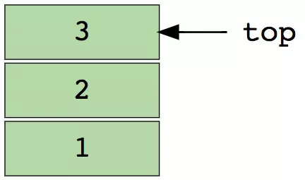
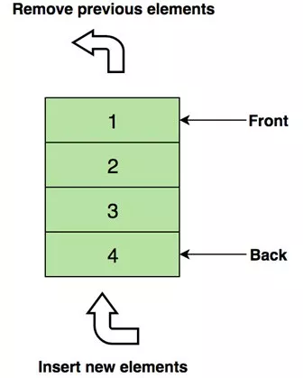
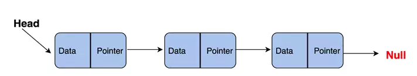
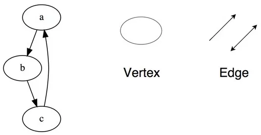
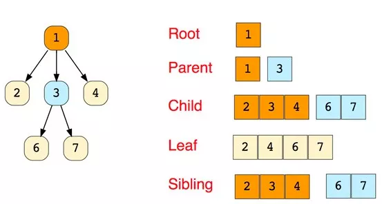
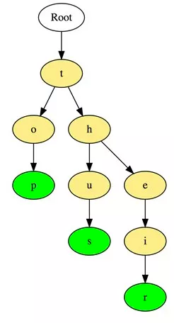
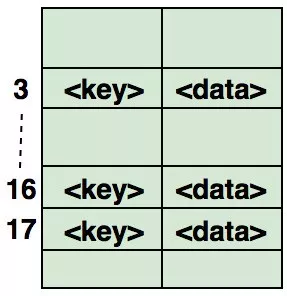

# 数据结构

→ 简单的数据结构

栈、队列、链表、数组、哈希表、

栈和队列的相同和不同之处

栈通常采用的两种存储结构

→ 树
二叉树、字典树、平衡树、排序树、

B 树、B+ 树、R 树、多路树、红黑树

→ 堆
大根堆、小根堆

→ 图
有向图、无向图、拓扑


## 什么是数据结构

简单地说，数据结构是以某种特定的布局方式存储数据的容器。这种“布局方式”决定了数据结构对于某些操作是高效的，而对于其他操作则是低效的。首先我们需要理解各种数据结构，才能在处理实际问题时选取最合适的数据结构。

## 为什么我们需要数据结构

数据是计算机科学当中最关键的实体，而数据结构则可以将数据以某种组织形式存储，因此，数据结构的价值不言而喻。

无论你以何种方式解决何种问题，你都需要处理数据——无论是涉及员工薪水、股票价格、购物清单，还是只是简单的电话簿问题。

数据需要根据不同的场景，按照特定的格式进行存储。有很多数据结构能够满足以不同格式存储数据的需求。

## 常见的数据结构

首先列出一些最常见的数据结构，我们将逐一说明：

* 数组
* 栈
* 队列
* 链表
* 树
* 图
* 字典树（这是一种高效的树形结构，但值得单独说明）
* 散列表（哈希表）

### 数组

数组是最简单、也是使用最广泛的数据结构。栈、队列等其他数据结构均由数组演变而来。下图是一个包含元素（1，2，3和4）的简单数组，数组长度为4。



每个数据元素都关联一个正数值，我们称之为索引，它表明数组中每个元素所在的位置。大部分语言将初始索引定义为零。关注Java技术栈微信公众号，回复"面试"获取更多博主精心整理的面试题。

以下是数组的两种类型：

*  一维数组（如上所示）
* 多维数组（数组的数组）

#### 数组的基本操作

* Insert——在指定索引位置插入一个元素
* Get——返回指定索引位置的元素
* Delete——删除指定索引位置的元素
* Size——得到数组所有元素的数量

#### 面试中关于数组的常见问题

* 寻找数组中第二小的元素
* 找到数组中第一个不重复出现的整数
* 合并两个有序数组
* 重新排列数组中的正值和负值

### 栈

著名的撤销操作几乎遍布任意一个应用。但你有没有思考过它是如何工作的呢？这个问题的解决思路是按照将最后的状态排列在先的顺序，在内存中存储历史工作状态（当然，它会受限于一定的数量）。这没办法用数组实现。但有了栈，这就变得非常方便了。

可以把栈想象成一列垂直堆放的书。为了拿到中间的书，你需要移除放置在这上面的所有书。这就是LIFO（后进先出）的工作原理。

下图是包含三个数据元素（1，2和3）的栈，其中顶部的3将被最先移除：



#### 栈的基本操作

* Push——在顶部插入一个元素
* Pop——返回并移除栈顶元素
* isEmpty——如果栈为空，则返回true
* Top——返回顶部元素，但并不移除它

#### 面试中关于栈的常见问题

* 使用栈计算后缀表达式
* 对栈的元素进行排序
* 判断表达式是否括号平衡

### 队列

与栈相似，队列是另一种顺序存储元素的线性数据结构。栈与队列的最大差别在于栈是LIFO（后进先出），而队列是FIFO，即先进先出。
一个完美的队列现实例子：售票亭排队队伍。如果有新人加入，他需要到队尾去排队，而非队首——排在前面的人会先拿到票，然后离开队伍。

下图是包含四个元素（1，2，3和4）的队列，其中在顶部的1将被最先移除：



移除先入队的元素、插入新元素

#### 队列的基本操作

* Enqueue() —— 在队列尾部插入元素
* Dequeue() ——移除队列头部的元素
* isEmpty()——如果队列为空，则返回true
* Top() ——返回队列的第一个元素

#### 面试中关于队列的常见问题

* 使用队列表示栈
* 对队列的前k个元素倒序
* 使用队列生成从1到n的二进制数

### 链表

链表是另一个重要的线性数据结构，乍一看可能有点像数组，但在内存分配、内部结构以及数据插入和删除的基本操作方面均有所不同。关注Java技术栈微信公众号，回复"面试"获取更多博主精心整理的面试题。

链表就像一个节点链，其中每个节点包含着数据和指向后续节点的指针。 链表还包含一个头指针，它指向链表的第一个元素，但当列表为空时，它指向null或无具体内容。

链表一般用于实现文件系统、哈希表和邻接表。

这是链表内部结构的展示：



链表包括以下类型：

* 单链表（单向）
* 双向链表（双向）

```java
class Node {
    int val;
    Node next;

    Node(int x) {
        val = x;
        next = null;
    }
}
```

链表两个著名的应用是栈Stack和队列Queue

**栈**

```java
class Stack{
    Node top; 

    public Node peek(){
        if(top != null){
            return top;
        }

        return null;
    }

    public Node pop(){
        if(top == null){
            return null;
        }else{
            Node temp = new Node(top.val);
            top = top.next;
            return temp;	
        }
    }

    public void push(Node n){
        if(n != null){
            n.next = top;
            top = n;
        }
    }
}
```

**队列**

```java
class Queue{
    Node first, last;

    public void enqueue(Node n){
        if(first == null){
            first = n;
            last = first;
        }else{
            last.next = n;
            last = n;
        }
    }

    public Node dequeue(){
        if(first == null){
            return null;
        }else{
            Node temp = new Node(first.val);
            first = first.next;
            return temp;
        }	
    }
}
```

#### 链表的基本操作：

* InsertAtEnd - 在链表的末尾插入指定元素
* InsertAtHead - 在链接列表的开头/头部插入指定元素
* Delete  - 从链接列表中删除指定元素
* DeleteAtHead - 删除链接列表的第一个元素
* Search  - 从链表中返回指定元素
* isEmpty - 如果链表为空，则返回true

#### 面试中关于链表的常见问题

* 反转链表
* 检测链表中的循环
* 返回链表倒数第N个节点
* 删除链表中的重复项

### 图

图是一组以网络形式相互连接的节点。节点也称为顶点。 一对节点（x，y）称为边（edge），表示顶点x连接到顶点y。边可以包含权重/成本，显示从顶点x到y所需的成本。



#### 图的类型

* 无向图
* 有向图

在程序语言中，图可以用两种形式表示

* 邻接矩阵
* 邻接表

#### 常见图遍历算法

* 广度优先搜索
* 深度优先搜索

#### 面试中关于图的常见问题

* 实现广度和深度优先搜索
* 检查图是否为树
* 计算图的边数
* 找到两个顶点之间的最短路径

一个简单的图广度优先搜索的实现

1. 定义GraphNode

```java
class GraphNode{ 
    int val;
    GraphNode next;
    GraphNode[] neighbors;
    boolean visited;

    GraphNode(int x) {
        val = x;
    }

    GraphNode(int x, GraphNode[] n){
        val = x;
        neighbors = n;
    }

    public String toString(){
        return "value: "+ this.val; 
    }
}
```

2. 定义一个队列Queue

```java
class Queue{
    GraphNode first, last;

    public void enqueue(GraphNode n){
        if(first == null){
            first = n;
            last = first;
        }else{
            last.next = n;
            last = n;
        }
    }

    public GraphNode dequeue(){
        if(first == null){
            return null;
        }else{
            GraphNode temp = new GraphNode(first.val, first.neighbors);
            first = first.next;
            return temp;
        }	
    }
}
```

3. 用队列Queue实现广度优先搜索

```java
public class GraphTest {

    public static void main(String[] args) {
        GraphNode n1 = new GraphNode(1); 
        GraphNode n2 = new GraphNode(2); 
        GraphNode n3 = new GraphNode(3); 
        GraphNode n4 = new GraphNode(4); 
        GraphNode n5 = new GraphNode(5); 

        n1.neighbors = new GraphNode[]{n2,n3,n5};
        n2.neighbors = new GraphNode[]{n1,n4};
        n3.neighbors = new GraphNode[]{n1,n4,n5};
        n4.neighbors = new GraphNode[]{n2,n3,n5};
        n5.neighbors = new GraphNode[]{n1,n3,n4};

        breathFirstSearch(n1, 5);
    }

    public static void breathFirstSearch(GraphNode root, int x){
        if(root.val == x)
            System.out.println("find in root");

        Queue queue = new Queue();
        root.visited = true;
        queue.enqueue(root);

        while(queue.first != null){
            GraphNode c = (GraphNode) queue.dequeue();
            for(GraphNode n: c.neighbors){

                if(!n.visited){
                    System.out.print(n + " ");
                    n.visited = true;
                    if(n.val == x)
                        System.out.println("Find "+n);
                    queue.enqueue(n);
                }
            }
        }
    }
}
```

输出:

```java
1   value: 2 value: 3 value: 5 Find value: 5
2   value: 4
```

### 树

树形结构是一种层级式的数据结构，由顶点（节点）和连接它们的边组成。 树类似于图，但区分树和图的重要特征是树中不存在环路。

树形结构被广泛应用于人工智能和复杂算法，它可以提供解决问题的有效存储机制。

这是一个简单树的示意图，以及树数据结构中使用的基本术语：



Root - 根节点
Parent - 父节点
Child - 子节点
Leaf - 叶子节点
Sibling - 兄弟节点

#### 以下是树形结构的主要类型：

* N元树
* 平衡树
* 二叉树
* 二叉搜索树
* AVL树
* 红黑树
* 2-3树

其中，二叉树和二叉搜索树是最常用的树。

#### 面试中关于树结构的常见问题：

* 求二叉树的高度
* 在二叉搜索树中查找第k个最大值
* 查找与根节点距离k的节点
* 在二叉树中查找给定节点的祖先节点

### 典树（Trie）

字典树，也称为“前缀树”，是一种特殊的树状数据结构，对于解决字符串相关问题非常有效。它能够提供快速检索，主要用于搜索字典中的单词，在搜索引擎中自动提供建议，甚至被用于IP的路由。

以下是在字典树中存储三个单词“top”，“so”和“their”的例子：



这些单词以顶部到底部的方式存储，其中绿色节点“p”，“s”和“r”分别表示“top”，“thus”和“theirs”的底部。

#### 面试中关于字典树的常见问题

* 计算字典树中的总单词数
* 打印存储在字典树中的所有单词
* 使用字典树对数组的元素进行排序
* 使用字典树从字典中形成单词
* 构建T9字典（字典树+ DFS ）

### 哈希表

哈希法（Hashing）是一个用于唯一标识对象并将每个对象存储在一些预先计算的唯一索引（称为“键（key）”）中的过程。因此，对象以键值对的形式存储，这些键值对的集合被称为“字典”。可以使用键搜索每个对象。基于哈希法有很多不同的数据结构，但最常用的数据结构是哈希表。

哈希表通常使用数组实现。

**散列数据结构的性能取决于以下三个因素：**

* 哈希函数
* 哈希表的大小
* 碰撞处理方法

下图为如何在数组中映射哈希键值对的说明。该数组的索引是通过哈希函数计算的。



#### 面试中关于哈希结构的常见问题：

* 在数组中查找对称键值对
* 追踪遍历的完整路径
* 查找数组是否是另一个数组的子集
* 检查给定的数组是否不相交
